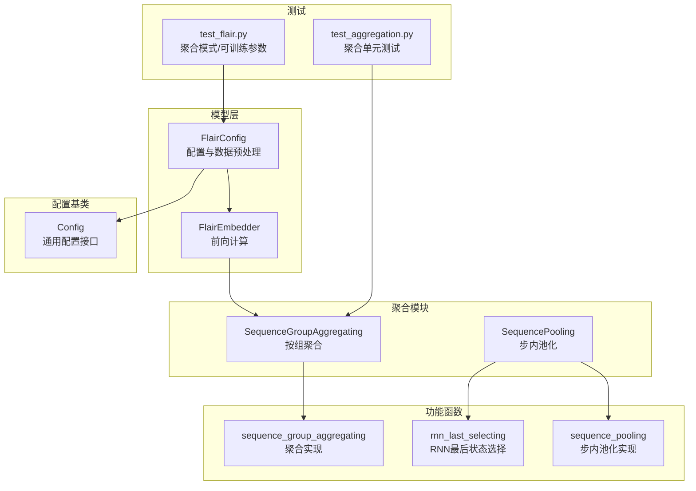
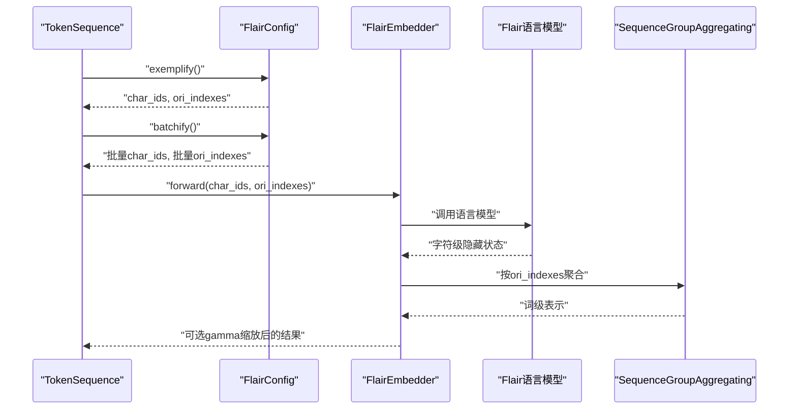
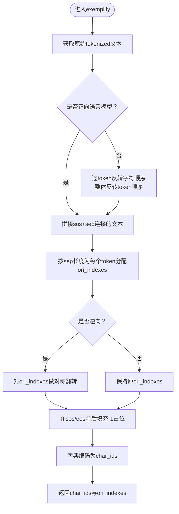
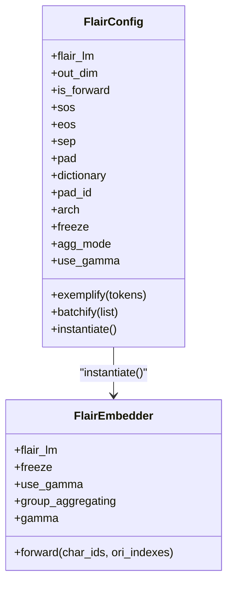
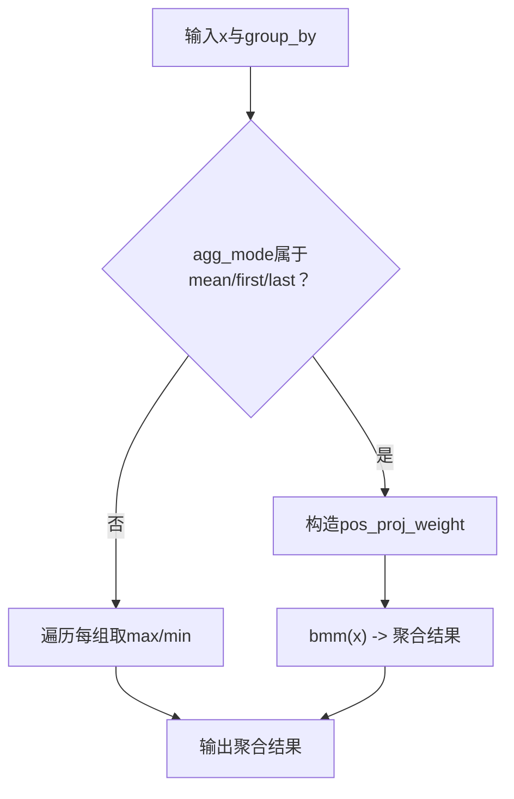
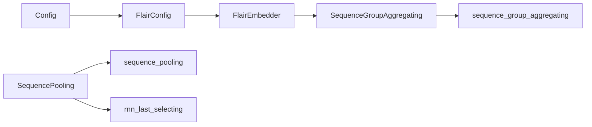

# Flair编码器

<cite>
**本文引用的文件**
- [eznlp/model/flair.py](file://eznlp/model/flair.py)
- [eznlp/nn/modules/aggregation.py](file://eznlp/nn/modules/aggregation.py)
- [eznlp/nn/functional.py](file://eznlp/nn/functional.py)
- [eznlp/config.py](file://eznlp/config.py)
- [tests/model/test_flair.py](file://tests/model/test_flair.py)
- [tests/nn/test_aggregation.py](file://tests/nn/test_aggregation.py)
- [eznlp/model/model/classifier.py](file://eznlp/model/model/classifier.py)
- [scripts/text_classification.py](file://scripts/text_classification.py)
</cite>

## 目录
1. [简介](#简介)
2. [项目结构](#项目结构)
3. [核心组件](#核心组件)
4. [架构总览](#架构总览)
5. [详细组件分析](#详细组件分析)
6. [依赖关系分析](#依赖关系分析)
7. [性能与优化建议](#性能与优化建议)
8. [故障排查指南](#故障排查指南)
9. [结论](#结论)
10. [附录：中文字符级语言模型集成配置示例](#附录中文字符级语言模型集成配置示例)

## 简介
本文件围绕Flair编码器展开，系统解析FlairConfig与FlairEmbedder的实现逻辑，重点阐释以下要点：
- is_forward参数在正向/逆向语言模型之间的切换机制
- sos、eos、sep、pad等特殊标记的处理方式
- ori_indexes在字符级到词级表示映射中的关键作用
- SequenceGroupAggregating在agg_mode（如last等）不同模式下的聚合行为
- use_gamma参数引入可学习缩放因子的设计考量
- 如何配置Flair编码器以支持中文字符级语言模型的集成

## 项目结构
Flair编码器位于模型层，配合通用配置基类与聚合模块共同工作；测试用例覆盖了聚合模式与可训练参数的行为验证。

图示来源
- [eznlp/model/flair.py](file://eznlp/model/flair.py#L1-L129)
- [eznlp/nn/modules/aggregation.py](file://eznlp/nn/modules/aggregation.py#L1-L106)
- [eznlp/nn/functional.py](file://eznlp/nn/functional.py#L1-L200)
- [eznlp/config.py](file://eznlp/config.py#L1-L173)
- [tests/model/test_flair.py](file://tests/model/test_flair.py#L1-L74)
- [tests/nn/test_aggregation.py](file://tests/nn/test_aggregation.py#L1-L85)

章节来源
- [eznlp/model/flair.py](file://eznlp/model/flair.py#L1-L129)
- [eznlp/nn/modules/aggregation.py](file://eznlp/nn/modules/aggregation.py#L1-L106)
- [eznlp/nn/functional.py](file://eznlp/nn/functional.py#L1-L200)
- [eznlp/config.py](file://eznlp/config.py#L1-L173)
- [tests/model/test_flair.py](file://tests/model/test_flair.py#L1-L74)
- [tests/nn/test_aggregation.py](file://tests/nn/test_aggregation.py#L1-L85)

## 核心组件
- FlairConfig：负责从预训练Flair语言模型读取配置（如隐藏维度、是否正向语言模型），定义特殊标记（sos、eos、sep、pad），生成字符级输入与ori_indexes，并提供批处理与实例化方法。
- FlairEmbedder：封装Flair语言模型调用，执行字符级到词级的聚合，并可选地对输出进行可学习缩放。

章节来源
- [eznlp/model/flair.py](file://eznlp/model/flair.py#L1-L129)

## 架构总览
Flair编码器的数据流从TokenSequence开始，经FlairConfig生成字符级索引与ori_indexes，再由FlairEmbedder调用底层Flair语言模型，最后通过SequenceGroupAggregating完成按词粒度的聚合。

图示来源
- [eznlp/model/flair.py](file://eznlp/model/flair.py#L42-L129)
- [eznlp/nn/modules/aggregation.py](file://eznlp/nn/modules/aggregation.py#L45-L75)

## 详细组件分析

### FlairConfig：正向/逆向切换与特殊标记处理
- is_forward参数来自底层Flair语言模型的属性，决定文本切分与拼接顺序。当为逆向时，会先反转每个token的字符顺序，再整体反转token顺序，从而适配逆向语言模型的上下文理解。
- 特殊标记：
  - sos：句子起始标记，默认为换行符
  - eos：句子结束标记，默认为空格
  - sep：词间分隔符，默认为空格
  - pad：填充符，默认为空格
- ori_indexes构建逻辑：
  - 基于原始tokenized文本，按sep长度扩展每个token的字符跨度
  - 在逆向模式下，ori_indexes按最大值对称翻转，确保字符级位置与词级位置一一对应
  - 在sos/eos前后填充-1占位，便于聚合时忽略这些特殊位置
- 批处理：
  - char_ids按字符步长进行padding，padding值为pad_id
  - ori_indexes按批次维进行padding，padding值为-1

图示来源
- [eznlp/model/flair.py](file://eznlp/model/flair.py#L42-L63)

章节来源
- [eznlp/model/flair.py](file://eznlp/model/flair.py#L11-L80)

### FlairEmbedder：聚合与可学习缩放
- 前向计算：
  - 调用底层Flair语言模型，得到字符级隐藏状态
  - 将隐藏状态转置为(batch, char_step, hid_dim)，再按ori_indexes进行聚合
  - 若use_gamma为真，则对聚合结果乘以可学习缩放因子gamma
- 冻结策略：
  - 通过freeze属性控制底层语言模型参数的梯度开关，实现冻结/解冻

图示来源
- [eznlp/model/flair.py](file://eznlp/model/flair.py#L11-L129)

章节来源
- [eznlp/model/flair.py](file://eznlp/model/flair.py#L82-L129)

### SequenceGroupAggregating：按组聚合与agg_mode
- 支持的聚合模式：mean、max、min、first、last
- 输入：
  - x：(batch, ori_step, hidden)
  - group_by：(batch, ori_step)，负值位置不参与聚合，未覆盖位置补零
- 实现要点：
  - 对于mean/first/last，内部构造投影权重矩阵后进行矩阵乘法聚合
  - 对于max/min，采用循环遍历的方式按组取极值
- 与rnn_last的关系：
  - 当agg_mode为“rnn_last”时，SequencePooling模块会调用rnn_last_selecting，将双向RNN最后一层的前向最后一个与后向第一个状态拼接作为序列表示

图示来源
- [eznlp/nn/modules/aggregation.py](file://eznlp/nn/modules/aggregation.py#L45-L75)
- [eznlp/nn/functional.py](file://eznlp/nn/functional.py#L99-L172)

章节来源
- [eznlp/nn/modules/aggregation.py](file://eznlp/nn/modules/aggregation.py#L1-L106)
- [eznlp/nn/functional.py](file://eznlp/nn/functional.py#L1-L200)

### use_gamma：可学习缩放因子的设计考量
- 设计动机：
  - 通过可学习缩放因子gamma，允许模型自适应地调整Flair特征的尺度，提升下游任务的拟合能力
  - 在冻结底层语言模型时，仅训练gamma参数，降低训练成本
- 参数统计：
  - 测试用例验证了freeze与use_gamma对可训练参数数量的影响

章节来源
- [eznlp/model/flair.py](file://eznlp/model/flair.py#L105-L108)
- [tests/model/test_flair.py](file://tests/model/test_flair.py#L52-L65)

### 关键参数与行为验证（测试）
- 聚合模式对比：测试用例展示了agg_mode为last与mean时，输出差异，验证了聚合逻辑正确性
- 可训练参数：测试用例验证了freeze与use_gamma对可训练参数数量的影响

章节来源
- [tests/model/test_flair.py](file://tests/model/test_flair.py#L1-L74)
- [tests/nn/test_aggregation.py](file://tests/nn/test_aggregation.py#L1-L85)

## 依赖关系分析
- FlairConfig依赖Config基类，提供统一的配置管理与实例化接口
- FlairEmbedder依赖SequenceGroupAggregating与底层Flair语言模型
- 聚合模块依赖nn.functional中sequence_group_aggregating、sequence_pooling、rnn_last_selecting等实现

图示来源
- [eznlp/config.py](file://eznlp/config.py#L1-L173)
- [eznlp/model/flair.py](file://eznlp/model/flair.py#L1-L129)
- [eznlp/nn/modules/aggregation.py](file://eznlp/nn/modules/aggregation.py#L1-L106)
- [eznlp/nn/functional.py](file://eznlp/nn/functional.py#L1-L200)

章节来源
- [eznlp/config.py](file://eznlp/config.py#L1-L173)
- [eznlp/model/flair.py](file://eznlp/model/flair.py#L1-L129)
- [eznlp/nn/modules/aggregation.py](file://eznlp/nn/modules/aggregation.py#L1-L106)
- [eznlp/nn/functional.py](file://eznlp/nn/functional.py#L1-L200)

## 性能与优化建议
- 冻结策略：在大规模预训练语言模型场景下，建议默认冻结底层语言模型参数，仅训练可选的gamma，以减少显存与训练时间
- 聚合模式选择：对于需要保留边界信息的任务，last模式通常更合适；若追求稳健的全局表征，mean模式可能更优
- 批处理效率：确保char_ids与ori_indexes的padding策略一致，避免额外的mask处理开销

[本节为通用建议，无需特定文件来源]

## 故障排查指南
- 聚合结果异常
  - 检查agg_mode是否与预期一致（last/mean/max/min/first）
  - 确认ori_indexes中负值位置是否被正确忽略
- 可训练参数数量不符
  - 检查freeze与use_gamma设置是否符合预期
  - 使用测试用例中的参数统计方法核对
- 序列长度与掩码
  - 若使用其他池化或聚合模块，注意mask与有效长度的一致性

章节来源
- [tests/model/test_flair.py](file://tests/model/test_flair.py#L52-L65)
- [tests/nn/test_aggregation.py](file://tests/nn/test_aggregation.py#L1-L85)

## 结论
Flair编码器通过FlairConfig与FlairEmbedder的协同，实现了从字符级到词级的有效映射与聚合。is_forward参数确保正向/逆向语言模型的兼容；sos、eos、sep、pad等特殊标记的处理保证了字符级与词级对齐；ori_indexes在字符级到词级映射中起到关键作用；SequenceGroupAggregating提供了灵活的聚合模式；use_gamma则为下游任务提供了可学习的缩放因子。整体设计兼顾了灵活性与可维护性。

[本节为总结，无需特定文件来源]

## 附录：中文字符级语言模型集成配置示例
以下步骤展示如何配置Flair编码器以支持中文字符级语言模型的集成（基于仓库现有脚本与配置模式）：

- 加载正向与逆向Flair语言模型
  - 参考脚本中加载正向与逆向Flair语言模型的方式，分别创建对应的FlairConfig实例
- 配置Flair编码器
  - 设置agg_mode为适合中文任务的模式（如last）
  - 根据需要启用use_gamma以引入可学习缩放因子
  - 默认冻结底层语言模型参数，仅训练gamma
- 在分类器配置中启用Flair
  - 在模型配置中添加flair_fw与flair_bw两个子模块，以便同时利用正向与逆向上下文
- 训练与推理
  - 使用FlairConfig.exemplify与batchify生成字符级输入与ori_indexes
  - 将生成的张量传入FlairEmbedder进行前向计算

章节来源
- [scripts/text_classification.py](file://scripts/text_classification.py#L111-L125)
- [eznlp/model/model/classifier.py](file://eznlp/model/model/classifier.py#L16-L47)
- [eznlp/model/flair.py](file://eznlp/model/flair.py#L11-L80)