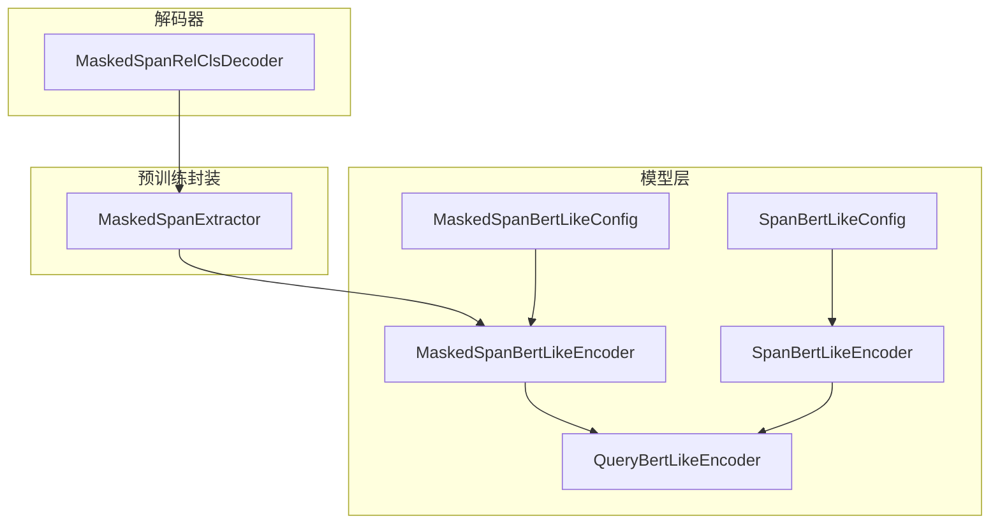
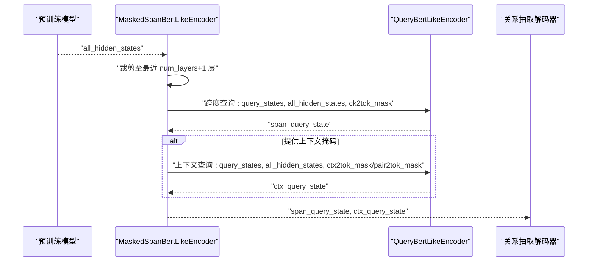
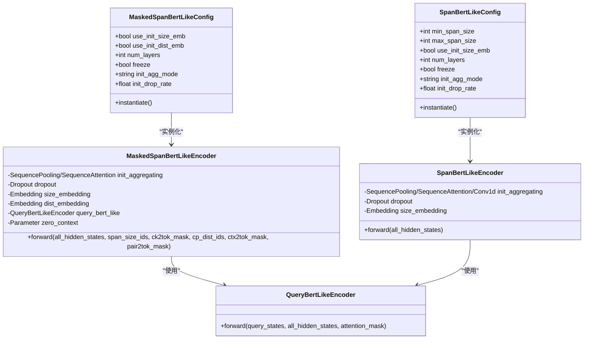
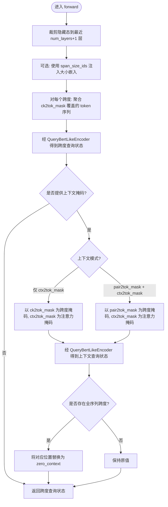
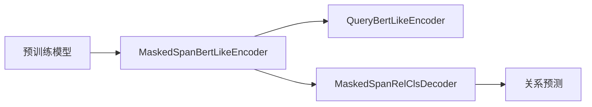

# 掩码跨度-BERT-Like编码器

<cite>
**本文引用的文件列表**
- [masked_span_bert_like.py](file://eznlp/model/masked_span_bert_like.py)
- [span_bert_like.py](file://eznlp/model/span_bert_like.py)
- [query_bert_like.py](file://eznlp/nn/modules/query_bert_like.py)
- [masked_span_extractor.py](file://eznlp/model/model/masked_span_extractor.py)
- [masked_span_rel_classification.py](file://eznlp/model/decoder/masked_span_rel_classification.py)
- [test_masked_span_bert_like.py](file://tests/model/test_masked_span_bert_like.py)
- [test_span_bert_like.py](file://tests/model/test_span_bert_like.py)
</cite>

## 目录
1. [引言](#引言)
2. [项目结构](#项目结构)
3. [核心组件](#核心组件)
4. [架构总览](#架构总览)
5. [详细组件分析](#详细组件分析)
6. [依赖关系分析](#依赖关系分析)
7. [性能考量](#性能考量)
8. [故障排查指南](#故障排查指南)
9. [结论](#结论)
10. [附录：联合实体关系抽取配置示例](#附录联合实体关系抽取配置示例)

## 引言
本文件系统性阐述 MaskedSpanBertLikeConfig 与 MaskedSpanBertLikeEncoder 的设计原理，重点对比其与 Span-BERT-Like 编码器（参考 SpanBertLikeConfig/SpanBertLikeEncoder）的差异；深入解析 use_init_dist_emb 在上下文距离建模中的作用，cp_dist_ids 在关系抽取任务中的机制；阐明 ck2tok_mask、ctx2tok_mask、pair2tok_mask 三类注意力掩码的协同工作机制，并解释 zero_context 参数在处理全序列跨度时的特殊意义。最后给出联合实体关系抽取任务中的配置方法与实践建议。

## 项目结构
围绕“掩码跨度-BERT-Like 编码器”的关键文件组织如下：
- 模型定义与编码器：masked_span_bert_like.py、span_bert_like.py、query_bert_like.py
- 预训练模型封装与前向状态提取：masked_span_extractor.py
- 关系抽取解码器（支持掩码跨度）：masked_span_rel_classification.py
- 测试用例：test_masked_span_bert_like.py、test_span_bert_like.py

图表来源
- [masked_span_bert_like.py](file://eznlp/model/masked_span_bert_like.py#L1-L236)
- [span_bert_like.py](file://eznlp/model/span_bert_like.py#L1-L181)
- [query_bert_like.py](file://eznlp/nn/modules/query_bert_like.py#L234-L330)
- [masked_span_extractor.py](file://eznlp/model/model/masked_span_extractor.py#L1-L109)
- [masked_span_rel_classification.py](file://eznlp/model/decoder/masked_span_rel_classification.py#L1-L566)

章节来源
- [masked_span_bert_like.py](file://eznlp/model/masked_span_bert_like.py#L1-L236)
- [span_bert_like.py](file://eznlp/model/span_bert_like.py#L1-L181)
- [query_bert_like.py](file://eznlp/nn/modules/query_bert_like.py#L234-L330)
- [masked_span_extractor.py](file://eznlp/model/model/masked_span_extractor.py#L1-L109)
- [masked_span_rel_classification.py](file://eznlp/model/decoder/masked_span_rel_classification.py#L1-L566)

## 核心组件
- MaskedSpanBertLikeConfig：负责构建 MaskedSpanBertLikeEncoder 的配置项，包括是否使用初始大小嵌入 use_init_size_emb、是否使用初始距离嵌入 use_init_dist_emb、层数选择 num_layers、冻结策略 freeze、聚合模式 init_agg_mode、丢弃率 init_drop_rate 等。
- MaskedSpanBertLikeEncoder：对给定的跨度集合进行编码，支持两种查询路径：
  - 跨度查询：以 ck2tok_mask 对应的 token 范围为上下文，计算跨度表示；
  - 上下文查询：可选地基于 ctx2tok_mask 或 pair2tok_mask 计算成对上下文表示，用于关系抽取。
- SpanBertLikeConfig/SpanBertLikeEncoder：传统 Span-BERT-Like 实现，按固定跨度尺寸遍历所有可能跨度，不区分“跨度查询”和“上下文查询”，也不直接支持掩码跨度的灵活上下文建模。
- QueryBertLikeEncoder：将 BERT/BiLERT 的编码器层改写为“查询-隐藏态交叉注意力”结构，作为编码器核心模块。

章节来源
- [masked_span_bert_like.py](file://eznlp/model/masked_span_bert_like.py#L13-L112)
- [masked_span_bert_like.py](file://eznlp/model/masked_span_bert_like.py#L113-L236)
- [span_bert_like.py](file://eznlp/model/span_bert_like.py#L13-L122)
- [span_bert_like.py](file://eznlp/model/span_bert_like.py#L123-L181)
- [query_bert_like.py](file://eznlp/nn/modules/query_bert_like.py#L234-L330)

## 架构总览
掩码跨度编码器的整体数据流如下：
- 输入：预训练模型输出的所有隐藏态（包含多层），以及各类掩码张量（跨度到token、上下文到token、成对上下文到token）。
- 处理：
  - 跨度查询路径：以 ck2tok_mask 为注意力掩码，对每个跨度对应的 token 序列进行聚合，得到跨度查询向量，再经 QueryBertLikeEncoder 多层编码得到跨度查询状态。
  - 上下文查询路径（可选）：
    - 若仅提供 ctx2tok_mask：以 pair2tok_mask（或 ck2tok_mask）为跨度掩码，以 ctx2tok_mask 为注意力掩码，得到成对上下文查询状态。
    - 若同时提供 pair2tok_mask 和 ctx2tok_mask：以 pair2tok_mask 为跨度掩码，以 ctx2tok_mask 为注意力掩码，得到成对上下文查询状态。
  - 可选的距离嵌入：当 use_init_dist_emb 启用且提供 cp_dist_ids 时，为每对跨度注入距离嵌入。
  - 全序列跨度的零上下文：当某条样本的跨度覆盖整个序列时，返回 zero_context 作为其查询状态。
- 输出：返回各查询路径的最终查询状态字典，供后续解码器使用。

图表来源
- [masked_span_bert_like.py](file://eznlp/model/masked_span_bert_like.py#L185-L236)
- [query_bert_like.py](file://eznlp/nn/modules/query_bert_like.py#L279-L330)
- [masked_span_rel_classification.py](file://eznlp/model/decoder/masked_span_rel_classification.py#L289-L566)

## 详细组件分析

### 设计差异：MaskedSpanBertLikeEncoder vs SpanBertLikeEncoder
- 跨度枚举方式：
  - SpanBertLikeEncoder：按固定跨度尺寸范围遍历所有可能跨度，生成统一维度的跨度表示。
  - MaskedSpanBertLikeEncoder：输入为用户指定的“实际跨度集合”，无需遍历所有跨度，更灵活高效。
- 查询路径：
  - SpanBertLikeEncoder：单一查询路径，直接对跨度 token 序列进行编码。
  - MaskedSpanBertLikeEncoder：支持“跨度查询”和“上下文查询”两条路径，后者可引入 pair2tok_mask、ctx2tok_mask 进行成对上下文建模。
- 嵌入与初始化：
  - 两者均可启用 use_init_size_emb；MaskedSpanBertLikeEncoder 还可启用 use_init_dist_emb 并使用 cp_dist_ids。
- 冻结与权重共享：
  - 两者均支持 freeze 与 share_weights；但 MaskedSpanBertLikeEncoder 的内部权重共享策略与 SpanBertLikeEncoder 不同，详见下文。

章节来源
- [span_bert_like.py](file://eznlp/model/span_bert_like.py#L123-L181)
- [masked_span_bert_like.py](file://eznlp/model/masked_span_bert_like.py#L113-L236)

### use_init_dist_emb 与 cp_dist_ids：上下文距离建模
- use_init_dist_emb：
  - 当启用时，编码器会为每对跨度注入距离嵌入，用于显式建模跨度之间的相对位置关系。
- cp_dist_ids：
  - 解码器在构造批次时，会为每对跨度计算距离并填充到 cp_dist_ids，随后传入编码器。
- 作用机制：
  - 在上下文查询路径中，若启用 use_init_dist_emb，则将 dist_embedding(cp_dist_ids) 作为初始上下文嵌入加入到查询状态的聚合阶段，从而在关系分类时融合距离信息。

章节来源
- [masked_span_bert_like.py](file://eznlp/model/masked_span_bert_like.py#L68-L91)
- [masked_span_bert_like.py](file://eznlp/model/masked_span_bert_like.py#L211-L233)
- [masked_span_rel_classification.py](file://eznlp/model/decoder/masked_span_rel_classification.py#L191-L244)

### 三种注意力掩码的协同工作
- ck2tok_mask（跨度到 token 掩码）：
  - 定义每个跨度覆盖的 token 区域；用于“跨度查询”路径的注意力掩码，确保只关注跨度内的 token。
- ctx2tok_mask（上下文到 token 掩码）：
  - 定义每个样本的上下文区域；用于“上下文查询”路径的注意力掩码，控制上下文窗口。
- pair2tok_mask（成对跨度到 token 掩码）：
  - 仅在成对上下文模式下使用，定义每对跨度共同覆盖的 token 区域；用于“上下文查询”路径的跨度掩码，使上下文查询针对成对跨度的联合区域。
- 协同逻辑：
  - 跨度查询：以 ck2tok_mask 为注意力掩码，聚合跨度 token 序列。
  - 上下文查询（仅 ctx2tok_mask）：以 ck2tok_mask 为跨度掩码，以 ctx2tok_mask 为注意力掩码，得到成对上下文表示。
  - 上下文查询（pair2tok_mask + ctx2tok_mask）：以 pair2tok_mask 为跨度掩码，以 ctx2tok_mask 为注意力掩码，得到成对上下文表示。
  - 注意力掩码扩展：编码器内部会将二维/三维掩码扩展为四维，以便与多头注意力兼容。

章节来源
- [masked_span_bert_like.py](file://eznlp/model/masked_span_bert_like.py#L107-L122)
- [masked_span_bert_like.py](file://eznlp/model/masked_span_bert_like.py#L123-L184)
- [masked_span_rel_classification.py](file://eznlp/model/decoder/masked_span_rel_classification.py#L208-L243)

### zero_context：全序列跨度的特殊处理
- 当某个跨度覆盖整个序列时，编码器会检测该跨度是否为“全序列跨度”（即其 token 掩码全为已覆盖），此时不会产生有效注意力，返回的查询状态会被替换为 zero_context。
- zero_context 是一个可训练的向量参数，用于在无法从注意力聚合中获得有效表示时提供稳定的上下文表示。

章节来源
- [masked_span_bert_like.py](file://eznlp/model/masked_span_bert_like.py#L89-L91)
- [masked_span_bert_like.py](file://eznlp/model/masked_span_bert_like.py#L175-L183)

### 类关系图（代码级）

图表来源
- [masked_span_bert_like.py](file://eznlp/model/masked_span_bert_like.py#L13-L112)
- [masked_span_bert_like.py](file://eznlp/model/masked_span_bert_like.py#L113-L236)
- [span_bert_like.py](file://eznlp/model/span_bert_like.py#L13-L122)
- [span_bert_like.py](file://eznlp/model/span_bert_like.py#L123-L181)
- [query_bert_like.py](file://eznlp/nn/modules/query_bert_like.py#L234-L330)

### 算法流程图（编码器主流程）

图表来源
- [masked_span_bert_like.py](file://eznlp/model/masked_span_bert_like.py#L185-L236)

## 依赖关系分析
- 组件耦合：
  - MaskedSpanBertLikeEncoder 依赖 QueryBertLikeEncoder 实现跨注意力编码，二者通过 all_hidden_states 与 attention_mask 交互。
  - 解码器（MaskedSpanRelClsDecoder）依赖编码器输出的 span_query_state 与 ctx_query_state，形成端到端的关系抽取流水线。
- 外部依赖：
  - 预训练模型（如 BERT/ALBERT）的 encoder 层被复用，通过 share_weights 控制是否共享参数。
- 潜在循环依赖：
  - 未发现循环依赖；编码器与解码器之间通过状态字典传递，解耦良好。

图表来源
- [masked_span_bert_like.py](file://eznlp/model/masked_span_bert_like.py#L185-L236)
- [query_bert_like.py](file://eznlp/nn/modules/query_bert_like.py#L279-L330)
- [masked_span_rel_classification.py](file://eznlp/model/decoder/masked_span_rel_classification.py#L289-L566)

章节来源
- [masked_span_bert_like.py](file://eznlp/model/masked_span_bert_like.py#L185-L236)
- [query_bert_like.py](file://eznlp/nn/modules/query_bert_like.py#L279-L330)
- [masked_span_rel_classification.py](file://eznlp/model/decoder/masked_span_rel_classification.py#L289-L566)

## 性能考量
- 计算复杂度：
  - 跨度查询与上下文查询分别独立进行，复杂度与跨度数量和 token 数量成正比；相比遍历所有跨度的 SpanBertLikeEncoder，掩码跨度版本在实际任务中通常更高效。
- 内存占用：
  - 通过 num_layers 限制参与编码的隐藏态层数，减少内存开销。
  - 可选的冻结策略（freeze）可进一步降低参数更新成本。
- 注意力掩码扩展：
  - 编码器内部会将二维/三维掩码扩展为四维，注意避免不必要的广播与重复计算。

[本节为通用指导，不直接分析具体文件]

## 故障排查指南
- 全序列跨度导致 NaN：
  - 当跨度覆盖整个序列时，注意力掩码可能全为无效位置，编码器会用 zero_context 替换；若仍出现异常，检查 ck2tok_mask 是否正确设置。
- 上下文掩码形状不匹配：
  - 注意编码器内部会将掩码扩展为四维，确保传入的 ctx2tok_mask/pair2tok_mask 形状与批次、跨度数一致。
- 距离嵌入未生效：
  - 确认 use_init_dist_emb 已启用，且 cp_dist_ids 正确传入；否则编码器不会注入距离嵌入。
- 冻结参数不生效：
  - 检查 freeze 设置与 share_weights_ext 的组合，确保外部参数共享策略符合预期。

章节来源
- [masked_span_bert_like.py](file://eznlp/model/masked_span_bert_like.py#L107-L122)
- [masked_span_bert_like.py](file://eznlp/model/masked_span_bert_like.py#L175-L183)
- [test_masked_span_bert_like.py](file://tests/model/test_masked_span_bert_like.py#L1-L121)

## 结论
MaskedSpanBertLikeEncoder 通过“掩码跨度”的方式，将传统 Span-BERT-Like 的全跨度枚举改为面向实际标注跨度的高效编码，同时引入上下文查询路径与距离嵌入，显著增强了关系抽取任务的表达能力。其与 SpanBertLikeEncoder 的核心差异体现在：灵活性、上下文建模与距离感知。合理配置 ck2tok_mask、ctx2tok_mask、pair2tok_mask，以及 use_init_dist_emb、zero_context，可在联合实体关系抽取任务中取得更优效果。

[本节为总结性内容，不直接分析具体文件]

## 附录：联合实体关系抽取配置示例
以下步骤展示如何在联合实体关系抽取任务中配置掩码跨度编码器与解码器：
1. 配置预训练模型与编码器
   - 将预训练模型设置为输出所有隐藏态（确保 output_hidden_states=True）。
   - 创建 MaskedSpanBertLikeConfig，设置 use_init_size_emb、use_init_dist_emb、num_layers、freeze 等参数。
2. 构造掩码
   - 为每个样本的跨度集合生成 ck2tok_mask（跨度到 token 掩码）。
   - 若采用成对上下文模式，同时生成 pair2tok_mask（成对跨度到 token 掩码）与 ctx2tok_mask（上下文到 token 掩码）。
   - 计算每对跨度的距离并生成 cp_dist_ids，用于距离嵌入。
3. 批次化与传递
   - 解码器会自动将掩码扩展为批次维度，并填充 pad 值。
   - 将 span_size_ids、cp_dist_ids、ck2tok_mask、ctx2tok_mask、pair2tok_mask 一并传入编码器。
4. 前向与解码
   - 编码器返回 span_query_state 与 ctx_query_state。
   - 解码器根据这些状态进行实体边界与关系分类，得到最终预测结果。

章节来源
- [masked_span_extractor.py](file://eznlp/model/model/masked_span_extractor.py#L80-L109)
- [masked_span_rel_classification.py](file://eznlp/model/decoder/masked_span_rel_classification.py#L191-L284)
- [test_masked_span_bert_like.py](file://tests/model/test_masked_span_bert_like.py#L73-L101)