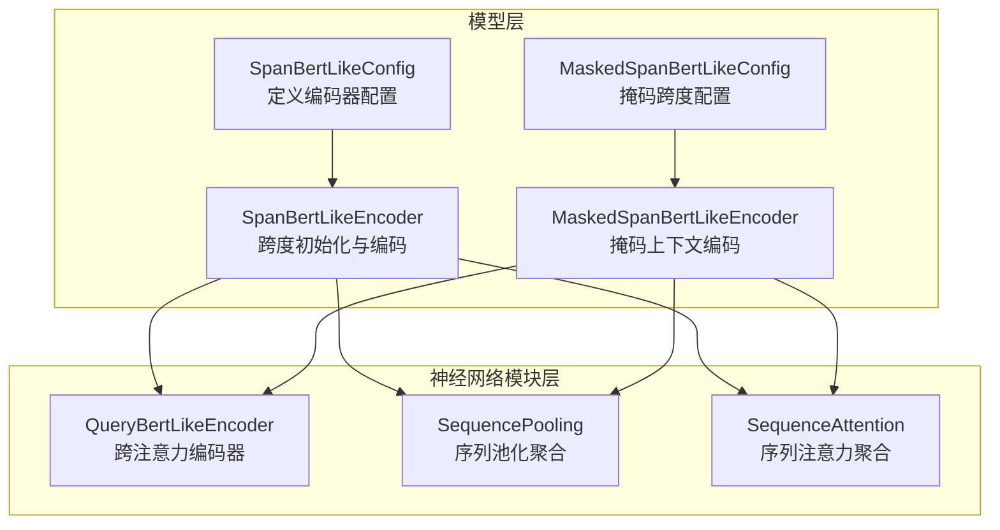
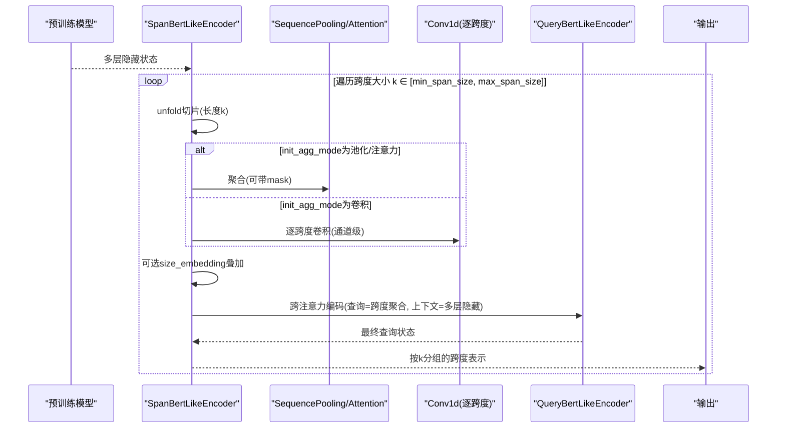
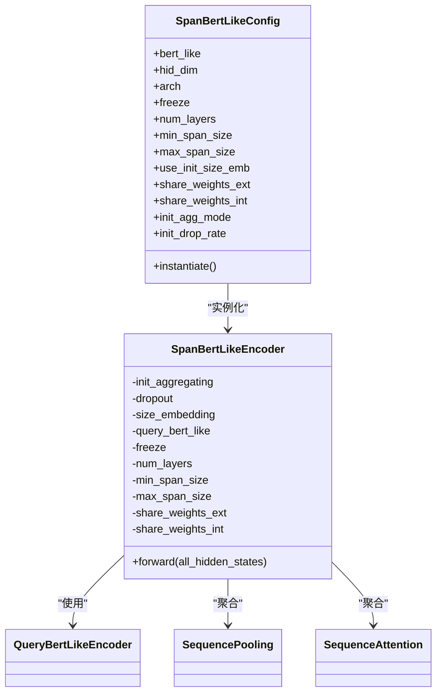
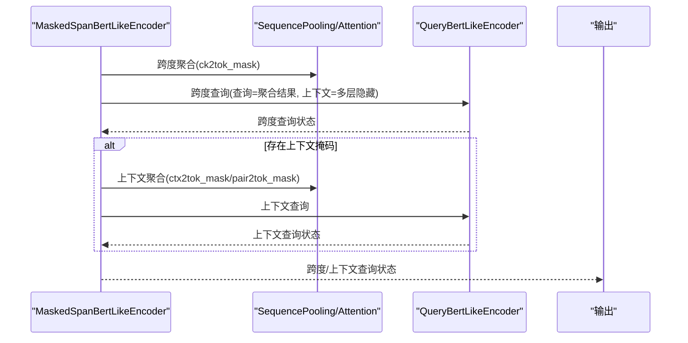
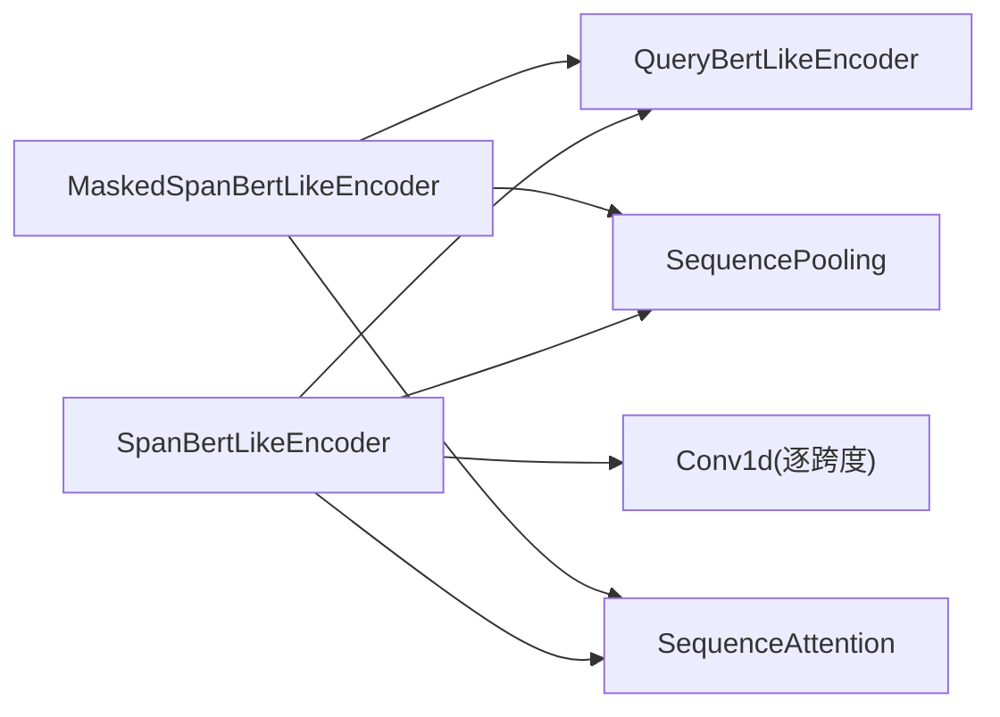

# Span-BERT-Like编码器

<cite>
**本文引用的文件**
- [span_bert_like.py](file://eznlp/model/span_bert_like.py)
- [masked_span_bert_like.py](file://eznlp/model/masked_span_bert_like.py)
- [query_bert_like.py](file://eznlp/nn/modules/query_bert_like.py)
- [aggregation.py](file://eznlp/nn/modules/aggregation.py)
- [attention.py](file://eznlp/nn/modules/attention.py)
- [test_span_bert_like.py](file://tests/model/test_span_bert_like.py)
- [test_masked_span_bert_like.py](file://tests/model/test_masked_span_bert_like.py)
</cite>

## 目录
1. [引言](#引言)
2. [项目结构](#项目结构)
3. [核心组件](#核心组件)
4. [架构总览](#架构总览)
5. [详细组件分析](#详细组件分析)
6. [依赖关系分析](#依赖关系分析)
7. [性能考量](#性能考量)
8. [故障排查指南](#故障排查指南)
9. [结论](#结论)
10. [附录：嵌套实体识别配置示例](#附录嵌套实体识别配置示例)

## 引言
本文件系统性解析Span-BERT-Like编码器的实现机制，聚焦于SpanBertLikeConfig与SpanBertLikeEncoder在跨度抽取任务中的应用。文档重点阐述以下关键点：
- min_span_size与max_span_size对模型行为与输出跨度范围的影响
- use_init_size_emb在跨度大小建模中的作用与使用方式
- share_weights_ext与share_weights_int在权重共享策略中的区别与联系
- init_agg_mode（max_pooling、mean_pooling、conv）在不同场景下的性能与适用性
- 结合测试用例与源码路径，给出嵌套实体识别任务的配置思路与实践建议

## 项目结构
Span-BERT-Like相关代码位于模型层与神经网络模块层：
- 模型层：SpanBertLikeConfig/Encoder与MaskedSpanBertLikeConfig/Encoder
- 神经网络模块层：QueryBertLikeEncoder、SequencePooling、SequenceAttention等

图表来源
- [span_bert_like.py](file://eznlp/model/span_bert_like.py#L13-L181)
- [masked_span_bert_like.py](file://eznlp/model/masked_span_bert_like.py#L13-L236)
- [query_bert_like.py](file://eznlp/nn/modules/query_bert_like.py#L234-L330)
- [aggregation.py](file://eznlp/nn/modules/aggregation.py#L13-L43)
- [attention.py](file://eznlp/nn/modules/attention.py#L10-L233)

章节来源
- [span_bert_like.py](file://eznlp/model/span_bert_like.py#L13-L181)
- [masked_span_bert_like.py](file://eznlp/model/masked_span_bert_like.py#L13-L236)

## 核心组件
- SpanBertLikeConfig：负责读取预训练模型配置、设置层数、跨度范围、是否共享权重、初始聚合模式与dropout等；提供实例化接口生成SpanBertLikeEncoder。
- SpanBertLikeEncoder：对输入的多层隐藏状态进行跨度切片与聚合，构建查询向量并通过QueryBertLikeEncoder进行跨注意力编码，输出各跨度大小的最终表示。
- MaskedSpanBertLikeConfig/Encoder：在SpanBertLike基础上引入掩码与可选的距离嵌入，支持“跨度查询”和“上下文查询”，用于更复杂的抽取任务（如关系抽取或嵌套实体识别）。

章节来源
- [span_bert_like.py](file://eznlp/model/span_bert_like.py#L13-L181)
- [masked_span_bert_like.py](file://eznlp/model/masked_span_bert_like.py#L13-L236)

## 架构总览
SpanBertLikeEncoder的关键流程：
- 输入为预训练模型输出的多层隐藏状态
- 对每个跨度大小k，通过unfold切片得到所有长度为k的片段
- 使用init_agg_mode选择初始聚合方式（池化/注意力/卷积）
- 可选加入use_init_size_emb的跨度大小嵌入
- 通过QueryBertLikeEncoder对查询向量与上下文进行跨注意力编码
- 输出按跨度大小分组的最终查询状态

图表来源
- [span_bert_like.py](file://eznlp/model/span_bert_like.py#L57-L181)
- [query_bert_like.py](file://eznlp/nn/modules/query_bert_like.py#L234-L330)
- [aggregation.py](file://eznlp/nn/modules/aggregation.py#L13-L43)
- [attention.py](file://eznlp/nn/modules/attention.py#L10-L233)

## 详细组件分析

### SpanBertLikeConfig与SpanBertLikeEncoder
- 参数与约束
  - min_span_size/max_span_size：决定跨度枚举范围，影响输出跨度数量与计算复杂度
  - use_init_size_emb：启用后为每个跨度大小学习嵌入，有助于区分不同跨度长度的语义
  - share_weights_ext：外部权重共享，即QueryBertLikeEncoder复用预训练模型的权重
  - share_weights_int：内部权重共享，即不同跨度大小共享同一QueryBertLikeEncoder实例
  - init_agg_mode：初始聚合模式，支持max_pooling、mean_pooling、conv等
  - init_drop_rate：初始聚合阶段的dropout率
- 初始化逻辑
  - 根据init_agg_mode选择SequencePooling/SequenceAttention或ModuleList的Conv1d（通道级卷积）
  - 若use_init_size_emb，则注册跨度大小嵌入表，并裁剪到max_size_id
  - 根据share_weights_int选择共享或为每跨度大小创建独立的QueryBertLikeEncoder
  - 冻结策略由freeze控制，冻结时QueryBertLikeEncoder不参与反向传播
- 前向流程
  - 截取最近num_layers+1层隐藏状态
  - 对每个k从1到min(max_span_size, num_steps)，执行切片、聚合、可选size_embedding叠加、跨注意力编码
  - 返回按跨度大小k分组的最终查询状态字典

图表来源
- [span_bert_like.py](file://eznlp/model/span_bert_like.py#L13-L181)
- [query_bert_like.py](file://eznlp/nn/modules/query_bert_like.py#L234-L330)
- [aggregation.py](file://eznlp/nn/modules/aggregation.py#L13-L43)
- [attention.py](file://eznlp/nn/modules/attention.py#L10-L233)

章节来源
- [span_bert_like.py](file://eznlp/model/span_bert_like.py#L13-L181)

### 参数影响与行为分析

- min_span_size与max_span_size
  - 影响遍历的跨度大小范围，输出字典键集合为[min_span_size, min(max_span_size, num_steps)]，每个k对应一个跨度表示张量
  - 测试用例验证了输出跨度数量与位置正确性，且跨度表示与token表示差异显著
  - 在嵌套实体识别中，较小的min_span_size可捕获更多细粒度跨度，但会增加计算开销

- use_init_size_emb
  - 启用后为每个跨度大小学习嵌入，并在聚合后与查询向量相加
  - 测试用例展示了该嵌入与掩码版本的编码器一致性的对比思路（通过deepcopy共享嵌入）

- share_weights_ext与share_weights_int
  - share_weights_ext控制QueryBertLikeEncoder是否复用预训练权重
  - share_weights_int控制不同跨度大小是否共享同一QueryBertLikeEncoder实例
  - 存在断言：若不共享外部权重，则必须共享内部权重
  - 测试用例验证了冻结与共享策略对参数量的影响

- init_agg_mode（max_pooling、mean_pooling、conv）
  - 池化/注意力：对长度k的片段序列进行全局聚合，得到(B, 1, H)的查询向量
  - 卷积：为每个跨度大小k构造通道级卷积核（核大小k），权重初始化为均值池化核，实现等价的滑动窗口平均
  - 性能与适用性
    - 池化/注意力：计算简单、参数少，适合快速建模跨度语义
    - 卷积：具有局部平滑特性，可能在某些跨度长度上更稳健，但参数随跨度大小线性增长

章节来源
- [test_span_bert_like.py](file://tests/model/test_span_bert_like.py#L10-L86)
- [test_masked_span_bert_like.py](file://tests/model/test_masked_span_bert_like.py#L12-L121)
- [span_bert_like.py](file://eznlp/model/span_bert_like.py#L57-L181)

### 掩码跨度编码（MaskedSpanBertLike）
- 相比SpanBertLike，MaskedSpanBertLike引入：
  - 跨度掩码ck2tok_mask与上下文掩码ctx2tok_mask/pair2tok_mask
  - 可选use_init_size_emb与use_init_dist_emb（距离嵌入）
  - 零上下文特殊向量zero_context以处理全掩码情况
- 前向流程
  - 先对跨度进行编码，再可选对上下文进行编码（pair2tok_mask存在时可引入距离嵌入）
  - 对全掩码样本，返回zero_context作为查询状态

图表来源
- [masked_span_bert_like.py](file://eznlp/model/masked_span_bert_like.py#L56-L236)
- [query_bert_like.py](file://eznlp/nn/modules/query_bert_like.py#L234-L330)
- [aggregation.py](file://eznlp/nn/modules/aggregation.py#L13-L43)
- [attention.py](file://eznlp/nn/modules/attention.py#L10-L233)

章节来源
- [masked_span_bert_like.py](file://eznlp/model/masked_span_bert_like.py#L13-L236)

## 依赖关系分析
- 组件耦合
  - SpanBertLikeEncoder依赖QueryBertLikeEncoder进行跨注意力编码，二者通过共享权重策略耦合
  - 初始聚合模块（SequencePooling/SequenceAttention/Conv1d）与QueryBertLikeEncoder解耦，便于替换
- 外部依赖
  - 预训练模型（如BERT/ALBERT）的encoder作为QueryBertLikeEncoder的底层实现
  - 掩码机制依赖注意力掩码扩展函数

图表来源
- [span_bert_like.py](file://eznlp/model/span_bert_like.py#L57-L181)
- [masked_span_bert_like.py](file://eznlp/model/masked_span_bert_like.py#L56-L236)
- [query_bert_like.py](file://eznlp/nn/modules/query_bert_like.py#L234-L330)
- [aggregation.py](file://eznlp/nn/modules/aggregation.py#L13-L43)
- [attention.py](file://eznlp/nn/modules/attention.py#L10-L233)

章节来源
- [span_bert_like.py](file://eznlp/model/span_bert_like.py#L57-L181)
- [masked_span_bert_like.py](file://eznlp/model/masked_span_bert_like.py#L56-L236)

## 性能考量
- 计算复杂度
  - 对每个跨度大小k，需要对所有长度为k的片段进行聚合与跨注意力编码，整体复杂度与Σ(1..K)(L−k+1)×复杂度(k)成正比
  - share_weights_int可显著降低参数量与内存占用，尤其在跨度范围较大时
- 内存占用
  - 卷积聚合为每个k维护独立卷积核，参数量随跨度范围线性增长
  - 池化/注意力聚合参数量相对稳定
- 训练稳定性
  - init_drop_rate与冻结策略有助于防止过拟合
  - use_init_size_emb引入额外嵌入，需合理初始化与正则化

[本节为通用指导，无需列出具体文件来源]

## 故障排查指南
- 输出跨度数量异常
  - 检查min_span_size与max_span_size是否在有效范围内，且不超过序列长度
  - 参考测试用例对输出形状的断言
- 参数量与冻结策略不符预期
  - 确认share_weights_int与freeze设置，以及预训练模型的层数配置
- 掩码导致NaN或梯度异常
  - 检查ck2tok_mask与ctx2tok_mask是否正确构造，避免全掩码情况
  - 关注zero_context的使用与条件分支

章节来源
- [test_span_bert_like.py](file://tests/model/test_span_bert_like.py#L10-L86)
- [test_masked_span_bert_like.py](file://tests/model/test_masked_span_bert_like.py#L12-L121)
- [masked_span_bert_like.py](file://eznlp/model/masked_span_bert_like.py#L107-L184)

## 结论
Span-BERT-Like编码器通过“跨度切片+初始聚合+跨注意力编码”的范式，实现了高效的跨度抽取。关键在于：
- 合理设置min_span_size与max_span_size以平衡召回与效率
- 根据任务需求选择init_agg_mode（池化/注意力/卷积）
- 通过share_weights_ext/int控制权重共享，兼顾性能与表达能力
- 在嵌套实体识别等复杂任务中，可借助MaskedSpanBertLike引入掩码与距离信息

[本节为总结性内容，无需列出具体文件来源]

## 附录：嵌套实体识别配置示例
以下给出基于源码路径的配置要点与调用流程，帮助在嵌套实体识别任务中使用SpanBertLike/MaskedSpanBertLike编码器。

- 基础跨度抽取（SpanBertLike）
  - 配置项参考：[SpanBertLikeConfig.__init__](file://eznlp/model/span_bert_like.py#L13-L55)
  - 实例化与前向：[SpanBertLikeEncoder.__init__/forward](file://eznlp/model/span_bert_like.py#L57-L181)
  - 测试用例参考：[test_span_bert_like.py](file://tests/model/test_span_bert_like.py#L10-L86)

- 掩码跨度抽取（MaskedSpanBertLike）
  - 配置项参考：[MaskedSpanBertLikeConfig.__init__](file://eznlp/model/masked_span_bert_like.py#L13-L55)
  - 掩码构造与前向：[MaskedSpanBertLikeEncoder.forward/_forward_aggregation](file://eznlp/model/masked_span_bert_like.py#L185-L236)
  - 测试用例参考：[test_masked_span_bert_like.py](file://tests/model/test_masked_span_bert_like.py#L12-L121)

- 跨注意力编码器
  - 参考：[QueryBertLikeEncoder](file://eznlp/nn/modules/query_bert_like.py#L234-L330)

- 聚合与注意力模块
  - 参考：[SequencePooling](file://eznlp/nn/modules/aggregation.py#L13-L43)、[SequenceAttention](file://eznlp/nn/modules/attention.py#L10-L233)

- 嵌套实体识别建议
  - 使用SpanBertLike进行基础跨度抽取，得到各跨度表示
  - 如需考虑嵌套层级或上下文关系，可切换至MaskedSpanBertLike，利用ck2tok_mask与ctx2tok_mask构建更精细的掩码图
  - 若任务包含跨跨度关系，可在pair2tok_mask中引入距离信息（use_init_dist_emb），并在编码后进行关系建模

章节来源
- [span_bert_like.py](file://eznlp/model/span_bert_like.py#L13-L181)
- [masked_span_bert_like.py](file://eznlp/model/masked_span_bert_like.py#L13-L236)
- [query_bert_like.py](file://eznlp/nn/modules/query_bert_like.py#L234-L330)
- [aggregation.py](file://eznlp/nn/modules/aggregation.py#L13-L43)
- [attention.py](file://eznlp/nn/modules/attention.py#L10-L233)
- [test_span_bert_like.py](file://tests/model/test_span_bert_like.py#L10-L86)
- [test_masked_span_bert_like.py](file://tests/model/test_masked_span_bert_like.py#L12-L121)