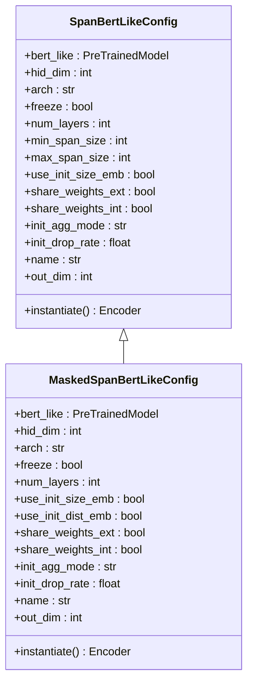
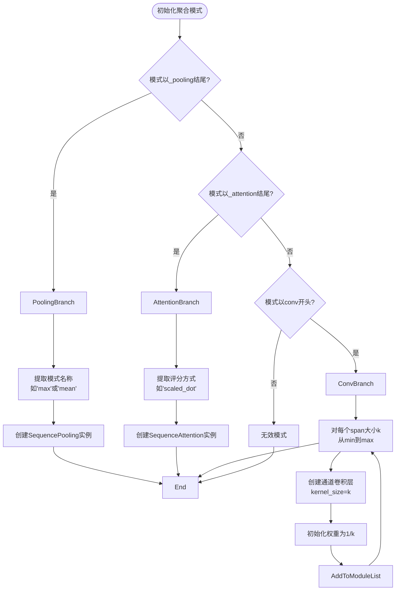
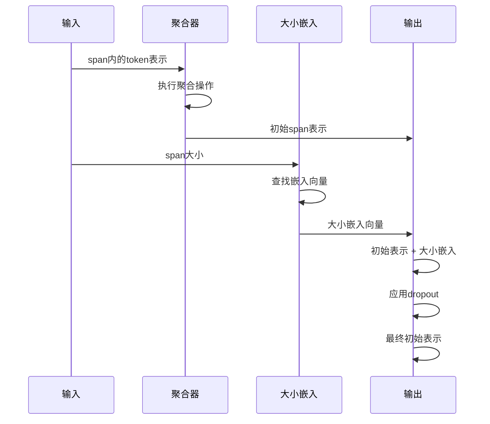
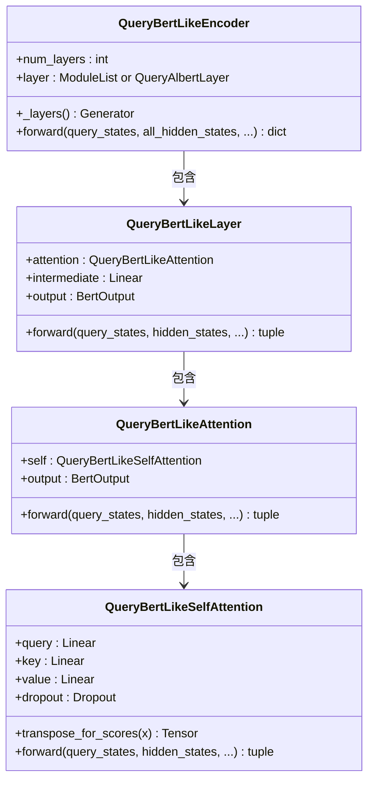
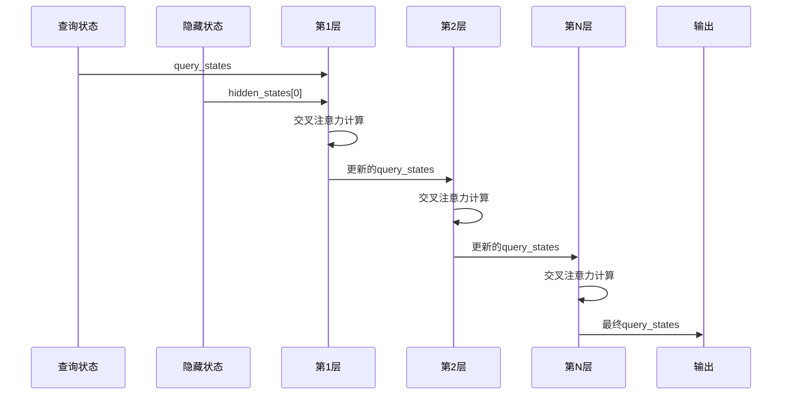
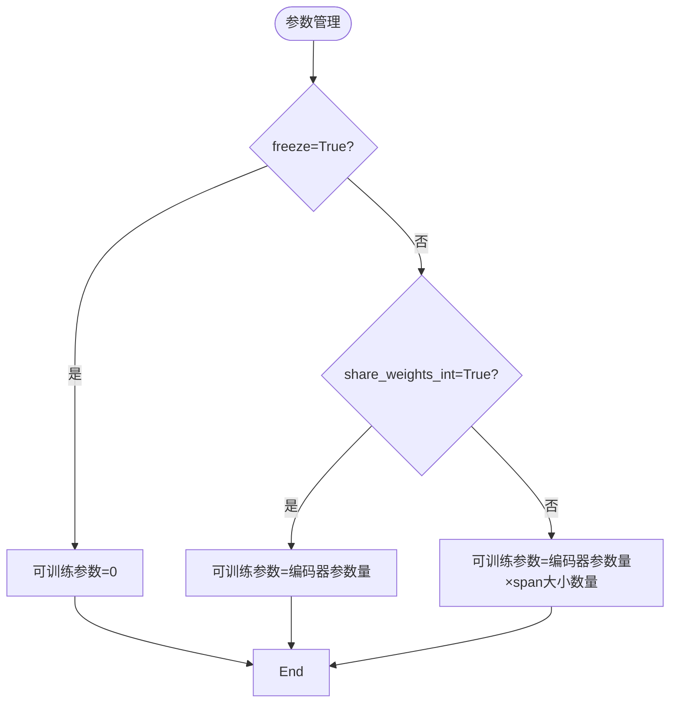
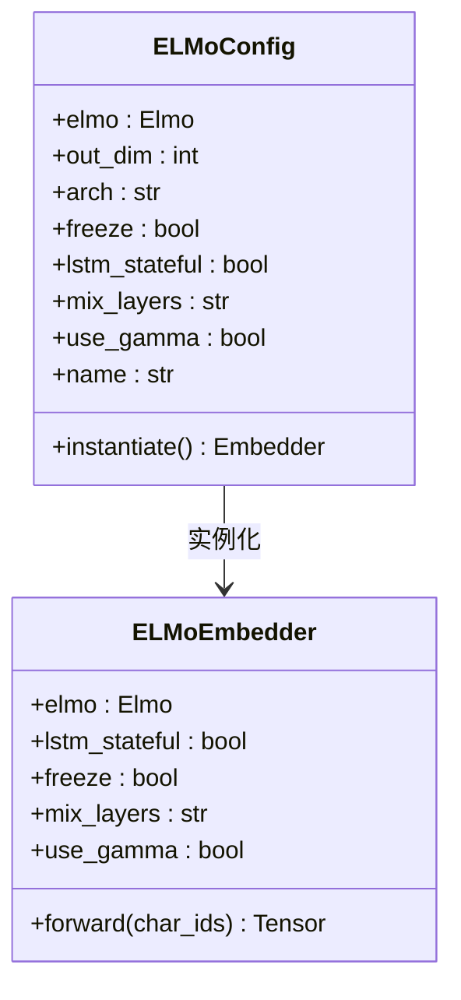
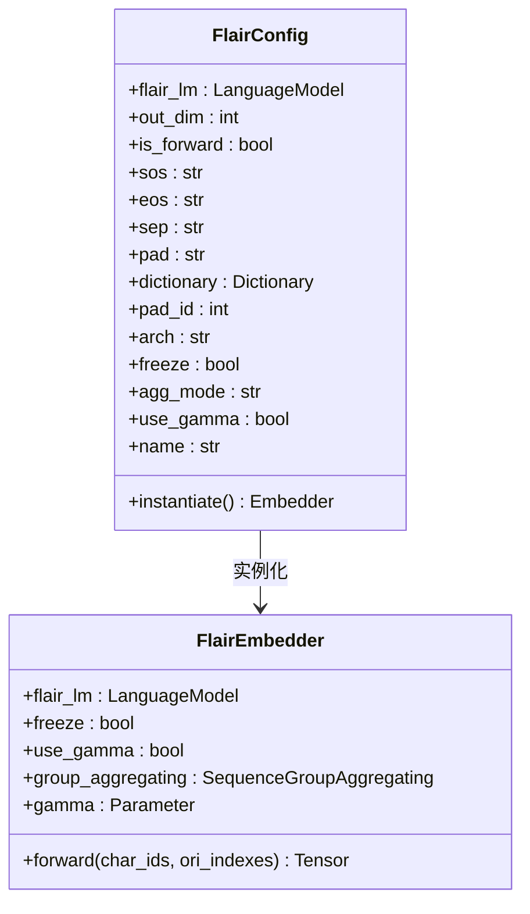

# 预训练编码器

<cite>
**本文档中引用的文件**  
- [span_bert_like.py](file://eznlp/model/span_bert_like.py)
- [masked_span_bert_like.py](file://eznlp/model/masked_span_bert_like.py)
- [query_bert_like.py](file://eznlp/nn/modules/query_bert_like.py)
- [flair.py](file://eznlp/model/flair.py)
- [elmo.py](file://eznlp/model/elmo.py)
- [config.py](file://eznlp/config.py)
- [test_span_bert_like.py](file://tests/model/test_span_bert_like.py)
- [test_masked_span_bert_like.py](file://tests/model/test_masked_span_bert_like.py)
</cite>

## 目录
1. [引言](#引言)
2. [SpanBertLikeConfig与MaskedSpanBertLikeConfig配置分析](#spanbertlikeconfig与maskedspanbertlikeconfig配置分析)
3. [init_agg_mode在span初始化中的作用机制](#init_agg_mode在span初始化中的作用机制)
4. [use_init_size_emb与use_init_dist_emb的应用](#use_init_size_emb与use_init_dist_emb的应用)
5. [QueryBertLikeEncoder的查询机制](#querybertlikeencoder的查询机制)
6. [预训练参数管理](#预训练参数管理)
7. [不同预训练模型的集成配置](#不同预训练模型的集成配置)
8. [结论](#结论)

## 引言
eznlp框架提供了一套灵活的预训练编码器集成方案，支持多种预训练语言模型的高效集成。本文档将深入解析eznlp中预训练编码器的集成机制，重点分析SpanBertLikeConfig和MaskedSpanBertLikeConfig的配置参数，探讨不同初始化模式的作用机制，以及如何通过QueryBertLikeEncoder复用预训练模型的编码器层进行高效查询。同时，本文将详细说明如何配置BERT、ELMo和Flair等不同预训练模型的集成方式。

## SpanBertLikeConfig与MaskedSpanBertLikeConfig配置分析

### 核心配置参数
SpanBertLikeConfig和MaskedSpanBertLikeConfig是eznlp中用于配置预训练编码器的核心类，它们提供了丰富的配置选项来控制编码器的行为。

**SpanBertLikeConfig关键参数：**
- `num_layers`：指定使用的编码器层数，若未指定则使用预训练模型的全部隐藏层
- `freeze`：控制是否冻结预训练模型的参数
- `share_weights_ext`：是否与外部预训练模型共享权重
- `share_weights_int`：是否在不同span大小的查询编码器之间共享权重
- `min_span_size`和`max_span_size`：定义span大小的范围

**MaskedSpanBertLikeConfig关键参数：**
- `use_init_size_emb`：是否使用span大小嵌入
- `use_init_dist_emb`：是否使用距离嵌入
- `share_weights_ext`和`share_weights_int`：权重共享策略



**代码实现分析：**
SpanBertLikeConfig和MaskedSpanBertLikeConfig都继承自Config基类，通过`__init__`方法接收配置参数，并在实例化时创建相应的编码器。两个配置类都实现了`instantiate`方法来创建对应的编码器实例。

**配置验证：**
两个配置类都包含参数验证逻辑，确保配置的合理性。例如，SpanBertLikeConfig验证`num_layers`必须在有效范围内，而MaskedSpanBertLikeConfig则强制要求`share_weights_int`为True。

**Section sources**
- [span_bert_like.py](file://eznlp/model/span_bert_like.py#L13-L54)
- [masked_span_bert_like.py](file://eznlp/model/masked_span_bert_like.py#L13-L53)

## init_agg_mode在span初始化中的作用机制

### 初始化聚合模式
`init_agg_mode`参数在span初始化阶段起着关键作用，它决定了如何从span内的token表示聚合生成初始的span表示。

**支持的聚合模式：**
- `max_pooling`：最大池化
- `mean_pooling`：平均池化
- `conv`：卷积操作
- `attention`：注意力机制

### 不同聚合模式的实现


**Section sources**
- [span_bert_like.py](file://eznlp/model/span_bert_like.py#L60-L80)
- [masked_span_bert_like.py](file://eznlp/model/masked_span_bert_like.py#L59-L67)

### 聚合模式的具体实现
**最大池化和平均池化：**
当`init_agg_mode`设置为`max_pooling`或`mean_pooling`时，系统会创建SequencePooling实例。SequencePooling根据指定的模式（max或mean）对span内的token表示进行池化操作，生成初始的span表示。

**卷积操作：**
当`init_agg_mode`设置为`conv`时，系统会为每个可能的span大小创建一个一维卷积层。这些卷积层使用通道卷积（groups=hid_dim），并且权重初始化为1/k，其中k是卷积核大小。这种初始化方式相当于实现了平均池化的效果。

**注意力机制：**
当`init_agg_mode`设置为`*_attention`时，系统会创建SequenceAttention实例。SequenceAttention使用指定的评分方式（如scaled_dot）计算注意力权重，然后对span内的token表示进行加权求和。

**性能考虑：**
不同的聚合模式在计算效率和表达能力上有所权衡。池化操作计算效率最高，但表达能力有限；卷积操作能够捕捉局部模式，但参数量较大；注意力机制表达能力最强，但计算复杂度最高。

## use_init_size_emb与use_init_dist_emb的应用

### 大小嵌入（use_init_size_emb）
`use_init_size_emb`参数用于控制是否在span初始化时加入span大小的嵌入信息。

**实现机制：**
当`use_init_size_emb`设置为True时，系统会创建一个大小为`max_size_id+1`的嵌入层。这个嵌入层将span大小映射为一个固定维度的向量，然后与通过聚合操作得到的初始span表示相加。



**应用场景：**
- 在命名实体识别任务中，不同长度的实体可能具有不同的语义特征
- 在关系抽取任务中，实体对的距离可能影响关系类型
- 当模型需要区分不同长度的短语时

**Section sources**
- [span_bert_like.py](file://eznlp/model/span_bert_like.py#L84-L93)
- [masked_span_bert_like.py](file://eznlp/model/masked_span_bert_like.py#L70-L75)

### 距离嵌入（use_init_dist_emb）
`use_init_dist_emb`参数用于控制是否在上下文初始化时加入距离信息。

**实现机制：**
当`use_init_dist_emb`设置为True时，系统会创建一个大小为`max_dist_id+1`的嵌入层。这个嵌入层将span之间的距离映射为一个固定维度的向量，用于上下文表示的初始化。

**应用场景：**
- 在关系抽取任务中，实体对之间的距离是重要的特征
- 在事件抽取任务中，触发词与论元之间的距离可能影响语义关系
- 当需要建模长距离依赖时

**参数约束：**
值得注意的是，`use_init_dist_emb`只能在MaskedSpanBertLikeConfig中使用，并且通常与上下文注意力机制结合使用。这种设计使得模型能够更好地捕捉span之间的相对位置信息。

## QueryBertLikeEncoder的查询机制

### 架构设计
QueryBertLikeEncoder是eznlp中实现高效查询的核心组件，它通过复用预训练模型的编码器层来处理查询-上下文交互。



**Section sources**
- [query_bert_like.py](file://eznlp/nn/modules/query_bert_like.py#L233-L330)

### 查询-上下文交互
QueryBertLikeEncoder的核心思想是将传统的自注意力机制替换为查询-上下文交叉注意力机制。

**前向传播流程：**
1. 输入查询状态和所有隐藏状态
2. 对每一层编码器，使用查询状态作为查询，上一层的隐藏状态作为键和值
3. 通过多层变换逐步更新查询状态
4. 返回最终的查询状态



**权重共享策略：**
QueryBertLikeEncoder支持两种权重共享策略：
- 外部共享（share_weights_ext）：与原始预训练模型共享权重
- 内部共享（share_weights_int）：在不同span大小的查询编码器之间共享权重

这种设计既保证了模型能够利用预训练知识，又控制了参数量的增长。

## 预训练参数管理

### 参数冻结机制
eznlp通过`freeze`参数实现对预训练模型参数的精细控制。

**实现方式：**
- 当`freeze=True`时，调用`requires_grad_(False)`冻结相关模块的参数
- 当`freeze=False`时，参数保持可训练状态

```python
@property
def freeze(self):
    return self._freeze

@freeze.setter
def freeze(self, freeze: bool):
    self._freeze = freeze
    self.query_bert_like.requires_grad_(not freeze)
```

**Section sources**
- [span_bert_like.py](file://eznlp/model/span_bert_like.py#L124-L131)
- [masked_span_bert_like.py](file://eznlp/model/masked_span_bert_like.py#L98-L105)

### 可训练参数统计
eznlp提供了参数统计功能，帮助用户了解模型的可训练参数数量。

**参数计算逻辑：**
- 冻结时：可训练参数为0
- 内部权重共享时：可训练参数等于编码器参数量
- 无内部权重共享时：可训练参数等于编码器参数量乘以span大小数量

**测试验证：**
测试文件中包含了对不同配置下参数数量的验证，确保参数管理逻辑的正确性。



## 不同预训练模型的集成配置

### BERT模型集成
BERT是eznlp中最常用的预训练模型，其集成配置相对直接。

**配置示例：**
```python
config = SpanBertLikeConfig(
    bert_like=bert_model,
    num_layers=12,
    freeze=True,
    min_span_size=1,
    max_span_size=10,
    use_init_size_emb=True,
    init_agg_mode="mean_pooling"
)
```

**关键配置：**
- `bert_like`：预训练的BERT模型实例
- `num_layers`：使用的编码器层数
- `freeze`：是否冻结BERT参数
- `init_agg_mode`：初始化聚合模式

**Section sources**
- [with_bert.opt](file://scripts/options/with_bert.opt#L1-L11)

### ELMo模型集成
ELMo模型通过字符级卷积和双向LSTM生成上下文相关的词表示。

**配置特点：**
- `mix_layers`：控制如何混合不同层的ELMo表示
- `use_gamma`：是否使用可学习的缩放因子
- `lstm_stateful`：是否保持LSTM状态



**Section sources**
- [elmo.py](file://eznlp/model/elmo.py#L10-L43)

### Flair模型集成
Flair模型使用字符级语言模型生成上下文相关的词表示。

**配置特点：**
- `agg_mode`：控制如何从字符表示聚合生成词表示
- `use_gamma`：是否使用可学习的缩放因子
- `sos`、`eos`、`sep`：控制文本预处理的特殊标记



**Section sources**
- [flair.py](file://eznlp/model/flair.py#L11-L79)

### 集成策略比较
```mermaid
table
| 模型类型 | 参数量 | 计算复杂度 | 上下文感知 | 配置灵活性 |
|---------|-------|-----------|-----------|-----------|
| BERT | 高 | 高 | 强 | 高 |
| ELMo | 中 | 中 | 中 | 中 |
| Flair | 低 | 低 | 弱 | 低 |
```

**选择建议：**
- 对于需要强上下文感知的任务，优先选择BERT
- 对于资源受限的环境，可以考虑ELMo或Flair
- 根据具体任务需求调整参数共享和冻结策略

## 结论
eznlp的预训练编码器集成方案提供了高度灵活和可配置的架构，支持多种预训练语言模型的高效集成。通过SpanBertLikeConfig和MaskedSpanBertLikeConfig，用户可以精细控制编码器的行为，包括层数选择、参数冻结、权重共享等。init_agg_mode提供了多种初始化聚合策略，使模型能够根据任务需求选择最适合的表示学习方式。QueryBertLikeEncoder的查询机制创新性地复用了预训练模型的编码器层，实现了高效的查询-上下文交互。对于不同类型的预训练模型，eznlp提供了统一的接口和灵活的配置选项，使得模型集成变得更加简单和可控。这套集成方案不仅提高了模型的性能，还增强了系统的可维护性和可扩展性。