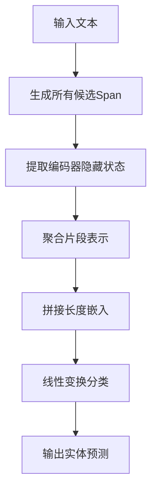
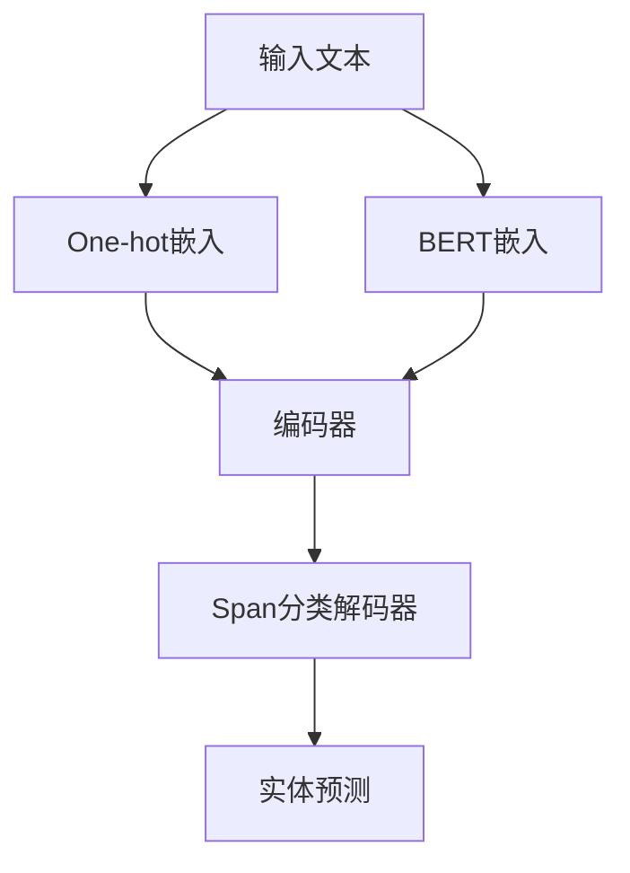

# Span分类解码器

<cite>
**本文档引用的文件**
- [span_classification.py](file://eznlp/model/decoder/span_classification.py)
- [specific_span_classification.py](file://eznlp/model/decoder/specific_span_classification.py)
- [boundary_selection.py](file://eznlp/model/decoder/boundary_selection.py)
- [boundaries.py](file://eznlp/model/decoder/boundaries.py)
- [extractor.py](file://eznlp/model/model/extractor.py)
- [base.py](file://eznlp/model/decoder/base.py)
- [chunk.py](file://eznlp/utils/chunk.py)
</cite>

## 目录
1. [引言](#引言)
2. [Span分类解码器核心原理](#span分类解码器核心原理)
3. [SpanClassificationDecoderConfig配置详解](#spanclassificationdecoderconfig配置详解)
4. [候选Span生成与分类机制](#候选span生成与分类机制)
5. [词汇表构建与解码过程](#词汇表构建与解码过程)
6. [与ExtractorConfig的协同工作](#与extractorconfig的协同工作)
7. [与序列标注方法的对比优势](#与序列标注方法的对比优势)
8. [剪枝策略与后处理逻辑](#剪枝策略与后处理逻辑)
9. [总结](#总结)

## 引言
Span分类解码器是一种将命名实体识别（NER）任务视为分类问题的创新范式。与传统的序列标注方法不同，该解码器通过生成所有可能的文本片段（Span），并对每个片段进行分类来识别实体。这种方法在处理嵌套实体和长实体时展现出显著优势，能够更灵活地捕捉文本中的复杂语义结构。本文将深入解析Span分类解码器的工作原理，重点阐述其配置参数、实现机制以及在实体识别任务中的应用。

## Span分类解码器核心原理
Span分类解码器的核心思想是将命名实体识别任务转化为对文本片段的分类问题。解码器首先生成文本中所有可能的候选片段，然后利用编码器输出的上下文表示对每个片段进行分类，判断其是否为实体以及属于何种实体类型。这种范式转换使得模型能够直接学习片段级别的语义特征，避免了序列标注方法中标签依赖性带来的局限性。

解码器通过`SpanClassificationDecoderConfig`类定义配置参数，控制候选片段的生成规则和分类过程。在训练阶段，模型学习区分正例（真实实体）和负例（非实体）片段；在推理阶段，模型对所有候选片段进行评分，并根据置信度阈值筛选出最终的实体预测结果。

**Section sources**
- [span_classification.py](file://eznlp/model/decoder/span_classification.py#L27-L344)
- [base.py](file://eznlp/model/decoder/base.py#L52-L114)

## SpanClassificationDecoderConfig配置详解
`SpanClassificationDecoderConfig`类是Span分类解码器的核心配置类，继承自`SingleDecoderConfigBase`和`BoundariesDecoderMixin`。该类定义了多个关键参数来控制解码器的行为：

- **`min_span_size`和`max_span_size`**：定义候选片段的最小和最大长度。`max_span_size`可以通过数据统计自动计算，确保覆盖大部分真实实体。
- **`size_emb_dim`**：指定片段长度嵌入的维度，使模型能够学习不同长度片段的表示。
- **`agg_mode`**：定义片段表示的聚合模式，如最大池化（max_pooling）或注意力机制（attention）。
- **`neg_sampling_rate`**：负采样率，用于平衡正负样本比例。
- **`inex_mkmmd_lambda`**：控制内部（嵌套）和外部片段之间的分布差异损失的权重。

这些参数共同决定了候选片段的生成范围、表示方式和训练策略，为模型提供了高度的灵活性和可配置性。

**Section sources**
- [span_classification.py](file://eznlp/model/decoder/span_classification.py#L27-L159)
- [specific_span_classification.py](file://eznlp/model/decoder/specific_span_classification.py#L25-L151)

## 候选Span生成与分类机制
解码器通过`_spans_from_diagonals`函数生成所有可能的候选片段。该函数遍历文本的上三角矩阵，生成所有起始位置小于结束位置的片段。对于长度为n的文本，将生成n(n+1)/2个候选片段。

分类过程分为三个主要步骤：
1. **片段表示生成**：对于每个候选片段，从编码器输出的隐藏状态中提取对应位置的向量，并通过聚合函数（如最大池化）生成固定维度的片段表示。
2. **特征增强**：将片段长度嵌入与片段表示拼接，增强模型对片段长度的感知能力。
3. **分类决策**：通过线性变换和softmax函数，将片段表示映射到实体类型空间，得到每个片段属于各类别的概率。

这一机制使得模型能够独立评估每个片段，避免了序列标注中标签转移的约束，特别适合处理重叠和嵌套实体。

**Diagram sources**
- [span_classification.py](file://eznlp/model/decoder/span_classification.py#L223-L263)
- [boundaries.py](file://eznlp/model/decoder/boundaries.py#L43-L51)

## 词汇表构建与解码过程
`build_vocab`方法是解码器初始化的关键步骤，负责构建实体类型词汇表和确定超参数。该方法遍历训练数据，执行以下操作：
1. 统计所有出现的实体类型，构建`idx2label`映射。
2. 计算数据集中实体的最大重叠层级，用于后续的冲突解决。
3. 根据统计信息自动确定`max_span_size`，确保覆盖大部分真实实体。
4. 确定`max_len`，即模型能处理的最大文本长度。

解码过程通过`decode`方法实现，主要包括：
1. 对所有候选片段进行分类，得到每个片段的类别概率。
2. 根据置信度阈值过滤低置信度的预测结果。
3. 应用`_filter`方法解决片段冲突，优先保留高置信度或长片段的预测结果。
4. 返回最终的实体识别结果。

**Section sources**
- [span_classification.py](file://eznlp/model/decoder/span_classification.py#L99-L159)
- [boundary_selection.py](file://eznlp/model/decoder/boundary_selection.py#L63-L89)

## 与ExtractorConfig的协同工作
Span分类解码器通过`ExtractorConfig`类与其他组件协同工作，形成完整的命名实体识别系统。`ExtractorConfig`作为高层配置类，负责协调嵌入层、编码器和解码器的配置与数据流。

在`ExtractorConfig`中，解码器通过`decoder`参数指定，可以是`SpanClassificationDecoderConfig`或其他解码器配置。配置类的`build_vocabs_and_dims`方法确保解码器的输入维度与编码器的输出维度匹配，并构建必要的词汇表。

数据流遵循以下路径：输入文本 → 嵌入层 → 编码器 → 解码器 → 实体预测。这种模块化设计使得不同组件可以灵活替换和组合，支持多种模型架构的快速实验。

**Diagram sources**
- [extractor.py](file://eznlp/model/model/extractor.py#L50-L208)
- [span_classification.py](file://eznlp/model/decoder/span_classification.py#L160-L161)

## 与序列标注方法的对比优势
与传统的序列标注方法相比，Span分类解码器在处理复杂实体结构时具有明显优势：

1. **嵌套实体处理**：序列标注方法（如BIOES）难以表示嵌套实体，而Span分类可以直接识别任意层级的嵌套结构。
2. **长实体识别**：序列标注中长实体的标签序列容易出现错误累积，而Span分类将长实体视为单一单元进行分类，避免了这一问题。
3. **灵活性**：Span分类不依赖标签转移规则，可以更灵活地处理不规则的实体边界。
4. **可解释性**：每个片段的分类决策相对独立，便于分析和调试模型行为。

然而，Span分类的计算复杂度较高，候选片段数量随文本长度平方增长，需要更复杂的优化策略来提高效率。

**Section sources**
- [span_classification.py](file://eznlp/model/decoder/span_classification.py#L27-L344)
- [boundary_selection.py](file://eznlp/model/decoder/boundary_selection.py#L92-L198)

## 剪枝策略与后处理逻辑
为了提高效率和准确性，Span分类解码器实现了多种剪枝和后处理策略：

1. **长度剪枝**：通过`max_span_size`参数限制候选片段的最大长度，过滤明显过长的无效片段。
2. **负采样**：在训练阶段使用`neg_sampling_rate`控制负样本比例，避免正负样本严重不平衡。
3. **置信度过滤**：在推理阶段根据`conf_thresh`阈值过滤低置信度的预测结果。
4. **冲突解决**：通过`_filter`方法解决重叠片段的冲突，支持按置信度或长度优先的策略。

后处理逻辑还包括边界平滑和标签平滑技术，通过`sb_epsilon`和`sl_epsilon`参数控制，提高模型的鲁棒性和泛化能力。

**Section sources**
- [span_classification.py](file://eznlp/model/decoder/span_classification.py#L304-L336)
- [chunk.py](file://eznlp/utils/chunk.py#L40-L48)

## 总结
Span分类解码器通过将命名实体识别转化为片段分类问题，提供了一种强大而灵活的实体识别范式。其核心优势在于能够有效处理嵌套和长实体，突破了传统序列标注方法的局限。通过精心设计的配置参数和高效的实现机制，该解码器在保持高精度的同时，提供了良好的可配置性和可扩展性。与`ExtractorConfig`的紧密集成使得它能够无缝融入复杂的NLP系统，为实体识别任务提供了先进的解决方案。