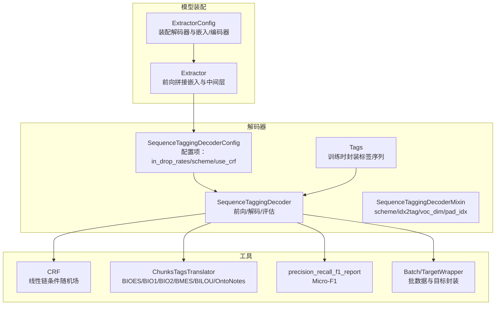
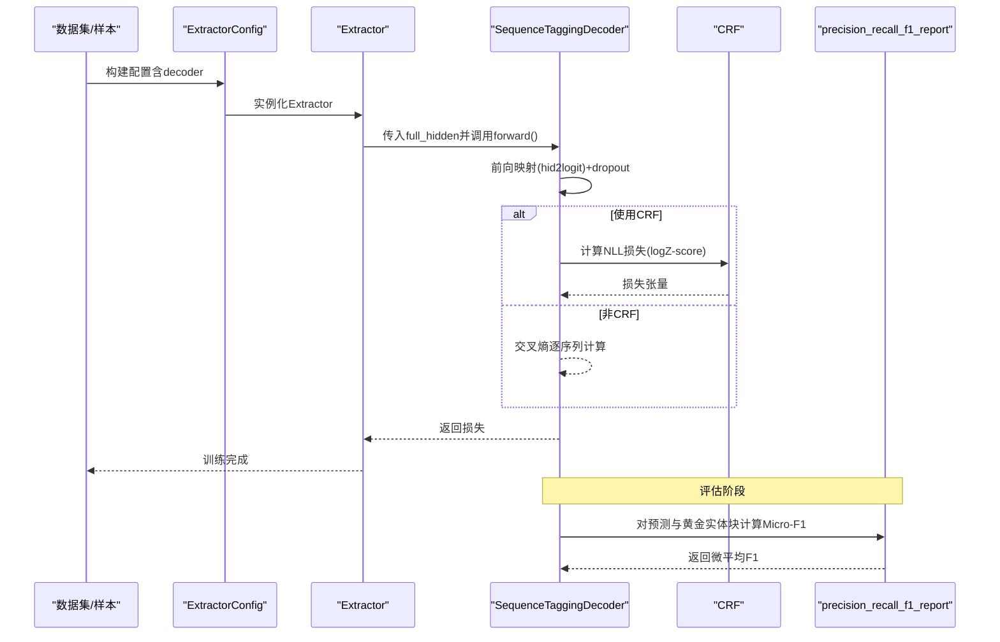
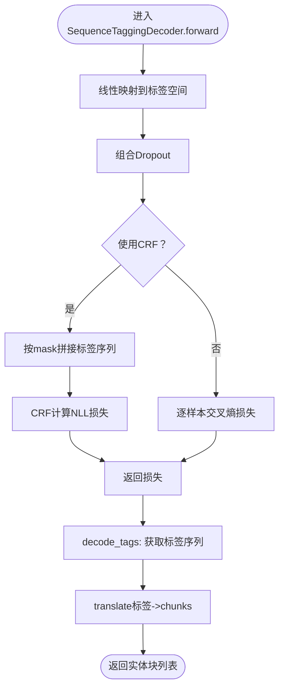
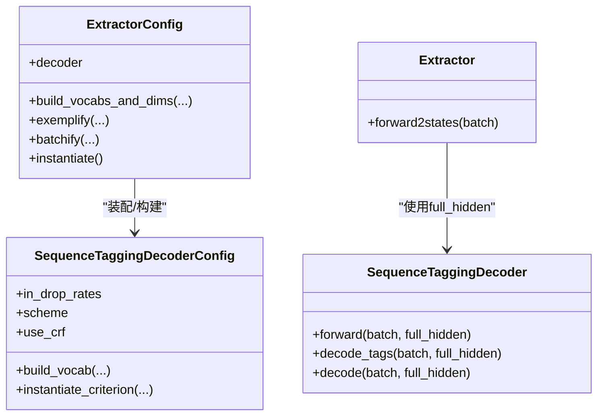
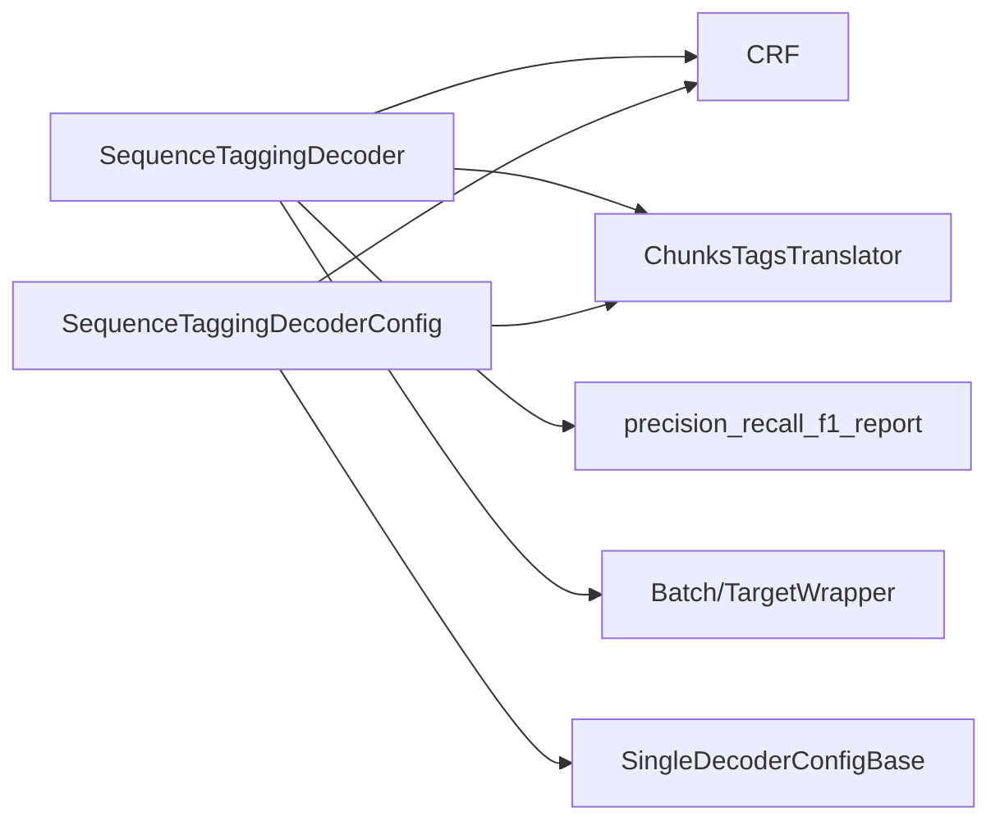

# 序列标注解码器

<cite>
**本文引用的文件列表**
- [sequence_tagging.py](file://eznlp/model/decoder/sequence_tagging.py)
- [base.py](file://eznlp/model/decoder/base.py)
- [crf.py](file://eznlp/nn/modules/crf.py)
- [transition.py](file://eznlp/utils/transition.py)
- [metrics.py](file://eznlp/metrics.py)
- [extractor.py](file://eznlp/model/model/extractor.py)
- [test_sequence_tagging.py](file://tests/model/test_sequence_tagging.py)
- [wrapper.py](file://eznlp/wrapper.py)
- [utils/__init__.py](file://eznlp/utils/__init__.py)
</cite>

## 目录
1. [引言](#引言)
2. [项目结构](#项目结构)
3. [核心组件](#核心组件)
4. [架构总览](#架构总览)
5. [详细组件分析](#详细组件分析)
6. [依赖关系分析](#依赖关系分析)
7. [性能考量](#性能考量)
8. [故障排查指南](#故障排查指南)
9. [结论](#结论)
10. [附录](#附录)

## 引言
本文件系统性解析eznlp中的序列标注解码器（SequenceTaggingDecoder），重点说明其作为单任务解码器的基础作用，涵盖以下关键点：
- SequenceTaggingDecoderConfig的配置参数：in_drop_rates、scheme（BIOES等标注方案）、use_crf等的含义与影响
- CRF层在序列标注中的应用及损失与解码流程
- 通过build_vocab方法自动构建标签词汇表的过程
- 与ExtractorConfig的集成方式
- 解码过程中的标签到实体块（chunks）的转换逻辑
- 评估指标（Micro-F1）的计算方法

## 项目结构
围绕序列标注解码器的关键文件组织如下：
- 解码器实现与配置：model/decoder/sequence_tagging.py
- 解码器基类与单任务配置基类：model/decoder/base.py
- CRF模块：nn/modules/crf.py
- 标签与实体块互转工具：utils/transition.py
- 评估指标：metrics.py
- 模型装配（Extractor）：model/model/extractor.py
- 测试用例：tests/model/test_sequence_tagging.py
- 批数据包装：wrapper.py
- 工具导出入口：utils/__init__.py

图表来源
- [extractor.py](file://eznlp/model/model/extractor.py#L23-L91)
- [sequence_tagging.py](file://eznlp/model/decoder/sequence_tagging.py#L93-L141)
- [crf.py](file://eznlp/nn/modules/crf.py#L45-L90)
- [transition.py](file://eznlp/utils/transition.py#L12-L54)
- [metrics.py](file://eznlp/metrics.py#L98-L153)
- [wrapper.py](file://eznlp/wrapper.py#L97-L122)

章节来源
- [sequence_tagging.py](file://eznlp/model/decoder/sequence_tagging.py#L93-L141)
- [base.py](file://eznlp/model/decoder/base.py#L52-L114)
- [crf.py](file://eznlp/nn/modules/crf.py#L45-L90)
- [transition.py](file://eznlp/utils/transition.py#L12-L54)
- [metrics.py](file://eznlp/metrics.py#L98-L153)
- [extractor.py](file://eznlp/model/model/extractor.py#L23-L91)
- [wrapper.py](file://eznlp/wrapper.py#L97-L122)

## 核心组件
- SequenceTaggingDecoderConfig：负责解码器配置，包括输入dropout策略、标注方案、是否使用CRF、损失函数选择、标签词表构建等。
- SequenceTaggingDecoder：实现前向损失计算与解码输出，支持CRF与非CRF两种路径；提供从标签序列到实体块的转换。
- SequenceTaggingDecoderMixin：提供scheme、idx2tag、voc_dim、pad_idx等通用能力，以及训练时将chunks转换为tags的封装。
- CRF：线性链条件随机场，提供loss与Viterbi解码。
- ChunksTagsTranslator：在不同标注方案之间进行标签与实体块的双向转换。
- precision_recall_f1_report：提供宏/微平均的精确率、召回率、F1计算，用于评估。

章节来源
- [sequence_tagging.py](file://eznlp/model/decoder/sequence_tagging.py#L93-L141)
- [sequence_tagging.py](file://eznlp/model/decoder/sequence_tagging.py#L143-L198)
- [base.py](file://eznlp/model/decoder/base.py#L52-L114)
- [crf.py](file://eznlp/nn/modules/crf.py#L45-L90)
- [transition.py](file://eznlp/utils/transition.py#L12-L54)
- [metrics.py](file://eznlp/metrics.py#L98-L153)

## 架构总览
下图展示了从Extractor装配到序列标注解码器的端到端流程，以及训练与推理阶段的差异。

图表来源
- [extractor.py](file://eznlp/model/model/extractor.py#L211-L274)
- [sequence_tagging.py](file://eznlp/model/decoder/sequence_tagging.py#L157-L198)
- [metrics.py](file://eznlp/metrics.py#L98-L153)

## 详细组件分析

### SequenceTaggingDecoderConfig 配置详解
- in_drop_rates：三元dropout率元组，分别控制隐藏层dropout、门控dropout、激活dropout等，用于正则化与提升泛化。
- scheme：标注方案，默认“BIOES”，支持“BIO1”、“BIO2”、“BMES”、“BILOU”、“OntoNotes”等，决定标签到实体块的转换规则与合法性检查。
- use_crf：是否启用CRF作为损失与解码策略；启用时损失函数名返回“CRF”，否则继承单任务默认的交叉熵或加权损失。
- criterion属性：根据use_crf与多标签/平滑标签/Focal Loss等策略生成最终损失名称（例如“CE”、“FL(γ)”、“SL(ε)”）。
- instantiate_criterion：当criterion以“CRF”开头时，实例化CRF模块；否则委托给父类创建交叉熵或加权损失。
- build_vocab：遍历数据分区，利用ChunksTagsTranslator将chunks转换为标签序列，统计标签频次并生成idx2tag（包含“<pad>”）。
- instantiate：返回SequenceTaggingDecoder实例。

章节来源
- [sequence_tagging.py](file://eznlp/model/decoder/sequence_tagging.py#L93-L141)
- [base.py](file://eznlp/model/decoder/base.py#L52-L114)

### SequenceTaggingDecoder 前向与解码流程
- 前向（forward）：
  - 通过hid2logit将full_hidden映射到标签维度，随后经CombinedDropout处理。
  - 若使用CRF：将batch中所有标签序列按mask拼接后调用CRF的NLL损失。
  - 否则：对每个样本的logits按真实长度切片，计算交叉熵损失并堆叠。
- 解码（decode_tags）：
  - 若使用CRF：调用CRF.decode得到最佳标签序列（按mask解码）。
  - 否则：argmax取最佳路径并使用unpad_seqs还原原序列长度。
- 最终解码（decode）：
  - 将标签序列转换为实体块（chunks），供评估与下游使用。

图表来源
- [sequence_tagging.py](file://eznlp/model/decoder/sequence_tagging.py#L157-L198)
- [crf.py](file://eznlp/nn/modules/crf.py#L69-L90)
- [transition.py](file://eznlp/utils/transition.py#L167-L217)

章节来源
- [sequence_tagging.py](file://eznlp/model/decoder/sequence_tagging.py#L157-L198)

### CRF层在序列标注中的应用
- CRF模块提供三个核心接口：forward（负对数似然损失）、decode（维特比解码）、内部的log-partition与路径评分计算。
- 在序列标注中，CRF通过转移分数与发射分数联合建模相邻标签之间的依赖关系，从而避免非法转移，提高整体一致性。
- 在训练时，CRF的损失由logZ减去路径评分构成；在推理时，通过维特比算法获得全局最优标签序列。

章节来源
- [crf.py](file://eznlp/nn/modules/crf.py#L45-L90)
- [crf.py](file://eznlp/nn/modules/crf.py#L153-L204)

### 标签词汇表构建（build_vocab）
- 通过遍历多个数据分区，将每个样本的chunks转换为对应长度的标签序列（依据scheme），统计标签出现频次，最终生成idx2tag列表（以“<pad>”开头）。
- idx2tag与tag2idx用于后续的标签索引、损失计算与解码回标签。

章节来源
- [sequence_tagging.py](file://eznlp/model/decoder/sequence_tagging.py#L129-L138)

### 标注方案与标签-实体块转换
- 支持多种标注方案：BIOES、BIO1、BIO2、BMES、BILOU、OntoNotes等。
- ChunksTagsTranslator负责：
  - chunks2tags：将实体块映射为标签序列，优先覆盖长实体，遵守各方案的起止规则与合法性检查。
  - tags2chunks：从标签序列恢复实体块，支持类型冲突时的拆分策略（breaking_for_types）。
- 该转换直接影响标签空间与评估的一致性。

章节来源
- [transition.py](file://eznlp/utils/transition.py#L80-L156)
- [transition.py](file://eznlp/utils/transition.py#L167-L217)
- [utils/__init__.py](file://eznlp/utils/__init__.py#L1-L12)

### 评估指标（Micro-F1）
- Micro-F1通过对所有样本的真阳性、假阳性、假阴性计数求和，再计算全局精确率、召回率与F1。
- 评估函数precision_recall_f1_report支持按类型或按样本的宏平均，同时提供微平均结果。

章节来源
- [metrics.py](file://eznlp/metrics.py#L98-L153)

### 与ExtractorConfig的集成方式
- ExtractorConfig可直接指定decoder为“sequence_tagging”，或显式传入SequenceTaggingDecoderConfig。
- ExtractorConfig在build_vocabs_and_dims中设置各嵌入/编码器的维度，并调用decoder.build_vocab完成标签词表构建。
- Extractor在forward2states中产出full_hidden，交由SequenceTaggingDecoder进行解码。

图表来源
- [extractor.py](file://eznlp/model/model/extractor.py#L23-L91)
- [extractor.py](file://eznlp/model/model/extractor.py#L122-L148)
- [sequence_tagging.py](file://eznlp/model/decoder/sequence_tagging.py#L93-L141)

章节来源
- [extractor.py](file://eznlp/model/model/extractor.py#L23-L91)
- [extractor.py](file://eznlp/model/model/extractor.py#L122-L148)

### 解码过程：标签到实体块（chunks）的转换逻辑
- 解码阶段先得到标签序列（CRF解码或argmax），再通过ChunksTagsTranslator的tags2chunks完成实体块提取。
- 转换遵循各标注方案的起止规则与合法性约束，支持类型冲突时的拆分策略，确保输出实体块与原始文本边界一致。

章节来源
- [sequence_tagging.py](file://eznlp/model/decoder/sequence_tagging.py#L181-L198)
- [transition.py](file://eznlp/utils/transition.py#L167-L217)

### 使用示例（配置与运行）
- 可通过ExtractorConfig("sequence_tagging")快速装配序列标注解码器。
- 支持在decoder中指定scheme与use_crf，或在ExtractorConfig中传入SequenceTaggingDecoderConfig对象。
- 训练与预测流程可通过Dataset与Trainer完成，测试用例展示了不同架构、预训练嵌入、字符级嵌入、软词典等场景下的正确性与可训练性验证。

章节来源
- [test_sequence_tagging.py](file://tests/model/test_sequence_tagging.py#L1-L213)
- [extractor.py](file://eznlp/model/model/extractor.py#L23-L91)

## 依赖关系分析
- SequenceTaggingDecoder依赖：
  - CRF：用于CRF路径损失与解码
  - CombinedDropout：组合dropout策略
  - ChunksTagsTranslator：标签与实体块互转
  - precision_recall_f1_report：评估指标
  - Batch/TargetWrapper：批数据与目标封装
- SequenceTaggingDecoderConfig依赖：
  - SingleDecoderConfigBase：提供损失函数与权重策略基础
  - CRF：当use_crf为True时实例化
  - Counter：构建标签词表时统计频次

图表来源
- [sequence_tagging.py](file://eznlp/model/decoder/sequence_tagging.py#L93-L141)
- [base.py](file://eznlp/model/decoder/base.py#L52-L114)

章节来源
- [sequence_tagging.py](file://eznlp/model/decoder/sequence_tagging.py#L93-L141)
- [base.py](file://eznlp/model/decoder/base.py#L52-L114)

## 性能考量
- CRF解码在长序列上具有维特比复杂度，但能显著提升标签一致性；若追求速度且对边界平滑要求不高，可关闭CRF切换为交叉熵。
- CombinedDropout有助于正则化，建议在训练阶段适度使用；推理阶段通常不使用dropout。
- 标签词表规模与scheme选择会影响模型容量与训练稳定性；BIOES/BMES/BILOU等方案在边界表达上更明确，适合边界平滑需求高的任务。

## 故障排查指南
- 标签非法或边界错位：检查scheme与ChunksTagsTranslator的合法性检查，确认实体块与标签序列的对应关系。
- CRF解码异常：确认pad_idx设置与mask一致，避免无效标签参与解码。
- 评估指标异常：核对Micro-F1的计算是否基于正确的实体块集合，注意类型冲突时的拆分策略。

章节来源
- [transition.py](file://eznlp/utils/transition.py#L58-L70)
- [crf.py](file://eznlp/nn/modules/crf.py#L56-L64)
- [metrics.py](file://eznlp/metrics.py#L98-L153)

## 结论
SequenceTaggingDecoder在eznlp中承担了序列标注任务的单任务解码器角色，具备灵活的配置（scheme、use_crf、dropout策略）、完善的标签-实体块转换与评估体系，并通过ExtractorConfig无缝集成到整体模型流水线中。CRF的应用提升了序列一致性，而build_vocab与Metrics共同保障了从数据到评估的闭环质量。

## 附录
- 常见配置要点
  - scheme：优先选择BIOES/BMES/BILOU以获得清晰边界表达
  - use_crf：默认开启，若追求更快推理可关闭
  - in_drop_rates：按需调整，避免过拟合
- 评估建议
  - 使用Micro-F1作为主指标，关注实体级别的整体性能
  - 如需细粒度分析，可结合按类型的宏平均