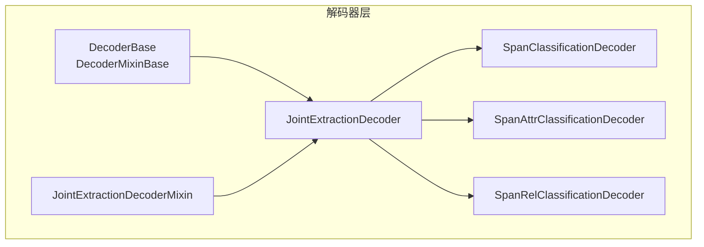
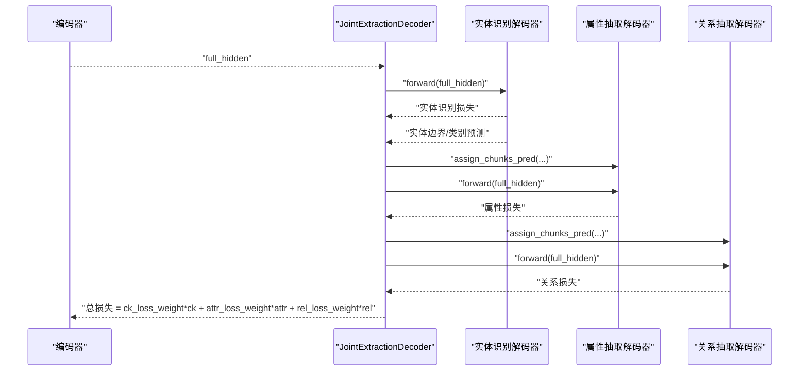
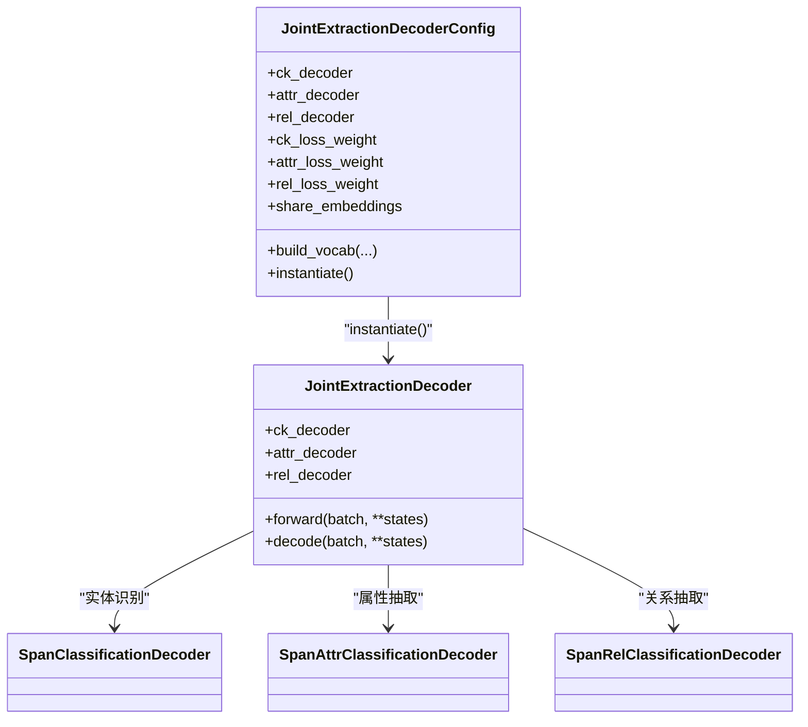

# 联合抽取解码器

<cite>
**本文引用的文件列表**
- [joint_extraction.py](file://eznlp/model/decoder/joint_extraction.py)
- [base.py](file://eznlp/model/decoder/base.py)
- [span_classification.py](file://eznlp/model/decoder/span_classification.py)
- [span_attr_classification.py](file://eznlp/model/decoder/span_attr_classification.py)
- [span_rel_classification.py](file://eznlp/model/decoder/span_rel_classification.py)
- [evaluation.py](file://eznlp/training/evaluation.py)
- [test_joint_extraction.py](file://tests/model/test_joint_extraction.py)
- [extractor.py](file://eznlp/model/model/extractor.py)
- [specific_span_extractor.py](file://eznlp/model/model/specific_span_extractor.py)
</cite>

## 目录
1. [简介](#简介)
2. [项目结构与定位](#项目结构与定位)
3. [核心组件总览](#核心组件总览)
4. [架构概览](#架构概览)
5. [关键组件详解](#关键组件详解)
6. [依赖关系分析](#依赖关系分析)
7. [性能与训练特性](#性能与训练特性)
8. [故障排查指南](#故障排查指南)
9. [结论](#结论)
10. [附录：配置与使用示例路径](#附录配置与使用示例路径)

## 简介
本文件系统性解析联合抽取解码器（JointExtractionDecoder）的协调机制，重点说明其如何通过组合多个子解码器实现端到端的联合信息抽取。文档覆盖以下要点：
- JointExtractionDecoderConfig 如何配置实体识别（ck_decoder）、属性抽取（attr_decoder）和关系抽取（rel_decoder）等子任务解码器；
- 通过 ck_loss_weight、attr_loss_weight、rel_loss_weight 等参数对多任务学习的损失进行加权；
- 解码器之间的依赖关系：属性和关系解码器如何利用实体识别的结果作为输入；
- 结合测试用例展示联合抽取解码器的配置方法；
- 讨论共享嵌入（share_embeddings）等可选优化项；
- 多任务评估指标的计算逻辑与结果组织方式。

## 项目结构与定位
联合抽取解码器位于模型解码器模块中，负责将编码器输出映射为三类任务的预测：实体边界/类别（实体识别）、实体属性（属性抽取）、实体间关系（关系抽取）。其核心文件如下：
- 解码器基类与混入：base.py
- 联合解码器与配置：joint_extraction.py
- 子任务解码器：span_classification.py（实体识别）、span_attr_classification.py（属性抽取）、span_rel_classification.py（关系抽取）
- 训练与评估：evaluation.py
- 使用示例与测试：test_joint_extraction.py、extractor.py、specific_span_extractor.py

图表来源
- [joint_extraction.py](file://eznlp/model/decoder/joint_extraction.py#L1-L193)
- [base.py](file://eznlp/model/decoder/base.py#L1-L114)
- [span_classification.py](file://eznlp/model/decoder/span_classification.py#L1-L344)
- [span_attr_classification.py](file://eznlp/model/decoder/span_attr_classification.py#L1-L386)
- [span_rel_classification.py](file://eznlp/model/decoder/span_rel_classification.py#L1-L585)

章节来源
- [joint_extraction.py](file://eznlp/model/decoder/joint_extraction.py#L1-L193)
- [base.py](file://eznlp/model/decoder/base.py#L1-L114)

## 核心组件总览
- JointExtractionDecoderConfig：用于装配实体识别、属性抽取、关系抽取三个子解码器，并提供损失权重与共享嵌入等配置项；同时提供名称拼接、维度一致性设置、词表构建等能力。
- JointExtractionDecoder：在前向过程中依次执行实体识别、属性抽取（可选）与关系抽取（可选），并通过 assign_chunks_pred 将实体识别结果传递给后续子任务；在 decode 阶段返回三元组预测（实体、属性、关系）。
- 子任务解码器：
  - 实体识别（SpanClassificationDecoder）：基于跨度分类的实体边界与类别预测；
  - 属性抽取（SpanAttrClassificationDecoder）：基于已识别实体的属性分类，支持多标签与过滤；
  - 关系抽取（SpanRelClassificationDecoder）：基于实体对的二元/三元融合策略，支持上下文、距离、标签嵌入等特征。

章节来源
- [joint_extraction.py](file://eznlp/model/decoder/joint_extraction.py#L68-L193)
- [span_classification.py](file://eznlp/model/decoder/span_classification.py#L1-L344)
- [span_attr_classification.py](file://eznlp/model/decoder/span_attr_classification.py#L1-L386)
- [span_rel_classification.py](file://eznlp/model/decoder/span_rel_classification.py#L1-L585)

## 架构概览
联合解码器采用“串行依赖”的流水线式协调：先由实体识别得到候选实体，再将这些实体作为属性抽取与关系抽取的输入。损失函数按任务加权求和，形成统一的目标函数。

图表来源
- [joint_extraction.py](file://eznlp/model/decoder/joint_extraction.py#L154-L193)
- [span_attr_classification.py](file://eznlp/model/decoder/span_attr_classification.py#L250-L334)
- [span_rel_classification.py](file://eznlp/model/decoder/span_rel_classification.py#L406-L560)

## 关键组件详解

### JointExtractionDecoderConfig：多任务配置与权重
- 支持三种子解码器类型：
  - 实体识别（ck_decoder）：可选择序列标注、跨度分类、边界选择、特定跨度分类等；
  - 属性抽取（attr_decoder）：可选择跨度属性分类；
  - 关系抽取（rel_decoder）：可选择跨度关系分类、特定跨度关系分类、未过滤特定跨度关系分类等。
- 损失权重：
  - ck_loss_weight、attr_loss_weight、rel_loss_weight 分别控制三类任务的损失在总损失中的比重；
  - 在 instantiate 时分别注入到对应的解码器实例中。
- 共享嵌入（share_embeddings）：预留开关，用于是否在外部模块间共享嵌入权重（注释提示 PyTorch 不推荐跨模块共享权重，需谨慎使用）。
- 维度与词表：
  - in_dim 统一设置到所有子解码器；
  - build_vocab 对每个子解码器调用以构建词汇表与统计量（如最大跨度大小、标签分布等）。

章节来源
- [joint_extraction.py](file://eznlp/model/decoder/joint_extraction.py#L68-L153)

### JointExtractionDecoder：协调执行与依赖传递
- 前向过程：
  - 先运行实体识别，得到实体识别损失与实体预测；
  - 若存在属性抽取或关系抽取，则通过 assign_chunks_pred 将实体预测注入到对应对象中；
  - 分别计算属性与关系损失，并按权重加和。
- 解码过程：
  - 先解码实体；
  - 若存在属性抽取或关系抽取，则同样通过 assign_chunks_pred 注入实体预测，再分别解码属性与关系；
  - 返回三元组预测（实体、属性、关系）。

章节来源
- [joint_extraction.py](file://eznlp/model/decoder/joint_extraction.py#L154-L193)

### 实体识别（SpanClassificationDecoder）
- 输入：编码器输出的全序列隐藏状态；
- 输出：实体边界与类别的跨度分类 logits；
- 特性：支持池化/注意力聚合、大小嵌入、边界平滑、多标签与标签平滑等损失策略；
- 解码：根据置信度阈值与 none 标签过滤，生成实体三元组（标签、起始、结束）。

章节来源
- [span_classification.py](file://eznlp/model/decoder/span_classification.py#L1-L344)

### 属性抽取（SpanAttrClassificationDecoder）
- 输入：实体集合（由实体识别提供），以及实体的上下文隐藏状态；
- 特性：支持大小嵌入、标签嵌入、降维、多标签、可选的实体识别辅助损失（ck_loss_weight）；
- 依赖传递：通过 assign_chunks_pred 将实体识别预测写入内部对象，供属性分类使用；
- 解码：对每个实体预测属性，支持过滤（如仅允许存在的属性-实体组合）。

章节来源
- [span_attr_classification.py](file://eznlp/model/decoder/span_attr_classification.py#L1-L386)

### 关系抽取（SpanRelClassificationDecoder）
- 输入：实体集合（由实体识别提供），以及实体的上下文隐藏状态；
- 特性：支持上下文向量、大小嵌入、标签嵌入、融合模式（拼接/仿射/三仿射）、多标签、标签平滑（soft label）、可选的实体识别辅助损失（ck_loss_weight）；
- 依赖传递：通过 assign_chunks_pred 将实体识别预测写入内部对象，枚举实体对并进行分类；
- 解码：对有效实体对进行关系分类，支持对称关系补全、逆关系处理、过滤等。

章节来源
- [span_rel_classification.py](file://eznlp/model/decoder/span_rel_classification.py#L1-L585)

### 多任务评估指标与结果组织
- 评估接口会接收联合解码器的三元组预测（实体、属性、关系），分别计算各任务的精确率、召回率与 F1 分数；
- 对于实体识别，可选择内部/外部实体的细分评估；
- 对于属性抽取，提供包含实体位置的 AE+ 与仅属性标签的 AE 两种粒度；
- 对于关系抽取，提供包含实体位置的 RE+ 与仅关系标签的 RE 两种粒度；
- 评估函数会打印微平均与宏平均的指标，便于对比不同配置的效果。

章节来源
- [evaluation.py](file://eznlp/training/evaluation.py#L155-L203)

## 依赖关系分析
- 组合关系：JointExtractionDecoderConfig 组合多个 SingleDecoderConfigBase 的子配置；JointExtractionDecoder 在运行时实例化这些子解码器。
- 依赖链路：
  - 实体识别（SpanClassificationDecoder）是上游任务；
  - 属性抽取（SpanAttrClassificationDecoder）与关系抽取（SpanRelClassificationDecoder）依赖实体识别的预测结果；
  - 三者各自维护自身的损失函数与评估指标。
- 可选共享嵌入：JointExtractionDecoderConfig 提供 share_embeddings 开关，但注释提示不建议跨模块共享权重。

图表来源
- [joint_extraction.py](file://eznlp/model/decoder/joint_extraction.py#L68-L193)
- [span_classification.py](file://eznlp/model/decoder/span_classification.py#L1-L344)
- [span_attr_classification.py](file://eznlp/model/decoder/span_attr_classification.py#L1-L386)
- [span_rel_classification.py](file://eznlp/model/decoder/span_rel_classification.py#L1-L585)

## 性能与训练特性
- 损失加权：通过 ck_loss_weight、attr_loss_weight、rel_loss_weight 控制多任务学习的平衡，避免某一任务主导训练；
- 依赖传递：assign_chunks_pred 将实体预测注入属性与关系解码器，减少重复计算，提升整体效率；
- 评估开销：联合评估需要对三类任务分别计算指标，注意批处理与设备迁移（如涉及 GPU）的成本；
- 可选正则化：部分子解码器支持额外损失（如关系抽取的 L2 正则），可在配置中启用以改善泛化。

章节来源
- [joint_extraction.py](file://eznlp/model/decoder/joint_extraction.py#L154-L193)
- [span_rel_classification.py](file://eznlp/model/decoder/span_rel_classification.py#L555-L560)

## 故障排查指南
- 配置合法性校验：
  - JointExtractionDecoderConfig.valid 要求所有子解码器有效且至少包含两个解码器；
  - 若未提供某些子解码器（如 attr_decoder 或 rel_decoder），应确保不会误触发依赖。
- 维度不一致：
  - in_dim 会在 JointExtractionDecoderConfig 中统一设置到所有子解码器，请确认编码器输出维度与子解码器期望一致；
  - 若出现维度错误，优先检查编码器配置与子解码器的 in_dim 设置。
- 评估异常：
  - 若评估时报错，检查 evaluate_joint_extraction 的参数 has_attr、has_rel 是否与实际模型配置一致；
  - 确认数据集中是否存在属性或关系字段，否则在无监督预测场景下需仅提供 tokens 字段。
- 共享嵌入问题：
  - share_embeddings 为预留开关，若启用不当可能导致权重绑定异常，建议保持默认关闭，除非明确了解 PyTorch 权重共享机制。

章节来源
- [joint_extraction.py](file://eznlp/model/decoder/joint_extraction.py#L111-L153)
- [evaluation.py](file://eznlp/training/evaluation.py#L155-L203)

## 结论
联合抽取解码器通过清晰的配置与依赖传递机制，实现了实体识别、属性抽取与关系抽取的端到端联合建模。借助损失权重与可选的辅助损失，能够在多任务场景中平衡不同子任务的学习强度；通过 assign_chunks_pred 将实体识别结果高效传递给属性与关系解码器，既保证了任务间的协同，又避免了冗余计算。配合完善的评估体系，能够对三类任务进行细粒度的指标分析，为复杂 NLP 任务提供稳健的解决方案。

## 附录：配置与使用示例路径
以下示例展示了如何在不同场景下配置联合抽取解码器（请参考相应路径，避免直接粘贴代码内容）：
- 基础联合抽取（实体识别 + 关系抽取）
  - 示例路径：[test_joint_extraction.py](file://tests/model/test_joint_extraction.py#L66-L85)
- 带属性抽取的联合抽取（实体识别 + 属性抽取 + 关系抽取）
  - 示例路径：[test_joint_extraction.py](file://tests/model/test_joint_extraction.py#L86-L107)
- 使用 BERT-like 编码器的联合抽取
  - 示例路径：[test_joint_extraction.py](file://tests/model/test_joint_extraction.py#L108-L119)
- 仅属性抽取（无实体识别标注）的预测
  - 示例路径：[test_joint_extraction.py](file://tests/model/test_joint_extraction.py#L120-L134)
- 特定跨度抽取（实体识别 + 关系抽取，可选未过滤版本）
  - 示例路径：[test_joint_extraction.py](file://tests/model/test_joint_extraction.py#L135-L169)
- 在通用提取器中默认使用联合抽取
  - 示例路径：[extractor.py](file://eznlp/model/model/extractor.py#L77-L88)
- 在特定跨度提取器中默认使用联合抽取
  - 示例路径：[specific_span_extractor.py](file://eznlp/model/model/specific_span_extractor.py#L39-L52)