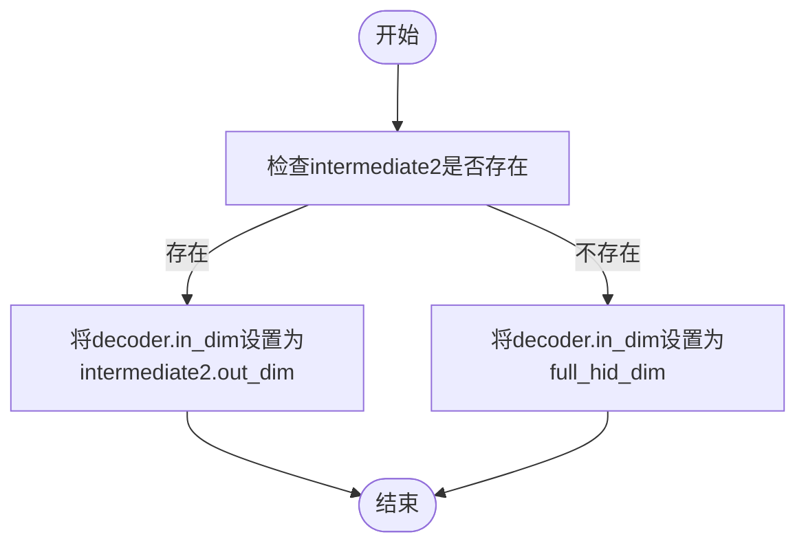

# 解码器协调

<cite>
**本文档引用的文件**   
- [base.py](file://eznlp/model/decoder/base.py)
- [sequence_tagging.py](file://eznlp/model/decoder/sequence_tagging.py)
- [text_classification.py](file://eznlp/model/decoder/text_classification.py)
- [boundary_selection.py](file://eznlp/model/decoder/boundary_selection.py)
- [span_classification.py](file://eznlp/model/decoder/span_classification.py)
- [span_attr_classification.py](file://eznlp/model/decoder/span_attr_classification.py)
- [span_rel_classification.py](file://eznlp/model/decoder/span_rel_classification.py)
- [joint_extraction.py](file://eznlp/model/decoder/joint_extraction.py)
- [config.py](file://eznlp/config.py)
- [wrapper.py](file://eznlp/wrapper.py)
- [extractor.py](file://eznlp/model/model/extractor.py)
- [classifier.py](file://eznlp/model/model/classifier.py)
</cite>

## 目录
1. [引言](#引言)
2. [解码器配置体系](#解码器配置体系)
3. [核心解码策略](#核心解码策略)
4. [解码器实例化机制](#解码器实例化机制)
5. [维度设置逻辑](#维度设置逻辑)
6. [联合抽取解码器](#联合抽取解码器)
7. [配置示例与数据流](#配置示例与数据流)
8. [结论](#结论)

## 引言
在eznlp框架中，解码器（Decoder）是模型架构中的关键组件，负责将编码器生成的隐藏状态转换为具体的预测输出。本文档系统性地解析eznlp中解码器的协调机制，重点说明ExtractorConfig如何通过decoder配置项支持多种解码策略，包括序列标注、Span分类、边界选择等。我们将深入探讨解码器的实例化过程、维度设置逻辑以及联合抽取解码器的特殊性。

## 解码器配置体系

eznlp的解码器配置体系基于面向对象的设计模式，构建了一个层次化的配置类结构。核心基类`SingleDecoderConfigBase`定义了所有解码器共有的配置属性和方法，如输入维度`in_dim`、多标签预测`multilabel`、置信度阈值`conf_thresh`以及损失函数相关参数`fl_gamma`和`sl_epsilon`。

```mermaid
classDiagram
class DecoderMixinBase {
+num_metrics : int
+retrieve(batch : Batch) : Any
+evaluate(y_gold : List, y_pred : List) : float
}
class SingleDecoderConfigBase {
+in_dim : int
+multilabel : bool
+conf_thresh : float
+fl_gamma : float
+sl_epsilon : float
+criterion : str
+instantiate_criterion() : Loss
}
class DecoderBase {
+forward(batch : Batch, **states) : Tensor
+decode(batch : Batch, **states) : Any
}
SingleDecoderConfigBase <|-- SequenceTaggingDecoderConfig
SingleDecoderConfigBase <|-- TextClassificationDecoderConfig
SingleDecoderConfigBase <|-- SpanClassificationDecoderConfig
SingleDecoderConfigBase <|-- BoundarySelectionDecoderConfig
SingleDecoderConfigBase <|-- JointExtractionDecoderConfig
DecoderMixinBase <|-- SequenceTaggingDecoderMixin
DecoderMixinBase <|-- TextClassificationDecoderMixin
DecoderMixinBase <|-- BoundariesDecoderMixin
DecoderMixinBase <|-- JointExtractionDecoderMixin
DecoderBase <|-- SequenceTaggingDecoder
DecoderBase <|-- TextClassificationDecoder
DecoderBase <|-- SpanClassificationDecoder
DecoderBase <|-- BoundarySelectionDecoder
DecoderBase <|-- JointExtractionDecoder
```



**图源**
- [base.py](file://eznlp/model/decoder/base.py#L52-L114)

**本节来源**
- [base.py](file://eznlp/model/decoder/base.py#L52-L114)
- [config.py](file://eznlp/config.py#L20-L173)

## 核心解码策略

eznlp支持多种解码策略，每种策略针对不同的自然语言处理任务。

### 序列标注解码器
`SequenceTaggingDecoderConfig`用于序列标注任务，如命名实体识别（NER）。它支持BIOES等标注方案，并可选择使用CRF层进行解码。该解码器通过`Tags`类将实体片段（chunks）转换为标签序列，并在`forward`方法中计算损失。

### 文本分类解码器
`TextClassificationDecoderConfig`用于文本分类任务。它首先通过`SequencePooling`或`SequenceAttention`对序列隐藏状态进行聚合，然后通过线性层映射到标签空间。该解码器使用准确率作为评估指标。

### 边界选择解码器
`BoundarySelectionDecoderConfig`采用边界选择策略进行实体识别。它通过两个独立的缩减网络（reduction）分别计算每个token作为实体开始和结束位置的得分，然后通过张量乘法计算所有可能span的得分。

### Span分类解码器
`SpanClassificationDecoderConfig`直接对预定义的span进行分类。它枚举所有可能的span，通过池化或注意力机制聚合span内的隐藏状态，然后进行分类。该解码器支持最大span长度限制和嵌入式大小嵌入。

**本节来源**
- [sequence_tagging.py](file://eznlp/model/decoder/sequence_tagging.py#L16-L198)
- [text_classification.py](file://eznlp/model/decoder/text_classification.py#L13-L117)
- [boundary_selection.py](file://eznlp/model/decoder/boundary_selection.py#L22-L384)
- [span_classification.py](file://eznlp/model/decoder/span_classification.py#L27-L344)

## 解码器实例化机制

解码器的实例化过程是eznlp灵活性的关键。`ExtractorConfig`通过`decoder`配置项接收解码器配置，支持两种形式：直接传入配置对象或传入字符串标识符。

当传入字符串标识符时，系统会动态创建对应的解码器配置对象。例如，在`JointExtractionDecoderConfig`中，`ck_decoder`参数可以是`"sequence_tagging"`、`"span_classification"`或`"boundary"`等字符串，构造函数会根据字符串前缀自动实例化相应的配置类。

```python
if isinstance(ck_decoder, SingleDecoderConfigBase):
    self.ck_decoder = ck_decoder
elif ck_decoder.lower().startswith("sequence_tagging"):
    self.ck_decoder = SequenceTaggingDecoderConfig()
elif ck_decoder.lower().startswith("span_classification"):
    self.ck_decoder = SpanClassificationDecoderConfig()
elif ck_decoder.lower().startswith("boundary"):
    self.ck_decoder = BoundarySelectionDecoderConfig()
```

这种机制允许用户通过简单的字符串配置来切换不同的解码策略，极大地提高了框架的易用性。

**本节来源**
- [joint_extraction.py](file://eznlp/model/decoder/joint_extraction.py#L70-L86)
- [__init__.py](file://eznlp/model/decoder/__init__.py#L1-L37)

## 维度设置逻辑

解码器的输入维度`in_dim`设置是模型构建的关键环节。在`ExtractorConfig`的`build_vocabs_and_dims`方法中，解码器的输入维度根据`intermediate2`的输出维度或`full_hid_dim`来确定。



`full_hid_dim`的计算考虑了基础嵌入维度、中间层1的输出维度以及所有预训练模型（如BERT）的输出维度之和。这种设计确保了解码器能够接收到经过充分处理的特征表示。

**本节来源**
- [extractor.py](file://eznlp/model/model/extractor.py#L107-L146)
- [classifier.py](file://eznlp/model/model/classifier.py#L80-L118)

## 联合抽取解码器

`JointExtractionDecoderConfig`是eznlp中一个特殊的解码器配置，用于协调多个子解码器的联合训练，如实体识别和关系抽取。

### 架构与协调
该解码器配置包含三个核心子解码器：`ck_decoder`（实体识别）、`attr_decoder`（属性抽取）和`rel_decoder`（关系抽取）。它通过`has_attr_decoder`和`has_rel_decoder`属性动态管理子解码器的存在性，并通过`num_metrics`属性返回评估指标的数量。

### 数据流与依赖
在前向传播过程中，`JointExtractionDecoder`首先调用`ck_decoder`进行实体识别，然后将预测的实体边界传递给`attr_decoder`和`rel_decoder`，作为它们的输入。这种级联式的数据流确保了下游任务能够基于上游任务的预测结果进行。

```python
def forward(self, batch: Batch, **states):
    losses = self.ck_decoder(batch, **states) * self.ck_loss_weight
    batch_chunks_pred = self.ck_decoder.decode(batch, **states)

    if self.has_attr_decoder:
        self.attr_decoder.assign_chunks_pred(batch, batch_chunks_pred)
        losses += self.attr_decoder(batch, **states) * self.attr_loss_weight

    if self.has_rel_decoder:
        self.rel_decoder.assign_chunks_pred(batch, batch_chunks_pred)
        losses += self.rel_decoder(batch, **states) * self.rel_loss_weight

    return losses
```

**本节来源**
- [joint_extraction.py](file://eznlp/model/decoder/joint_extraction.py#L19-L193)

## 配置示例与数据流

以下是一个典型的联合抽取任务配置示例：

```python
config = ExtractorConfig(
    decoder=JointExtractionDecoderConfig(
        ck_decoder="span_classification",
        attr_decoder="span_attr",
        rel_decoder="span_rel"
    )
)
```

在此配置中，`ExtractorConfig`会自动实例化`SpanClassificationDecoderConfig`作为实体识别解码器，`SpanAttrClassificationDecoderConfig`作为属性抽取解码器，以及`SpanRelClassificationDecoderConfig`作为关系抽取解码器。

数据流从编码器开始，经过`intermediate2`处理后，其输出维度被设置为所有子解码器的输入维度。实体识别解码器首先生成实体预测，然后这些预测结果被传递给属性和关系解码器，用于后续的联合抽取任务。

**本节来源**
- [test_joint_extraction.py](file://tests/model/test_joint_extraction.py#L65-L84)
- [test_sequence_tagging.py](file://tests/model/test_sequence_tagging.py#L72-L82)

## 结论
eznlp通过精心设计的解码器协调机制，实现了对多种NLP任务的灵活支持。其核心在于`ExtractorConfig`的`decoder`配置项，它不仅支持多种解码策略的动态切换，还通过`JointExtractionDecoderConfig`实现了复杂任务的联合建模。解码器的维度设置逻辑确保了特征表示的连贯性，而实例化机制则大大简化了模型配置的复杂性。这一系列设计使得eznlp成为一个强大且易用的自然语言处理框架。