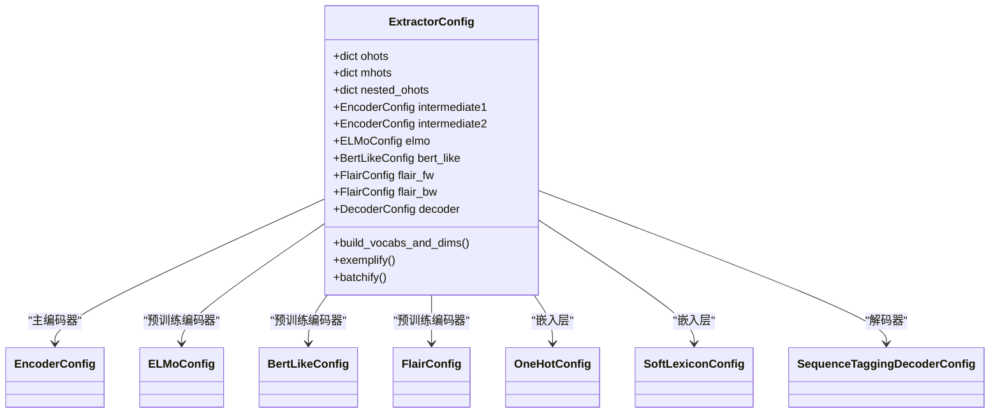
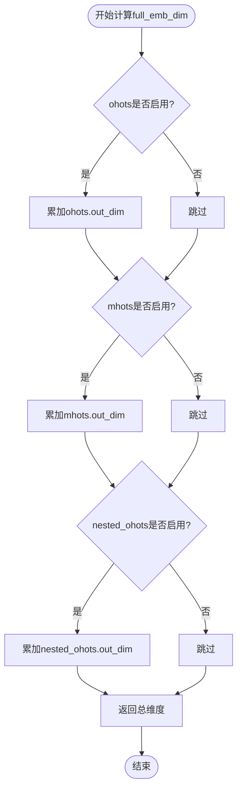
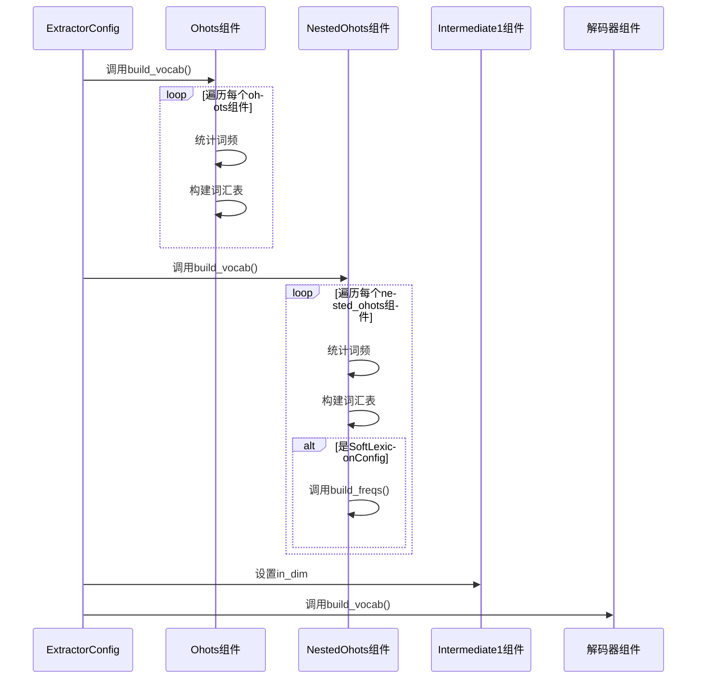
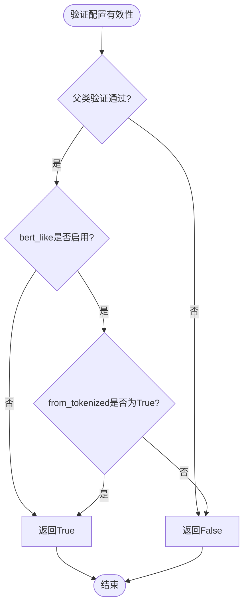

# Extractor配置

<cite>
**本文档引用的文件**   
- [config.py](file://eznlp/config.py)
- [extractor.py](file://eznlp/model/model/extractor.py)
- [embedder.py](file://eznlp/model/embedder.py)
- [nested_embedder.py](file://eznlp/model/nested_embedder.py)
- [encoder.py](file://eznlp/model/encoder.py)
- [bert_like.py](file://eznlp/model/bert_like.py)
- [NER任务完整流程.md](file://docs/NER任务完整流程.md)
</cite>

## 目录
1. [ExtractorConfig架构设计](#extractorconfig架构设计)
2. [组件集成机制](#组件集成机制)
3. [维度计算机制](#维度计算机制)
4. [词汇表构建流程](#词汇表构建流程)
5. [中文NER配置示例](#中文ner配置示例)
6. [约束条件分析](#约束条件分析)

## ExtractorConfig架构设计

ExtractorConfig类是eznlp框架中命名实体识别模型的核心配置类，采用层次化架构设计。该类继承自ModelConfigBase，通过模块化组件构建完整的NER模型架构。

ExtractorConfig的架构设计遵循分层原则，将模型分解为多个可配置的组件。其核心架构包含三个主要层次：嵌入层、预训练编码器和主编码器。这种分层设计使得模型具有高度的灵活性和可扩展性，可以根据具体任务需求灵活组合不同的组件。

在嵌入层设计中，ExtractorConfig支持多种嵌入方式，包括基本的one-hot嵌入(ohots)、多热嵌入(mhots)和嵌套one-hot嵌入(nested_ohots)。这些嵌入组件通过ConfigDict进行管理，实现了对多种特征嵌入的统一配置和管理。

预训练编码器层集成了当前主流的预训练语言模型，包括ELMo、BERT-like和Flair等。这些预训练编码器能够提供丰富的上下文表示，显著提升NER任务的性能。主编码器(intermediate1和intermediate2)则负责对嵌入层输出进行进一步处理和特征提取。

**Section sources**
- [extractor.py](file://eznlp/model/model/extractor.py#L23-L48)
- [config.py](file://eznlp/config.py#L20-L72)

## 组件集成机制

ExtractorConfig通过精心设计的组件集成机制，实现了各模块的无缝协作。这种集成机制基于配置类的属性管理和方法调用，确保了数据在不同组件间的正确流动。

在初始化过程中，ExtractorConfig通过kwargs参数接收各种组件配置，并将其分配给相应的属性。例如，嵌入层组件通过pop方法从kwargs中提取配置，如果未提供则使用默认配置。这种设计既保证了配置的灵活性，又提供了合理的默认值。



**Diagram sources**
- [extractor.py](file://eznlp/model/model/extractor.py#L50-L89)
- [encoder.py](file://eznlp/model/encoder.py#L15-L58)
- [bert_like.py](file://eznlp/model/bert_like.py#L96-L115)

组件间的集成通过一系列协调方法实现。build_vocabs_and_dims方法负责协调各组件的词汇表构建，确保所有组件在训练前都已完成必要的初始化。exemplify和batchify方法则负责数据的预处理和批处理，确保数据格式在各组件间保持一致。

## 维度计算机制

ExtractorConfig通过full_emb_dim和full_hid_dim两个属性实现动态维度计算，这是其架构设计中的关键机制。这两个属性的计算考虑了所有激活组件的输出维度，确保模型各层之间的维度匹配。

full_emb_dim属性计算所有嵌入层的总维度。该计算通过遍历ohots、mhots和nested_ohots三个嵌入组件，累加它们的out_dim属性实现。如果某个组件未启用，则其贡献为0。这种设计使得模型能够灵活处理不同组合的嵌入特征。



**Diagram sources**
- [extractor.py](file://eznlp/model/model/extractor.py#L99-L107)

full_hid_dim属性的计算更为复杂，它需要考虑主编码器intermediate1的输出维度以及所有预训练编码器的输出维度。如果intermediate1启用，则使用其out_dim作为基础；否则使用full_emb_dim作为基础。然后累加所有启用的预训练编码器(out_dim)的维度，包括elmo、bert_like、flair_fw和flair_bw。

这种动态维度计算机制的优势在于，它能够自动适应不同的组件配置，无需手动调整维度参数。当添加或移除某个组件时，相关维度会自动重新计算，确保模型结构的一致性。

## 词汇表构建流程

build_vocabs_and_dims方法是ExtractorConfig中协调各组件词汇表构建的核心方法。该方法接收数据分区作为输入，为所有需要词汇表的组件构建相应的词汇表，并设置各组件的输入维度。

方法首先处理各种嵌入组件的词汇表构建。对于ohots和nested_ohots组件，调用其build_vocab方法，传入所有数据分区。对于nested_ohots中的SoftLexiconConfig，还需要调用build_freqs方法构建词频统计，这在中文NER任务中尤为重要。



**Diagram sources**
- [extractor.py](file://eznlp/model/model/extractor.py#L122-L147)
- [nested_embedder.py](file://eznlp/model/nested_embedder.py#L169-L191)

对于主编码器intermediate1和intermediate2，该方法负责设置其输入维度。intermediate1的输入维度设置为full_emb_dim，而intermediate2的输入维度设置为full_hid_dim。这种设计确保了编码器能够正确接收来自前一层的输出。

最后，该方法调用解码器的build_vocab方法，为解码器构建必要的词汇表。整个流程确保了模型所有组件在训练前都已完成必要的初始化和配置。

## 中文NER配置示例

在中文NER任务中，SoftLexicon嵌入是一种重要的特征。通过配置nested_ohots中的SoftLexiconConfig，可以有效利用中文分词信息提升NER性能。

```python
# 中文NER配置示例
config = ExtractorConfig(
    ohots=ConfigDict({
        "text": OneHotConfig(
            field="text",
            emb_dim=100,
            min_freq=2
        )
    }),
    nested_ohots=ConfigDict({
        "softlexicon": SoftLexiconConfig(
            vectors=ctb_vectors,
            emb_dim=50,
            agg_mode="wtd_mean_pooling"
        )
    }),
    intermediate1=EncoderConfig(
        arch="LSTM",
        hid_dim=128,
        num_layers=1
    ),
    bert_like=BertLikeConfig(
        tokenizer=tokenizer,
        bert_like=bert_model,
        arch="BERT",
        freeze=False
    ),
    intermediate2=EncoderConfig(
        arch="LSTM",
        hid_dim=256,
        num_layers=1
    ),
    decoder=SequenceTaggingDecoderConfig(
        scheme="BIOES",
        use_crf=True
    )
)
```

这种配置结合了传统特征和预训练模型的优势。OneHotConfig处理基本的字符级嵌入，SoftLexiconConfig利用外部词典信息，BERT-like提供深层上下文表示，最后通过LSTM编码器和CRF解码器完成实体识别。

**Section sources**
- [extractor.py](file://eznlp/model/model/extractor.py#L57-L68)
- [nested_embedder.py](file://eznlp/model/nested_embedder.py#L160-L167)
- [NER任务完整流程.md](file://docs/NER任务完整流程.md#L140-L148)

## 约束条件分析

ExtractorConfig的valid属性中包含了对bert_like.from_tokenized的重要约束条件。这一约束确保了当使用BERT-like模型时，输入数据必须是已经分词的格式。

valid属性的实现继承自父类，并添加了特定于ExtractorConfig的验证逻辑。具体来说，它要求如果bert_like组件被启用，则其from_tokenized属性必须为True。这一约束的目的是确保BERT模型的输入格式正确，避免因分词不一致导致的性能下降。



**Diagram sources**
- [extractor.py](file://eznlp/model/model/extractor.py#L93-L96)

这一约束条件反映了框架对数据预处理的一致性要求。在实际应用中，这意味着使用BERT模型时，必须确保输入文本已经过适当的分词处理，且分词结果与BERT模型的分词器兼容。这种设计避免了在模型内部进行额外的分词操作，提高了处理效率和结果的可预测性。