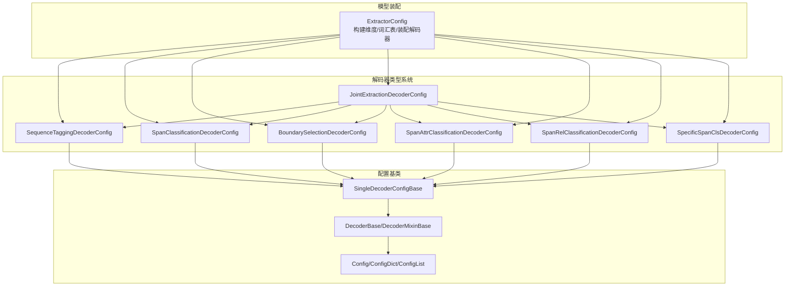
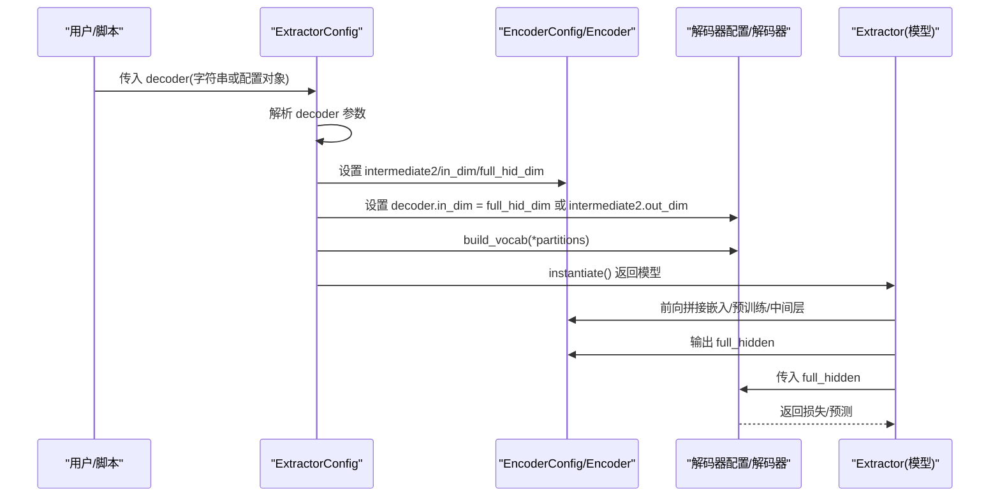
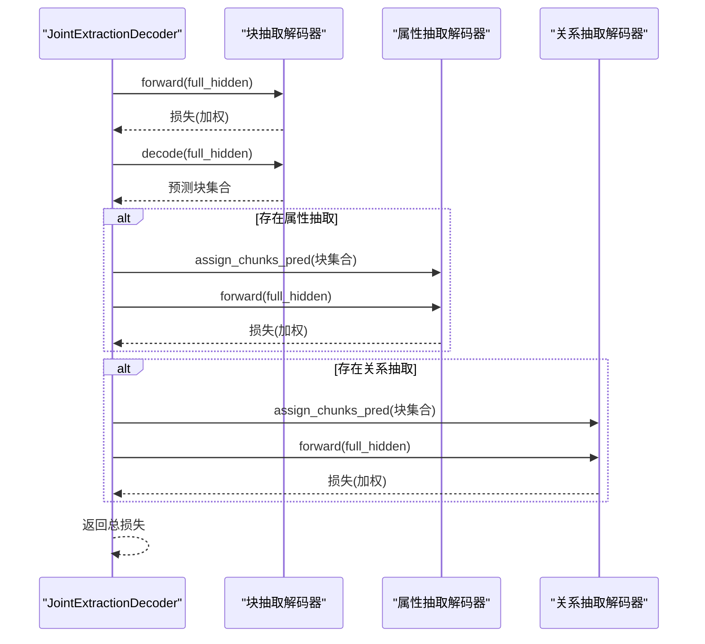
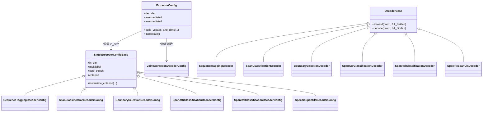

# 解码器配置

<cite>
**本文引用的文件列表**
- [extractor.py](file://eznlp/model/model/extractor.py)
- [config.py](file://eznlp/config.py)
- [base.py](file://eznlp/model/decoder/base.py)
- [sequence_tagging.py](file://eznlp/model/decoder/sequence_tagging.py)
- [span_classification.py](file://eznlp/model/decoder/span_classification.py)
- [boundary_selection.py](file://eznlp/model/decoder/boundary_selection.py)
- [joint_extraction.py](file://eznlp/model/decoder/joint_extraction.py)
- [span_attr_classification.py](file://eznlp/model/decoder/span_attr_classification.py)
- [span_rel_classification.py](file://eznlp/model/decoder/span_rel_classification.py)
- [specific_span_classification.py](file://eznlp/model/decoder/specific_span_classification.py)
- [NER任务完整流程.md](file://docs/NER任务完整流程.md)
</cite>

## 目录
1. [引言](#引言)
2. [项目结构](#项目结构)
3. [核心组件](#核心组件)
4. [架构总览](#架构总览)
5. [详细组件分析](#详细组件分析)
6. [依赖关系分析](#依赖关系分析)
7. [性能考量](#性能考量)
8. [故障排查指南](#故障排查指南)
9. [结论](#结论)
10. [附录](#附录)

## 引言
本文件系统性梳理并讲解 eznlp 中 ExtractorConfig 的解码器配置机制与类型系统，重点覆盖：
- __init__ 方法如何通过 decoder 参数同时支持字符串标识符与配置对象两种初始化方式；
- 主要解码器类型：sequence_tagging、span_classification、boundary_selection、joint_extraction 等；
- 各解码器对应的配置类（如 SequenceTaggingDecoderConfig、SpanClassificationDecoderConfig 等）及其关键参数；
- 解码器与编码器之间的维度衔接机制，尤其是 in_dim 如何通过 full_hid_dim 自动计算；
- 提供联合抽取任务（joint_extraction）的完整配置示例与流程说明。

## 项目结构
围绕解码器配置与类型系统的相关文件组织如下：
- 模型配置与装配：ExtractorConfig 定义于模型装配模块，负责将嵌入、编码器与解码器串联起来，并在构建阶段完成维度推导与词汇表构建。
- 解码器类型系统：位于 model/decoder 子包，包含基础基类、单解码器配置基类、以及各类解码器的配置与实现。
- 配置基类：config.py 提供通用 Config/ConfigDict/ConfigList 等容器与实例化机制。
- 文档示例：NER任务完整流程.md 提供了使用示例与命令行调用参考。

图表来源
- [extractor.py](file://eznlp/model/model/extractor.py#L50-L90)
- [sequence_tagging.py](file://eznlp/model/decoder/sequence_tagging.py#L93-L141)
- [span_classification.py](file://eznlp/model/decoder/span_classification.py#L27-L161)
- [boundary_selection.py](file://eznlp/model/decoder/boundary_selection.py#L92-L200)
- [joint_extraction.py](file://eznlp/model/decoder/joint_extraction.py#L68-L152)
- [span_attr_classification.py](file://eznlp/model/decoder/span_attr_classification.py#L91-L193)
- [span_rel_classification.py](file://eznlp/model/decoder/span_rel_classification.py#L156-L318)
- [specific_span_classification.py](file://eznlp/model/decoder/specific_span_classification.py#L25-L90)
- [config.py](file://eznlp/config.py#L121-L173)
- [base.py](file://eznlp/model/decoder/base.py#L52-L114)

章节来源
- [extractor.py](file://eznlp/model/model/extractor.py#L50-L90)
- [config.py](file://eznlp/config.py#L121-L173)

## 核心组件
- ExtractorConfig：统一装配入口，负责解析 decoder 参数（字符串或配置对象），并按需构建词汇表与维度；随后将解码器的 in_dim 设置为编码器输出维度（或中间拼接后的维度）。
- SingleDecoderConfigBase：所有单任务解码器配置的基类，统一提供 in_dim、multilabel、conf_thresh、loss 形态（含 Focal Loss、标签平滑、边界平滑等）等通用能力。
- DecoderBase/DecoderMixinBase：解码器接口与混合类，定义 forward/decode 接口、检索与评估接口等。
- JointExtractionDecoderConfig：联合抽取配置，支持同时装配“块抽取”“属性抽取”“关系抽取”，并可共享权重、控制损失权重比例。

章节来源
- [extractor.py](file://eznlp/model/model/extractor.py#L50-L90)
- [base.py](file://eznlp/model/decoder/base.py#L52-L114)
- [joint_extraction.py](file://eznlp/model/decoder/joint_extraction.py#L68-L152)

## 架构总览
下图展示从配置到模型实例化的整体流程，以及解码器与编码器的维度衔接。

图表来源
- [extractor.py](file://eznlp/model/model/extractor.py#L122-L148)
- [extractor.py](file://eznlp/model/model/extractor.py#L205-L210)

章节来源
- [extractor.py](file://eznlp/model/model/extractor.py#L122-L148)
- [extractor.py](file://eznlp/model/model/extractor.py#L205-L210)

## 详细组件分析

### ExtractorConfig 的 __init__ 与解码器初始化
- 支持 decoder 为字符串或配置对象：
  - 字符串时，根据前缀匹配创建对应解码器配置（如 sequence_tagging、span_classification、boundary、joint_extraction 等）。
  - 配置对象时直接使用。
- 对于 joint_extraction，内部默认装配 span_classification 块抽取与 span_rel 分类关系抽取（可选属性抽取）。
- 该机制确保用户既可通过简洁字符串快速指定主流解码器，也可通过显式配置对象精细控制参数。

章节来源
- [extractor.py](file://eznlp/model/model/extractor.py#L50-L90)

### 单解码器配置基类：SingleDecoderConfigBase
- 统一参数：
  - in_dim：解码器输入维度（由装配流程自动设置）
  - multilabel：是否多标签分类
  - conf_thresh：置信度阈值
  - fl_gamma/sl_epsilon：Focal Loss/标签平滑参数
- 统一能力：
  - criterion 名称生成与 instantiate_criterion：根据参数动态选择 BCEWithLogitsLoss、FocalLoss、SmoothLabelCrossEntropyLoss 或 CrossEntropyLoss。
  - 适用于序列标注、Span 分类、边界选择、关系抽取、属性抽取等场景。

章节来源
- [base.py](file://eznlp/model/decoder/base.py#L52-L114)

### 序列标注解码器：SequenceTaggingDecoderConfig/Decoder
- 关键参数：
  - scheme：标注方案（如 BIOES）
  - use_crf：是否使用 CRF
  - in_drop_rates：输入 dropout 等
- 特点：
  - 通过 CRF 或交叉熵训练，支持标签体系构建与翻译（chunks <-> tags）。
  - decode 将标签序列转换回实体块。
- 适用场景：传统序列标注任务，适合细粒度实体边界识别。

章节来源
- [sequence_tagging.py](file://eznlp/model/decoder/sequence_tagging.py#L93-L141)
- [sequence_tagging.py](file://eznlp/model/decoder/sequence_tagging.py#L143-L198)

### Span 分类解码器：SpanClassificationDecoderConfig/Decoder
- 关键参数：
  - max_span_size/max_span_size_ceiling/max_span_size_cov_rate：最大跨度统计与裁剪策略
  - size_emb_dim：跨度大小嵌入维度
  - agg_mode：聚合模式（max_pooling/attention）
  - sb_epsilon/sb_size：边界平滑超参
  - neg_sampling_*、nested_sampling_*：负采样与嵌套采样策略
- 特点：
  - 对每个候选跨度进行分类，支持多标签与边界平滑。
  - 可选内部/外部跨度一致性损失（MK-MMD）。
- 适用场景：基于跨度的实体识别，兼顾长跨度与嵌套实体。

章节来源
- [span_classification.py](file://eznlp/model/decoder/span_classification.py#L27-L161)
- [span_classification.py](file://eznlp/model/decoder/span_classification.py#L163-L344)

### 边界选择解码器：BoundarySelectionDecoderConfig/Decoder
- 关键参数：
  - reduction：两端边界分别经 FFN/Transformer 等降维
  - size_emb_dim：跨度大小嵌入
  - sb_epsilon/sb_size：边界平滑
  - neg_sampling_*、nested_sampling_*：采样策略
- 特点：
  - 通过双线性/仿射融合两端边界表示，形成二维跨度得分矩阵。
  - 支持多标签与边界平滑。
- 适用场景：边界感知的跨度分类，适合复杂句法/语义上下文。

章节来源
- [boundary_selection.py](file://eznlp/model/decoder/boundary_selection.py#L92-L200)
- [boundary_selection.py](file://eznlp/model/decoder/boundary_selection.py#L201-L384)

### 联合抽取解码器：JointExtractionDecoderConfig/Decoder
- 支持子解码器组合：
  - 必需：块抽取（ck_decoder）
  - 可选：属性抽取（attr_decoder）、关系抽取（rel_decoder）
- 关键参数：
  - ck_loss_weight/attr_loss_weight/rel_loss_weight：各子任务损失权重
  - share_embeddings：是否共享嵌入（注释提示不建议跨模块权重共享）
- 特点：
  - 顺序执行：先块抽取，再将预测块喂给属性/关系解码器。
  - 多任务评估返回元组，便于分别统计各子任务指标。
- 适用场景：端到端联合抽取，提升整体性能与一致性。

图表来源
- [joint_extraction.py](file://eznlp/model/decoder/joint_extraction.py#L154-L193)

章节来源
- [joint_extraction.py](file://eznlp/model/decoder/joint_extraction.py#L68-L152)
- [joint_extraction.py](file://eznlp/model/decoder/joint_extraction.py#L154-L193)

### 属性抽取与关系抽取（辅助理解）
- SpanAttrClassificationDecoderConfig/Decoder：对每个块进行属性分类（多标签为主），可选与块标签嵌入融合。
- SpanRelClassificationDecoderConfig/Decoder：对块对进行关系分类，支持 concat/affine 融合、上下文向量、对称关系补全、逆关系等高级特性。

章节来源
- [span_attr_classification.py](file://eznlp/model/decoder/span_attr_classification.py#L91-L193)
- [span_attr_classification.py](file://eznlp/model/decoder/span_attr_classification.py#L195-L386)
- [span_rel_classification.py](file://eznlp/model/decoder/span_rel_classification.py#L156-L318)
- [span_rel_classification.py](file://eznlp/model/decoder/span_rel_classification.py#L319-L585)

### SpecificSpanCls（特定跨度分类）
- 针对特定跨度大小范围（min_span_size=1/2）的跨度分类，支持边界平滑与 MK-MMD 辅助损失。
- 适用于对跨度长度有明确约束的任务。

章节来源
- [specific_span_classification.py](file://eznlp/model/decoder/specific_span_classification.py#L25-L90)
- [specific_span_classification.py](file://eznlp/model/decoder/specific_span_classification.py#L154-L338)

## 依赖关系分析

图表来源
- [extractor.py](file://eznlp/model/model/extractor.py#L50-L90)
- [base.py](file://eznlp/model/decoder/base.py#L52-L114)
- [sequence_tagging.py](file://eznlp/model/decoder/sequence_tagging.py#L93-L141)
- [span_classification.py](file://eznlp/model/decoder/span_classification.py#L27-L161)
- [boundary_selection.py](file://eznlp/model/decoder/boundary_selection.py#L92-L200)
- [joint_extraction.py](file://eznlp/model/decoder/joint_extraction.py#L68-L152)
- [span_attr_classification.py](file://eznlp/model/decoder/span_attr_classification.py#L91-L193)
- [span_rel_classification.py](file://eznlp/model/decoder/span_rel_classification.py#L156-L318)
- [specific_span_classification.py](file://eznlp/model/decoder/specific_span_classification.py#L25-L90)

章节来源
- [extractor.py](file://eznlp/model/model/extractor.py#L50-L90)
- [base.py](file://eznlp/model/decoder/base.py#L52-L114)

## 性能考量
- 维度衔接与内存：
  - in_dim 由 full_hid_dim 或 intermediate2.out_dim 决定，避免手动设置错误导致的维度不匹配。
  - 大跨度（max_span_size）会显著增加候选跨度数量，建议结合数据分布合理裁剪。
- 计算开销：
  - Span 分类/边界选择涉及对所有跨度的打分，复杂度与序列长度平方成正比；必要时启用多标签阈值过滤与采样策略。
  - 关系抽取的 concat/affine 融合在大批次下可能带来额外显存压力，可考虑减少维度或关闭上下文分支。
- 正则化与稳定性：
  - Focal Loss/标签平滑/边界平滑有助于缓解类别不平衡与过拟合。
  - 多任务联合训练时，合理分配 ck/attr/rel 的损失权重，避免主导任务淹没其他子任务。

[本节为通用指导，无需列出具体文件来源]

## 故障排查指南
- 报错“decoder 参数无效”：
  - 确认传入字符串是否以 sequence_tagging/span_classification/boundary/joint_extraction 等前缀匹配。
- 维度不匹配：
  - 检查 build_vocabs_and_dims 是否在实例化模型前调用；确认 intermediate2 是否存在，in_dim 来源是否正确。
- 多标签阈值过高导致无预测：
  - 适当降低 conf_thresh 或检查标签分布。
- 联合抽取无属性/关系预测：
  - 确认 ck_decoder 的 decode 结果已赋给 attr/rel 解码器；检查 assign_chunks_pred 是否被调用。

章节来源
- [extractor.py](file://eznlp/model/model/extractor.py#L122-L148)
- [joint_extraction.py](file://eznlp/model/decoder/joint_extraction.py#L154-L193)

## 结论
- ExtractorConfig 通过统一的 __init__ 与装配流程，实现了对多种解码器类型的无缝接入，既支持字符串快捷配置，也允许显式配置对象精细化控制。
- 解码器类型系统以 SingleDecoderConfigBase 为核心，向上提供统一的损失与评估接口，向下覆盖序列标注、Span 分类、边界选择、联合抽取等主流 NER 场景。
- 维度衔接通过 full_hid_dim 自动推导，配合 build_vocabs_and_dims，确保解码器 in_dim 与编码器输出一致，降低配置成本与出错概率。
- 联合抽取通过 JointExtractionDecoderConfig 将块、属性、关系三者串联，提供多任务协同训练与评估的能力。

[本节为总结，无需列出具体文件来源]

## 附录

### 配置与使用要点速查
- 字符串初始化解码器：
  - sequence_tagging：序列标注
  - span_classification：Span 分类
  - boundary：边界选择
  - joint_extraction：联合抽取（默认装配块抽取与关系抽取）
- 关键参数位置参考：
  - SequenceTagging：scheme/use_crf/in_drop_rates
  - SpanClassification：max_span_size/agg_mode/sb_epsilon
  - BoundarySelection：reduction/arch/size_emb_dim/sb_epsilon
  - JointExtraction：ck_loss_weight/attr_loss_weight/rel_loss_weight
- 维度衔接：
  - 若存在 intermediate2：decoder.in_dim = intermediate2.out_dim
  - 否则：decoder.in_dim = full_hid_dim（嵌入/预训练/中间层拼接后的维度）

章节来源
- [extractor.py](file://eznlp/model/model/extractor.py#L122-L148)
- [sequence_tagting.py](file://eznlp/model/decoder/sequence_tagging.py#L93-L141)
- [span_classification.py](file://eznlp/model/decoder/span_classification.py#L27-L161)
- [boundary_selection.py](file://eznlp/model/decoder/boundary_selection.py#L92-L200)
- [joint_extraction.py](file://eznlp/model/decoder/joint_extraction.py#L68-L152)

### 联合抽取任务（joint_extraction）配置示例流程
- 通过字符串指定联合抽取：
  - decoder="joint_extraction"，内部默认装配块抽取与关系抽取，属性抽取可选。
- 通过显式配置对象：
  - 显式传入 JointExtractionDecoderConfig，分别指定 ck_decoder、attr_decoder、rel_decoder，并设置损失权重。
- 训练与评估：
  - 使用文档中的训练脚本与命令行选项，结合 build_vocabs_and_dims 完成词汇表与维度构建后实例化模型。

章节来源
- [extractor.py](file://eznlp/model/model/extractor.py#L50-L90)
- [NER任务完整流程.md](file://docs/NER任务完整流程.md#L173-L225)
- [NER任务完整流程.md](file://docs/NER任务完整流程.md#L226-L276)