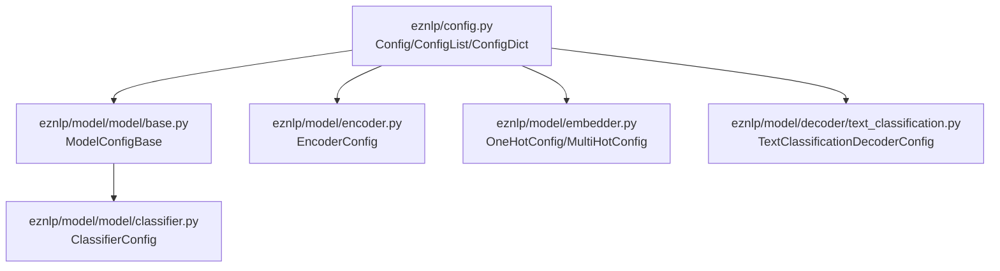
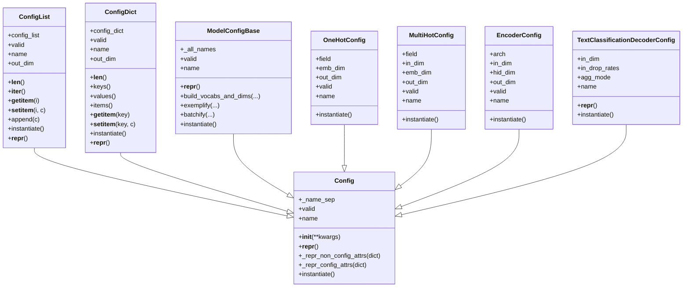
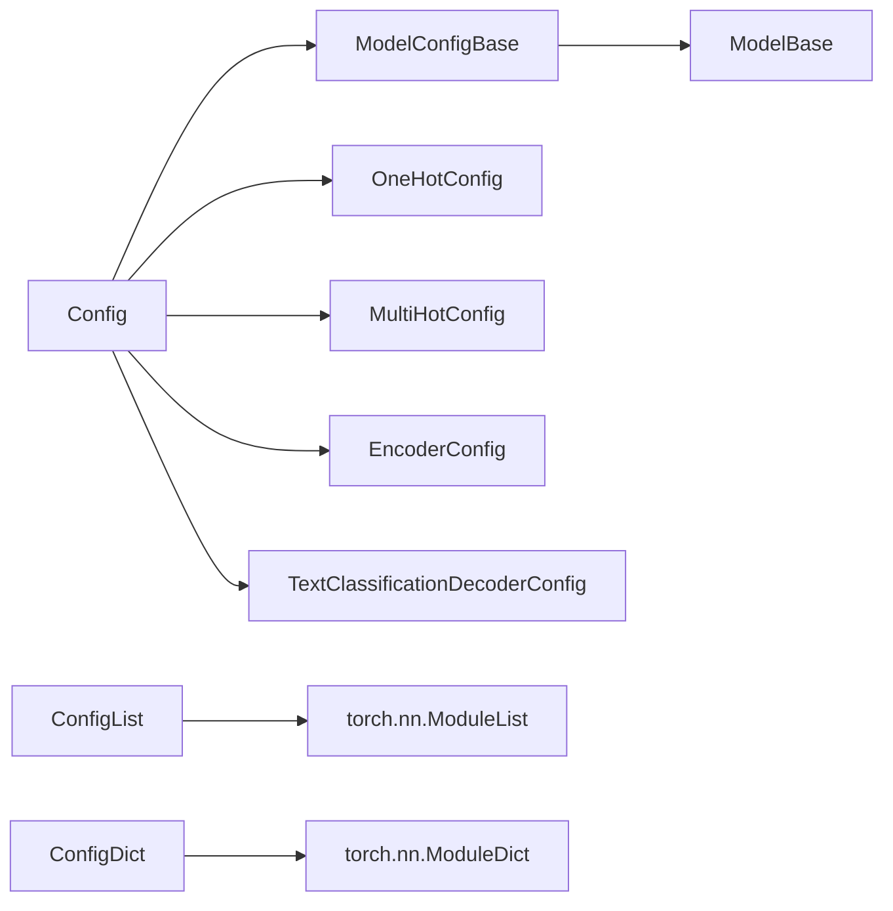

# 配置基类

<cite>
**本文引用的文件**
- [eznlp/config.py](file://eznlp/config.py)
- [eznlp/model/model/base.py](file://eznlp/model/model/base.py)
- [eznlp/model/model/classifier.py](file://eznlp/model/model/classifier.py)
- [eznlp/model/embedder.py](file://eznlp/model/embedder.py)
- [eznlp/model/encoder.py](file://eznlp/model/encoder.py)
- [eznlp/model/decoder/text_classification.py](file://eznlp/model/decoder/text_classification.py)
</cite>

## 目录
1. [引言](#引言)
2. [项目结构](#项目结构)
3. [核心组件](#核心组件)
4. [架构总览](#架构总览)
5. [详细组件分析](#详细组件分析)
6. [依赖关系分析](#依赖关系分析)
7. [性能考量](#性能考量)
8. [故障排查指南](#故障排查指南)
9. [结论](#结论)
10. [附录：最佳实践与示例路径](#附录最佳实践与示例路径)

## 引言
本篇文档围绕eznlp框架中的Config基类展开，系统阐释其作为所有配置对象的统一基类的设计理念与实现机制。重点包括：
- 通过__init__方法接收配置参数并进行“未检查设置”的告警提示；
- 通过valid属性实现递归验证配置有效性（支持None、Config子类、字典等）；
- 通过instantiate抽象方法定义实例化接口，确保配置到模块的解耦；
- _name_sep分隔符在命名拼接中的作用；
- _repr_config_attrs与_repr_non_config_attrs在配置对象字符串表示中的应用；
- 不建议将Config作为模型属性注册的设计考量；
- 自定义配置类继承Config基类的最佳实践与示例路径。

## 项目结构
Config基类位于eznlp/config.py，同时在模型层有多个具体配置类与其协作，如ModelConfigBase、各类Embedder/Encoder/Decoder的Config等。下图展示关键文件与职责映射：

图表来源
- [eznlp/config.py](file://eznlp/config.py#L20-L173)
- [eznlp/model/model/base.py](file://eznlp/model/model/base.py#L10-L62)
- [eznlp/model/model/classifier.py](file://eznlp/model/model/classifier.py#L16-L184)
- [eznlp/model/encoder.py](file://eznlp/model/encoder.py#L15-L90)
- [eznlp/model/embedder.py](file://eznlp/model/embedder.py#L51-L140)
- [eznlp/model/decoder/text_classification.py](file://eznlp/model/decoder/text_classification.py#L48-L77)

章节来源
- [eznlp/config.py](file://eznlp/config.py#L20-L173)

## 核心组件
- Config基类：定义通用配置行为，包括构造时的参数告警、递归有效性校验、名称拼接约定、字符串表示策略与抽象实例化接口。
- ConfigList：有序配置列表容器，支持长度、迭代、索引、追加、维度聚合与ModuleList实例化。
- ConfigDict：有序配置字典容器，支持键值访问、维度聚合与ModuleDict实例化。
- ModelConfigBase：面向模型的配置基类，扩展了按字段集合进行递归校验、名称拼接与更丰富的repr策略。
- 具体配置类：如OneHotConfig、MultiHotConfig、EncoderConfig、TextClassificationDecoderConfig等，均继承自Config或其派生类，覆盖name、valid、instantiate等。

章节来源
- [eznlp/config.py](file://eznlp/config.py#L20-L173)
- [eznlp/model/model/base.py](file://eznlp/model/model/base.py#L10-L62)
- [eznlp/model/embedder.py](file://eznlp/model/embedder.py#L51-L140)
- [eznlp/model/encoder.py](file://eznlp/model/encoder.py#L15-L90)
- [eznlp/model/decoder/text_classification.py](file://eznlp/model/decoder/text_classification.py#L48-L77)

## 架构总览
Config体系采用“配置对象—模块实例”的分离设计：配置对象仅承载元信息与构建规则，模块实例负责前向计算。ConfigList/ConfigDict用于组合多个子配置，统一管理名称与维度，并在instantiate阶段生成对应的ModuleList/ModuleDict。

图表来源
- [eznlp/config.py](file://eznlp/config.py#L20-L173)
- [eznlp/model/model/base.py](file://eznlp/model/model/base.py#L10-L62)
- [eznlp/model/embedder.py](file://eznlp/model/embedder.py#L51-L140)
- [eznlp/model/encoder.py](file://eznlp/model/encoder.py#L15-L90)
- [eznlp/model/decoder/text_classification.py](file://eznlp/model/decoder/text_classification.py#L48-L77)

## 详细组件分析

### Config基类：设计原则与实现要点
- 参数接收与告警
  - 在__init__中接收任意关键字参数；若存在未被显式消费的参数，会记录警告日志，并将其动态设置为对象属性，便于后续使用但不保证被消费。
  - 设计意图：允许灵活传参，同时提醒用户注意未被消费的键值对，避免遗漏配置项。
- 递归有效性校验valid
  - 遍历对象的所有属性，遇到None直接返回False；若某属性本身是Config子类，则递归调用其valid；只有全部通过才返回True。
  - 支持嵌套Config、None、以及字典（见ModelConfigBase）等复杂结构的统一校验。
- 名称拼接约定_name_sep
  - 类级分隔符，默认为短横线“-”，用于在组合容器（ConfigList/ConfigDict）与ModelConfigBase中拼接子配置的name。
- 字符串表示策略
  - __repr__默认使用_repr_non_config_attrs输出非Config类型的属性键值对。
  - _repr_config_attrs用于输出Config类型属性的缩进式多行表示，便于调试与日志打印。
- 实例化接口instantiate
  - 抽象方法，要求子类实现从配置到模块实例的创建逻辑，确保配置与模块实例解耦。
- 不建议作为模型属性注册
  - 文档注释明确指出：配置对象不建议作为对应模型或装配的属性注册，应通过instantiate生成模块实例并挂载到模型上，保持职责清晰与可维护性。

章节来源
- [eznlp/config.py](file://eznlp/config.py#L20-L72)

### ConfigList：有序配置列表容器
- 职责
  - 存储有序的Config子类实例，支持长度、迭代、索引、追加与设置；聚合子配置的out_dim；在instantiate阶段生成torch.nn.ModuleList。
- 命名与维度
  - name由各子配置的name以“-”连接而成；out_dim为子配置out_dim之和。
- 表示
  - __repr__使用_config_attrs格式输出每个索引及其对应配置的缩进式repr。

章节来源
- [eznlp/config.py](file://eznlp/config.py#L74-L119)

### ConfigDict：有序配置字典容器
- 职责
  - 以有序字典存储键到Config子类实例的映射，支持键值访问、遍历与维度聚合；instantiate生成torch.nn.ModuleDict。
- 命名与维度
  - name由各子配置的name以“-”连接而成；out_dim为子配置out_dim之和。
- 表示
  - __repr__使用_config_attrs格式输出每个键及其对应配置的缩进式repr。

章节来源
- [eznlp/config.py](file://eznlp/config.py#L121-L173)

### ModelConfigBase：模型配置基类
- 职责
  - 定义_model层的配置骨架，集中管理一组字段名（_all_names），按字段集合进行递归校验与名称拼接；提供build_vocabs_and_dims、exemplify、batchify等数据处理接口；instantiate抽象化。
- 递归校验valid
  - 遍历_all_names，对字典类型的属性（如ohots/mhots/nested_ohots）逐个校验子配置的有效性；非字典则直接调用子配置的valid。
- 名称拼接name
  - 将所有非None子配置的name以“-”连接，形成模型配置的统一标识。
- 表示
  - 使用_config_attrs格式输出所有属性，便于调试。

章节来源
- [eznlp/model/model/base.py](file://eznlp/model/model/base.py#L10-L62)

### 具体配置类示例

#### OneHotConfig：一阶嵌入器配置
- 关键点
  - 通过pop消费必要的字段（field、emb_dim等），其余kwargs交由父类Config处理。
  - valid校验除vectors外的关键字段非None；name返回field；out_dim返回emb_dim；instantiate返回OneHotEmbedder实例。
- 设计考量
  - 对外部预训练词向量的维度一致性进行告警与自动修正，提升鲁棒性。

章节来源
- [eznlp/model/embedder.py](file://eznlp/model/embedder.py#L51-L140)

#### MultiHotConfig：多值嵌入器配置
- 关键点
  - 支持是否使用嵌入层（use_emb）两种模式，out_dim根据use_emb决定；instantiate返回MultiHotEmbedder实例。
- 设计考量
  - 与OneHotConfig互补，满足不同特征表达需求。

章节来源
- [eznlp/model/embedder.py](file://eznlp/model/embedder.py#L197-L231)

#### EncoderConfig：编码器配置
- 关键点
  - 依据arch选择不同的网络结构（identity/ffn/lstm/gru/conv/gehring/transformer），分别设置相应的超参数；out_dim根据arch与shortcut计算；instantiate按arch返回对应编码器模块。
- 设计考量
  - 通过统一入口配置多种编码器架构，简化调用方逻辑。

章节来源
- [eznlp/model/encoder.py](file://eznlp/model/encoder.py#L15-L90)

#### TextClassificationDecoderConfig：文本分类解码器配置
- 关键点
  - 提供聚合模式（agg_mode）、输入dropout率（in_drop_rates）等；name由agg_mode与criterion拼接；__repr__仅输出关键属性；instantiate返回TextClassificationDecoder实例。
- 设计考量
  - 将解码器的配置与实现解耦，便于替换评估指标与聚合策略。

章节来源
- [eznlp/model/decoder/text_classification.py](file://eznlp/model/decoder/text_classification.py#L48-L77)

### _name_sep分隔符的作用
- 统一命名规范
  - 在ConfigList/ConfigDict与ModelConfigBase中，通过“-”连接子配置的name，形成层次化的模型标识，便于实验管理与日志追踪。
- 适用场景
  - 模型配置name拼接、日志输出、文件命名等需要稳定且可读的标识符时。

章节来源
- [eznlp/config.py](file://eznlp/config.py#L29-L30)
- [eznlp/config.py](file://eznlp/config.py#L89-L90)
- [eznlp/config.py](file://eznlp/config.py#L139-L140)
- [eznlp/model/model/base.py](file://eznlp/model/model/base.py#L36-L46)
- [eznlp/model/decoder/text_classification.py](file://eznlp/model/decoder/text_classification.py#L58-L60)

### _repr_config_attrs与_repr_non_config_attrs的应用
- _repr_non_config_attrs
  - 默认__repr__使用该方法输出非Config类型的属性键值对，适合简单配置对象的快速查看。
- _repr_config_attrs
  - 用于ConfigList/ConfigDict与ModelConfigBase的__repr__，输出缩进式的多行repr，便于调试与日志阅读。
- 应用示例
  - TextClassificationDecoderConfig重写__repr__，仅输出关键属性，避免冗长输出；而ModelConfigBase与容器类使用_config_attrs格式输出全量配置树。

章节来源
- [eznlp/config.py](file://eznlp/config.py#L53-L72)
- [eznlp/config.py](file://eznlp/config.py#L56-L68)
- [eznlp/config.py](file://eznlp/config.py#L117-L119)
- [eznlp/config.py](file://eznlp/config.py#L171-L173)
- [eznlp/model/model/base.py](file://eznlp/model/model/base.py#L48-L49)
- [eznlp/model/decoder/text_classification.py](file://eznlp/model/decoder/text_classification.py#L63-L67)

### 不建议将Config作为模型属性注册的设计考量
- 解耦与可维护性
  - Config仅承载配置信息，不应直接成为模型的属性，避免混淆职责边界。
- 实例化与生命周期
  - 通过instantiate生成模块实例并挂载到模型上，有利于统一管理模块的初始化、参数冻结、前向传播等生命周期操作。
- 可测试性与可替换性
  - 将配置与模块实例解耦，便于单元测试与替换不同实现。

章节来源
- [eznlp/config.py](file://eznlp/config.py#L21-L27)
- [eznlp/model/model/base.py](file://eznlp/model/model/base.py#L64-L99)

### 自定义配置类继承Config基类的最佳实践
- 明确字段与默认值
  - 在__init__中显式pop必要字段，其余kwargs交由super().__init__处理，确保未消费参数被记录告警。
- 实现name与valid
  - name应简洁且唯一，便于日志与实验管理；valid需覆盖所有关键字段与子配置的递归校验。
- 实现instantiate
  - 返回对应的模块实例，确保模块的初始化参数来自配置对象，保持配置驱动模块的行为。
- 合理使用_repr_*方法
  - 简单配置可用__repr__默认策略；复杂配置可重写__repr__，仅输出关键属性，或使用_config_attrs输出完整树形结构。
- 使用ConfigList/ConfigDict组织组合配置
  - 当配置包含多个子配置时，优先使用容器类进行组合，统一管理维度与实例化顺序。

示例路径（不展示代码内容）
- [OneHotConfig.__init__与instantiate](file://eznlp/model/embedder.py#L54-L82)
- [OneHotConfig.valid与name](file://eznlp/model/embedder.py#L83-L94)
- [MultiHotConfig.__init__与instantiate](file://eznlp/model/embedder.py#L200-L230)
- [EncoderConfig.__init__与instantiate](file://eznlp/model/encoder.py#L16-L58)
- [TextClassificationDecoderConfig.__repr__与instantiate](file://eznlp/model/decoder/text_classification.py#L63-L77)
- [ModelConfigBase.valid/name/__repr__](file://eznlp/model/model/base.py#L21-L49)

## 依赖关系分析
- Config与子类的依赖
  - 所有具体配置类（OneHotConfig、MultiHotConfig、EncoderConfig、TextClassificationDecoderConfig、ModelConfigBase等）均继承自Config，复用其通用能力。
- 容器类的依赖
  - ConfigList/ConfigDict依赖Config子类的name、valid、out_dim与instantiate接口，形成统一的组合与实例化协议。
- 模型层的依赖
  - ModelBase在初始化时通过遍历ModelConfigBase的_all_names，调用子配置的instantiate并挂载到自身，完成从配置到模块的装配。

图表来源
- [eznlp/config.py](file://eznlp/config.py#L20-L173)
- [eznlp/model/model/base.py](file://eznlp/model/model/base.py#L64-L99)
- [eznlp/model/embedder.py](file://eznlp/model/embedder.py#L51-L140)
- [eznlp/model/encoder.py](file://eznlp/model/encoder.py#L15-L90)
- [eznlp/model/decoder/text_classification.py](file://eznlp/model/decoder/text_classification.py#L48-L77)

## 性能考量
- 递归校验开销
  - valid对嵌套Config进行深度遍历，复杂度与子配置数量及层级成正比；在大规模配置树下应避免频繁重复校验，可在关键节点缓存结果。
- 字符串表示成本
  - 多行_config_attrs输出在调试时非常有用，但在高频日志场景下可能带来额外开销；建议在生产环境减少复杂repr输出。
- 实例化顺序一致性
  - ConfigList/ConfigDict的instantiate顺序需与模块forward一致，避免因顺序错误导致的维度不匹配或运行时异常。

## 故障排查指南
- 未消费的配置参数
  - 若出现“某些配置未被检查”的告警，检查传入kwargs是否被正确pop或是否拼写错误。
  - 参考路径：[Config.__init__告警逻辑](file://eznlp/config.py#L31-L39)
- 配置无效（valid为False）
  - 检查是否存在None值或子配置的valid为False；对字典类型的属性逐项排查。
  - 参考路径：[Config.valid递归校验](file://eznlp/config.py#L40-L48)，[ModelConfigBase.valid](file://eznlp/model/model/base.py#L21-L34)
- 名称拼接不符合预期
  - 确认子配置的name是否正确实现，以及_name_sep是否符合预期。
  - 参考路径：[ConfigList.name](file://eznlp/config.py#L88-L91)，[ConfigDict.name](file://eznlp/config.py#L138-L141)，[ModelConfigBase.name](file://eznlp/model/model/base.py#L36-L46)
- 实例化失败或维度不匹配
  - 检查instantiate返回的模块与配置的out_dim/in_dim是否一致；确认ConfigList/ConfigDict的顺序与forward一致。
  - 参考路径：[ConfigList.instantiate](file://eznlp/config.py#L113-L116)，[ConfigDict.instantiate](file://eznlp/config.py#L165-L169)，[ModelBase装配逻辑](file://eznlp/model/model/base.py#L64-L77)

## 结论
Config基类通过统一的参数接收、递归校验、命名规范与实例化接口，为eznlp框架提供了清晰、可扩展的配置体系。配合ConfigList/ConfigDict与ModelConfigBase，实现了从简单配置到复杂模型装配的无缝衔接。遵循本文的最佳实践，可以高效地扩展新的配置类，同时保持代码的可读性与可维护性。

## 附录：最佳实践与示例路径
- 最佳实践清单
  - 在__init__中显式消费必要字段，其余kwargs交由父类处理。
  - 实现name与valid，确保唯一性与完整性。
  - 在instantiate中严格依据配置参数创建模块实例。
  - 使用_config_attrs输出复杂配置树，或在__repr__中仅输出关键属性。
  - 使用ConfigList/ConfigDict组织组合配置，统一管理维度与实例化顺序。
- 示例路径（不展示代码内容）
  - [OneHotConfig完整实现](file://eznlp/model/embedder.py#L51-L140)
  - [MultiHotConfig完整实现](file://eznlp/model/embedder.py#L197-L231)
  - [EncoderConfig完整实现](file://eznlp/model/encoder.py#L15-L90)
  - [TextClassificationDecoderConfig完整实现](file://eznlp/model/decoder/text_classification.py#L48-L77)
  - [ModelConfigBase完整实现](file://eznlp/model/model/base.py#L10-L62)