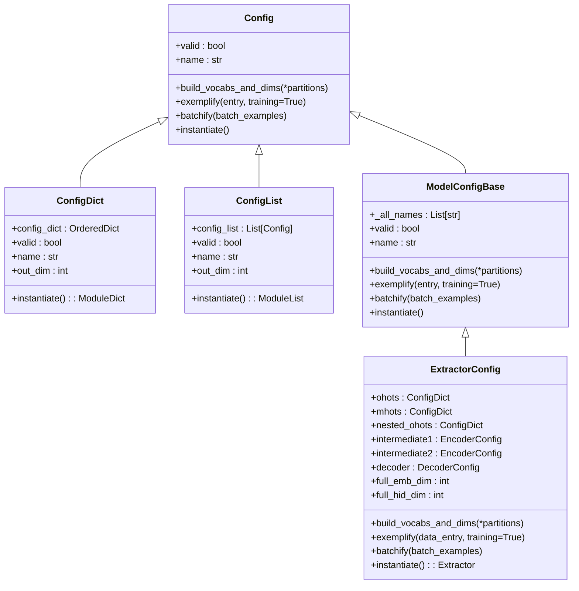
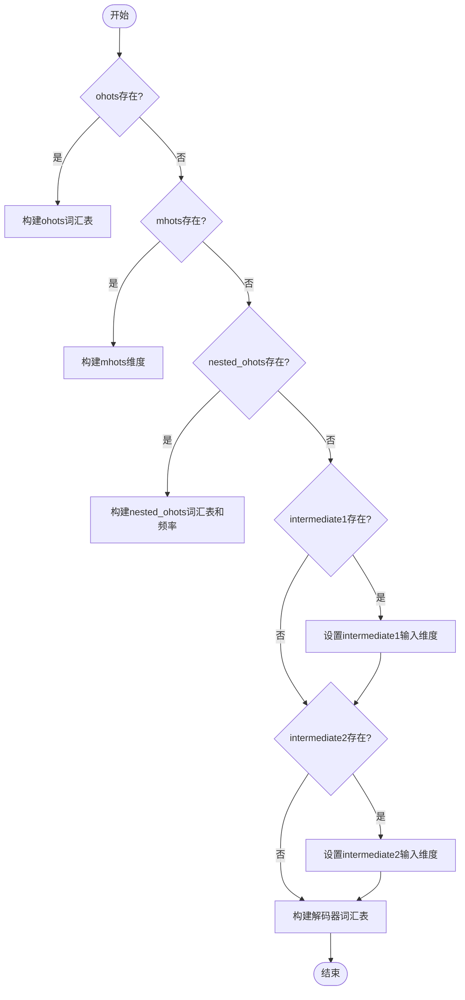
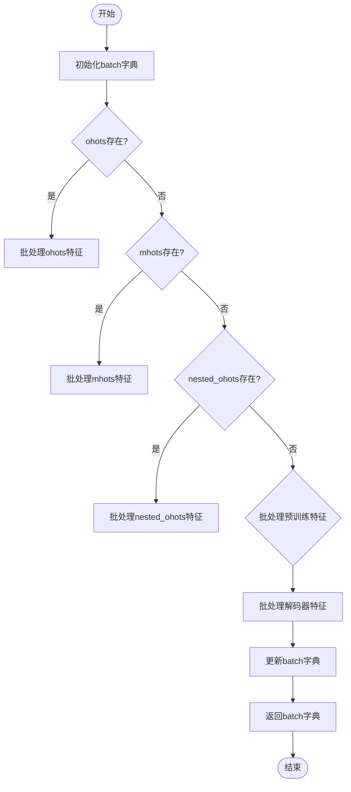
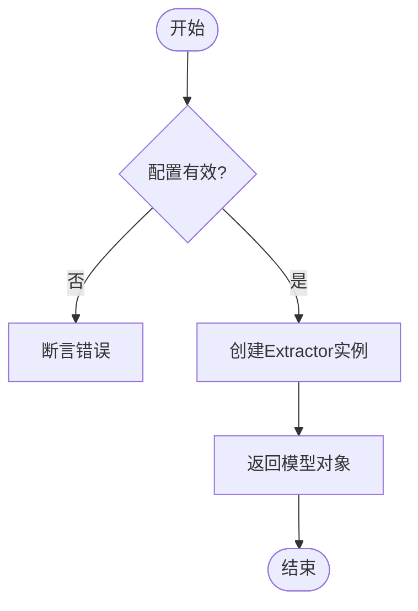
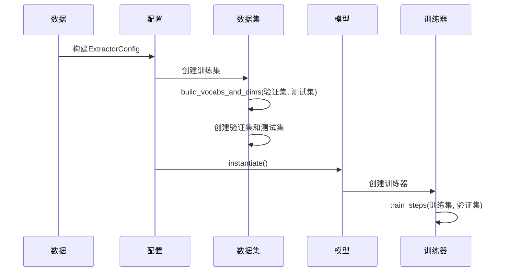
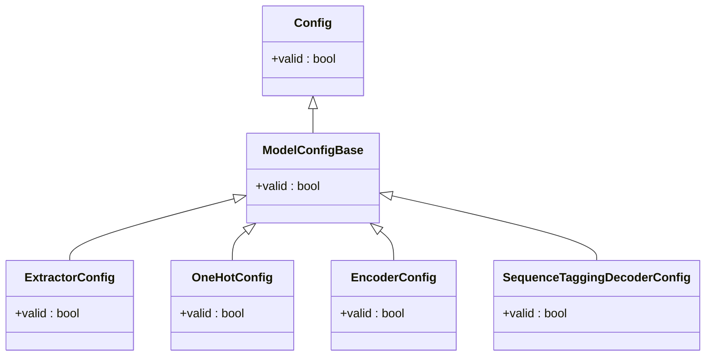

# 配置工作流程

<cite>
**本文档引用的文件**   
- [config.py](file://eznlp/config.py)
- [dataset.py](file://eznlp/dataset.py)
- [extractor.py](file://eznlp/model/model/extractor.py)
- [embedder.py](file://eznlp/model/embedder.py)
- [nested_embedder.py](file://eznlp/model/nested_embedder.py)
- [sequence_tagging.py](file://eznlp/model/decoder/sequence_tagging.py)
- [NER任务完整流程.md](file://docs/NER任务完整流程.md)
</cite>

## 目录
1. [引言](#引言)
2. [配置系统架构](#配置系统架构)
3. [核心方法执行逻辑](#核心方法执行逻辑)
4. [NER任务完整流程](#ner任务完整流程)
5. [配置使用示例](#配置使用示例)
6. [验证机制](#验证机制)
7. [总结](#总结)

## 引言

eznlp框架提供了一套完整的配置系统，用于管理命名实体识别（NER）任务的模型构建和训练流程。该系统通过`Config`类及其子类实现，将模型的配置、数据处理和实例化过程统一管理。本文档将详细阐述从配置定义到模型实例化的端到端工作流程，重点分析`build_vocabs_and_dims`、`exemplify`、`batchify`和`instantiate`四个核心方法的执行逻辑与数据流转。

**Section sources**
- [NER任务完整流程.md](file://docs/NER任务完整流程.md#L1-L367)

## 配置系统架构

eznlp的配置系统基于`Config`基类构建，通过继承和组合的方式实现复杂的模型配置。系统核心组件包括：

- **Config**: 基础配置类，定义了配置的基本属性和方法
- **ConfigDict**: 用于管理字典形式的配置集合
- **ConfigList**: 用于管理列表形式的配置集合
- **ModelConfigBase**: 模型配置基类，继承自Config
- **ExtractorConfig**: NER任务专用的提取器配置类

配置系统采用分层设计，将模型分解为嵌入层、编码器和解码器等组件，每个组件都有对应的配置类。这种设计使得配置系统具有良好的扩展性和灵活性。



**Diagram sources**
- [config.py](file://eznlp/config.py#L20-L173)
- [model/model/base.py](file://eznlp/model/model/base.py#L10-L99)
- [model/model/extractor.py](file://eznlp/model/model/extractor.py#L23-L274)

**Section sources**
- [config.py](file://eznlp/config.py#L20-L173)
- [model/model/base.py](file://eznlp/model/model/base.py#L10-L99)

## 核心方法执行逻辑

### build_vocabs_and_dims 方法

`build_vocabs_and_dims`方法负责构建词汇表并确定各层维度。该方法在训练集、验证集和测试集上统计词汇频率，构建词汇表，并根据配置确定各层的输入输出维度。



**Diagram sources**
- [model/model/extractor.py](file://eznlp/model/model/extractor.py#L122-L148)
- [model/embedder.py](file://eznlp/model/embedder.py#L112-L124)
- [model/nested_embedder.py](file://eznlp/model/nested_embedder.py#L60-L72)

**Section sources**
- [model/model/extractor.py](file://eznlp/model/model/extractor.py#L122-L148)
- [model/embedder.py](file://eznlp/model/embedder.py#L112-L124)

### exemplify 方法

`exemplify`方法将原始数据转换为模型可处理的示例。该方法接收一个数据条目，将其转换为包含各种特征的字典，为后续的批处理做准备。


**Diagram sources**
- [model/model/extractor.py](file://eznlp/model/model/extractor.py#L149-L173)
- [model/embedder.py](file://eznlp/model/embedder.py#L125-L131)
- [model/nested_embedder.py](file://eznlp/model/nested_embedder.py#L73-L79)

**Section sources**
- [model/model/extractor.py](file://eznlp/model/model/extractor.py#L149-L173)
- [model/embedder.py](file://eznlp/model/embedder.py#L125-L131)

### batchify 方法

`batchify`方法将多个示例组织成批处理数据。该方法接收一个示例列表，将其转换为可以一次性输入模型的批处理格式，包括填充和掩码生成。



**Diagram sources**
- [model/model/extractor.py](file://eznlp/model/model/extractor.py#L175-L203)
- [model/embedder.py](file://eznlp/model/embedder.py#L132-L135)
- [model/nested_embedder.py](file://eznlp/model/nested_embedder.py#L81-L93)

**Section sources**
- [model/model/extractor.py](file://eznlp/model/model/extractor.py#L175-L203)
- [model/embedder.py](file://eznlp/model/embedder.py#L132-L135)

### instantiate 方法

`instantiate`方法通过配置创建可训练的PyTorch模型。该方法首先验证配置的有效性，然后实例化对应的模型类。



**Diagram sources**
- [model/model/extractor.py](file://eznlp/model/model/extractor.py#L205-L208)
- [model/model/base.py](file://eznlp/model/model/base.py#L64-L77)

**Section sources**
- [model/model/extractor.py](file://eznlp/model/model/extractor.py#L205-L208)

## NER任务完整流程

结合NER任务完整流程.md中的训练流程，我们可以看到配置系统的端到端工作流程：

1. **数据加载**: 加载训练、验证和测试数据
2. **配置构建**: 根据参数构建ExtractorConfig
3. **数据集创建**: 使用配置创建训练集、验证集和测试集
4. **词汇表构建**: 调用`build_vocabs_and_dims`方法构建词汇表和确定维度
5. **模型实例化**: 调用`instantiate`方法创建模型
6. **训练器配置**: 创建训练器并开始训练



**Diagram sources**
- [NER任务完整流程.md](file://docs/NER任务完整流程.md#L200-L224)
- [dataset.py](file://eznlp/dataset.py#L89-L91)

**Section sources**
- [NER任务完整流程.md](file://docs/NER任务完整流程.md#L200-L224)
- [dataset.py](file://eznlp/dataset.py#L89-L91)

## 配置使用示例

以下是从创建ExtractorConfig到获得最终模型对象的完整代码路径：

```python
# 1. 创建基础配置
config = ExtractorConfig(
    ohots=ConfigDict({
        "text": OneHotConfig(field="text", emb_dim=100)
    }),
    intermediate2=EncoderConfig(arch="LSTM", hid_dim=256),
    decoder=SequenceTaggingDecoderConfig(scheme="BIOES", use_crf=True)
)

# 2. 创建数据集
train_set = Dataset(train_data, config, training=True)
dev_set = Dataset(dev_data, config, training=False)
test_set = Dataset(test_data, config, training=False)

# 3. 构建词汇表和维度
train_set.build_vocabs_and_dims(dev_set.data, test_set.data)

# 4. 实例化模型
model = config.instantiate()

# 5. 移动到指定设备
model = model.to(device)
```

**Section sources**
- [NER任务完整流程.md](file://docs/NER任务完整流程.md#L213-L219)
- [model/model/extractor.py](file://eznlp/model/model/extractor.py#L50-L89)

## 验证机制

`valid`属性在实例化前起着重要的验证作用。它确保所有必需的配置参数都已正确设置，避免在模型训练过程中出现配置错误。



**Diagram sources**
- [config.py](file://eznlp/config.py#L40-L47)
- [model/model/base.py](file://eznlp/model/model/base.py#L21-L33)
- [model/model/extractor.py](file://eznlp/model/model/extractor.py#L93-L97)

**Section sources**
- [config.py](file://eznlp/config.py#L40-L47)
- [model/model/base.py](file://eznlp/model/model/base.py#L21-L33)

## 总结

eznlp的配置系统通过`build_vocabs_and_dims`、`exemplify`、`batchify`和`instantiate`四个核心方法，实现了从配置定义到模型实例化的完整工作流程。系统采用分层设计，将模型分解为多个组件，每个组件都有对应的配置类，使得配置系统具有良好的扩展性和灵活性。`valid`属性在实例化前进行验证，确保配置的正确性。通过结合NER任务完整流程，我们可以看到配置系统如何协同工作，从数据准备到模型训练的完整过程。

**Section sources**
- [NER任务完整流程.md](file://docs/NER任务完整流程.md#L358-L367)
- [config.py](file://eznlp/config.py#L20-L173)