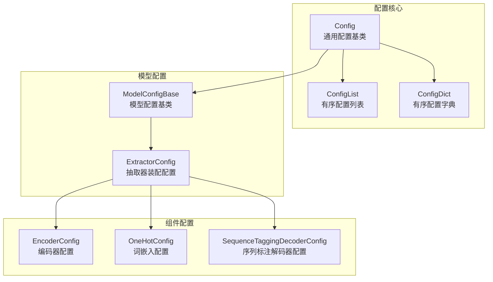
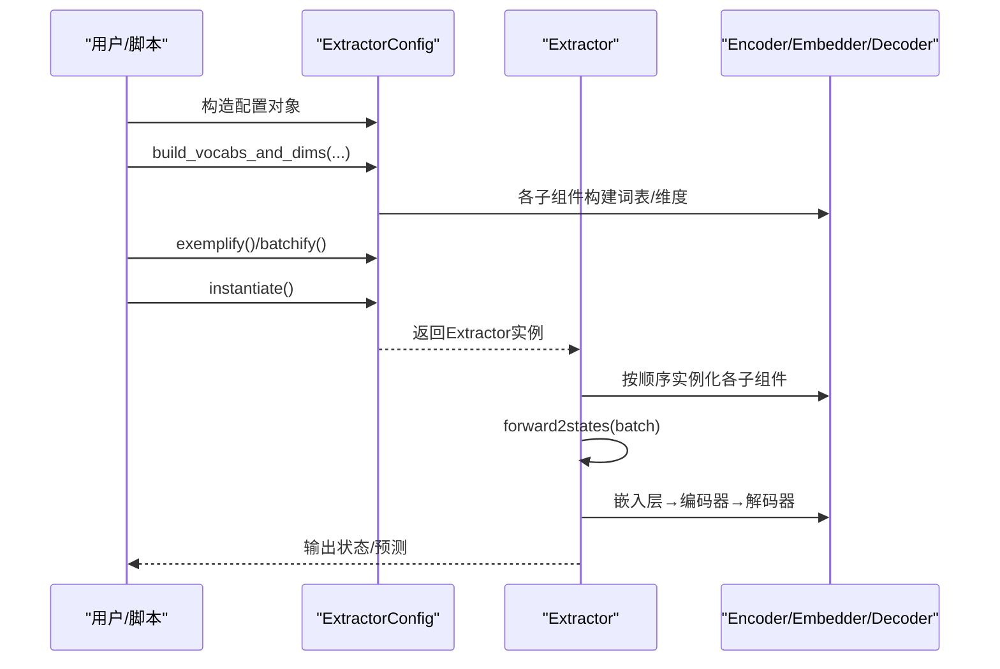
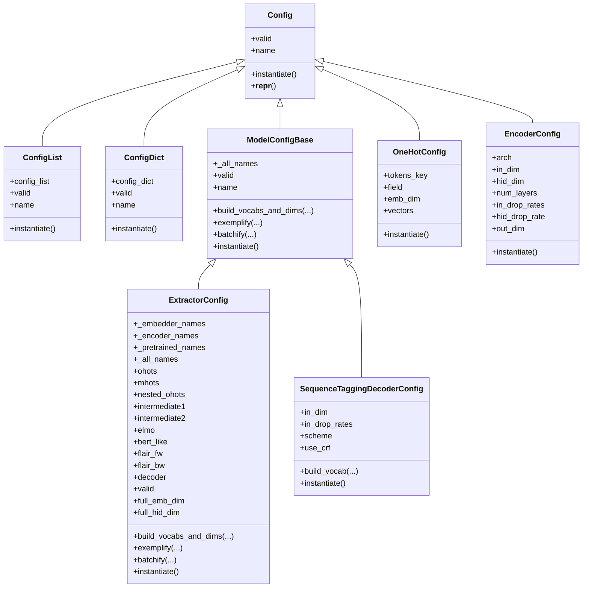
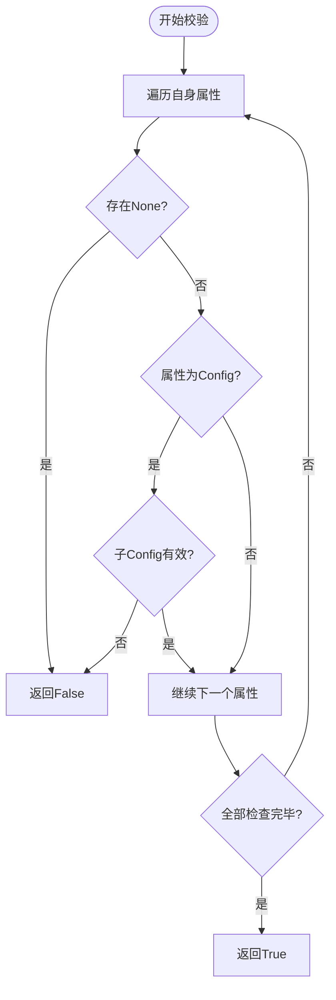
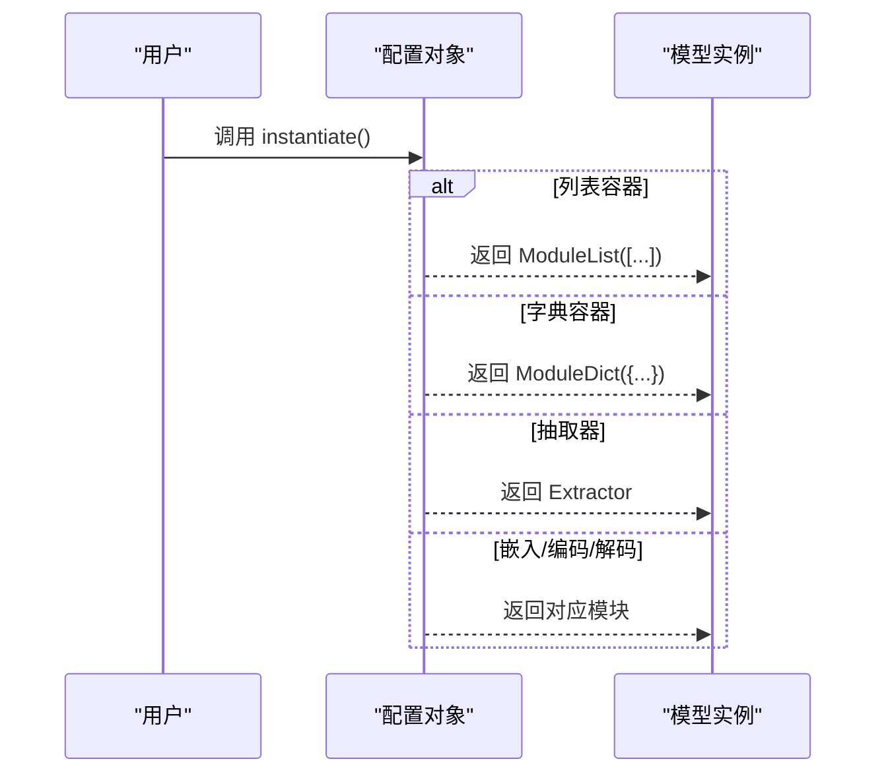
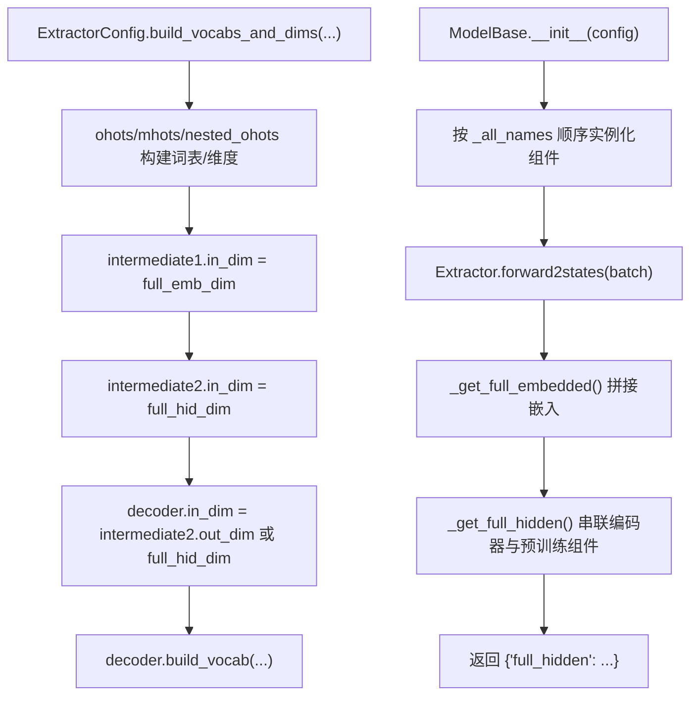
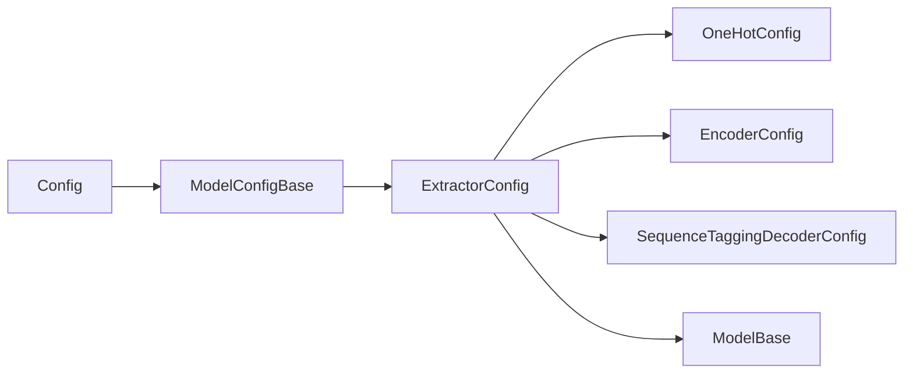

# 配置系统

<cite>
**本文引用的文件**
- [eznlp/config.py](file://eznlp/config.py)
- [eznlp/model/model/base.py](file://eznlp/model/model/base.py)
- [eznlp/model/model/extractor.py](file://eznlp/model/model/extractor.py)
- [eznlp/model/encoder.py](file://eznlp/model/encoder.py)
- [eznlp/model/embedder.py](file://eznlp/model/embedder.py)
- [eznlp/model/decoder/sequence_tagging.py](file://eznlp/model/decoder/sequence_tagging.py)
- [docs/NER任务完整流程.md](file://docs/NER任务完整流程.md)
</cite>

## 目录
1. [引言](#引言)
2. [项目结构](#项目结构)
3. [核心组件](#核心组件)
4. [架构总览](#架构总览)
5. [详细组件分析](#详细组件分析)
6. [依赖分析](#依赖分析)
7. [性能考虑](#性能考虑)
8. [故障排查指南](#故障排查指南)
9. [结论](#结论)
10. [附录](#附录)

## 引言
本节聚焦于eznlp框架中的配置系统，系统性阐述Config、ModelConfigBase与ExtractorConfig三者的类设计与继承关系；解释配置驱动架构如何通过组合嵌入层、编码器、解码器等组件，实现模型的灵活构建；并结合NER任务完整流程文档中的示例，说明如何用配置文件定义完整的模型架构，涵盖OneHotConfig、EncoderConfig与SequenceTaggingDecoderConfig等关键配置类的使用方法。同时，本文将深入解析配置验证机制（valid属性）与实例化流程（instantiate方法），并给出配置对象如何转换为可训练PyTorch模型的实践路径。

## 项目结构
配置系统位于eznlp/config.py中，围绕通用Config基类及其扩展（如ConfigList、ConfigDict）构建；模型配置体系由ModelConfigBase派生，ExtractorConfig作为典型装配器配置，负责组织嵌入层、编码器与解码器等子组件。解码器侧以SequenceTaggingDecoderConfig为代表，展示如何通过配置驱动构建具体的解码器模块。

图表来源
- [eznlp/config.py](file://eznlp/config.py#L20-L173)
- [eznlp/model/model/base.py](file://eznlp/model/model/base.py#L10-L83)
- [eznlp/model/model/extractor.py](file://eznlp/model/model/extractor.py#L23-L209)
- [eznlp/model/encoder.py](file://eznlp/model/encoder.py#L15-L90)
- [eznlp/model/embedder.py](file://eznlp/model/embedder.py#L51-L139)
- [eznlp/model/decoder/sequence_tagging.py](file://eznlp/model/decoder/sequence_tagging.py#L93-L141)

章节来源
- [eznlp/config.py](file://eznlp/config.py#L20-L173)
- [eznlp/model/model/base.py](file://eznlp/model/model/base.py#L10-L83)
- [eznlp/model/model/extractor.py](file://eznlp/model/model/extractor.py#L23-L209)
- [eznlp/model/encoder.py](file://eznlp/model/encoder.py#L15-L90)
- [eznlp/model/embedder.py](file://eznlp/model/embedder.py#L51-L139)
- [eznlp/model/decoder/sequence_tagging.py](file://eznlp/model/decoder/sequence_tagging.py#L93-L141)

## 核心组件
- Config：通用配置基类，提供统一的valid校验、name命名与instantiate实例化接口约定。支持通过构造函数接受未显式声明的键值，但会发出警告提示未检查的配置项。
- ConfigList：有序配置列表容器，支持按索引访问、追加与长度查询；instantiate返回torch.nn.ModuleList，顺序需与对应前向一致。
- ConfigDict：有序配置字典容器，支持按键值访问与迭代；instantiate返回torch.nn.ModuleDict，顺序需与对应前向一致。
- ModelConfigBase：模型配置基类，扩展了build_vocabs_and_dims、exemplify、batchify与instantiate等方法；通过_all_names维护装配顺序，确保组件按序实例化。
- ExtractorConfig：抽取器装配配置，负责组织嵌入层（ohots/mhots/nested_ohots）、中间编码器（intermediate1/intermediate2）、预训练组件（elmo/bert_like/flair_fw/flair_bw）与解码器（decoder），并提供维度推导与批处理封装。
- OneHotConfig：词嵌入配置，支持构建词表、输出维度与批处理；instantiate返回OneHotEmbedder。
- EncoderConfig：编码器配置，支持identity/ffn/lstm/gru/conv/gehring/transformer等架构；instantiate返回对应Encoder实现。
- SequenceTaggingDecoderConfig：序列标注解码器配置，支持BIOES标注方案、CRF或交叉熵损失；instantiate返回SequenceTaggingDecoder。

章节来源
- [eznlp/config.py](file://eznlp/config.py#L20-L173)
- [eznlp/model/model/base.py](file://eznlp/model/model/base.py#L10-L83)
- [eznlp/model/model/extractor.py](file://eznlp/model/model/extractor.py#L23-L209)
- [eznlp/model/embedder.py](file://eznlp/model/embedder.py#L51-L139)
- [eznlp/model/encoder.py](file://eznlp/model/encoder.py#L15-L90)
- [eznlp/model/decoder/sequence_tagging.py](file://eznlp/model/decoder/sequence_tagging.py#L93-L141)

## 架构总览
配置驱动的装配流程遵循“配置构建—维度推导—实例化—前向组装”的闭环：ExtractorConfig在build_vocabs_and_dims阶段完成各子组件的维度推导与词表构建；exemplify/batchify负责样本与批次的特征抽取与打包；instantiate最终生成可训练的Extractor模型，内部通过ModelBase按配置顺序实例化各组件，并在forward2states中串联嵌入、编码与解码。

图表来源
- [eznlp/model/model/extractor.py](file://eznlp/model/model/extractor.py#L122-L209)
- [eznlp/model/model/base.py](file://eznlp/model/model/base.py#L64-L83)
- [eznlp/model/encoder.py](file://eznlp/model/encoder.py#L76-L90)
- [eznlp/model/embedder.py](file://eznlp/model/embedder.py#L137-L139)
- [eznlp/model/decoder/sequence_tagging.py](file://eznlp/model/decoder/sequence_tagging.py#L139-L141)

## 详细组件分析

### 类关系与继承图

图表来源
- [eznlp/config.py](file://eznlp/config.py#L20-L173)
- [eznlp/model/model/base.py](file://eznlp/model/model/base.py#L10-L83)
- [eznlp/model/model/extractor.py](file://eznlp/model/model/extractor.py#L23-L209)
- [eznlp/model/embedder.py](file://eznlp/model/embedder.py#L51-L139)
- [eznlp/model/encoder.py](file://eznlp/model/encoder.py#L15-L90)
- [eznlp/model/decoder/sequence_tagging.py](file://eznlp/model/decoder/sequence_tagging.py#L93-L141)

章节来源
- [eznlp/config.py](file://eznlp/config.py#L20-L173)
- [eznlp/model/model/base.py](file://eznlp/model/model/base.py#L10-L83)
- [eznlp/model/model/extractor.py](file://eznlp/model/model/extractor.py#L23-L209)
- [eznlp/model/embedder.py](file://eznlp/model/embedder.py#L51-L139)
- [eznlp/model/encoder.py](file://eznlp/model/encoder.py#L15-L90)
- [eznlp/model/decoder/sequence_tagging.py](file://eznlp/model/decoder/sequence_tagging.py#L93-L141)

### 配置验证机制（valid属性）
- Config.valid：遍历自身所有属性，若存在None或子Config无效则整体无效。
- ModelConfigBase.valid：基于_modelConfigBase._all_names枚举各组件，对字典类型的组件（如ohots/mhots/nested_ohots）递归校验子项有效性。
- ExtractorConfig.valid：在父类基础上增加约束，要求bert_like.from_tokenized为真时才有效（避免非分词输入导致的不一致）。
- ConfigList.valid：要求非空且所有元素均有效。
- ConfigDict.valid：要求非空且所有值均有效。

图表来源
- [eznlp/config.py](file://eznlp/config.py#L40-L47)
- [eznlp/model/model/base.py](file://eznlp/model/model/base.py#L21-L33)
- [eznlp/model/model/extractor.py](file://eznlp/model/model/extractor.py#L92-L96)
- [eznlp/config.py](file://eznlp/config.py#L84-L87)
- [eznlp/config.py](file://eznlp/config.py#L132-L137)

章节来源
- [eznlp/config.py](file://eznlp/config.py#L40-L47)
- [eznlp/model/model/base.py](file://eznlp/model/model/base.py#L21-L33)
- [eznlp/model/model/extractor.py](file://eznlp/model/model/extractor.py#L92-L96)
- [eznlp/config.py](file://eznlp/config.py#L84-L87)
- [eznlp/config.py](file://eznlp/config.py#L132-L137)

### 实例化流程（instantiate方法）
- Config.instantiate：约定子类必须实现，否则抛出未实现错误。
- ConfigList.instantiate：按顺序创建ModuleList，要求与前向顺序保持一致。
- ConfigDict.instantiate：按顺序创建ModuleDict，要求与前向顺序保持一致。
- ModelConfigBase.instantiate：约定子类必须实现。
- ExtractorConfig.instantiate：先断言整体有效，再返回Extractor实例。
- OneHotConfig.instantiate：返回OneHotEmbedder。
- EncoderConfig.instantiate：根据arch返回对应Encoder实现（identity/ffn/lstm/gru/conv/gehring/transformer）。
- SequenceTaggingDecoderConfig.instantiate：返回SequenceTaggingDecoder。

图表来源
- [eznlp/config.py](file://eznlp/config.py#L70-L72)
- [eznlp/config.py](file://eznlp/config.py#L113-L116)
- [eznlp/config.py](file://eznlp/config.py#L165-L169)
- [eznlp/model/model/extractor.py](file://eznlp/model/model/extractor.py#L205-L209)
- [eznlp/model/embedder.py](file://eznlp/model/embedder.py#L137-L139)
- [eznlp/model/encoder.py](file://eznlp/model/encoder.py#L76-L90)
- [eznlp/model/decoder/sequence_tagging.py](file://eznlp/model/decoder/sequence_tagging.py#L139-L141)

章节来源
- [eznlp/config.py](file://eznlp/config.py#L70-L72)
- [eznlp/config.py](file://eznlp/config.py#L113-L116)
- [eznlp/config.py](file://eznlp/config.py#L165-L169)
- [eznlp/model/model/extractor.py](file://eznlp/model/model/extractor.py#L205-L209)
- [eznlp/model/embedder.py](file://eznlp/model/embedder.py#L137-L139)
- [eznlp/model/encoder.py](file://eznlp/model/encoder.py#L76-L90)
- [eznlp/model/decoder/sequence_tagging.py](file://eznlp/model/decoder/sequence_tagging.py#L139-L141)

### 组件装配与前向流程（Extractor）
ExtractorConfig通过_build_vocabs_and_dims完成维度推导与词表构建，随后在ModelBase中按顺序实例化各组件；Extractor在forward2states中串联嵌入层、预训练组件与编码器，最终将全量隐藏状态传递给解码器。

图表来源
- [eznlp/model/model/extractor.py](file://eznlp/model/model/extractor.py#L122-L148)
- [eznlp/model/model/base.py](file://eznlp/model/model/base.py#L64-L83)
- [eznlp/model/model/extractor.py](file://eznlp/model/model/extractor.py#L211-L274)

章节来源
- [eznlp/model/model/extractor.py](file://eznlp/model/model/extractor.py#L122-L148)
- [eznlp/model/model/base.py](file://eznlp/model/model/base.py#L64-L83)
- [eznlp/model/model/extractor.py](file://eznlp/model/model/extractor.py#L211-L274)

### NER任务完整流程中的配置使用
NER任务完整流程文档展示了如何通过ExtractorConfig定义端到端模型架构，包括嵌入层（OneHotConfig）、编码器（EncoderConfig）与解码器（SequenceTaggingDecoderConfig）。文档还演示了训练脚本中如何调用config.instantiate().to(device)将配置对象转换为可训练的PyTorch模型，并通过Dataset与Trainer完成训练与评估。

章节来源
- [docs/NER任务完整流程.md](file://docs/NER任务完整流程.md#L81-L106)
- [docs/NER任务完整流程.md](file://docs/NER任务完整流程.md#L173-L184)
- [docs/NER任务完整流程.md](file://docs/NER任务完整流程.md#L198-L252)

## 依赖分析
- 组件耦合与内聚
  - ConfigList/ConfigDict通过顺序容器保证装配顺序一致性，降低跨组件耦合风险。
  - ModelConfigBase与ModelBase通过统一的_all_names与instantiate契约，提升内聚性与可扩展性。
  - ExtractorConfig将嵌入层、编码器与解码器以组合方式装配，便于替换与扩展。
- 外部依赖
  - PyTorch模块（torch.nn.ModuleList/ModuleDict）用于容器化子组件。
  - 词表与维度推导依赖Vocab与Counter等工具（在具体配置类中体现）。
- 循环依赖
  - 配置系统采用单向依赖（Config→ModelConfigBase→ExtractorConfig→各组件配置），未见循环依赖迹象。

图表来源
- [eznlp/config.py](file://eznlp/config.py#L20-L173)
- [eznlp/model/model/base.py](file://eznlp/model/model/base.py#L10-L83)
- [eznlp/model/model/extractor.py](file://eznlp/model/model/extractor.py#L23-L209)
- [eznlp/model/embedder.py](file://eznlp/model/embedder.py#L51-L139)
- [eznlp/model/encoder.py](file://eznlp/model/encoder.py#L15-L90)
- [eznlp/model/decoder/sequence_tagging.py](file://eznlp/model/decoder/sequence_tagging.py#L93-L141)

章节来源
- [eznlp/config.py](file://eznlp/config.py#L20-L173)
- [eznlp/model/model/base.py](file://eznlp/model/model/base.py#L10-L83)
- [eznlp/model/model/extractor.py](file://eznlp/model/model/extractor.py#L23-L209)
- [eznlp/model/embedder.py](file://eznlp/model/embedder.py#L51-L139)
- [eznlp/model/encoder.py](file://eznlp/model/encoder.py#L15-L90)
- [eznlp/model/decoder/sequence_tagging.py](file://eznlp/model/decoder/sequence_tagging.py#L93-L141)

## 性能考虑
- 维度推导与词表构建
  - 在build_vocabs_and_dims阶段集中完成，避免重复计算；注意对嵌套配置（nested_ohots）的频率统计与词表构建。
- 前向拼接与掩码
  - 嵌入层拼接与编码器拼接应保持维度一致与掩码对齐，减少不必要的张量变换。
- Dropout与Shortcut
  - EncoderConfig支持in_drop_rates与shortcut选项，合理设置可平衡正则化与残差连接带来的性能影响。
- 预训练组件冻结
  - 对bert_like/flair等预训练组件可通过freeze控制是否参与梯度更新，以节省显存与加速收敛。

## 故障排查指南
- 配置无效（valid为False）
  - 检查是否存在None值或子配置无效；对于ExtractorConfig，确认bert_like.from_tokenized满足条件。
- 实例化失败
  - 确认各配置类已实现instantiate；对于容器类，确保顺序与前向一致。
- 维度不匹配
  - 核对ExtractorConfig.full_emb_dim/full_hid_dim与各组件in_dim/out_dim的推导逻辑；必要时手动设置in_dim。
- 训练报错
  - 在训练脚本中通过config.instantiate().to(device)确保模型设备正确；检查Batch对象的字段与掩码mask是否一致。

章节来源
- [eznlp/config.py](file://eznlp/config.py#L40-L47)
- [eznlp/model/model/extractor.py](file://eznlp/model/model/extractor.py#L92-L96)
- [eznlp/model/model/extractor.py](file://eznlp/model/model/extractor.py#L122-L148)
- [docs/NER任务完整流程.md](file://docs/NER任务完整流程.md#L226-L252)

## 结论
eznlp的配置系统以Config为核心，通过ConfigList/ConfigDict实现容器化装配，借助ModelConfigBase与ExtractorConfig形成清晰的模型装配契约。该体系以配置驱动的方式组合嵌入层、编码器与解码器，既保证了灵活性，又确保了可复用性与可扩展性。配合valid校验与instantiate实例化流程，开发者可以高效地定义与构建端到端模型，并在NER等任务中获得稳定可靠的训练体验。

## 附录
- 实战建议
  - 在构建ExtractorConfig时，优先明确ohots/mhots/nested_ohots的字段与维度，再设置intermediate1/intermediate2与decoder。
  - 使用ConfigDict组织多源嵌入，确保键名唯一且与前向拼接顺序一致。
  - 对于SequenceTaggingDecoderConfig，建议启用CRF以提升边界连续性；同时设置合理的scheme与标签词表。
  - 在训练脚本中，先调用build_vocabs_and_dims完成词表与维度构建，再通过config.instantiate().to(device)得到可训练模型。