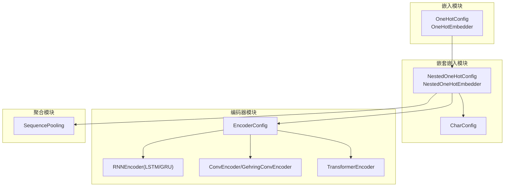
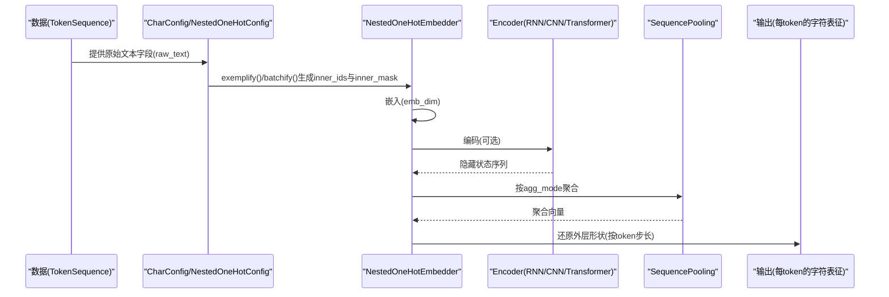
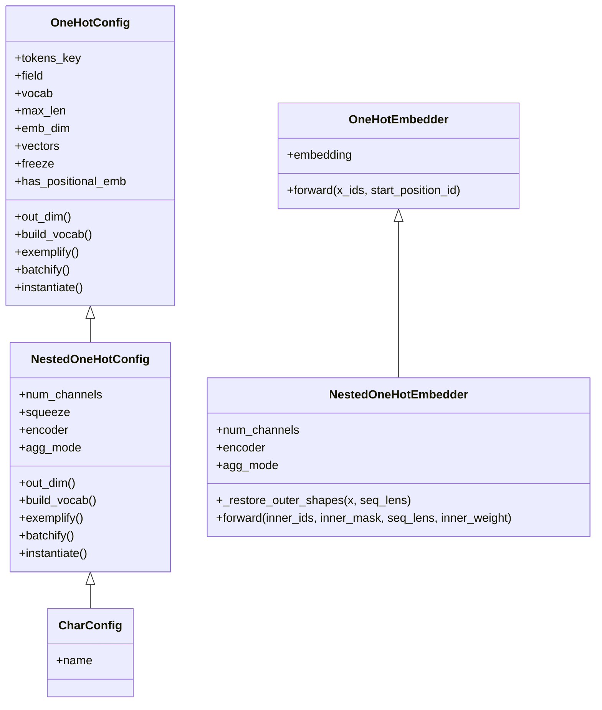
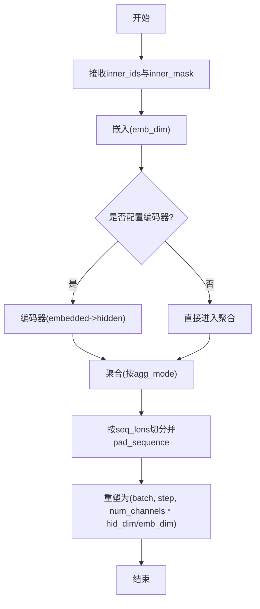
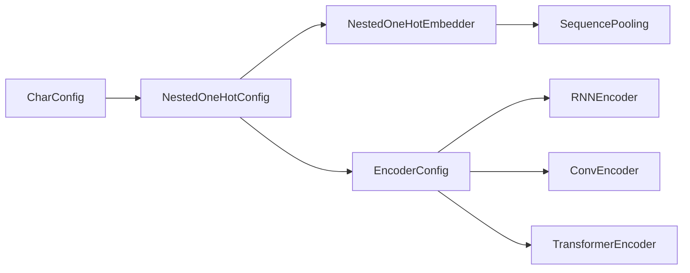

# 字符嵌入

<cite>
**本文引用的文件**
- [eznlp/model/nested_embedder.py](file://eznlp/model/nested_embedder.py)
- [eznlp/model/embedder.py](file://eznlp/model/embedder.py)
- [eznlp/model/encoder.py](file://eznlp/model/encoder.py)
- [eznlp/nn/modules/aggregation.py](file://eznlp/nn/modules/aggregation.py)
- [eznlp/model/__init__.py](file://eznlp/model/__init__.py)
- [tests/model/test_nested_embedder.py](file://tests/model/test_nested_embedder.py)
- [_4MODELS/flat.py](file://_4MODELS/flat.py)
</cite>

## 目录
1. [引言](#引言)
2. [项目结构](#项目结构)
3. [核心组件](#核心组件)
4. [架构总览](#架构总览)
5. [详细组件分析](#详细组件分析)
6. [依赖分析](#依赖分析)
7. [性能考虑](#性能考虑)
8. [故障排查指南](#故障排查指南)
9. [结论](#结论)
10. [附录](#附录)

## 引言
本篇文档聚焦于eznlp中的字符嵌入实现，系统性解析CharConfig与NestedOneHotEmbedder两大关键组件，阐明字符级嵌入的配置流程、字符词汇表构建、嵌入维度设置、以及使用LSTM/GRU/CNN等编码器对字符序列进行编码的机制；同时深入解释agg_mode参数（如rnn_last、max_pooling）在聚合字符级表示中的作用，并通过测试用例与示例展示如何将字符嵌入集成到主模型配置中。最后给出字符嵌入在中文NER等任务中增强未登录词识别能力的原理与最佳实践建议。

## 项目结构
eznlp将“嵌入”与“嵌入器配置”拆分为独立模块：
- 嵌入器基类与通用嵌入器：位于嵌入模块，提供一阶嵌入（如词/字的one-hot嵌入）与可选的位置编码。
- 嵌套嵌入器配置与实现：位于嵌套嵌入模块，专门处理“每个token内部存在一个或多个子序列”的结构（如每个token由字符序列构成），支持对子序列进行编码与聚合。
- 编码器配置与实现：位于编码器模块，统一管理RNN/LSTM/GRU、CNN/Gehring、Transformer等编码器的超参与实例化。
- 聚合模块：位于神经网络模块，提供多种序列池化/分组聚合策略，支撑不同agg_mode的行为。

图表来源
- [eznlp/model/embedder.py](file://eznlp/model/embedder.py#L51-L195)
- [eznlp/model/nested_embedder.py](file://eznlp/model/nested_embedder.py#L15-L150)
- [eznlp/model/encoder.py](file://eznlp/model/encoder.py#L15-L121)
- [eznlp/nn/modules/aggregation.py](file://eznlp/nn/modules/aggregation.py#L13-L43)

章节来源
- [eznlp/model/embedder.py](file://eznlp/model/embedder.py#L51-L195)
- [eznlp/model/nested_embedder.py](file://eznlp/model/nested_embedder.py#L15-L150)
- [eznlp/model/encoder.py](file://eznlp/model/encoder.py#L15-L121)
- [eznlp/nn/modules/aggregation.py](file://eznlp/nn/modules/aggregation.py#L13-L43)

## 核心组件
- CharConfig：面向字符级嵌入的配置对象，负责：
  - 指定字段为原始文本（默认raw_text），单通道（squeeze=True），嵌入维度（emb_dim，默认16），编码器（默认LSTM，hid_dim=128，num_layers=1，in_drop_rates=(0.5,0,0)）。
  - 自动根据编码器类型设置agg_mode：RNN系列使用“rnn_last”，卷积系列使用“max_pooling”。
  - 输出维度为编码器输出维度乘以num_channels。
- NestedOneHotConfig/NestedOneHotEmbedder：通用嵌套嵌入器配置与实现，支持：
  - 多通道（num_channels）与squeeze模式（单通道时强制squeeze）。
  - 构建字符级词汇表（基于tokens.field内的子序列）。
  - 将子序列按inner_step拼接后进行嵌入，再经编码器编码，最后按agg_mode进行聚合。
- EncoderConfig/RNNEncoder/ConvEncoder/TransformerEncoder：统一的编码器配置与实现，支持多架构选择与参数初始化。
- SequencePooling：提供mean/max/min/wtd_mean/rnn_last等聚合模式。

章节来源
- [eznlp/model/nested_embedder.py](file://eznlp/model/nested_embedder.py#L15-L150)
- [eznlp/model/nested_embedder.py](file://eznlp/model/nested_embedder.py#L214-L238)
- [eznlp/model/encoder.py](file://eznlp/model/encoder.py#L15-L121)
- [eznlp/nn/modules/aggregation.py](file://eznlp/nn/modules/aggregation.py#L13-L43)

## 架构总览
字符嵌入从数据到最终表征的关键路径如下：
- 数据准备：TokenSequence包含原始文本字段（默认raw_text），每个token对应一个字符序列。
- 字符级嵌入：NestedOneHotEmbedder对每个inner_step字符进行索引映射，得到(emb_dim)维嵌入。
- 编码阶段：若配置了编码器，则对嵌入序列进行编码（RNN/CNN/Transformer），得到隐藏状态序列。
- 聚合阶段：依据agg_mode对编码后的序列进行池化或选择最后一个步的隐藏状态。
- 还原外层形状：将聚合结果还原为token级别的形状，便于后续解码器使用。

图表来源
- [eznlp/model/nested_embedder.py](file://eznlp/model/nested_embedder.py#L73-L95)
- [eznlp/model/nested_embedder.py](file://eznlp/model/nested_embedder.py#L124-L149)
- [eznlp/model/encoder.py](file://eznlp/model/encoder.py#L91-L121)
- [eznlp/nn/modules/aggregation.py](file://eznlp/nn/modules/aggregation.py#L13-L43)

## 详细组件分析

### CharConfig与NestedOneHotEmbedder类图

图表来源
- [eznlp/model/embedder.py](file://eznlp/model/embedder.py#L51-L195)
- [eznlp/model/nested_embedder.py](file://eznlp/model/nested_embedder.py#L15-L150)
- [eznlp/model/nested_embedder.py](file://eznlp/model/nested_embedder.py#L214-L238)

章节来源
- [eznlp/model/embedder.py](file://eznlp/model/embedder.py#L51-L195)
- [eznlp/model/nested_embedder.py](file://eznlp/model/nested_embedder.py#L15-L150)
- [eznlp/model/nested_embedder.py](file://eznlp/model/nested_embedder.py#L214-L238)

### 字符级嵌入配置流程
- 字段与通道
  - 默认字段为原始文本（raw_text），单通道（squeeze=True），num_channels=1。
- 词汇表构建
  - 通过遍历tokens.field内的每个字符序列，统计字符频次并构建Vocab，支持最小频率过滤与特殊符号（<unk>/<pad>/<sos>/<eos>）。
- 嵌入维度
  - emb_dim默认16，编码器输入维度会自动设为emb_dim。
- 编码器与聚合模式
  - 若编码器为RNN系列（LSTM/GRU），默认agg_mode为“rnn_last”；若为卷积系列（Conv/Gehring），默认agg_mode为“max_pooling”。

章节来源
- [eznlp/model/nested_embedder.py](file://eznlp/model/nested_embedder.py#L60-L95)
- [eznlp/model/nested_embedder.py](file://eznlp/model/nested_embedder.py#L214-L238)

### 编码器与聚合机制
- 编码器
  - EncoderConfig统一管理arch、hid_dim、num_layers、in_drop_rates、hid_drop_rate等超参，并根据arch选择具体实现。
  - RNNEncoder支持双向LSTM/GRU，可训练初始隐状态；ConvEncoder/GehringConvEncoder支持卷积堆叠；TransformerEncoder支持多头注意力堆叠。
- 聚合
  - SequencePooling支持mean/max/min/wtd_mean/rnn_last五种模式；rnn_last通过rnn_last_selecting函数选取最后一个有效步的隐藏状态；其他模式通过sequence_pooling实现。

章节来源
- [eznlp/model/encoder.py](file://eznlp/model/encoder.py#L15-L121)
- [eznlp/nn/modules/aggregation.py](file://eznlp/nn/modules/aggregation.py#L13-L43)

### Forward流程与形状恢复
- 输入
  - inner_ids：(batch*step*num_channels, inner_step)，即所有子序列展平后的字符索引。
  - inner_mask：(batch*step*num_channels, inner_step)，用于屏蔽padding。
  - seq_lens：(batch,)，记录每个样本的token数（含num_channels倍增）。
- 步骤
  - 嵌入：(batch*step*num_channels, inner_step, emb_dim)
  - 编码（可选）：(batch*step*num_channels, inner_step, hid_dim)
  - 聚合：按agg_mode对inner_step维进行池化或rnn_last选择，得到(batch*step*num_channels, hid_dim/emb_dim)
  - 还原外层形状：按seq_lens切分并pad_sequence，最终得到(batch, step, num_channels * hid_dim/emb_dim)
- 关键断言：(seq_lens * num_channels).sum()必须等于inner_ids.size(0)，确保展平与还原一致。

图表来源
- [eznlp/model/nested_embedder.py](file://eznlp/model/nested_embedder.py#L124-L149)

章节来源
- [eznlp/model/nested_embedder.py](file://eznlp/model/nested_embedder.py#L98-L149)

### 示例：将字符嵌入集成到主模型配置
- 在测试用例中，通过CharConfig定义字符嵌入配置，指定编码器架构（如Conv/LSTM/GRU），随后构建词汇表、批处理并实例化嵌入器，验证批次一致性。
- 在主模型示例中，字符嵌入可作为输入特征之一，与词法/词汇嵌入进行投影与融合，再送入上层编码器（如Transformer）进行下游任务。

章节来源
- [tests/model/test_nested_embedder.py](file://tests/model/test_nested_embedder.py#L1-L70)
- [_4MODELS/flat.py](file://_4MODELS/flat.py#L36-L133)

## 依赖分析
- 组件耦合
  - NestedOneHotEmbedder继承自OneHotEmbedder，复用嵌入层与可选位置编码逻辑。
  - CharConfig继承自NestedOneHotConfig，自动根据编码器类型设置agg_mode，体现高层封装与低层实现的清晰边界。
  - EncoderConfig与具体编码器实现（RNNEncoder/ConvEncoder/TransformerEncoder）通过instantiate工厂方法解耦。
- 外部依赖
  - 聚合模块依赖底层功能函数（如rnn_last_selecting、sequence_pooling），编码器模块依赖初始化工具（如reinit_lstm_/reinit_gru_）。

图表来源
- [eznlp/model/nested_embedder.py](file://eznlp/model/nested_embedder.py#L15-L150)
- [eznlp/model/encoder.py](file://eznlp/model/encoder.py#L15-L121)
- [eznlp/nn/modules/aggregation.py](file://eznlp/nn/modules/aggregation.py#L13-L43)

章节来源
- [eznlp/model/nested_embedder.py](file://eznlp/model/nested_embedder.py#L15-L150)
- [eznlp/model/encoder.py](file://eznlp/model/encoder.py#L15-L121)
- [eznlp/nn/modules/aggregation.py](file://eznlp/nn/modules/aggregation.py#L13-L43)

## 性能考虑
- 嵌入维度与词汇规模
  - 字符级词汇表通常较大，emb_dim不宜过大以免显存压力；可通过min_freq控制稀有字符剔除。
- 编码器选择
  - RNN系列适合长程依赖但训练较慢；CNN/Gehring适合局部特征与并行化；Transformer适合全局上下文但计算开销更大。
- 聚合模式
  - rnn_last仅保留最后一个步信息，计算量小；max_pooling等池化操作在inner_step较长时可能带来额外开销。
- 批处理与掩码
  - 使用pack_padded_sequence/pad_packed_sequence减少无效计算；inner_mask确保池化/聚合正确忽略padding。

## 故障排查指南
- 常见问题
  - 形状不匹配：确保inner_ids长度与(seq_lens * num_channels).sum()一致，否则forward断言会失败。
  - 词汇表未构建：调用build_vocab后再instantiate，避免Vocab为空导致索引越界。
  - 编码器无效：检查EncoderConfig的arch与参数组合，确保out_dim与上游维度匹配。
- 定位手段
  - 在测试用例中观察exemplify/batchify生成的inner_ids与inner_mask，确认展平与还原逻辑。
  - 对比不同agg_mode下的输出形状，验证rnn_last与max_pooling等行为差异。

章节来源
- [tests/model/test_nested_embedder.py](file://tests/model/test_nested_embedder.py#L1-L70)
- [eznlp/model/nested_embedder.py](file://eznlp/model/nested_embedder.py#L124-L149)

## 结论
eznlp的字符嵌入体系以CharConfig与NestedOneHotEmbedder为核心，结合EncoderConfig与SequencePooling，实现了从字符级one-hot嵌入到token级语义表征的完整流水线。通过合理的agg_mode选择与编码器配置，可在中文NER等任务中显著提升对未登录词的识别能力；同时，该体系具备良好的扩展性与可维护性，便于在不同下游任务中灵活集成。

## 附录
- 导出入口
  - 模块导出包含CharConfig、NestedOneHotConfig、SoftLexiconConfig、ExpertDictConfig等，便于在上层装配配置时统一导入。

章节来源
- [eznlp/model/__init__.py](file://eznlp/model/__init__.py#L1-L31)