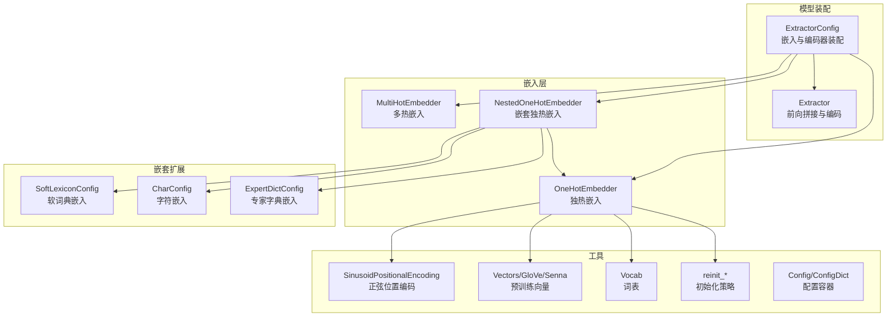
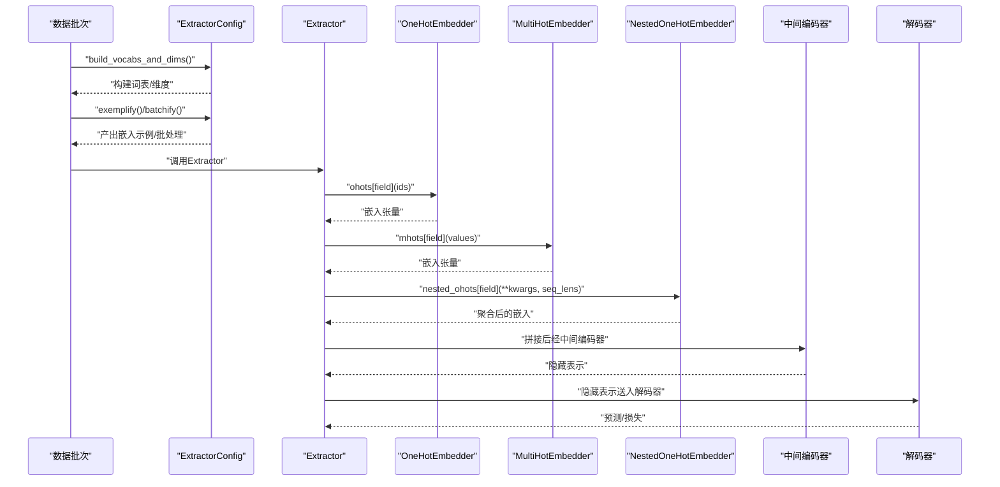
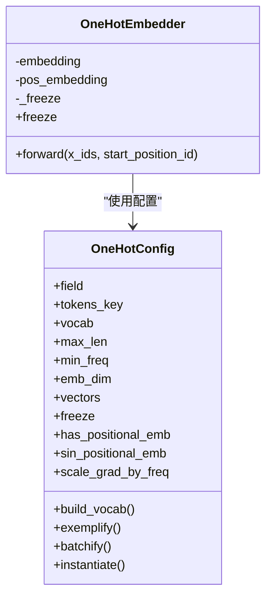
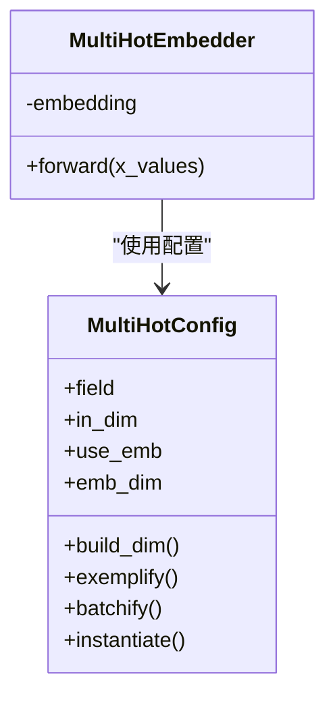
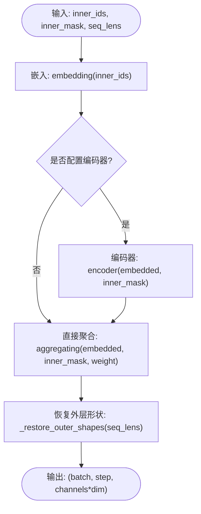
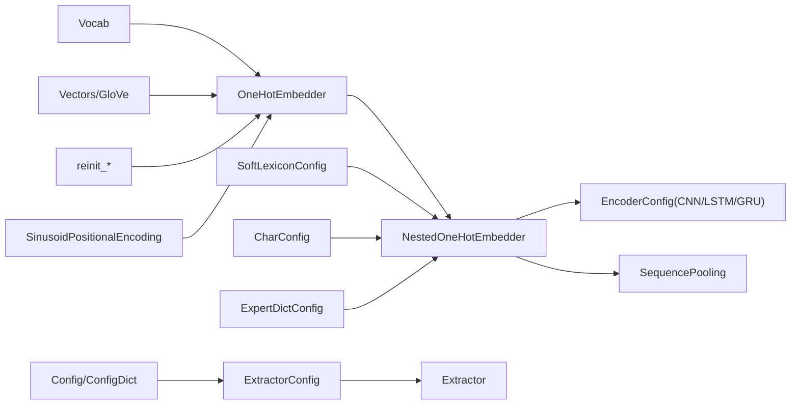

# 嵌入层

<cite>
**本文引用的文件列表**
- [embedder.py](file://eznlp/model/embedder.py)
- [nested_embedder.py](file://eznlp/model/nested_embedder.py)
- [embedding.py](file://eznlp/nn/modules/embedding.py)
- [vectors.py](file://eznlp/vectors.py)
- [vocab.py](file://eznlp/vocab.py)
- [init.py](file://eznlp/nn/init.py)
- [config.py](file://eznlp/config.py)
- [extractor.py](file://eznlp/model/model/extractor.py)
- [classifier.py](file://eznlp/model/model/classifier.py)
- [test_nested_embedder.py](file://tests/model/test_nested_embedder.py)
</cite>

## 目录
1. [简介](#简介)
2. [项目结构](#项目结构)
3. [核心组件](#核心组件)
4. [架构总览](#架构总览)
5. [组件详解](#组件详解)
6. [依赖关系分析](#依赖关系分析)
7. [性能与优化](#性能与优化)
8. [故障排查指南](#故障排查指南)
9. [结论](#结论)
10. [附录：配置与使用示例路径](#附录配置与使用示例路径)

## 简介
本章节系统化文档化eznlp的嵌入层实现，重点覆盖以下核心组件：
- OneHotEmbedder：基于词表的独热嵌入，支持可选的预训练向量初始化与位置编码。
- MultiHotEmbedder：将多热特征映射到低维稠密向量空间，作为额外特征嵌入。
- NestedOneHotEmbedder：用于嵌套序列（如字符级或软词典）的嵌入与聚合，可选编码器（CNN/LSTM/GRU）与池化/加权平均等聚合策略，并支持软词典权重。

同时，本文解释如何通过ExtractorConfig中的ohots、mhots与nested_ohots字段组合不同类型的嵌入；如何配置预训练向量（如GloVe）与位置编码；以及嵌入层在数据流中与编码器的交互方式。

## 项目结构
与嵌入层直接相关的模块分布如下：
- 模型嵌入层与嵌套嵌入层：eznlp/model/embedder.py、eznlp/model/nested_embedder.py
- 位置编码实现：eznlp/nn/modules/embedding.py
- 预训练向量加载与查找：eznlp/vectors.py
- 词表构建：eznlp/vocab.py
- 初始化策略：eznlp/nn/init.py
- 配置基类与容器：eznlp/config.py
- 使用ExtractorConfig组织嵌入与编码器：eznlp/model/model/extractor.py、eznlp/model/model/classifier.py
- 单元测试验证嵌套嵌入行为：tests/model/test_nested_embedder.py

图表来源
- [embedder.py](file://eznlp/model/embedder.py#L141-L195)
- [nested_embedder.py](file://eznlp/model/nested_embedder.py#L1-L150)
- [embedding.py](file://eznlp/nn/modules/embedding.py#L1-L34)
- [vectors.py](file://eznlp/vectors.py#L71-L179)
- [vocab.py](file://eznlp/vocab.py#L1-L66)
- [init.py](file://eznlp/nn/init.py#L1-L76)
- [config.py](file://eznlp/config.py#L121-L173)
- [extractor.py](file://eznlp/model/model/extractor.py#L22-L207)

章节来源
- [embedder.py](file://eznlp/model/embedder.py#L1-L248)
- [nested_embedder.py](file://eznlp/model/nested_embedder.py#L1-L309)
- [embedding.py](file://eznlp/nn/modules/embedding.py#L1-L34)
- [vectors.py](file://eznlp/vectors.py#L1-L180)
- [vocab.py](file://eznlp/vocab.py#L1-L66)
- [init.py](file://eznlp/nn/init.py#L1-L76)
- [config.py](file://eznlp/config.py#L1-L173)
- [extractor.py](file://eznlp/model/model/extractor.py#L22-L207)
- [classifier.py](file://eznlp/model/model/classifier.py#L80-L223)

## 核心组件
- OneHotConfig/OneHotEmbedder：为指定字段（如“text”）构建词表，支持从预训练向量初始化嵌入权重，可选冻结；支持可选位置编码（正弦或离散）。
- MultiHotConfig/MultiHotEmbedder：将每个样本的多热特征映射到emb_dim维度，若use_emb为False则直接输出原始特征。
- NestedOneHotConfig/NestedOneHotEmbedder：处理嵌套序列（step × channel × inner_step），共享同一词表与嵌入层；可选编码器（CNN/LSTM/GRU）与聚合模式（均值/最大/加权平均/最后一步等），并支持软词典权重。
- SoftLexiconConfig：软词典嵌入，按词频统计构造权重，用于加权聚合。
- CharConfig：字符级嵌入，默认使用LSTM/GRU时采用“rnn_last”，卷积时采用“max_pooling”。
- ExpertDictConfig：专家字典嵌入，与软词典类似但面向领域专家词典。

章节来源
- [embedder.py](file://eznlp/model/embedder.py#L51-L195)
- [embedder.py](file://eznlp/model/embedder.py#L197-L248)
- [nested_embedder.py](file://eznlp/model/nested_embedder.py#L15-L151)
- [nested_embedder.py](file://eznlp/model/nested_embedder.py#L152-L309)

## 架构总览
下图展示了ExtractorConfig如何组织嵌入层与编码器，并在前向过程中将不同嵌入拼接后送入中间编码器，再进入解码器。

图表来源
- [extractor.py](file://eznlp/model/model/extractor.py#L121-L207)
- [extractor.py](file://eznlp/model/model/extractor.py#L211-L251)
- [classifier.py](file://eznlp/model/model/classifier.py#L80-L223)

章节来源
- [extractor.py](file://eznlp/model/model/extractor.py#L22-L207)
- [extractor.py](file://eznlp/model/model/extractor.py#L211-L251)
- [classifier.py](file://eznlp/model/model/classifier.py#L80-L223)

## 组件详解

### OneHotEmbedder 与 OneHotConfig
- 词表构建：根据tokens_key与field字段收集计数，结合min_freq与specials生成Vocab；记录max_len以确定位置编码长度。
- 预训练向量：若提供Vectors对象，会校验emb_dim一致并按词表顺序填充嵌入权重；OOV处理由oov_init控制（zeros/uniform）。
- 冻结策略：freeze=True时将嵌入参数requires_grad置False。
- 位置编码：has_positional_emb开启后，可选择正弦或离散位置编码；正弦编码为静态缓冲区，离散编码会初始化并参与训练。
- 前向：返回嵌入张量，若启用位置编码则叠加对应位置向量。

图表来源
- [embedder.py](file://eznlp/model/embedder.py#L51-L195)

章节来源
- [embedder.py](file://eznlp/model/embedder.py#L51-L195)
- [embedding.py](file://eznlp/nn/modules/embedding.py#L1-L34)
- [vectors.py](file://eznlp/vectors.py#L71-L179)
- [init.py](file://eznlp/nn/init.py#L1-L76)

### MultiHotEmbedder 与 MultiHotConfig
- 输入为每样本的多热向量，形状通常为(in_dim,)；若use_emb为True，则通过线性层映射到emb_dim；否则直接输出原特征。
- 输出维度：use_emb ? emb_dim : in_dim。
- 典型用途：将外部统计特征（如TF-IDF、词性/形态特征）映射为稠密向量，作为额外嵌入。

图表来源
- [embedder.py](file://eznlp/model/embedder.py#L197-L248)

章节来源
- [embedder.py](file://eznlp/model/embedder.py#L197-L248)

### NestedOneHotEmbedder 与 NestedOneHotConfig
- 数据结构：step × channel × inner_step 的嵌套序列；可squeeze为单通道（step × inner_step）或多通道（step × channel × inner_step）。
- 词表与嵌入：共享同一词表与嵌入层，支持预训练向量与冻结策略。
- 编码器与聚合：可选EncoderConfig（CNN/LSTM/GRU），聚合模式包括mean_pooling、max_pooling、wtd_mean_pooling、rnn_last等。
- 软词典权重：SoftLexiconConfig在batchify阶段附加inner_weight（词频），用于加权平均聚合。
- 前向流程：先对inner_ids进行嵌入，再经编码器得到hidden，随后按mask进行聚合，最后恢复外层step维度并拼接多通道。

图表来源
- [nested_embedder.py](file://eznlp/model/nested_embedder.py#L99-L151)

章节来源
- [nested_embedder.py](file://eznlp/model/nested_embedder.py#L15-L151)
- [nested_embedder.py](file://eznlp/model/nested_embedder.py#L152-L309)

### 软词典嵌入 SoftLexiconConfig
- 字段默认为“softlexicon”，通道数默认4，聚合模式为加权平均。
- 频率统计：build_freqs基于训练+开发集统计词频，最小频率设为1，避免OOV被忽略。
- 批处理：在batchify中追加inner_weight（词频），用于加权聚合。

章节来源
- [nested_embedder.py](file://eznlp/model/nested_embedder.py#L152-L214)

### 字符嵌入 CharConfig
- 字段默认为“raw_text”，通道数为1，squeeze为True。
- 默认编码器为LSTM/GRU时采用“rnn_last”，卷积时采用“max_pooling”。

章节来源
- [nested_embedder.py](file://eznlp/model/nested_embedder.py#L215-L240)

### 专家字典嵌入 ExpertDictConfig
- 字段默认为“expert_dict”，通道数默认4，聚合模式为加权平均。
- 频率统计：build_freqs基于训练+开发集统计词频。

章节来源
- [nested_embedder.py](file://eznlp/model/nested_embedder.py#L241-L309)

## 依赖关系分析
- OneHotEmbedder依赖：
  - 词表Vocab与预训练Vectors，初始化策略reinit_embedding_by_pretrained_。
  - 可选SinusoidPositionalEncoding或离散位置嵌入。
- NestedOneHotEmbedder继承OneHotEmbedder，额外依赖：
  - EncoderConfig（CNN/LSTM/GRU）与SequencePooling聚合模块。
  - SoftLexiconConfig/ExpertDictConfig的频率权重。
- 配置容器：
  - Config/ConfigDict/ConfigList统一管理嵌入层与编码器的组装与实例化。
- 使用ExtractorConfig组织嵌入与编码器：
  - ohots/mhots/nested_ohots三类嵌入分别来自OneHotConfig/MultiHotConfig/NestedOneHotConfig。
  - 嵌入输出维度相加后送入中间编码器，再进入解码器。

图表来源
- [embedder.py](file://eznlp/model/embedder.py#L141-L195)
- [nested_embedder.py](file://eznlp/model/nested_embedder.py#L1-L151)
- [config.py](file://eznlp/config.py#L121-L173)
- [extractor.py](file://eznlp/model/model/extractor.py#L22-L207)

章节来源
- [embedder.py](file://eznlp/model/embedder.py#L141-L195)
- [nested_embedder.py](file://eznlp/model/nested_embedder.py#L1-L151)
- [config.py](file://eznlp/config.py#L121-L173)
- [extractor.py](file://eznlp/model/model/extractor.py#L22-L207)

## 性能与优化
- 词表与预训练向量一致性：OneHotConfig在提供Vectors时会检查emb_dim一致性，避免维度不匹配导致的运行时错误。
- OOV处理：reinit_embedding_by_pretrained_支持zeros/uniform两种策略，减少未登录词对下游的影响。
- 位置编码：正弦位置编码为静态缓冲区，无需反向传播；离散位置嵌入可参与训练但需注意梯度缩放选项。
- 嵌套序列聚合：根据inner_mask进行聚合，避免padding对结果的影响；加权平均聚合可利用软词典频率提升语义权重。
- 冻结策略：freeze=True时仅固定嵌入层权重，有助于稳定预训练表示的学习。

章节来源
- [embedder.py](file://eznlp/model/embedder.py#L63-L72)
- [init.py](file://eznlp/nn/init.py#L25-L63)
- [nested_embedder.py](file://eznlp/model/nested_embedder.py#L139-L150)

## 故障排查指南
- 嵌入维度不一致
  - 现象：OneHotConfig与Vectors的emb_dim不一致。
  - 处理：OneHotConfig会自动调整emb_dim与Vectors一致，并给出警告。
  - 参考路径：[embedder.py](file://eznlp/model/embedder.py#L63-L72)
- 词表构建异常
  - 现象：字段缺失或tokens_key不正确。
  - 处理：确认tokens_key与field设置；确保数据中存在对应字段。
  - 参考路径：[embedder.py](file://eznlp/model/embedder.py#L104-L111)
- 嵌套序列形状不匹配
  - 现象：seq_lens与inner_ids长度不一致。
  - 处理：确保传入的seq_lens与嵌套序列数量一致；参考断言与恢复外层形状逻辑。
  - 参考路径：[nested_embedder.py](file://eznlp/model/nested_embedder.py#L132-L134)
- 软词典权重未生效
  - 现象：加权聚合无差异。
  - 处理：确认SoftLexiconConfig/build_freqs已执行且batchify追加了inner_weight。
  - 参考路径：[nested_embedder.py](file://eznlp/model/nested_embedder.py#L175-L213)
- 测试一致性验证
  - 参考单元测试对不同编码器（Conv/LSTM/GRU）与软词典/字符嵌入的一致性断言。
  - 参考路径：[test_nested_embedder.py](file://tests/model/test_nested_embedder.py#L1-L72)

章节来源
- [embedder.py](file://eznlp/model/embedder.py#L63-L72)
- [nested_embedder.py](file://eznlp/model/nested_embedder.py#L132-L150)
- [test_nested_embedder.py](file://tests/model/test_nested_embedder.py#L1-L72)

## 结论
eznlp的嵌入层体系以OneHotEmbedder为核心，结合MultiHotEmbedder与NestedOneHotEmbedder，实现了从词级到字符/软词典的多层次特征融合。通过ExtractorConfig的ohots、mhots与nested_ohots字段，用户可以灵活组合不同类型的嵌入，并与中间编码器协同工作。预训练向量与位置编码的配置提供了强大的初始化与上下文建模能力；软词典与专家字典嵌入进一步增强了领域特定的边界与语义信息。整体设计强调配置驱动与模块化组合，便于在不同任务中快速适配。

## 附录：配置与使用示例路径
- OneHot嵌入（含预训练向量与位置编码）
  - 示例路径：[scripts/text2text.py](file://scripts/text2text.py#L87-L130)
  - 关键点：OneHotConfig(field="text"/"trg_tokens")、vectors、freeze、has_positional_emb、sin_positional_emb
- 嵌套字符嵌入
  - 示例路径：[tests/model/test_nested_embedder.py](file://tests/model/test_nested_embedder.py#L31-L51)
  - 关键点：CharConfig(encoder=EncoderConfig(...))、agg_mode根据编码器类型自动选择
- 软词典嵌入
  - 示例路径：[tests/model/test_nested_embedder.py](file://tests/model/test_nested_embedder.py#L52-L72)
  - 关键点：SoftLexiconConfig(vectors=...)、build_freqs、加权平均聚合
- 多热嵌入
  - 示例路径：[embedder.py](file://eznlp/model/embedder.py#L197-L248)
  - 关键点：MultiHotConfig(field=..., use_emb=..., emb_dim=...)
- 在Extractor中组合嵌入
  - 示例路径：[extractor.py](file://eznlp/model/model/extractor.py#L22-L207)
  - 关键点：ohots/mhots/nested_ohots字段、build_vocabs_and_dims、exemplify/batchify、Extractor前向拼接

章节来源
- [text2text.py](file://scripts/text2text.py#L87-L130)
- [test_nested_embedder.py](file://tests/model/test_nested_embedder.py#L31-L72)
- [embedder.py](file://eznlp/model/embedder.py#L197-L248)
- [extractor.py](file://eznlp/model/model/extractor.py#L22-L207)