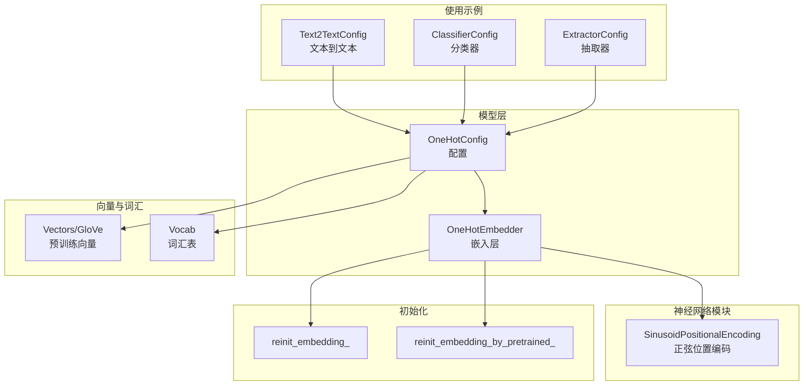
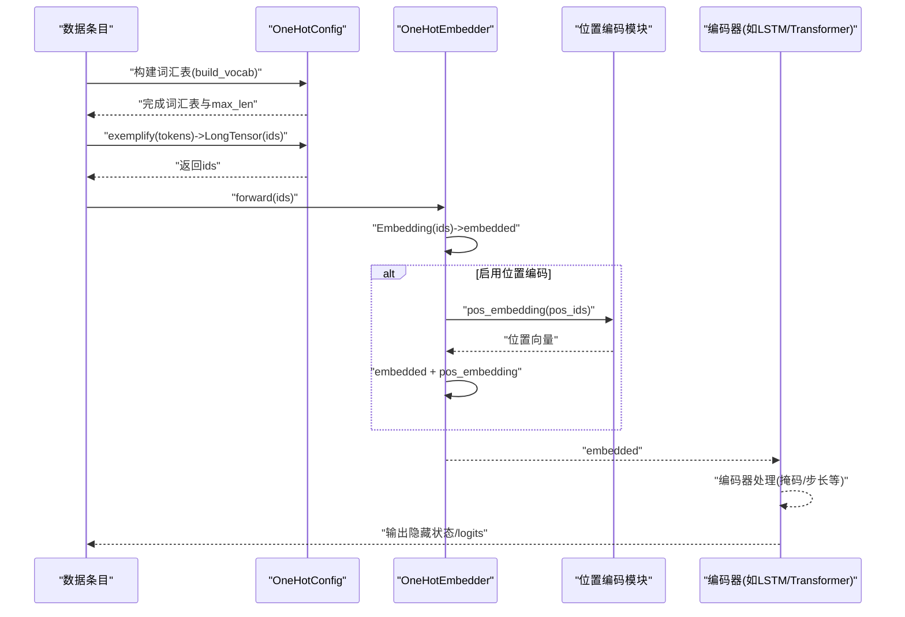
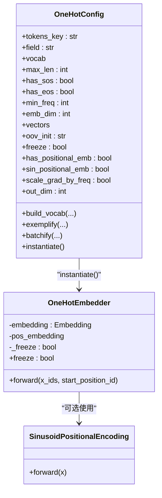
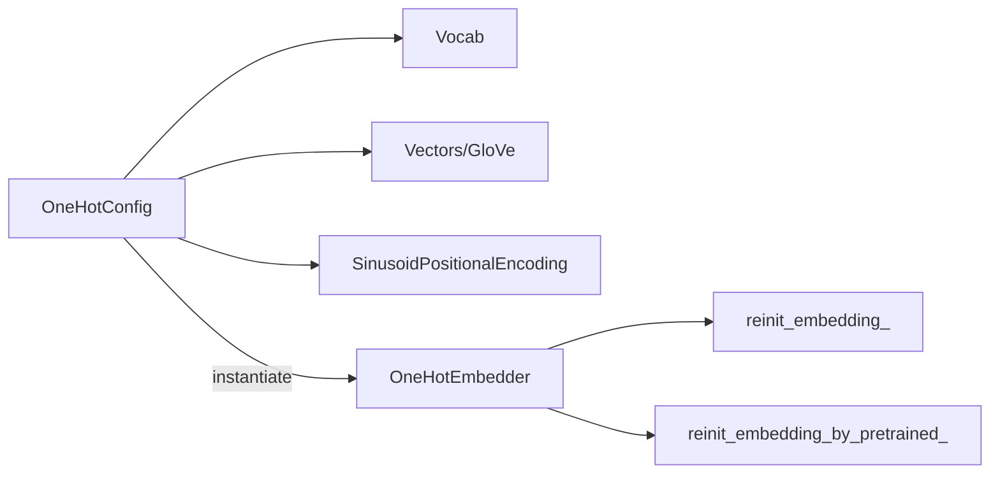

# 词嵌入

<cite>
**本文引用的文件列表**
- [embedder.py](file://eznlp/model/embedder.py)
- [embedding.py](file://eznlp/nn/modules/embedding.py)
- [vectors.py](file://eznlp/vectors.py)
- [vocab.py](file://eznlp/vocab.py)
- [init.py](file://eznlp/nn/init.py)
- [config.py](file://eznlp/config.py)
- [text2text.py](file://eznlp/model/model/text2text.py)
- [classifier.py](file://eznlp/model/model/classifier.py)
- [extractor.py](file://eznlp/model/model/extractor.py)
- [test_sequence_tagging.py](file://tests/model/test_sequence_tagging.py)
</cite>

## 目录
1. [简介](#简介)
2. [项目结构](#项目结构)
3. [核心组件](#核心组件)
4. [架构总览](#架构总览)
5. [详细组件分析](#详细组件分析)
6. [依赖关系分析](#依赖关系分析)
7. [性能考量](#性能考量)
8. [故障排查指南](#故障排查指南)
9. [结论](#结论)
10. [附录：使用示例与最佳实践](#附录使用示例与最佳实践)

## 简介
本章节系统化梳理eznlp中“词嵌入”子系统，重点围绕OneHotEmbedder与OneHotConfig两类核心组件展开，覆盖以下主题：
- 如何配置词汇表、嵌入维度、预训练向量（如GloVe）的加载与初始化
- 位置编码（正弦与学习型位置编码）的启用与使用
- freeze参数对嵌入层训练的影响机制
- 嵌入层在数据流中的作用及与编码器的交互方式
- 输入ID张量的处理与输出嵌入张量的格式约定

## 项目结构
与词嵌入直接相关的模块分布如下：
- 配置与模型定义：OneHotConfig、OneHotEmbedder位于模型层
- 位置编码：SinusoidPositionalEncoding位于神经网络模块层
- 预训练向量：Vectors、GloVe等加载与缓存逻辑
- 词汇表：Vocab构建与索引映射
- 初始化策略：reinit_embedding_、reinit_embedding_by_pretrained_等
- 使用示例：文本到文本、分类器、抽取器等模型配置中均有OneHotConfig的使用

图表来源
- [embedder.py](file://eznlp/model/embedder.py#L51-L195)
- [embedding.py](file://eznlp/nn/modules/embedding.py#L5-L34)
- [vectors.py](file://eznlp/vectors.py#L71-L146)
- [vocab.py](file://eznlp/vocab.py#L6-L66)
- [init.py](file://eznlp/nn/init.py#L12-L63)
- [text2text.py](file://eznlp/model/model/text2text.py#L21-L36)
- [classifier.py](file://eznlp/model/model/classifier.py#L43-L58)
- [extractor.py](file://eznlp/model/model/extractor.py#L57-L69)

章节来源
- [embedder.py](file://eznlp/model/embedder.py#L51-L195)
- [embedding.py](file://eznlp/nn/modules/embedding.py#L5-L34)
- [vectors.py](file://eznlp/vectors.py#L71-L146)
- [vocab.py](file://eznlp/vocab.py#L6-L66)
- [init.py](file://eznlp/nn/init.py#L12-L63)
- [text2text.py](file://eznlp/model/model/text2text.py#L21-L36)
- [classifier.py](file://eznlp/model/model/classifier.py#L43-L58)
- [extractor.py](file://eznlp/model/model/extractor.py#L57-L69)

## 核心组件
- OneHotConfig：负责字段选择、词汇表构建、序列截断长度、特殊符号、预训练向量维度一致性检查、冻结策略、位置编码开关与类型、梯度按频率缩放等；提供exemplify与batchify以生成输入ID张量与批量填充。
- OneHotEmbedder：基于配置构建Embedding层，支持随机初始化或基于预训练向量的初始化；可选正弦或学习型位置编码；通过freeze属性控制是否冻结嵌入权重；forward接收输入ID张量并返回嵌入张量。

章节来源
- [embedder.py](file://eznlp/model/embedder.py#L51-L195)

## 架构总览
下图展示了从配置到嵌入层再到编码器的数据流路径，以及位置编码的叠加方式。

图表来源
- [embedder.py](file://eznlp/model/embedder.py#L125-L195)
- [embedding.py](file://eznlp/nn/modules/embedding.py#L5-L34)
- [text2text.py](file://eznlp/model/model/text2text.py#L72-L93)

## 详细组件分析

### OneHotConfig 类
- 字段与键
  - tokens_key：默认为"tokens"，用于定位TokenSequence对象中的字段集合。
  - field：必填，指定要嵌入的字段名（如"text"）。
- 词汇表与长度
  - build_vocab：遍历数据分区，统计字段词频，构建Vocab；同时记录最大序列长度max_len。
  - specials：根据has_sos/has_eos动态包含<sos>/<eos>。
  - pad_idx/unk_idx/sos_idx/eos_idx：通过VocabMixin提供的索引访问。
- 嵌入与预训练
  - emb_dim：嵌入维度；若传入vectors且维度不一致，会警告并重置为向量维度。
  - vectors：可选，传入后将用于初始化Embedding权重。
  - oov_init：OOV词向量初始化策略（zeros/uniform），影响未登录词的初始化。
  - freeze：冻结标志，必须与vectors同时出现时才有效。
- 位置编码
  - has_positional_emb：是否启用位置编码。
  - sin_positional_emb：True表示使用正弦位置编码，否则使用学习型位置编码。
- 梯度策略
  - scale_grad_by_freq：是否按词频缩放梯度。
- 数据处理
  - exemplify：将TokenSequence转换为LongTensor的词ID序列（可插入<sos>/<eos>）。
  - batchify：对一批LongTensor进行padding，使用pad_idx。
- 输出维度
  - out_dim：等于emb_dim。

章节来源
- [embedder.py](file://eznlp/model/embedder.py#L51-L139)
- [vocab.py](file://eznlp/vocab.py#L6-L66)
- [vectors.py](file://eznlp/vectors.py#L71-L126)

### OneHotEmbedder 类
- Embedding层
  - 词表大小=voc_dim，维度=emb_dim，padding_idx由配置提供。
  - 若无预训练向量，则使用均匀初始化；若有，则按vectors.lookup结果复制权重，并按oov_init策略初始化未登录词。
- 冻结策略
  - freeze属性setter会同步设置embedding.requires_grad_，从而控制训练时是否更新嵌入权重。
- 位置编码
  - 正弦位置编码：SinusoidPositionalEncoding，按max_len与emb_dim构造权重矩阵，前向直接查表。
  - 学习型位置编码：Embedding(max_len, emb_dim)，并进行初始化。
  - 前向时根据start_position_id与输入步长切片pos_ids，并广播到批次维，再与嵌入相加。
- 前向接口
  - 输入：LongTensor(ids)形状为(..., step)
  - 输出：嵌入张量(..., step, emb_dim)

图表来源
- [embedder.py](file://eznlp/model/embedder.py#L51-L195)
- [embedding.py](file://eznlp/nn/modules/embedding.py#L5-L34)

章节来源
- [embedder.py](file://eznlp/model/embedder.py#L141-L195)
- [embedding.py](file://eznlp/nn/modules/embedding.py#L5-L34)

### 位置编码实现细节
- 正弦位置编码
  - 权重矩阵形状为(max_len, emb_dim)，偶数维度采用sin，奇数维度采用cos，最后按比例缩放。
  - 作为buffer注册，前向直接按位置索引取值。
- 学习型位置编码
  - 与Embedding类似，但仅在需要时启用，且同样支持scale_grad_by_freq。

章节来源
- [embedding.py](file://eznlp/nn/modules/embedding.py#L5-L34)
- [embedder.py](file://eznlp/model/embedder.py#L159-L171)

### 预训练向量加载与初始化
- Vectors/GloVe
  - 支持从文件加载，自动推断维度，缓存为.pt以便后续快速读取。
  - lookup支持大小写等变体尝试，提高命中率。
- 初始化策略
  - reinit_embedding_by_pretrained_：逐词复制预训练向量，未命中的词按oov_init策略初始化。
  - reinit_embedding_：均匀初始化，padding_idx强制为0。

章节来源
- [vectors.py](file://eznlp/vectors.py#L71-L146)
- [init.py](file://eznlp/nn/init.py#L12-L63)
- [embedder.py](file://eznlp/model/embedder.py#L150-L155)

### 冻结参数对训练的影响
- freeze=True时，embedding.requires_grad_=False，训练期间不会更新嵌入权重。
- 测试用例验证了freeze在不同模型配置下的可用性与行为一致性。

章节来源
- [embedder.py](file://eznlp/model/embedder.py#L173-L181)
- [test_sequence_tagging.py](file://tests/model/test_sequence_tagging.py#L148-L161)

### 在数据流中的作用与与编码器的交互
- 文本到文本
  - 配置中embedder使用OneHotConfig，decoder也使用OneHotConfig并开启<sos>/<eos>。
  - forward中先将tok_ids送入embedder得到embedded，再交给encoder处理。
- 分类器/抽取器
  - 通过ConfigDict组织多个字段的OneHotConfig，exemplify与batchify分别生成各字段的ids并拼接。
  - 嵌入后的特征进入中间编码器或直接进入解码器。

章节来源
- [text2text.py](file://eznlp/model/model/text2text.py#L21-L36)
- [text2text.py](file://eznlp/model/model/text2text.py#L72-L93)
- [classifier.py](file://eznlp/model/model/classifier.py#L43-L58)
- [extractor.py](file://eznlp/model/model/extractor.py#L57-L69)

## 依赖关系分析
- OneHotConfig依赖
  - Vocab：构建词汇表与索引映射
  - Vectors：预训练向量加载与lookup
  - SinusoidPositionalEncoding：正弦位置编码
  - reinit_embedding_ / reinit_embedding_by_pretrained_：初始化策略
- OneHotEmbedder依赖
  - torch.nn.Embedding：基础嵌入
  - torch.nn.utils.rnn.pad_sequence：批量填充
  - Config：统一的配置抽象基类

图表来源
- [embedder.py](file://eznlp/model/embedder.py#L51-L195)
- [vectors.py](file://eznlp/vectors.py#L71-L146)
- [vocab.py](file://eznlp/vocab.py#L6-L66)
- [init.py](file://eznlp/nn/init.py#L12-L63)

章节来源
- [embedder.py](file://eznlp/model/embedder.py#L51-L195)
- [config.py](file://eznlp/config.py#L20-L72)

## 性能考量
- 批量填充与padding_idx
  - exemplify返回LongTensor，batchify使用pad_sequence并以pad_idx填充，避免不必要的计算。
- 梯度按频率缩放
  - scale_grad_by_freq可减少高频词主导梯度更新，有助于稳定训练。
- 位置编码选择
  - 正弦位置编码无需额外参数，适合长序列；学习型位置编码更灵活但需额外参数。
- 预训练向量初始化
  - 使用预训练向量可加速收敛，但需注意emb_dim与向量维度一致，避免额外开销。

章节来源
- [embedder.py](file://eznlp/model/embedder.py#L125-L139)
- [embedder.py](file://eznlp/model/embedder.py#L144-L155)
- [embedding.py](file://eznlp/nn/modules/embedding.py#L5-L34)

## 故障排查指南
- 嵌入维度不一致
  - 当传入vectors时，若emb_dim与vectors.emb_dim不一致，OneHotConfig会发出警告并重置emb_dim为向量维度。
- OOV词过多
  - reinit_embedding_by_pretrained_会统计OOV比例与平均绝对值，便于评估预训练覆盖情况。
- 冻结无效
  - freeze=True时必须提供vectors，否则断言失败。
- 位置编码越界
  - forward中会对start_position_id+step与_pos_ids长度进行断言，确保不超过max_len。

章节来源
- [embedder.py](file://eznlp/model/embedder.py#L63-L72)
- [init.py](file://eznlp/nn/init.py#L25-L63)
- [embedder.py](file://eznlp/model/embedder.py#L173-L194)

## 结论
OneHotEmbedder与OneHotConfig构成了eznlp中简洁而强大的一热词嵌入方案。其优势在于：
- 易于配置：字段、词汇表、预训练向量、位置编码、冻结策略均可在配置中集中管理
- 可扩展性强：可与多种编码器组合，满足序列标注、文本生成、分类等多种任务
- 训练可控：freeze参数与初始化策略共同保证了从随机初始化到冻结预训练的平滑过渡

## 附录：使用示例与最佳实践
- 构建与实例化
  - 在文本到文本配置中，embedder与decoder均使用OneHotConfig，decoder开启<sos>/<eos>。
  - 在分类器/抽取器配置中，通过ConfigDict组织多字段OneHotConfig，exemplify与batchify分别生成各字段的ids。
- 预训练向量
  - 通过vectors参数传入GloVe等预训练向量，自动完成lookup与初始化；OOV词按zeros或uniform策略初始化。
- 位置编码
  - has_positional_emb=True时，sin_positional_emb=True启用正弦位置编码，否则使用学习型位置编码。
- 冻结策略
  - freeze=True可冻结嵌入权重，适用于固定预训练词向量的场景；freeze=False允许微调。

章节来源
- [text2text.py](file://eznlp/model/model/text2text.py#L21-L36)
- [classifier.py](file://eznlp/model/model/classifier.py#L43-L58)
- [extractor.py](file://eznlp/model/model/extractor.py#L57-L69)
- [test_sequence_tagging.py](file://tests/model/test_sequence_tagging.py#L148-L161)