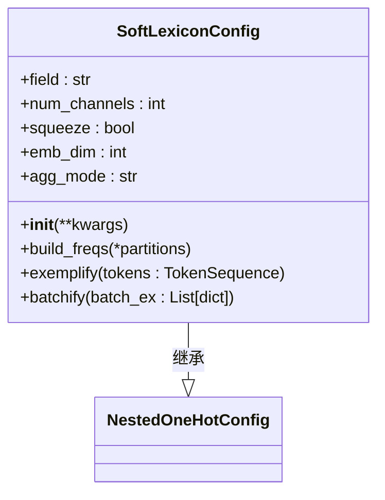
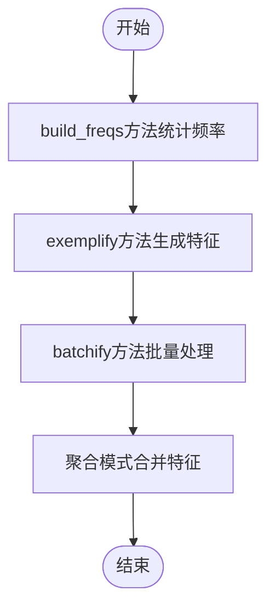

# 软词典嵌入

<cite>
**本文档引用的文件**   
- [nested_embedder.py](file://eznlp/model/nested_embedder.py)
- [embedder.py](file://eznlp/model/embedder.py)
- [aggregation.py](file://eznlp/nn/modules/aggregation.py)
- [extractor.py](file://eznlp/model/model/extractor.py)
- [config.py](file://eznlp/config.py)
- [hz_ner_with_expert_dict.py](file://examples/hz_ner_with_expert_dict.py)
</cite>

## 目录
1. [引言](#引言)
2. [核心机制概述](#核心机制概述)
3. [SoftLexiconConfig类详解](#softlexiconconfig类详解)
4. [多通道软词典特征生成](#多通道软词典特征生成)
5. [频率加权与聚合模式](#频率加权与聚合模式)
6. [频率统计方法build_freqs](#频率统计方法build_freqs)
7. [配置组合与使用示例](#配置组合与使用示例)
8. [在中文命名实体识别中的作用](#在中文命名实体识别中的作用)

## 引言
软词典嵌入（Soft Lexicon Embedding）是一种先进的自然语言处理技术，旨在通过利用外部词典（如CTB50）为中文文本生成多通道的软词典特征，从而提升中文命名实体识别（NER）的性能。该技术通过将外部词典信息融入模型的嵌入层，为模型提供额外的边界和语义信息，使其能够更好地理解中文文本的结构和含义。本文档将全面解析eznlp框架中软词典嵌入的实现，重点介绍SoftLexiconConfig类的细节，以及如何通过配置ohots、mhots和nested_ohots字段来组合词、字符和软词典嵌入。

## 核心机制概述
软词典嵌入的核心思想是利用外部词典中的词条信息，为输入文本中的每个字符或词语生成一个软词典特征向量。这个向量不仅包含了词条的存在与否，还通过频率加权的方式反映了词条在训练数据中的出现频率。通过这种方式，模型可以学习到哪些词条在特定上下文中更为重要，从而提高命名实体识别的准确性。

在eznlp框架中，软词典嵌入的实现主要依赖于`SoftLexiconConfig`类，该类继承自`NestedOneHotConfig`，并在此基础上增加了频率加权和聚合模式的支持。`SoftLexiconConfig`类通过`build_freqs`方法统计词典项在训练数据中的出现频率，并在`exemplify`和`batchify`方法中将这些频率信息融入到嵌入向量中。

**Section sources**
- [nested_embedder.py](file://eznlp/model/nested_embedder.py#L151-L211)

## SoftLexiconConfig类详解
`SoftLexiconConfig`类是软词典嵌入的核心实现，它定义了如何从外部词典生成软词典特征。该类的主要属性和方法包括：

- **field**: 指定用于存储软词典特征的字段名，默认为"softlexicon"。
- **num_channels**: 指定软词典特征的通道数，默认为4。每个通道可以表示不同的特征，如字符级别的匹配、词语级别的匹配等。
- **squeeze**: 是否压缩通道数，默认为False。如果设置为True，则`num_channels`必须为1。
- **emb_dim**: 嵌入维度，默认为50。
- **agg_mode**: 聚合模式，默认为"wtd_mean_pooling"，表示加权平均池化。

`SoftLexiconConfig`类的`__init__`方法初始化了这些属性，并调用了父类的构造函数。`build_freqs`方法用于统计词典项在训练数据中的出现频率，`exemplify`方法生成单个样本的软词典特征，`batchify`方法将多个样本的特征组合成一个批次。



**Diagram sources **
- [nested_embedder.py](file://eznlp/model/nested_embedder.py#L151-L211)

**Section sources**
- [nested_embedder.py](file://eznlp/model/nested_embedder.py#L151-L211)

## 多通道软词典特征生成
多通道软词典特征的生成是通过`NestedOneHotConfig`类的`_inner_sequences`方法实现的。该方法遍历输入文本中的每个字符或词语，并根据外部词典生成相应的特征序列。每个特征序列对应一个通道，通过这种方式，模型可以同时考虑多个不同类型的特征。

例如，假设外部词典包含以下词条：["北京", "上海", "广州"]。对于输入文本"我爱北京天安门"，`_inner_sequences`方法会生成如下特征序列：
- 通道1: [0, 0, 1, 1, 0, 0, 0] （表示"北京"的匹配）
- 通道2: [0, 0, 0, 0, 0, 0, 0] （表示"上海"的匹配）
- 通道3: [0, 0, 0, 0, 0, 0, 0] （表示"广州"的匹配）

这些特征序列随后会被转换为嵌入向量，并通过聚合模式（如加权平均池化）合并成一个最终的软词典特征向量。

**Section sources**
- [nested_embedder.py](file://eznlp/model/nested_embedder.py#L52-L58)

## 频率加权与聚合模式
频率加权是软词典嵌入中的一个重要组成部分，它通过`build_freqs`方法统计词典项在训练数据中的出现频率，并在`exemplify`和`batchify`方法中将这些频率信息融入到嵌入向量中。具体来说，`build_freqs`方法会遍历训练数据和开发数据，统计每个词典项的出现次数，并将其存储在`self.freqs`字典中。

聚合模式决定了如何将多个通道的特征向量合并成一个最终的特征向量。`SoftLexiconConfig`类支持多种聚合模式，包括：
- **mean_pooling**: 平均池化
- **max_pooling**: 最大池化
- **min_pooling**: 最小池化
- **wtd_mean_pooling**: 加权平均池化
- **rnn_last**: RNN最后一个隐藏状态

其中，`wtd_mean_pooling`是最常用的聚合模式，它通过加权平均的方式将多个通道的特征向量合并成一个最终的特征向量。权重由`build_freqs`方法生成的频率信息决定。



**Diagram sources **
- [nested_embedder.py](file://eznlp/model/nested_embedder.py#L174-L189)
- [aggregation.py](file://eznlp/nn/modules/aggregation.py#L24-L40)

**Section sources**
- [nested_embedder.py](file://eznlp/model/nested_embedder.py#L174-L189)
- [aggregation.py](file://eznlp/nn/modules/aggregation.py#L24-L40)

## 频率统计方法build_freqs
`build_freqs`方法是软词典嵌入中频率统计的关键部分。该方法接收训练数据和开发数据作为输入，遍历每个数据条目，统计每个词典项的出现频率。具体实现如下：

1. 初始化一个`Counter`对象，用于统计词典项的出现次数。
2. 遍历训练数据和开发数据，对于每个数据条目，调用`_inner_sequences`方法生成特征序列。
3. 将特征序列中的每个词典项添加到`Counter`对象中。
4. 将`Counter`对象中的频率信息更新到`self.freqs`字典中，并设置最小频率为1，以避免OOV（Out-of-Vocabulary）标记被忽略。

```python
def build_freqs(self, *partitions):
    """Ma et al. (2020): The statistical data set is constructed from a combination
    of *training* and *developing* data of the task.
    In addition, note that the frequency of `w` does not increase if `w` is
    covered by another sub-sequence that matches the lexicon
    """
    counter = Counter()
    for data in partitions:
        for data_entry in data:
            for inner_seq in self._inner_sequences(data_entry[self.tokens_key]):
                counter.update(inner_seq)

    # NOTE: Set the minimum frequecy as 1, to avoid OOV tokens being ignored
    self.freqs = {tok: 1 for tok in self.vocab.itos}
    self.freqs.update(counter)
    self.freqs["<pad>"] = 0
```

**Section sources**
- [nested_embedder.py](file://eznlp/model/nested_embedder.py#L174-L189)

## 配置组合与使用示例
在实际应用中，可以通过配置`ExtractorConfig`类的`ohots`、`mhots`和`nested_ohots`字段来组合词、字符和软词典嵌入。以下是一个具体的使用示例：

```python
from eznlp.model import ExtractorConfig, SoftLexiconConfig

# 定义软词典配置
soft_lexicon_config = SoftLexiconConfig(
    field="softlexicon",
    num_channels=4,
    emb_dim=50,
    agg_mode="wtd_mean_pooling"
)

# 定义提取器配置
extractor_config = ExtractorConfig(
    ohots={
        "char": CharConfig(emb_dim=16, encoder=EncoderConfig(arch="LSTM", hid_dim=128))
    },
    mhots={
        "pos": MultiHotConfig(field="pos", emb_dim=50)
    },
    nested_ohots={
        "softlexicon": soft_lexicon_config
    }
)

# 构建词汇表和维度
extractor_config.build_vocabs_and_dims(train_data, dev_data, test_data)
```

在这个示例中，`ohots`字段配置了字符级别的嵌入，`mhots`字段配置了POS标签的多热嵌入，`nested_ohots`字段配置了软词典嵌入。通过这种方式，模型可以同时利用多种类型的特征，提高命名实体识别的性能。

**Section sources**
- [extractor.py](file://eznlp/model/model/extractor.py#L122-L146)
- [hz_ner_with_expert_dict.py](file://examples/hz_ner_with_expert_dict.py#L117-L133)

## 在中文命名实体识别中的作用
软词典嵌入在中文命名实体识别中起到了至关重要的作用。通过利用外部词典中的词条信息，模型可以获得额外的边界和语义信息，从而更好地理解中文文本的结构和含义。特别是在处理未登录词（OOV）时，软词典嵌入可以提供重要的上下文信息，帮助模型正确识别实体。

此外，频率加权机制使得模型能够关注那些在训练数据中频繁出现的词条，从而提高模型的泛化能力。通过组合词、字符和软词典嵌入，模型可以综合利用多种类型的特征，进一步提升命名实体识别的准确性和鲁棒性。

**Section sources**
- [nested_embedder.py](file://eznlp/model/nested_embedder.py#L151-L211)
- [hz_ner_with_expert_dict.py](file://examples/hz_ner_with_expert_dict.py#L117-L133)