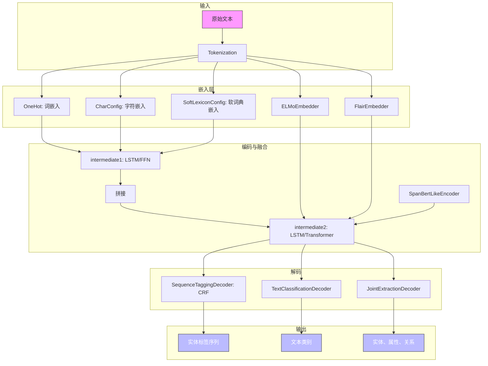

# 模型架构

<cite>
**本文档中引用的文件**   
- [extractor.py](file://eznlp/model/model/extractor.py)
- [base.py](file://eznlp/model/model/base.py)
- [embedder.py](file://eznlp/model/embedder.py)
- [nested_embedder.py](file://eznlp/model/nested_embedder.py)
- [encoder.py](file://eznlp/model/encoder.py)
- [sequence_tagging.py](file://eznlp/model/decoder/sequence_tagging.py)
- [text_classification.py](file://eznlp/model/decoder/text_classification.py)
- [joint_extraction.py](file://eznlp/model/decoder/joint_extraction.py)
- [span_bert_like.py](file://eznlp/model/span_bert_like.py)
- [masked_span_bert_like.py](file://eznlp/model/masked_span_bert_like.py)
- [flair.py](file://eznlp/model/flair.py)
- [elmo.py](file://eznlp/model/elmo.py)
</cite>

## 目录
1. [引言](#引言)
2. [核心组件体系](#核心组件体系)
3. [嵌入层设计](#嵌入层设计)
4. [编码器实现](#编码器实现)
5. [解码器配置](#解码器配置)
6. [Extractor类：组件协调中枢](#extractor类组件协调中枢)
7. [模型构建示例](#模型构建示例)
8. [架构图：组件间数据流](#架构图组件间数据流)
9. [结论](#结论)

## 引言
eznlp框架提供了一个高度模块化和可配置的模型架构设计，旨在支持各种自然语言处理任务，特别是命名实体识别（NER）。该架构的核心思想是将模型分解为独立的、可互换的组件，包括嵌入层、编码器和解码器。这种模块化设计允许研究人员和开发者灵活地组合不同的技术，如LSTM、Transformer、BERT等编码器，以及CRF、边界选择等解码器，以构建最适合特定任务需求的复杂模型。本文档将系统性地描述这一架构设计，重点介绍其模块化组件体系及如何通过Extractor类协调各组件。

## 核心组件体系
eznlp的模型架构遵循一个清晰的分层设计，主要由三个核心部分构成：嵌入层（Embedder）、编码器（Encoder）和解码器（Decoder）。这些组件通过一个名为Extractor的中枢类进行协调和集成。整个架构的设计基于配置（Config）和实例（Instance）分离的原则，即每个组件都有一个对应的配置类（如`XXXConfig`）和一个实例类（如`XXX`）。配置类负责定义组件的超参数和初始化设置，而实例类则根据配置创建实际的PyTorch模块。这种设计极大地提高了代码的可读性和可维护性。

**组件关系与数据流**：数据首先通过嵌入层被转换为稠密向量表示。这些嵌入向量随后被送入编码器，编码器负责捕捉序列中的上下文信息，生成隐藏状态。最后，解码器利用这些隐藏状态进行最终的预测，例如为每个token分配标签（序列标注）或识别文本中的实体跨度（Span分类）。Extractor类作为协调者，负责管理这些组件的配置、构建词汇表、处理数据批处理，并将数据在各组件间正确传递。

**Section sources**
- [base.py](file://eznlp/model/model/base.py#L1-L99)
- [extractor.py](file://eznlp/model/model/extractor.py#L1-L274)

## 嵌入层设计
嵌入层是模型的第一道处理环节，负责将原始的离散符号（如单词、字符）映射为连续的向量空间表示。eznlp提供了多种嵌入层实现，以支持不同的特征输入和模型需求。

### 词嵌入（OneHotConfig）
`OneHotConfig`类实现了标准的词嵌入功能。它接受一个文本字段（如`text`），并为该字段中的每个唯一token创建一个嵌入向量。其主要配置参数包括：
- **`field`**: 指定输入数据中要处理的字段名。
- **`emb_dim`**: 定义嵌入向量的维度。
- **`vectors`**: 可选参数，用于加载预训练的词向量（如GloVe、Word2Vec），并将其作为嵌入层的初始化权重。
- **`has_positional_emb`**: 是否添加位置嵌入，这对于没有内在顺序感知能力的模型（如FFN）尤为重要。

### 字符嵌入与软词典嵌入（NestedOneHotConfig）
`NestedOneHotConfig`是`OneHotConfig`的扩展，用于处理具有“步-通道-内步”结构的特征。这种设计特别适用于字符级嵌入和软词典特征。
- **`CharConfig`**: 一个具体的子类，用于实现字符嵌入。它将每个单词视为一个字符序列，先对字符进行嵌入，然后通过一个编码器（如LSTM）和聚合器（如取最后一个状态）来生成单词的字符级表示。
- **`SoftLexiconConfig`**: 另一个关键的子类，实现了Ma等人（2020）提出的软词典方法。该方法利用外部词典（如分词词典）来增强中文NER模型。它会为每个token生成多个“匹配的词”作为特征，并使用加权平均池化（`wtd_mean_pooling`）来聚合这些词的嵌入，其中权重由词在训练数据中的出现频率决定。

**Section sources**
- [embedder.py](file://eznlp/model/embedder.py#L1-L248)
- [nested_embedder.py](file://eznlp/model/nested_embedder.py#L1-L309)

## 编码器实现
编码器负责处理嵌入层输出的向量序列，并生成包含上下文信息的隐藏状态。eznlp支持多种主流的编码器架构。

### 循环神经网络（LSTM/GRU）
通过`EncoderConfig`配置，可以轻松创建LSTM或GRU编码器。其关键参数包括：
- **`arch`**: 设置为`"LSTM"`或`"GRU"`。
- **`hid_dim`**: 隐藏层维度。
- **`num_layers`**: 网络层数。
- **`train_init_hidden`**: 是否训练初始隐藏状态，而不是使用零初始化。

### 卷积神经网络（CNN）
支持标准的卷积编码器（`arch="conv"`）和Gehring等人（2017）提出的门控卷积编码器（`arch="gehring"`）。后者通过门控线性单元（GLU）和残差连接来提升性能。

### Transformer编码器
通过设置`arch="transformer"`，可以使用标准的Transformer编码器块。它利用自注意力机制来捕捉长距离依赖关系。

### BERT-like编码器
`SpanBertLikeConfig`和`MaskedSpanBertLikeConfig`类用于集成预训练的语言模型（如BERT、RoBERTa）。它们不仅可以直接使用BERT的最后一层隐藏状态，还支持更高级的用法，例如通过查询-键值机制（`QueryBertLikeEncoder`）来提取特定跨度的表示，这对于Span分类任务非常有用。

**Section sources**
- [encoder.py](file://eznlp/model/encoder.py#L1-L375)
- [span_bert_like.py](file://eznlp/model/span_bert_like.py#L1-L181)
- [masked_span_bert_like.py](file://eznlp/model/masked_span_bert_like.py#L1-L236)

## 解码器配置
解码器利用编码器生成的隐藏状态进行最终的预测任务。eznlp提供了多种解码器来适应不同的任务类型。

### 序列标注（SequenceTaggingDecoder）
这是最常用的解码器之一，用于NER等任务。其核心配置包括：
- **`scheme`**: 标签编码方案，如`"BIOES"`。
- **`use_crf`**: 是否使用条件随机场（CRF）层。CRF能够对标签序列的转移进行建模，通常能显著提升序列标注任务的性能。
- **`in_drop_rates`**: 输入到解码器的Dropout率。

### 文本分类（TextClassificationDecoder）
用于将整个序列分类到预定义的类别中。它首先通过一个聚合器（如注意力机制或池化）将序列的隐藏状态压缩为一个固定长度的向量，然后通过一个线性层进行分类。

### 联合抽取（JointExtractionDecoder）
这是一个复合解码器，可以同时执行多个子任务，例如先识别实体（`ck_decoder`），然后对实体进行属性分类（`attr_decoder`）或关系分类（`rel_decoder`）。它通过配置不同的子解码器来实现复杂的多任务学习。

**Section sources**
- [sequence_tagging.py](file://eznlp/model/decoder/sequence_tagging.py#L1-L198)
- [text_classification.py](file://eznlp/model/decoder/text_classification.py#L1-L117)
- [joint_extraction.py](file://eznlp/model/decoder/joint_extraction.py#L1-L193)

## Extractor类：组件协调中枢
`Extractor`类是整个模型架构的中枢，它负责将所有独立的组件（嵌入层、编码器、解码器）无缝地集成在一起。

### 配置与初始化
`ExtractorConfig`类定义了整个模型的配置。它通过一系列属性来管理各个组件：
- **`ohots`, `mhots`, `nested_ohots`**: 分别对应不同类型的嵌入层配置。
- **`elmo`, `bert_like`, `flair_fw`, `flair_bw`**: 对应外部预训练模型的配置。
- **`intermediate1`, `intermediate2`**: 对应两个中间编码器，用于处理和融合来自不同嵌入层的特征。
- **`decoder`**: 最终的解码器配置。

在`build_vocabs_and_dims`方法中，`ExtractorConfig`会遍历所有组件，为它们构建词汇表并设置正确的输入/输出维度，确保组件间的兼容性。

### 数据流与前向传播
`Extractor`实例的`forward2states`方法定义了核心的数据流：
1.  **获取完整嵌入 (`_get_full_embedded`)**: 将所有嵌入层（如词嵌入、字符嵌入）的输出拼接在一起。
2.  **获取完整隐藏状态 (`_get_full_hidden`)**: 将拼接后的嵌入向量送入`intermediate1`编码器。然后，将`intermediate1`的输出、预训练模型（如BERT）的输出等所有特征拼接起来，最后通过`intermediate2`编码器生成最终的隐藏状态`full_hidden`。
3.  **解码**: 将`full_hidden`传递给解码器，由解码器完成最终的预测任务。

这种设计使得用户可以像搭积木一样，自由地组合不同的组件，而`Extractor`会自动处理复杂的维度匹配和数据流问题。

**Section sources**
- [extractor.py](file://eznlp/model/model/extractor.py#L1-L274)

## 模型构建示例
以下是如何使用eznlp的模块化组件构建一个复杂模型的示例。

### 构建BERT+CRF NER模型
要构建一个使用BERT编码器和CRF解码器的NER模型，可以按以下步骤进行配置：

```python
# 1. 配置BERT-like编码器
bert_config = SpanBertLikeConfig(
    bert_like=pretrained_bert_model,  # 加载的预训练BERT模型
    arch="BERT",
    num_layers=12,  # 使用BERT的最后12层
    freeze=True     # 冻结BERT参数
)

# 2. 配置序列标注解码器
decoder_config = SequenceTaggingDecoderConfig(
    scheme="BIOES",
    use_crf=True,   # 使用CRF解码器
    in_dim=768      # BERT的隐藏层维度
)

# 3. 组合成Extractor配置
extractor_config = ExtractorConfig(
    bert_like=bert_config,
    intermediate2=None,  # BERT输出直接作为隐藏状态
    decoder=decoder_config
)

# 4. 实例化模型
model = extractor_config.instantiate()
```
此配置创建了一个标准的BERT-CRF模型，其中BERT负责生成上下文相关的token表示，而CRF层则确保输出的标签序列是合法且最优的。

**Section sources**
- [extractor.py](file://eznlp/model/model/extractor.py#L50-L89)
- [sequence_tagging.py](file://eznlp/model/decoder/sequence_tagging.py#L96-L140)
- [span_bert_like.py](file://eznlp/model/span_bert_like.py#L13-L38)

## 架构图：组件间数据流
下图可视化了eznlp模型中各组件之间的数据流动和依赖关系。



**Diagram sources **
- [extractor.py](file://eznlp/model/model/extractor.py#L23-L48)
- [embedder.py](file://eznlp/model/embedder.py#L51-L56)
- [nested_embedder.py](file://eznlp/model/nested_embedder.py#L215-L220)
- [elmo.py](file://eznlp/model/elmo.py#L10-L13)
- [flair.py](file://eznlp/model/flair.py#L11-L14)
- [encoder.py](file://eznlp/model/encoder.py#L15-L21)
- [sequence_tagging.py](file://eznlp/model/decoder/sequence_tagging.py#L93-L96)

## 结论
eznlp的模型架构设计通过其高度模块化和可配置的组件体系，为自然语言处理研究提供了极大的灵活性。其核心在于`Extractor`类，它作为中枢协调了从嵌入层、编码器到解码器的整个数据处理流程。通过支持LSTM、Transformer、BERT等多种编码器，以及序列标注、Span分类、联合抽取等多种解码器，用户可以轻松地组合出适用于各种复杂任务的模型。这种设计不仅简化了模型实验的流程，也促进了不同技术的快速迭代和创新。