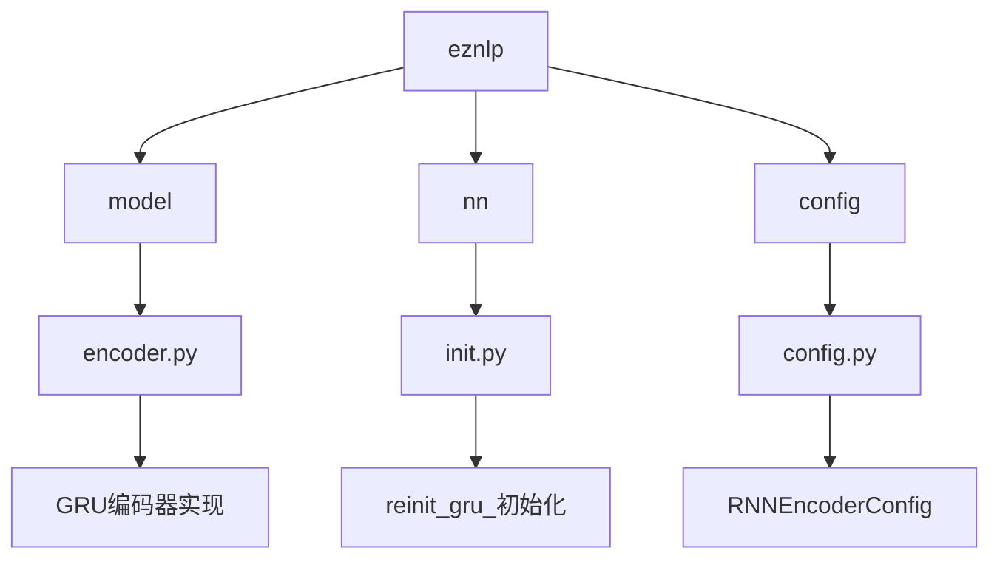
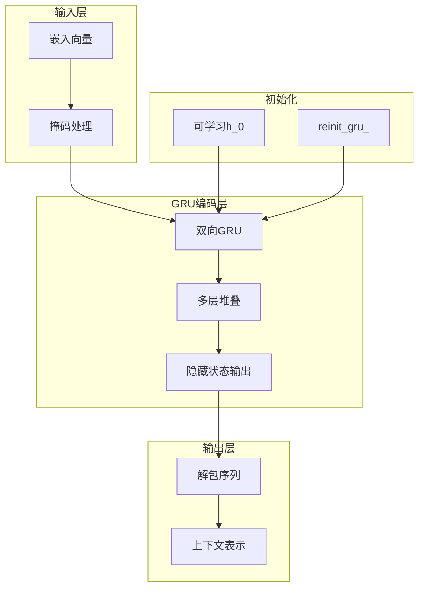
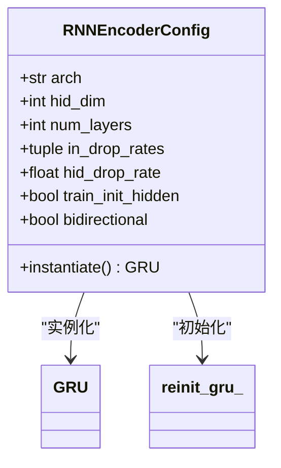
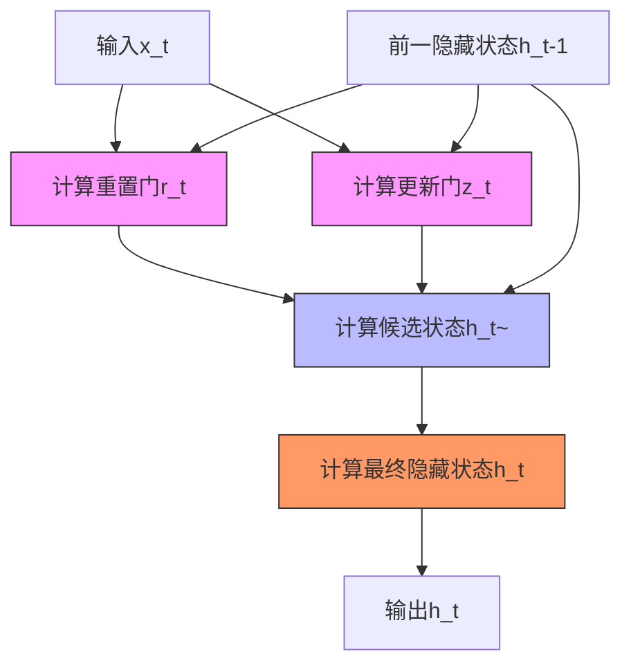
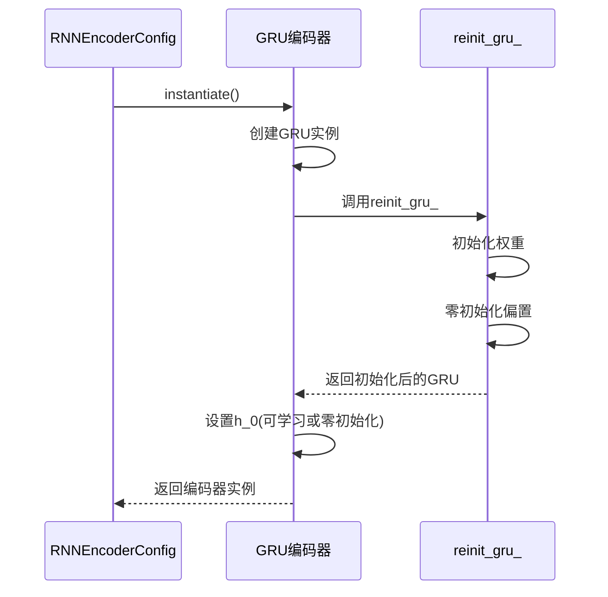
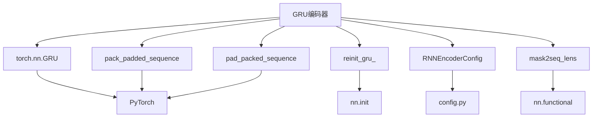

# GRU编码器

<cite>
**本文档中引用的文件**   
- [encoder.py](file://eznlp/model/encoder.py)
- [init.py](file://eznlp/nn/init.py)
- [config.py](file://eznlp/config.py)
- [rnn2text.opt](file://scripts/options/rnn2text.opt)
- [test_sequence_tagging.py](file://tests/model/test_sequence_tagging.py)
- [NER任务完整流程.md](file://docs/NER任务完整流程.md)
- [text_classification.py](file://scripts/text_classification.py)
</cite>

## 目录
1. [引言](#引言)
2. [项目结构](#项目结构)
3. [核心组件](#核心组件)
4. [架构概述](#架构概述)
5. [详细组件分析](#详细组件分析)
6. [依赖分析](#依赖分析)
7. [性能考虑](#性能考虑)
8. [故障排除指南](#故障排除指南)
9. [结论](#结论)

## 引言
本文档全面文档化eznlp中的GRU编码器实现，详细说明RNNEncoderConfig中arch='GRU'时的配置参数及其行为差异。重点解释双向GRU的门控机制实现，重置门和更新门在序列建模中的作用，隐藏状态的初始化流程，特别是train_init_hidden参数如何启用可学习的初始隐藏状态h_0。同时说明在embedded2hidden方法中，如何利用mask和mask2seq_lens函数将变长序列打包后输入GRU单元，并在输出后进行解包以恢复原始序列结构。

## 项目结构
eznlp项目的GRU编码器实现主要分布在model和nn模块中，其中核心的编码器逻辑位于model/encoder.py文件，而GRU参数初始化策略则在nn/init.py中定义。配置系统通过config.py实现，为GRU编码器提供灵活的参数配置能力。

**Diagram sources**
- [encoder.py](file://eznlp/model/encoder.py)
- [init.py](file://eznlp/nn/init.py)
- [config.py](file://eznlp/config.py)

**Section sources**
- [encoder.py](file://eznlp/model/encoder.py)
- [init.py](file://eznlp/nn/init.py)
- [config.py](file://eznlp/config.py)

## 核心组件
GRU编码器的核心组件包括RNNEncoderConfig配置类、GRU单元实现以及相关的初始化函数。RNNEncoderConfig通过arch参数指定使用GRU架构，配置了隐藏层维度、层数、dropout率等关键参数。reinit_gru_函数实现了GRU参数的特定初始化策略，对权重矩阵按门控机制进行不同的Xavier均匀初始化。

**Section sources**
- [encoder.py](file://eznlp/model/encoder.py#L1-L200)
- [init.py](file://eznlp/nn/init.py#L145-L168)

## 架构概述
eznlp中的GRU编码器采用标准的双向GRU架构，通过RNNEncoderConfig进行配置。编码器接收嵌入后的序列数据，利用掩码处理变长序列，通过打包-填充机制高效处理批次中的不同长度序列。架构支持多层堆叠，每层可配置不同的dropout策略，且提供可学习的初始隐藏状态选项。

**Diagram sources**
- [encoder.py](file://eznlp/model/encoder.py#L50-L150)
- [init.py](file://eznlp/nn/init.py#L145-L168)

## 详细组件分析

### RNNEncoderConfig配置分析
RNNEncoderConfig是GRU编码器的配置核心，当arch='GRU'时，配置参数决定了编码器的具体行为。关键参数包括hid_dim（隐藏层维度）、num_layers（层数）、in_drop_rates（输入dropout率）和train_init_hidden（是否训练初始隐藏状态）。

#### 配置参数说明

**Diagram sources**
- [encoder.py](file://eznlp/model/encoder.py#L1-L50)
- [config.py](file://eznlp/config.py#L1-L173)

**Section sources**
- [encoder.py](file://eznlp/model/encoder.py#L1-L100)
- [config.py](file://eznlp/config.py#L1-L173)

### 双向GRU门控机制分析
GRU的门控机制是其核心特性，包括重置门和更新门。重置门控制前一时刻隐藏状态对当前候选状态的影响程度，而更新门决定当前隐藏状态中保留多少前一时刻的信息和多少新信息。

#### 门控机制流程

**Diagram sources**
- [encoder.py](file://eznlp/model/encoder.py#L100-L200)
- [init.py](file://eznlp/nn/init.py#L145-L168)

**Section sources**
- [encoder.py](file://eznlp/model/encoder.py#L100-L200)

### 隐藏状态初始化流程
隐藏状态初始化是GRU编码器的重要环节。当train_init_hidden=True时，初始隐藏状态h_0被设置为可学习参数，通过反向传播进行优化。否则，h_0初始化为零向量。

#### 初始化序列图

**Diagram sources**
- [encoder.py](file://eznlp/model/encoder.py#L150-L200)
- [init.py](file://eznlp/nn/init.py#L145-L168)

**Section sources**
- [encoder.py](file://eznlp/model/encoder.py#L150-L200)
- [init.py](file://eznlp/nn/init.py#L145-L168)

### 变长序列处理机制
embedded2hidden方法通过mask和mask2seq_lens函数处理变长序列。首先将掩码转换为序列长度，然后使用pack_padded_sequence将变长序列打包，输入GRU处理，最后使用pad_packed_sequence解包恢复原始结构。

#### 序列处理流程

**Diagram sources**
- [encoder.py](file://eznlp/model/encoder.py#L200-L300)
- [nn/init.py](file://eznlp/nn/init.py#L145-L168)

**Section sources**
- [encoder.py](file://eznlp/model/encoder.py#L200-L300)

## 依赖分析
GRU编码器的实现依赖于多个模块的协同工作。主要依赖包括：torch.nn.GRU作为基础RNN单元，nn.init模块提供初始化函数，config.py提供配置系统，以及utils中的序列处理函数。

**Diagram sources**
- [encoder.py](file://eznlp/model/encoder.py)
- [init.py](file://eznlp/nn/init.py)
- [config.py](file://eznlp/config.py)

**Section sources**
- [encoder.py](file://eznlp/model/encoder.py)
- [init.py](file://eznlp/nn/init.py)
- [config.py](file://eznlp/config.py)

## 性能考虑
GRU编码器的性能受多个因素影响。多层堆叠会增加计算复杂度，双向处理会使计算量翻倍。使用可学习的初始隐藏状态会增加少量可训练参数。合理的dropout配置可以防止过拟合，但过高的dropout率会影响模型性能。

## 故障排除指南
常见问题包括梯度消失/爆炸、训练不稳定和内存不足。对于梯度问题，确保正确使用reinit_gru_初始化；对于训练不稳定，检查dropout率配置；对于内存问题，考虑减少批次大小或序列长度。

**Section sources**
- [init.py](file://eznlp/nn/init.py#L145-L168)
- [encoder.py](file://eznlp/model/encoder.py)

## 结论
eznlp中的GRU编码器实现提供了灵活且高效的序列建模能力。通过RNNEncoderConfig的丰富配置选项，用户可以轻松定制GRU编码器的架构和行为。合理的初始化策略和变长序列处理机制确保了模型的训练稳定性和计算效率。