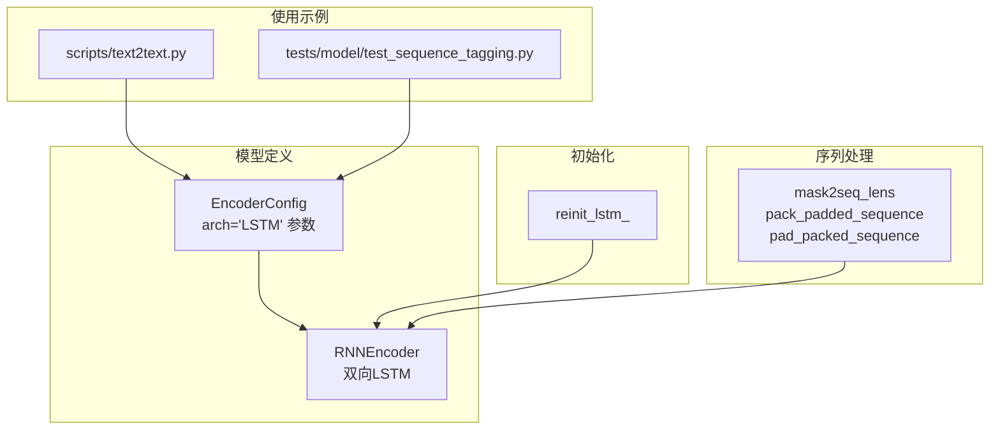
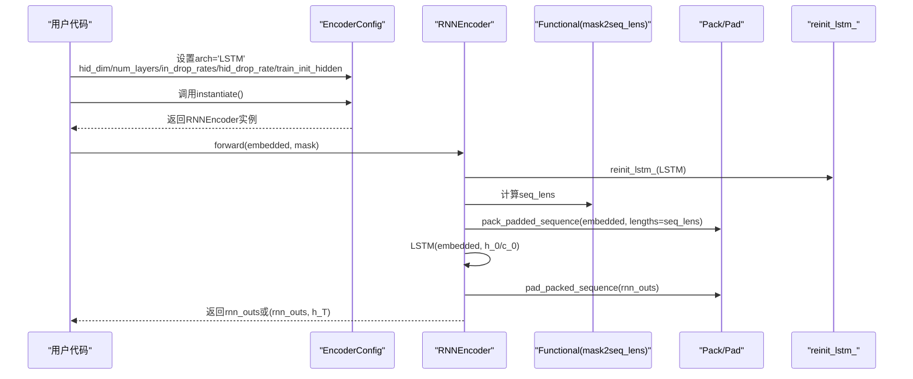
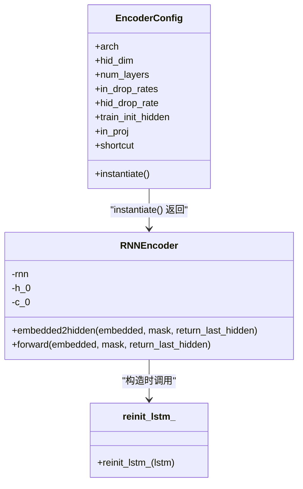
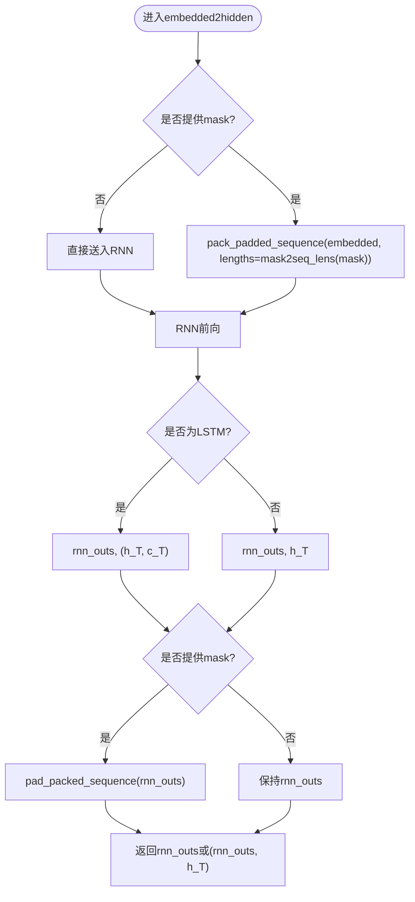
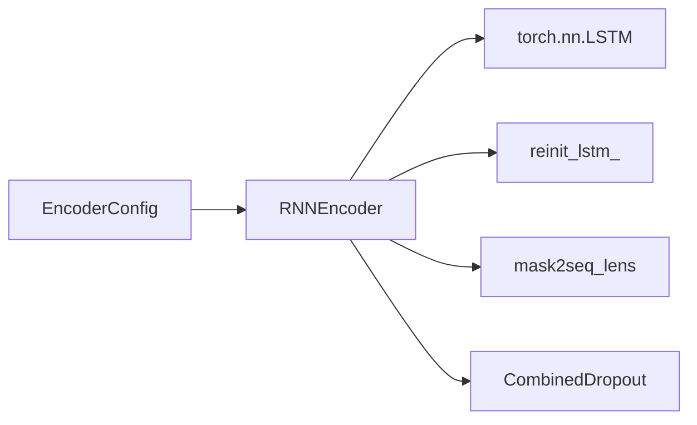

# LSTM编码器

<cite>
**本文引用的文件**
- [eznlp/model/encoder.py](file://eznlp/model/encoder.py)
- [eznlp/nn/init.py](file://eznlp/nn/init.py)
- [eznlp/nn/functional.py](file://eznlp/nn/functional.py)
- [eznlp/config.py](file://eznlp/config.py)
- [scripts/text2text.py](file://scripts/text2text.py)
- [tests/model/test_sequence_tagging.py](file://tests/model/test_sequence_tagging.py)
</cite>

## 目录
1. [简介](#简介)
2. [项目结构](#项目结构)
3. [核心组件](#核心组件)
4. [架构总览](#架构总览)
5. [详细组件分析](#详细组件分析)
6. [依赖分析](#依赖分析)
7. [性能考量](#性能考量)
8. [故障排查指南](#故障排查指南)
9. [结论](#结论)
10. [附录](#附录)

## 简介
本文件系统性地文档化eznlp中的LSTM编码器实现，聚焦于RNNEncoderConfig中arch='LSTM'时的配置参数、双向LSTM的实现机制（含隐藏状态与细胞状态初始化）、embedded2hidden方法中pack_padded_sequence与pad_packed_sequence对变长序列的协同处理、train_init_hidden参数对可训练初始隐藏状态的控制、in_drop_rates与hid_drop_rate在输入嵌入与层间连接中的差异化应用、LSTM输出rnn_outs与h_T的维度结构及后续任务使用场景，以及reinit_lstm_初始化函数对模型性能的影响。

## 项目结构
围绕LSTM编码器的相关代码分布在以下模块：
- 编码器与配置：eznlp/model/encoder.py、eznlp/config.py
- 初始化策略：eznlp/nn/init.py
- 序列长度转换工具：eznlp/nn/functional.py
- 使用示例与脚本：scripts/text2text.py、tests/model/test_sequence_tagging.py

图表来源
- [eznlp/model/encoder.py](file://eznlp/model/encoder.py#L157-L250)
- [eznlp/nn/init.py](file://eznlp/nn/init.py#L114-L143)
- [eznlp/nn/functional.py](file://eznlp/nn/functional.py#L22-L26)
- [scripts/text2text.py](file://scripts/text2text.py#L100-L140)
- [tests/model/test_sequence_tagging.py](file://tests/model/test_sequence_tagging.py#L60-L97)

章节来源
- [eznlp/model/encoder.py](file://eznlp/model/encoder.py#L157-L250)
- [eznlp/nn/init.py](file://eznlp/nn/init.py#L114-L143)
- [eznlp/nn/functional.py](file://eznlp/nn/functional.py#L22-L26)
- [eznlp/config.py](file://eznlp/config.py#L15-L75)
- [scripts/text2text.py](file://scripts/text2text.py#L100-L140)
- [tests/model/test_sequence_tagging.py](file://tests/model/test_sequence_tagging.py#L60-L97)

## 核心组件
- EncoderConfig（RNNEncoderConfig）：定义arch='LSTM'时的关键参数，包括hid_dim、num_layers、in_drop_rates、hid_drop_rate、train_init_hidden等；并提供instantiate将arch映射到RNNEncoder。
- RNNEncoder：基于torch.nn.LSTM实现双向LSTM，支持可训练初始隐藏状态（train_init_hidden），并在embedded2hidden中处理变长序列的pack/pad流程。
- reinit_lstm_：针对LSTM的权重与偏置进行特定初始化，确保forget gate偏置为1，按门控非线性选择合适的Xavier增益。
- mask2seq_lens：将布尔mask转换为有效长度，供pack_padded_sequence与pad_packed_sequence使用。

章节来源
- [eznlp/model/encoder.py](file://eznlp/model/encoder.py#L15-L75)
- [eznlp/model/encoder.py](file://eznlp/model/encoder.py#L157-L250)
- [eznlp/nn/init.py](file://eznlp/nn/init.py#L114-L143)
- [eznlp/nn/functional.py](file://eznlp/nn/functional.py#L22-L26)

## 架构总览
下图展示了从配置到编码器实例化、再到序列处理与初始化的整体流程。

图表来源
- [eznlp/model/encoder.py](file://eznlp/model/encoder.py#L157-L250)
- [eznlp/nn/init.py](file://eznlp/nn/init.py#L114-L143)
- [eznlp/nn/functional.py](file://eznlp/nn/functional.py#L22-L26)

## 详细组件分析

### RNNEncoderConfig（arch='LSTM'）参数与行为
- 关键参数
  - hid_dim：LSTM隐藏维度，RNNEncoder内部以hid_dim//2作为单向LSTM的hidden_size，双向拼接后得到hid_dim的输出维度。
  - num_layers：LSTM层数；当num_layers>1时，dropout应用于除第一层外的中间层（hid_drop_rate）。
  - in_drop_rates：输入嵌入的dropout率元组，分别用于嵌入层前、嵌入层后、FFN/卷积等后续模块（在RNNEncoder中主要体现为嵌入层前的CombinedDropout）。
  - hid_drop_rate：除首层外的层间dropout率（仅当num_layers>1时生效）。
  - train_init_hidden：是否启用可训练的初始隐藏状态（h_0/c_0）。若开启，则为每个样本创建可学习的初始状态。
  - in_proj：是否在forward中对输入做线性投影（与Encoder基类一致）。
  - shortcut：是否在forward中将输入嵌入与编码结果拼接。
- 实例化映射
  - arch='LSTM'时，EncoderConfig.instantiate返回RNNEncoder。

章节来源
- [eznlp/model/encoder.py](file://eznlp/model/encoder.py#L15-L75)
- [eznlp/model/encoder.py](file://eznlp/model/encoder.py#L76-L90)

### 双向LSTM实现机制与初始化
- 结构设置
  - bidirectional=True，batch_first=True，input_size=in_dim，hidden_size=hid_dim//2。
  - 当num_layers>1时，dropout=hid_drop_rate；否则为0。
- 初始状态
  - 若train_init_hidden=True：
    - 创建可训练参数h_0形状为(layers*2, 1, hid_dim//2)，对应双向LSTM的各层初始隐藏状态。
    - 若为LSTM，同时创建可训练参数c_0形状相同，对应细胞状态。
  - 在embedded2hidden中，将h_0/c_0按batch维度扩展为(-1, batch, -1)，传入LSTM。
- 初始化策略
  - RNNEncoder在构造时调用reinit_lstm_对LSTM参数进行重初始化：偏置的forget gate部分初始化为1，其余偏置初始化为0；权重按门控非线性选择对应的Xavier增益。

图表来源
- [eznlp/model/encoder.py](file://eznlp/model/encoder.py#L157-L250)
- [eznlp/nn/init.py](file://eznlp/nn/init.py#L114-L143)

章节来源
- [eznlp/model/encoder.py](file://eznlp/model/encoder.py#L157-L250)
- [eznlp/nn/init.py](file://eznlp/nn/init.py#L114-L143)

### embedded2hidden中的变长序列处理（pack_padded_sequence与pad_packed_sequence）
- 流程
  - 若提供mask，则先将embedded按mask对应的序列长度进行打包（pack_padded_sequence），enforce_sorted=False允许非排序输入。
  - 将打包后的embedded喂给LSTM（或GRU），得到rnn_outs与最终隐藏状态h_T。
  - 若提供mask，则将rnn_outs还原为原batch维度的张量（pad_packed_sequence），填充值为0。
- 作用
  - pack/pad显著提升计算效率：跳过填充位置的计算，减少无效操作。
  - mask2seq_lens将mask转换为有效长度，用于pack与pad。

图表来源
- [eznlp/model/encoder.py](file://eznlp/model/encoder.py#L187-L225)
- [eznlp/nn/functional.py](file://eznlp/nn/functional.py#L22-L26)

章节来源
- [eznlp/model/encoder.py](file://eznlp/model/encoder.py#L187-L225)
- [eznlp/nn/functional.py](file://eznlp/nn/functional.py#L22-L26)

### train_init_hidden参数与可训练初始隐藏状态
- 行为
  - 当train_init_hidden=True时，RNNEncoder在构造阶段创建可训练参数h_0与（当为LSTM时）c_0。
  - 在embedded2hidden中，将这些参数按batch维度扩展后作为初始状态传入RNN。
- 影响
  - 使模型能够从可学习的初始状态开始，可能提升收敛稳定性与泛化能力，尤其在不同批次或跨任务迁移时。
  - 对GRU无效（仅在LSTM分支下创建c_0）。

章节来源
- [eznlp/model/encoder.py](file://eznlp/model/encoder.py#L176-L186)
- [eznlp/model/encoder.py](file://eznlp/model/encoder.py#L193-L200)

### 输入嵌入与层间连接的dropout差异（in_drop_rates与hid_drop_rate）
- in_drop_rates
  - 在Encoder基类中，embedded2hidden接收的embedded会经过CombinedDropout，其参数来源于in_drop_rates。
  - 在RNNEncoder中，该dropout应用于嵌入层后的张量，随后进入RNN。
- hid_drop_rate
  - 当num_layers>1时，RNNEncoder的dropout=hid_drop_rate，应用于除首层外的中间层。
- 差异化应用
  - in_drop_rates主要控制输入嵌入的噪声注入，避免过拟合。
  - hid_drop_rate控制深层之间的信息流动，抑制梯度传播中的冗余特征。

章节来源
- [eznlp/model/encoder.py](file://eznlp/model/encoder.py#L91-L122)
- [eznlp/model/encoder.py](file://eznlp/model/encoder.py#L157-L176)

### LSTM输出维度与后续任务使用
- rnn_outs
  - 维度：(batch, step, hid_dim)，其中hid_dim为双向LSTM拼接后的隐藏维度。
  - 用途：作为序列级表示，常用于下游任务如序列标注、分类等。
- h_T（最终隐藏状态）
  - 维度：(layers*directions, batch, hid_dim/2)。
  - 用途：在某些任务中可作为句子级表示（例如拼接前向最后与后向第一个单元），或用于注意力/解码器初始化。
- shortcut
  - 若启用shortcut，forward会将embedded与编码结果拼接，便于融合多源信息。

章节来源
- [eznlp/model/encoder.py](file://eznlp/model/encoder.py#L209-L225)
- [eznlp/model/encoder.py](file://eznlp/model/encoder.py#L244-L251)

### reinit_lstm_初始化函数对性能的影响
- 初始化策略
  - 偏置：forget gate部分初始化为1，其余偏置初始化为0。
  - 权重：按门控非线性（sigmoid/sigmoid/tanh/sigmoid）选择相应的Xavier增益进行初始化。
- 性能影响
  - 更合理的初始偏置有助于缓解梯度消失，提升深层LSTM的训练稳定性。
  - 按非线性选择增益的权重初始化有利于激活函数的数值稳定，加速收敛。

章节来源
- [eznlp/nn/init.py](file://eznlp/nn/init.py#L114-L143)

### LSTM编码器实例化示例（路径参考）
- 在文本生成脚本中，通过EncoderConfig构建编码器配置，arch='LSTM'，并传入hid_dim、num_layers、in_drop_rates等参数，随后通过instantiate()获取RNNEncoder实例。
- 在序列标注测试中，通过ExtractorConfig嵌套EncoderConfig指定arch='LSTM'，并验证模型可训练性与批一致性。

章节来源
- [scripts/text2text.py](file://scripts/text2text.py#L100-L140)
- [tests/model/test_sequence_tagging.py](file://tests/model/test_sequence_tagging.py#L60-L97)

## 依赖分析
- RNNEncoder依赖
  - torch.nn.LSTM（双向、batch_first、dropout）
  - reinit_lstm_（自定义初始化）
  - mask2seq_lens（序列长度转换）
  - CombinedDropout（输入dropout）
- 配置依赖
  - EncoderConfig提供参数校验与实例化映射。

图表来源
- [eznlp/model/encoder.py](file://eznlp/model/encoder.py#L157-L250)
- [eznlp/nn/init.py](file://eznlp/nn/init.py#L114-L143)
- [eznlp/nn/functional.py](file://eznlp/nn/functional.py#L22-L26)
- [eznlp/config.py](file://eznlp/config.py#L15-L75)

章节来源
- [eznlp/model/encoder.py](file://eznlp/model/encoder.py#L157-L250)
- [eznlp/nn/init.py](file://eznlp/nn/init.py#L114-L143)
- [eznlp/nn/functional.py](file://eznlp/nn/functional.py#L22-L26)
- [eznlp/config.py](file://eznlp/config.py#L15-L75)

## 性能考量
- 变长序列优化：通过pack_padded_sequence与pad_packed_sequence显著减少无效计算，提高吞吐。
- Dropout策略：in_drop_rates与hid_drop_rate分别作用于输入与中间层，平衡正则化强度与表达能力。
- 初始状态学习：train_init_hidden可提升收敛稳定性，但需注意参数量增加与内存占用。
- 初始化质量：reinit_lstm_确保forget gate偏置合理与权重增益匹配非线性，有助于深层训练稳定。

## 故障排查指南
- 变长序列报错
  - 现象：pack/pad流程报错或输出维度不一致。
  - 排查：确认mask与embedded的batch维度一致；检查mask2seq_lens计算是否正确；确保enforce_sorted=False。
- 初始隐藏状态问题
  - 现象：启用train_init_hidden后梯度异常或显存占用异常。
  - 排查：确认h_0/c_0形状与bidirectional设置一致；检查是否在forward中正确扩展至batch维度。
- 初始化相关问题
  - 现象：训练初期不稳定或梯度爆炸/消失。
  - 排查：确认reinit_lstm_已调用；检查hid_dim与num_layers设置是否合理。

章节来源
- [eznlp/model/encoder.py](file://eznlp/model/encoder.py#L187-L225)
- [eznlp/nn/init.py](file://eznlp/nn/init.py#L114-L143)

## 结论
eznlp的LSTM编码器通过RNNEncoder实现了高效的双向LSTM序列建模，结合train_init_hidden、pack/pad序列处理与定制化的reinit_lstm_初始化，在保证计算效率的同时提升了训练稳定性。in_drop_rates与hid_drop_rate的差异化应用进一步增强了模型的正则化效果。rnn_outs与h_T的清晰维度设计使其易于适配多种下游任务。

## 附录
- 使用示例路径参考
  - 文本生成脚本中EncoderConfig的构建与instantiate调用
  - 序列标注测试中ExtractorConfig嵌套EncoderConfig的使用
- 相关工具函数
  - mask2seq_lens用于将mask转换为有效长度，配合pack/pad使用

章节来源
- [scripts/text2text.py](file://scripts/text2text.py#L100-L140)
- [tests/model/test_sequence_tagging.py](file://tests/model/test_sequence_tagging.py#L60-L97)
- [eznlp/nn/functional.py](file://eznlp/nn/functional.py#L22-L26)