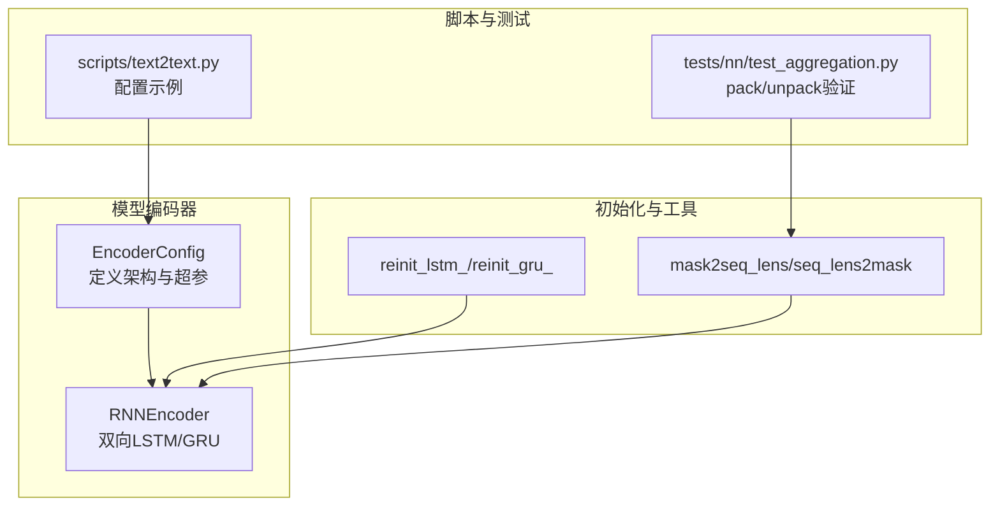
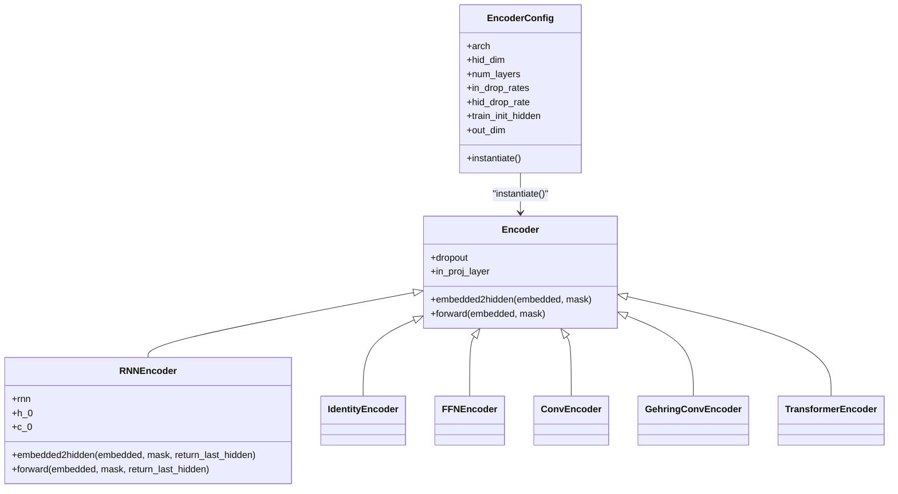
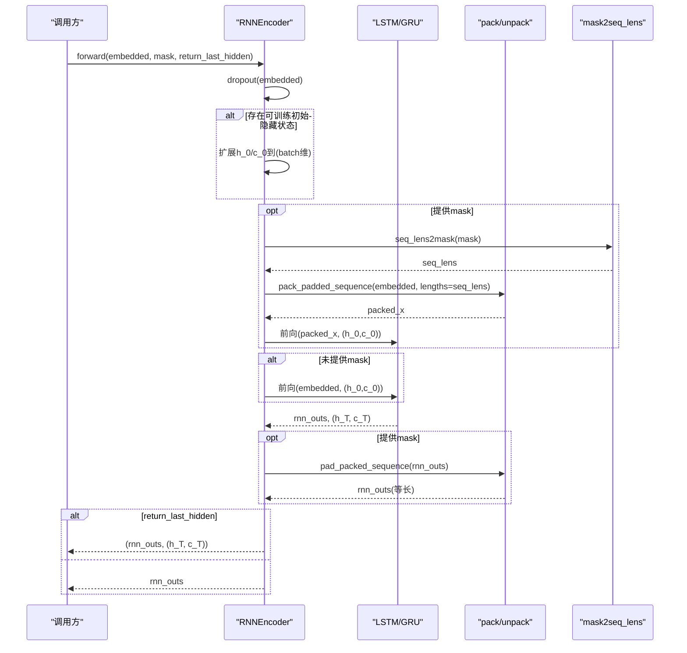
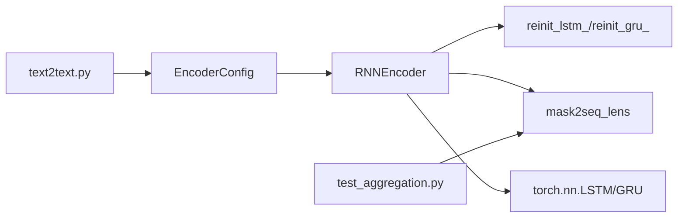

# RNN编码器

<cite>
**本文引用的文件列表**
- [encoder.py](file://eznlp/model/encoder.py)
- [init.py](file://eznlp/nn/init.py)
- [functional.py](file://eznlp/nn/functional.py)
- [test_aggregation.py](file://tests/nn/test_aggregation.py)
- [test_nested_embedder.py](file://tests/model/test_nested_embedder.py)
- [text2text.py](file://scripts/text2text.py)
- [rnn2text.opt](file://scripts/options/rnn2text.opt)
</cite>

## 目录
1. [简介](#简介)
2. [项目结构与定位](#项目结构与定位)
3. [核心组件总览](#核心组件总览)
4. [架构概览](#架构概览)
5. [详细组件解析](#详细组件解析)
6. [依赖关系分析](#依赖关系分析)
7. [性能与实践建议](#性能与实践建议)
8. [故障排查指南](#故障排查指南)
9. [结论](#结论)
10. [附录：配置与用法示例路径](#附录配置与用法示例路径)

## 简介
本文件系统性地文档化 eznlp 中的 RNN 编码器实现，覆盖 LSTM 与 GRU 的双向架构、RNNEncoderConfig（即 EncoderConfig）的关键参数（如 num_layers、hid_dim、train_init_hidden、in_drop_rates、hid_drop_rate）对模型行为的影响；深入解释双向 RNN 的实现方式、隐藏状态的处理流程，以及 packed_padded_sequence 与 pad_packed_sequence 在变长序列处理中的应用；并提供配置多层 LSTM 编码器的示例路径，说明 in_drop_rates 与 hid_drop_rate 在输入层与隐藏层的差异化应用，以及 train_init_hidden 如何实现可训练的初始隐藏状态，reinit_lstm_ 与 reinit_gru_ 初始化函数的作用。

## 项目结构与定位
- RNN 编码器位于模型子模块中，作为通用编码器族的一部分，支持多种架构（Identity、FFN、LSTM、GRU、Conv、Gehring、Transformer）。RNN 实现集中在编码器模块中，配合初始化工具与功能函数完成完整的前向流程。
- 变长序列处理依赖于功能函数提供的 mask2seq_lens 与 seq_lens2mask，以及 PyTorch 的 pack_padded_sequence 与 pad_packed_sequence。

图表来源
- [encoder.py](file://eznlp/model/encoder.py#L14-L90)
- [encoder.py](file://eznlp/model/encoder.py#L158-L252)
- [init.py](file://eznlp/nn/init.py#L114-L169)
- [functional.py](file://eznlp/nn/functional.py#L23-L26)
- [text2text.py](file://scripts/text2text.py#L86-L111)
- [test_aggregation.py](file://tests/nn/test_aggregation.py#L32-L62)

章节来源
- [encoder.py](file://eznlp/model/encoder.py#L14-L90)
- [encoder.py](file://eznlp/model/encoder.py#L158-L252)
- [init.py](file://eznlp/nn/init.py#L114-L169)
- [functional.py](file://eznlp/nn/functional.py#L23-L26)
- [text2text.py](file://scripts/text2text.py#L86-L111)
- [test_aggregation.py](file://tests/nn/test_aggregation.py#L32-L62)

## 核心组件总览
- RNNEncoder：基于双向 LSTM 或 GRU 的序列编码器，默认双向、batch_first，支持可选的可训练初始隐藏状态与可选的投影层与残差连接。
- EncoderConfig：统一的配置对象，负责解析架构类型与超参，计算输出维度，实例化具体编码器。
- 初始化工具 reinit_lstm_ / reinit_gru_：按激活函数特性进行权重与偏置的初始化，满足不同门控机制的数值稳定性需求。
- 功能函数 mask2seq_lens / seq_lens2mask：将掩码与序列长度互转，为 pack/unpack 提供基础。
- pack/unpack 流程：在存在 mask 的情况下，先将输入按真实长度打包，再解包还原为等长张量，确保填充不影响 RNN 计算。

章节来源
- [encoder.py](file://eznlp/model/encoder.py#L14-L90)
- [encoder.py](file://eznlp/model/encoder.py#L158-L252)
- [init.py](file://eznlp/nn/init.py#L114-L169)
- [functional.py](file://eznlp/nn/functional.py#L23-L26)

## 架构概览
下图展示了 RNNEncoder 的类层次与关键方法调用关系，以及与初始化与功能函数的交互。

图表来源
- [encoder.py](file://eznlp/model/encoder.py#L14-L90)
- [encoder.py](file://eznlp/model/encoder.py#L91-L157)
- [encoder.py](file://eznlp/model/encoder.py#L158-L252)

## 详细组件解析

### RNNEncoderConfig（EncoderConfig）参数详解
- arch：选择编码器架构，支持 "LSTM"、"GRU" 等。此处重点关注 LSTM/GRU 的配置分支。
- hid_dim：隐藏维度，RNNEncoder 内部会将其拆分为双向各 half，用于双向 RNN 的输入/隐藏大小。
- num_layers：层数。当层数大于 1 时，RNNEncoder 将在除第一层外的层应用 hid_drop_rate。
- in_drop_rates：三元组，分别控制嵌入 dropout、词级 dropout（WordDropout）与保留实验开关（keep_exp），在 Encoder 基类中统一使用 CombinedDropout 进行组合。
- hid_drop_rate：隐藏层 dropout 比率，仅在 num_layers > 1 时生效。
- train_init_hidden：是否启用可训练的初始隐藏状态。开启后会为每层双向创建可学习的 h_0/c_0 参数。
- shortcut：是否在输出上与输入拼接形成残差连接。

章节来源
- [encoder.py](file://eznlp/model/encoder.py#L14-L90)
- [encoder.py](file://eznlp/model/encoder.py#L91-L157)

### RNNEncoder 双向架构与隐藏状态处理
- 双向设置：RNNEncoder 在构造时将 bidirectional 设为 True，input_size 与 hidden_size 分别来自 config.in_dim 与 config.hid_dim//2。
- 可训练初始隐藏状态：
  - 当 train_init_hidden 为真时，RNNEncoder 会注册可训练参数 h_0（形状为 layers*directions × 1 × hid_dim/2），对于 LSTM 还会注册 c_0。
  - 在 forward/embedded2hidden 中，若存在可训练初始隐藏状态，则将其扩展到与 batch 维度一致后传入 RNN。
- 变长序列处理：
  - 若提供 mask，则先将 embedded 使用 pack_padded_sequence 打包，再送入 RNN；RNN 输出再用 pad_packed_sequence 解包为等长张量，填充值为 0。
  - mask 与序列长度的转换由 mask2seq_lens 完成。
- 返回策略：
  - 默认返回整个序列的隐藏状态；若 return_last_hidden 为真，则同时返回最后一层的隐藏状态（或 LSTM 的 (h_T, c_T)）。

图表来源
- [encoder.py](file://eznlp/model/encoder.py#L158-L252)
- [functional.py](file://eznlp/nn/functional.py#L23-L26)

章节来源
- [encoder.py](file://eznlp/model/encoder.py#L158-L252)
- [functional.py](file://eznlp/nn/functional.py#L23-L26)
- [test_aggregation.py](file://tests/nn/test_aggregation.py#L32-L62)

### 输入层与隐藏层的差异化正则化（in_drop_rates 与 hid_drop_rate）
- 输入层正则化：Encoder 基类在构造时使用 CombinedDropout(*config.in_drop_rates)，对嵌入后的张量进行随机失活，模拟“嵌入层”正则化效果。
- 隐藏层正则化：RNNEncoder 在构造时将 dropout 设置为 0（若层数为 1）或 config.hid_drop_rate（若层数大于 1）。这意味着：
  - 单层 RNN：不额外对隐藏状态施加 dropout；
  - 多层 RNN：除第一层外的其他层应用 hid_drop_rate，以抑制深层过拟合。
- 注意：in_drop_rates 的三个分量在当前编码器实现中由 CombinedDropout 统一处理，具体哪一层对应哪个分量取决于 CombinedDropout 的内部实现；而 hid_drop_rate 明确作用于 RNN 层的隐藏状态。

章节来源
- [encoder.py](file://eznlp/model/encoder.py#L91-L157)
- [encoder.py](file://eznlp/model/encoder.py#L158-L207)

### train_init_hidden 参数与可训练初始隐藏状态
- 当 train_init_hidden 为真时，RNNEncoder 注册可训练参数 h_0（以及 LSTM 的 c_0），其形状为 layers×directions × 1 × hid_dim/2。
- 在前向过程中，这些参数会被扩展到与 batch 维度一致后传入 RNN，从而允许模型从可学习的初始状态开始训练，有助于稳定深层双向 RNN 的收敛。
- 该机制与标准 PyTorch LSTM/GRU 的 h0/c0 接口兼容，但将初始状态显式参数化，使其参与反向传播。

章节来源
- [encoder.py](file://eznlp/model/encoder.py#L177-L186)
- [encoder.py](file://eznlp/model/encoder.py#L193-L200)

### reinit_lstm_ 与 reinit_gru_ 初始化函数
- reinit_lstm_：
  - 对 LSTM 的 bias 进行特殊初始化：将 forget gate 的偏置初始化为 1，其余偏置初始化为 0；对权重按不同门控激活函数（sigmoid/tanh）分别进行 Xavier 初始化，以提升训练稳定性。
- reinit_gru_：
  - 对 GRU 的 bias 初始化为 0；对权重按更新门与候选门的激活函数（sigmoid/tanh）分别进行 Xavier 初始化。
- 这些初始化函数在 RNNEncoder 构造时被调用，确保 LSTM/GRU 的门控机制具有合理的起始状态。

章节来源
- [init.py](file://eznlp/nn/init.py#L114-L169)
- [encoder.py](file://eznlp/model/encoder.py#L170-L176)

### 变长序列处理：pack_padded_sequence 与 pad_packed_sequence
- pack/unpack 流程：
  - 若提供 mask，则将输入按真实长度打包，避免填充对 RNN 的影响；
  - RNN 输出后再解包为等长张量，填充值为 0，便于后续池化或拼接操作。
- mask 与长度互转：
  - mask2seq_lens 将布尔掩码转换为有效长度向量；
  - seq_lens2mask 将长度向量转换为掩码，用于后续池化等场景。
- 测试验证：
  - 测试用例展示了在双向 LSTM 上，使用 pack/unpack 后的最后隐藏状态与通过池化选取的“RNN 最后隐藏状态”一致，验证了流程正确性。

章节来源
- [encoder.py](file://eznlp/model/encoder.py#L201-L219)
- [functional.py](file://eznlp/nn/functional.py#L23-L26)
- [test_aggregation.py](file://tests/nn/test_aggregation.py#L32-L62)

### 配置多层 LSTM 编码器的示例路径
- 在文本到文本任务脚本中，通过 EncoderConfig 指定 arch="LSTM"、hid_dim、num_layers、in_drop_rates 等参数，随后实例化编码器。
- 示例路径：
  - [scripts/text2text.py](file://scripts/text2text.py#L86-L111)
  - [scripts/options/rnn2text.opt](file://scripts/options/rnn2text.opt#L1-L14)

章节来源
- [text2text.py](file://scripts/text2text.py#L86-L111)
- [rnn2text.opt](file://scripts/options/rnn2text.opt#L1-L14)

## 依赖关系分析
- RNNEncoder 依赖：
  - 初始化工具 reinit_lstm_ / reinit_gru_：在构造时对 LSTM/GRU 参数进行初始化。
  - 功能函数 mask2seq_lens：将掩码转换为长度，供 pack_padded_sequence 使用。
  - PyTorch RNN 模块：torch.nn.LSTM 或 torch.nn.GRU。
- EncoderConfig 依赖：
  - 统一解析架构与超参，决定 RNNEncoder 的层数、隐藏维度、dropout 策略与可训练初始隐藏状态。
- 测试与脚本：
  - 测试用例验证 pack/unpack 与池化选取的正确性；
  - 脚本演示如何在实际任务中配置 RNNEncoder。

图表来源
- [encoder.py](file://eznlp/model/encoder.py#L158-L252)
- [init.py](file://eznlp/nn/init.py#L114-L169)
- [functional.py](file://eznlp/nn/functional.py#L23-L26)
- [test_aggregation.py](file://tests/nn/test_aggregation.py#L32-L62)
- [text2text.py](file://scripts/text2text.py#L86-L111)

章节来源
- [encoder.py](file://eznlp/model/encoder.py#L158-L252)
- [init.py](file://eznlp/nn/init.py#L114-L169)
- [functional.py](file://eznlp/nn/functional.py#L23-L26)
- [test_aggregation.py](file://tests/nn/test_aggregation.py#L32-L62)
- [text2text.py](file://scripts/text2text.py#L86-L111)

## 性能与实践建议
- 双向 RNN 的隐藏维度需为偶数（hid_dim//2 用于双向），否则在拼接时会报错；请确保 hid_dim 能被 2 整除。
- 多层 RNN 的隐藏层 dropout 仅在层数大于 1 时生效，单层 RNN 不额外施加隐藏层 dropout。
- 可训练初始隐藏状态会增加少量可学习参数，通常有利于深层双向 RNN 的收敛，但也会略微增加内存占用。
- 变长序列处理中，mask 必须与输入张量的步长一致；mask2seq_lens 与 seq_lens2mask 的互逆关系是 pack/unpack 正确性的关键。
- 在使用 pack/unpack 时，确保 enforce_sorted=False（或排序一致），以避免排序错误导致的异常。

[本节为通用建议，不直接分析具体文件]

## 故障排查指南
- 报错“隐藏维度必须为偶数”：检查 EncoderConfig.hid_dim 是否为偶数。
- 变长序列报错：确认 mask 与 embedded 的步长一致；检查 mask2seq_lens 的输出是否与输入长度一致。
- pack/unpack 报错：检查 lengths 是否与 mask2seq_lens 的输出一致；确保 enforce_sorted=False 或输入已排序。
- 初始隐藏状态相关问题：若启用 train_init_hidden，请确认 h_0/c_0 的形状与层数、方向数一致；在 batch 维度扩展时注意保持与 batch 一致。

章节来源
- [encoder.py](file://eznlp/model/encoder.py#L158-L252)
- [functional.py](file://eznlp/nn/functional.py#L23-L26)
- [test_aggregation.py](file://tests/nn/test_aggregation.py#L32-L62)

## 结论
eznlp 的 RNNEncoder 以简洁而稳健的方式实现了双向 LSTM/GRU 编码器，支持可训练初始隐藏状态、灵活的正则化策略与完善的变长序列处理流程。通过 EncoderConfig 的集中配置与初始化工具的配合，用户可以方便地构建多层 LSTM 编码器，并在不同任务中获得稳定的性能表现。

[本节为总结性内容，不直接分析具体文件]

## 附录：配置与用法示例路径
- 在文本到文本任务中配置 RNNEncoder 的示例：
  - [scripts/text2text.py](file://scripts/text2text.py#L86-L111)
  - [scripts/options/rnn2text.opt](file://scripts/options/rnn2text.opt#L1-L14)
- 在嵌入器测试中使用 LSTM/GRU 字符编码器的示例：
  - [tests/model/test_nested_embedder.py](file://tests/model/test_nested_embedder.py#L31-L40)
- 变长序列处理与隐藏状态选取的测试验证：
  - [tests/nn/test_aggregation.py](file://tests/nn/test_aggregation.py#L32-L62)

章节来源
- [text2text.py](file://scripts/text2text.py#L86-L111)
- [rnn2text.opt](file://scripts/options/rnn2text.opt#L1-L14)
- [test_nested_embedder.py](file://tests/model/test_nested_embedder.py#L31-L40)
- [test_aggregation.py](file://tests/nn/test_aggregation.py#L32-L62)