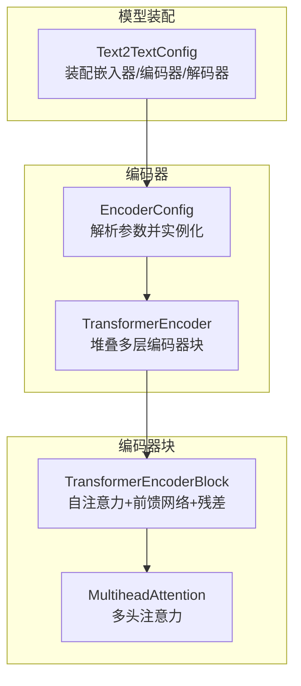
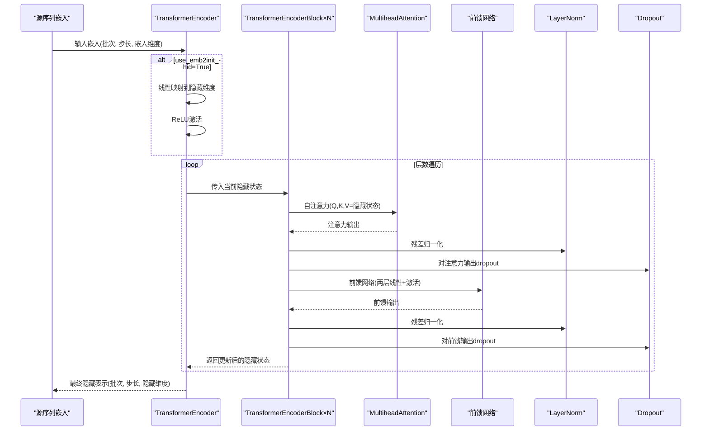
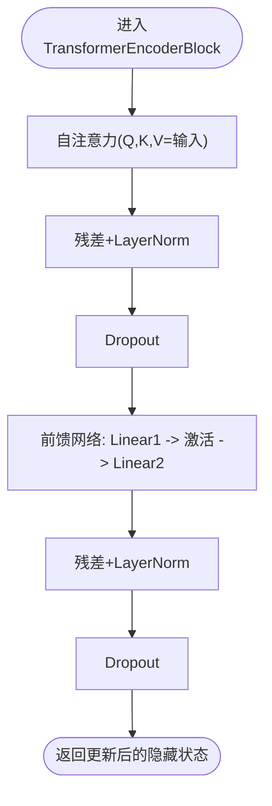
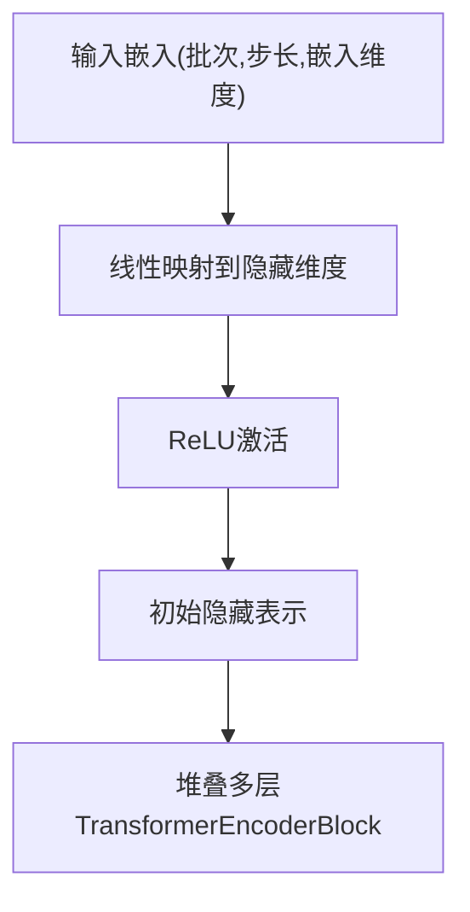
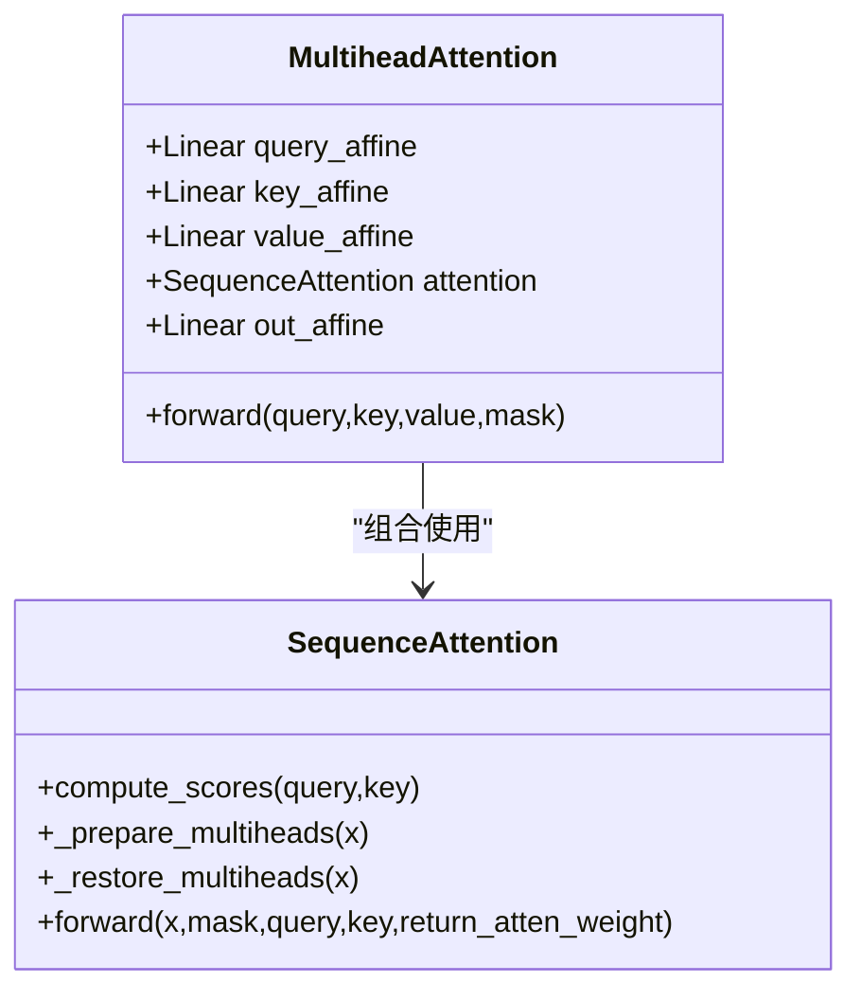
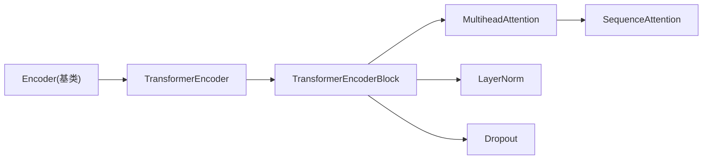

# Transformer编码器

<cite>
**本文引用的文件**
- [encoder.py](file://eznlp/model/encoder.py)
- [block.py](file://eznlp/nn/modules/block.py)
- [attention.py](file://eznlp/nn/modules/attention.py)
- [text2text.py](file://eznlp/model/model/text2text.py)
- [test_text2text.py](file://tests/model/test_text2text.py)
- [text2text.py](file://scripts/text2text.py)
</cite>

## 目录
1. [引言](#引言)
2. [项目结构](#项目结构)
3. [核心组件](#核心组件)
4. [架构总览](#架构总览)
5. [详细组件分析](#详细组件分析)
6. [依赖关系分析](#依赖关系分析)
7. [性能考量](#性能考量)
8. [故障排查指南](#故障排查指南)
9. [结论](#结论)
10. [附录](#附录)

## 引言
本文件系统化地文档化了eznlp中的TransformerEncoder实现，严格遵循Vaswani等（2017）的架构设计。重点解释以下方面：
- TransformerEncoderConfig中关键参数：num_heads、ff_dim、use_emb2init_hid的作用与影响
- TransformerEncoderBlock的堆叠方式与残差连接机制
- use_emb2init_hid通过线性变换与ReLU激活将输入维度映射到隐藏维度的设计动机与非线性增强效果
- 如何构建包含8个注意力头与256维前馈网络的3层Transformer编码器，并解释不同层间dropout率的配置策略

## 项目结构
与Transformer编码器直接相关的代码主要分布在以下模块：
- 编码器配置与实例化：model/encoder.py
- Transformer编码器块与注意力子模块：nn/modules/block.py、nn/modules/attention.py
- 模型装配与使用示例：model/model/text2text.py、scripts/text2text.py、tests/model/test_text2text.py

图表来源
- [text2text.py](file://eznlp/model/model/text2text.py#L1-L83)
- [encoder.py](file://eznlp/model/encoder.py#L15-L90)
- [encoder.py](file://eznlp/model/encoder.py#L329-L375)
- [block.py](file://eznlp/nn/modules/block.py#L104-L151)
- [attention.py](file://eznlp/nn/modules/attention.py#L235-L297)

章节来源
- [encoder.py](file://eznlp/model/encoder.py#L15-L90)
- [encoder.py](file://eznlp/model/encoder.py#L329-L375)
- [block.py](file://eznlp/nn/modules/block.py#L104-L151)
- [attention.py](file://eznlp/nn/modules/attention.py#L235-L297)
- [text2text.py](file://eznlp/model/model/text2text.py#L1-L83)

## 核心组件
- TransformerEncoderConfig（由EncoderConfig在arch为“transformer”时提供）
  - 关键参数
    - num_heads：注意力头数，决定多头注意力的并行度与表示子空间划分
    - ff_dim：前馈网络中间维度，控制非线性映射的容量
    - use_emb2init_hid：是否对输入嵌入进行线性映射到隐藏维度，并经ReLU激活
    - num_layers：编码器层数，决定堆叠深度
    - in_drop_rates、hid_drop_rate：输入与隐藏状态的dropout率
- TransformerEncoder（继承自Encoder）
  - 在use_emb2init_hid为True时，通过线性层+ReLU将输入维度映射到隐藏维度；否则要求输入维度等于隐藏维度
  - 堆叠num_layers个TransformerEncoderBlock，每层内部包含自注意力与前馈网络，并在各处应用残差连接与LayerNorm
- TransformerEncoderBlock
  - 自注意力子层：MultiheadAttention + LayerNorm + 残差
  - 前馈网络子层：两层线性层+激活+Dropout + LayerNorm + 残差
  - 每个子层均在输入与注意力/FFN输出上分别施加dropout

章节来源
- [encoder.py](file://eznlp/model/encoder.py#L47-L53)
- [encoder.py](file://eznlp/model/encoder.py#L329-L375)
- [block.py](file://eznlp/nn/modules/block.py#L104-L151)

## 架构总览
下图展示了从文本到编码器隐藏表示的整体数据流，以及TransformerEncoder的堆叠与残差连接。

图表来源
- [encoder.py](file://eznlp/model/encoder.py#L329-L375)
- [block.py](file://eznlp/nn/modules/block.py#L104-L151)
- [attention.py](file://eznlp/nn/modules/attention.py#L235-L297)

## 详细组件分析

### 参数作用与配置策略
- num_heads
  - 影响多头注意力的并行计算单元数量，提升模型对不同子空间的建模能力
  - 该值必须能整除隐藏维度hid_dim，以便每个头有相等的特征维度
- ff_dim
  - 控制前馈网络中间层的宽度，通常取256或更高以增强非线性表达
  - 与hid_dim共同决定前馈子层的参数规模
- use_emb2init_hid
  - 当为True时，对输入嵌入执行线性变换并经ReLU激活，将输入维度映射到隐藏维度
  - 设计动机：使输入维度与隐藏维度解耦，便于处理不同来源的嵌入（如词向量维度与模型隐藏维度不一致），并通过ReLU引入非线性
  - 当为False时，强制要求输入维度等于隐藏维度，避免额外映射开销
- num_layers
  - 决定编码器堆叠深度，更深的堆叠可捕获更复杂的上下文依赖，但也会增加计算与内存开销
- in_drop_rates与hid_drop_rate
  - in_drop_rates用于输入嵌入阶段的dropout组合（CombinedDropout），第一项通常为0以保持输入信息完整性
  - hid_drop_rate用于隐藏状态与子层内部的dropout，逐层可能采用不同的比率以平衡正则化强度与训练稳定性

章节来源
- [encoder.py](file://eznlp/model/encoder.py#L47-L53)
- [encoder.py](file://eznlp/model/encoder.py#L329-L375)
- [block.py](file://eznlp/nn/modules/block.py#L104-L151)

### TransformerEncoderBlock堆叠与残差连接
- 结构组成
  - 自注意力子层：MultiheadAttention + LayerNorm + 残差
  - 前馈网络子层：两层线性层（ff1→激活→ff2）+ Dropout + LayerNorm + 残差
- 残差路径
  - 每个子层的输入与其输出相加，随后经过LayerNorm与Dropout，有助于梯度稳定与深层网络训练
- 堆叠方式
  - 通过ModuleList按顺序堆叠num_layers个TransformerEncoderBlock
  - 每一层的dropout率策略：首层（当未使用use_emb2init_hid时）可能不施加dropout，其余层使用hid_drop_rate，以降低首层过拟合风险并逐步引入正则化

图表来源
- [block.py](file://eznlp/nn/modules/block.py#L104-L151)

章节来源
- [block.py](file://eznlp/nn/modules/block.py#L104-L151)

### use_emb2init_hid的线性变换与ReLU激活
- 实现位置
  - 当use_emb2init_hid为True时，TransformerEncoder在初始化阶段添加一个线性层与ReLU激活，并对线性层进行特定初始化
  - 前向传播中，输入嵌入先经线性层再经ReLU，得到初始隐藏表示
- 设计意义
  - 将输入嵌入维度与隐藏维度解耦，允许输入来自不同来源（如one-hot或预训练词向量），隐藏维度统一为模型内部表示
  - ReLU引入非线性，有助于模型学习更丰富的特征表示
- 初始化策略
  - 线性层权重采用针对ReLU的Kaiming均匀初始化，偏置置零，保证训练初期梯度稳定

图表来源
- [encoder.py](file://eznlp/model/encoder.py#L329-L375)

章节来源
- [encoder.py](file://eznlp/model/encoder.py#L329-L375)

### 多头注意力与评分机制
- MultiheadAttention
  - 分别对查询、键、值进行仿射投影，然后在多头维度上拆分，分别计算注意力，最后拼接并线性变换输出
  - 支持多种评分方式（scaled_dot、additive等），默认使用scaled_dot
- SequenceAttention
  - 负责计算注意力分数、掩码与softmax，支持外部/内部查询模式
  - 多头维度上的准备与恢复确保并行计算与维度一致性

图表来源
- [attention.py](file://eznlp/nn/modules/attention.py#L235-L297)
- [attention.py](file://eznlp/nn/modules/attention.py#L10-L234)

章节来源
- [attention.py](file://eznlp/nn/modules/attention.py#L235-L297)
- [attention.py](file://eznlp/nn/modules/attention.py#L10-L234)

### 代码示例：构建3层Transformer编码器（8头、256维FFN）
以下示例展示如何在Text2Text装配中配置并构建包含8个注意力头与256维前馈网络的3层Transformer编码器，并解释不同层间dropout率的配置策略。

- 配置要点
  - 使用EncoderConfig，arch设为“Transformer”
  - 设置num_heads=8、ff_dim=256、num_layers=3
  - 可选：use_emb2init_hid=True以启用输入到隐藏维度的线性映射与ReLU
  - dropout策略：in_drop_rates的第一项通常为0，第二项为0.05（若使用锁定dropout），第三项为全局dropout；hid_drop_rate为0.1，逐层使用该值（首层在未使用use_emb2init_hid时可能不施加dropout）

- 示例路径
  - 文本到文本装配配置：[text2text.py](file://eznlp/model/model/text2text.py#L1-L83)
  - 测试用例中对Transformer的参数化验证：[test_text2text.py](file://tests/model/test_text2text.py#L73-L109)
  - 训练脚本中对ff_dim与num_layers的参数定义：[text2text.py](file://scripts/text2text.py#L87-L130)

章节来源
- [text2text.py](file://eznlp/model/model/text2text.py#L1-L83)
- [test_text2text.py](file://tests/model/test_text2text.py#L73-L109)
- [text2text.py](file://scripts/text2text.py#L87-L130)

## 依赖关系分析
- 组件耦合
  - TransformerEncoder依赖于Encoder基类提供的dropout与可选的in_proj层
  - TransformerEncoderBlock依赖MultiheadAttention与LayerNorm，内部包含两层线性前馈网络
  - MultiheadAttention进一步依赖SequenceAttention完成注意力计算
- 外部依赖
  - 初始化工具reinit_layer_用于权重初始化
  - CombinedDropout用于输入阶段的dropout组合

图表来源
- [encoder.py](file://eznlp/model/encoder.py#L91-L121)
- [encoder.py](file://eznlp/model/encoder.py#L329-L375)
- [block.py](file://eznlp/nn/modules/block.py#L104-L151)
- [attention.py](file://eznlp/nn/modules/attention.py#L235-L297)

章节来源
- [encoder.py](file://eznlp/model/encoder.py#L91-L121)
- [encoder.py](file://eznlp/model/encoder.py#L329-L375)
- [block.py](file://eznlp/nn/modules/block.py#L104-L151)
- [attention.py](file://eznlp/nn/modules/attention.py#L235-L297)

## 性能考量
- 计算复杂度
  - 多头注意力的复杂度与num_heads、序列长度成比例，建议在长序列场景下谨慎选择num_heads
  - 前馈网络的复杂度与ff_dim成比例，增大ff_dim可提升表达能力但增加计算成本
- 内存占用
  - num_layers与hid_dim共同决定模型参数规模，应结合硬件资源合理设置
- 正则化
  - hid_drop_rate逐层使用，有助于缓解过拟合；in_drop_rates的第一项为0可保留输入信息完整性
- 训练稳定性
  - LayerNorm与残差连接有助于深层网络训练稳定
  - use_emb2init_hid引入ReLU非线性，可能提升表征能力，但需注意初始化与数值稳定性

## 故障排查指南
- 输入维度不匹配
  - 若use_emb2init_hid=False，需确保输入嵌入维度等于隐藏维度，否则会触发断言错误
- 多头维度不整除
  - num_heads必须能整除hid_dim，否则在MultiheadAttention中会抛出断言异常
- 掩码形状不正确
  - 注意力掩码应为二维或三维张量，且与序列长度一致；掩码维度不匹配会导致softmax失败
- 过拟合与欠拟合
  - hid_drop_rate过低可能导致过拟合；过高可能导致欠拟合。可根据验证集表现调整
- 初始化问题
  - 确保线性层与注意力层权重已正确初始化，避免训练初期梯度消失或爆炸

章节来源
- [encoder.py](file://eznlp/model/encoder.py#L329-L375)
- [attention.py](file://eznlp/nn/modules/attention.py#L133-L154)
- [attention.py](file://eznlp/nn/modules/attention.py#L193-L207)

## 结论
eznlp的TransformerEncoder实现了Vaswani等（2017）的核心思想：多头注意力、前馈网络、残差连接与LayerNorm。通过use_emb2init_hid，模型能够灵活地将输入嵌入映射到隐藏维度并引入ReLU非线性，从而增强表达能力。配置层面，num_heads、ff_dim、num_layers与dropout策略共同决定了模型的容量、正则化强度与训练稳定性。在实践中，建议根据下游任务与数据规模合理设置这些超参数，并结合验证集监控过拟合与收敛情况。

## 附录
- 相关示例与测试
  - 文本到文本装配与参数化测试：[test_text2text.py](file://tests/model/test_text2text.py#L73-L109)
  - 训练脚本中的ff_dim与num_layers参数：[text2text.py](file://scripts/text2text.py#L87-L130)