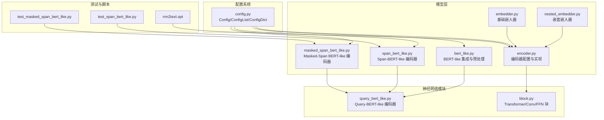
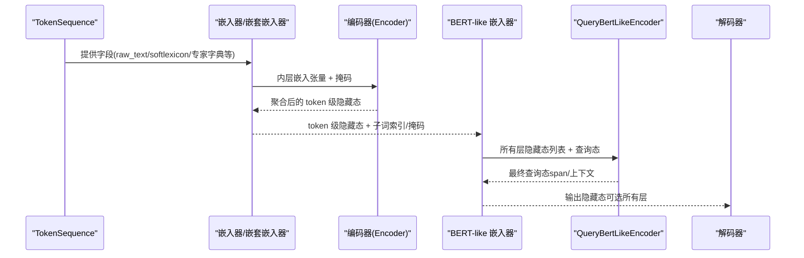
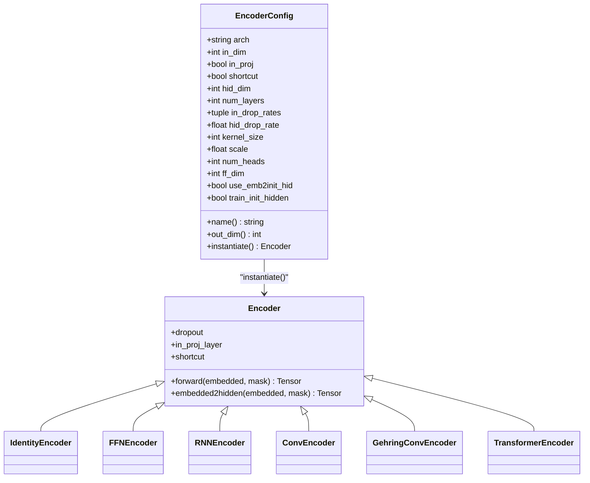
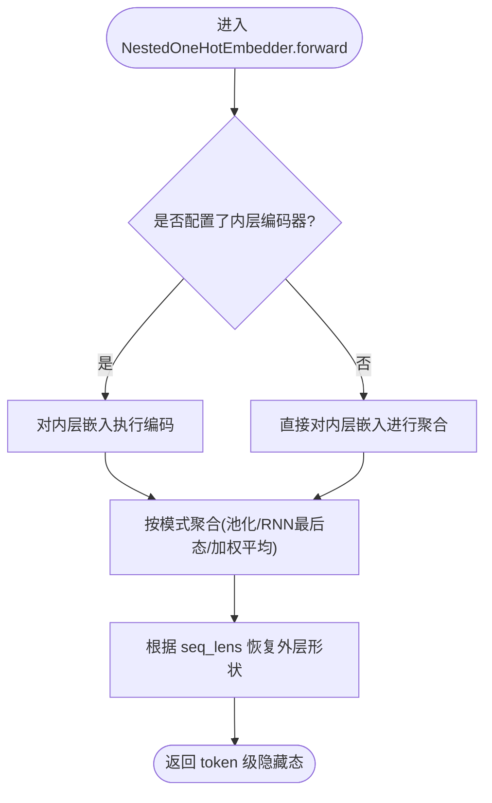
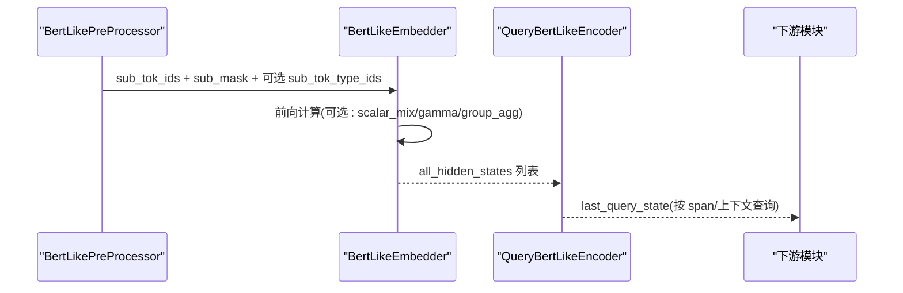
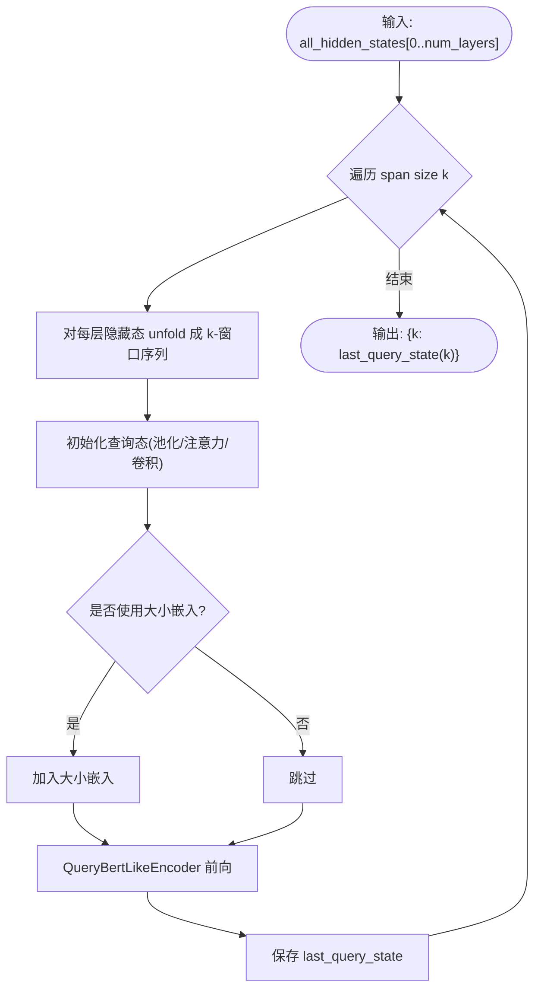
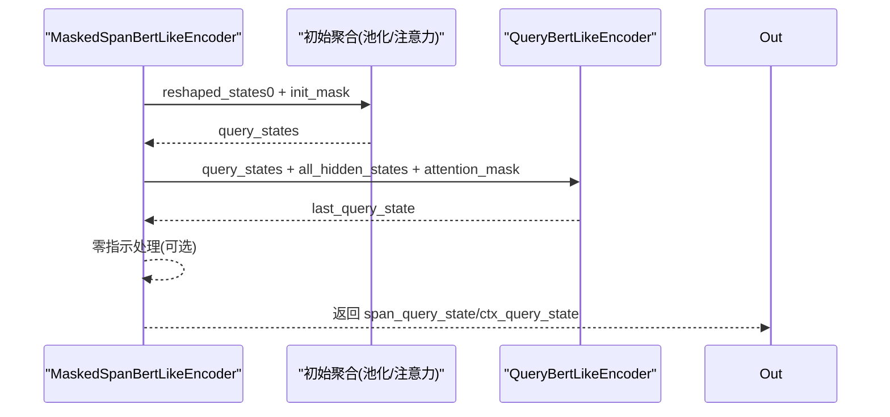
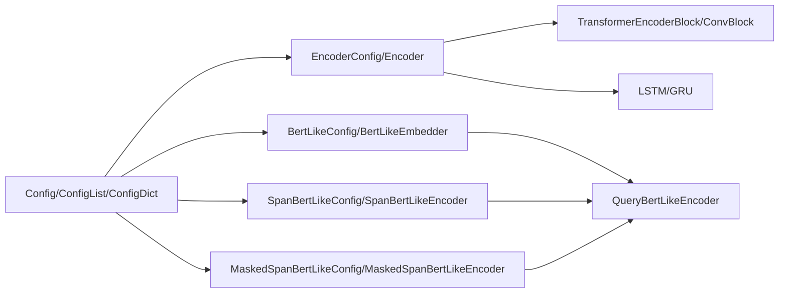

# 编码器

<cite>
**本文引用的文件**
- [encoder.py](file://eznlp/model/encoder.py)
- [bert_like.py](file://eznlp/model/bert_like.py)
- [span_bert_like.py](file://eznlp/model/span_bert_like.py)
- [masked_span_bert_like.py](file://eznlp/model/masked_span_bert_like.py)
- [nested_embedder.py](file://eznlp/model/nested_embedder.py)
- [embedder.py](file://eznlp/model/embedder.py)
- [query_bert_like.py](file://eznlp/nn/modules/query_bert_like.py)
- [block.py](file://eznlp/nn/modules/block.py)
- [config.py](file://eznlp/config.py)
- [test_span_bert_like.py](file://tests/model/test_span_bert_like.py)
- [test_masked_span_bert_like.py](file://tests/model/test_masked_span_bert_like.py)
- [rnn2text.opt](file://scripts/options/rnn2text.opt)
</cite>

## 目录
1. [简介](#简介)
2. [项目结构](#项目结构)
3. [核心组件](#核心组件)
4. [架构总览](#架构总览)
5. [详细组件分析](#详细组件分析)
6. [依赖关系分析](#依赖关系分析)
7. [性能考量](#性能考量)
8. [故障排查指南](#故障排查指南)
9. [结论](#结论)
10. [附录](#附录)

## 简介
本文件系统性地文档化 eznlp 的编码器体系，覆盖 LSTM、Transformer 和 BERT-like 等编码器的实现与配置要点。重点阐述：
- intermediate1 与 intermediate2 在特征提取流程中的角色与数据流；
- 如何通过配置文件定义编码器架构（如 LSTM 层数、隐藏维度）；
- BERT-like 编码器如何集成 Hugging Face transformers 库，并支持从“预分词文本”输入；
- 多层编码器堆叠结构的构建方式；
- 编码器输出的隐藏状态如何传递给下游解码器。

## 项目结构
编码器相关代码主要分布在以下模块：
- 模型层：编码器配置与实现、BERT-like 集成、嵌入器与嵌套嵌入器；
- 神经网络模块：Transformer 块、卷积块、注意力与聚合模块；
- 配置系统：通用 Config 抽象与组合容器；
- 测试与脚本：验证 BERT-like 编码器行为与训练选项示例。

图表来源
- [encoder.py](file://eznlp/model/encoder.py#L1-L375)
- [bert_like.py](file://eznlp/model/bert_like.py#L1-L200)
- [span_bert_like.py](file://eznlp/model/span_bert_like.py#L1-L181)
- [masked_span_bert_like.py](file://eznlp/model/masked_span_bert_like.py#L1-L236)
- [nested_embedder.py](file://eznlp/model/nested_embedder.py#L1-L309)
- [embedder.py](file://eznlp/model/embedder.py#L1-L248)
- [query_bert_like.py](file://eznlp/nn/modules/query_bert_like.py#L1-L330)
- [block.py](file://eznlp/nn/modules/block.py#L1-L263)
- [config.py](file://eznlp/config.py#L1-L173)
- [test_span_bert_like.py](file://tests/model/test_span_bert_like.py#L1-L86)
- [test_masked_span_bert_like.py](file://tests/model/test_masked_span_bert_like.py#L1-L121)
- [rnn2text.opt](file://scripts/options/rnn2text.opt#L1-L15)

章节来源
- [encoder.py](file://eznlp/model/encoder.py#L1-L375)
- [bert_like.py](file://eznlp/model/bert_like.py#L1-L200)
- [config.py](file://eznlp/config.py#L1-L173)

## 核心组件
- 编码器配置与实现（EncoderConfig/Encoder 及其子类）
  - 支持 identity、FFN、LSTM/GRU、Conv/Gehring、Transformer 等架构；
  - 统一的 out_dim 计算与 shortcut 连接；
  - 通过 in_proj 与 CombinedDropout 控制输入投影与丢弃率。
- BERT-like 集成（BertLikeConfig/BertLikeEmbedder）
  - 基于 transformers 的 PreTrainedModel/Tokenizer；
  - 支持 from_tokenized/from_subtokenized 输入模式；
  - 支持混合层（trainable/top/average）、可选 gamma 缩放；
  - 提供预处理工具（truecase、截断、分句、子词对齐）。
- Span-BERT-like 与 Masked-Span BERT-like（SpanBertLikeConfig/MaskedSpanBertLikeConfig）
  - 使用 QueryBertLikeEncoder 替代标准自注意力，以查询态驱动多层隐藏态；
  - 支持按 span size 共享或独立权重；
  - 支持基于掩码的上下文查询（如 chunk 到 token 掩码、pair 到 token 掩码）。
- 嵌套嵌入器（NestedOneHotConfig/NestedOneHotEmbedder）
  - 将内层序列（如字符、软词典）经嵌入后送入 Encoder，再聚合到外层 token 级别；
  - 支持多种聚合模式（池化、RNN 最终态、加权平均等）。

章节来源
- [encoder.py](file://eznlp/model/encoder.py#L1-L375)
- [bert_like.py](file://eznlp/model/bert_like.py#L95-L269)
- [span_bert_like.py](file://eznlp/model/span_bert_like.py#L1-L181)
- [masked_span_bert_like.py](file://eznlp/model/masked_span_bert_like.py#L1-L236)
- [nested_embedder.py](file://eznlp/model/nested_embedder.py#L1-L309)

## 架构总览
下图展示了从嵌入到编码再到 BERT-like 查询编码的整体流程，以及嵌套嵌入器如何将内层序列编码并聚合为 token 级表示。

图表来源
- [nested_embedder.py](file://eznlp/model/nested_embedder.py#L99-L150)
- [encoder.py](file://eznlp/model/encoder.py#L91-L121)
- [bert_like.py](file://eznlp/model/bert_like.py#L274-L359)
- [query_bert_like.py](file://eznlp/nn/modules/query_bert_like.py#L234-L330)

## 详细组件分析

### 编码器配置与实现（EncoderConfig/Encoder）
- 支持的架构与关键参数
  - identity：直接返回输入，适合旁路或调试；
  - ffn：全连接前馈网络，支持多层；
  - lstm/gru：双向 RNN，支持可学习初始隐状态；
  - conv/gehring：卷积序列编码，Gehring 使用 GLU 残差；
  - transformer：多头自注意力 + 前馈，支持 emb2init_hid 初始化。
- 输出维度与快捷连接
  - out_dim 根据架构选择 in_dim 或 hid_dim；
  - shortcut=True 时将隐藏态与输入拼接，提升表达能力。
- 输入投影与丢弃
  - in_proj 将输入映射到相同维度；
  - CombinedDropout 分三段控制输入、隐藏与层间丢弃率。

图表来源
- [encoder.py](file://eznlp/model/encoder.py#L15-L121)
- [encoder.py](file://eznlp/model/encoder.py#L123-L375)

章节来源
- [encoder.py](file://eznlp/model/encoder.py#L15-L121)
- [encoder.py](file://eznlp/model/encoder.py#L123-L375)

### 嵌套嵌入器（NestedOneHotConfig/NestedOneHotEmbedder）
- 设计目标
  - 处理具有“步长×通道×内步长”的结构化特征（如字符、软词典、专家字典）；
  - 单词级 token 的每个位置可能包含一个或多个序列，共享同一词表与嵌入层。
- 关键点
  - encoder 参数可为空，此时直接聚合嵌入；
  - 支持多种聚合模式（均值/最大/门控池化、RNN 最终态等）；
  - 通过 seq_lens 恢复外层形状，得到 token 级表示。
- 与编码器的衔接
  - 若配置了 encoder，则先对内层序列进行编码，再聚合；
  - 否则仅对内层嵌入进行聚合。

图表来源
- [nested_embedder.py](file://eznlp/model/nested_embedder.py#L99-L150)

章节来源
- [nested_embedder.py](file://eznlp/model/nested_embedder.py#L15-L98)
- [nested_embedder.py](file://eznlp/model/nested_embedder.py#L99-L150)

### BERT-like 集成（BertLikeConfig/BertLikeEmbedder）
- 输入模式
  - from_tokenized=True：输入为已分词的 token 列表；
  - from_subtokenized=True：输入为子词列表（跳过额外分词）；
  - paired_inputs 支持双句子输入（如句子对任务）。
- 预处理与对齐
  - truecase、截断、分句、子词对齐（ori2sub_idx/sub2ori_idx）；
  - 支持按 group_agg_mode 对子词聚合回 token 级表示。
- 特征融合
  - mix_layers 支持 top、average、trainable 三种策略；
  - use_gamma 可学习缩放因子；
  - output_hidden_states 可返回所有层隐藏态。
- 与 QueryBertLikeEncoder 的配合
  - BertLikeEmbedder 输出的 hidden_states 列表作为 QueryBertLikeEncoder 的 key/value；
  - 通过 attention_mask 控制可见范围。

图表来源
- [bert_like.py](file://eznlp/model/bert_like.py#L274-L359)
- [bert_like.py](file://eznlp/model/bert_like.py#L361-L717)
- [query_bert_like.py](file://eznlp/nn/modules/query_bert_like.py#L234-L330)

章节来源
- [bert_like.py](file://eznlp/model/bert_like.py#L95-L269)
- [bert_like.py](file://eznlp/model/bert_like.py#L274-L359)
- [bert_like.py](file://eznlp/model/bert_like.py#L361-L717)

### Span-BERT-like 编码器（SpanBertLikeConfig/SpanBertLikeEncoder）
- 功能概述
  - 对每个 span size（k）生成查询态，使用 QueryBertLikeEncoder；
  - 支持按 span size 共享或独立权重；
  - 支持初始化嵌入（如大小嵌入）与不同初始化聚合方式（池化/注意力/卷积）。
- 数据流
  - 输入为 all_hidden_states 列表（通常来自 BertLikeEmbedder）；
  - 对每个 k，将隐藏态按窗口滑动形成 k 步序列，作为查询态；
  - 返回每个 span size 的最后一层查询态（按 batch × (L−k+1) × H 展开）。

图表来源
- [span_bert_like.py](file://eznlp/model/span_bert_like.py#L120-L181)
- [query_bert_like.py](file://eznlp/nn/modules/query_bert_like.py#L234-L330)

章节来源
- [span_bert_like.py](file://eznlp/model/span_bert_like.py#L1-L181)

### Masked-Span BERT-like 编码器（MaskedSpanBertLikeConfig/MaskedSpanBertLikeEncoder）
- 功能概述
  - 针对实际标注的 spans（chunk/pair）进行查询；
  - 支持 chunk→token 掩码与上下文→token 掩码；
  - 可选大小嵌入与距离嵌入，支持零上下文向量。
- 数据流
  - 输入 all_hidden_states 与 span_size_ids、ck2tok_mask、ctx2tok_mask；
  - 通过 _forward_aggregation 对初始查询态进行池化/注意力聚合；
  - 使用 QueryBertLikeEncoder 对查询态逐层更新，返回 span_query_state 与 ctx_query_state。

图表来源
- [masked_span_bert_like.py](file://eznlp/model/masked_span_bert_like.py#L123-L236)
- [query_bert_like.py](file://eznlp/nn/modules/query_bert_like.py#L234-L330)

章节来源
- [masked_span_bert_like.py](file://eznlp/model/masked_span_bert_like.py#L1-L236)

### 中间层（intermediate1/intermediate2）的角色与数据流
- intermediate1
  - 在 BertLikeEmbedder 中，当 output_hidden_states=True 时，会返回所有层隐藏态列表；
  - 在 SpanBertLike/MaskedSpanBertLike 中，这些列表被作为 QueryBertLikeEncoder 的 key/value；
  - 因此，intermediate1 实际上是“各层隐藏态的集合”，用于跨层信息融合与查询驱动的 span 表示。
- intermediate2
  - 在 SpanBertLikeEncoder 中，对每个 span size k，会将隐藏态按窗口展开，形成 k 步序列；
  - 这些 k 步序列作为 QueryBertLikeEncoder 的查询态，参与后续层的交叉注意力；
  - 因此，intermediate2 是“按 span size 展开的局部窗口序列”，用于生成 span 级表示。

章节来源
- [bert_like.py](file://eznlp/model/bert_like.py#L341-L359)
- [span_bert_like.py](file://eznlp/model/span_bert_like.py#L132-L181)
- [masked_span_bert_like.py](file://eznlp/model/masked_span_bert_like.py#L185-L236)

### 如何通过配置文件定义编码器架构
- LSTM/GRU 示例（训练选项）
  - 训练脚本 rnn2text.opt 展示了 enc_arch=GRU、hid_dim=512、num_layers=1 等设置；
  - 这些参数对应 EncoderConfig 的 arch、hid_dim、num_layers 等字段。
- Transformer 示例（模型内部）
  - EncoderConfig 支持 num_heads、ff_dim、use_emb2init_hid 等；
  - TransformerEncoderBlock 定义了多头注意力与前馈网络的实现细节。
- BERT-like 示例（预处理与集成）
  - BertLikeConfig 支持 from_tokenized/from_subtokenized、paired_inputs、mix_layers、use_gamma 等；
  - BertLikePreProcessor 提供 truecase、截断、分句、子词对齐等预处理工具。

章节来源
- [rnn2text.opt](file://scripts/options/rnn2text.opt#L1-L15)
- [encoder.py](file://eznlp/model/encoder.py#L15-L90)
- [block.py](file://eznlp/nn/modules/block.py#L104-L198)
- [bert_like.py](file://eznlp/model/bert_like.py#L95-L140)

### 多层编码器堆叠结构的构建
- 通过 ConfigList/ConfigDict 组合多个编码器或嵌入器；
- EncoderConfig 的 out_dim 会累加各子配置的 out_dim，便于下游拼接；
- 在嵌套嵌入器中，NestedOneHotConfig 可直接传入 EncoderConfig 作为内层编码器，实现“字符→LSTM/Transformer”的两层堆叠。

章节来源
- [config.py](file://eznlp/config.py#L74-L120)
- [config.py](file://eznlp/config.py#L121-L173)
- [nested_embedder.py](file://eznlp/model/nested_embedder.py#L15-L49)

### 编码器输出的隐藏状态如何传递给解码器
- BertLikeEmbedder 可返回 token 级隐藏态，或（当 output_hidden_states=True 时）返回所有层隐藏态列表；
- SpanBertLikeEncoder/MaskedSpanBertLikeEncoder 返回按 span size 组织的查询态，可用于 span 分类/抽取；
- 解码器通常接收 token 级隐藏态（如序列标注、文本分类），或按需接收 span 级表示（如关系抽取、属性抽取）。

章节来源
- [bert_like.py](file://eznlp/model/bert_like.py#L311-L359)
- [span_bert_like.py](file://eznlp/model/span_bert_like.py#L132-L181)
- [masked_span_bert_like.py](file://eznlp/model/masked_span_bert_like.py#L185-L236)

## 依赖关系分析
- 组件耦合
  - EncoderConfig 与具体 Encoder 实现解耦，通过 instantiate 工厂方法创建实例；
  - BertLikeEmbedder 依赖 transformers 的 PreTrainedModel/Tokenizer；
  - SpanBertLike/MaskedSpanBertLike 依赖 QueryBertLikeEncoder，后者复制/共享原生模型的注意力与前馈参数。
- 外部依赖
  - transformers：提供预训练模型、分词器与模型结构；
  - torch：提供张量操作、RNN/Conv/Attention 等模块。

图表来源
- [encoder.py](file://eznlp/model/encoder.py#L1-L375)
- [bert_like.py](file://eznlp/model/bert_like.py#L95-L269)
- [span_bert_like.py](file://eznlp/model/span_bert_like.py#L1-L181)
- [masked_span_bert_like.py](file://eznlp/model/masked_span_bert_like.py#L1-L236)
- [config.py](file://eznlp/config.py#L1-L173)

章节来源
- [encoder.py](file://eznlp/model/encoder.py#L1-L375)
- [bert_like.py](file://eznlp/model/bert_like.py#L95-L269)
- [span_bert_like.py](file://eznlp/model/span_bert_like.py#L1-L181)
- [masked_span_bert_like.py](file://eznlp/model/masked_span_bert_like.py#L1-L236)
- [config.py](file://eznlp/config.py#L1-L173)

## 性能考量
- 计算复杂度
  - LSTM/GRU：O(B×L×H×D)，其中 D 为层数；双向 RNN 使 H 倍增；
  - Transformer：自注意力 O(B×H×L^2×d)，前馈 O(B×L×H×ff_dim)；
  - Conv：卷积 O(B×H×L×k)，Gehring 残差保持稳定梯度。
- 内存与显存
  - BertLikeEmbedder 可输出所有层隐藏态，显著增加内存占用；
  - SpanBertLike/MaskedSpanBertLike 会为每个 span size 生成查询态，注意批大小与序列长度的乘积。
- 优化建议
  - 使用 mixed precision（若硬件支持）；
  - 合理设置 num_layers、hid_dim、num_heads；
  - 对长序列使用分句或截断策略（见 BertLikePreProcessor）。

## 故障排查指南
- 常见问题与定位
  - 输入长度超限：检查 BertLikePreProcessor 的截断/分句逻辑；
  - 子词对齐错误：确认 ori2sub_idx/sub2ori_idx 是否正确构造；
  - span size 不一致：确保 max_size_id 与 span_size_ids 的边界处理；
  - 冻结参数不生效：检查 freeze 属性与 requires_grad 设置。
- 单元测试参考
  - SpanBertLike 与 MaskedSpanBertLike 的行为验证，包括权重共享、冻结参数数量等。

章节来源
- [bert_like.py](file://eznlp/model/bert_like.py#L429-L717)
- [test_span_bert_like.py](file://tests/model/test_span_bert_like.py#L1-L86)
- [test_masked_span_bert_like.py](file://tests/model/test_masked_span_bert_like.py#L1-L121)

## 结论
eznlp 的编码器体系以 Config 抽象为核心，统一了多种架构（LSTM/GRU、Transformer、Conv/Gehring、BERT-like）的配置与实例化流程。BERT-like 编码器通过 QueryBertLikeEncoder 将“查询态”驱动的跨层信息融合引入 span 表示学习，同时保留与 Hugging Face transformers 的无缝对接。嵌套嵌入器进一步实现了“内层序列→外层 token”的两阶段编码与聚合，为复杂任务（如中文 NER、关系抽取）提供了灵活而强大的特征提取框架。

## 附录
- 关键实现路径参考
  - 编码器配置与实现：[encoder.py](file://eznlp/model/encoder.py#L15-L375)
  - BERT-like 集成与预处理：[bert_like.py](file://eznlp/model/bert_like.py#L95-L717)
  - Span-BERT-like 编码器：[span_bert_like.py](file://eznlp/model/span_bert_like.py#L1-L181)
  - Masked-Span BERT-like 编码器：[masked_span_bert_like.py](file://eznlp/model/masked_span_bert_like.py#L1-L236)
  - 嵌套嵌入器：[nested_embedder.py](file://eznlp/model/nested_embedder.py#L1-L309)
  - QueryBertLikeEncoder：[query_bert_like.py](file://eznlp/nn/modules/query_bert_like.py#L234-L330)
  - Transformer/Conv/FFN 块：[block.py](file://eznlp/nn/modules/block.py#L1-L263)
  - 配置系统：[config.py](file://eznlp/config.py#L1-L173)
  - 训练选项示例：[rnn2text.opt](file://scripts/options/rnn2text.opt#L1-L15)
  - 行为测试：[test_span_bert_like.py](file://tests/model/test_span_bert_like.py#L1-L86)、[test_masked_span_bert_like.py](file://tests/model/test_masked_span_bert_like.py#L1-L121)