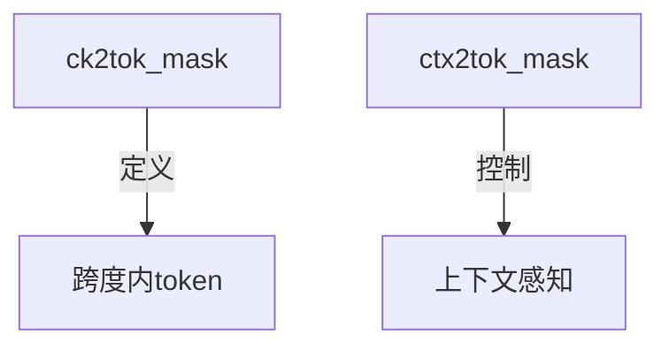
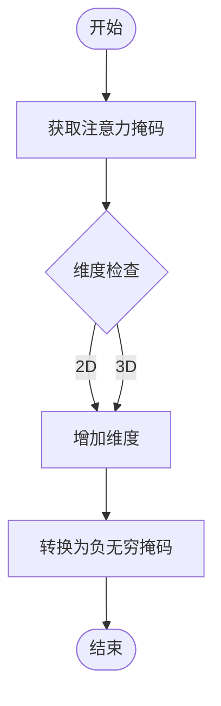
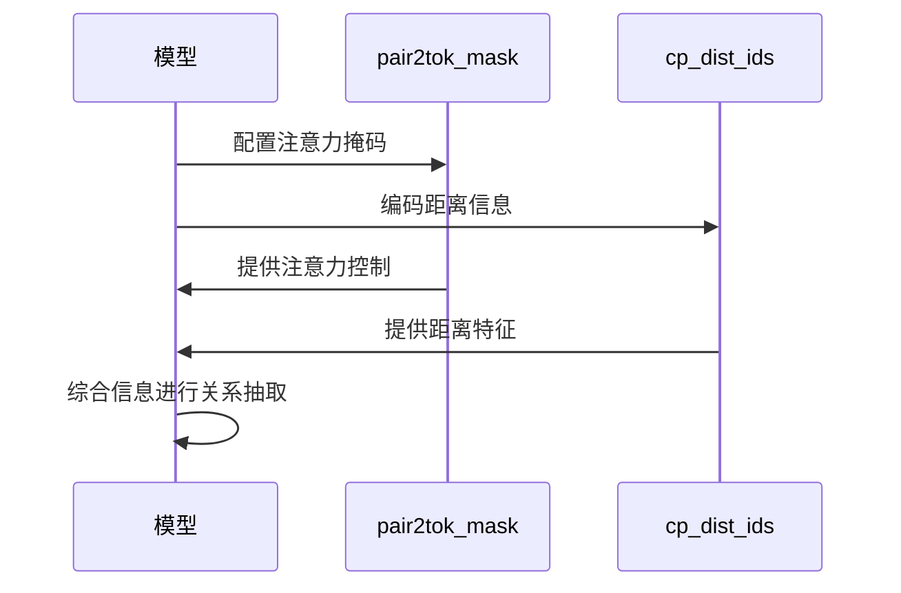
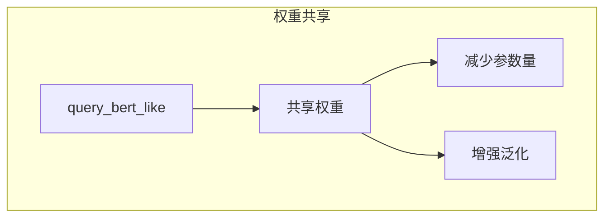

# MaskedSpanBertLike编码器

<cite>
**本文档引用的文件**   
- [masked_span_bert_like.py](file://eznlp/model/masked_span_bert_like.py)
- [query_bert_like.py](file://eznlp/nn/modules/query_bert_like.py)
- [masked_span_extractor.py](file://eznlp/model/model/masked_span_extractor.py)
- [aggregation.py](file://eznlp/nn/modules/aggregation.py)
- [relation.py](file://eznlp/utils/relation.py)
</cite>

## 目录
1. [引言](#引言)
2. [核心组件](#核心组件)
3. [注意力掩码机制](#注意力掩码机制)
4. [聚合方法实现](#聚合方法实现)
5. [特征嵌入设计](#特征嵌入设计)
6. [关系抽取应用](#关系抽取应用)
7. [权重共享策略](#权重共享策略)

## 引言
MaskedSpanBertLikeEncoder是一种专门设计用于关系抽取等任务的编码器，通过精确的注意力控制机制来增强模型对文本跨度和上下文关系的建模能力。该编码器利用多种注意力掩码和特征嵌入技术，实现了对文本中实体及其关系的精细化处理。

## 核心组件

MaskedSpanBertLikeEncoder的核心组件包括注意力掩码、特征嵌入和聚合方法。这些组件协同工作，确保模型能够有效地捕捉文本中的语义信息。

**本节来源**
- [masked_span_bert_like.py](file://eznlp/model/masked_span_bert_like.py#L1-L236)

## 注意力掩码机制

### ck2tok_mask
`ck2tok_mask`用于定义跨度内token的注意力范围。它通过标记特定跨度内的token，使得模型在处理这些token时能够集中注意力于指定的文本区域。

### ctx2tok_mask
`ctx2tok_mask`用于控制上下文感知的注意力分布。它允许模型在考虑上下文信息的同时，对特定token进行注意力分配，从而增强对上下文依赖关系的理解。



**图示来源**
- [masked_span_bert_like.py](file://eznlp/model/masked_span_bert_like.py#L190-L235)

## 聚合方法实现

### _forward_aggregation方法
`_forward_aggregation`方法利用`get_extended_attention_mask`将原始掩码转换为适合Transformer注意力计算的负无穷掩码。这一过程确保了被掩码的位置在softmax计算中被完全忽略。



**图示来源**
- [masked_span_bert_like.py](file://eznlp/model/masked_span_bert_like.py#L107-L122)

## 特征嵌入设计

### size_embedding
`size_embedding`用于在跨度大小特征建模中发挥作用。通过将不同大小的跨度映射到不同的嵌入向量，模型能够更好地理解跨度的长度对语义的影响。

### dist_embedding
`dist_embedding`用于在实体对距离特征建模中发挥作用。它通过编码实体对之间的距离信息，帮助模型捕捉实体间的空间关系。

```mermaid
classDiagram
class size_embedding {
+int max_size_id
+int hid_dim
+Embedding embedding
}
class dist_embedding {
+int max_dist_id
+int hid_dim
+Embedding embedding
}
size_embedding -->|用于| SpanSize[跨度大小]
dist_embedding -->|用于| EntityDistance[实体对距离]
```

**图示来源**
- [masked_span_bert_like.py](file://eznlp/model/masked_span_bert_like.py#L70-L80)

## 关系抽取应用

### pair2tok_mask配置
在关系抽取任务中，通过配置`pair2tok_mask`可以实现精确的注意力控制。`pair2tok_mask`允许模型在处理实体对时，仅关注相关的token，从而提高关系识别的准确性。

### cp_dist_ids参数
`cp_dist_ids`参数用于编码实体对的距离信息。通过将实体对的距离映射到嵌入向量，模型能够在处理关系时考虑实体间的相对位置。



**图示来源**
- [masked_span_bert_like.py](file://eznlp/model/masked_span_bert_like.py#L219-L230)

## 权重共享策略

### share_weights_int=True
MaskedSpanBertLikeEncoder强制要求`share_weights_int=True`，这意味着在不同跨度大小的`query_bert_like`之间共享权重。这种设计决策提高了模型的参数效率，减少了过拟合的风险，并增强了模型的泛化能力。



**图示来源**
- [masked_span_bert_like.py](file://eznlp/model/masked_span_bert_like.py#L31-L34)