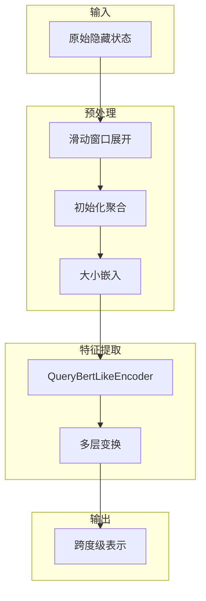
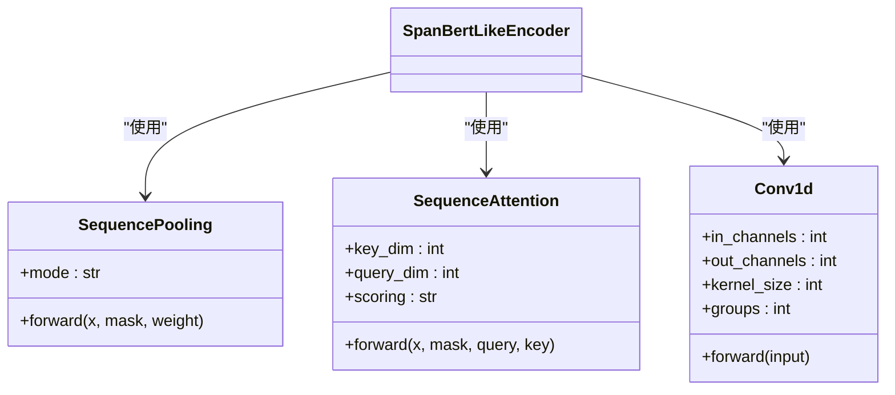
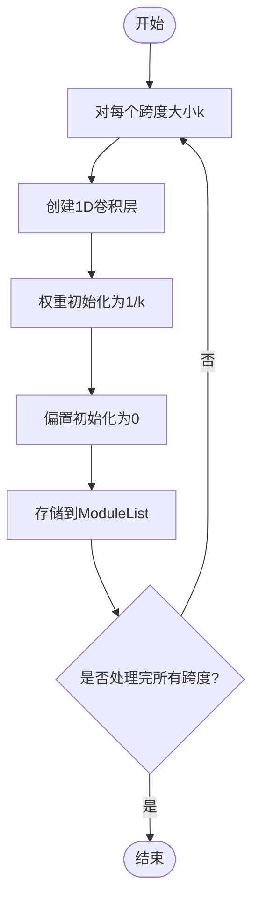
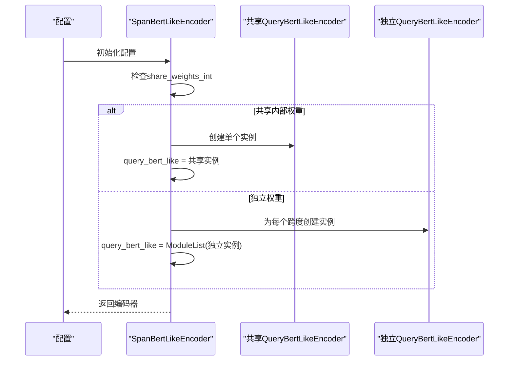
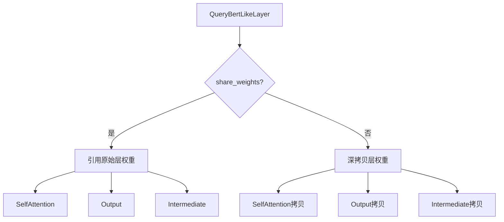
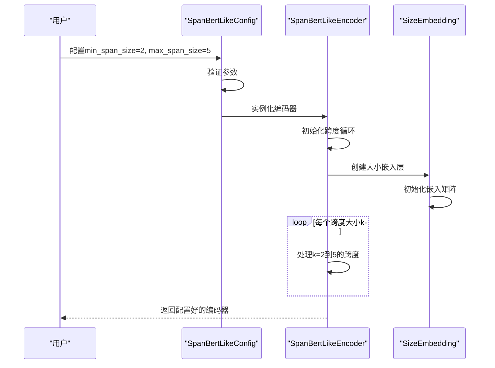
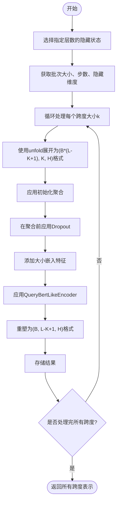
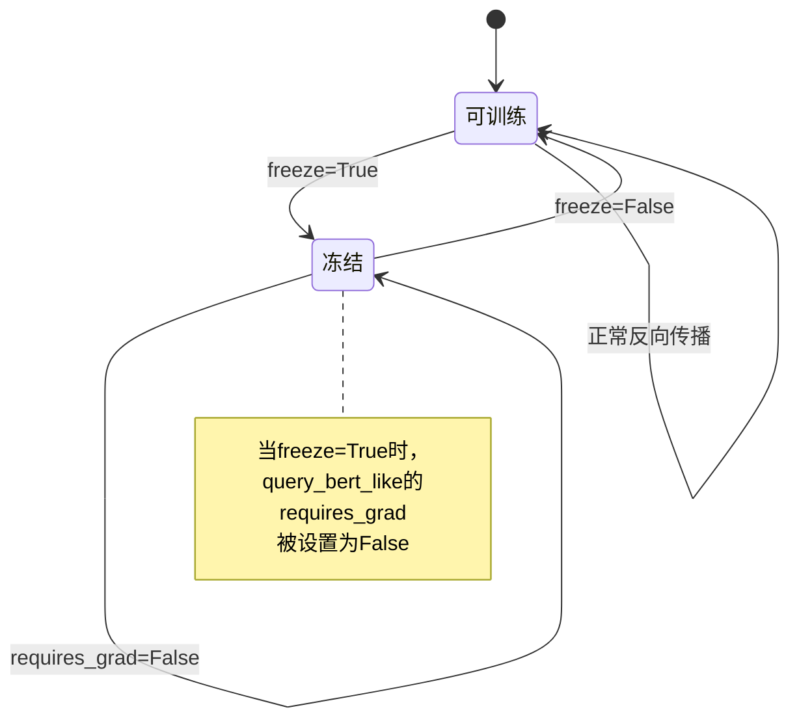
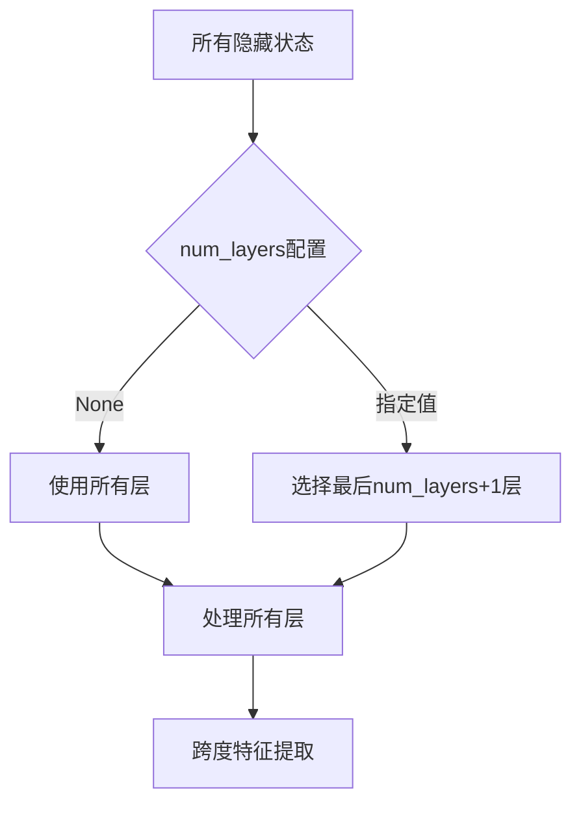
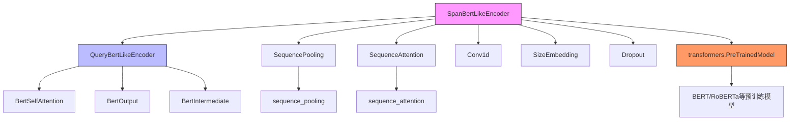

# SpanBertLike编码器

<cite>
**本文档引用的文件**   
- [span_bert_like.py](file://eznlp/model/span_bert_like.py)
- [query_bert_like.py](file://eznlp/nn/modules/query_bert_like.py)
- [aggregation.py](file://eznlp/nn/modules/aggregation.py)
- [attention.py](file://eznlp/nn/modules/attention.py)
- [functional.py](file://eznlp/nn/functional.py)
- [test_span_bert_like.py](file://tests/model/test_span_bert_like.py)
</cite>

## 目录
1. [简介](#简介)
2. [核心组件](#核心组件)
3. [架构概述](#架构概述)
4. [详细组件分析](#详细组件分析)
5. [依赖分析](#依赖分析)
6. [性能考虑](#性能考虑)
7. [故障排除指南](#故障排除指南)
8. [结论](#结论)

## 简介
SpanBertLikeEncoder是一种专门设计用于从预训练语言模型中提取跨度级特征的编码器。它通过滑动窗口机制处理隐藏状态，支持多种初始化聚合方式，并提供了灵活的配置选项来控制权重共享、跨度大小限制和特征建模。该编码器在命名实体识别等任务中表现出色，能够有效地捕捉文本中不同长度跨度的语义信息。

## 核心组件
SpanBertLikeEncoder的核心功能包括：使用滑动窗口对预训练模型的隐藏状态进行跨度级特征提取；支持多种初始化聚合模式（如最大池化、平均池化、注意力机制和卷积）；通过`share_weights_int`和`share_weights_ext`参数控制权重共享；利用`size_embedding`对跨度大小进行特征建模；以及通过`min_span_size`和`max_span_size`限制处理的跨度范围。

**本节来源**
- [span_bert_like.py](file://eznlp/model/span_bert_like.py#L57-L181)

## 架构概述
SpanBertLikeEncoder的整体架构基于预训练语言模型（如BERT），通过滑动窗口操作将原始隐藏状态转换为跨度表示。编码器首先对不同大小的跨度应用初始化聚合，然后使用QueryBertLikeEncoder进行深度特征提取。整个过程支持外部和内部权重共享，允许在不同跨度大小之间共享查询模块。



**图示来源**
- [span_bert_like.py](file://eznlp/model/span_bert_like.py#L132-L181)
- [query_bert_like.py](file://eznlp/nn/modules/query_bert_like.py#L234-L330)

## 详细组件分析

### 初始化聚合模式分析
SpanBertLikeEncoder支持四种初始化聚合模式：`max_pooling`、`mean_pooling`、`attention`和`conv`。这些模式在`SpanBertLikeConfig`初始化时根据`init_agg_mode`参数配置。

#### 聚合模式类图


**图示来源**
- [span_bert_like.py](file://eznlp/model/span_bert_like.py#L60-L80)
- [aggregation.py](file://eznlp/nn/modules/aggregation.py#L13-L43)
- [attention.py](file://eznlp/nn/modules/attention.py#L10-L232)

#### 聚合模式工作原理
- **max_pooling/mean_pooling**: 使用`SequencePooling`类实现，对跨度内的隐藏状态进行最大值或平均值池化
- **attention**: 使用`SequenceAttention`类实现，通过注意力机制聚合跨度特征
- **conv**: 为每个跨度大小创建独立的1D卷积层，卷积核权重初始化为均值池化

**本节来源**
- [span_bert_like.py](file://eznlp/model/span_bert_like.py#L60-L80)
- [aggregation.py](file://eznlp/nn/modules/aggregation.py#L24-L39)

### 卷积模式权重初始化
在`conv`模式下，系统为不同跨度大小初始化卷积核权重。每个卷积层的权重被初始化为1/k（k为跨度大小），偏置初始化为0，这相当于实现了均值池化的初始状态。



**图示来源**
- [span_bert_like.py](file://eznlp/model/span_bert_like.py#L69-L77)
- [span_bert_like.py](file://eznlp/model/span_bert_like.py#L80)

**本节来源**
- [span_bert_like.py](file://eznlp/model/span_bert_like.py#L69-L80)

### 权重共享机制分析
SpanBertLikeEncoder提供了两个关键的权重共享参数：`share_weights_int`和`share_weights_ext`，用于控制模型的参数效率和表达能力。

#### 权重共享类图
```mermaid
classDiagram
class QueryBertLikeEncoder {
+num_layers : int
+share_weights : bool
+forward(query_states, all_hidden_states)
}
class SpanBertLikeEncoder {
+share_weights_int : bool
+share_weights_ext : bool
+query_bert_like : Module
}
SpanBertLikeEncoder --> QueryBertLikeEncoder : "包含"
note right of SpanBertLikeEncoder
当share_weights_int=True时，
所有跨度大小共享同一个
QueryBertLikeEncoder实例
end note
note right of QueryBertLikeEncoder
当share_weights=True时，
与预训练模型共享权重
end note
```

**图示来源**
- [span_bert_like.py](file://eznlp/model/span_bert_like.py#L95-L114)
- [query_bert_like.py](file://eznlp/nn/modules/query_bert_like.py#L234-L330)

#### share_weights_int参数作用
`share_weights_int`参数控制跨不同跨度大小的查询模块权重共享：
- 当`share_weights_int=True`时，所有跨度大小共享同一个`QueryBertLikeEncoder`实例
- 当`share_weights_int=False`时，为每个跨度大小创建独立的`QueryBertLikeEncoder`实例



**图示来源**
- [span_bert_like.py](file://eznlp/model/span_bert_like.py#L95-L114)

**本节来源**
- [span_bert_like.py](file://eznlp/model/span_bert_like.py#L95-L114)

#### share_weights_ext参数机制
`share_weights_ext`参数控制BERT-like编码器内部层间权重共享，即是否与预训练模型共享权重：
- 当`share_weights_ext=True`时，直接引用预训练模型的层权重
- 当`share_weights_ext=False`时，创建权重的深拷贝



**图示来源**
- [query_bert_like.py](file://eznlp/nn/modules/query_bert_like.py#L105-L134)

**本节来源**
- [query_bert_like.py](file://eznlp/nn/modules/query_bert_like.py#L105-L134)

### 跨度大小配置分析
SpanBertLikeEncoder通过`min_span_size`和`max_span_size`参数限制处理的跨度范围，并使用`size_embedding`对跨度大小进行特征建模。

#### 跨度大小配置序列图


**图示来源**
- [span_bert_like.py](file://eznlp/model/span_bert_like.py#L26-L27)
- [span_bert_like.py](file://eznlp/model/span_bert_like.py#L84-L93)

**本节来源**
- [span_bert_like.py](file://eznlp/model/span_bert_like.py#L26-L27)
- [span_bert_like.py](file://eznlp/model/span_bert_like.py#L84-L93)

### 前向传播机制分析
`forward`方法是SpanBertLikeEncoder的核心，负责将原始隐藏状态转换为跨度级表示。

#### 前向传播数据流


#### 前向传播详细流程


**图示来源**
- [span_bert_like.py](file://eznlp/model/span_bert_like.py#L132-L178)

**本节来源**
- [span_bert_like.py](file://eznlp/model/span_bert_like.py#L132-L178)

### 冻结与层数配置分析
SpanBertLikeEncoder通过`freeze`参数控制预训练模型的梯度更新策略，并通过`num_layers`配置选择特定层数的隐藏状态进行处理。

#### 冻结机制状态图


#### 层数选择机制


**图示来源**
- [span_bert_like.py](file://eznlp/model/span_bert_like.py#L19-L24)
- [span_bert_like.py](file://eznlp/model/span_bert_like.py#L132-L134)
- [span_bert_like.py](file://eznlp/model/span_bert_like.py#L127-L131)

**本节来源**
- [span_bert_like.py](file://eznlp/model/span_bert_like.py#L19-L24)
- [span_bert_like.py](file://eznlp/model/span_bert_like.py#L132-L134)
- [span_bert_like.py](file://eznlp/model/span_bert_like.py#L127-L131)

## 依赖分析
SpanBertLikeEncoder依赖于多个关键组件和模块，形成了一个复杂的依赖网络。



**图示来源**
- [span_bert_like.py](file://eznlp/model/span_bert_like.py)
- [query_bert_like.py](file://eznlp/nn/modules/query_bert_like.py)

**本节来源**
- [span_bert_like.py](file://eznlp/model/span_bert_like.py)
- [query_bert_like.py](file://eznlp/nn/modules/query_bert_like.py)

## 性能考虑
SpanBertLikeEncoder的性能受多个因素影响，包括权重共享策略、跨度大小范围和初始化聚合模式的选择。当`share_weights_int=True`时，模型参数量显著减少，提高了内存效率；而`share_weights_int=False`虽然参数量增加，但为不同跨度大小提供了独立的表示能力。`conv`初始化模式在处理不同跨度大小时需要独立的卷积核，增加了计算开销，但提供了更灵活的特征提取能力。

## 故障排除指南
在使用SpanBertLikeEncoder时可能遇到的常见问题及解决方案：
- **内存不足**: 减小`max_span_size`或启用`share_weights_int`
- **训练不稳定**: 调整`init_drop_rate`或检查`size_embedding`配置
- **性能下降**: 验证`freeze`参数设置是否符合预期
- **维度不匹配**: 检查`num_layers`配置与预训练模型层数的兼容性

**本节来源**
- [test_span_bert_like.py](file://tests/model/test_span_bert_like.py)

## 结论
SpanBertLikeEncoder通过创新的滑动窗口机制和灵活的配置选项，为预训练语言模型的跨度级特征提取提供了强大的解决方案。其支持的多种初始化聚合模式、精细的权重共享控制和跨度大小特征建模能力，使其在命名实体识别等任务中表现出色。通过合理配置`share_weights_int`、`share_weights_ext`、`init_agg_mode`等参数，可以在模型复杂度和表达能力之间取得良好平衡。