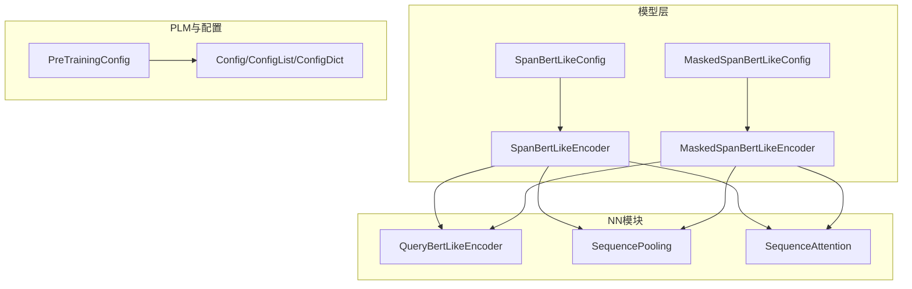
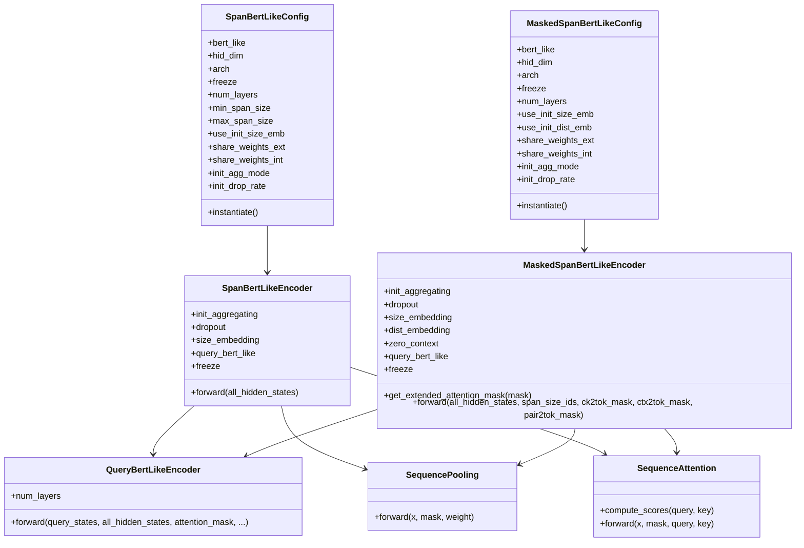
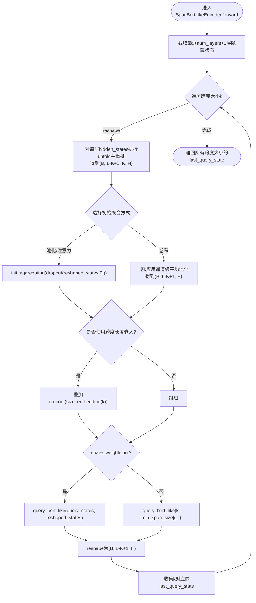
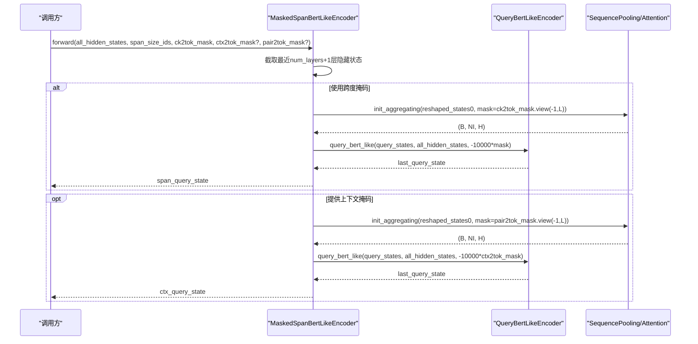
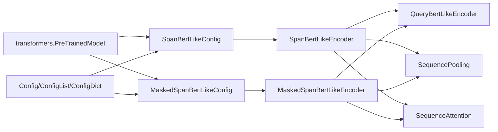

# 预训练语言模型编码器

<cite>
**本文引用的文件列表**
- [span_bert_like.py](file://eznlp/model/span_bert_like.py)
- [masked_span_bert_like.py](file://eznlp/model/masked_span_bert_like.py)
- [query_bert_like.py](file://eznlp/nn/modules/query_bert_like.py)
- [aggregation.py](file://eznlp/nn/modules/aggregation.py)
- [attention.py](file://eznlp/nn/modules/attention.py)
- [block.py](file://eznlp/nn/modules/block.py)
- [config.py](file://eznlp/config.py)
- [plm/base.py](file://eznlp/plm/base.py)
- [test_span_bert_like.py](file://tests/model/test_span_bert_like.py)
- [test_masked_span_bert_like.py](file://tests/model/test_masked_span_bert_like.py)
</cite>

## 目录
1. [引言](#引言)
2. [项目结构](#项目结构)
3. [核心组件](#核心组件)
4. [架构总览](#架构总览)
5. [详细组件分析](#详细组件分析)
6. [依赖关系分析](#依赖关系分析)
7. [性能考量](#性能考量)
8. [故障排查指南](#故障排查指南)
9. [结论](#结论)
10. [附录：使用示例与最佳实践](#附录使用示例与最佳实践)

## 引言
本系统文档围绕基于BERT的编码器体系展开，重点覆盖两类编码器：
- SpanBertLikeEncoder：面向跨度（span）表示学习，支持多跨度大小、可选的初始聚合方式与权重共享策略。
- MaskedSpanBertLikeEncoder：面向关系抽取等任务，提供更精细的注意力控制，支持通过ck2tok_mask与ctx2tok_mask实现精确的上下文与跨度注意力掩码。

文档将详细解释如何通过bert_like参数接入Hugging Face transformers库中的预训练模型（如BERT、RoBERTa等），如何用freeze控制预训练模型的梯度更新，如何用num_layers灵活调整模型深度；同时阐述share_weights_ext与share_weights_int在权重共享策略中的作用，以及init_agg_mode支持的max_pooling、mean_pooling、attention等初始聚合方式。最后给出在关系抽取任务中如何利用ck2tok_mask与ctx2tok_mask实现精确注意力控制的方法。

## 项目结构
该模块位于eznlp/model目录下，核心文件为span_bert_like.py与masked_span_bert_like.py，分别定义了SpanBertLikeConfig/Encoder与MaskedSpanBertLikeConfig/Encoder。它们共同依赖于：
- nn/modules下的QueryBertLikeEncoder（跨注意力替代自注意力）、SequencePooling、SequenceAttention等注意力/池化组件；
- plm/base.py中的PreTrainingConfig用于通用预训练配置；
- config.py中的Config基类与集合容器（ConfigList/ConfigDict）用于配置管理。

图表来源
- [span_bert_like.py](file://eznlp/model/span_bert_like.py#L13-L55)
- [masked_span_bert_like.py](file://eznlp/model/masked_span_bert_like.py#L13-L54)
- [query_bert_like.py](file://eznlp/nn/modules/query_bert_like.py#L233-L330)
- [aggregation.py](file://eznlp/nn/modules/aggregation.py#L13-L43)
- [attention.py](file://eznlp/nn/modules/attention.py#L9-L231)
- [plm/base.py](file://eznlp/plm/base.py#L7-L39)
- [config.py](file://eznlp/config.py#L20-L173)

章节来源
- [span_bert_like.py](file://eznlp/model/span_bert_like.py#L13-L181)
- [masked_span_bert_like.py](file://eznlp/model/masked_span_bert_like.py#L13-L236)
- [query_bert_like.py](file://eznlp/nn/modules/query_bert_like.py#L233-L330)
- [aggregation.py](file://eznlp/nn/modules/aggregation.py#L13-L106)
- [attention.py](file://eznlp/nn/modules/attention.py#L9-L231)
- [plm/base.py](file://eznlp/plm/base.py#L7-L39)
- [config.py](file://eznlp/config.py#L20-L173)

## 核心组件
- SpanBertLikeConfig/Encoder
  - 接收bert_like（Hugging Face PreTrainedModel实例），自动读取hidden_size与num_hidden_layers，作为编码器维度与最大层数上限。
  - 支持freeze控制是否冻结预训练编码器权重；num_layers可裁剪仅使用部分层。
  - 支持最小/最大跨度范围min_span_size/max_span_size，以及use_init_size_emb以跨度长度嵌入增强。
  - 权重共享策略：share_weights_ext控制是否与bert_like共享权重；share_weights_int控制不同跨度大小之间是否共享QueryBertLikeEncoder。
  - 初始聚合模式init_agg_mode支持max_pooling、mean_pooling、attention等，或以卷积实现通道级平均池化（conv）。
- MaskedSpanBertLikeConfig/Encoder
  - 在SpanBertLike基础上扩展：支持use_init_size_emb与use_init_dist_emb（距离嵌入）。
  - 提供get_extended_attention_mask方法，将2D/3D注意力掩码扩展为适合注意力分数加法的形式。
  - 前向函数接受ck2tok_mask（跨度到token的掩码）与ctx2tok_mask（上下文到token的掩码），并可选pair2tok_mask与cp_dist_ids实现成对关系的注意力控制。
  - 内置zero_context参数，用于处理全零掩码项时的安全输出。

章节来源
- [span_bert_like.py](file://eznlp/model/span_bert_like.py#L13-L181)
- [masked_span_bert_like.py](file://eznlp/model/masked_span_bert_like.py#L13-L236)

## 架构总览
SpanBertLikeEncoder与MaskedSpanBertLikeEncoder均通过QueryBertLikeEncoder实现“查询-键/值”的跨注意力替代原生自注意力，从而将预计算的隐藏状态序列作为键/值，查询序列由初始聚合得到。两者在权重共享、初始聚合与注意力掩码方面存在差异，但共享同一底层实现。

图表来源
- [span_bert_like.py](file://eznlp/model/span_bert_like.py#L13-L181)
- [masked_span_bert_like.py](file://eznlp/model/masked_span_bert_like.py#L13-L236)
- [query_bert_like.py](file://eznlp/nn/modules/query_bert_like.py#L233-L330)
- [aggregation.py](file://eznlp/nn/modules/aggregation.py#L13-L43)
- [attention.py](file://eznlp/nn/modules/attention.py#L9-L231)

## 详细组件分析

### SpanBertLikeEncoder
- 初始化阶段
  - 根据init_agg_mode选择初始聚合策略：池化（mean/max/min/rnn_last）、注意力（additive/scaled_dot等）或卷积（通道级平均池化）。
  - 若use_init_size_emb启用，则注册跨度长度嵌入并缓存跨度ID张量。
  - 根据share_weights_int决定是否在不同跨度大小间共享QueryBertLikeEncoder。
  - freeze设置时，通过requires_grad_切换QueryBertLikeEncoder的可训练性。
- 前向阶段
  - 仅保留最近num_layers+1层隐藏状态，按跨度大小k进行unfold与重排，得到形状为(B, L-K+1, K, H)的窗口张量。
  - 对每个k，调用init_aggregating得到查询向量（形状(B*(L-K+1), H)），可选叠加跨度长度嵌入。
  - 将查询向量与各层隐藏状态输入QueryBertLikeEncoder，得到每层的last_query_state并reshape回(B, L-K+1, H)。
  - 返回所有跨度大小对应的last_query_state字典。

图表来源
- [span_bert_like.py](file://eznlp/model/span_bert_like.py#L132-L181)

章节来源
- [span_bert_like.py](file://eznlp/model/span_bert_like.py#L57-L181)

### MaskedSpanBertLikeEncoder
- 初始化阶段
  - 同样支持init_agg_mode（pooling/attention），并可选use_init_size_emb与use_init_dist_emb。
  - 注册zero_context参数，用于处理全零掩码项时的安全输出。
  - 冻结策略与SpanBertLike一致，通过freeze切换QueryBertLikeEncoder的requires_grad_。
- 前向阶段
  - get_extended_attention_mask将2D/3D注意力掩码扩展为适合softmax前加法的掩码张量。
  - _forward_aggregation负责：
    - 将all_hidden_states[0]广播为(B, NI, L, H)，并将init_mask（ck2tok_mask）展平为(B*NI, L)。
    - 调用init_aggregating得到(B, NI, H)的查询向量，可选叠加init_embedded（跨度长度或距离嵌入）。
    - 将query_states与all_hidden_states输入QueryBertLikeEncoder，并传入扩展后的attention_mask。
    - 对全零指示项进行条件替换，使用zero_context填充。
  - forward整合两路查询：
    - 首先以ck2tok_mask作为初始掩码与注意力掩码，得到span_query_state；
    - 若提供ctx2tok_mask，则以ck2tok_mask作为初始掩码、ctx2tok_mask作为注意力掩码，得到ctx_query_state；
    - 若提供pair2tok_mask与cp_dist_ids，则以pair2tok_mask作为初始掩码、ctx2tok_mask作为注意力掩码，并叠加距离嵌入，得到ctx_query_state。

图表来源
- [masked_span_bert_like.py](file://eznlp/model/masked_span_bert_like.py#L185-L236)
- [query_bert_like.py](file://eznlp/nn/modules/query_bert_like.py#L279-L330)
- [aggregation.py](file://eznlp/nn/modules/aggregation.py#L13-L43)
- [attention.py](file://eznlp/nn/modules/attention.py#L9-L231)

章节来源
- [masked_span_bert_like.py](file://eznlp/model/masked_span_bert_like.py#L56-L236)
- [query_bert_like.py](file://eznlp/nn/modules/query_bert_like.py#L233-L330)
- [aggregation.py](file://eznlp/nn/modules/aggregation.py#L13-L106)
- [attention.py](file://eznlp/nn/modules/attention.py#L9-L231)

### 权重共享策略与冻结机制
- share_weights_ext
  - 控制QueryBertLikeEncoder是否直接复用预训练模型的注意力/FFN参数（即与bert_like共享权重）。
  - 当share_weights_ext为False时，会复制原层的参数，避免共享。
- share_weights_int
  - 控制不同跨度大小k之间是否共享同一个QueryBertLikeEncoder实例。
  - 若为True，仅创建一个QueryBertLikeEncoder；若为False，则为每个跨度大小k分别创建独立实例。
- freeze
  - 设置为True时，通过requires_grad_(not freeze)将QueryBertLikeEncoder设为不可训练，从而冻结预训练权重。
  - 测试用例验证了freeze对参数计数的影响，以及share_weights_int对参数数量的影响。

章节来源
- [span_bert_like.py](file://eznlp/model/span_bert_like.py#L95-L131)
- [masked_span_bert_like.py](file://eznlp/model/masked_span_bert_like.py#L93-L106)
- [test_span_bert_like.py](file://tests/model/test_span_bert_like.py#L50-L86)
- [test_masked_span_bert_like.py](file://tests/model/test_masked_span_bert_like.py#L103-L121)

### 初始聚合方式init_agg_mode
- 支持的模式
  - max_pooling/mean_pooling/min_pooling：通过SequencePooling实现。
  - attention_pooling/attention_scaled_dot/attention_additive/attention_biaffine：通过SequenceAttention实现。
  - conv_pooling：为每个跨度大小k构造通道级卷积（groups=hid_dim），权重初始化为平均池化核，实现通道级滑动平均。
- 选择逻辑
  - 依据init_agg_mode后缀判断池化或注意力，或以卷积实现池化。
  - 池化/注意力路径分别处理，卷积路径按跨度大小k索引对应卷积核。

章节来源
- [span_bert_like.py](file://eznlp/model/span_bert_like.py#L60-L81)
- [aggregation.py](file://eznlp/nn/modules/aggregation.py#L13-L43)
- [attention.py](file://eznlp/nn/modules/attention.py#L9-L231)

### 关系抽取中的注意力控制（ck2tok_mask与ctx2tok_mask）
- ck2tok_mask
  - 形状(B, NI, L)，指示每个跨度（NI个）覆盖的token位置。
  - 作为初始聚合的mask，用于从跨度窗口中聚合上下文表示。
- ctx2tok_mask
  - 形状(B, NI, L)，指示每个跨度的上下文区域（非覆盖区域）。
  - 作为注意力掩码，控制查询对上下文token的关注。
- pair2tok_mask与cp_dist_ids
  - 可选地提供成对关系的掩码与距离嵌入，进一步细化注意力控制。
- 安全处理
  - 当出现全零掩码项时，通过zero_context安全填充，避免NaN梯度问题。

章节来源
- [masked_span_bert_like.py](file://eznlp/model/masked_span_bert_like.py#L107-L184)
- [test_masked_span_bert_like.py](file://tests/model/test_masked_span_bert_like.py#L40-L101)

## 依赖关系分析
- 组件耦合
  - SpanBertLikeEncoder与MaskedSpanBertLikeEncoder均依赖QueryBertLikeEncoder，后者根据origin类型（Bert/Albert）选择不同的层封装。
  - 初始聚合模块（SequencePooling/SequenceAttention）与注意力模块（SequenceAttention）被两类编码器共享使用。
- 外部依赖
  - Hugging Face transformers：通过bert_like访问预训练模型的encoder与config，从而动态适配不同架构（BERT、RoBERTa等）。
- 配置管理
  - Config/ConfigList/ConfigDict提供统一的配置对象与实例化接口，确保编码器配置的一致性与可扩展性。

图表来源
- [span_bert_like.py](file://eznlp/model/span_bert_like.py#L13-L55)
- [masked_span_bert_like.py](file://eznlp/model/masked_span_bert_like.py#L13-L54)
- [query_bert_like.py](file://eznlp/nn/modules/query_bert_like.py#L233-L330)
- [aggregation.py](file://eznlp/nn/modules/aggregation.py#L13-L43)
- [attention.py](file://eznlp/nn/modules/attention.py#L9-L231)
- [config.py](file://eznlp/config.py#L20-L173)

章节来源
- [span_bert_like.py](file://eznlp/model/span_bert_like.py#L13-L55)
- [masked_span_bert_like.py](file://eznlp/model/masked_span_bert_like.py#L13-L54)
- [query_bert_like.py](file://eznlp/nn/modules/query_bert_like.py#L233-L330)
- [config.py](file://eznlp/config.py#L20-L173)

## 性能考量
- 层深裁剪（num_layers）
  - 通过仅保留最近num_layers+1层隐藏状态，减少计算开销，尤其在长序列场景下收益显著。
- 卷积池化（conv_pooling）
  - 通道级卷积实现平均池化核，计算高效且内存友好，适合多跨度大小场景。
- 权重共享（share_weights_ext/int）
  - 共享外部权重可减少参数量与显存占用；内部共享可避免重复建模，提升推理速度。
- 注意力掩码
  - 扩展掩码为-10000形式，避免无效位置参与softmax，减少无效计算。

[本节为一般性指导，不直接分析具体文件]

## 故障排查指南
- 参数计数异常
  - 若freeze=True，QueryBertLikeEncoder应无训练参数；若share_weights_int=False，参数量应为num_layers×(max_size-min_size+1)倍。
- NaN梯度
  - 全零掩码项可能导致NaN，需检查zero_indic分支与zero_context填充逻辑。
- 掩码维度错误
  - attention_mask必须为2D或3D，否则会触发维度校验错误；请确保传入正确的形状。
- 跨度大小越界
  - min_span_size/max_span_size需与实际序列长度匹配，避免索引越界。

章节来源
- [test_span_bert_like.py](file://tests/model/test_span_bert_like.py#L50-L86)
- [test_masked_span_bert_like.py](file://tests/model/test_masked_span_bert_like.py#L103-L121)
- [masked_span_bert_like.py](file://eznlp/model/masked_span_bert_like.py#L107-L122)

## 结论
本编码器体系通过QueryBertLikeEncoder将预训练模型的自注意力替换为跨注意力，结合灵活的初始聚合与权重共享策略，实现了高效的跨度表示学习与关系抽取能力。借助Hugging Face transformers的广泛支持，用户可以轻松从BERT、RoBERTa等模型构建编码器，并通过freeze与num_layers实现训练灵活性与性能平衡。在关系抽取任务中，ck2tok_mask与ctx2tok_mask提供了精确的注意力控制，使模型能够聚焦于目标跨度与上下文区域。

[本节为总结性内容，不直接分析具体文件]

## 附录：使用示例与最佳实践
- 从BERT/RoBERTa构建编码器
  - 通过bert_like参数传入transformers.PreTrainedModel实例，自动读取hidden_size与num_hidden_layers。
  - 示例参考：[SpanBertLikeConfig/Encoder](file://eznlp/model/span_bert_like.py#L13-L55)、[MaskedSpanBertLikeConfig/Encoder](file://eznlp/model/masked_span_bert_like.py#L13-L54)
- 控制梯度更新（freeze）
  - freeze=True：冻结预训练权重，仅训练QueryBertLikeEncoder；适合固定特征提取场景。
  - freeze=False：允许预训练权重参与训练，适合微调场景。
  - 参考测试：[SpanBertLike训练配置](file://tests/model/test_span_bert_like.py#L50-L86)、[MaskedSpanBertLike训练配置](file://tests/model/test_masked_span_bert_like.py#L103-L121)
- 灵活调整模型深度（num_layers）
  - 通过num_layers裁剪隐藏状态层数，减少计算与显存占用。
  - 参考：[SpanBertLikeConfig/Encoder](file://eznlp/model/span_bert_like.py#L18-L24)、[MaskedSpanBertLikeConfig/Encoder](file://eznlp/model/masked_span_bert_like.py#L21-L24)
- 权重共享策略（share_weights_ext/int）
  - share_weights_ext=True：与预训练模型共享权重，减少参数量。
  - share_weights_int=True：不同跨度大小共享QueryBertLikeEncoder，降低冗余。
  - 参考：[SpanBertLikeEncoder](file://eznlp/model/span_bert_like.py#L95-L114)、[MaskedSpanBertLikeEncoder](file://eznlp/model/masked_span_bert_like.py#L82-L88)
- 初始聚合方式（init_agg_mode）
  - max_pooling/mean_pooling/min_pooling：简单高效。
  - attention_*：更具表达力，适合复杂上下文。
  - conv_pooling：通道级平均池化，兼顾效率与表达。
  - 参考：[SpanBertLikeEncoder](file://eznlp/model/span_bert_like.py#L60-L81)、[MaskedSpanBertLikeEncoder](file://eznlp/model/masked_span_bert_like.py#L59-L67)
- 关系抽取中的注意力控制
  - 使用ck2tok_mask定义跨度覆盖区域，ctx2tok_mask定义上下文区域，实现精确注意力控制。
  - 参考：[MaskedSpanBertLikeEncoder.forward](file://eznlp/model/masked_span_bert_like.py#L185-L236)、[测试用例](file://tests/model/test_masked_span_bert_like.py#L40-L101)