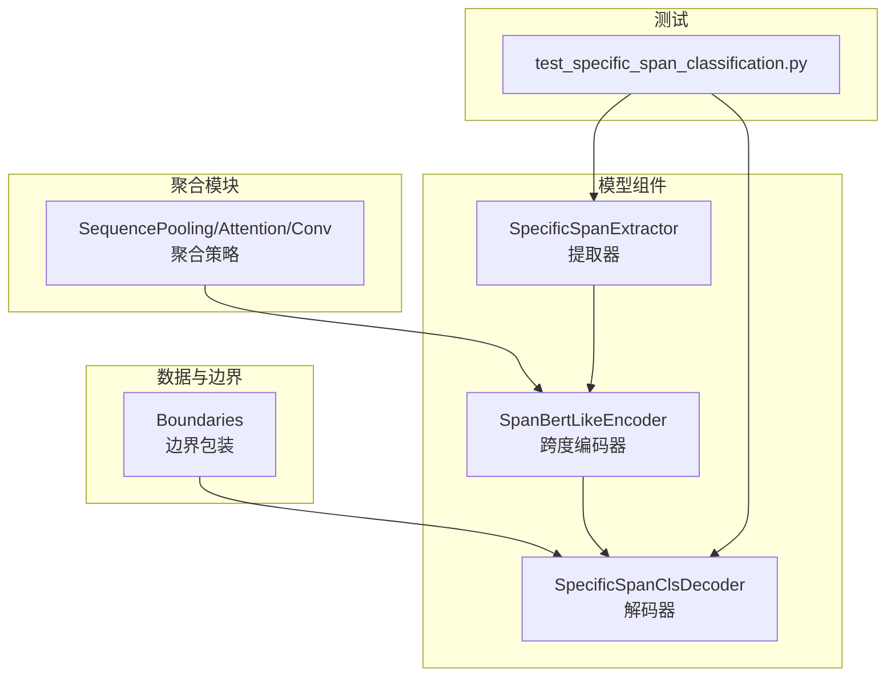
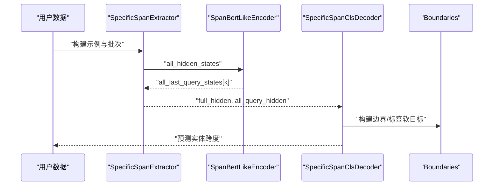
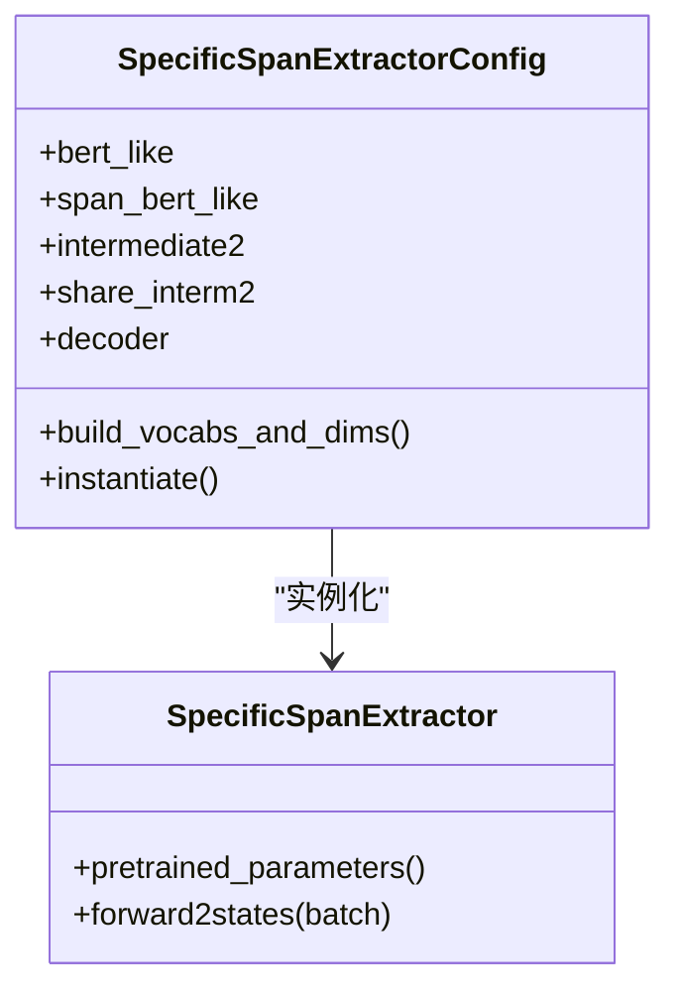
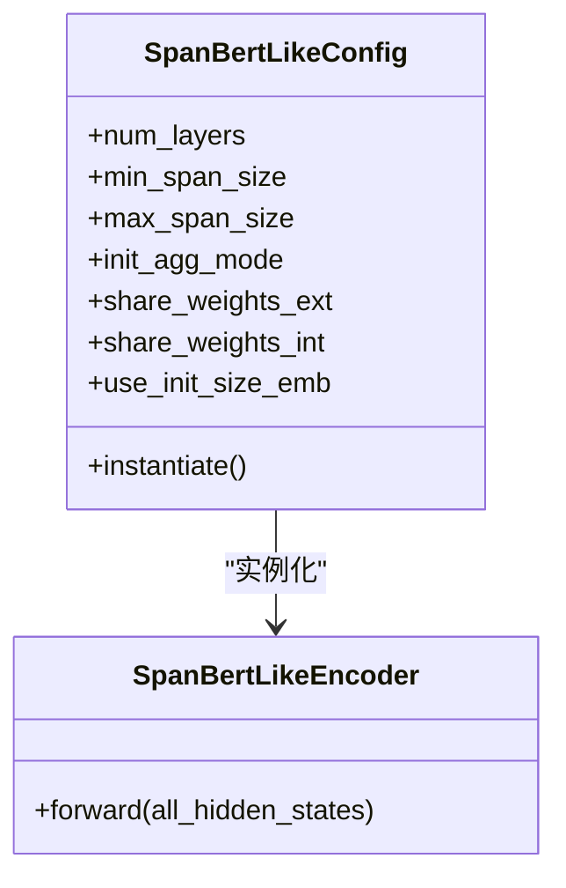
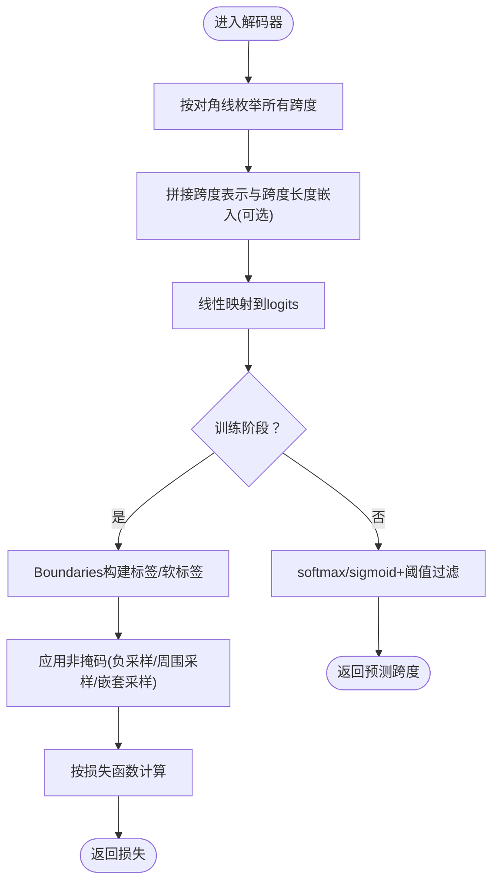
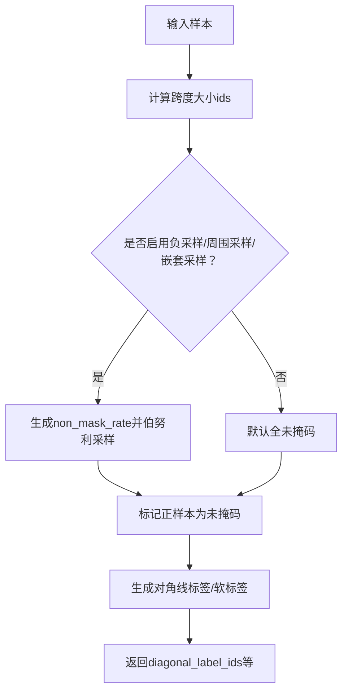
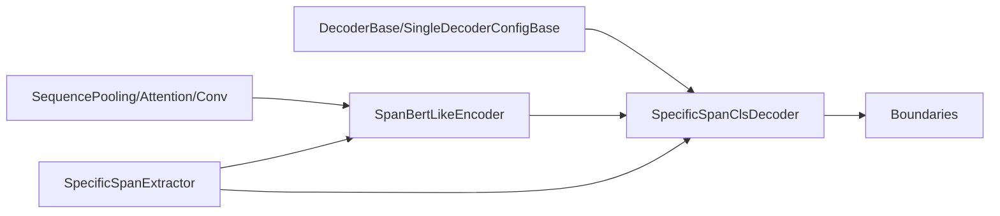

# Span分类解码器

<cite>
**本文引用的文件列表**
- [specific_span_classification.py](file://eznlp/model/decoder/specific_span_classification.py)
- [boundaries.py](file://eznlp/model/decoder/boundaries.py)
- [base.py](file://eznlp/model/decoder/base.py)
- [specific_span_extractor.py](file://eznlp/model/model/specific_span_extractor.py)
- [span_bert_like.py](file://eznlp/model/span_bert_like.py)
- [aggregation.py](file://eznlp/nn/modules/aggregation.py)
- [test_specific_span_classification.py](file://tests/model/test_specific_span_classification.py)
</cite>

## 目录
1. [引言](#引言)
2. [项目结构](#项目结构)
3. [核心组件](#核心组件)
4. [架构总览](#架构总览)
5. [详细组件分析](#详细组件分析)
6. [依赖关系分析](#依赖关系分析)
7. [性能考量](#性能考量)
8. [故障排查指南](#故障排查指南)
9. [结论](#结论)
10. [附录：配置与使用要点](#附录配置与使用要点)

## 引言
本文件系统性阐述Span分类解码器（SpecificSpanClsDecoder）的工作原理与实现细节，重点说明：
- 如何通过枚举所有可能的文本跨度并对其进行分类来识别命名实体；
- 如何利用特定跨度提取器（SpecificSpanExtractor）与SpanBertLike编码器从编码器隐藏状态中聚合跨度表示，支持平均池化、最大池化、注意力与卷积等聚合策略；
- 分类头设计与多类别/多标签场景下的损失函数选择；
- 结合测试用例展示如何设置最大跨度长度、负采样策略以及类别不平衡处理机制；
- 相较于序列标注的优势（如处理嵌套实体）与计算开销问题，并给出性能优化建议。

## 项目结构
围绕Span分类解码器的关键文件组织如下：
- 解码器与边界包装：specific_span_classification.py、boundaries.py、base.py
- 提取器与编码器：specific_span_extractor.py、span_bert_like.py
- 聚合模块：aggregation.py
- 测试与示例：test_specific_span_classification.py

图表来源
- [specific_span_extractor.py](file://eznlp/model/model/specific_span_extractor.py#L114-L157)
- [span_bert_like.py](file://eznlp/model/span_bert_like.py#L57-L181)
- [specific_span_classification.py](file://eznlp/model/decoder/specific_span_classification.py#L154-L338)
- [boundaries.py](file://eznlp/model/decoder/boundaries.py#L90-L261)
- [aggregation.py](file://eznlp/nn/modules/aggregation.py#L13-L106)
- [test_specific_span_classification.py](file://tests/model/test_specific_span_classification.py#L251-L374)

章节来源
- [specific_span_extractor.py](file://eznlp/model/model/specific_span_extractor.py#L1-L157)
- [span_bert_like.py](file://eznlp/model/span_bert_like.py#L1-L181)
- [specific_span_classification.py](file://eznlp/model/decoder/specific_span_classification.py#L1-L338)
- [boundaries.py](file://eznlp/model/decoder/boundaries.py#L1-L353)
- [aggregation.py](file://eznlp/nn/modules/aggregation.py#L1-L106)
- [test_specific_span_classification.py](file://tests/model/test_specific_span_classification.py#L1-L374)

## 核心组件
- SpecificSpanExtractor：负责从预训练编码器输出中抽取全序列隐藏状态与不同跨度大小的查询隐藏状态，作为后续解码器输入。
- SpanBertLikeEncoder：对每个跨度大小k，将连续窗口的子序列折叠为形状(B, L-k+1, H, k)，再通过初始聚合（平均/最大/注意力/卷积）得到跨度表示，随后通过共享或分层的QueryBertLike子网络进行上下文融合。
- SpecificSpanClsDecoder：对所有跨度进行分类，支持多类别与多标签；在训练时可使用边界平滑、标签平滑、焦点损失、MK-MMD等策略；在推理时根据置信度阈值过滤并后处理。

章节来源
- [specific_span_extractor.py](file://eznlp/model/model/specific_span_extractor.py#L114-L157)
- [span_bert_like.py](file://eznlp/model/span_bert_like.py#L57-L181)
- [specific_span_classification.py](file://eznlp/model/decoder/specific_span_classification.py#L154-L338)

## 架构总览
Span分类的整体流程如下：
- 输入：Batch包含tokens与可选gold chunks；
- 特定跨度提取器调用预训练编码器获取全序列隐藏状态，并通过SpanBertLike对不同跨度大小进行聚合与上下文建模；
- 解码器对所有跨度（按对角线枚举）计算logits，训练时使用边界/标签平滑或焦点损失，推理时按置信度阈值筛选并去重。

图表来源
- [specific_span_extractor.py](file://eznlp/model/model/specific_span_extractor.py#L130-L157)
- [span_bert_like.py](file://eznlp/model/span_bert_like.py#L132-L181)
- [specific_span_classification.py](file://eznlp/model/decoder/specific_span_classification.py#L248-L338)
- [boundaries.py](file://eznlp/model/decoder/boundaries.py#L90-L261)

## 详细组件分析

### 组件A：SpecificSpanExtractor（特定跨度提取器）
- 功能：从预训练编码器输出中抽取全序列隐藏状态与不同跨度大小的查询隐藏状态；可选中间层（intermediate2）对隐藏状态进行变换；根据是否共享权重决定查询子网络实例数量。
- 关键点：
  - 预训练参数仅包含外部共享权重时才额外加入查询子网络参数，避免重复；
  - 对每个跨度大小k，构造掩码以适配不同长度序列，确保对齐；
  - 将full_hidden与all_query_hidden返回给解码器。

图表来源
- [specific_span_extractor.py](file://eznlp/model/model/specific_span_extractor.py#L20-L112)
- [specific_span_extractor.py](file://eznlp/model/model/specific_span_extractor.py#L114-L157)

章节来源
- [specific_span_extractor.py](file://eznlp/model/model/specific_span_extractor.py#L1-L157)

### 组件B：SpanBertLikeEncoder（跨度编码器）
- 功能：对每个跨度大小k，将(B, L, H)的隐藏状态展开为(B, L-k+1, H, k)，再通过初始聚合策略（平均/最大/注意力/卷积）得到(B, L-k+1, H)的跨度表示，最后通过QueryBertLike进行上下文融合。
- 聚合策略：
  - 平均池化/最大池化：SequencePooling；
  - 注意力：SequenceAttention；
  - 卷积：通道级卷积（groups=hid_dim），初始化为均值池化核，对跨度进行特征融合。
- 权重共享：
  - 内部共享（不同跨度大小共享同一子网络）或分层共享；
  - 外部共享（与预训练编码器共享权重）。

图表来源
- [span_bert_like.py](file://eznlp/model/span_bert_like.py#L13-L56)
- [span_bert_like.py](file://eznlp/model/span_bert_like.py#L57-L181)
- [aggregation.py](file://eznlp/nn/modules/aggregation.py#L13-L106)

章节来源
- [span_bert_like.py](file://eznlp/model/span_bert_like.py#L1-L181)
- [aggregation.py](file://eznlp/nn/modules/aggregation.py#L1-L106)

### 组件C：SpecificSpanClsDecoder（Span分类解码器）
- 功能：对所有跨度进行分类，支持多类别与多标签；训练时可使用边界平滑、标签平滑、焦点损失、MK-MMD等；推理时按置信度阈值过滤并后处理。
- 关键流程：
  - 枚举所有跨度（按对角线顺序），拼接跨度表示与跨度长度嵌入（可选），映射到logits；
  - 训练时使用Boundaries对象生成对角线格式的标签或软标签，按非掩码位置计算损失；
  - 可选的MK-MMD损失用于区分嵌套与外层跨度表示分布；
  - 推理时根据多标签或单标签策略生成实体跨度集合。

图表来源
- [specific_span_classification.py](file://eznlp/model/decoder/specific_span_classification.py#L206-L338)
- [boundaries.py](file://eznlp/model/decoder/boundaries.py#L136-L261)

章节来源
- [specific_span_classification.py](file://eznlp/model/decoder/specific_span_classification.py#L154-L338)
- [boundaries.py](file://eznlp/model/decoder/boundaries.py#L90-L261)

### 组件D：边界与标签包装（Boundaries）
- 功能：在训练时为每个跨度生成标签或软标签，支持边界平滑与标签平滑；支持负采样率随跨度长度指数衰减、周围采样与嵌套采样策略。
- 关键点：
  - 对角线格式访问：将二维矩阵按对角线拼接为一维向量，便于与解码器logits对齐；
  - 软标签：对正样本跨度及其周围跨度分配概率，保证合法分布；
  - 非掩码：根据负采样率与周围/嵌套采样策略生成伯努利掩码，控制有效样本比例。

图表来源
- [boundaries.py](file://eznlp/model/decoder/boundaries.py#L136-L261)

章节来源
- [boundaries.py](file://eznlp/model/decoder/boundaries.py#L1-L353)

## 依赖关系分析
- 解码器依赖边界包装与聚合模块：
  - SpecificSpanClsDecoder依赖Boundaries生成对角线标签与软标签；
  - SpanBertLikeEncoder依赖SequencePooling/Attention/Conv等聚合策略；
- 提取器与编码器耦合：
  - SpecificSpanExtractor将full_hidden与all_query_hidden传递给解码器；
  - SpanBertLikeEncoder对不同跨度大小分别聚合，返回有序字典供解码器使用。

图表来源
- [base.py](file://eznlp/model/decoder/base.py#L52-L114)
- [specific_span_classification.py](file://eznlp/model/decoder/specific_span_classification.py#L154-L338)
- [boundaries.py](file://eznlp/model/decoder/boundaries.py#L90-L261)
- [span_bert_like.py](file://eznlp/model/span_bert_like.py#L57-L181)
- [aggregation.py](file://eznlp/nn/modules/aggregation.py#L13-L106)
- [specific_span_extractor.py](file://eznlp/model/model/specific_span_extractor.py#L130-L157)

章节来源
- [base.py](file://eznlp/model/decoder/base.py#L1-L114)
- [specific_span_classification.py](file://eznlp/model/decoder/specific_span_classification.py#L1-L338)
- [boundaries.py](file://eznlp/model/decoder/boundaries.py#L1-L353)
- [span_bert_like.py](file://eznlp/model/span_bert_like.py#L1-L181)
- [aggregation.py](file://eznlp/nn/modules/aggregation.py#L1-L106)
- [specific_span_extractor.py](file://eznlp/model/model/specific_span_extractor.py#L1-L157)

## 性能考量
- 计算复杂度：
  - 枚举跨度数量约为O(N^2)，其中N为序列长度；当max_span_size较小时，可显著降低枚举规模；
  - SpanBertLike对每个跨度大小k执行unfold与聚合，整体复杂度与k成线性关系；
- 内存占用：
  - 对角线拼接后的跨度表示张量尺寸为(B, Σ_k (L-k+1), H)，需注意batch size与序列长度；
  - 建议限制max_span_size并采用共享权重减少参数量；
- 负采样与类别不平衡：
  - 通过neg_sampling_rate与power_decay控制负样本采样比例，缓解类别不平衡；
  - nested_sampling_rate降低嵌套跨度的采样概率，提升外层跨度学习稳定性；
  - MK-MMD损失有助于区分嵌套与外层跨度表示，改善嵌套实体识别效果。
- 推理效率：
  - 使用阈值过滤与对角线枚举可快速定位候选跨度；
  - 建议在长序列上限制max_span_size并使用共享权重以降低推理成本。

[本节为通用指导，不直接分析具体文件]

## 故障排查指南
- 训练不稳定或过拟合：
  - 检查neg_sampling_rate与power_decay设置是否合理；
  - 若存在大量嵌套实体，适当降低nested_sampling_rate并启用MK-MMD。
- 类别不平衡严重：
  - 合理设置none_label与conf_thresh，避免过多背景噪声；
  - 在多标签场景下，确保none标签置零策略正确。
- 推理结果稀疏或缺失：
  - 降低conf_thresh或调整chunk_priority策略；
  - 确认max_span_size与min_span_size设置是否覆盖目标实体长度范围。
- 参数量过大导致显存不足：
  - 启用share_weights_ext/int以共享权重；
  - 减小num_layers或max_span_size；
  - 使用intermediate2对隐藏状态降维后再送入解码器。

章节来源
- [specific_span_classification.py](file://eznlp/model/decoder/specific_span_classification.py#L25-L153)
- [boundaries.py](file://eznlp/model/decoder/boundaries.py#L136-L261)
- [test_specific_span_classification.py](file://tests/model/test_specific_span_classification.py#L251-L374)

## 结论
Span分类解码器通过“枚举所有跨度+分类”的范式，能够自然地处理嵌套实体与跨词边界问题，相较序列标注在表达能力上有明显优势。通过SpanBertLike的多策略聚合与SpecificSpanExtractor的灵活权重共享，系统在准确率与效率之间取得良好平衡。配合边界/标签平滑、负采样与MK-MMD等机制，可在复杂数据集上获得稳健表现。

[本节为总结性内容，不直接分析具体文件]

## 附录：配置与使用要点
- 最大跨度长度设置：
  - 通过decoder.max_span_size与decoder.max_span_size_ceiling控制；若未指定，会基于数据覆盖率计算上限；
  - 测试用例展示了max_span_size=3的典型设置。
- 负采样策略：
  - neg_sampling_rate控制整体负采样比例，neg_sampling_power_decay按跨度长度指数衰减；
  - neg_sampling_surr_rate与neg_sampling_surr_size控制周围跨度的额外采样；
  - nested_sampling_rate控制嵌套跨度的采样比例。
- 聚合策略与权重共享：
  - init_agg_mode支持mean_pooling、max_pooling、multiplicative_attention、conv等；
  - share_weights_ext/int控制外部与内部权重共享，影响参数量与泛化能力。
- 多类别与多标签：
  - multilabel=True时使用BCEWithLogitsLoss，阈值由conf_thresh控制；
  - 多标签场景下，none标签置零策略与置信度过滤共同作用。
- 示例路径（不展示代码内容）：
  - 设置最大跨度长度与负采样策略：[示例路径](file://tests/model/test_specific_span_classification.py#L251-L300)
  - 使用嵌套采样与MK-MMD：[示例路径](file://tests/model/test_specific_span_classification.py#L337-L356)
  - 不带gold标注的预测：[示例路径](file://tests/model/test_specific_span_classification.py#L357-L374)

章节来源
- [specific_span_classification.py](file://eznlp/model/decoder/specific_span_classification.py#L25-L153)
- [test_specific_span_classification.py](file://tests/model/test_specific_span_classification.py#L251-L374)