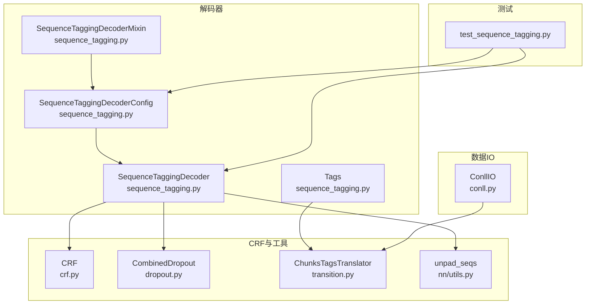
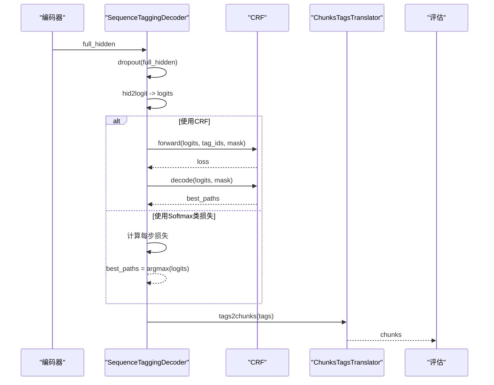
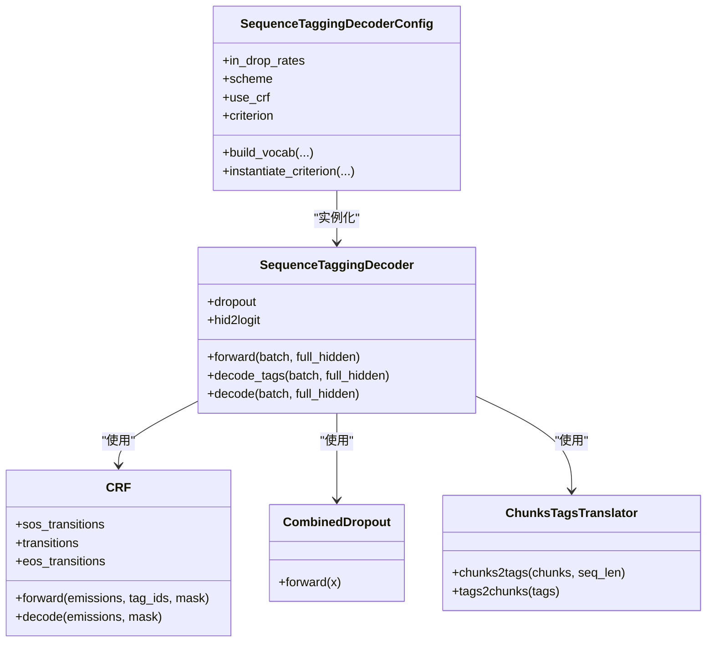
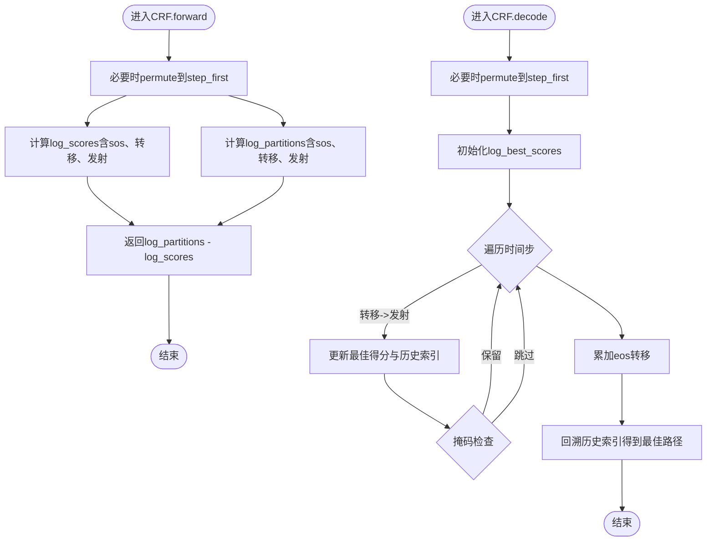
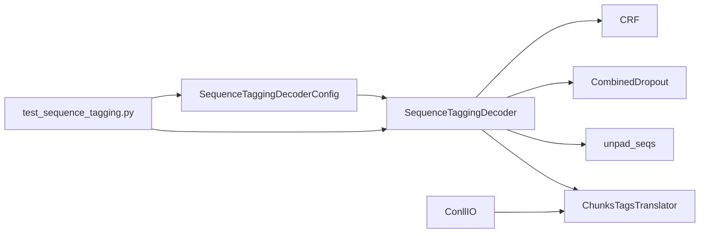

# 序列标注解码器

<cite>
**本文引用的文件列表**
- [sequence_tagging.py](file://eznlp/model/decoder/sequence_tagging.py)
- [crf.py](file://eznlp/nn/modules/crf.py)
- [conll.py](file://eznlp/io/conll.py)
- [transition.py](file://eznlp/utils/transition.py)
- [dropout.py](file://eznlp/nn/modules/dropout.py)
- [loss.py](file://eznlp/nn/modules/loss.py)
- [test_sequence_tagting.py](file://tests/model/test_sequence_tagging.py)
</cite>

## 目录
1. [引言](#引言)
2. [项目结构](#项目结构)
3. [核心组件](#核心组件)
4. [架构总览](#架构总览)
5. [详细组件分析](#详细组件分析)
6. [依赖关系分析](#依赖关系分析)
7. [性能考量](#性能考量)
8. [故障排查指南](#故障排查指南)
9. [结论](#结论)
10. [附录](#附录)

## 引言
本文件系统性地文档化了序列标注解码器（SequenceTaggingDecoder）的实现机制，重点阐述其如何基于编码器输出进行逐token标签预测；深入解析CRF层在解码过程中的作用，包括转移矩阵的学习与约束、维特比解码算法的应用场景；对比分析使用CRF与Softmax作为分类头时的性能差异与适用条件；并通过实际代码路径示例展示如何配置dropout率、标签映射表以及损失函数（如交叉熵或Dice/Focal等）；最后结合数据预处理模块（如conll.py）说明典型使用场景（如中文NER任务中的BMES标签序列生成）。

## 项目结构
围绕序列标注解码器的关键文件组织如下：
- 解码器主体：eznlp/model/decoder/sequence_tagging.py
- CRF模块：eznlp/nn/modules/crf.py
- 标签方案与转换：eznlp/utils/transition.py
- 数据IO与CoNLL格式处理：eznlp/io/conll.py
- Dropout组合策略：eznlp/nn/modules/dropout.py
- 损失函数族：eznlp/nn/modules/loss.py
- 测试用例：tests/model/test_sequence_tagging.py

图表来源
- [sequence_tagging.py](file://eznlp/model/decoder/sequence_tagging.py#L1-L198)
- [crf.py](file://eznlp/nn/modules/crf.py#L1-L204)
- [dropout.py](file://eznlp/nn/modules/dropout.py#L1-L92)
- [transition.py](file://eznlp/utils/transition.py#L1-L267)
- [conll.py](file://eznlp/io/conll.py#L1-L198)
- [test_sequence_tagging.py](file://tests/model/test_sequence_tagging.py#L1-L213)

章节来源
- [sequence_tagging.py](file://eznlp/model/decoder/sequence_tagging.py#L1-L198)
- [crf.py](file://eznlp/nn/modules/crf.py#L1-L204)
- [dropout.py](file://eznlp/nn/modules/dropout.py#L1-L92)
- [transition.py](file://eznlp/utils/transition.py#L1-L267)
- [conll.py](file://eznlp/io/conll.py#L1-L198)
- [test_sequence_tagging.py](file://tests/model/test_sequence_tagging.py#L1-L213)

## 核心组件
- SequenceTaggingDecoderConfig：负责构建标签词表、选择损失函数（CRF或非CRF）、实例化解码器。
- SequenceTaggingDecoder：执行前向损失计算与解码（CRF时调用维特比解码，否则使用argmax）。
- CRF：线性链条件随机场，提供负对数似然损失与维特比解码。
- ChunksTagsTranslator：在chunk与标签序列之间双向转换，支持多种标签方案（如BIOES、BMES、BILOU等）。
- ConllIO：读取CoNLL格式数据，产出tokens与chunks，供训练/评估使用。
- CombinedDropout：组合Dropout策略（标准Dropout、WordDropout、LockedDropout）。
- 损失函数族：包含SoftLabelCrossEntropy、SmoothLabelCrossEntropy、FocalLoss等。

章节来源
- [sequence_tagging.py](file://eznlp/model/decoder/sequence_tagging.py#L93-L198)
- [crf.py](file://eznlp/nn/modules/crf.py#L1-L204)
- [transition.py](file://eznlp/utils/transition.py#L1-L267)
- [conll.py](file://eznlp/io/conll.py#L1-L198)
- [dropout.py](file://eznlp/nn/modules/dropout.py#L1-L92)
- [loss.py](file://eznlp/nn/modules/loss.py#L1-L89)

## 架构总览
序列标注解码器的整体工作流如下：
- 编码器输出hidden经dropout与线性层映射为logits。
- 若使用CRF：以logits和gold标签序列计算负对数似然损失；解码阶段调用维特比解码得到最佳标签序列。
- 若使用Softmax类损失：按时间步对每个token的类别分布计算损失；解码阶段直接取argmax并去填充。
- 标签序列由ChunksTagsTranslator转换为chunk边界，用于评估与下游任务。

图表来源
- [sequence_tagging.py](file://eznlp/model/decoder/sequence_tagging.py#L157-L198)
- [crf.py](file://eznlp/nn/modules/crf.py#L69-L90)
- [transition.py](file://eznlp/utils/transition.py#L166-L216)

## 详细组件分析

### SequenceTaggingDecoderConfig与SequenceTaggingDecoder
- 配置项要点
  - in_drop_rates：控制dropout组合参数（标准、word、locked），默认(0.5, 0.0, 0.0)。
  - scheme：标签方案，默认"BIOES"，可切换至BIO1/BIO2/BMES/BILOU/OntoNotes等。
  - use_crf：是否启用CRF作为分类头。
  - criterion：当use_crf为真时返回"CRF"，否则委托父类选择损失函数。
- 实例化与构建词表
  - build_vocab：遍历数据集，将chunks转为标签序列，统计标签频次并生成idx2tag（以"<pad>"开头）。
  - instantiate_criterion：若为CRF，构造CRF对象；否则使用父类默认损失。
- 前向与解码
  - forward：CRF分支使用pad_sequence拼接gold标签，调用CRF的forward计算损失；非CRF分支按步计算损失并堆叠。
  - decode_tags：CRF分支调用CRF.decode进行维特比解码；非CRF分支取argmax并unpad。
  - decode：将标签序列转回chunks。

图表来源
- [sequence_tagging.py](file://eznlp/model/decoder/sequence_tagging.py#L93-L198)
- [crf.py](file://eznlp/nn/modules/crf.py#L1-L204)
- [dropout.py](file://eznlp/nn/modules/dropout.py#L1-L92)
- [transition.py](file://eznlp/utils/transition.py#L1-L267)

章节来源
- [sequence_tagging.py](file://eznlp/model/decoder/sequence_tagging.py#L93-L198)

### CRF层详解：转移矩阵学习与约束、维特比解码
- 参数与初始化
  - sos_transitions、transitions、eos_transitions均为可学习参数；当pad_idx存在时，对应位置被设置为极小值以抑制pad进入转移。
- 前向传播（损失）
  - 将emissions、tag_ids、mask从batch_last转为step_first（若需要）。
  - 计算log_scores（分子）与log_partitions（分母，logsumexp形式）。
  - 返回log_partitions - log_scores，即负对数似然。
- 解码（维特比）
  - 同样先permute到step_first。
  - 使用动态规划记录最优得分与历史转移索引，最终回溯得到最佳路径。
- 关键点
  - 转移矩阵在训练中通过反向传播更新；pad_idx处的转移被抑制，避免对损失产生影响。
  - 维特比解码在推理阶段替代softmax的贪心选择，考虑全局标签依赖，通常提升实体完整性。

图表来源
- [crf.py](file://eznlp/nn/modules/crf.py#L69-L204)

章节来源
- [crf.py](file://eznlp/nn/modules/crf.py#L1-L204)

### 标签方案与转换：BIOES/BMES/BILOU等
- ChunksTagsTranslator支持多方案映射与合法性检查：
  - chunks2tags：将chunk边界映射为标签序列，优先长实体，避免覆盖已有标签。
  - tags2chunks：根据标签转移规则（来自transition.xlsx）恢复chunk边界，支持类型断开策略。
  - check_transitions_legal：对相邻标签转移进行合法性校验。
- 与BMES的关系：当scheme为BMES或BILOU时，内部会映射到相应标签集合，确保与CRF转移矩阵一致。

章节来源
- [transition.py](file://eznlp/utils/transition.py#L1-L267)

### 数据预处理与集成：CoNLL格式与字符级展开
- ConllIO
  - 读取CoNLL文件，按句子/文档分隔符切分，提取tokens与tags。
  - tags_translator将tags转换为chunks，再由解码器配置的translator将chunks转为目标标签方案。
  - 提供flatten_to_characters方法，将token级标签扩展到字符级，便于字符级模型训练。
- 与SequenceTaggingDecoder的集成
  - 解码器通过Tags包装gold标签，调用translator完成chunks2tags映射，随后在forward中传入CRF或在decode中进行维特比解码。

章节来源
- [conll.py](file://eznlp/io/conll.py#L1-L198)
- [sequence_tagging.py](file://eznlp/model/decoder/sequence_tagging.py#L65-L91)

### Dropout配置与损失函数选择
- Dropout配置
  - SequenceTaggingDecoderConfig.in_drop_rates默认(0.5, 0.0, 0.0)，分别对应标准Dropout、WordDropout、LockedDropout。
  - CombinedDropout在forward中按需应用三种dropout策略。
- 损失函数选择
  - use_crf=True：使用CRF作为分类头，损失为负对数似然。
  - use_crf=False：使用父类默认损失（如交叉熵），或可引入其他损失（如FocalLoss、SmoothLabelCrossEntropy等，见loss.py）。
- Dice Loss集成
  - 仓库包含third_party/dice_loss_for_NLP，可在自定义损失或替换默认损失时使用（需在配置中显式指定）。

章节来源
- [sequence_tagging.py](file://eznlp/model/decoder/sequence_tagging.py#L93-L141)
- [dropout.py](file://eznlp/nn/modules/dropout.py#L1-L92)
- [loss.py](file://eznlp/nn/modules/loss.py#L1-L89)

### 性能差异与适用条件：CRF vs Softmax
- CRF优势
  - 显式建模标签间的转移约束，有利于实体连续性与边界一致性，在中文NER等任务上通常取得更稳定的整体性能。
  - 推理阶段采用维特比解码，避免局部贪心导致的非法标签串。
- Softmax劣势
  - 局部最优，缺乏全局约束，可能出现非法标签转移（如E后跟B）。
  - 在长序列与复杂嵌套场景下，整体F1可能不及CRF。
- 适用条件
  - CRF更适合严格标签方案（如BIOES/BMES/BILOU）与长序列标注任务。
  - Softmax适合快速baseline或资源受限场景，亦可配合label smoothing/focal loss缓解类别不平衡。

章节来源
- [sequence_tagging.py](file://eznlp/model/decoder/sequence_tagging.py#L157-L198)
- [crf.py](file://eznlp/nn/modules/crf.py#L1-L204)
- [loss.py](file://eznlp/nn/modules/loss.py#L1-L89)

### 典型使用场景：中文NER任务中的BMES标签生成
- 数据准备
  - 使用ConllIO读取CoNLL格式数据，tags_translator将tags转换为chunks。
  - 解码器配置scheme="BMES"，build_vocab生成标签映射表。
- 训练
  - use_crf=True时，CRF计算负对数似然；use_crf=False时，可选交叉熵或label smoothing/focal loss。
- 推理
  - CRF：decode_tags调用CRF.decode进行维特比解码；非CRF：argmax并unpad。
  - 将标签序列通过ChunksTagsTranslator.tags2chunks还原为chunk边界，用于评估与下游任务。

章节来源
- [conll.py](file://eznlp/io/conll.py#L1-L198)
- [sequence_tagging.py](file://eznlp/model/decoder/sequence_tagging.py#L93-L198)
- [transition.py](file://eznlp/utils/transition.py#L1-L267)

## 依赖关系分析
- 解码器对CRF的依赖：forward与decode均直接调用CRF的接口。
- 解码器对翻译器的依赖：训练时将chunks转为tags，推理时将tags转回chunks。
- Dropout组合策略：在训练阶段对隐藏状态施加正则化，有助于泛化。
- 测试用例覆盖多种架构与损失配置，验证batch一致性与可训练性。

图表来源
- [sequence_tagging.py](file://eznlp/model/decoder/sequence_tagging.py#L1-L198)
- [crf.py](file://eznlp/nn/modules/crf.py#L1-L204)
- [dropout.py](file://eznlp/nn/modules/dropout.py#L1-L92)
- [transition.py](file://eznlp/utils/transition.py#L1-L267)
- [conll.py](file://eznlp/io/conll.py#L1-L198)
- [test_sequence_tagging.py](file://tests/model/test_sequence_tagging.py#L1-L213)

章节来源
- [sequence_tagging.py](file://eznlp/model/decoder/sequence_tagging.py#L1-L198)
- [test_sequence_tagging.py](file://tests/model/test_sequence_tagging.py#L1-L213)

## 性能考量
- CRF在长序列与复杂边界上表现更稳健，但计算开销略高于Softmax；可通过mask高效处理变长序列。
- Dropout组合策略有助于缓解过拟合，建议在训练初期适度提高dropout率。
- 损失函数选择应结合数据分布与任务需求：类别不平衡可用focal loss；标签平滑可用smooth label cross entropy。

## 故障排查指南
- 标签非法
  - 症状：出现非法转移（如E后接B）。
  - 处理：确认标签方案与CRF转移矩阵一致；使用ChunksTagsTranslator.check_transitions_legal进行校验。
- pad对损失的影响
  - 症状：pad参与转移导致异常。
  - 处理：确保CRF初始化时pad_idx正确设置，且mask正确传递给forward/decode。
- 解码不一致
  - 症状：不同batch片段解码结果不衔接。
  - 处理：检查batch_first与step_first的维度转换逻辑，确保permute顺序一致。
- 评估指标异常
  - 症状：F1偏低或不稳定。
  - 处理：尝试CRF而非Softmax；调整标签方案（如从BIOES切换到BMES）；检查数据预处理与标签映射。

章节来源
- [crf.py](file://eznlp/nn/modules/crf.py#L1-L204)
- [transition.py](file://eznlp/utils/transition.py#L1-L267)
- [sequence_tagging.py](file://eznlp/model/decoder/sequence_tagging.py#L157-L198)

## 结论
SequenceTaggingDecoder通过线性映射与CRF/Softmax两类分类头，实现了对编码器输出的逐token标签预测。CRF在训练阶段以全局转移约束优化负对数似然，在推理阶段以维特比解码获得更合理的标签序列；Softmax则提供简单高效的baseline。结合ChunksTagsTranslator与ConllIO，系统能够灵活适配多种标签方案与数据格式，满足中文NER等任务的实际需求。通过合理配置dropout与损失函数，可在准确率与稳定性之间取得平衡。

## 附录
- 配置示例（以路径代替具体代码）
  - 设置标签方案与损失：[配置路径](file://eznlp/model/decoder/sequence_tagging.py#L93-L141)
  - 构建标签映射表：[构建词表](file://eznlp/model/decoder/sequence_tagging.py#L129-L138)
  - 前向损失计算（CRF）：[CRF前向](file://eznlp/nn/modules/crf.py#L69-L83)
  - 维特比解码（CRF）：[CRF解码](file://eznlp/nn/modules/crf.py#L84-L90)
  - Softmax解码（非CRF）：[解码逻辑](file://eznlp/model/decoder/sequence_tagging.py#L181-L194)
  - CoNLL数据读取与标签转换：[ConllIO](file://eznlp/io/conll.py#L1-L198)
  - 标签方案映射与合法性检查：[ChunksTagsTranslator](file://eznlp/utils/transition.py#L1-L267)
  - Dropout组合策略：[CombinedDropout](file://eznlp/nn/modules/dropout.py#L1-L92)
  - 损失函数族（含FocalLoss/SmoothLabelCrossEntropy）：[loss.py](file://eznlp/nn/modules/loss.py#L1-L89)
  - 测试用例（覆盖CRF/Softmax与多种架构）：[test_sequence_tagging.py](file://tests/model/test_sequence_tagging.py#L1-L213)