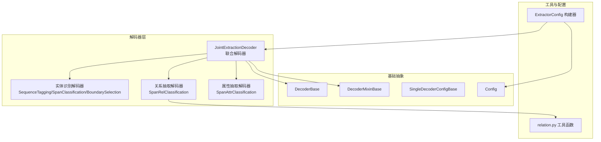
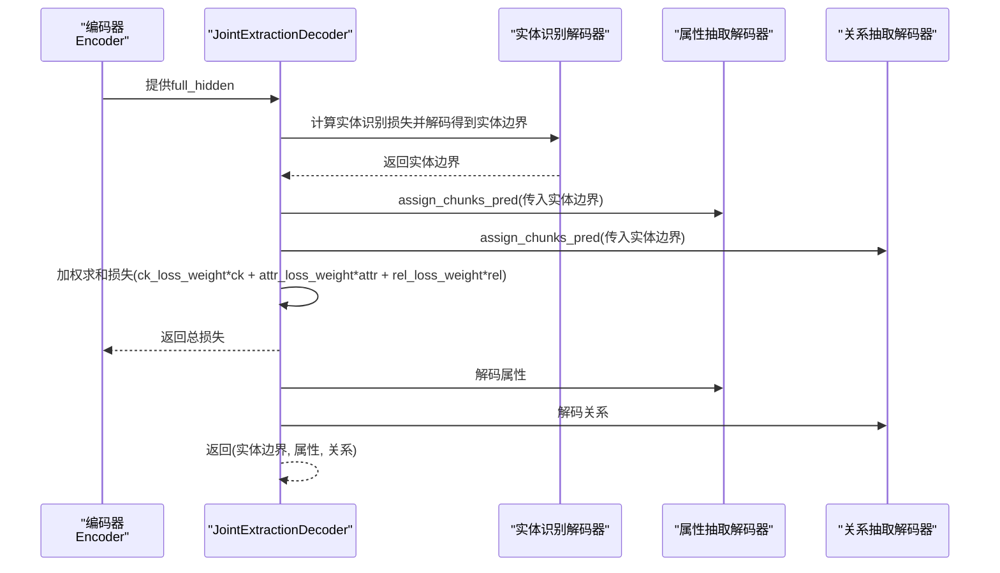
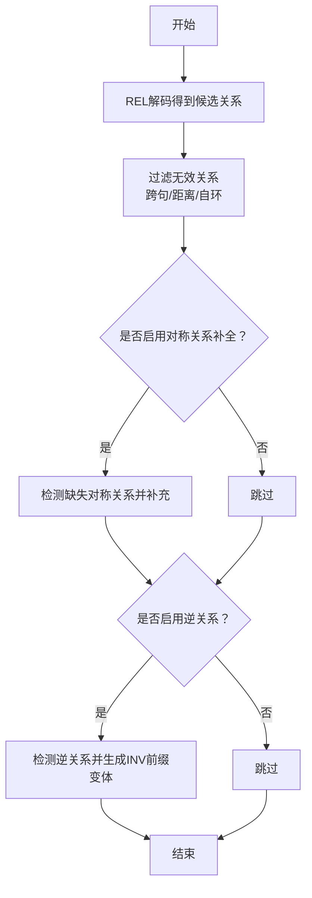
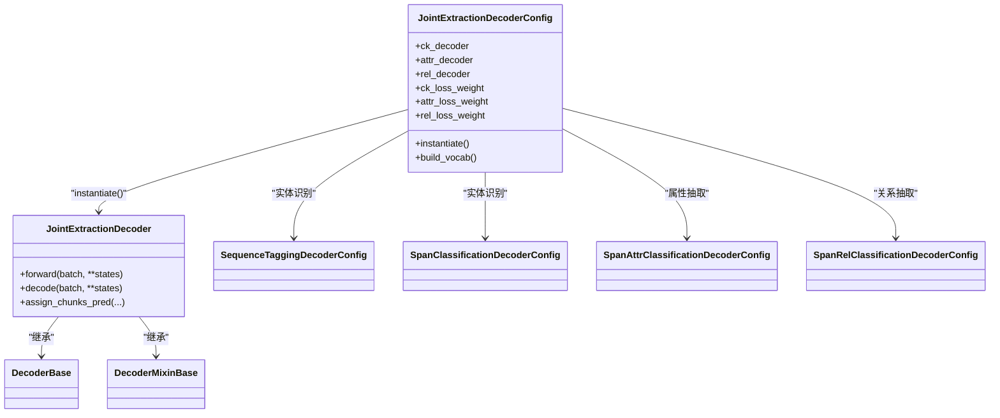

# 联合抽取解码器

<cite>
**本文引用的文件列表**
- [joint_extraction.py](file://eznlp/model/decoder/joint_extraction.py)
- [base.py](file://eznlp/model/decoder/base.py)
- [sequence_tagging.py](file://eznlp/model/decoder/sequence_tagging.py)
- [span_classification.py](file://eznlp/model/decoder/span_classification.py)
- [span_rel_classification.py](file://eznlp/model/decoder/span_rel_classification.py)
- [span_attr_classification.py](file://eznlp/model/decoder/span_attr_classification.py)
- [relation.py](file://eznlp/utils/relation.py)
- [config.py](file://eznlp/config.py)
- [extractor.py](file://eznlp/model/model/extractor.py)
- [test_joint_extraction.py](file://tests/model/test_joint_extraction.py)
</cite>

## 目录
1. [简介](#简介)
2. [项目结构](#项目结构)
3. [核心组件](#核心组件)
4. [架构总览](#架构总览)
5. [关键组件详解](#关键组件详解)
6. [依赖关系分析](#依赖关系分析)
7. [性能与资源考量](#性能与资源考量)
8. [故障排查指南](#故障排查指南)
9. [结论](#结论)
10. [附录：配置示例与任务依赖](#附录配置示例与任务依赖)

## 简介
本文件系统性解析JointExtractionDecoder的架构设计，重点阐述其如何在统一的编码器表示之上，对实体识别、关系抽取与属性抽取三个子任务进行端到端联合建模。文档覆盖以下要点：
- 共享编码器表示与多任务损失组合（加权求和）策略
- 实体识别分支与关系分类分支之间的协同机制（通过assign_chunks_pred传递预测边界）
- 配置层面的任务依赖关系与权重设置
- 结合relation.py工具函数的关系三元组生成与验证流程
- 在复杂信息抽取场景下的性能与资源消耗评估
- 减少误差传播的优势分析与实践建议

## 项目结构
联合抽取解码器位于模型解码器层，围绕DecoderBase/DecoderMixinBase抽象构建，配合多种单任务解码器实现多任务融合。整体结构如下：

图表来源
- [joint_extraction.py](file://eznlp/model/decoder/joint_extraction.py#L1-L193)
- [base.py](file://eznlp/model/decoder/base.py#L1-L114)
- [sequence_tagging.py](file://eznlp/model/decoder/sequence_tagging.py#L1-L198)
- [span_classification.py](file://eznlp/model/decoder/span_classification.py#L1-L344)
- [span_rel_classification.py](file://eznlp/model/decoder/span_rel_classification.py#L1-L585)
- [span_attr_classification.py](file://eznlp/model/decoder/span_attr_classification.py#L1-L386)
- [relation.py](file://eznlp/utils/relation.py#L1-L31)
- [extractor.py](file://eznlp/model/model/extractor.py#L1-L200)
- [config.py](file://eznlp/config.py#L1-L173)

章节来源
- [joint_extraction.py](file://eznlp/model/decoder/joint_extraction.py#L1-L193)
- [base.py](file://eznlp/model/decoder/base.py#L1-L114)
- [extractor.py](file://eznlp/model/model/extractor.py#L1-L200)

## 核心组件
- JointExtractionDecoderConfig：负责解析与组装实体识别、属性抽取、关系抽取三个子解码器，并提供多任务损失权重与维度一致性设置。
- JointExtractionDecoder：在forward中按顺序计算各子任务损失并加权求和；在decode中先得到实体边界，再依次为属性与关系子任务提供输入。
- 单任务解码器：
  - SequenceTagging/SpanClassification/BoundarySelection：实体识别分支
  - SpanAttrClassification：属性抽取分支
  - SpanRelClassification：关系抽取分支
- 关系工具：relation.py提供对称关系补全与逆关系检测等辅助能力。

章节来源
- [joint_extraction.py](file://eznlp/model/decoder/joint_extraction.py#L68-L193)
- [sequence_tagging.py](file://eznlp/model/decoder/sequence_tagging.py#L1-L198)
- [span_classification.py](file://eznlp/model/decoder/span_classification.py#L1-L344)
- [span_attr_classification.py](file://eznlp/model/decoder/span_attr_classification.py#L1-L386)
- [span_rel_classification.py](file://eznlp/model/decoder/span_rel_classification.py#L1-L585)
- [relation.py](file://eznlp/utils/relation.py#L1-L31)

## 架构总览
联合解码器采用“共享编码器表示 + 多任务损失加权”的范式，核心流程如下：

图表来源
- [joint_extraction.py](file://eznlp/model/decoder/joint_extraction.py#L154-L193)
- [span_rel_classification.py](file://eznlp/model/decoder/span_rel_classification.py#L406-L417)
- [span_attr_classification.py](file://eznlp/model/decoder/span_attr_classification.py#L250-L257)

## 关键组件详解

### 1) 联合解码器与配置
- 配置项
  - ck_decoder：实体识别子任务配置（支持字符串或具体配置类）
  - attr_decoder：属性抽取子任务配置（可选）
  - rel_decoder：关系抽取子任务配置（可选）
  - ck_loss_weight、attr_loss_weight、rel_loss_weight：多任务损失权重
  - share_embeddings：是否共享嵌入（注释提示PyTorch不推荐跨模块权重共享）
- 维度与词表
  - 统一in_dim给所有子解码器
  - build_vocab会逐一分发给子解码器
- 名称与有效性
  - name由子解码器名称拼接
  - valid要求至少两个子解码器有效

章节来源
- [joint_extraction.py](file://eznlp/model/decoder/joint_extraction.py#L68-L153)
- [config.py](file://eznlp/config.py#L1-L173)

### 2) 实体识别分支（CK）
- 支持三种主流实体识别方案：
  - SequenceTagging：基于标签序列的CRF或交叉熵
  - SpanClassification：基于跨度的分类（最大池化/注意力聚合）
  - BoundarySelection：边界选择策略
- 输出为实体边界集合，作为后续属性与关系解码的输入

章节来源
- [sequence_tagting.py](file://eznlp/model/decoder/sequence_tagging.py#L1-L198)
- [span_classification.py](file://eznlp/model/decoder/span_classification.py#L1-L344)

### 3) 属性抽取分支（ATTR）
- 输入来自实体边界（通过assign_chunks_pred注入）
- 可选与实体识别损失耦合（ck_loss_weight>0时，同时优化实体标签）
- 多标签分类默认开启，阈值过滤后输出属性三元组

章节来源
- [span_attr_classification.py](file://eznlp/model/decoder/span_attr_classification.py#L1-L386)
- [joint_extraction.py](file://eznlp/model/decoder/joint_extraction.py#L154-L193)

### 4) 关系抽取分支（REL）
- 输入来自实体边界（通过assign_chunks_pred注入）
- 支持上下文向量、大小/标签嵌入、融合模式（拼接/仿射）
- 可选与实体识别损失耦合（ck_loss_weight>0时，同时优化实体标签）
- 过滤逻辑：
  - 去除无效的头尾实体对（跨句、距离超限、自环等）
  - 可选逆关系（INV_REL_PREFIX）与对称关系补全（sym_rel_labels）

章节来源
- [span_rel_classification.py](file://eznlp/model/decoder/span_rel_classification.py#L1-L585)
- [relation.py](file://eznlp/utils/relation.py#L1-L31)
- [joint_extraction.py](file://eznlp/model/decoder/joint_extraction.py#L154-L193)

### 5) 多任务损失组合与误差传播控制
- 损失组合：总损失 = ck_loss_weight × ck_loss + attr_loss_weight × attr_loss + rel_loss_weight × rel_loss
- 误差传播控制：
  - 通过assign_chunks_pred将实体边界从CK分支显式传递至ATTR/REL，避免依赖弱监督或次优边界导致的级联误差
  - REL/ATTR可选择性地与CK共享损失（ck_loss_weight>0），进一步约束实体边界质量

章节来源
- [joint_extraction.py](file://eznlp/model/decoder/joint_extraction.py#L154-L193)
- [span_rel_classification.py](file://eznlp/model/decoder/span_rel_classification.py#L397-L405)
- [span_attr_classification.py](file://eznlp/model/decoder/span_attr_classification.py#L231-L249)

### 6) 关系三元组生成与验证流程
- 生成阶段：
  - REL解码得到候选关系集合（含标签、头实体、尾实体）
  - 过滤无效关系（跨句、距离超限、自环等）
- 验证/增强阶段：
  - 对称关系补全：若label属于sym_rel_labels且(尾, 头)不存在，则补充(label, 尾, 头)
  - 逆关系处理：根据INV_REL_PREFIX前缀与现有关系集，决定是否保留或转换逆关系
- 工具函数：
  - detect_missing_symmetric：检测缺失的对称关系
  - detect_inverse：检测并生成逆关系三元组
  - count_missing_symmetric/count_inverse：统计缺失与逆关系数量

图表来源
- [span_rel_classification.py](file://eznlp/model/decoder/span_rel_classification.py#L90-L126)
- [relation.py](file://eznlp/utils/relation.py#L1-L31)

## 依赖关系分析

图表来源
- [joint_extraction.py](file://eznlp/model/decoder/joint_extraction.py#L68-L193)
- [base.py](file://eznlp/model/decoder/base.py#L1-L114)

章节来源
- [joint_extraction.py](file://eznlp/model/decoder/joint_extraction.py#L68-L193)
- [base.py](file://eznlp/model/decoder/base.py#L1-L114)

## 性能与资源考量
- 计算开销
  - REL分支在assign_chunks_pred后枚举实体对，复杂度与实体数平方相关；可通过max_cp_dist、距离/大小嵌入等策略限制搜索空间
  - ATTR分支对每个实体独立打分，复杂度线性于实体数
- 内存占用
  - REL/ATTR可能引入额外嵌入（大小、标签）与融合层参数，需关注显存峰值
  - 使用拼接融合通常比仿射融合更节省参数，但表达能力略低
- 训练稳定性
  - 多任务损失权重需结合数据规模与任务难度调参；权重过大可能导致主导任务压制其他任务
  - ck_loss_weight>0可提升实体边界质量，但也会增加REL/ATTR的监督信号强度

[本节为通用性能讨论，无需列出具体文件来源]

## 故障排查指南
- 训练不稳定或收敛缓慢
  - 检查多任务损失权重是否平衡；必要时降低REL/ATTR权重
  - 若REL/ATTR与CK共享损失，确认ck_loss_weight合理
- 关系召回不足
  - 检查sym_rel_labels与comp_sym_rel配置是否正确
  - 检查use_inv_rel与existing_*标签集合是否覆盖目标关系类型
- 实体边界噪声影响关系/属性质量
  - 确认assign_chunks_pred已正确调用，确保REL/ATTR使用的是CK解码后的边界
  - 适当提高实体识别损失权重以稳定边界

章节来源
- [span_rel_classification.py](file://eznlp/model/decoder/span_rel_classification.py#L90-L126)
- [joint_extraction.py](file://eznlp/model/decoder/joint_extraction.py#L154-L193)

## 结论
JointExtractionDecoder通过“共享编码器表示 + 多任务损失加权 + 边界显式传递”的设计，在实体识别、关系抽取与属性抽取之间实现了高效协同。其在减少误差传播、提升整体抽取质量方面具有显著优势；同时通过灵活的配置与过滤机制，能够适配多样化的复杂信息抽取场景。

[本节为总结性内容，无需列出具体文件来源]

## 附录：配置示例与任务依赖

### A. 启用实体-关系联合训练模式
- 示例路径
  - [tests/model/test_joint_extraction.py](file://tests/model/test_joint_extraction.py#L67-L107)
- 关键点
  - 设置JointExtractionDecoderConfig，指定实体识别与关系抽取子任务
  - 可选加入属性抽取（attr_decoder），形成三任务联合
  - 通过ck_loss_weight/attr_loss_weight/rel_loss_weight调节多任务权重

章节来源
- [test_joint_extraction.py](file://tests/model/test_joint_extraction.py#L67-L107)
- [joint_extraction.py](file://eznlp/model/decoder/joint_extraction.py#L68-L153)

### B. 配置文件中的任务依赖关系
- 在ExtractorConfig中装配JointExtractionDecoderConfig，确保decoder.in_dim与编码器输出维度一致
- build_vocabs_and_dims会自动为decoder及其子解码器构建词表与维度

章节来源
- [extractor.py](file://eznlp/model/model/extractor.py#L122-L148)
- [joint_extraction.py](file://eznlp/model/decoder/joint_extraction.py#L146-L153)

### C. 关系三元组生成与验证要点
- 对称关系补全：当label属于sym_rel_labels且(尾, 头)不存在时，补充(label, 尾, 头)
- 逆关系：根据INV_REL_PREFIX与现有关系集，生成或合并逆关系三元组
- 过滤：跨句、距离超限、自环等无效三元组会被剔除

章节来源
- [span_rel_classification.py](file://eznlp/model/decoder/span_rel_classification.py#L90-L126)
- [relation.py](file://eznlp/utils/relation.py#L1-L31)