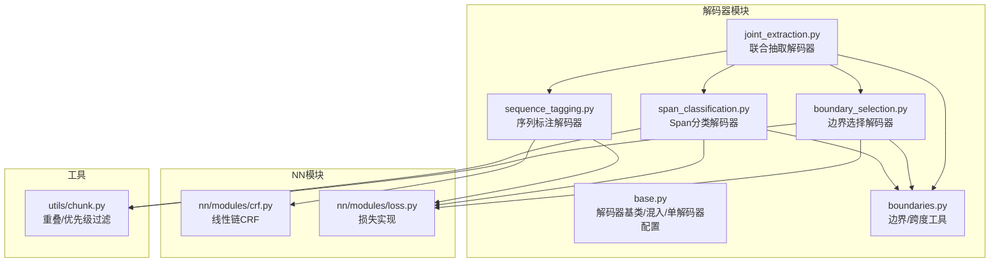
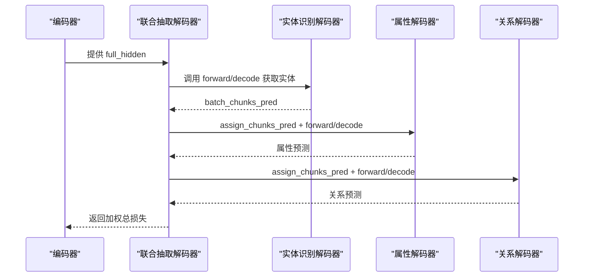
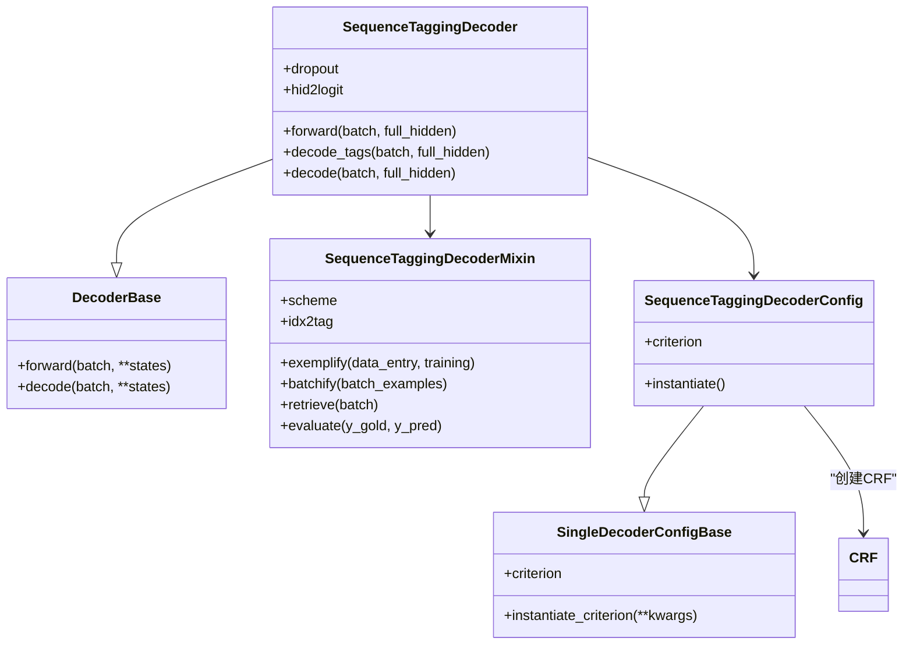
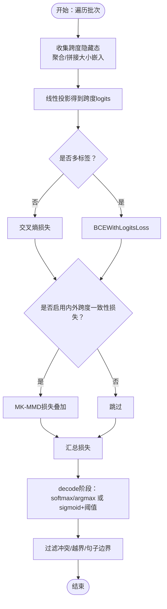
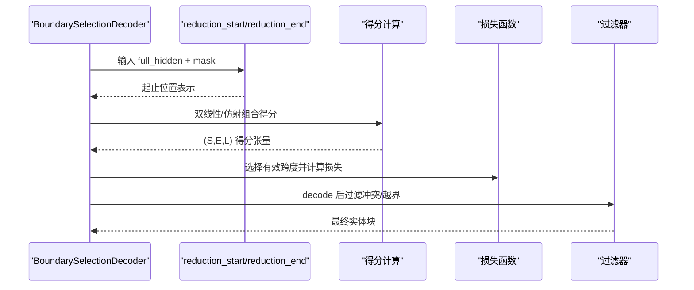
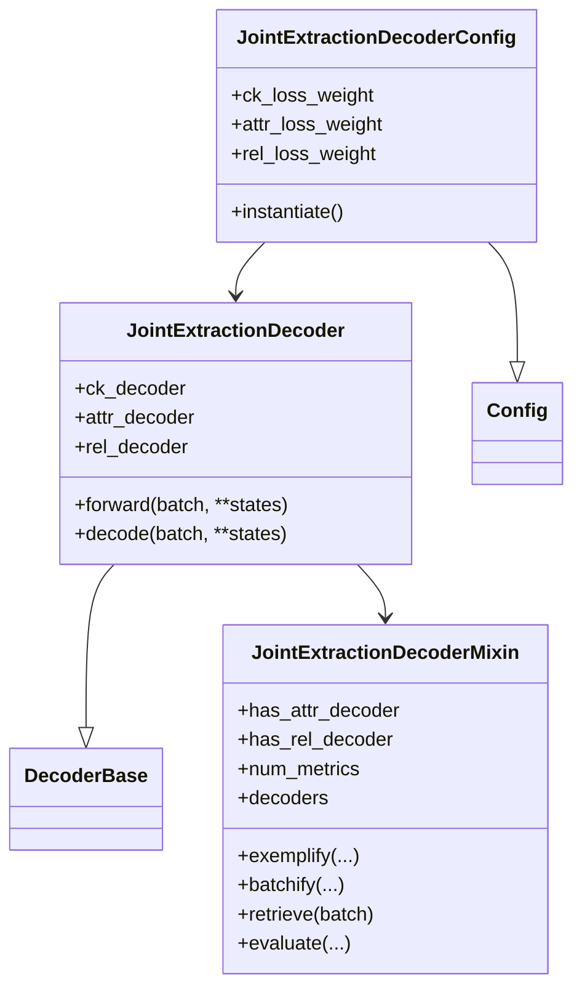
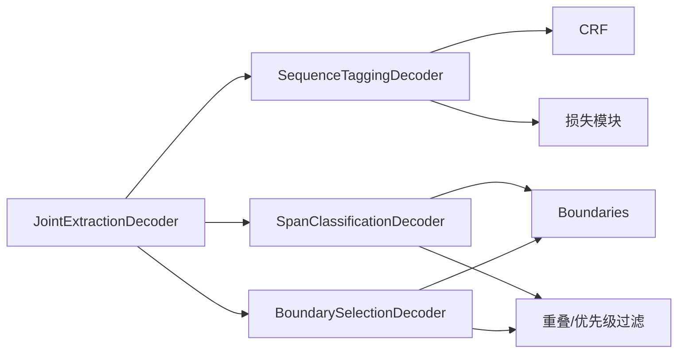

# 解码器

<cite>
**本文引用的文件**
- [eznlp/model/decoder/__init__.py](file://eznlp/model/decoder/__init__.py)
- [eznlp/model/decoder/base.py](file://eznlp/model/decoder/base.py)
- [eznlp/model/decoder/sequence_tagging.py](file://eznlp/model/decoder/sequence_tagging.py)
- [eznlp/model/decoder/span_classification.py](file://eznlp/model/decoder/span_classification.py)
- [eznlp/model/decoder/boundary_selection.py](file://eznlp/model/decoder/boundary_selection.py)
- [eznlp/model/decoder/joint_extraction.py](file://eznlp/model/decoder/joint_extraction.py)
- [eznlp/model/decoder/boundaries.py](file://eznlp/model/decoder/boundaries.py)
- [eznlp/nn/modules/crf.py](file://eznlp/nn/modules/crf.py)
- [eznlp/nn/modules/loss.py](file://eznlp/nn/modules/loss.py)
- [eznlp/utils/chunk.py](file://eznlp/utils/chunk.py)
- [tests/model/test_sequence_tagging.py](file://tests/model/test_sequence_tagging.py)
- [tests/model/test_span_classification.py](file://tests/model/test_span_classification.py)
- [tests/model/test_joint_extraction.py](file://tests/model/test_joint_extraction.py)
</cite>

## 目录
1. [简介](#简介)
2. [项目结构](#项目结构)
3. [核心组件](#核心组件)
4. [架构总览](#架构总览)
5. [详细组件分析](#详细组件分析)
6. [依赖分析](#依赖分析)
7. [性能考虑](#性能考虑)
8. [故障排查指南](#故障排查指南)
9. [结论](#结论)
10. [附录](#附录)

## 简介
本文件系统化梳理解码器模块，覆盖序列标注、Span分类、边界选择与联合抽取等多类解码策略。重点阐述：
- SequenceTaggingDecoder 如何使用 CRF 或 Softmax 进行序列标注，并将标签序列转换为实体块。
- SpanClassificationDecoder 如何对所有候选实体跨度进行分类，支持多标签与边界平滑等机制。
- JointExtractionDecoder 如何协调实体识别、属性抽取与关系抽取的联合任务，统一损失加权与预测输出。
- 解码器如何从编码器的隐藏状态中提取特征，构建分类头，计算损失并生成最终预测结果。
- 配置解码器的损失函数（交叉熵、Focal Loss、标签平滑、边界平滑）、dropout 率与分类头参数的方法。

## 项目结构
解码器模块位于 eznlp/model/decoder 下，采用“按功能分层”的组织方式：基础抽象（base）、具体解码器（sequence_tagging、span_classification、boundary_selection、joint_extraction 等），以及辅助工具（boundaries）与损失/CRF 实现。

图表来源
- [eznlp/model/decoder/base.py](file://eznlp/model/decoder/base.py#L1-L114)
- [eznlp/model/decoder/sequence_tagging.py](file://eznlp/model/decoder/sequence_tagging.py#L1-L198)
- [eznlp/model/decoder/span_classification.py](file://eznlp/model/decoder/span_classification.py#L1-L344)
- [eznlp/model/decoder/boundary_selection.py](file://eznlp/model/decoder/boundary_selection.py#L1-L384)
- [eznlp/model/decoder/joint_extraction.py](file://eznlp/model/decoder/joint_extraction.py#L1-L193)
- [eznlp/model/decoder/boundaries.py](file://eznlp/model/decoder/boundaries.py#L1-L353)
- [eznlp/nn/modules/crf.py](file://eznlp/nn/modules/crf.py#L1-L204)
- [eznlp/nn/modules/loss.py](file://eznlp/nn/modules/loss.py#L1-L89)
- [eznlp/utils/chunk.py](file://eznlp/utils/chunk.py#L1-L250)

章节来源
- [eznlp/model/decoder/__init__.py](file://eznlp/model/decoder/__init__.py#L1-L37)

## 核心组件
- 解码器基类与混入
  - DecoderBase：定义 forward 与 decode 接口，提供松散解码默认实现。
  - DecoderMixinBase：提供 retrieve、evaluate 与多指标封装；num_metrics 控制返回值维度。
  - SingleDecoderConfigBase：通用单解码器配置，支持多标签、置信度阈值、Focal Loss 与标签平滑等。
- 具体解码器
  - SequenceTaggingDecoder：序列标注，支持 CRF 或 Softmax；将标签序列转为实体块。
  - SpanClassificationDecoder：对所有候选跨度进行分类，支持多标签、边界平滑、大小嵌入、内外跨度一致性损失等。
  - BoundarySelectionDecoder：基于端点打分的边界选择，支持大小嵌入与边界平滑。
  - JointExtractionDecoder：组合实体识别、属性抽取、关系抽取，统一损失权重与预测输出。
- 辅助工具
  - Boundaries：将实体块映射到上三角矩阵/对角线格式的标签与掩码，支持边界/标签平滑。
  - CRF：线性链条件随机场，提供前向 NLL 损失与 Viterbi 解码。
  - 损失函数：SoftLabelCrossEntropyLoss、SmoothLabelCrossEntropyLoss、FocalLoss。

章节来源
- [eznlp/model/decoder/base.py](file://eznlp/model/decoder/base.py#L1-L114)
- [eznlp/model/decoder/sequence_tagging.py](file://eznlp/model/decoder/sequence_tagging.py#L1-L198)
- [eznlp/model/decoder/span_classification.py](file://eznlp/model/decoder/span_classification.py#L1-L344)
- [eznlp/model/decoder/boundary_selection.py](file://eznlp/model/decoder/boundary_selection.py#L1-L384)
- [eznlp/model/decoder/joint_extraction.py](file://eznlp/model/decoder/joint_extraction.py#L1-L193)
- [eznlp/model/decoder/boundaries.py](file://eznlp/model/decoder/boundaries.py#L1-L353)
- [eznlp/nn/modules/crf.py](file://eznlp/nn/modules/crf.py#L1-L204)
- [eznlp/nn/modules/loss.py](file://eznlp/nn/modules/loss.py#L1-L89)

## 架构总览
下图展示了联合抽取的整体流程：实体识别解码器先产生候选实体，随后属性与关系解码器在该基础上进行二次预测，并可共享权重与损失加权。

图表来源
- [eznlp/model/decoder/joint_extraction.py](file://eznlp/model/decoder/joint_extraction.py#L154-L193)
- [eznlp/model/decoder/sequence_tagging.py](file://eznlp/model/decoder/sequence_tagging.py#L143-L198)
- [eznlp/model/decoder/span_classification.py](file://eznlp/model/decoder/span_classification.py#L163-L344)
- [eznlp/model/decoder/boundary_selection.py](file://eznlp/model/decoder/boundary_selection.py#L201-L384)

## 详细组件分析

### 序列标注解码器（SequenceTaggingDecoder）
- 功能要点
  - 支持 CRF 或 Softmax 两种策略；CRF 使用线性链条件随机场，Softmax 使用交叉熵。
  - 将标签序列转换为实体块，支持多种标签方案（如 BIOES）。
  - 通过 CombinedDropout 与分类头 Linear 投影到标签维度。
- 关键流程
  - forward：根据是否使用 CRF 计算损失；CRF 使用 batch_first 的 emissions 与 pad_idx；Softmax 对每个样本分别计算。
  - decode：若 CRF 则 Viterbi 解码，否则取 argmax 并去填充；再将标签序列转为实体块。
- 配置项
  - in_drop_rates：输入 dropout 组合。
  - scheme：标签方案。
  - use_crf：是否启用 CRF。
  - fl_gamma/sl_epsilon：Focal Loss 或标签平滑参数由父类 SingleDecoderConfigBase 决定。
- 示例路径
  - [配置与实例化](file://eznlp/model/decoder/sequence_tagging.py#L93-L141)
  - [forward 与 decode](file://eznlp/model/decoder/sequence_tagging.py#L157-L198)
  - [CRF 实现](file://eznlp/nn/modules/crf.py#L1-L204)

图表来源
- [eznlp/model/decoder/sequence_tagging.py](file://eznlp/model/decoder/sequence_tagging.py#L1-L198)
- [eznlp/nn/modules/crf.py](file://eznlp/nn/modules/crf.py#L1-L204)
- [eznlp/model/decoder/base.py](file://eznlp/model/decoder/base.py#L1-L114)

章节来源
- [eznlp/model/decoder/sequence_tagging.py](file://eznlp/model/decoder/sequence_tagging.py#L1-L198)
- [eznlp/nn/modules/crf.py](file://eznlp/nn/modules/crf.py#L1-L204)
- [eznlp/nn/modules/loss.py](file://eznlp/nn/modules/loss.py#L1-L89)

### Span 分类解码器（SpanClassificationDecoder）
- 功能要点
  - 对所有候选跨度（上三角或对角线）进行分类，支持多标签与边界平滑。
  - 可选大小嵌入与内外跨度一致性损失（MK-MMD）。
  - 通过聚合器（池化/注意力）将跨度内的子词隐藏态汇总为跨度表示。
- 关键流程
  - get_logits：按样本收集跨度隐藏态，聚合后拼接大小嵌入，线性投影得到跨度分类 logits。
  - forward：对每个样本的跨度 logits 计算损失，可叠加内外跨度一致性损失。
  - decode：非多标签时取 softmax 后最大类别；多标签时 sigmoid 后按阈值筛选；最后过滤冲突与越界。
- 配置项
  - in_drop_rates、size_emb_dim、agg_mode、multilabel、sb_epsilon、nested_sampling_rate、inex_mkmmd_lambda 等。
- 示例路径
  - [配置与实例化](file://eznlp/model/decoder/span_classification.py#L27-L161)
  - [get_logits/forward/decode](file://eznlp/model/decoder/span_classification.py#L223-L344)
  - [边界/标签平滑与掩码](file://eznlp/model/decoder/boundaries.py#L1-L353)

图表来源
- [eznlp/model/decoder/span_classification.py](file://eznlp/model/decoder/span_classification.py#L163-L344)
- [eznlp/model/decoder/boundaries.py](file://eznlp/model/decoder/boundaries.py#L1-L353)
- [eznlp/nn/modules/loss.py](file://eznlp/nn/modules/loss.py#L1-L89)

章节来源
- [eznlp/model/decoder/span_classification.py](file://eznlp/model/decoder/span_classification.py#L1-L344)
- [eznlp/model/decoder/boundaries.py](file://eznlp/model/decoder/boundaries.py#L1-L353)
- [eznlp/utils/chunk.py](file://eznlp/utils/chunk.py#L1-L250)

### 边界选择解码器（BoundarySelectionDecoder）
- 功能要点
  - 通过端点两层映射（FFN/EncoderConfig）分别得到起止位置的表示，再以双线性/仿射方式组合得分。
  - 支持大小嵌入与边界平滑；可按上三角或对角线枚举跨度。
- 关键流程
  - compute_scores：对每个样本计算 (start, end, label) 得分张量。
  - forward：按掩码选择有效跨度，计算损失。
  - decode：非多标签时 softmax 后取最大类别；多标签时 sigmoid+阈值；最后过滤冲突与越界。
- 配置项
  - reduction（EncoderConfig）、size_emb_dim、sb_epsilon、neg_sampling_*、nested_sampling_rate 等。
- 示例路径
  - [配置与实例化](file://eznlp/model/decoder/boundary_selection.py#L92-L199)
  - [compute_scores/forward/decode](file://eznlp/model/decoder/boundary_selection.py#L257-L384)

图表来源
- [eznlp/model/decoder/boundary_selection.py](file://eznlp/model/decoder/boundary_selection.py#L201-L384)
- [eznlp/model/decoder/boundaries.py](file://eznlp/model/decoder/boundaries.py#L1-L353)

章节来源
- [eznlp/model/decoder/boundary_selection.py](file://eznlp/model/decoder/boundary_selection.py#L1-L384)
- [eznlp/model/decoder/boundaries.py](file://eznlp/model/decoder/boundaries.py#L1-L353)

### 联合抽取解码器（JointExtractionDecoder）
- 功能要点
  - 组合实体识别、属性抽取、关系抽取三个子解码器；支持独立训练与联合训练。
  - 通过 assign_chunks_pred 在属性/关系解码前注入实体预测；支持 ck/attr/rel 的损失加权。
  - num_metrics 由是否存在属性/关系解码器决定，统一 retrieve/evaluate。
- 关键流程
  - forward：先调用实体解码器，再按需调用属性/关系解码器并累加加权损失。
  - decode：先实体解码，再依次属性/关系解码，返回元组形式的多任务预测。
- 配置项
  - ck_decoder、attr_decoder、rel_decoder 类型与权重；share_embeddings（注释提示不建议跨模块共享权重）。
- 示例路径
  - [配置与实例化](file://eznlp/model/decoder/joint_extraction.py#L68-L152)
  - [forward/decode](file://eznlp/model/decoder/joint_extraction.py#L166-L193)

图表来源
- [eznlp/model/decoder/joint_extraction.py](file://eznlp/model/decoder/joint_extraction.py#L1-L193)
- [eznlp/model/decoder/base.py](file://eznlp/model/decoder/base.py#L1-L114)

章节来源
- [eznlp/model/decoder/joint_extraction.py](file://eznlp/model/decoder/joint_extraction.py#L1-L193)

### 文本分类解码器（补充）
- 用于文本分类任务，提供 pooling/attention 聚合与多标签/单标签损失选择。
- 与解码器体系一致，便于对比学习与统一接口。

章节来源
- [eznlp/model/decoder/text_classification.py](file://eznlp/model/decoder/text_classification.py#L1-L117)

## 依赖分析
- 组件耦合
  - SequenceTaggingDecoder 依赖 CRF 与损失模块；与标签翻译器配合将标签序列转为实体块。
  - Span/Boundary 解码器依赖 Boundaries 工具，将实体块映射为上三角/对角线格式的标签与掩码。
  - JointExtractionDecoder 依赖多个子解码器，形成“实体识别 -> 属性 -> 关系”的流水线。
- 外部依赖
  - 池化/注意力聚合器、大小嵌入、边界平滑/标签平滑损失、Focal Loss 等。

图表来源
- [eznlp/model/decoder/sequence_tagging.py](file://eznlp/model/decoder/sequence_tagging.py#L1-L198)
- [eznlp/model/decoder/span_classification.py](file://eznlp/model/decoder/span_classification.py#L1-L344)
- [eznlp/model/decoder/boundary_selection.py](file://eznlp/model/decoder/boundary_selection.py#L1-L384)
- [eznlp/model/decoder/joint_extraction.py](file://eznlp/model/decoder/joint_extraction.py#L1-L193)
- [eznlp/model/decoder/boundaries.py](file://eznlp/model/decoder/boundaries.py#L1-L353)
- [eznlp/utils/chunk.py](file://eznlp/utils/chunk.py#L1-L250)

## 性能考虑
- 跨步批一致性：测试用例验证了模型在不同批次切片上的隐藏态与损失一致性，确保时间维对齐与可重复性。
- 计算复杂度
  - Span/Boundary 解码器对所有跨度（上三角或对角线）进行评分，复杂度与序列长度平方成正比；可通过 max_span_size 限制跨度规模。
  - CRF 的 NLL 计算为线性链动态规划，复杂度与序列长度线性相关。
- 正则化与损失
  - Focal Loss 与标签平滑有助于缓解类别不平衡与过拟合。
  - 大小嵌入与内外跨度一致性损失可提升跨度表示的鲁棒性。
- 推理优化
  - decode 阶段可按阈值快速筛选候选，减少后续过滤开销；必要时可限制最大实体数量以避免内存峰值。

章节来源
- [tests/model/test_sequence_tagging.py](file://tests/model/test_sequence_tagging.py#L1-L213)
- [tests/model/test_span_classification.py](file://tests/model/test_span_classification.py#L1-L114)
- [tests/model/test_joint_extraction.py](file://tests/model/test_joint_extraction.py#L1-L211)

## 故障排查指南
- CRF 无法收敛或解码异常
  - 检查 pad_idx 设置与忽略索引；确认标签方案与 idx2tag 一致。
  - 参考 CRF 初始化与掩码处理逻辑。
- 多标签阈值设置不当
  - 若多标签预测全为 0，检查 conf_thresh 是否过高；或 none 标签概率导致被清零。
- 跨度越界/冲突
  - 使用 Boundaries 的 sub2ori_idx 与 tok2sent_idx 过滤非法跨度；利用重叠级别检测与优先级过滤。
- 联合抽取损失权重
  - ck/attr/rel 的 loss_weight 影响整体优化方向；建议从均衡权重开始，逐步调整。

章节来源
- [eznlp/nn/modules/crf.py](file://eznlp/nn/modules/crf.py#L1-L204)
- [eznlp/model/decoder/boundaries.py](file://eznlp/model/decoder/boundaries.py#L1-L353)
- [eznlp/utils/chunk.py](file://eznlp/utils/chunk.py#L1-L250)

## 结论
该解码器体系以统一的基类与配置抽象为核心，围绕序列标注、Span 分类与边界选择提供了灵活的实现，并通过联合抽取解码器将实体识别、属性与关系抽取整合为端到端流程。通过大小嵌入、边界/标签平滑、内外跨度一致性损失与多标签策略，系统在复杂数据集上具备良好的鲁棒性与可扩展性。建议在实际应用中结合数据分布合理设置损失函数、阈值与跨度规模，并在联合训练中平衡各任务权重。

## 附录
- 配置与使用示例（测试用例）
  - 序列标注：[测试用例](file://tests/model/test_sequence_tagging.py#L61-L171)
  - Span 分类：[测试用例](file://tests/model/test_span_classification.py#L53-L114)
  - 联合抽取：[测试用例](file://tests/model/test_joint_extraction.py#L65-L169)