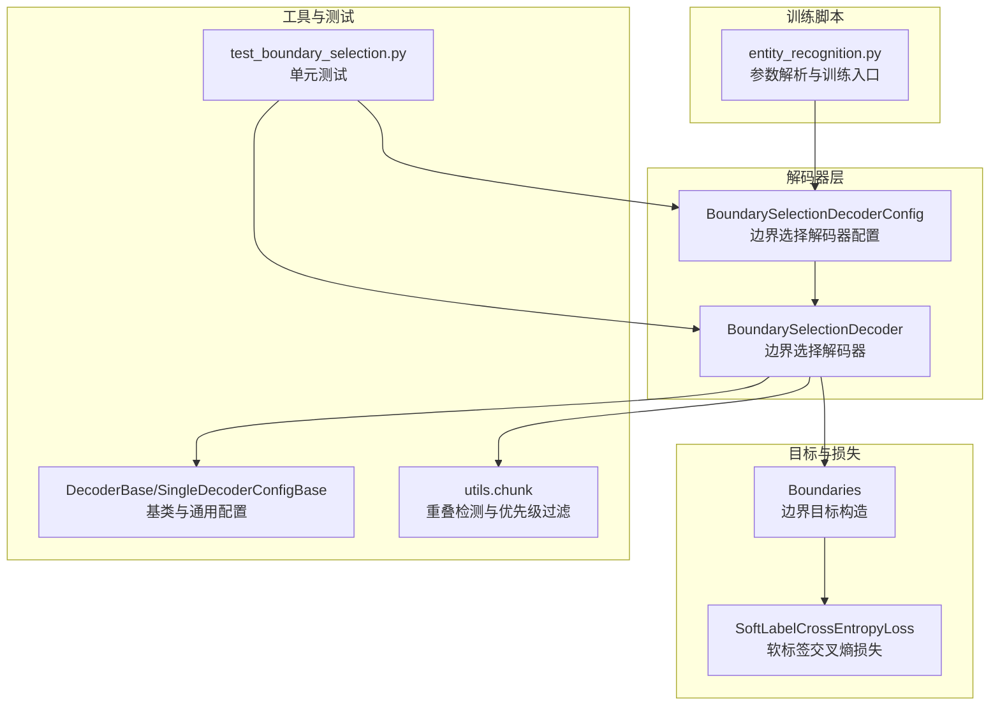
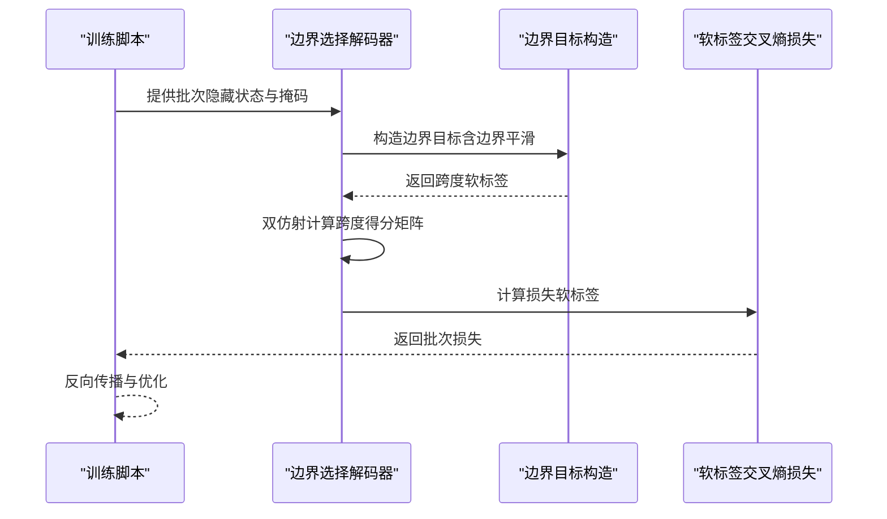
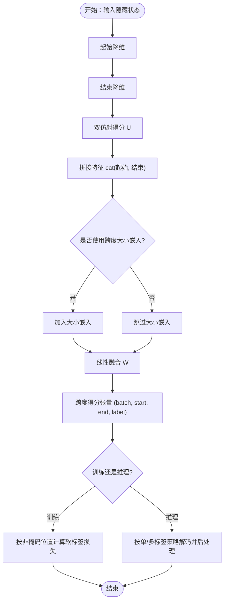
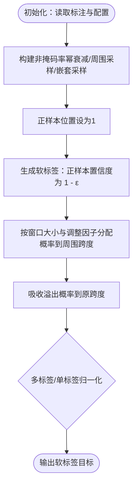
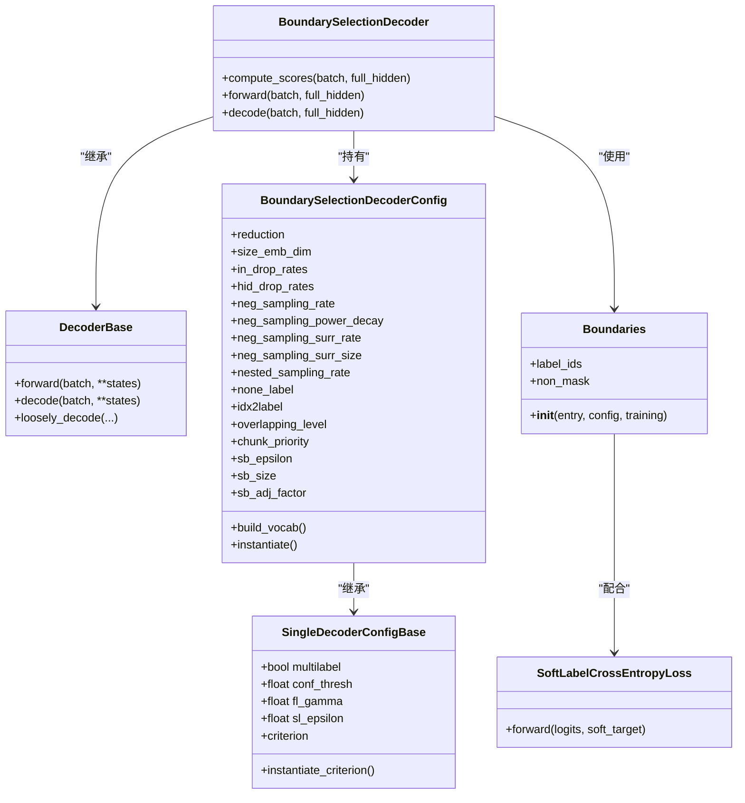

# 边界选择解码器

<cite>
**本文引用的文件列表**
- [boundary_selection.py](file://eznlp/model/decoder/boundary_selection.py)
- [boundaries.py](file://eznlp/model/decoder/boundaries.py)
- [base.py](file://eznlp/model/decoder/base.py)
- [test_boundary_selection.py](file://tests/model/test_boundary_selection.py)
- [entity_recognition.py](file://scripts/entity_recognition.py)
- [boundary-smoothing_zh.md](file://docs/boundary-smoothing_zh.md)
- [loss.py](file://eznlp/nn/modules/loss.py)
- [chunk.py](file://eznlp/utils/chunk.py)
</cite>

## 目录
1. [引言](#引言)
2. [项目结构](#项目结构)
3. [核心组件](#核心组件)
4. [架构总览](#架构总览)
5. [详细组件分析](#详细组件分析)
6. [依赖关系分析](#依赖关系分析)
7. [性能考量](#性能考量)
8. [故障排查指南](#故障排查指南)
9. [结论](#结论)
10. [附录](#附录)

## 引言
本文件系统性地文档化边界选择解码器（BoundarySelectionDecoder）的设计理念与实现细节，重点阐释其如何将中文命名实体识别（NER）建模为“起始位置与结束位置”的联合选择问题，并通过双仿射注意力或类似机制计算跨度得分矩阵。文档同时详解边界平滑（Boundary Smoothing）技术在缓解标注不一致方面的理论与实践应用，给出配置要点、阈值设定、边界对齐策略与后处理规则，并分析在模糊边界与长实体场景下的表现与调参建议。

## 项目结构
围绕边界选择解码器的关键文件与模块如下：
- 解码器主体与配置：boundary_selection.py
- 边界目标构造与边界平滑：boundaries.py
- 解码器基类与通用配置：base.py
- 训练脚本与参数入口：entity_recognition.py
- 测试用例：test_boundary_selection.py
- 边界平滑中文说明文档：boundary-smoothing_zh.md
- 损失函数模块：loss.py
- 实体重叠与优先级过滤：chunk.py

图表来源
- [boundary_selection.py](file://eznlp/model/decoder/boundary_selection.py#L91-L197)
- [boundary_selection.py](file://eznlp/model/decoder/boundary_selection.py#L200-L384)
- [boundaries.py](file://eznlp/model/decoder/boundaries.py#L90-L246)
- [loss.py](file://eznlp/nn/modules/loss.py#L11-L27)
- [entity_recognition.py](file://scripts/entity_recognition.py#L110-L244)
- [base.py](file://eznlp/model/decoder/base.py#L52-L114)
- [chunk.py](file://eznlp/utils/chunk.py#L1-L120)
- [test_boundary_selection.py](file://tests/model/test_boundary_selection.py#L1-L126)

章节来源
- [boundary_selection.py](file://eznlp/model/decoder/boundary_selection.py#L91-L197)
- [entity_recognition.py](file://scripts/entity_recognition.py#L110-L244)

## 核心组件
- 边界选择解码器配置（BoundarySelectionDecoderConfig）
  - 负责构建词表、最大长度、最大跨度大小ID、边界平滑参数等；支持多标签与单标签两种训练模式；实例化损失函数（含边界平滑软标签）。
- 边界选择解码器（BoundarySelectionDecoder）
  - 基于输入隐藏状态，分别对起始与结束位置进行降维，再以双仿射结构组合得到跨度得分张量；支持大小嵌入与掩码；提供训练与推理两阶段的解码逻辑。
- 目标构造与边界平滑（Boundaries）
  - 将标注转换为跨度级别的软标签目标，支持边界平滑窗口内概率分配与吸收、标签平滑叠加、非法位置概率吸收等。
- 训练脚本与参数入口（entity_recognition.py）
  - 提供边界选择解码器相关参数（如 sb_epsilon、sb_size、size_emb_dim、red_* 等），并可直接运行中文/英文数据集上的边界选择训练。

章节来源
- [boundary_selection.py](file://eznlp/model/decoder/boundary_selection.py#L91-L197)
- [boundary_selection.py](file://eznlp/model/decoder/boundary_selection.py#L200-L384)
- [boundaries.py](file://eznlp/model/decoder/boundaries.py#L90-L246)
- [entity_recognition.py](file://scripts/entity_recognition.py#L110-L244)

## 架构总览
边界选择解码器将实体识别建模为“起始位置×结束位置”的联合选择问题，通过双仿射注意力或类似机制计算跨度得分矩阵，再结合边界平滑与后处理规则进行训练与预测。

图表来源
- [entity_recognition.py](file://scripts/entity_recognition.py#L110-L244)
- [boundary_selection.py](file://eznlp/model/decoder/boundary_selection.py#L256-L323)
- [boundaries.py](file://eznlp/model/decoder/boundaries.py#L183-L246)
- [loss.py](file://eznlp/nn/modules/loss.py#L11-L27)

## 详细组件分析

### 边界选择解码器配置（BoundarySelectionDecoderConfig）
- 关键属性
  - reduction：预仿射维度降维编码器配置（默认FFN，隐藏维度150，层数1）。
  - size_emb_dim：跨度大小嵌入维度（默认25），用于将跨度长度映射到嵌入空间参与线性融合。
  - in_drop_rates/hid_drop_rates：输入与隐藏层dropout组合。
  - neg_sampling_*：负采样策略（率、幂衰减、周围区域额外采样、嵌套采样率）。
  - none_label/idx2label/overlapping_level/chunk_priority：标签体系、重叠级别检测、块优先级策略。
  - sb_epsilon/sb_size/sb_adj_factor：边界平滑超参数（平滑强度、窗口大小、调整因子）。
- 损失函数选择
  - 多标签：BCEWithLogitsLoss。
  - 单标签且启用边界平滑：SoftLabelCrossEntropyLoss。
  - 其他：标准交叉熵或标签平滑/焦点损失（由基类统一管理）。
- 词汇表与尺寸统计
  - 统计标签频次、检测重叠级别、计算最大跨度大小ID（基于覆盖率）与最大序列长度。

章节来源
- [boundary_selection.py](file://eznlp/model/decoder/boundary_selection.py#L91-L197)
- [base.py](file://eznlp/model/decoder/base.py#L52-L114)

### 边界选择解码器（BoundarySelectionDecoder）
- 计算跨度得分矩阵
  - 对输入隐藏状态分别经reduction_start/reduction_end降维，形成起始/结束表示。
  - 使用双仿射结构（U参数）与拼接特征（W参数）组合得到跨度得分张量，支持跨度大小嵌入参与融合。
  - 注册全局缓冲区：跨度大小ID与非掩码矩阵，确保仅对合法上三角跨度进行评分与损失计算。
- 训练阶段
  - 针对每个样本，依据Boundaries对象提供的非掩码位置与软标签计算损失（SoftLabelCrossEntropyLoss）。
- 推理阶段
  - 单标签：对上三角合法跨度取softmax后的最大类别作为预测，过滤none标签。
  - 多标签：对所有跨度取sigmoid，按置信度阈值筛选正样本，限制早期训练阶段的最大候选数，过滤none标签。
  - 后处理：依据子词对齐、句子边界、优先级策略（长度优先或置信度优先）进行冲突消解与过滤。

图表来源
- [boundary_selection.py](file://eznlp/model/decoder/boundary_selection.py#L256-L383)

章节来源
- [boundary_selection.py](file://eznlp/model/decoder/boundary_selection.py#L200-L384)

### 目标构造与边界平滑（Boundaries）
- 非掩码策略
  - 支持按跨度大小的负采样率幂衰减、周围区域额外采样、嵌套跨度采样率调整，保证正样本被保留且合理稀疏负样本分布。
- 软标签目标
  - 对每个正样本跨度，将其标签置为1 - sb_epsilon，然后按边界平滑窗口将剩余概率均匀分配给周围跨度，并吸收溢出概率至原跨度，确保总和不超过1。
  - 在多标签场景下，对none标签进行抑制；在单标签场景下，对溢出的多类型跨度进行归一化处理。
- 辅助工具
  - 提供对角化访问（diagonal_*）能力，便于按跨度大小对角遍历。

图表来源
- [boundaries.py](file://eznlp/model/decoder/boundaries.py#L136-L246)
- [loss.py](file://eznlp/nn/modules/loss.py#L11-L27)

章节来源
- [boundaries.py](file://eznlp/model/decoder/boundaries.py#L90-L246)

### 训练脚本与参数入口（entity_recognition.py）
- 参数组“decoder configurations”中包含边界选择相关参数：
  - ck_decoder：选择边界选择解码器。
  - multilabel/conf_thresh：多标签与置信度阈值。
  - fl_gamma/sl_epsilon：焦点损失与标签平滑超参数。
  - red_arch/red_dim/red_num_layers：预仿射降维架构与维度。
  - neg_sampling_*：负采样策略参数。
  - sb_epsilon/sb_size/sb_adj_factor：边界平滑超参数。
- 中文/英文数据集运行示例见文档与脚本注释。

章节来源
- [entity_recognition.py](file://scripts/entity_recognition.py#L110-L244)
- [boundary-smoothing_zh.md](file://docs/boundary-smoothing_zh.md#L40-L74)

### 测试用例与验证
- 单元测试覆盖：
  - 不同降维架构（FFN/LSTM）、大小嵌入开关、多标签与单标签、边界平滑参数组合的可训练性与批一致性。
  - 支持BERT-like预处理（子词分词）的数据加载与训练。
  - 无标注数据的预测流程验证。

章节来源
- [test_boundary_selection.py](file://tests/model/test_boundary_selection.py#L1-L126)

## 依赖关系分析
- 解码器配置与基类
  - BoundarySelectionDecoderConfig继承自SingleDecoderConfigBase，后者定义通用损失与阈值等配置；DecoderBase为抽象基类，约束forward与decode接口。
- 目标构造与损失
  - Boundaries在训练时生成软标签目标；SoftLabelCrossEntropyLoss用于计算软标签交叉熵损失。
- 工具与后处理
  - utils.chunk提供重叠检测与优先级过滤，用于冲突消解与边界一致性检查。

图表来源
- [base.py](file://eznlp/model/decoder/base.py#L52-L114)
- [boundary_selection.py](file://eznlp/model/decoder/boundary_selection.py#L91-L197)
- [boundary_selection.py](file://eznlp/model/decoder/boundary_selection.py#L200-L384)
- [boundaries.py](file://eznlp/model/decoder/boundaries.py#L90-L246)
- [loss.py](file://eznlp/nn/modules/loss.py#L11-L27)

章节来源
- [base.py](file://eznlp/model/decoder/base.py#L52-L114)
- [boundary_selection.py](file://eznlp/model/decoder/boundary_selection.py#L91-L197)
- [boundary_selection.py](file://eznlp/model/decoder/boundary_selection.py#L200-L384)
- [boundaries.py](file://eznlp/model/decoder/boundaries.py#L90-L246)
- [loss.py](file://eznlp/nn/modules/loss.py#L11-L27)

## 性能考量
- 计算复杂度
  - 跨度得分矩阵形状为(batch, seq_len, seq_len, num_labels)，上三角合法跨度数量约为O(N^2)，双仿射与拼接线性层带来额外开销。
- 内存与掩码
  - 通过注册非掩码矩阵与大小ID缓冲区，避免重复计算，减少无效跨度的损失与前向开销。
- 正则化与稳定性
  - CombinedDropout与Orthogonal初始化有助于稳定训练；SoftLabelCrossEntropyLoss与边界平滑共同缓解标注噪声。
- 调参建议
  - sb_epsilon与sb_size：在标注噪声较大时适度增大；中文长实体可适当增大窗口以提升鲁棒性。
  - size_emb_dim：对长跨度泛化有帮助，但会增加参数量与显存占用。
  - red_dim与red_num_layers：在BERT-like输入上通常150维与1层已足够，若显存紧张可降低。
  - conf_thresh：多标签场景下，早期训练可提高阈值以减少候选，后期可逐步降低。
  - neg_sampling_*：在正样本稀疏时提高neg_sampling_rate或开启周围采样，有助于稳定收敛。

[本节为通用指导，无需特定文件来源]

## 故障排查指南
- 训练不稳定或F1偏低
  - 检查sb_epsilon与sb_size设置是否合适；过大可能导致正样本置信度不足。
  - 检查conf_thresh是否过高导致召回不足；多标签场景建议先从较高阈值观察趋势再微调。
- 预测结果存在跨句或越界
  - 确认数据预处理中子词对齐与句子边界映射正确；解码阶段会过滤不在同一句子内的跨度。
- 长实体识别效果差
  - 增大sb_size或size_emb_dim；适当提高red_dim；必要时放宽neg_sampling_surr_rate以增强上下文感知。
- 显存不足
  - 降低red_dim、禁用size_emb_dim、减少batch_size或缩短最大序列长度；谨慎使用大型BERT变体。

章节来源
- [chunk.py](file://eznlp/utils/chunk.py#L1-L120)
- [boundary_selection.py](file://eznlp/model/decoder/boundary_selection.py#L324-L383)

## 结论
边界选择解码器通过将实体识别建模为起始与结束位置的联合选择问题，结合双仿射注意力与边界平滑技术，在中文NER等存在标注不一致的任务中展现出良好的鲁棒性与可扩展性。通过合理的参数配置与后处理策略，可在模糊边界与长实体场景下取得稳定性能。建议在实际部署中根据数据特点与资源约束进行系统性调优。

[本节为总结性内容，无需特定文件来源]

## 附录

### 配置与使用要点（路径指引）
- 训练脚本参数入口（边界选择相关）
  - 参数定义与默认值参考：[entity_recognition.py](file://scripts/entity_recognition.py#L110-L244)
- 边界平滑中文说明
  - 数据集与运行命令参考：[boundary-smoothing_zh.md](file://docs/boundary-smoothing_zh.md#L40-L74)
- 解码器配置与实现
  - 配置类与损失选择：[boundary_selection.py](file://eznlp/model/decoder/boundary_selection.py#L91-L197)
  - 解码器主体与得分计算：[boundary_selection.py](file://eznlp/model/decoder/boundary_selection.py#L200-L384)
- 目标构造与边界平滑
  - 软标签目标与非掩码策略：[boundaries.py](file://eznlp/model/decoder/boundaries.py#L136-L246)
- 损失函数
  - 软标签交叉熵损失：[loss.py](file://eznlp/nn/modules/loss.py#L11-L27)
- 测试用例
  - 多标签/单标签、边界平滑参数组合、BERT-like预处理等测试：[test_boundary_selection.py](file://tests/model/test_boundary_selection.py#L1-L126)