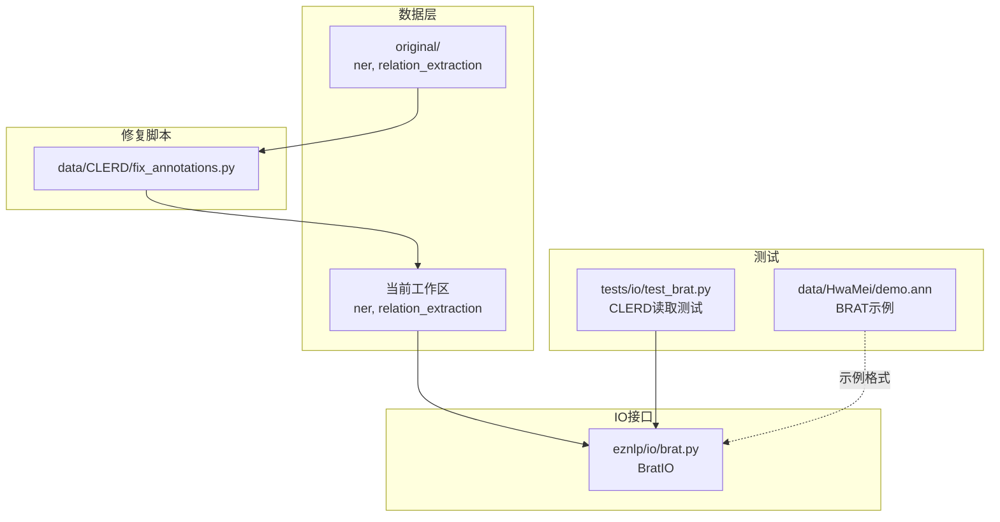
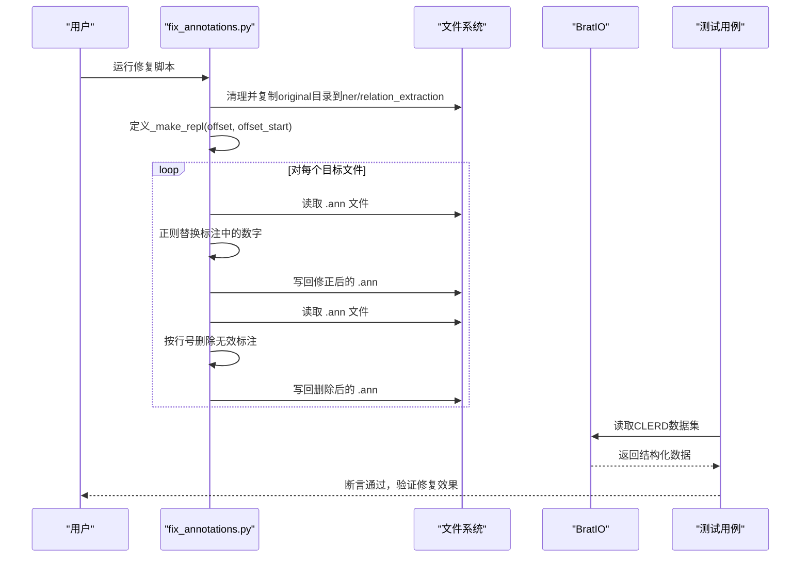
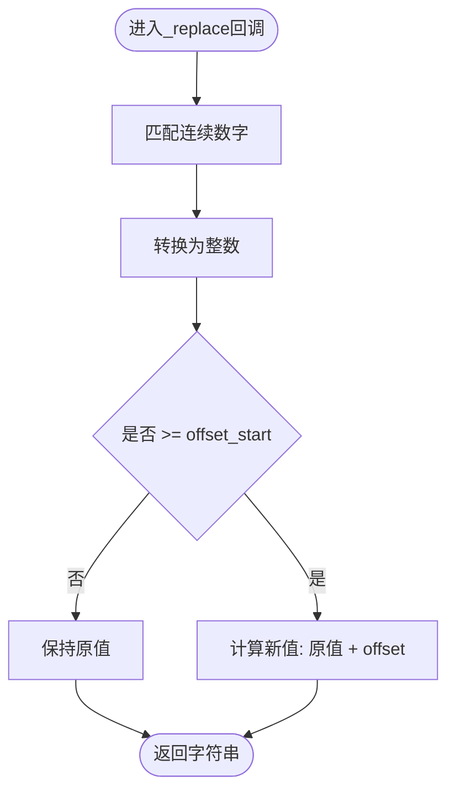
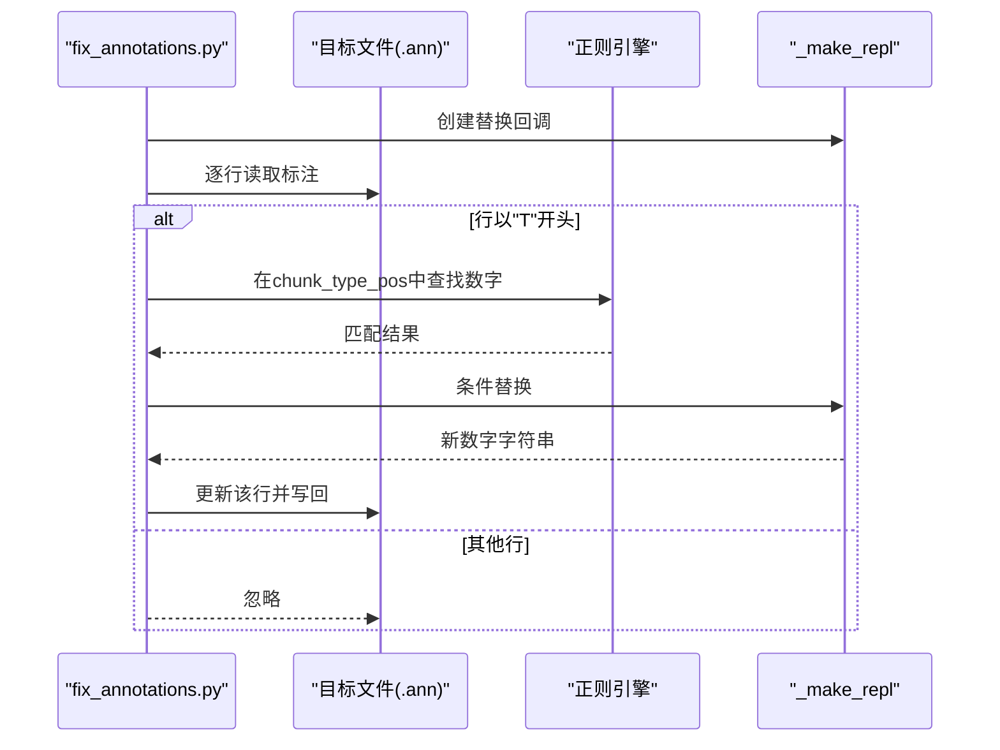
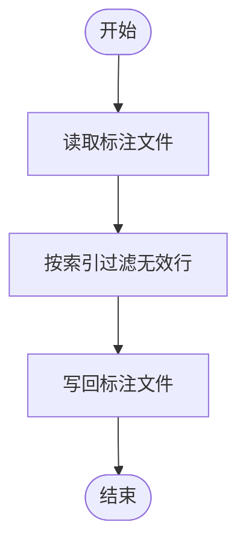
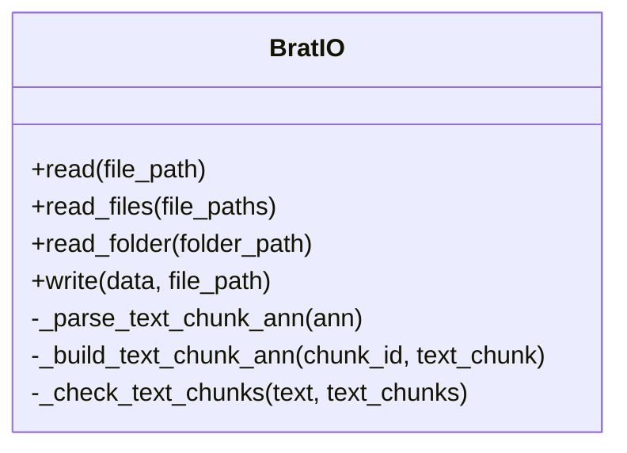
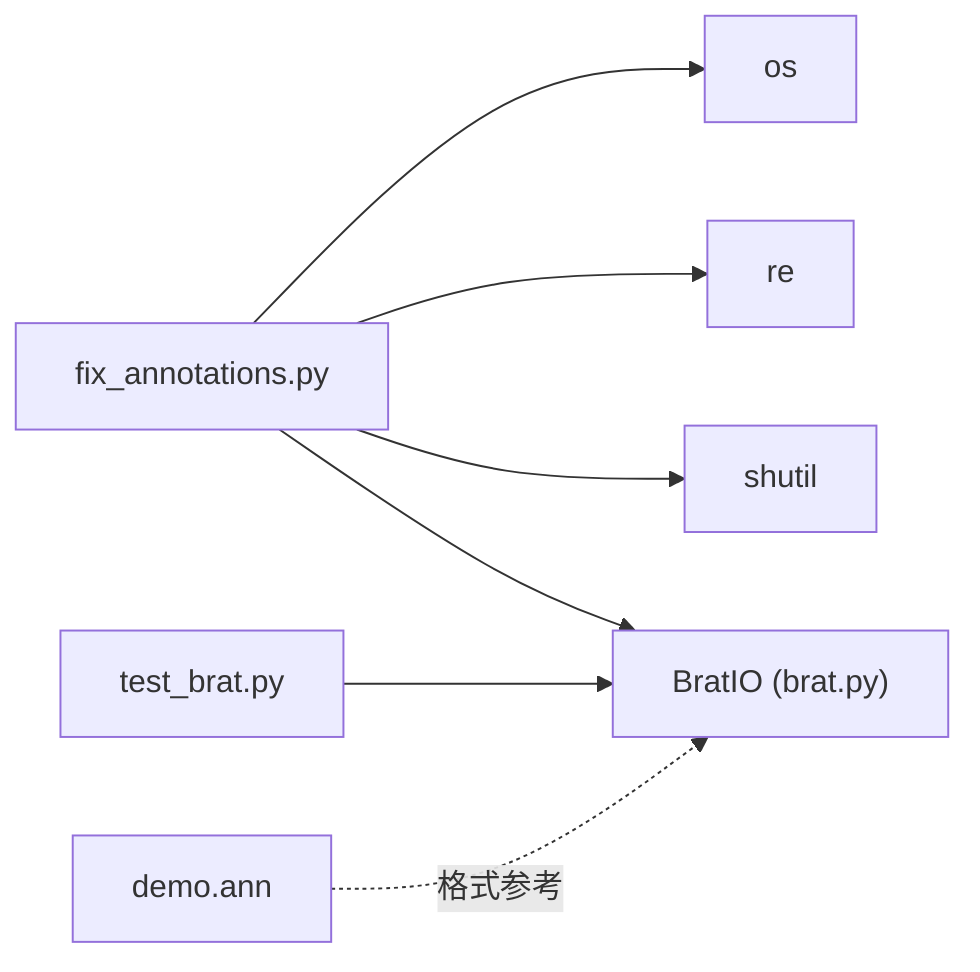

# CLERD数据集标注修复

<cite>
**本文引用的文件**
- [fix_annotations.py](file://data/CLERD/fix_annotations.py)
- [brat.py](file://eznlp/io/brat.py)
- [test_brat.py](file://tests/io/test_brat.py)
- [demo.ann](file://data/HwaMei/demo.ann)
</cite>

## 目录
1. [简介](#简介)
2. [项目结构](#项目结构)
3. [核心组件](#核心组件)
4. [架构总览](#架构总览)
5. [详细组件分析](#详细组件分析)
6. [依赖关系分析](#依赖关系分析)
7. [性能考量](#性能考量)
8. [故障排查指南](#故障排查指南)
9. [结论](#结论)
10. [附录](#附录)

## 简介
本文件系统化阐述CLERD数据集标注修复机制，重点覆盖两类关键操作：
- 字符偏移修正：通过正则表达式替换对BRAT标注中的起止位置数字进行批量修正，解决因文本拼接或截断导致的索引漂移问题。
- 无效标注删除：按行号列表从标注文件中剔除错误或异常的标注记录，确保训练数据一致性。

修复脚本在执行前会安全地复制原始数据（original目录下的ner与relation_extraction子目录），并在本地工作区生成可直接用于下游任务的数据副本，避免破坏源数据。

## 项目结构
CLERD修复脚本位于数据目录下，配合BRAT输入输出接口与测试用例共同构成完整的修复与验证闭环。

图表来源
- [fix_annotations.py](file://data/CLERD/fix_annotations.py#L1-L62)
- [brat.py](file://eznlp/io/brat.py#L75-L120)
- [test_brat.py](file://tests/io/test_brat.py#L18-L38)
- [demo.ann](file://data/HwaMei/demo.ann#L1-L35)

章节来源
- [fix_annotations.py](file://data/CLERD/fix_annotations.py#L1-L62)

## 核心组件
- 数据复制与隔离：脚本启动时先清空本地ner与relation_extraction目录，再从original目录复制对应子树，确保所有修改仅影响当前工作区，不污染源数据。
- 偏移修正器：通过工厂函数生成带状态的替换回调，依据offset与offset_start参数对匹配到的数字进行条件加法修正。
- 标注行删除：按给定的行号集合过滤掉对应的标注条目，实现对特定文件的局部清理。

章节来源
- [fix_annotations.py](file://data/CLERD/fix_annotations.py#L1-L62)

## 架构总览
修复流程由“复制-修正-删除-写回”四个阶段组成，BRAT格式解析与构建由BratIO负责，测试用例验证读取正确性。

图表来源
- [fix_annotations.py](file://data/CLERD/fix_annotations.py#L1-L62)
- [brat.py](file://eznlp/io/brat.py#L188-L208)
- [test_brat.py](file://tests/io/test_brat.py#L18-L38)

## 详细组件分析

### 组件A：字符偏移修正器_make_repl
- 设计模式：工厂函数返回闭包形式的替换回调，内部维护offset与offset_start的状态，实现对匹配数字的条件修正。
- 匹配与替换逻辑：
  - 使用正则匹配连续数字序列；
  - 将匹配结果转换为整型后与offset_start比较；
  - 若大于等于offset_start，则对索引执行加法修正（offset通常为负值，用于回退）；
  - 否则保持原值不变。
- 适用场景：当文本被插入或截断后，标注中的起止位置需要整体回退或前移，但仅对超过阈值的位置进行修正，避免误伤较小索引。

图表来源
- [fix_annotations.py](file://data/CLERD/fix_annotations.py#L12-L21)

章节来源
- [fix_annotations.py](file://data/CLERD/fix_annotations.py#L12-L21)

### 组件B：批量偏移修正流程
- 输入：文件路径、偏移量offset、起始阈值offset_start三元组列表。
- 处理：对每个目标文件，读取其对应的BRAT标注文件，遍历标注行，仅对以“T”开头的文本块标注执行替换。
- 输出：将修正后的标注写回原文件，完成批量索引调整。

图表来源
- [fix_annotations.py](file://data/CLERD/fix_annotations.py#L24-L47)
- [fix_annotations.py](file://data/CLERD/fix_annotations.py#L12-L21)

章节来源
- [fix_annotations.py](file://data/CLERD/fix_annotations.py#L24-L47)

### 组件C：无效标注删除
- 输入：文件路径与要删除的行号集合。
- 处理：读取标注文件，使用列表推导式过滤掉指定索引的行。
- 输出：将清洗后的标注写回原文件，实现对特定文件的局部修正。

图表来源
- [fix_annotations.py](file://data/CLERD/fix_annotations.py#L50-L62)

章节来源
- [fix_annotations.py](file://data/CLERD/fix_annotations.py#L50-L62)

### 组件D：BRAT格式解析与构建
- 文本块标注格式：以“T”开头的行包含三段，中间段为“类型 起始位置 结束位置”，两端分别为实体文本与标识符。
- 解析与构建：
  - 解析：将中间段按空格拆分为类型与起止位置，并转换为整数；
  - 构建：按相同格式重建文本块标注行。
- 一致性校验：读取后会对文本与标注进行一致性检查，确保索引与文本切片一致。

图表来源
- [brat.py](file://eznlp/io/brat.py#L75-L120)
- [brat.py](file://eznlp/io/brat.py#L188-L208)

章节来源
- [brat.py](file://eznlp/io/brat.py#L75-L120)
- [brat.py](file://eznlp/io/brat.py#L188-L208)

### 组件E：修复前后对比与验证
- 测试用例通过BratIO读取CLERD数据集的训练/验证/测试集，统计实体数量与关系数量，断言修复后的数据集规模与质量符合预期。
- 示例BRAT标注文件展示了标准的“T标识符 类型 起止位置 实体文本”的格式，便于理解修复前后字段含义。

章节来源
- [test_brat.py](file://tests/io/test_brat.py#L18-L38)
- [demo.ann](file://data/HwaMei/demo.ann#L1-L35)

## 依赖关系分析
- fix_annotations.py依赖于Python标准库的os、re、shutil，用于文件系统操作、正则匹配与目录复制。
- BratIO作为BRAT格式的统一入口，承担解析与构建职责，测试用例依赖其读取能力验证修复效果。
- 修复脚本与BratIO之间通过BRAT文件格式耦合，确保修复后的标注能被正确读取。

图表来源
- [fix_annotations.py](file://data/CLERD/fix_annotations.py#L1-L62)
- [brat.py](file://eznlp/io/brat.py#L75-L120)
- [test_brat.py](file://tests/io/test_brat.py#L18-L38)
- [demo.ann](file://data/HwaMei/demo.ann#L1-L35)

章节来源
- [fix_annotations.py](file://data/CLERD/fix_annotations.py#L1-L62)
- [brat.py](file://eznlp/io/brat.py#L75-L120)
- [test_brat.py](file://tests/io/test_brat.py#L18-L38)

## 性能考量
- 正则替换复杂度：对每条标注行执行一次正则匹配，整体复杂度近似O(N)，其中N为标注行数。
- 列表过滤复杂度：按索引过滤无效行，复杂度O(M)，其中M为待删除行数。
- I/O成本：读写文件为瓶颈，建议在大批量修复时合并写入，减少磁盘往返次数。
- 内存占用：一次性读取文件行列表，内存占用与文件大小线性相关。

## 故障排查指南
- 修复后读取异常
  - 现象：BratIO读取时报错或实体/关系数量异常。
  - 排查要点：确认标注文件是否仍遵循“T标识符 类型 起止位置 实体文本”的格式；检查起止位置是否为整数且满足起始位置小于结束位置。
  - 参考：BratIO的解析与一致性校验逻辑。
- 偏移修正过度
  - 现象：部分实体位置被错误回退。
  - 排查要点：核对offset与offset_start参数设置；仅对超过阈值的位置进行修正。
- 删除行号越界
  - 现象：删除无效行时报错或删除范围不正确。
  - 排查要点：确认行号集合与实际文件行数一致；注意索引从0开始。

章节来源
- [brat.py](file://eznlp/io/brat.py#L188-L208)
- [fix_annotations.py](file://data/CLERD/fix_annotations.py#L24-L62)

## 结论
本修复机制通过“复制隔离+正则条件替换+按行过滤”的组合策略，有效解决了CLERD数据集中由于文本拼接或截断导致的标注索引漂移与无效标注问题。结合BratIO的解析与测试用例的验证，确保了修复过程的可追溯性与数据质量的稳定性。

## 附录

### 修复案例与参数说明
- 偏移修正案例
  - 文件：relation_extraction/Training/1122.txt 对应的 .ann
  - 参数：offset=-1, offset_start=2603
  - 作用：仅对起止位置≥2603的数字执行减1修正，避免对较小索引产生误改。
- 偏移修正案例
  - 文件：relation_extraction/Training/898.txt 对应的 .ann
  - 参数：offset=-1, offset_start=329 与 offset_start=2993（同一文件两次不同阈值）
  - 作用：针对同一文件内不同区域的索引漂移分别进行修正。
- 无效标注删除案例
  - 文件：relation_extraction/Training/1108.txt 对应的 .ann
  - 参数：drop_indexes=[292]
  - 作用：删除第293行（索引从0开始）的标注。
- 无效标注删除案例
  - 文件：relation_extraction/Training/959.txt 对应的 .ann
  - 参数：drop_indexes=range(197, 225)
  - 作用：删除第198至225行之间的标注（含边界）。
- 无效标注删除案例
  - 文件：relation_extraction/Training/980.txt 对应的 .ann
  - 参数：drop_indexes=[143]
  - 作用：删除第144行的标注。

章节来源
- [fix_annotations.py](file://data/CLERD/fix_annotations.py#L24-L62)

### BRAT格式要点
- 文本块标注行格式：以“T”开头，包含“标识符 类型 起止位置 实体文本”四段，其中起止位置为整数。
- 关键字段
  - offset/offset_start：用于控制正则替换的生效范围与修正幅度，前者决定加法修正量，后者决定最小阈值。
  - 行号集合：用于定位并删除特定标注行，需与文件实际行数保持一致。

章节来源
- [demo.ann](file://data/HwaMei/demo.ann#L1-L35)
- [brat.py](file://eznlp/io/brat.py#L75-L120)