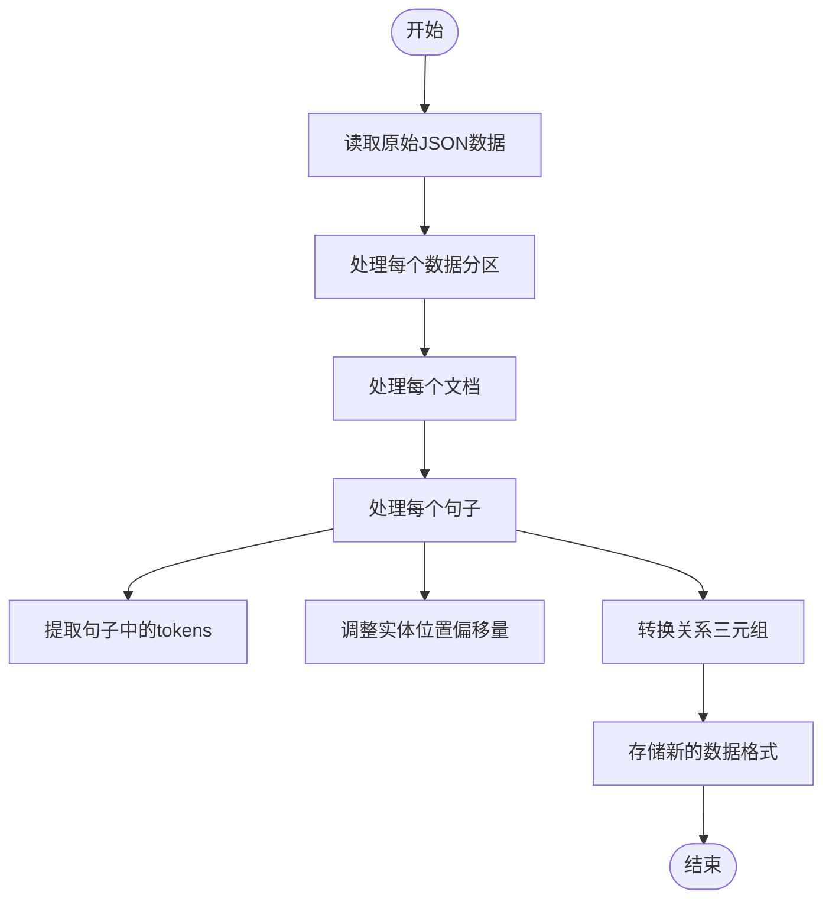
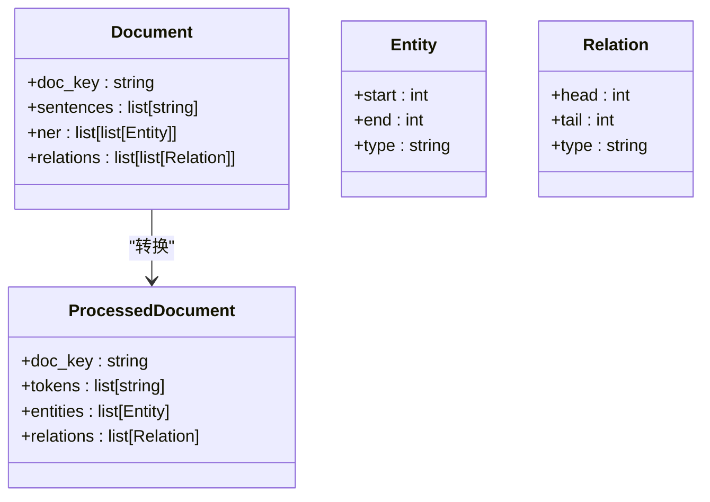

# SciERC数据集格式转换

<cite>
**本文档引用的文件**   
- [scierc-luan2018emnlp-process.py](file://data/SciERC/scierc-luan2018emnlp-process.py)
- [json.py](file://eznlp/io/json.py)
- [dataset.py](file://eznlp/dataset.py)
</cite>

## 目录
1. [引言](#引言)
2. [格式转换流程](#格式转换流程)
3. [字段生成逻辑](#字段生成逻辑)
4. [输入输出示例](#输入输出示例)
5. [结论](#结论)

## 引言
SciERC数据集是一种用于科学领域信息抽取的基准数据集，包含实体识别和关系抽取任务。本文档详细说明scierc-luan2018emnlp-process.py脚本如何将原始JSON格式数据重构为模型可读的标准化格式。该转换过程包括按句子分割文档、重新计算实体位置偏移量，以及将关系三元组从绝对索引转换为实体列表中的相对索引。

**Section sources**
- [scierc-luan2018emnlp-process.py](file://data/SciERC/scierc-luan2018emnlp-process.py)

## 格式转换流程
scierc-luan2018emnlp-process.py脚本实现了从原始SciERC数据格式到模型可读格式的转换。转换流程主要包括以下步骤：

1. **按句子分割文档**：原始数据中的文档包含多个句子，脚本将每个句子作为独立的样本处理。
2. **重新计算实体位置偏移量**：由于按句子分割，需要重新计算实体在句子中的起始和结束位置。
3. **转换关系三元组**：将关系三元组从绝对索引转换为实体列表中的相对索引。



**Diagram sources **
- [scierc-luan2018emnlp-process.py](file://data/SciERC/scierc-luan2018emnlp-process.py#L1-L42)

**Section sources**
- [scierc-luan2018emnlp-process.py](file://data/SciERC/scierc-luan2018emnlp-process.py#L1-L42)

## 字段生成逻辑
### doc_key字段
`doc_key`字段用于标识文档的唯一性。在转换过程中，每个句子的`doc_key`保持不变，仍然指向原始文档的标识符。

### tokens字段
`tokens`字段包含句子中的所有词元。脚本从原始数据的`sentences`字段中提取当前句子的词元。

### entities字段
`entities`字段包含句子中的所有实体。每个实体包含起始位置、结束位置和类型。脚本通过减去当前句子的起始位置来重新计算实体的位置偏移量。

### relations字段
`relations`字段包含句子中的所有关系三元组。每个关系三元组包含关系类型、头实体和尾实体。脚本通过查找实体在实体列表中的索引来转换关系三元组。



**Diagram sources **
- [scierc-luan2018emnlp-process.py](file://data/SciERC/scierc-luan2018emnlp-process.py#L1-L42)
- [json.py](file://eznlp/io/json.py#L21-L244)

**Section sources**
- [scierc-luan2018emnlp-process.py](file://data/SciERC/scierc-luan2018emnlp-process.py#L1-L42)
- [json.py](file://eznlp/io/json.py#L21-L244)

## 输入输出示例
### 输入数据结构
```json
{
    "doc_key": "doc1",
    "sentences": [
        ["This", "is", "a", "test", "sentence", "."],
        ["Another", "sentence", "here", "."]
    ],
    "ner": [
        [
            [0, 3, "EntityA"],
            [4, 5, "EntityB"]
        ],
        [
            [0, 1, "EntityC"]
        ]
    ],
    "relations": [
        [
            [0, 3, 4, 5, "RelationA"]
        ],
        []
    ]
}
```

### 输出数据结构
```json
[
    {
        "doc_key": "doc1",
        "tokens": ["This", "is", "a", "test", "sentence", "."],
        "entities": [
            {"start": 0, "end": 3, "type": "EntityA"},
            {"start": 4, "end": 5, "type": "EntityB"}
        ],
        "relations": [
            {"type": "RelationA", "head": 0, "tail": 1}
        ]
    },
    {
        "doc_key": "doc1",
        "tokens": ["Another", "sentence", "here", "."],
        "entities": [
            {"start": 0, "end": 1, "type": "EntityC"}
        ],
        "relations": []
    }
]
```

**Section sources**
- [scierc-luan2018emnlp-process.py](file://data/SciERC/scierc-luan2018emnlp-process.py#L1-L42)

## 结论
scierc-luan2018emnlp-process.py脚本成功地将原始SciERC数据集转换为模型可读的标准化格式。通过按句子分割文档、重新计算实体位置偏移量以及转换关系三元组，该脚本确保了数据的一致性和可用性。这种转换对于训练和评估信息抽取模型至关重要。

**Section sources**
- [scierc-luan2018emnlp-process.py](file://data/SciERC/scierc-luan2018emnlp-process.py#L1-L42)