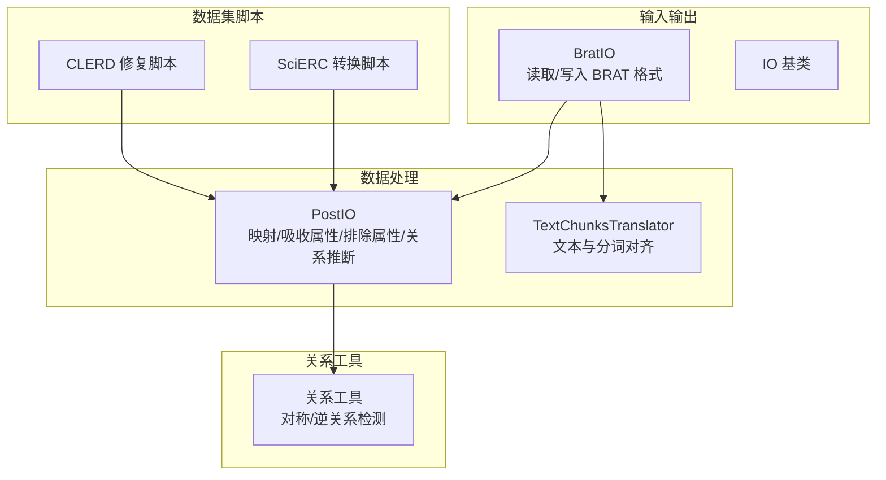
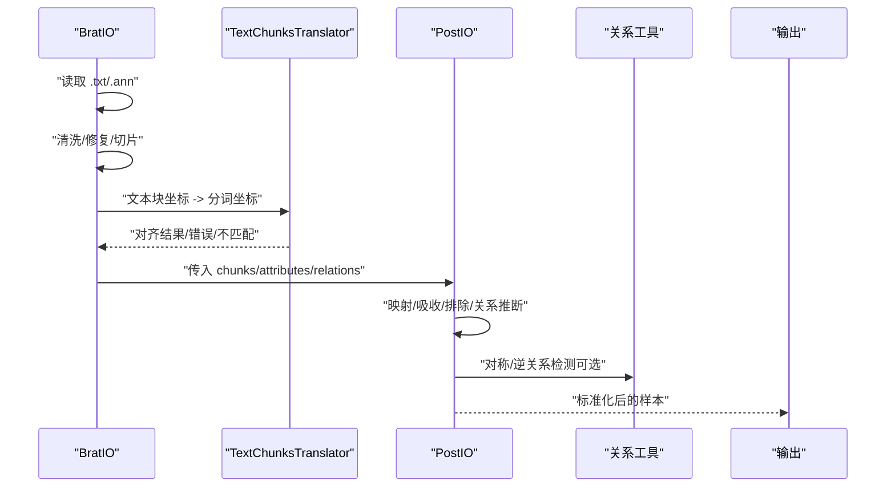
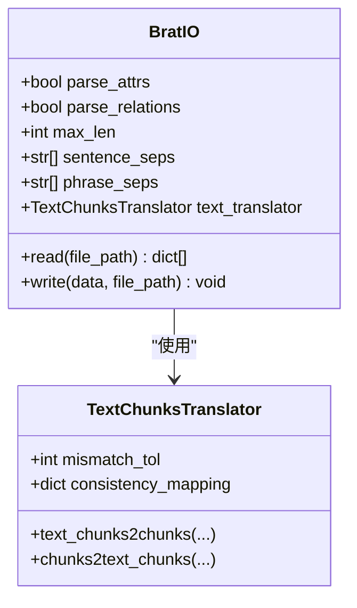
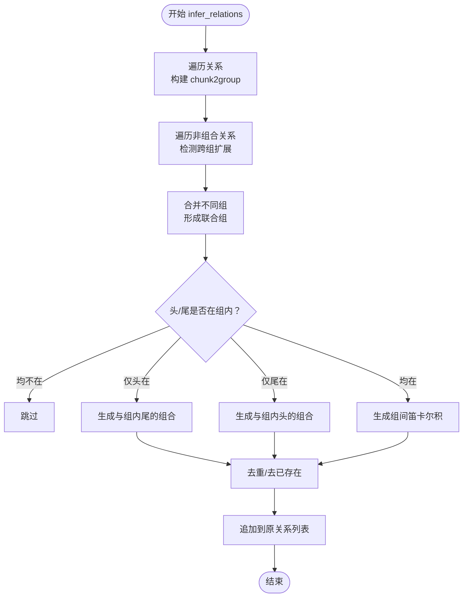
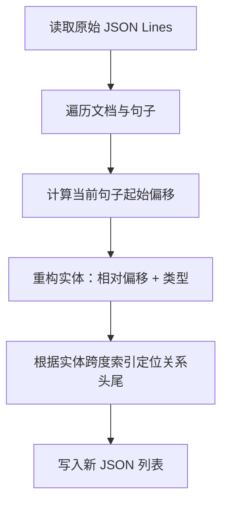
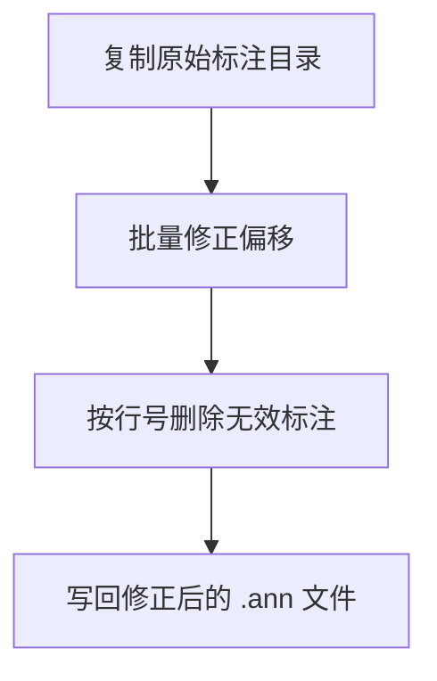
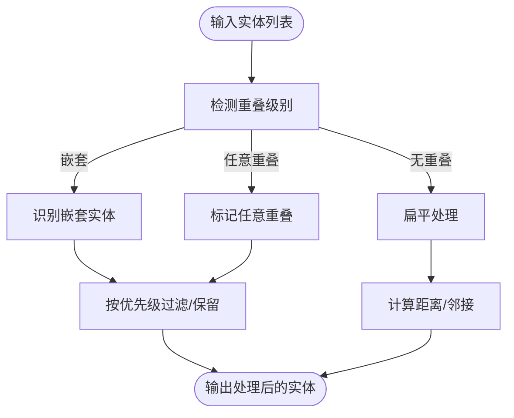
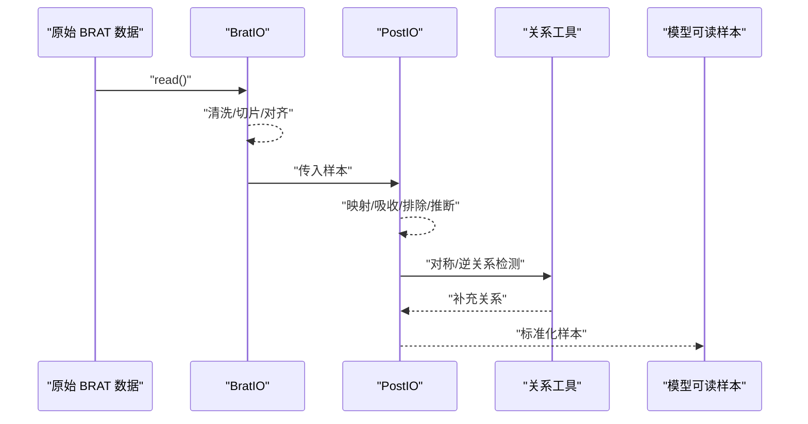
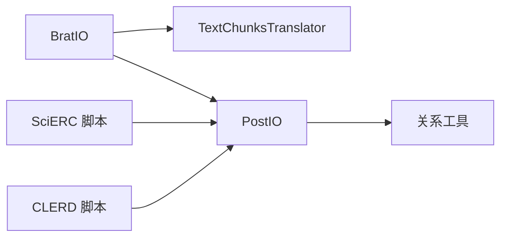

# 关系抽取数据处理

<cite>
**本文引用的文件**
- [processing.py](file://eznlp/io/processing.py)
- [brat.py](file://eznlp/io/brat.py)
- [chunk.py](file://eznlp/utils/chunk.py)
- [relation.py](file://eznlp/utils/relation.py)
- [scierc-luan2018emnlp-process.py](file://data/SciERC/scierc-luan2018emnlp-process.py)
- [fix_annotations.py](file://data/CLERD/fix_annotations.py)
- [relation-extraction.md](file://docs/relation-extraction.md)
- [base.py](file://eznlp/io/base.py)
</cite>

## 目录
1. [引言](#引言)
2. [项目结构](#项目结构)
3. [核心组件](#核心组件)
4. [架构总览](#架构总览)
5. [详细组件分析](#详细组件分析)
6. [依赖分析](#依赖分析)
7. [性能考虑](#性能考虑)
8. [故障排查指南](#故障排查指南)
9. [结论](#结论)
10. [附录](#附录)

## 引言
本文件面向关系抽取任务的数据预处理流程，系统性梳理从原始标注到模型可读格式的完整链路，覆盖以下重点：
- SciERC 等标准数据集的格式转换（JSON 结构重构与实体/关系对齐）
- CLERD 数据集的标注修复（字符偏移修正与无效标注删除）
- BratIO 组件在处理中文文献关系抽取数据时的关键参数配置（parse_relations=True、consistency_mapping）
- processing.py 中关系推断（infer_relations）的实现机制（基于 group_rel_types 构建实体组与跨组关系生成）
- 复杂场景处理（重叠实体、嵌套关系）与端到端转换示例

## 项目结构
围绕关系抽取数据处理的相关模块分布如下：
- 输入输出层：BratIO（BRAT 格式读取/写入）、基础 IO 接口
- 数据处理工具：PostIO（后处理与关系推断）、TextChunksTranslator（文本与分词对齐）
- 数据集脚本：SciERC 格式转换、CLERD 标注修复
- 关系工具：对称关系检测、逆关系推导

**图表来源**
- [brat.py](file://eznlp/io/brat.py#L1-L120)
- [processing.py](file://eznlp/io/processing.py#L1-L120)
- [chunk.py](file://eznlp/utils/chunk.py#L97-L250)
- [scierc-luan2018emnlp-process.py](file://data/SciERC/scierc-luan2018emnlp-process.py#L1-L42)
- [fix_annotations.py](file://data/CLERD/fix_annotations.py#L1-L62)

**章节来源**
- [brat.py](file://eznlp/io/brat.py#L1-L120)
- [processing.py](file://eznlp/io/processing.py#L1-L120)
- [chunk.py](file://eznlp/utils/chunk.py#L97-L250)
- [scierc-luan2018emnlp-process.py](file://data/SciERC/scierc-luan2018emnlp-process.py#L1-L42)
- [fix_annotations.py](file://data/CLERD/fix_annotations.py#L1-L62)

## 核心组件
- BratIO：负责 BRAT 文本与标注的读取、清洗、切片、分词对齐、关系解析与写出。关键参数：
  - parse_relations=True：启用关系解析
  - consistency_mapping：一致性映射（如空白字符规范化），用于缓解标注文本与原文不一致问题
- PostIO：提供映射、吸收属性、排除属性、关系推断等后处理能力
- TextChunksTranslator：将文本块坐标转换为分词序列坐标，支持容差与一致性检查
- 关系工具：对称关系缺失检测、逆关系推导

**章节来源**
- [brat.py](file://eznlp/io/brat.py#L32-L120)
- [processing.py](file://eznlp/io/processing.py#L26-L120)
- [chunk.py](file://eznlp/utils/chunk.py#L97-L250)
- [relation.py](file://eznlp/utils/relation.py#L1-L31)

## 架构总览
下图展示从 BRAT 文件到模型可读格式的整体流程，以及关系推断在其中的位置。

**图表来源**
- [brat.py](file://eznlp/io/brat.py#L188-L318)
- [processing.py](file://eznlp/io/processing.py#L120-L249)
- [relation.py](file://eznlp/utils/relation.py#L1-L31)

## 详细组件分析

### BratIO 在中文关系抽取中的关键参数
- parse_relations=True：启用关系解析，将 R 行解析为 (head, tail) 关系三元组，并映射到当前片段内的实体索引
- consistency_mapping：通过正则替换实现字符级一致性映射（如空白归一化），提升文本块与原文一致性校验的鲁棒性
- 分段策略：按层级分隔符与最大长度进行文本切片，确保单片段长度可控
- 插入空格处理：针对中文显示优化插入空格的场景，提供插入/去除空格的双向映射，保证偏移一致性

**图表来源**
- [brat.py](file://eznlp/io/brat.py#L32-L120)
- [brat.py](file://eznlp/io/brat.py#L188-L318)
- [chunk.py](file://eznlp/utils/chunk.py#L97-L250)

**章节来源**
- [brat.py](file://eznlp/io/brat.py#L32-L120)
- [brat.py](file://eznlp/io/brat.py#L188-L318)
- [chunk.py](file://eznlp/utils/chunk.py#L97-L250)

### PostIO 的关系推断（infer_relations）机制
- 基于 group_rel_types：仅对指定的关系类型视为“组合关系”，用于构建实体组（chunk2group）
- 构建实体组：
  - 遍历所有组合关系，将头尾实体加入同一集合
  - 合并不同集合（当两个实体分别属于不同集合时）
- 跨组关系生成：
  - 对非组合关系，若头/尾至少有一个实体属于某个组，则扩展为组内所有实体的笛卡尔积
  - 去重并避免重复添加已有关系
- 输出：将新增关系追加到原关系列表

**图表来源**
- [processing.py](file://eznlp/io/processing.py#L187-L249)

**章节来源**
- [processing.py](file://eznlp/io/processing.py#L187-L249)

### SciERC 格式转换（JSON 重构）
- 将每条文档拆分为句子级样本，重新计算实体与关系的相对位置
- 实体字段：start、end、type
- 关系字段：type、head、tail（head/tail 为实体在当前样本中的索引）

**图表来源**
- [scierc-luan2018emnlp-process.py](file://data/SciERC/scierc-luan2018emnlp-process.py#L1-L42)

**章节来源**
- [scierc-luan2018emnlp-process.py](file://data/SciERC/scierc-luan2018emnlp-process.py#L1-L42)

### CLERD 标注修复（字符偏移修正与无效标注删除）
- 字符偏移修正：对特定文件的标注行执行偏移量调整，避免因文本变化导致的偏移错位
- 无效标注删除：按行号列表直接剔除无效标注，保持标注文件整洁

**图表来源**
- [fix_annotations.py](file://data/CLERD/fix_annotations.py#L1-L62)

**章节来源**
- [fix_annotations.py](file://data/CLERD/fix_annotations.py#L1-L62)

### 处理重叠实体与嵌套关系
- 重叠/嵌套检测：提供扁平、嵌套、任意重叠三种级别判定
- 嵌套过滤：可选择优先保留嵌套关系或扁平化处理
- 距离度量：支持计算实体对之间的距离（重叠时为负值）

**图表来源**
- [chunk.py](file://eznlp/utils/chunk.py#L1-L120)

**章节来源**
- [chunk.py](file://eznlp/utils/chunk.py#L1-L120)

### 从原始标注到模型可读格式的完整示例（步骤说明）
- 步骤1：准备 BRAT 数据（.txt/.ann），确保关系行存在且格式正确
- 步骤2：使用 BratIO 读取并解析，设置 parse_relations=True，必要时提供 consistency_mapping
- 步骤3：对长文本进行分段切片，确保每段长度适配模型输入
- 步骤4：调用 PostIO 进行映射、吸收属性、排除属性与关系推断（可选）
- 步骤5：对关系进行对称/逆关系检测（可选）
- 步骤6：输出标准化样本（tokens、chunks、attributes、relations）

**图表来源**
- [brat.py](file://eznlp/io/brat.py#L188-L318)
- [processing.py](file://eznlp/io/processing.py#L120-L249)
- [relation.py](file://eznlp/utils/relation.py#L1-L31)

## 依赖分析
- BratIO 依赖 TextChunksTranslator 进行坐标对齐与一致性检查
- PostIO 提供关系推断与属性处理，可与关系工具协同工作
- SciERC/CLERD 脚本作为数据集预处理工具，服务于统一的数据格式

**图表来源**
- [brat.py](file://eznlp/io/brat.py#L1-L120)
- [processing.py](file://eznlp/io/processing.py#L1-L120)
- [relation.py](file://eznlp/utils/relation.py#L1-L31)
- [scierc-luan2018emnlp-process.py](file://data/SciERC/scierc-luan2018emnlp-process.py#L1-L42)
- [fix_annotations.py](file://data/CLERD/fix_annotations.py#L1-L62)

**章节来源**
- [brat.py](file://eznlp/io/brat.py#L1-L120)
- [processing.py](file://eznlp/io/processing.py#L1-L120)
- [relation.py](file://eznlp/utils/relation.py#L1-L31)
- [scierc-luan2018emnlp-process.py](file://data/SciERC/scierc-luan2018emnlp-process.py#L1-L42)
- [fix_annotations.py](file://data/CLERD/fix_annotations.py#L1-L62)

## 性能考虑
- 文本切片与二分查找：BratIO 使用层级分隔符与最大长度切片，结合二分查找定位分词边界，提高对齐效率
- 关系推断：构建实体组采用集合合并，时间复杂度与关系数量线性相关；跨组扩展生成笛卡尔积需注意样本规模增长
- 批量处理：建议在读取阶段即进行切片与对齐，减少后续重复计算

[本节为通用指导，无需具体文件引用]

## 故障排查指南
- 文本块与原文不一致：启用 consistency_mapping 并检查清洗规则；必要时允许部分不一致警告
- 关系缺失：使用对称关系检测工具发现缺失并补全；对逆关系进行逆标签标注
- 偏移错位：CLERD 修复脚本展示了偏移修正与无效标注删除的实践方法
- 长文本切片失败：调整 max_len 或分隔符策略，确保切片后仍能包含有效实体

**章节来源**
- [brat.py](file://eznlp/io/brat.py#L120-L220)
- [relation.py](file://eznlp/utils/relation.py#L1-L31)
- [fix_annotations.py](file://data/CLERD/fix_annotations.py#L1-L62)

## 结论
本文件系统化梳理了关系抽取数据预处理的关键环节：BRAT 解析与对齐、关系推断、格式转换与修复、复杂场景处理。通过 BratIO 的参数配置与 PostIO 的后处理能力，能够高效地将原始标注转化为模型可读格式，并在中文场景下兼顾字符偏移与显示优化。建议在实际项目中结合数据集特性选择合适的切片策略与关系推断参数，以获得更稳健的训练效果。

[本节为总结性内容，无需具体文件引用]

## 附录
- 参考文档：关系抽取实验设置与结果说明

**章节来源**
- [relation-extraction.md](file://docs/relation-extraction.md#L1-L49)