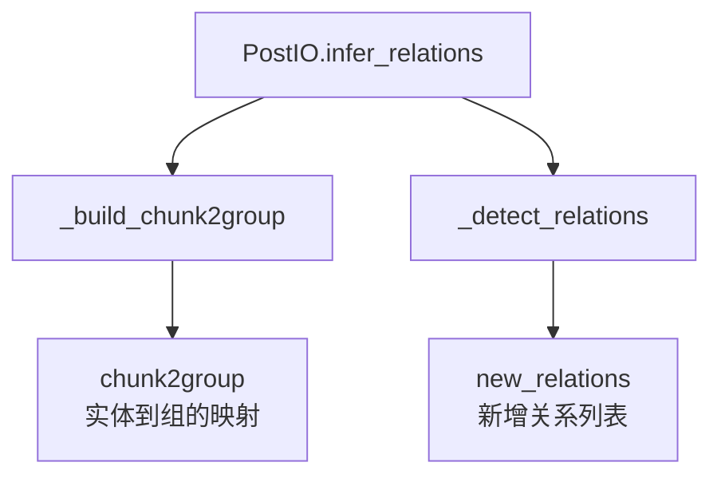
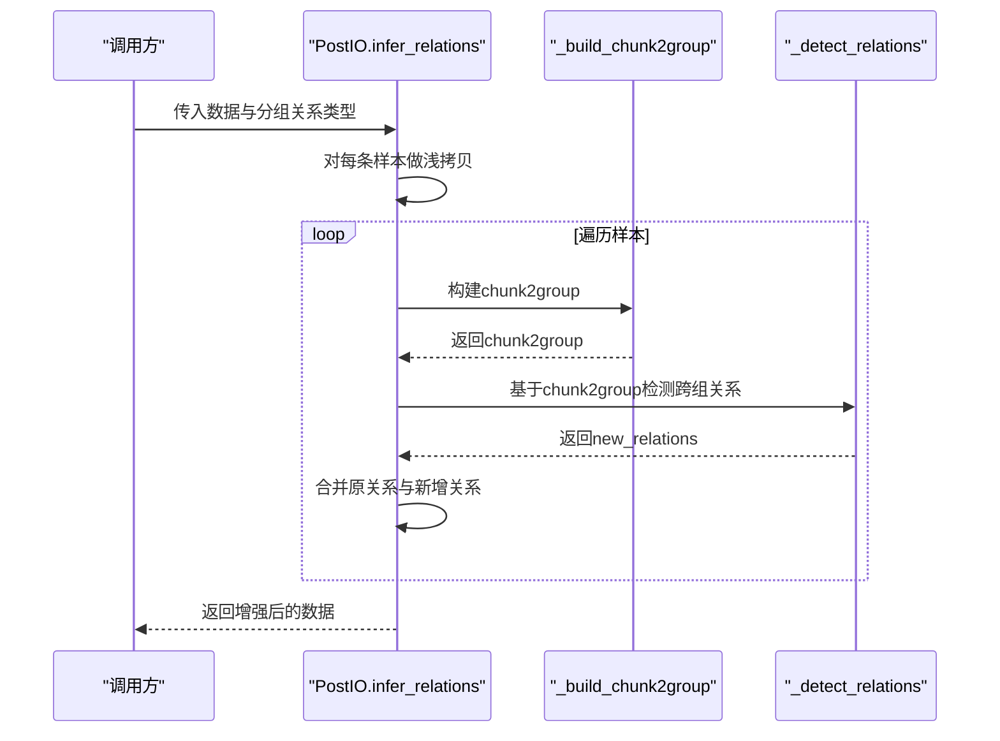
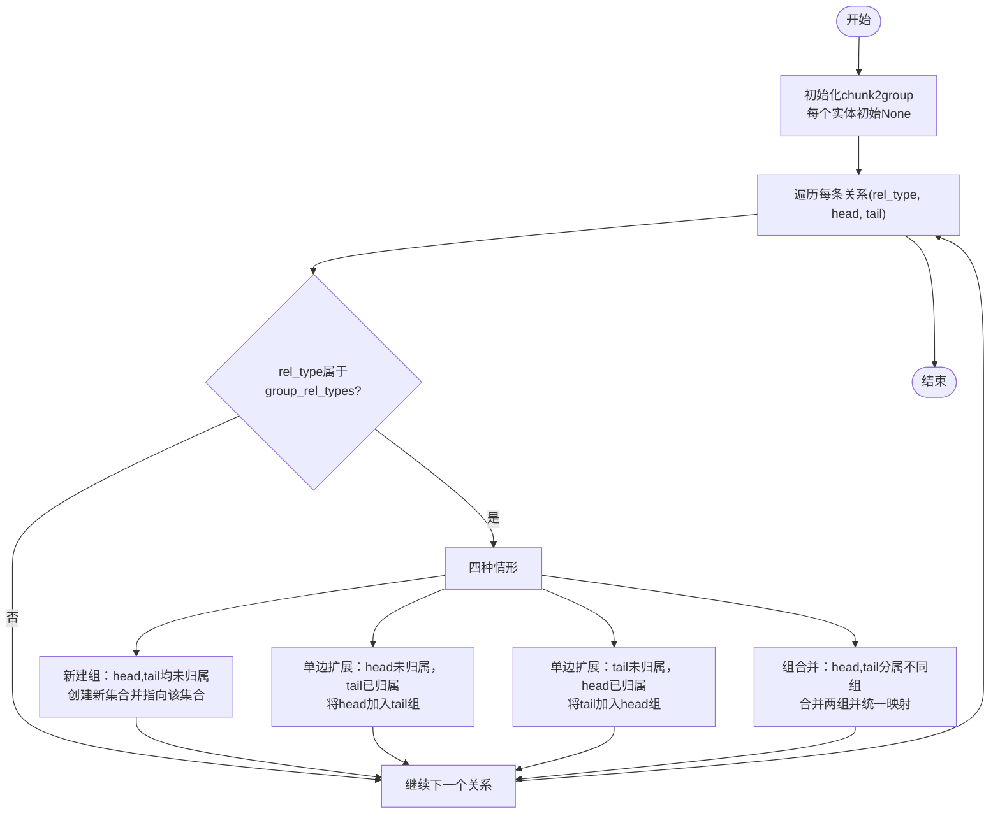
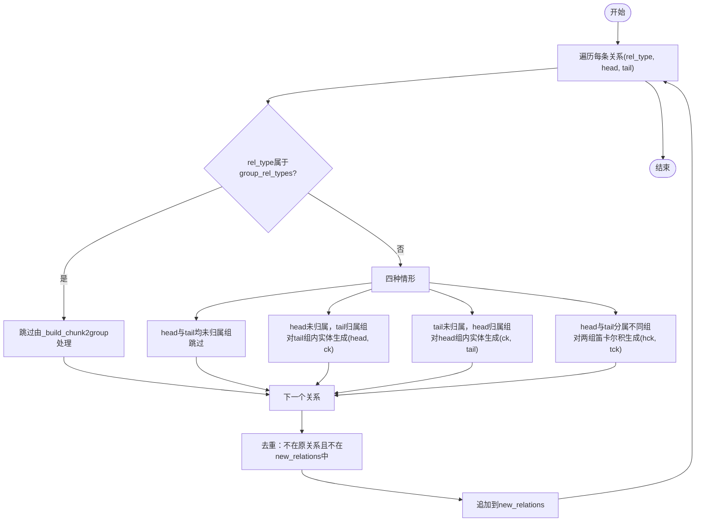
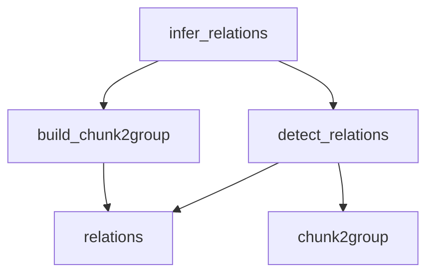

# 关系推断机制

<cite>
**本文引用的文件**
- [eznlp/io/processing.py](file://eznlp/io/processing.py)
- [tests/io/test_processing.py](file://tests/io/test_processing.py)
- [tests/conftest.py](file://tests/conftest.py)
- [data/HwaMei/demo.ChaFangJiLu.txt](file://data/HwaMei/demo.ChaFangJiLu.txt)
- [data/HwaMei/demo.ChaFangJiLu.ann](file://data/HwaMei/demo.ChaFangJiLu.ann)
</cite>

## 目录
1. [简介](#简介)
2. [项目结构](#项目结构)
3. [核心组件](#核心组件)
4. [架构总览](#架构总览)
5. [详细组件分析](#详细组件分析)
6. [依赖分析](#依赖分析)
7. [性能考量](#性能考量)
8. [故障排查指南](#故障排查指南)
9. [结论](#结论)
10. [附录](#附录)

## 简介
本文件围绕 PostIO 类中的 infer_relations 方法展开，深入解析其内部工作机制，重点说明：
- 如何基于 group_rel_types 构建实体组（chunk2group）
- 如何在实体组的基础上推断跨组关系（_detect_relations）
- 四种实体组连接情形（新建组、单边扩展、双边扩展、组合并）的处理逻辑
- 如何生成新的关系三元组
- tqdm 进度条的使用方式
- 浅拷贝数据处理的安全性考虑

## 项目结构
PostIO 类位于 IO 后处理模块，提供多种数据映射与关系推断能力。与关系推断直接相关的方法包括：
- infer_relations：对外入口，遍历每条样本，调用构建与检测函数
- _build_chunk2group：根据“分组关系类型”将实体聚类为组
- _detect_relations：基于已构建的组，对非分组关系进行跨组扩展

图表来源
- [eznlp/io/processing.py](file://eznlp/io/processing.py#L239-L248)
- [eznlp/io/processing.py](file://eznlp/io/processing.py#L186-L206)
- [eznlp/io/processing.py](file://eznlp/io/processing.py#L207-L237)

章节来源
- [eznlp/io/processing.py](file://eznlp/io/processing.py#L239-L248)

## 核心组件
- PostIO：提供 IO 后处理能力，其中 infer_relations 是关系推断的核心入口
- 数据结构约定：
  - 实体（chunk）：三元组 (类型, 起始索引, 结束索引)
  - 属性（attribute）：二元组 (属性类型, 实体)
  - 关系（relation）：三元组 (关系类型, 头实体, 尾实体)
- 分组关系类型（group_rel_types）：用于指示哪些关系类型表示“实体应被聚合到同一组”

章节来源
- [eznlp/io/processing.py](file://eznlp/io/processing.py#L239-L248)

## 架构总览
下图展示了 infer_relations 的整体调用序列，从输入数据到输出新增关系的全过程。

图表来源
- [eznlp/io/processing.py](file://eznlp/io/processing.py#L239-L248)
- [eznlp/io/processing.py](file://eznlp/io/processing.py#L186-L206)
- [eznlp/io/processing.py](file://eznlp/io/processing.py#L207-L237)

## 详细组件分析

### infer_relations 方法
- 输入：数据列表（每条样本包含 tokens、chunks、attributes、relations 等字段）、分组关系类型列表
- 输出：增强后的数据列表（relations 中可能包含新增关系）
- 关键点：
  - 对输入数据进行浅拷贝，避免就地修改
  - 使用 tqdm 进度条显示“Relation inferring”阶段
  - 对每个样本：
    - 调用 _build_chunk2group 构建 chunk2group
    - 调用 _detect_relations 基于组信息扩展关系
    - 将新增关系合并回原关系集合

章节来源
- [eznlp/io/processing.py](file://eznlp/io/processing.py#L239-L248)

### _build_chunk2group：基于 group_rel_types 构建实体组
- 目标：将所有实体按“分组关系”连接起来，形成若干不相交的组
- 数据结构：
  - chunk2group：字典，键为实体，值为该实体所属的组（集合）
- 算法流程：
  - 初始化：每个实体初始未归属任何组
  - 遍历每条关系 (rel_type, head, tail)：
    - 若 rel_type 属于 group_rel_types，则将 head 与 tail 归属到同一组
    - 四种情形：
      - 新建组：head 与 tail 均未归属组，创建新集合并将两者加入
      - 单边扩展：仅 head 未归属组，将 head 加入 tail 所属组
      - 单边扩展：仅 tail 未归属组，将 tail 加入 head 所属组
      - 组合并：head 与 tail 分属不同组，合并两个组，并更新组内所有实体的映射
    - 断言：若 head 与 tail 已分属不同组，它们的交集必为空，确保组互斥
- 时间复杂度：O(R + E)，R 为关系数，E 为实体数；实际受并查集优化影响，接近 O(R + E·α(E))，其中 α 为反阿克曼函数
- 空间复杂度：O(E)

图表来源
- [eznlp/io/processing.py](file://eznlp/io/processing.py#L186-L206)

章节来源
- [eznlp/io/processing.py](file://eznlp/io/processing.py#L186-L206)

### _detect_relations：基于 chunk2group 推断跨组关系
- 目标：对非分组关系（rel_type 不在 group_rel_types）进行跨组扩展，生成新的关系三元组
- 输入：样本、分组关系类型列表、chunk2group
- 输出：new_relations（新增的关系列表）
- 算法流程：
  - 遍历每条关系 (rel_type, head, tail)：
    - 若 rel_type 属于 group_rel_types：跳过（已在 _build_chunk2group 中处理）
    - 若 rel_type 不属于 group_rel_types：按 head/tail 是否归属组分为四种情形
  - 四种情形：
    - 皆未归属组：跳过（不产生跨组关系）
    - 仅 tail 归属组：生成 (rel_type, head, ck) 对于 tail 组内所有实体 ck
    - 仅 head 归属组：生成 (rel_type, ck, tail) 对于 head 组内所有实体 ck
    - head 与 tail 分属不同组：生成 (rel_type, hck, tck) 对于 head 组内所有 hck 与 tail 组内所有 tck
  - 去重与过滤：
    - 新增关系需同时不在原关系集合中，也不在当前累积的 new_relations 中
  - 返回 new_relations

图表来源
- [eznlp/io/processing.py](file://eznlp/io/processing.py#L207-L237)

章节来源
- [eznlp/io/processing.py](file://eznlp/io/processing.py#L207-L237)

### 四种实体组连接情形与新增关系生成
- 新建组：当两个实体均未归属任何组时，将二者放入同一新组
- 单边扩展：当一端实体未归属而另一端已归属时，将未归属实体加入已归属组
- 双边扩展：当两端实体分别归属不同组时，合并两个组并统一映射
- 组合并：当两端实体分属不同组时，执行集合合并，随后统一更新组映射

上述四种情形在 _build_chunk2group 中完成组的构建；在 _detect_relations 中，针对非分组关系，依据实体是否归属组，生成相应的新三元组。

章节来源
- [eznlp/io/processing.py](file://eznlp/io/processing.py#L186-L206)
- [eznlp/io/processing.py](file://eznlp/io/processing.py#L207-L237)

### tqdm 进度条的使用
- 在 infer_relations 中，使用 tqdm.tqdm 包裹样本迭代过程，显示“Relation inferring”描述文本
- 通过参数控制显示宽度与是否禁用
- 作用：在大规模数据上提供可感知的处理进度反馈

章节来源
- [eznlp/io/processing.py](file://eznlp/io/processing.py#L239-L248)

### 浅拷贝数据处理的安全性考虑
- PostIO 的注释明确指出：所有方法在处理前都会对输入 data 做浅拷贝
- 目的：避免在处理过程中对原始数据进行原位修改，防止副作用
- 建议：不要在外部对拷贝后的数据进行原位修改（如 append、extend），以免破坏后续流程或测试一致性

章节来源
- [eznlp/io/processing.py](file://eznlp/io/processing.py#L26-L39)

## 依赖分析
- infer_relations 依赖 _build_chunk2group 与 _detect_relations
- _build_chunk2group 依赖 relations 中的实体与关系类型
- _detect_relations 依赖 chunk2group 的结果与 relations 中的非分组关系
- 测试用例验证了：
  - tokens、chunks、attributes 保持不变
  - relations 为子集关系（新增关系不会删除已有关系）
  - 当提供非空 group_rel_types 时，新增关系总数为固定数值（测试中为 14）

图表来源
- [eznlp/io/processing.py](file://eznlp/io/processing.py#L239-L248)
- [eznlp/io/processing.py](file://eznlp/io/processing.py#L186-L206)
- [eznlp/io/processing.py](file://eznlp/io/processing.py#L207-L237)

章节来源
- [tests/io/test_processing.py](file://tests/io/test_processing.py#L55-L87)

## 性能考量
- 时间复杂度：
  - _build_chunk2group：近似 O(R + E·α(E))，其中 R 为关系数，E 为实体数
  - _detect_relations：最坏情况下为 O(E^2·|non-group-rels|)，因为对每条非分组关系可能生成两组的笛卡尔积
- 空间复杂度：O(E)
- 优化建议：
  - 对于大型数据集，优先减少非分组关系数量或限制组规模
  - 若存在大量重复实体，可考虑预去重或缓存 chunk2group 的中间结果
  - 使用更高效的并查集或集合操作以降低合并成本

## 故障排查指南
- 新增关系数量异常
  - 检查 group_rel_types 是否正确设置，确保仅将真正用于分组的关系纳入
  - 确认 _detect_relations 的去重逻辑未误删（不在原关系且不在当前累积列表）
- 进度条未显示
  - 检查构造函数 verbose 参数是否为 True
  - 确认 tqdm 可用且环境支持
- 数据被意外修改
  - 确保未对拷贝后的数据进行原位修改（如 append、extend）
  - 遵循浅拷贝约束，避免直接修改 entry 的可变字段

章节来源
- [eznlp/io/processing.py](file://eznlp/io/processing.py#L26-L39)
- [eznlp/io/processing.py](file://eznlp/io/processing.py#L239-L248)

## 结论
PostIO 的 infer_relations 通过“构建实体组 + 跨组关系检测”的两步法，实现了对非分组关系的自动扩展。其核心在于：
- 基于 group_rel_types 的实体聚类（_build_chunk2group）
- 对非分组关系按组归属情况生成跨组三元组（_detect_relations）
- 使用 tqdm 提供进度反馈，使用浅拷贝保证安全性
- 测试用例验证了功能正确性与稳定性

## 附录
- 示例数据来源（用于理解数据结构与关系类型）：
  - 文本文件：[data/HwaMei/demo.ChaFangJiLu.txt](file://data/HwaMei/demo.ChaFangJiLu.txt)
  - 标注文件：[data/HwaMei/demo.ChaFangJiLu.ann](file://data/HwaMei/demo.ChaFangJiLu.ann)
  - 测试夹具：[tests/conftest.py](file://tests/conftest.py#L112-L125)

章节来源
- [tests/conftest.py](file://tests/conftest.py#L112-L125)
- [data/HwaMei/demo.ChaFangJiLu.txt](file://data/HwaMei/demo.ChaFangJiLu.txt#L1-L13)
- [data/HwaMei/demo.ChaFangJiLu.ann](file://data/HwaMei/demo.ChaFangJiLu.ann#L1-L114)