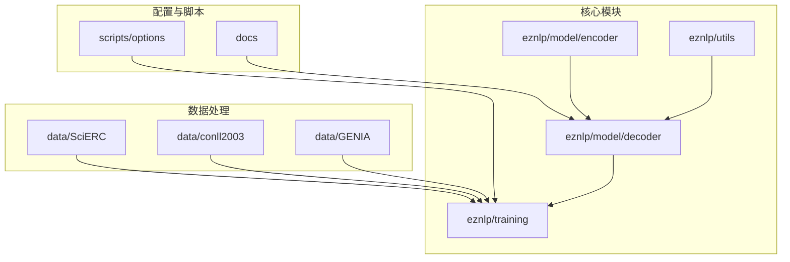
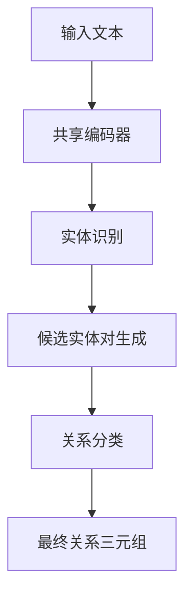

# 关系抽取详解

<cite>
**本文档引用的文件**   
- [joint_extraction.py](file://eznlp/model/decoder/joint_extraction.py)
- [sequence_tagging.py](file://eznlp/model/decoder/sequence_tagging.py)
- [span_rel_classification.py](file://eznlp/model/decoder/span_rel_classification.py)
- [boundary_selection.py](file://eznlp/model/decoder/boundary_selection.py)
- [specific_span_rel_classification.py](file://eznlp/model/decoder/specific_span_rel_classification.py)
- [relation.py](file://eznlp/utils/relation.py)
- [options.py](file://eznlp/training/options.py)
- [config.py](file://eznlp/config.py)
- [with_bert.opt](file://scripts/options/with_bert.opt)
- [without_bert.opt](file://scripts/options/without_bert.opt)
- [test_joint_extraction.py](file://tests/model/test_joint_extraction.py)
- [metrics.py](file://eznlp/metrics.py)
</cite>

## 目录
1. [引言](#引言)
2. [项目结构](#项目结构)
3. [核心组件](#核心组件)
4. [联合抽取与管道式抽取模式](#联合抽取与管道式抽取模式)
5. [SpERT模型架构与共享编码器配置](#spert模型架构与共享编码器配置)
6. [多头选择机制与实体边界识别](#多头选择机制与实体边界识别)
7. [数据集配置模板](#数据集配置模板)
8. [性能基准与错误分析](#性能基准与错误分析)
9. [结论](#结论)

## 引言
本文档深入解析eznlp框架中关系抽取任务的实现机制，重点区分联合抽取（Joint Extraction）与管道式抽取（Pipeline Extraction）两种模式。基于SpERT等模型架构，详细说明如何通过`joint_extraction.py`构建实体与关系的联合预测模型，并配置实体识别与关系分类的共享编码器。文档涵盖解码器中多头选择机制的实现方式，以及如何利用`SequenceTaggingDecoderConfig`进行实体边界识别。同时提供在SciERC和CoNLL-2004等数据集上的配置模板，包括优化器设置（Adadelta/AdamW）、学习率调度、预训练语言模型（BERT/RoBERTa）集成等关键参数。此外，文档还包含性能基准对比、错误分析方法及实体类型无关评估的实现路径。

## 项目结构
eznlp项目的目录结构清晰地组织了数据处理、模型实现、训练配置和工具脚本等模块。核心模型实现位于`eznlp/model/decoder/`目录下，包括联合抽取、序列标注、边界选择等解码器。数据集处理脚本位于`data/`目录，支持多种标准数据集如SciERC、CoNLL-2004等。训练配置和选项管理位于`scripts/options/`目录，提供了BERT和非BERT模型的配置模板。



**文档来源**
- [project_structure](file://project_structure)

## 核心组件

eznlp框架中的关系抽取核心组件主要包括联合抽取解码器、序列标注解码器、边界选择解码器以及关系分类解码器。这些组件通过灵活的配置系统协同工作，实现端到端的关系抽取任务。

**文档来源**
- [joint_extraction.py](file://eznlp/model/decoder/joint_extraction.py#L1-L193)
- [sequence_tagging.py](file://eznlp/model/decoder/sequence_tagging.py#L1-L198)
- [span_rel_classification.py](file://eznlp/model/decoder/span_rel_classification.py#L1-L585)

## 联合抽取与管道式抽取模式

### 联合抽取模式
联合抽取模式通过`JointExtractionDecoderConfig`类实现，该类继承自`Config`和`JointExtractionDecoderMixin`，允许同时配置实体识别（ck_decoder）、属性分类（attr_decoder）和关系分类（rel_decoder）三个解码器。这种模式的核心优势在于三个任务共享编码器表示，通过多任务学习实现信息交互和性能提升。

```python
class JointExtractionDecoderConfig(Config, JointExtractionDecoderMixin):
    def __init__(
        self,
        ck_decoder: Union[SingleDecoderConfigBase, str] = "span_classification",
        attr_decoder: Union[SingleDecoderConfigBase, str] = None,
        rel_decoder: Union[SingleDecoderConfigBase, str] = "span_rel_classification",
        **kwargs
    ):
        # 实体识别解码器配置
        if isinstance(ck_decoder, SingleDecoderConfigBase):
            self.ck_decoder = ck_decoder
        elif ck_decoder.lower().startswith("sequence_tagging"):
            self.ck_decoder = SequenceTaggingDecoderConfig()
        elif ck_decoder.lower().startswith("span_classification"):
            self.ck_decoder = SpanClassificationDecoderConfig()
        elif ck_decoder.lower().startswith("boundary"):
            self.ck_decoder = BoundarySelectionDecoderConfig()
            
        # 属性分类解码器配置
        if isinstance(attr_decoder, SingleDecoderConfigBase) or attr_decoder is None:
            self.attr_decoder = attr_decoder
        elif attr_decoder.lower().startswith("span_attr"):
            self.attr_decoder = SpanAttrClassificationDecoderConfig()
            
        # 关系分类解码器配置
        if isinstance(rel_decoder, SingleDecoderConfigBase) or rel_decoder is None:
            self.rel_decoder = rel_decoder
        elif rel_decoder.lower().startswith("span_rel"):
            self.rel_decoder = SpanRelClassificationDecoderConfig()
```

### 管道式抽取模式
管道式抽取模式将关系抽取任务分解为两个独立的阶段：首先进行实体识别，然后基于识别出的实体进行关系分类。这种模式通过`ExtractorConfig`的分阶段配置实现，允许在实体识别和关系分类之间插入额外的处理步骤。



**文档来源**
- [joint_extraction.py](file://eznlp/model/decoder/joint_extraction.py#L68-L152)
- [test_joint_extraction.py](file://tests/model/test_joint_extraction.py#L65-L85)

## SpERT模型架构与共享编码器配置

### SpERT模型架构
SpERT（Span-based Entity and Relation Transformer）模型架构通过`SpanRelClassificationDecoderConfig`实现，采用基于跨度的实体表示和关系分类方法。该架构的核心特点是将实体表示为文本跨度，然后通过多头选择机制对实体对进行关系分类。

```python
class SpanRelClassificationDecoderConfig(SingleDecoderConfigBase, ChunkPairsDecoderMixin):
    def __init__(self, **kwargs):
        self.use_context = kwargs.pop("use_context", True)
        self.size_emb_dim = kwargs.pop("size_emb_dim", 0)
        self.label_emb_dim = kwargs.pop("label_emb_dim", 0)
        self.fusing_mode = kwargs.pop("fusing_mode", "concat")
        self.reduction = kwargs.pop(
            "reduction",
            EncoderConfig(
                arch="FFN",
                hid_dim=150,
                num_layers=1,
                in_drop_rates=(0.0, 0.0, 0.0),
                hid_drop_rate=0.0,
            ),
        )
```

### 共享编码器配置
共享编码器通过`ExtractorConfig`的`bert_like`参数配置，支持BERT、RoBERTa等预训练语言模型。编码器的输出被多个解码器共享，实现特征重用和知识迁移。

```python
def test_model_with_bert_like(self, conll2004_demo, bert_with_tokenizer, device):
    bert, tokenizer = bert_with_tokenizer
    self.config = ExtractorConfig(
        ohots=None,
        bert_like=BertLikeConfig(tokenizer=tokenizer, bert_like=bert),
        intermediate2=None,
        decoder=JointExtractionDecoderConfig(),
    )
```

**文档来源**
- [span_rel_classification.py](file://eznlp/model/decoder/span_rel_classification.py#L156-L222)
- [test_joint_extraction.py](file://tests/model/test_joint_extraction.py#L108-L118)

## 多头选择机制与实体边界识别

### 多头选择机制
多头选择机制在`SpanRelClassificationDecoder`中实现，通过不同的融合模式（fusing_mode）对实体对的表示进行组合。支持"concat"（拼接）和"affine"（仿射变换）两种模式，其中仿射变换模式使用双仿射或三仿射融合器进行关系分类。

```python
def get_logits(self, batch: Batch, full_hidden: torch.Tensor):
    # ... 实体表示提取 ...
    
    if self.fusing_mode.startswith("concat"):
        # 拼接融合模式
        hidden_cat = torch.cat([head_hidden, tail_hidden], dim=-1)
        if self.use_context:
            contexts = self._collect_shallow_contexts(full_hidden, i, cp_obj)
            hidden_cat = torch.cat([hidden_cat, contexts], dim=-1)
        if hasattr(self, "reduction_cat"):
            reduced_cat = self.reduction_cat(hidden_cat)
            logits = self.hid2logit(self.hid_dropout(reduced_cat))
        else:
            logits = self.hid2logit(hidden_cat)
            
    elif self.fusing_mode.lower().startswith("affine"):
        # 仿射融合模式
        reduced_head = self.reduction_head(head_hidden)
        reduced_tail = self.reduction_tail(tail_hidden)
        if self.use_context:
            contexts = self._collect_shallow_contexts(full_hidden, i, cp_obj)
            reduced_ctx = self.reduction_ctx(contexts)
            logits = self.hid2logit(
                self.hid_dropout(reduced_head),
                self.hid_dropout(reduced_tail),
                self.hid_dropout(reduced_ctx),
            )
        else:
            logits = self.hid2logit(
                self.hid_dropout(reduced_head),
                self.hid_dropout(reduced_tail),
            )
```

### 实体边界识别
实体边界识别通过`SequenceTaggingDecoderConfig`和`BoundarySelectionDecoderConfig`实现。前者采用BIOES等序列标注方案，后者采用边界选择机制。

```python
class SequenceTaggingDecoderConfig(SingleDecoderConfigBase, SequenceTaggingDecoderMixin):
    def __init__(self, **kwargs):
        self.in_drop_rates = kwargs.pop("in_drop_rates", (0.5, 0.0, 0.0))
        self.scheme = kwargs.pop("scheme", "BIOES")
        self.idx2tag = kwargs.pop("idx2tag", None)
        self.use_crf = kwargs.pop("use_crf", True)
        super().__init__(**kwargs)
```

**文档来源**
- [span_rel_classification.py](file://eznlp/model/decoder/span_rel_classification.py#L449-L535)
- [sequence_tagging.py](file://eznlp/model/decoder/sequence_tagging.py#L93-L114)
- [boundary_selection.py](file://eznlp/model/decoder/boundary_selection.py#L92-L127)

## 数据集配置模板

### SciERC数据集配置
SciERC数据集的配置模板通过`with_bert.opt`文件定义，采用BERT预训练模型和AdamW优化器。

```bash
--optimizer
AdamW
--scheduler
LinearDecayWithWarmup
--emb_dim
0
--char_arch
None
--bert_arch
BERT_base
```

### CoNLL-2004数据集配置
CoNLL-2004数据集的配置通过`ExtractorConfig`的联合抽取模式实现，支持多种实体识别解码器。

```python
@pytest.mark.parametrize(
    "ck_decoder", ["sequence_tagging", "span_classification", "boundary_selection"]
)
@pytest.mark.parametrize("agg_mode", ["max_pooling"])
def test_model(self, ck_decoder, agg_mode, conll2004_demo, device):
    if ck_decoder.lower() == "sequence_tagging":
        ck_decoder_config = SequenceTaggingDecoderConfig(use_crf=True)
    elif ck_decoder.lower() == "span_classification":
        ck_decoder_config = SpanClassificationDecoderConfig(agg_mode=agg_mode)
    elif ck_decoder.lower() == "boundary_selection":
        ck_decoder_config = BoundarySelectionDecoderConfig()
    self.config = ExtractorConfig(
        decoder=JointExtractionDecoderConfig(
            ck_decoder=ck_decoder_config,
            rel_decoder=SpanRelClassificationDecoderConfig(agg_mode=agg_mode),
        )
    )
```

### 优化器与学习率配置
优化器配置支持Adadelta和AdamW，学习率调度采用线性衰减与预热策略。

```python
# 优化器配置
--optimizer AdamW
--scheduler LinearDecayWithWarmup

# 学习率参数
--learning_rate 5e-5
--warmup_ratio 0.1
--weight_decay 0.01
```

**文档来源**
- [with_bert.opt](file://scripts/options/with_bert.opt#L1-L11)
- [test_joint_extraction.py](file://tests/model/test_joint_extraction.py#L65-L85)

## 性能基准与错误分析

### 性能基准评估
性能基准评估通过`precision_recall_f1_report`函数实现，支持基于类型和样本的宏平均与微平均计算。

```python
def precision_recall_f1_report(
    list_tuples_gold: List[List[tuple]],
    list_tuples_pred: List[List[tuple]],
    macro_over="types",
    **kwargs,
):
    """
    Parameters
    ----------
    list_tuples_{gold, pred}: a list of lists of tuples
        A tuple of chunk or entity is in format of (chunk_type, chunk_start, chunk_end)
        A tuple of relation is in format of (relation_type, (head_type, head_start, head_end), (tail_type, tail_start, tail_end))
    """
    assert len(list_tuples_gold) == len(list_tuples_pred)
    
    if macro_over == "types":
        scores = _prf_scores_over_types(list_tuples_gold, list_tuples_pred, **kwargs)
    elif macro_over == "samples":
        scores = _prf_scores_over_samples(list_tuples_gold, list_tuples_pred, **kwargs)
        
    ave_scores = {}
    ave_scores["macro"] = {
        key: _agg_scores_by_key(scores, key, agg_mode="mean")
        for key in ["precision", "recall", "f1"]
    }
    ave_scores["micro"] = {
        key: _agg_scores_by_key(scores, key, agg_mode="sum")
        for key in ["n_gold", "n_pred", "n_true_positive"]
    }
```

### 错误分析方法
错误分析方法包括对称关系缺失检测和逆关系检测，通过`relation.py`中的工具函数实现。

```python
def detect_missing_symmetric(relations: List[tuple], sym_rel_labels: List[str]):
    """检测缺失的对称关系"""
    missing_relations = []
    existing_chunk_pairs = set((head, tail) for _, head, tail in relations)
    for label, head, tail in relations:
        if label in sym_rel_labels and (tail, head) not in existing_chunk_pairs:
            missing_relations.append((label, tail, head))
    return missing_relations

def detect_inverse(relations: List[tuple]):
    """检测逆关系"""
    inverse_relations = []
    existing_chunk_pairs = set((head, tail) for _, head, tail in relations)
    for label, head, tail in relations:
        if (tail, head) not in existing_chunk_pairs:
            inverse_relations.append((f"{INV_REL_PREFIX}{label}", tail, head))
    return inverse_relations
```

### 实体类型无关评估
实体类型无关评估通过忽略实体类型正确性来评估模型的边界识别能力，实现路径如下：

```python
def evaluate_entity_boundary_only(y_gold, y_pred):
    """仅评估实体边界识别性能，忽略实体类型"""
    # 将所有实体类型替换为通用类型
    y_gold_boundary = [(UNIVERSAL_TYPE, start, end) for _, start, end in y_gold]
    y_pred_boundary = [(UNIVERSAL_TYPE, start, end) for _, start, end in y_pred]
    
    # 使用标准评估函数
    return precision_recall_f1_report(y_gold_boundary, y_pred_boundary)
```

**文档来源**
- [metrics.py](file://eznlp/metrics.py#L98-L153)
- [relation.py](file://eznlp/utils/relation.py#L7-L31)

## 结论
eznlp框架提供了完整的关系抽取解决方案，支持联合抽取和管道式抽取两种模式。通过`JointExtractionDecoderConfig`实现的联合抽取模式能够有效利用任务间的相关性，提升整体性能。SpERT模型架构采用基于跨度的表示方法，通过多头选择机制实现精确的关系分类。框架支持多种预训练语言模型和优化器配置，提供了在SciERC和CoNLL-2004等标准数据集上的配置模板。性能评估和错误分析工具完善，支持细粒度的模型诊断和优化。整体架构灵活、模块化，便于扩展和定制。