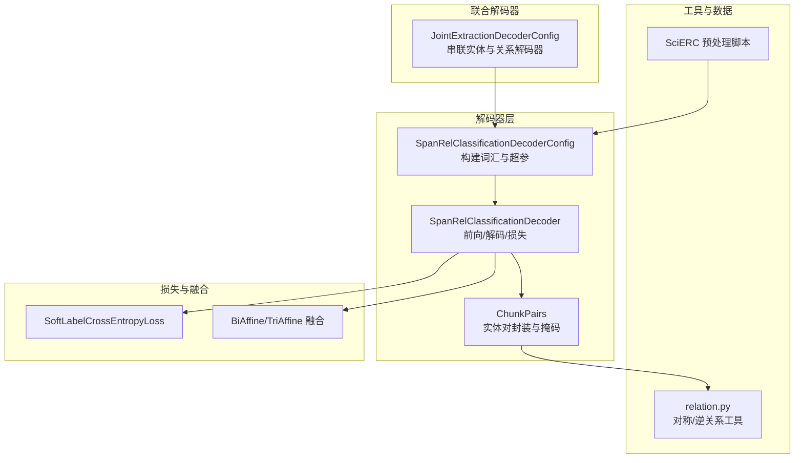
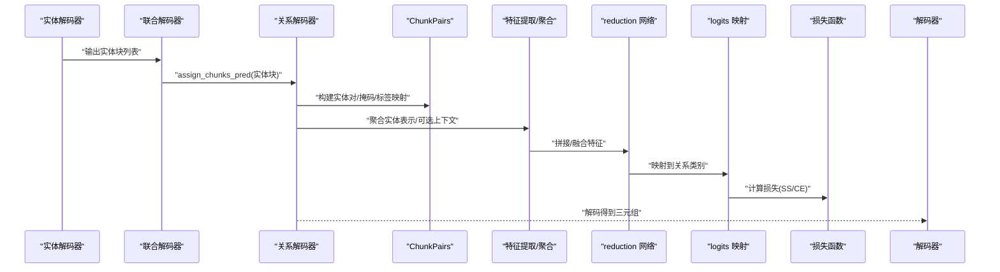
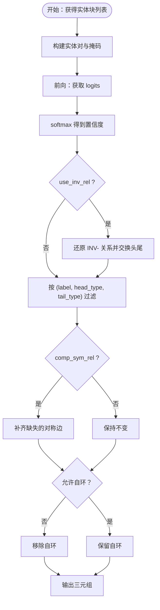
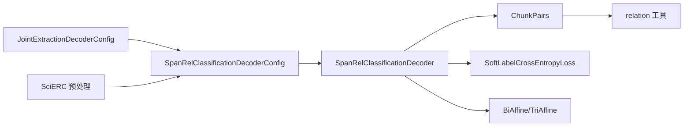

# 关系分类阶段

<cite>
**本文引用的文件**
- [span_rel_classification.py](file://eznlp/model/decoder/span_rel_classification.py)
- [chunks.py](file://eznlp/model/decoder/chunks.py)
- [relation.py](file://eznlp/utils/relation.py)
- [scierc-luan2018emnlp-process.py](file://data/SciERC/scierc-luan2018emnlp-process.py)
- [joint_extraction.py](file://eznlp/model/decoder/joint_extraction.py)
- [loss.py](file://eznlp/nn/modules/loss.py)
- [affine_fusor.py](file://eznlp/nn/modules/affine_fusor.py)
- [test_chunks.py](file://tests/model/test_chunks.py)
</cite>

## 目录
1. [引言](#引言)
2. [项目结构](#项目结构)
3. [核心组件](#核心组件)
4. [架构总览](#架构总览)
5. [详细组件分析](#详细组件分析)
6. [依赖分析](#依赖分析)
7. [性能考虑](#性能考虑)
8. [故障排查指南](#故障排查指南)
9. [结论](#结论)
10. [附录](#附录)

## 引言
本节聚焦于管道式抽取中“关系分类”阶段的实现，系统阐述以下关键点：
- SpanRelClassificationDecoderConfig 如何接收上一阶段（实体识别）输出的实体块预测结果作为输入；
- 模型如何构建实体对（chunk pairs），并提取上下文特征、实体大小嵌入与标签嵌入；
- 通过 fusing_mode（如 concat 或 affine）融合多模态特征；
- reduction 网络如何对拼接特征进行降维；
- 通过 SoftLabelCrossEntropyLoss（SS）或标准交叉熵损失进行关系分类；
- 在 SciERC 数据集处理逻辑下，sym_rel_labels 与 use_inv_rel 参数在对称关系处理中的作用；
- 从实体块列表到关系三元组（头实体、尾实体、关系标签）的完整推理流程示例；
- neg_sampling_rate 在训练阶段对负样本平衡的影响。

## 项目结构
关系分类模块位于解码器子系统，围绕“实体块对（Chunk Pairs）”组织建模与推理。核心文件包括：
- 解码器配置与实现：span_rel_classification.py
- 实体块对封装与采样：chunks.py
- 对称/逆关系工具函数：relation.py
- SciERC 数据预处理脚本：scierc-luan2018emnlp-process.py
- 管道联合解码器调用链：joint_extraction.py
- 损失函数实现：loss.py
- 多仿射融合算子：affine_fusor.py
- 单元测试覆盖：tests/model/test_chunks.py

图表来源
- [span_rel_classification.py](file://eznlp/model/decoder/span_rel_classification.py#L155-L317)
- [chunks.py](file://eznlp/model/decoder/chunks.py#L1-L193)
- [relation.py](file://eznlp/utils/relation.py#L1-L31)
- [scierc-luan2018emnlp-process.py](file://data/SciERC/scierc-luan2018emnlp-process.py#L1-L41)
- [joint_extraction.py](file://eznlp/model/decoder/joint_extraction.py#L68-L192)
- [loss.py](file://eznlp/nn/modules/loss.py#L1-L57)
- [affine_fusor.py](file://eznlp/nn/modules/affine_fusor.py#L1-L66)

章节来源
- [span_rel_classification.py](file://eznlp/model/decoder/span_rel_classification.py#L155-L317)
- [chunks.py](file://eznlp/model/decoder/chunks.py#L1-L193)
- [relation.py](file://eznlp/utils/relation.py#L1-L31)
- [scierc-luan2018emnlp-process.py](file://data/SciERC/scierc-luan2018emnlp-process.py#L1-L41)
- [joint_extraction.py](file://eznlp/model/decoder/joint_extraction.py#L68-L192)
- [loss.py](file://eznlp/nn/modules/loss.py#L1-L57)
- [affine_fusor.py](file://eznlp/nn/modules/affine_fusor.py#L1-L66)

## 核心组件
- SpanRelClassificationDecoderConfig：负责关系分类的配置项，包括是否使用上下文、实体大小与标签嵌入维度、融合方式、reduction 网络、损失类型（含 SS）、对称关系与逆关系处理、检查 rht 标签、none 标签、以及负采样率等。
- SpanRelClassificationDecoder：具体实现，包含聚合、上下文收集、实体对特征拼接/融合、降维映射到关系类别、损失计算与解码生成三元组。
- ChunkPairs：封装实体块列表及其两两组合，构建非有效掩码、距离编码、标签映射，并在训练时支持负样本率控制。
- relation 工具：提供对称关系缺失补全与逆关系检测/计数。
- JointExtractionDecoderConfig：在管道式流水线中，先运行实体解码器，再将预测实体传入关系解码器。

章节来源
- [span_rel_classification.py](file://eznlp/model/decoder/span_rel_classification.py#L155-L317)
- [span_rel_classification.py](file://eznlp/model/decoder/span_rel_classification.py#L319-L585)
- [chunks.py](file://eznlp/model/decoder/chunks.py#L1-L193)
- [relation.py](file://eznlp/utils/relation.py#L1-L31)
- [joint_extraction.py](file://eznlp/model/decoder/joint_extraction.py#L68-L192)

## 架构总览
关系分类阶段的端到端流程如下：
- 上游实体解码器输出实体块列表（或联合模式下在线生成）；
- 关系解码器接收这些实体块，构建实体对（head, tail）；
- 对每个实体对，抽取上下文向量（可选）、拼接实体表示、实体大小嵌入、标签嵌入；
- 通过 fusing_mode（concat/affine）融合多模态特征；
- 使用 reduction 网络降维后映射到关系类别；
- 训练时采用 SoftLabelCrossEntropyLoss（SS）或交叉熵损失；
- 推理时按置信度阈值过滤并应用对称/逆关系规则，输出三元组。

图表来源
- [joint_extraction.py](file://eznlp/model/decoder/joint_extraction.py#L166-L192)
- [span_rel_classification.py](file://eznlp/model/decoder/span_rel_classification.py#L406-L585)
- [chunks.py](file://eznlp/model/decoder/chunks.py#L83-L193)

## 详细组件分析

### SpanRelClassificationDecoderConfig：输入与配置
- 输入来源：通过 JointExtractionDecoderConfig 的 forward/decode 流程，在关系解码器执行前由实体解码器提供实体块列表；关系解码器内部通过 assign_chunks_pred 将其写入 Batch 的 cp_objs。
- 关键配置：
  - use_context：是否引入实体间上下文向量；
  - size_emb_dim/label_emb_dim：实体大小与标签嵌入维度；
  - fusing_mode：concat 或 affine；
  - reduction/reduction_ctx/reduction_cat：reduction 网络配置；
  - neg_sampling_rate：训练时负样本掩码概率；
  - sym_rel_labels/use_inv_rel/check_rht_labels：对称关系与逆关系处理；
  - ss_epsilon：软标签平滑系数；
  - none_label/idx2label/idx2ck_label：标签体系与 none 索引。

章节来源
- [joint_extraction.py](file://eznlp/model/decoder/joint_extraction.py#L166-L192)
- [span_rel_classification.py](file://eznlp/model/decoder/span_rel_classification.py#L155-L244)
- [span_rel_classification.py](file://eznlp/model/decoder/span_rel_classification.py#L245-L317)

### 实体对构建与上下文提取
- 实体对枚举：通过 enumerate_chunk_pairs 生成所有 (head, tail)，并根据句子边界、最大距离阈值、自环过滤、rht 标签检查等规则打上有效性标记。
- 上下文收集：当 use_context 为真时，对每对实体计算中间上下文段（head 后、tail 前或相反方向），经聚合池化得到上下文向量；无效对使用零向量占位。
- 特征拼接：
  - concat：将 head/tail 表示拼接，若启用上下文则进一步拼接上下文向量；
  - affine：分别对 head/tail 进行 reduction_head/reduction_tail，若启用上下文则额外 reduction_ctx，再通过 BiAffine/TriAffine 融合。

章节来源
- [span_rel_classification.py](file://eznlp/model/decoder/span_rel_classification.py#L319-L585)
- [chunks.py](file://eznlp/model/decoder/chunks.py#L128-L193)

### 融合与降维
- concat 模式：reduction_cat 可选地对拼接后的高维特征进行 FFN 降维，随后线性层映射到类别数；
- affine 模式：分别对 head/tail/reduction_ctx（若有）进行降维，再通过 BiAffine/TriAffine 融合，最后映射到类别数；
- L2 正则：在 affine 模式下可对融合权重施加 L2 正则。

章节来源
- [span_rel_classification.py](file://eznlp/model/decoder/span_rel_classification.py#L374-L403)
- [affine_fusor.py](file://eznlp/nn/modules/affine_fusor.py#L1-L66)

### 损失函数与标签平滑
- 损失类型：默认交叉熵；当 ss_epsilon > 0 时切换为 SoftLabelCrossEntropyLoss（SS），实现标签平滑；
- 标签平滑：在训练时将 hard one-hot 标签转换为 soft targets，提升泛化能力；
- 分类损失：仅对非掩码位置（non_mask）计算；若开启实体块分类辅助（ck_loss_weight > 0），则同时计算实体块分类损失。

章节来源
- [span_rel_classification.py](file://eznlp/model/decoder/span_rel_classification.py#L404-L405)
- [loss.py](file://eznlp/nn/modules/loss.py#L1-L57)
- [chunks.py](file://eznlp/model/decoder/chunks.py#L173-L193)

### 对称关系与逆关系处理（SciERC）
- sym_rel_labels：指定对称关系集合；
- comp_sym_rel：是否自动补齐缺失的对称边（若存在 (h,t) 且 label 属于 sym_rel_labels，但 (t,h) 缺失，则补齐）；
- use_inv_rel：是否引入逆关系标签（INV-前缀），并将不存在的逆对加入标签体系；
- check_rht_labels：是否基于 (label, head_type, tail_type) 过滤候选实体对；
- SciERC 预处理脚本会将文档切分为句子片段，并将实体与关系以“句内索引”形式保存，便于后续按句子边界约束实体对。

章节来源
- [span_rel_classification.py](file://eznlp/model/decoder/span_rel_classification.py#L283-L304)
- [relation.py](file://eznlp/utils/relation.py#L1-L31)
- [scierc-luan2018emnlp-process.py](file://data/SciERC/scierc-luan2018emnlp-process.py#L1-L41)

### 从实体块到关系三元组的推理流程
- 解码步骤：对每个实体对，softmax 得到类别置信度，筛选置信度高于阈值且非 none 的关系；
- 过滤规则：
  - 若 use_inv_rel，先将 INV- 类别还原为原标签并交换头尾；
  - 按 check_rht_labels 过滤；
  - 若 comp_sym_rel，补齐缺失的对称边；
  - 移除自环（head 与 tail 相同）（除非允许）；
- 输出：三元组列表（label, head, tail）。

图表来源
- [span_rel_classification.py](file://eznlp/model/decoder/span_rel_classification.py#L90-L126)
- [span_rel_classification.py](file://eznlp/model/decoder/span_rel_classification.py#L562-L585)
- [relation.py](file://eznlp/utils/relation.py#L1-L31)

章节来源
- [span_rel_classification.py](file://eznlp/model/decoder/span_rel_classification.py#L90-L126)
- [span_rel_classification.py](file://eznlp/model/decoder/span_rel_classification.py#L562-L585)
- [relation.py](file://eznlp/utils/relation.py#L1-L31)

### 训练阶段负样本平衡：neg_sampling_rate
- 在训练时，若 neg_sampling_rate < 1，会对非掩码矩阵 non_mask 进行伯努利采样，按概率缩放负样本权重；
- 对于正样本（实际标注的关系对），强制设为 1，确保正样本不被抑制；
- 该机制有助于缓解类别不平衡问题，尤其在实体对数量巨大时控制计算开销。

章节来源
- [chunks.py](file://eznlp/model/decoder/chunks.py#L136-L149)

## 依赖分析
- 组件耦合：
  - JointExtractionDecoderConfig 通过 assign_chunks_pred 将实体块注入 Batch 的 cp_objs，关系解码器直接依赖该输入；
  - SpanRelClassificationDecoderConfig 内部维护标签体系、距离阈值、对称/逆关系策略；
  - ChunkPairs 负责实体对的构建、掩码与标签映射，贯穿训练与推理；
  - relation 工具函数用于对称关系补齐与逆关系检测；
  - 损失模块 SoftLabelCrossEntropyLoss 与 BiAffine/TriAffine 融合模块提供灵活的分类路径。
- 外部依赖：
  - SciERC 预处理脚本提供标准化的数据格式，便于在句子边界约束下进行实体对枚举与过滤。

图表来源
- [joint_extraction.py](file://eznlp/model/decoder/joint_extraction.py#L166-L192)
- [span_rel_classification.py](file://eznlp/model/decoder/span_rel_classification.py#L155-L317)
- [chunks.py](file://eznlp/model/decoder/chunks.py#L1-L193)
- [relation.py](file://eznlp/utils/relation.py#L1-L31)
- [loss.py](file://eznlp/nn/modules/loss.py#L1-L57)
- [affine_fusor.py](file://eznlp/nn/modules/affine_fusor.py#L1-L66)
- [scierc-luan2018emnlp-process.py](file://data/SciERC/scierc-luan2018emnlp-process.py#L1-L41)

章节来源
- [joint_extraction.py](file://eznlp/model/decoder/joint_extraction.py#L166-L192)
- [span_rel_classification.py](file://eznlp/model/decoder/span_rel_classification.py#L155-L317)
- [chunks.py](file://eznlp/model/decoder/chunks.py#L1-L193)
- [relation.py](file://eznlp/utils/relation.py#L1-L31)
- [loss.py](file://eznlp/nn/modules/loss.py#L1-L57)
- [affine_fusor.py](file://eznlp/nn/modules/affine_fusor.py#L1-L66)
- [scierc-luan2018emnlp-process.py](file://data/SciERC/scierc-luan2018emnlp-process.py#L1-L41)

## 性能考虑
- 计算复杂度：实体对数量随实体数平方增长，建议在实体规模较大时启用 use_context 与合理的 max_span_size，减少无效对；
- 内存占用：concat 模式下拼接维度较高，affine 模式通过仿射融合降低冗余，适合大规模关系分类；
- 负采样：neg_sampling_rate 可显著降低负样本比例，提高训练效率；
- 标签平滑：ss_epsilon 提升鲁棒性，但可能略微稀释梯度强度，需结合任务调参。

## 故障排查指南
- 实体对为空：确认实体解码器输出是否为空，或 JointExtractionDecoderConfig 是否正确传递；
- 掩码异常：检查 check_rht_labels 与 existing_ht_labels 是否与数据一致；
- 对称关系缺失：开启 comp_sym_rel 并核对 sym_rel_labels；
- 逆关系未生效：确认 use_inv_rel 与 INV_REL_PREFIX 前缀是否匹配；
- 负采样效果差：适当调整 neg_sampling_rate，避免过度抑制负样本。

章节来源
- [test_chunks.py](file://tests/model/test_chunks.py#L1-L137)
- [span_rel_classification.py](file://eznlp/model/decoder/span_rel_classification.py#L90-L126)
- [chunks.py](file://eznlp/model/decoder/chunks.py#L136-L149)

## 结论
关系分类阶段通过“实体块对”统一建模，结合上下文与多模态嵌入，采用 concat/affine 融合策略与 reduction 网络完成降维映射，并以 SS 或交叉熵损失进行训练。在 SciERC 数据集场景下，通过 sym_rel_labels 与 use_inv_rel 等配置，能够稳健处理对称关系与逆关系，配合 neg_sampling_rate 实现负样本平衡。推理流程清晰，易于扩展至更复杂的语义关系建模。

## 附录
- 示例：从实体块列表到关系三元组的完整推理流程见“推理流程图”与对应源码路径；
- 配置建议：在大规模数据上优先考虑 affine 融合与上下文聚合；对称关系密集的任务启用 comp_sym_rel 与 use_inv_rel。