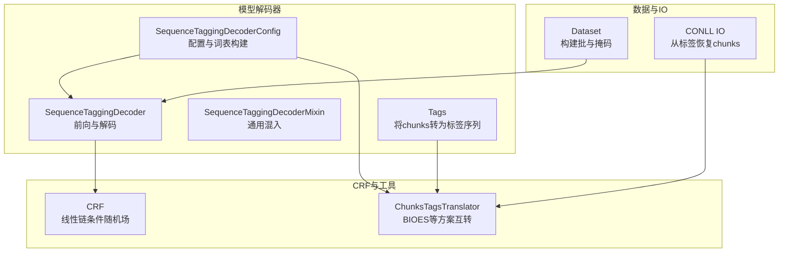
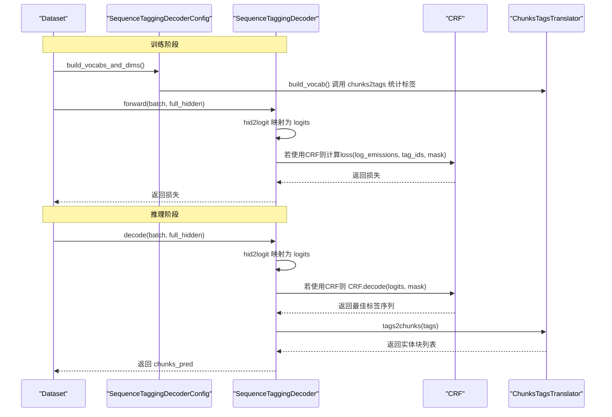
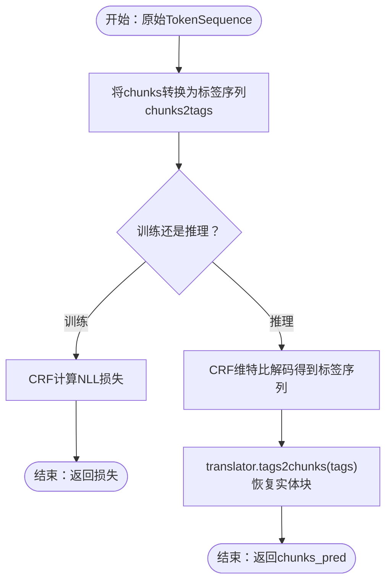
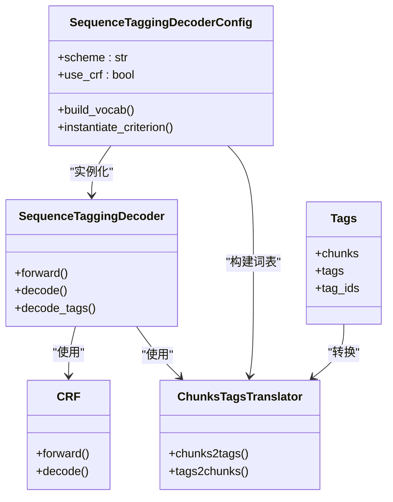

# 实体识别阶段

<cite>
**本文引用的文件**
- [sequence_tagging.py](file://eznlp/model/decoder/sequence_tagging.py)
- [crf.py](file://eznlp/nn/modules/crf.py)
- [transition.py](file://eznlp/utils/transition.py)
- [test_sequence_tagging.py](file://tests/model/test_sequence_tagging.py)
- [test_chunks.py](file://tests/model/test_chunks.py)
- [conll.py](file://eznlp/io/conll.py)
- [base.py](file://eznlp/model/model/base.py)
- [dataset.py](file://eznlp/dataset.py)
</cite>

## 目录
1. [简介](#简介)
2. [项目结构](#项目结构)
3. [核心组件](#核心组件)
4. [架构总览](#架构总览)
5. [详细组件分析](#详细组件分析)
6. [依赖关系分析](#依赖关系分析)
7. [性能考量](#性能考量)
8. [故障排查指南](#故障排查指南)
9. [结论](#结论)
10. [附录](#附录)

## 简介
本节聚焦于管道式抽取中“实体识别”阶段的实现机制，围绕以下目标展开：
- 解析 SequenceTaggingDecoderConfig 如何配置 BIOES 标注方案与 CRF 解码器；
- 训练阶段：说明 Tags 类如何将实体块（chunks）转换为标签序列，并通过 CRF 层进行序列标注；
- 推理阶段：解释 decode 方法如何将模型输出的标签序列经由 translator.tags2chunks 反向转换为实体块；
- 结合 test_chunks.py 中的测试用例，说明当输入文本无有效实体时，系统如何处理空预测结果（chunks_pred）；
- 提供从原始 TokenSequence 到实体块列表的完整转换示例；
- 分析 CRF 层对标签转移约束的建模能力及其对实体边界识别精度的影响。

## 项目结构
实体识别相关代码主要分布在如下模块：
- 模型解码器：sequence_tagging.py 定义了序列标注解码器、配置与混合器；
- 条件随机场：crf.py 实现线性链 CRF 的前向、损失与维特比解码；
- 标签与实体块互转：transition.py 提供多种标注方案（含 BIOES）及双向转换逻辑；
- 数据与 IO：dataset.py、conll.py 负责构建批数据、掩码与从标签序列恢复实体块；
- 测试：test_sequence_tagging.py、test_chunks.py 验证训练/推理流程与空预测处理。

图表来源
- [sequence_tagging.py](file://eznlp/model/decoder/sequence_tagging.py#L93-L198)
- [crf.py](file://eznlp/nn/modules/crf.py#L1-L204)
- [transition.py](file://eznlp/utils/transition.py#L11-L242)
- [dataset.py](file://eznlp/dataset.py#L92-L115)
- [conll.py](file://eznlp/io/conll.py#L73-L134)

章节来源
- [sequence_tagging.py](file://eznlp/model/decoder/sequence_tagging.py#L93-L198)
- [crf.py](file://eznlp/nn/modules/crf.py#L1-L204)
- [transition.py](file://eznlp/utils/transition.py#L11-L242)
- [dataset.py](file://eznlp/dataset.py#L92-L115)
- [conll.py](file://eznlp/io/conll.py#L73-L134)

## 核心组件
- SequenceTaggingDecoderConfig
  - 支持 scheme（默认 BIOES）、use_crf（默认 True）、in_drop_rates 等参数；
  - 通过 build_vocab 统计标签并生成 idx2tag；
  - instantiate_criterion 在 use_crf 时返回 CRF 实例。
- SequenceTaggingDecoder
  - 前向：将编码器隐藏态映射为 logits，若使用 CRF 则以标签序列与掩码计算负对数似然；
  - 解码：若使用 CRF 则调用 CRF.decode 进行维特比解码，否则取 argmax 并去填充；
  - 最终将标签序列经 translator.tags2chunks 转换为实体块列表。
- Tags
  - 将数据条目中的 chunks 转换为标签序列（基于 translator.chunks2tags），并生成 tag_ids。
- ChunksTagsTranslator
  - 支持 BIOES、BMES、BILOU、BIO1/BIO2、OntoNotes 等方案；
  - 提供 chunks2tags 与 tags2chunks 双向转换；
  - 内部基于 transition.xlsx 的合法转移规则约束边界识别。
- CRF
  - 参数包含 sos_transitions、transitions、eos_transitions；
  - forward 返回 NLL 损失；decode 使用维特比算法求最优路径。

章节来源
- [sequence_tagging.py](file://eznlp/model/decoder/sequence_tagging.py#L93-L198)
- [transition.py](file://eznlp/utils/transition.py#L11-L242)
- [crf.py](file://eznlp/nn/modules/crf.py#L1-L204)

## 架构总览
下图展示从 TokenSequence 到实体块的端到端流程，包括训练与推理两条主线。

图表来源
- [sequence_tagging.py](file://eznlp/model/decoder/sequence_tagging.py#L143-L198)
- [crf.py](file://eznlp/nn/modules/crf.py#L69-L90)
- [transition.py](file://eznlp/utils/transition.py#L166-L216)
- [dataset.py](file://eznlp/dataset.py#L92-L115)

## 详细组件分析

### SequenceTaggingDecoderConfig：BIOES 与 CRF 配置
- scheme 默认为 "BIOES"，可通过参数覆盖；
- use_crf 默认 True，启用 CRF 作为损失/解码准则；
- build_vocab 会遍历数据，调用 translator.chunks2tags 统计标签集合，生成 idx2tag；
- instantiate_criterion 在 use_crf 时返回 CRF(tag_dim=voc_dim, pad_idx=pad_idx, batch_first=True)。

章节来源
- [sequence_tagging.py](file://eznlp/model/decoder/sequence_tagging.py#L93-L138)

### Tags：从实体块到标签序列
- 在训练模式下，Tags 构造函数接收 data_entry 与 config；
- 通过 translator.chunks2tags 将 chunks 转为 tags，并映射为 tag_ids；
- 该过程确保更长实体优先覆盖，避免嵌套或越界导致的不可检索。

章节来源
- [sequence_tagging.py](file://eznlp/model/decoder/sequence_tagging.py#L65-L91)
- [transition.py](file://eznlp/utils/transition.py#L79-L154)

### SequenceTaggingDecoder：训练与推理
- 训练前向：
  - 先将 full_hidden 通过 dropout 与线性层映射为 logits；
  - 若使用 CRF，则将 batch 中的 tag_ids 按步拼接并以 mask 计算损失；
  - 否则按每个样本长度切片后计算交叉熵损失。
- 推理 decode：
  - 若使用 CRF，调用 CRF.decode(logits, mask) 得到最佳标签序列；
  - 否则取 argmax 并去填充；
  - 最终将标签序列经 translator.tags2chunks 转为实体块列表。

章节来源
- [sequence_tagging.py](file://eznlp/model/decoder/sequence_tagging.py#L143-L198)
- [crf.py](file://eznlp/nn/modules/crf.py#L69-L90)

### CRF：标签转移约束与边界识别
- CRF 参数：
  - sos_transitions：从起始符号到各标签的转移分数；
  - transitions：标签间转移分数；
  - eos_transitions：从各标签到结束符号的转移分数；
  - pad_idx 处的转移被抑制，避免无效标签参与路径评分。
- 前向与解码：
  - forward：计算 log(Z(x)) - Σ(发射分数 + 转移分数)，返回损失；
  - decode：维特比算法回溯最优路径，考虑 mask 与终止状态。

章节来源
- [crf.py](file://eznlp/nn/modules/crf.py#L1-L204)

### 标注方案与边界规则：BIOES
- BIOES 将单字实体标记为 S，多字实体以 B 开头、中间为 I、末尾为 E；
- translator.chunks2tags 对更长实体优先标注，避免嵌套或越界；
- tags2chunks 基于 transition.xlsx 的合法转移规则判断开始/结束/延续，从而恢复实体边界；
- breaking_for_types 控制同段内不同类型的强制断开策略。

章节来源
- [transition.py](file://eznlp/utils/transition.py#L79-L154)
- [transition.py](file://eznlp/utils/transition.py#L166-L216)

### 从 TokenSequence 到实体块列表的完整转换示例
- 数据 IO：CONLL 文件读取时，使用 translator.tags2chunks 将标签序列还原为 chunks；
- Pipeline 场景：当仅提供 tokens 且不带 gold chunks 时，测试用例验证 predict 输出应包含空列表（无有效实体）。

图表来源
- [sequence_tagging.py](file://eznlp/model/decoder/sequence_tagging.py#L143-L198)
- [transition.py](file://eznlp/utils/transition.py#L166-L216)
- [conll.py](file://eznlp/io/conll.py#L73-L134)

章节来源
- [conll.py](file://eznlp/io/conll.py#L73-L134)
- [test_sequence_tagging.py](file://tests/model/test_sequence_tagging.py#L203-L213)

### 测试用例：空预测结果（chunks_pred）
- 当 pipeline 模式下未提供 gold chunks，测试用例通过给每个样本设置空的 chunks_pred，验证推理阶段不会报错；
- 该行为表明系统能正确处理“无有效实体”的输入，返回空列表作为预测结果。

章节来源
- [test_chunks.py](file://tests/model/test_chunks.py#L1-L169)
- [test_sequence_tagging.py](file://tests/model/test_sequence_tagging.py#L203-L213)

## 依赖关系分析
- SequenceTaggingDecoderConfig 依赖：
  - ChunksTagsTranslator（构建词表、标签转换）；
  - CRF（当 use_crf=True 时）。
- SequenceTaggingDecoder 依赖：
  - SequenceTaggingDecoderConfig（获取 scheme、voc_dim、pad_idx）；
  - CRF（训练/解码）；
  - ChunksTagsTranslator（解码后将标签转回实体块）。
- Dataset 与 Batch：
  - 提供 seq_lens、mask 等张量，供 CRF 与解码器使用；
  - 与模型基类配合完成 forward 与 decode 的状态传递。

图表来源
- [sequence_tagging.py](file://eznlp/model/decoder/sequence_tagging.py#L93-L198)
- [crf.py](file://eznlp/nn/modules/crf.py#L1-L204)
- [transition.py](file://eznlp/utils/transition.py#L11-L242)

章节来源
- [sequence_tagging.py](file://eznlp/model/decoder/sequence_tagging.py#L93-L198)
- [crf.py](file://eznlp/nn/modules/crf.py#L1-L204)
- [transition.py](file://eznlp/utils/transition.py#L11-L242)

## 性能考量
- CRF 的 batch_first 与掩码处理：
  - CRF.forward/decode 在 batch_first=True 时会做维度变换，注意与编码器输出维度匹配；
  - 掩码用于忽略填充位置，避免对损失与解码产生干扰。
- 标签空间规模：
  - 使用 CRF 时，标签维度越大，转移矩阵参数越多，训练稳定性与收敛速度可能受影响；
  - 建议在构建词表时控制标签种类数量，避免过度稀疏。
- 解码效率：
  - 维特比解码复杂度为 O(T·N^2)，其中 T 为序列长度，N 为标签数；
  - 对长序列可考虑分段处理或降低标签维度。

[本节为通用指导，无需特定文件来源]

## 故障排查指南
- 标签非法或边界错误：
  - 使用 translator.check_transitions_legal 检查标签序列是否满足转移规则；
  - 若出现连续 I/E 不匹配，检查 chunks2tags 的优先级与越界处理。
- CRF 损失异常：
  - 确认 pad_idx 设置正确，避免无效标签参与转移；
  - 检查 mask 是否与 logits 维度一致。
- 推理结果为空：
  - 确认 translator.breaking_for_types 的设置是否导致类型断开；
  - 检查 CRF 解码是否因高噪声导致全 O 或全 S 的标签序列。

章节来源
- [transition.py](file://eznlp/utils/transition.py#L57-L68)
- [crf.py](file://eznlp/nn/modules/crf.py#L56-L61)

## 结论
- SequenceTaggingDecoderConfig 通过 scheme 与 use_crf 精准控制标注方案与解码策略；
- Tags 将实体块转换为标签序列，CRF 在训练阶段对标签转移进行全局正则化，提升边界识别的全局一致性；
- 推理阶段通过 CRF.decode 或 argmax 获取标签序列，再由 translator.tags2chunks 恢复实体块；
- 当输入文本无有效实体时，系统能稳定返回空预测结果，保证 pipeline 的鲁棒性；
- BIOES 等标注方案与 CRF 的联合使用，显著提升了实体边界识别的精度与稳定性。

[本节为总结，无需特定文件来源]

## 附录
- 关键接口路径参考：
  - SequenceTaggingDecoderConfig.__init__：[sequence_tagging.py](file://eznlp/model/decoder/sequence_tagging.py#L93-L104)
  - SequenceTaggingDecoderConfig.build_vocab：[sequence_tagging.py](file://eznlp/model/decoder/sequence_tagging.py#L129-L138)
  - SequenceTaggingDecoderConfig.instantiate_criterion：[sequence_tagging.py](file://eznlp/model/decoder/sequence_tagging.py#L123-L128)
  - SequenceTaggingDecoder.forward：[sequence_tagging.py](file://eznlp/model/decoder/sequence_tagging.py#L157-L179)
  - SequenceTaggingDecoder.decode_tags：[sequence_tagging.py](file://eznlp/model/decoder/sequence_tagging.py#L181-L193)
  - SequenceTaggingDecoder.decode：[sequence_tagging.py](file://eznlp/model/decoder/sequence_tagging.py#L195-L198)
  - CRF.forward/decode：[crf.py](file://eznlp/nn/modules/crf.py#L69-L90)
  - ChunksTagsTranslator.chunks2tags/tags2chunks：[transition.py](file://eznlp/utils/transition.py#L79-L154), [transition.py](file://eznlp/utils/transition.py#L166-L216)
  - Dataset.collate 提供 mask：[dataset.py](file://eznlp/dataset.py#L104-L115)
  - CONLL IO 中 tags2chunks：[conll.py](file://eznlp/io/conll.py#L73-L134)
  - Pipeline 推理空预测用例：[test_sequence_tagging.py](file://tests/model/test_sequence_tagging.py#L203-L213)