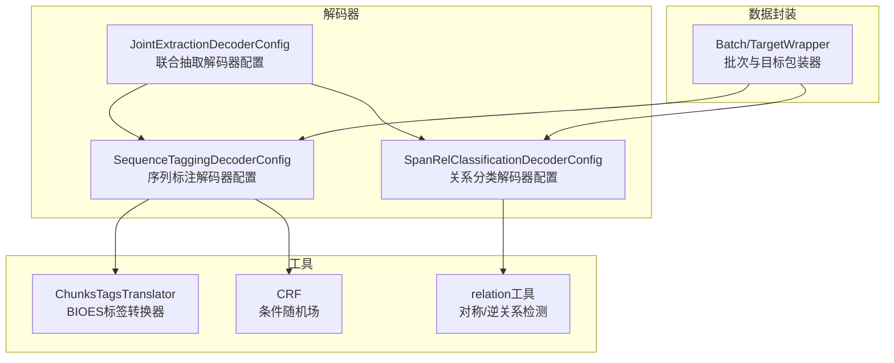
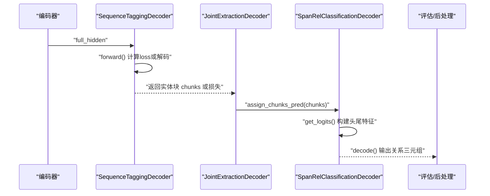
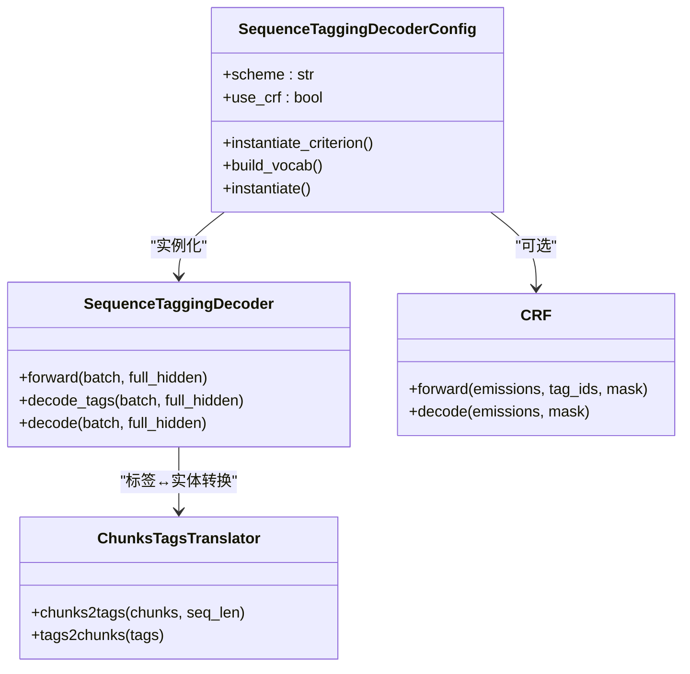
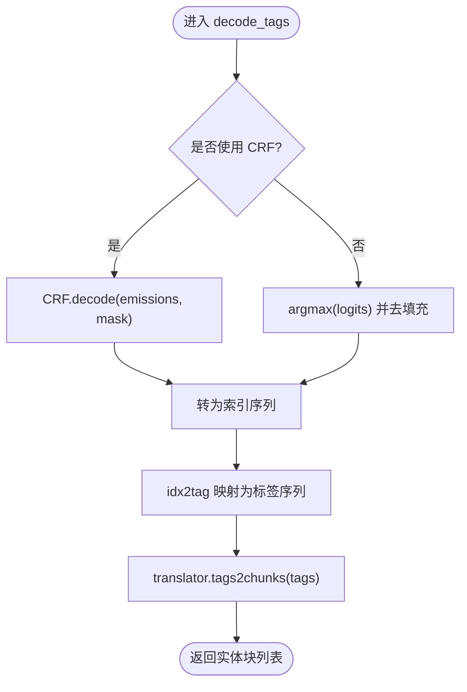
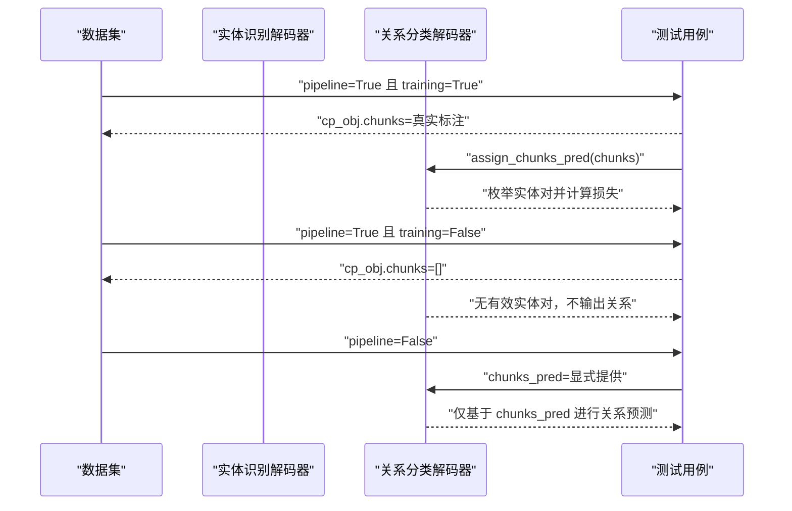
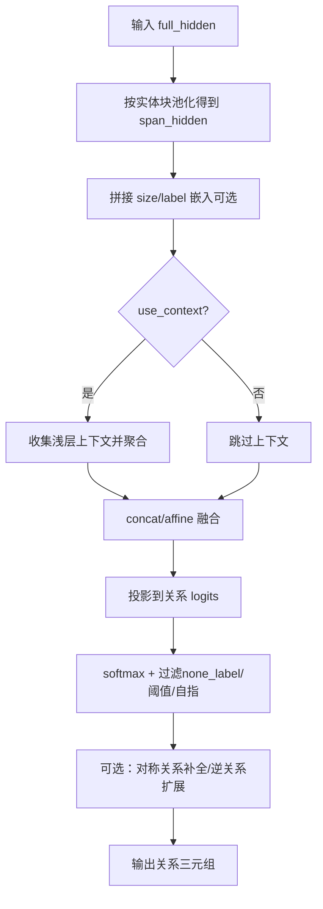
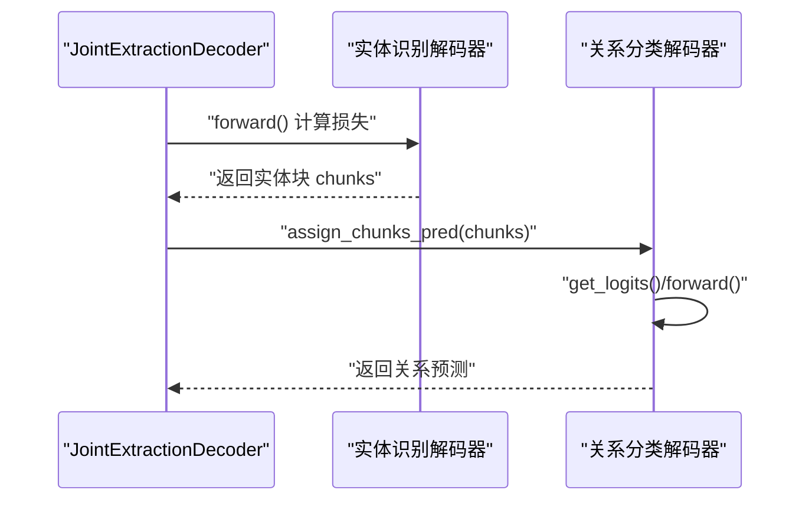
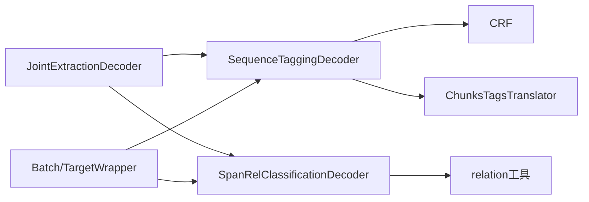

# 管道式抽取模式

<cite>
**本文引用的文件列表**
- [sequence_tagging.py](file://eznlp/model/decoder/sequence_tagging.py)
- [crf.py](file://eznlp/nn/modules/crf.py)
- [transition.py](file://eznlp/utils/transition.py)
- [chunk.py](file://eznlp/utils/chunk.py)
- [joint_extraction.py](file://eznlp/model/decoder/joint_extraction.py)
- [span_rel_classification.py](file://eznlp/model/decoder/span_rel_classification.py)
- [relation.py](file://eznlp/utils/relation.py)
- [base.py](file://eznlp/model/decoder/base.py)
- [wrapper.py](file://eznlp/wrapper.py)
- [test_chunks.py](file://tests/model/test_chunks.py)
</cite>

## 目录
1. [引言](#引言)
2. [项目结构](#项目结构)
3. [核心组件](#核心组件)
4. [架构总览](#架构总览)
5. [详细组件分析](#详细组件分析)
6. [依赖关系分析](#依赖关系分析)
7. [性能考量](#性能考量)
8. [故障排查指南](#故障排查指南)
9. [结论](#结论)
10. [附录](#附录)

## 引言
本文件系统性阐述该仓库中“管道式关系抽取”的两阶段实现机制：第一阶段使用序列标注解码器（SequenceTaggingDecoderConfig）进行实体识别；第二阶段将第一阶段预测得到的实体块（chunks）作为输入，交由关系分类解码器（SpanRelClassificationDecoderConfig）完成关系抽取。文档重点解析：
- CRF 层与 BIOES 标注方案的协同工作原理，以及 SequenceTaggingDecoder 中 decode 方法如何将标签序列转换为实体块（chunks）
- 基于测试用例对 pipeline 模式下训练与推理阶段的数据流差异进行说明，特别关注当实体预测结果（chunks_pred）为空时的处理机制
- 提供从原始文本到最终关系三元组的完整处理流程示例
- 对比分析管道式方法与联合抽取在误差传播与计算效率方面的优劣

## 项目结构
围绕管道式抽取的关键模块分布如下：
- 解码器层：序列标注解码器、联合抽取解码器、关系分类解码器
- 工具层：标签-实体转换器（BIOES）、CRF 实现、关系工具函数
- 数据封装：Batch/TargetWrapper 批次与目标包装器
- 测试：针对 pipeline 模式与 chunks 的行为验证

图表来源
- [sequence_tagging.py](file://eznlp/model/decoder/sequence_tagging.py#L93-L198)
- [joint_extraction.py](file://eznlp/model/decoder/joint_extraction.py#L68-L193)
- [span_rel_classification.py](file://eznlp/model/decoder/span_rel_classification.py#L156-L585)
- [transition.py](file://eznlp/utils/transition.py#L12-L267)
- [crf.py](file://eznlp/nn/modules/crf.py#L1-L204)
- [relation.py](file://eznlp/utils/relation.py#L1-L31)
- [wrapper.py](file://eznlp/wrapper.py#L1-L122)

章节来源
- [sequence_tagging.py](file://eznlp/model/decoder/sequence_tagging.py#L1-L198)
- [joint_extraction.py](file://eznlp/model/decoder/joint_extraction.py#L1-L193)
- [span_rel_classification.py](file://eznlp/model/decoder/span_rel_classification.py#L1-L585)
- [transition.py](file://eznlp/utils/transition.py#L1-L267)
- [crf.py](file://eznlp/nn/modules/crf.py#L1-L204)
- [relation.py](file://eznlp/utils/relation.py#L1-L31)
- [wrapper.py](file://eznlp/wrapper.py#L1-L122)

## 核心组件
- 序列标注解码器（SequenceTaggingDecoderConfig/Decoder）
  - 支持 BIOES/BMES/BILOU 等多种标注方案，内部通过 ChunksTagsTranslator 完成 chunks 与 tags 的双向转换
  - 可选 CRF 训练与解码，decode 将标签序列转换为实体块（chunks）
- 联合抽取解码器（JointExtractionDecoderConfig/Decoder）
  - 组合多个子解码器（实体识别、属性抽取、关系抽取），在 forward/decode 阶段按顺序执行
  - 在 assign_chunks_pred 阶段将实体识别结果注入后续解码器
- 关系分类解码器（SpanRelClassificationDecoderConfig/Decoder）
  - 基于实体块构建头尾跨度特征，融合上下文向量，输出关系矩阵并对角线置零以避免自指
  - 支持对称关系补全、逆关系扩展等后处理策略
- 标签-实体转换器（ChunksTagsTranslator）
  - 实现 BIOES/BMES/BILOU 等标注方案的合法转移约束与转换
  - 提供 tags2chunks 的块提取逻辑
- CRF 模块（CRF）
  - 提供前向损失与维特比解码接口，支持 batch_first 排序与掩码
- 数据封装（Batch/TargetWrapper）
  - 统一承载批次张量与目标对象，贯穿训练/推理流程

章节来源
- [sequence_tagging.py](file://eznlp/model/decoder/sequence_tagging.py#L93-L198)
- [joint_extraction.py](file://eznlp/model/decoder/joint_extraction.py#L154-L193)
- [span_rel_classification.py](file://eznlp/model/decoder/span_rel_classification.py#L156-L585)
- [transition.py](file://eznlp/utils/transition.py#L12-L267)
- [crf.py](file://eznlp/nn/modules/crf.py#L1-L204)
- [wrapper.py](file://eznlp/wrapper.py#L1-L122)

## 架构总览
管道式抽取的两阶段控制流如下：
- 第一阶段：SequenceTaggingDecoder 对编码器隐藏态进行映射，若启用 CRF 则计算负对数似然损失；随后 decode 将标签序列转换为实体块（chunks）
- 第二阶段：SpanRelClassificationDecoder 读取实体块，构建头尾跨度表示与可选上下文，经融合与投影得到关系矩阵，过滤无效/非目标关系后输出三元组

图表来源
- [sequence_tagging.py](file://eznlp/model/decoder/sequence_tagging.py#L157-L198)
- [joint_extraction.py](file://eznlp/model/decoder/joint_extraction.py#L166-L193)
- [span_rel_classification.py](file://eznlp/model/decoder/span_rel_classification.py#L406-L585)

## 详细组件分析

### 序列标注解码器与 CRF 协同（BIOES）
- 配置与实例化
  - SequenceTaggingDecoderConfig 支持 scheme（默认 BIOES）、use_crf（默认 True）等参数
  - 若 use_crf，则 criterion 返回 CRF；否则使用交叉熵
- 训练与解码路径
  - forward：若 CRF，使用 pad_sequence 对齐标签并传入 CRF 计算损失；否则对每个样本单独计算 CE 损失
  - decode_tags：若 CRF，调用 CRF.decode 获取最佳路径；否则 argmax 后去填充
  - decode：将标签序列通过 ChunksTagsTranslator.tags2chunks 转换为实体块（chunks）
- BIOES 与标签转换
  - ChunksTagsTranslator 在 tags2chunks 中依据合法转移表判断开始/结束边界，从而提取实体块
  - 对于不同标注方案（BIOES/BMES/BILOU），内部通过映射与规则生成合法标签序列

图表来源
- [sequence_tagging.py](file://eznlp/model/decoder/sequence_tagging.py#L93-L198)
- [crf.py](file://eznlp/nn/modules/crf.py#L1-L204)
- [transition.py](file://eznlp/utils/transition.py#L12-L267)

章节来源
- [sequence_tagging.py](file://eznlp/model/decoder/sequence_tagging.py#L93-L198)
- [crf.py](file://eznlp/nn/modules/crf.py#L1-L204)
- [transition.py](file://eznlp/utils/transition.py#L12-L267)

### CRF 解码与标签到实体块（chunks）转换流程
- CRF 解码
  - CRF.decode 使用维特比算法在掩码下回溯最优标签序列
- 标签到实体块
  - ChunksTagsTranslator.tags2chunks 遍历标签序列，依据合法转移表（start_of_chunk/end_of_chunk）确定实体边界，聚合类型并形成（类型，起始，结束）三元组
  - 对于 OntoNotes 特殊格式，提供专用转换逻辑

图表来源
- [sequence_tagging.py](file://eznlp/model/decoder/sequence_tagging.py#L181-L198)
- [crf.py](file://eznlp/nn/modules/crf.py#L84-L204)
- [transition.py](file://eznlp/utils/transition.py#L167-L218)

章节来源
- [sequence_tagging.py](file://eznlp/model/decoder/sequence_tagging.py#L181-L198)
- [crf.py](file://eznlp/nn/modules/crf.py#L84-L204)
- [transition.py](file://eznlp/utils/transition.py#L167-L218)

### 管道式两阶段流程与 pipeline 模式差异
- 管道式流程
  - 第一阶段：SequenceTaggingDecoder.decode 返回实体块（chunks）
  - 第二阶段：SpanRelClassificationDecoder.assign_chunks_pred 接收 chunks，构建 ChunkPairs 对象并进行关系分类
- pipeline 模式下的数据流差异
  - 训练阶段：cp_obj.chunks 来自真实标注；枚举所有实体对，构造关系矩阵并计算损失
  - 推理阶段：cp_obj.chunks 为空（chunks_pred 未提供），此时关系分类器不产生有效关系对
  - 非 pipeline：显式提供 chunks_pred，关系分类器仅基于该集合进行关系预测

图表来源
- [test_chunks.py](file://tests/model/test_chunks.py#L1-L169)
- [span_rel_classification.py](file://eznlp/model/decoder/span_rel_classification.py#L406-L585)
- [joint_extraction.py](file://eznlp/model/decoder/joint_extraction.py#L166-L193)

章节来源
- [test_chunks.py](file://tests/model/test_chunks.py#L1-L169)
- [span_rel_classification.py](file://eznlp/model/decoder/span_rel_classification.py#L406-L585)
- [joint_extraction.py](file://eznlp/model/decoder/joint_extraction.py#L166-L193)

### 关系分类解码器（SpanRelClassification）要点
- 输入与特征
  - 从 full_hidden 中按实体块范围池化得到跨度表示，拼接跨度大小与标签嵌入（可选）
  - 可选浅层上下文（头尾跨度之间的片段向量）经池化/注意力聚合
- 融合与投影
  - concat 模式：拼接头尾表示与上下文，经 reduction_cat 投影到 logits
  - affine 模式：分别对头尾进行降维，再经 Bi-/TriAffine 融合
- 输出与过滤
  - softmax 得到类别置信度，按阈值与 none_label 过滤无效关系
  - 支持对称关系补全与逆关系扩展（detect_inverse）

图表来源
- [span_rel_classification.py](file://eznlp/model/decoder/span_rel_classification.py#L418-L585)
- [relation.py](file://eznlp/utils/relation.py#L1-L31)

章节来源
- [span_rel_classification.py](file://eznlp/model/decoder/span_rel_classification.py#L319-L585)
- [relation.py](file://eznlp/utils/relation.py#L1-L31)

### 联合抽取解码器（JointExtraction）与管道式衔接
- JointExtractionDecoder.forward/decode 顺序调用各子解码器
- assign_chunks_pred 将实体识别阶段的预测结果注入关系分类器
- 便于在 pipeline 模式下复用实体识别结果，减少重复计算

图表来源
- [joint_extraction.py](file://eznlp/model/decoder/joint_extraction.py#L166-L193)

章节来源
- [joint_extraction.py](file://eznlp/model/decoder/joint_extraction.py#L154-L193)

## 依赖关系分析
- SequenceTaggingDecoder 依赖 CRF 与 ChunksTagsTranslator
- SpanRelClassificationDecoder 依赖关系工具（对称/逆关系）与 ChunkPairs（由 cp_obj 构建）
- JointExtractionDecoder 将实体识别与关系分类串联，通过 assign_chunks_pred 实现数据传递
- Wrapper 提供 Batch/TargetWrapper，贯穿训练/推理

图表来源
- [sequence_tagging.py](file://eznlp/model/decoder/sequence_tagging.py#L93-L198)
- [crf.py](file://eznlp/nn/modules/crf.py#L1-L204)
- [transition.py](file://eznlp/utils/transition.py#L12-L267)
- [joint_extraction.py](file://eznlp/model/decoder/joint_extraction.py#L154-L193)
- [span_rel_classification.py](file://eznlp/model/decoder/span_rel_classification.py#L156-L585)
- [relation.py](file://eznlp/utils/relation.py#L1-L31)
- [wrapper.py](file://eznlp/wrapper.py#L1-L122)

章节来源
- [sequence_tagging.py](file://eznlp/model/decoder/sequence_tagging.py#L93-L198)
- [joint_extraction.py](file://eznlp/model/decoder/joint_extraction.py#L154-L193)
- [span_rel_classification.py](file://eznlp/model/decoder/span_rel_classification.py#L156-L585)
- [transition.py](file://eznlp/utils/transition.py#L12-L267)
- [crf.py](file://eznlp/nn/modules/crf.py#L1-L204)
- [relation.py](file://eznlp/utils/relation.py#L1-L31)
- [wrapper.py](file://eznlp/wrapper.py#L1-L122)

## 性能考量
- 计算复杂度
  - 管道式：实体识别 O(N·T)（N 为序列长度，T 为标签数），关系分类 O(K^2·D)（K 为实体数，D 为特征维度）
  - 联合抽取：整体 O(N·T + K^2·D)，但共享编码器隐藏态，理论上更高效
- 内存占用
  - 管道式：实体识别与关系分类分别独立，可能重复计算编码器隐藏态
  - 联合抽取：共享编码器隐藏态，减少重复计算，内存更友好
- 误差传播
  - 管道式：实体识别错误会直接传播至关系分类，导致关系预测退化
  - 联合抽取：端到端优化，实体与关系联合学习，降低误差传播风险

[本节为通用性能讨论，不直接分析具体文件]

## 故障排查指南
- 实体预测为空（chunks_pred=[]）
  - pipeline 推理阶段：cp_obj.chunks 为空，关系分类器不会输出任何关系对
  - 需确保在 pipeline 训练阶段提供真实标注，推理阶段提供实体预测
- 关系分类异常
  - 检查对称关系补全与逆关系扩展配置
  - 确认枚举实体对时的约束（句子内、距离阈值、自指过滤）
- 标注方案与边界
  - BIOES 合法转移约束由 ChunksTagsTranslator 提供，若出现边界错位，检查标签序列与分词对齐

章节来源
- [test_chunks.py](file://tests/model/test_chunks.py#L1-L169)
- [span_rel_classification.py](file://eznlp/model/decoder/span_rel_classification.py#L127-L154)
- [transition.py](file://eznlp/utils/transition.py#L58-L70)

## 结论
- 管道式关系抽取通过“实体识别 + 关系分类”两阶段实现，具备清晰的模块边界与可解释性
- CRF 与 BIOES 标注方案在 SequenceTaggingDecoder 中协同工作，decode 将标签序列稳定转换为实体块
- pipeline 模式下，训练与推理阶段的数据流差异显著：推理阶段 chunks_pred 为空会导致关系分类器无输出
- 联合抽取在端到端优化与误差传播控制方面具有优势，但需权衡计算与内存开销

[本节为总结性内容，不直接分析具体文件]

## 附录
- 从原始文本到关系三元组的完整流程示例（步骤化描述）
  1) 编码器对原始文本进行编码，输出隐藏态
  2) 实体识别解码器（SequenceTaggingDecoder）将隐藏态映射为标签序列，经 CRF 解码或 argmax 得到标签，再通过 ChunksTagsTranslator 转换为实体块（chunks）
  3) 关系分类解码器（SpanRelClassificationDecoder）接收实体块，构建头尾跨度特征与可选上下文，融合后投影得到关系矩阵
  4) 过滤无效关系（阈值、none_label、自指、跨句/距离约束），必要时进行对称关系补全与逆关系扩展
  5) 输出最终的关系三元组集合

章节来源
- [sequence_tagging.py](file://eznlp/model/decoder/sequence_tagging.py#L157-L198)
- [span_rel_classification.py](file://eznlp/model/decoder/span_rel_classification.py#L418-L585)
- [relation.py](file://eznlp/utils/relation.py#L1-L31)