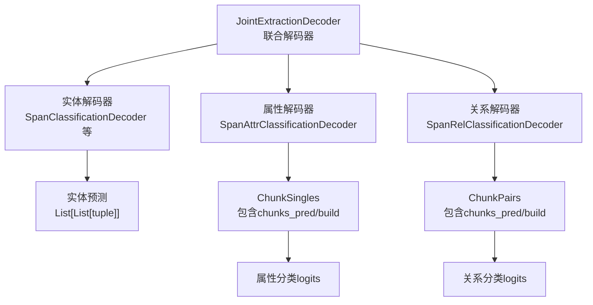
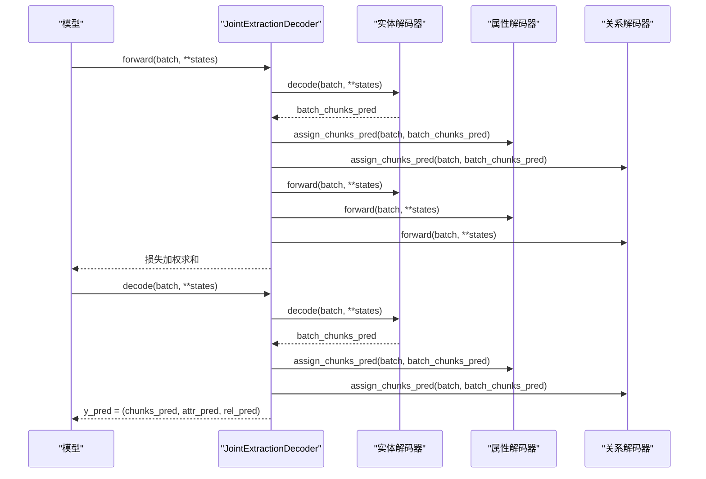
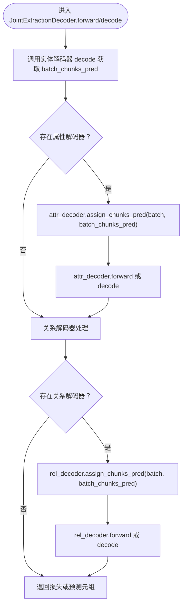
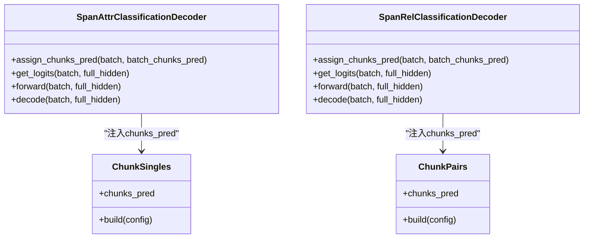
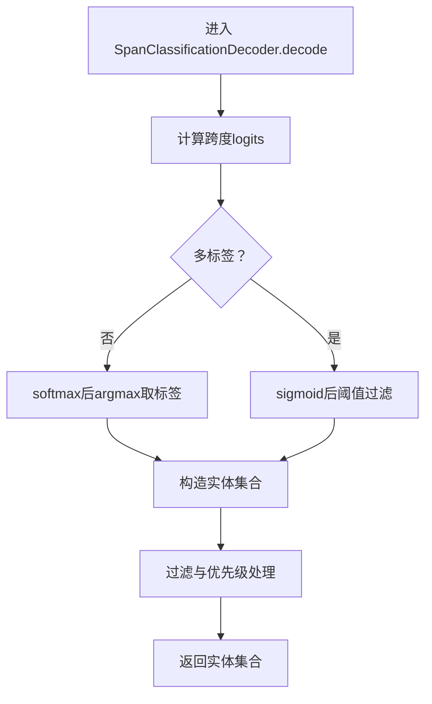
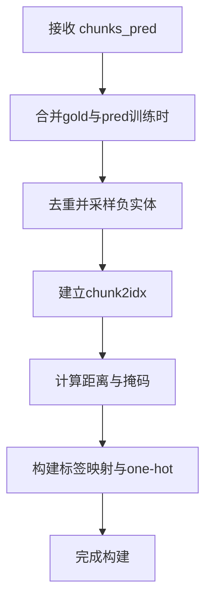
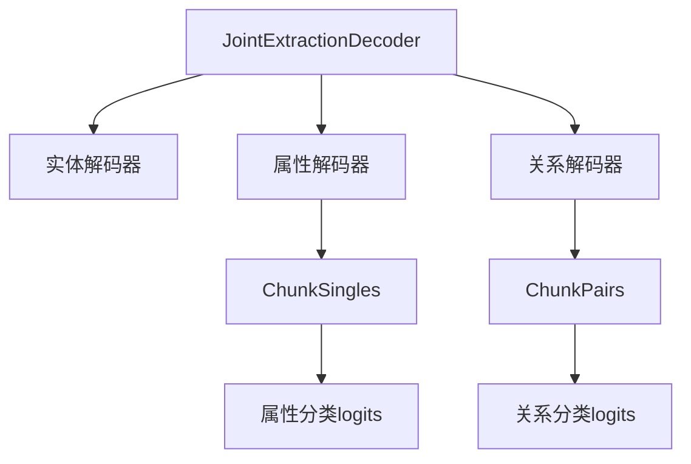

# 实体预测结果级联传递机制

<cite>
**本文引用的文件列表**
- [joint_extraction.py](file://eznlp/model/decoder/joint_extraction.py)
- [span_rel_classification.py](file://eznlp/model/decoder/span_rel_classification.py)
- [span_attr_classification.py](file://eznlp/model/decoder/span_attr_classification.py)
- [chunks.py](file://eznlp/model/decoder/chunks.py)
- [base.py](file://eznlp/model/decoder/base.py)
- [test_joint_extraction.py](file://tests/model/test_joint_extraction.py)
- [test_chunks.py](file://tests/model/test_chunks.py)
- [relation.py](file://eznlp/utils/relation.py)
- [chunk.py](file://eznlp/utils/chunk.py)
</cite>

## 目录
1. [引言](#引言)
2. [项目结构](#项目结构)
3. [核心组件](#核心组件)
4. [架构总览](#架构总览)
5. [详细组件分析](#详细组件分析)
6. [依赖关系分析](#依赖关系分析)
7. [性能考量](#性能考量)
8. [故障排查指南](#故障排查指南)
9. [结论](#结论)
10. [附录：数据结构转换示例](#附录数据结构转换示例)

## 引言
本文件围绕JointExtractionDecoder在联合抽取场景下的“实体识别结果向关系抽取解码器传递”的级联机制展开，重点解释：
- forward与decode方法中batch_chunks_pred的生成路径；
- assign_chunks_pred如何将实体预测注入属性与关系解码器；
- 级联式预测对训练与推理的影响（误差传播风险、计算效率优势）；
- 具体示例展示从序列标注/跨度分类输出到关系分类输入的数据结构转换；
- 共享嵌入层（share_embeddings）对上述流程的潜在优化作用。

## 项目结构
该机制涉及解码器组合、实体解码器、属性解码器、关系解码器以及中间对象（ChunkPairs/ChunkSingles）的协同工作。下图给出与本文相关的模块关系概览。

图表来源
- [joint_extraction.py](file://eznlp/model/decoder/joint_extraction.py#L166-L192)
- [span_rel_classification.py](file://eznlp/model/decoder/span_rel_classification.py#L406-L417)
- [span_attr_classification.py](file://eznlp/model/decoder/span_attr_classification.py#L250-L257)
- [chunks.py](file://eznlp/model/decoder/chunks.py#L31-L83)

章节来源
- [joint_extraction.py](file://eznlp/model/decoder/joint_extraction.py#L166-L192)
- [chunks.py](file://eznlp/model/decoder/chunks.py#L31-L83)

## 核心组件
- 联合解码器（JointExtractionDecoder）：负责按顺序执行实体解码，并将实体预测级联传递给属性与关系解码器；在训练时累加损失，在推理时返回多任务预测元组。
- 实体解码器（如SpanClassificationDecoder等）：产生实体边界（或标签序列），输出为每条样本的实体集合（三元组：标签、起始、结束）。
- 属性解码器（SpanAttrClassificationDecoder）：基于实体集合进行属性标注，其内部通过ChunkSingles对象管理实体集合与标签映射。
- 关系解码器（SpanRelClassificationDecoder）：基于实体集合进行关系分类，其内部通过ChunkPairs对象枚举实体对并构建有效掩码。
- 中间对象（ChunkPairs/ChunkSingles）：封装实体集合、标签映射、距离与有效性掩码等，支持在“流水线”和“联合”两种模式下动态构建。

章节来源
- [joint_extraction.py](file://eznlp/model/decoder/joint_extraction.py#L154-L192)
- [span_rel_classification.py](file://eznlp/model/decoder/span_rel_classification.py#L156-L210)
- [span_attr_classification.py](file://eznlp/model/decoder/span_attr_classification.py#L91-L145)
- [chunks.py](file://eznlp/model/decoder/chunks.py#L16-L83)

## 架构总览
下图展示联合解码器在训练与推理阶段的调用序列，突出batch_chunks_pred的生成与注入过程。

图表来源
- [joint_extraction.py](file://eznlp/model/decoder/joint_extraction.py#L166-L192)
- [span_rel_classification.py](file://eznlp/model/decoder/span_rel_classification.py#L406-L417)
- [span_attr_classification.py](file://eznlp/model/decoder/span_attr_classification.py#L250-L257)
- [base.py](file://eznlp/model/decoder/base.py#L80-L98)

## 详细组件分析

### 组件A：JointExtractionDecoder 的级联流程
- batch_chunks_pred生成位置：
  - 训练阶段：先调用实体解码器的forward获取实体损失，再调用其decode得到实体预测。
  - 推理阶段：直接调用实体解码器的decode得到实体预测。
- 注入策略：
  - 对于属性解码器与关系解码器，分别调用其assign_chunks_pred，将batch_chunks_pred写入对应对象（ChunkSingles/ChunkPairs），随后触发build以构建内部索引、标签映射、掩码等。
- 返回值：
  - 训练：仅损失（可含多任务加权）。
  - 推理：返回三元组（实体预测，属性预测，关系预测）。

图表来源
- [joint_extraction.py](file://eznlp/model/decoder/joint_extraction.py#L166-L192)

章节来源
- [joint_extraction.py](file://eznlp/model/decoder/joint_extraction.py#L166-L192)

### 组件B：assign_chunks_pred 的注入机制
- 属性解码器（SpanAttrClassificationDecoder）：
  - 在assign_chunks_pred中，将batch_chunks_pred写入cs_obj.chunks_pred，并调用cs_obj.build完成内部构建（标签映射、掩码、设备迁移等）。
- 关系解码器（SpanRelClassificationDecoder）：
  - 在assign_chunks_pred中，将batch_chunks_pred写入cp_obj.chunks_pred，并调用cp_obj.build完成内部构建（实体对枚举、有效性掩码、距离编码、软标签等）。

图表来源
- [span_attr_classification.py](file://eznlp/model/decoder/span_attr_classification.py#L250-L257)
- [span_rel_classification.py](file://eznlp/model/decoder/span_rel_classification.py#L406-L417)
- [chunks.py](file://eznlp/model/decoder/chunks.py#L194-L258)

章节来源
- [span_attr_classification.py](file://eznlp/model/decoder/span_attr_classification.py#L250-L257)
- [span_rel_classification.py](file://eznlp/model/decoder/span_rel_classification.py#L406-L417)
- [chunks.py](file://eznlp/model/decoder/chunks.py#L194-L258)

### 组件C：实体解码器（以SpanClassificationDecoder为例）
- 输出格式：每条样本的实体集合，形式为三元组列表（标签、起始、结束）。
- 内部逻辑要点：
  - 通过聚合（池化/注意力）将跨度表示拼接为跨度特征；
  - 可选大小嵌入与标签嵌入用于关系/属性解码器；
  - 多标签阈值过滤生成最终实体集合。

图表来源
- [span_classification.py](file://eznlp/model/decoder/span_classification.py#L297-L344)

章节来源
- [span_classification.py](file://eznlp/model/decoder/span_classification.py#L297-L344)

### 组件D：中间对象（ChunkPairs/ChunkSingles）的构建
- ChunkPairs（关系侧）：
  - 将chunks_pred与gold（训练时）合并，去重后采样负实体，构建实体索引、距离编码、有效性掩码、标签映射等。
  - 支持软标签平滑、逆关系补全、自反关系过滤等。
- ChunkSingles（属性侧）：
  - 将chunks_pred与gold（训练时）合并，去重后采样负实体，构建实体索引、标签映射、掩码等。
  - 支持多标签与单标签两种目标格式。

图表来源
- [chunks.py](file://eznlp/model/decoder/chunks.py#L31-L83)
- [chunks.py](file://eznlp/model/decoder/chunks.py#L194-L258)

章节来源
- [chunks.py](file://eznlp/model/decoder/chunks.py#L31-L83)
- [chunks.py](file://eznlp/model/decoder/chunks.py#L194-L258)

## 依赖关系分析
- JointExtractionDecoder对实体解码器、属性解码器、关系解码器的依赖是组合关系，且通过assign_chunks_pred实现跨解码器的共享状态。
- ChunkPairs/ChunkSingles作为共享载体，承载实体集合、标签映射、掩码等，避免重复计算。
- 关系解码器在assign_chunks_pred中会根据融合模式（拼接/仿射）将对象移动到相应设备，确保后续计算在同一设备上进行。

图表来源
- [joint_extraction.py](file://eznlp/model/decoder/joint_extraction.py#L154-L192)
- [span_rel_classification.py](file://eznlp/model/decoder/span_rel_classification.py#L406-L417)
- [span_attr_classification.py](file://eznlp/model/decoder/span_attr_classification.py#L250-L257)
- [chunks.py](file://eznlp/model/decoder/chunks.py#L16-L83)

章节来源
- [joint_extraction.py](file://eznlp/model/decoder/joint_extraction.py#L154-L192)
- [span_rel_classification.py](file://eznlp/model/decoder/span_rel_classification.py#L406-L417)
- [span_attr_classification.py](file://eznlp/model/decoder/span_attr_classification.py#L250-L257)
- [chunks.py](file://eznlp/model/decoder/chunks.py#L16-L83)

## 性能考量
- 计算效率优势：
  - 通过共享states（例如full_hidden）与复用实体预测，避免重复前向计算，提升训练与推理吞吐。
  - 在JointExtractionDecoder中，forward与decode均复用states，减少重复计算。
- 误差传播风险：
  - 若实体解码器预测不准确，将直接影响ChunkPairs/ChunkSingles的构建，进而影响关系分类的正负样本分布与掩码。
  - 测试用例验证了在不同实体解码器配置下的一致性与可训练性，侧面说明级联机制在训练上的稳定性。
- 设备与内存：
  - assign_chunks_pred会将对象移动到权重所在设备，避免跨设备张量操作带来的额外开销与错误。
- 共享嵌入层（share_embeddings）：
  - 配置项允许在联合解码器中共享嵌入层，理论上可减少参数规模、提升一致性与泛化能力，但需注意PyTorch对模块间权重共享的限制与初始化策略。

章节来源
- [base.py](file://eznlp/model/decoder/base.py#L80-L98)
- [joint_extraction.py](file://eznlp/model/decoder/joint_extraction.py#L105-L110)
- [span_rel_classification.py](file://eznlp/model/decoder/span_rel_classification.py#L406-L417)
- [test_joint_extraction.py](file://tests/model/test_joint_extraction.py#L24-L84)

## 故障排查指南
- 实体预测为空导致关系/属性解码失败：
  - 检查实体解码器是否正确设置多标签阈值与过滤策略。
  - 确认ChunkPairs/ChunkSingles在评估阶段未访问gold实体，仅使用chunks_pred。
- 掩码与标签不一致：
  - 确保assign_chunks_pred在forward/decode之前被调用，且cp_obj/cs_obj已build。
  - 检查max_span_size与max_size_id设置，避免实体被过滤。
- 逆关系与对称关系：
  - 使用关系工具函数检测缺失的对称关系或逆关系，必要时启用补全策略。
- 设备不匹配：
  - 确认assign_chunks_pred后对象已移动至对应权重设备。

章节来源
- [chunks.py](file://eznlp/model/decoder/chunks.py#L31-L83)
- [chunks.py](file://eznlp/model/decoder/chunks.py#L194-L258)
- [relation.py](file://eznlp/utils/relation.py#L1-L31)
- [span_rel_classification.py](file://eznlp/model/decoder/span_rel_classification.py#L406-L417)

## 结论
JointExtractionDecoder通过“实体预测级联注入”的方式，将实体解码器的输出作为属性与关系解码器的输入，实现了端到端联合训练与高效推理。该机制在训练阶段通过共享states降低重复计算，在推理阶段提供多任务统一输出；同时，通过ChunkPairs/ChunkSingles的构建，确保关系与属性解码器在一致的实体集合上进行建模。误差传播风险主要来自实体预测质量，可通过合理设置阈值、掩码与标签平滑策略缓解。共享嵌入层（share_embeddings）可进一步优化参数规模与一致性，但需谨慎处理权重共享与初始化。

## 附录：数据结构转换示例
- 输入：序列标注/跨度分类输出（每条样本的实体集合）
  - 形式：List[List[tuple]]，其中tuple为(标签, 起始, 结束)
- 注入：assign_chunks_pred写入ChunkSingles/ChunkPairs
  - ChunkSingles：将实体集合与gold合并、去重、采样负实体，构建实体索引与标签映射。
  - ChunkPairs：枚举实体对，构建有效性掩码、距离编码、标签映射与软标签。
- 输出：关系分类输入（logits）与属性分类输入（logits）
  - 关系分类：(num_chunks, num_chunks, num_labels) 或带实体标签辅助头
  - 属性分类：(num_chunks, num_labels)

章节来源
- [test_chunks.py](file://tests/model/test_chunks.py#L100-L110)
- [test_chunks.py](file://tests/model/test_chunks.py#L159-L168)
- [chunks.py](file://eznlp/model/decoder/chunks.py#L31-L83)
- [chunks.py](file://eznlp/model/decoder/chunks.py#L194-L258)