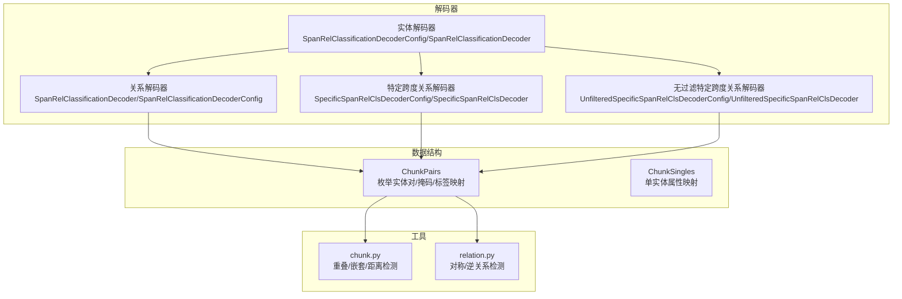
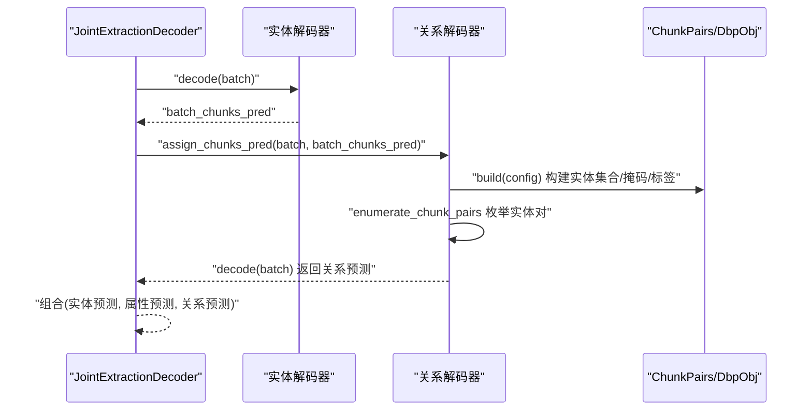
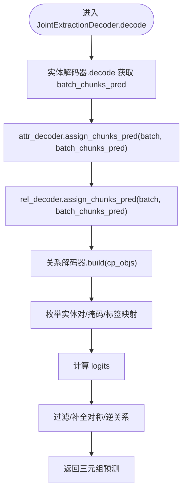
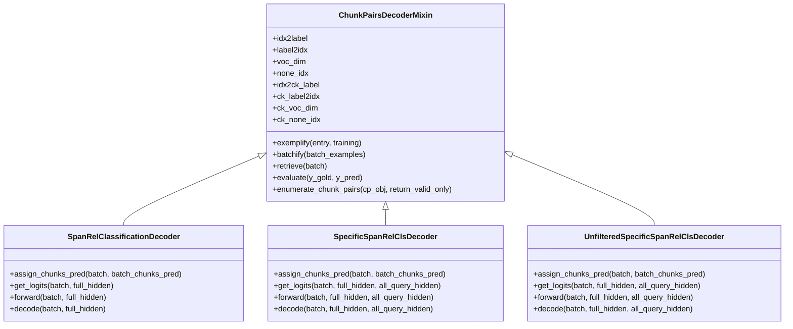
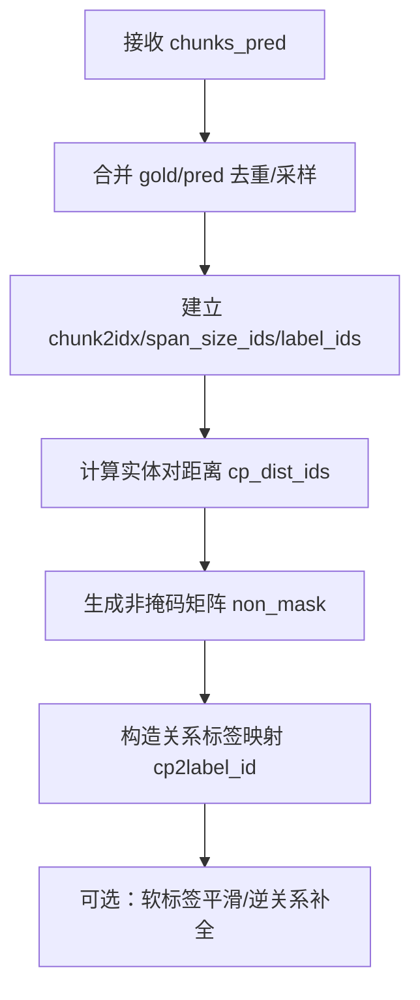
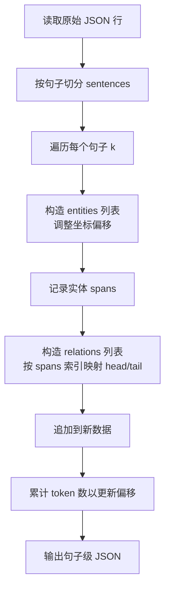
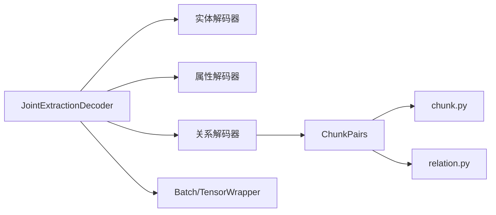
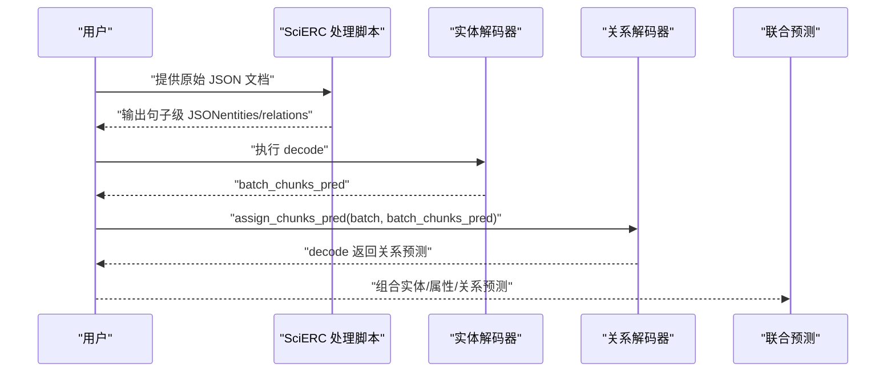

# 数据流与实体传递

<cite>
**本文引用的文件**
- [joint_extraction.py](file://eznlp/model/decoder/joint_extraction.py)
- [span_rel_classification.py](file://eznlp/model/decoder/span_rel_classification.py)
- [specific_span_rel_classification.py](file://eznlp/model/decoder/specific_span_rel_classification.py)
- [specific_span_rel_classification_unfiltered.py](file://eznlp/model/decoder/specific_span_rel_classification_unfiltered.py)
- [chunks.py](file://eznlp/model/decoder/chunks.py)
- [relation.py](file://eznlp/utils/relation.py)
- [chunk.py](file://eznlp/utils/chunk.py)
- [wrapper.py](file://eznlp/wrapper.py)
- [scierc-luan2018emnlp-process.py](file://data/SciERC/scierc-luan2018emnlp-process.py)
</cite>

## 目录
1. [引言](#引言)
2. [项目结构](#项目结构)
3. [核心组件](#核心组件)
4. [架构总览](#架构总览)
5. [详细组件分析](#详细组件分析)
6. [依赖分析](#依赖分析)
7. [性能考量](#性能考量)
8. [故障排查指南](#故障排查指南)
9. [结论](#结论)
10. [附录：从原始文本到联合预测的完整示例](#附录从原始文本到联合预测的完整示例)

## 引言
本文件聚焦于联合抽取中的数据流处理机制，重点解析解码阶段（decode）中实体预测结果（batch_chunks_pred）向关系解码器传递的完整流程；并结合 SciERC 数据集处理脚本，说明实体-关系联合标注格式的构建方式，包括实体 span 的提取、关系三元组的组织以及标签映射机制；阐述 assign_chunks_pred 方法如何将实体识别结果注入关系解码器，并分析这种级联式预测对关系抽取精度的影响；最后给出从原始文本到最终联合预测结果的完整数据转换示例。

## 项目结构
本项目围绕“联合抽取”展开，涉及以下关键模块：
- 解码器层：实体识别、属性标注、关系抽取等解码器配置与实现
- 关系解码器 mixin：统一管理实体预测结果在关系解码器中的注入与使用
- 数据结构：ChunkPairs/ChunkSingles 等对象承载实体与关系的枚举、掩码与标签映射
- 工具函数：实体重叠检测、对称/逆关系检测等辅助逻辑
- 数据预处理：SciERC 脚本负责将多句子文档切分为句子级样本并构造联合标注

图表来源
- [joint_extraction.py](file://eznlp/model/decoder/joint_extraction.py#L166-L192)
- [span_rel_classification.py](file://eznlp/model/decoder/span_rel_classification.py#L406-L585)
- [specific_span_rel_classification.py](file://eznlp/model/decoder/specific_span_rel_classification.py#L320-L549)
- [specific_span_rel_classification_unfiltered.py](file://eznlp/model/decoder/specific_span_rel_classification_unfiltered.py#L256-L379)
- [chunks.py](file://eznlp/model/decoder/chunks.py#L16-L193)
- [chunk.py](file://eznlp/utils/chunk.py#L1-L250)
- [relation.py](file://eznlp/utils/relation.py#L1-L31)

章节来源
- [joint_extraction.py](file://eznlp/model/decoder/joint_extraction.py#L166-L192)
- [chunks.py](file://eznlp/model/decoder/chunks.py#L16-L193)

## 核心组件
- 联合解码器（JointExtractionDecoder）：在 decode 阶段先调用实体解码器得到 batch_chunks_pred，再将其注入关系解码器，最后返回三元组预测（实体、属性、关系）。
- 关系解码器 mixin：定义 assign_chunks_pred 接口，用于在训练/推理时将实体预测结果写入 cp_objs/dbp_objs，以便后续枚举实体对并计算 logits。
- ChunkPairs/ChunkSingles：封装实体集合、实体对枚举、有效掩码、标签映射、距离统计等，支撑关系解码器的输入构建。
- 实体/关系工具：重叠/嵌套检测、对称/逆关系补全与过滤等。

章节来源
- [joint_extraction.py](file://eznlp/model/decoder/joint_extraction.py#L166-L192)
- [span_rel_classification.py](file://eznlp/model/decoder/span_rel_classification.py#L406-L585)
- [specific_span_rel_classification.py](file://eznlp/model/decoder/specific_span_rel_classification.py#L320-L549)
- [specific_span_rel_classification_unfiltered.py](file://eznlp/model/decoder/specific_span_rel_classification_unfiltered.py#L256-L379)
- [chunks.py](file://eznlp/model/decoder/chunks.py#L16-L193)
- [relation.py](file://eznlp/utils/relation.py#L1-L31)

## 架构总览
联合抽取的解码流程如下：
- 实体解码器 decode 得到 batch_chunks_pred
- 将 batch_chunks_pred 注入关系解码器（通过 assign_chunks_pred）
- 关系解码器基于 cp_objs/dbp_objs 枚举实体对，结合上下文/跨度特征生成 logits 并进行过滤
- 返回三元组预测（实体、属性、关系）

图表来源
- [joint_extraction.py](file://eznlp/model/decoder/joint_extraction.py#L166-L192)
- [span_rel_classification.py](file://eznlp/model/decoder/span_rel_classification.py#L406-L585)
- [specific_span_rel_classification.py](file://eznlp/model/decoder/specific_span_rel_classification.py#L320-L549)
- [specific_span_rel_classification_unfiltered.py](file://eznlp/model/decoder/specific_span_rel_classification_unfiltered.py#L256-L379)
- [chunks.py](file://eznlp/model/decoder/chunks.py#L83-L193)

## 详细组件分析

### 组件A：联合解码器（JointExtractionDecoder）
- 在 decode 中，先执行实体解码器的 decode 获取 batch_chunks_pred，随后按顺序将该结果注入属性解码器与关系解码器，并分别执行各自的 decode，最终返回三元组预测。
- forward 中同样会先执行实体损失，再注入属性/关系损失权重后累加。

图表来源
- [joint_extraction.py](file://eznlp/model/decoder/joint_extraction.py#L166-L192)
- [span_rel_classification.py](file://eznlp/model/decoder/span_rel_classification.py#L406-L585)
- [specific_span_rel_classification.py](file://eznlp/model/decoder/specific_span_rel_classification.py#L320-L549)
- [specific_span_rel_classification_unfiltered.py](file://eznlp/model/decoder/specific_span_rel_classification_unfiltered.py#L256-L379)
- [chunks.py](file://eznlp/model/decoder/chunks.py#L83-L193)

章节来源
- [joint_extraction.py](file://eznlp/model/decoder/joint_extraction.py#L166-L192)

### 组件B：关系解码器 mixin 与 assign_chunks_pred
- ChunkPairsDecoderMixin/UnfilteredSpecificSpanRelClsDecoderConfig 定义了 assign_chunks_pred 接口，用于在训练/推理时将外部传入的实体预测写入 cp_objs/dbp_objs，并触发 build(config) 完成实体集合、掩码、标签映射等的构建。
- 具体实现由 SpanRelClassificationDecoder 和 SpecificSpanRelClsDecoder/UnfilteredSpecificSpanRelClsDecoder 提供。

图表来源
- [span_rel_classification.py](file://eznlp/model/decoder/span_rel_classification.py#L34-L154)
- [span_rel_classification.py](file://eznlp/model/decoder/span_rel_classification.py#L406-L585)
- [specific_span_rel_classification.py](file://eznlp/model/decoder/specific_span_rel_classification.py#L33-L110)
- [specific_span_rel_classification.py](file://eznlp/model/decoder/specific_span_rel_classification.py#L320-L549)
- [specific_span_rel_classification_unfiltered.py](file://eznlp/model/decoder/specific_span_rel_classification_unfiltered.py#L256-L379)

章节来源
- [span_rel_classification.py](file://eznlp/model/decoder/span_rel_classification.py#L406-L585)
- [specific_span_rel_classification.py](file://eznlp/model/decoder/specific_span_rel_classification.py#L320-L549)
- [specific_span_rel_classification_unfiltered.py](file://eznlp/model/decoder/specific_span_rel_classification_unfiltered.py#L256-L379)

### 组件C：ChunkPairs 数据结构与标签映射
- ChunkPairs 负责：
  - 将外部传入的 chunks_pred 与内部 gold/pred 合并，去重并按需采样负样本
  - 建立实体索引、跨度大小 id、实体标签 id（含 gold 与 pred 两套）、实体对距离 id
  - 构造非掩码矩阵 non_mask（根据跨句/距离/自环/标签合法性筛选）
  - 构造关系标签映射 cp2label_id（支持软标签平滑与逆关系）
- 这些信息为关系解码器的枚举与损失计算提供基础。

图表来源
- [chunks.py](file://eznlp/model/decoder/chunks.py#L83-L193)
- [relation.py](file://eznlp/utils/relation.py#L1-L31)
- [chunk.py](file://eznlp/utils/chunk.py#L1-L250)

章节来源
- [chunks.py](file://eznlp/model/decoder/chunks.py#L83-L193)
- [relation.py](file://eznlp/utils/relation.py#L1-L31)
- [chunk.py](file://eznlp/utils/chunk.py#L1-L250)

### 组件D：SciERC 数据集处理脚本（联合标注格式）
- 将多句子文档拆分为句子级样本，为每个句子构造 entities 与 relations 字段：
  - entities：列表，每项包含 (start, end, type)，其中 start/end 为 token 级坐标
  - relations：列表，每项包含 (type, head_index, tail_index)，head/tail 为对应实体在当前句子中的索引
- 通过索引映射确保 head/tail 指向当前句子内的实体 span

图表来源
- [scierc-luan2018emnlp-process.py](file://data/SciERC/scierc-luan2018emnlp-process.py#L1-L42)

章节来源
- [scierc-luan2018emnlp-process.py](file://data/SciERC/scierc-luan2018emnlp-process.py#L1-L42)

## 依赖分析
- JointExtractionDecoder 对实体解码器、属性解码器、关系解码器的耦合度较低，通过统一的 assign_chunks_pred 接口实现级联式注入，便于替换不同实体/关系解码器组合。
- 关系解码器依赖 ChunkPairs/UnfilteredDbpObj 的构建结果，进一步依赖 utils 中的 chunk/relation 工具完成有效性筛选与标签映射。
- Batch 包装器提供张量设备迁移与内存管理能力，确保解码器在 GPU/CPU 上的一致性。

图表来源
- [joint_extraction.py](file://eznlp/model/decoder/joint_extraction.py#L166-L192)
- [chunks.py](file://eznlp/model/decoder/chunks.py#L16-L193)
- [chunk.py](file://eznlp/utils/chunk.py#L1-L250)
- [relation.py](file://eznlp/utils/relation.py#L1-L31)
- [wrapper.py](file://eznlp/wrapper.py#L1-L122)

章节来源
- [joint_extraction.py](file://eznlp/model/decoder/joint_extraction.py#L166-L192)
- [chunks.py](file://eznlp/model/decoder/chunks.py#L16-L193)
- [wrapper.py](file://eznlp/wrapper.py#L1-L122)

## 性能考量
- 训练阶段的负采样策略（neg_sampling_rate）可显著降低实体对枚举规模，提高训练效率；但需注意对关系召回率的影响。
- 关系解码器在枚举实体对时会构建非掩码矩阵与标签映射，建议合理设置 max_span_size/max_dist_id，避免 OOM 或冗余计算。
- 使用上下文聚合（如 pooling/attention）或仿射融合（TriAffine/BiAffine）会增加计算开销，可根据硬件资源选择合适模式。

## 故障排查指南
- 逆关系与对称关系缺失：若使用 use_inv_rel 或 comp_sym_rel，需确认标签集合与 existing_rht_labels 是否正确构建，避免漏检或误判。
- 实体跨度过大导致过滤：max_span_size/max_size_id 设置过小可能剔除真实实体，建议通过数据统计量化阈值。
- 设备/张量不一致：确保 assign_chunks_pred 后 cp_objs/dbp_objs 正确迁移到与权重相同的设备上，避免 forward 报错。
- 评估阶段 gold 不可见：在 eval 模式下，gold chunks 不参与枚举，仅使用 chunks_pred，需保证外部实体解码器输出稳定。

章节来源
- [span_rel_classification.py](file://eznlp/model/decoder/span_rel_classification.py#L406-L585)
- [specific_span_rel_classification.py](file://eznlp/model/decoder/specific_span_rel_classification.py#L320-L549)
- [specific_span_rel_classification_unfiltered.py](file://eznlp/model/decoder/specific_span_rel_classification_unfiltered.py#L256-L379)
- [chunks.py](file://eznlp/model/decoder/chunks.py#L83-L193)

## 结论
联合抽取通过 JointExtractionDecoder 在解码阶段串联实体与关系解码器，利用 assign_chunks_pred 将实体预测结果注入关系解码器，形成“实体识别→关系解码”的级联式流水线。SciERC 处理脚本提供了标准的联合标注格式，涵盖实体 span 与关系三元组的组织。借助 ChunkPairs/ChunkSingles 的标签映射与有效性筛选，关系解码器能够高效地枚举实体对并进行分类。合理配置 max_span_size、上下文聚合与融合方式，可在精度与效率之间取得平衡。

## 附录：从原始文本到联合预测的完整示例
- 输入：原始文档（多句子），每句包含 tokens、ner、relations 等字段
- 步骤：
  1) 使用 SciERC 处理脚本将文档拆分为句子级样本，构造 entities 与 relations
  2) 构建实体解码器并执行 decode，得到 batch_chunks_pred
  3) 将 batch_chunks_pred 注入关系解码器（assign_chunks_pred），构建 cp_objs/dbp_objs
  4) 关系解码器枚举实体对、计算 logits、过滤无效对并输出关系预测
  5) 组合实体、属性、关系三类预测作为最终输出

图表来源
- [scierc-luan2018emnlp-process.py](file://data/SciERC/scierc-luan2018emnlp-process.py#L1-L42)
- [joint_extraction.py](file://eznlp/model/decoder/joint_extraction.py#L166-L192)
- [span_rel_classification.py](file://eznlp/model/decoder/span_rel_classification.py#L406-L585)
- [specific_span_rel_classification.py](file://eznlp/model/decoder/specific_span_rel_classification.py#L320-L549)
- [specific_span_rel_classification_unfiltered.py](file://eznlp/model/decoder/specific_span_rel_classification_unfiltered.py#L256-L379)