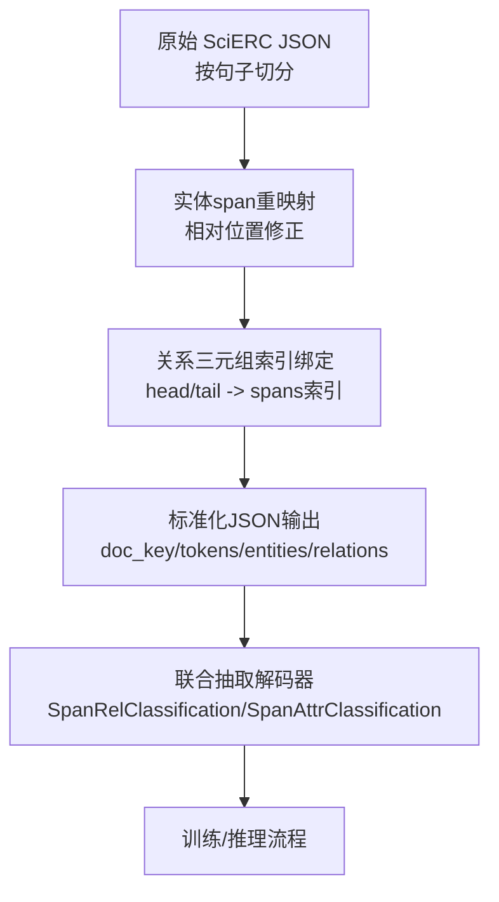
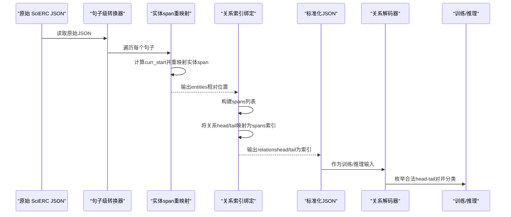
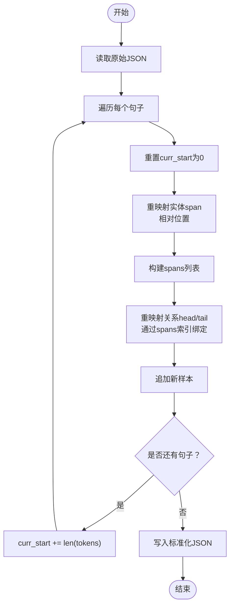
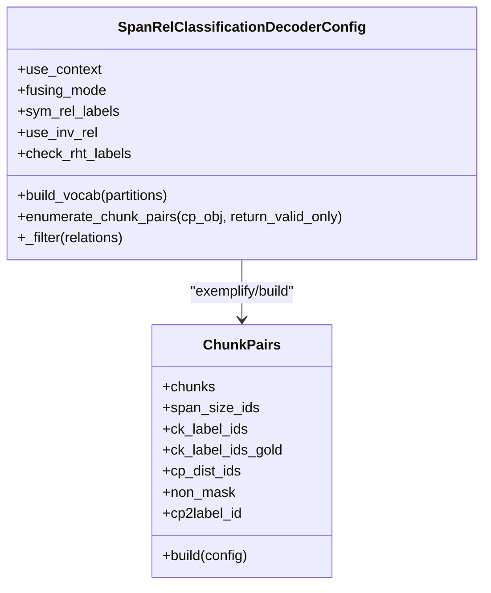
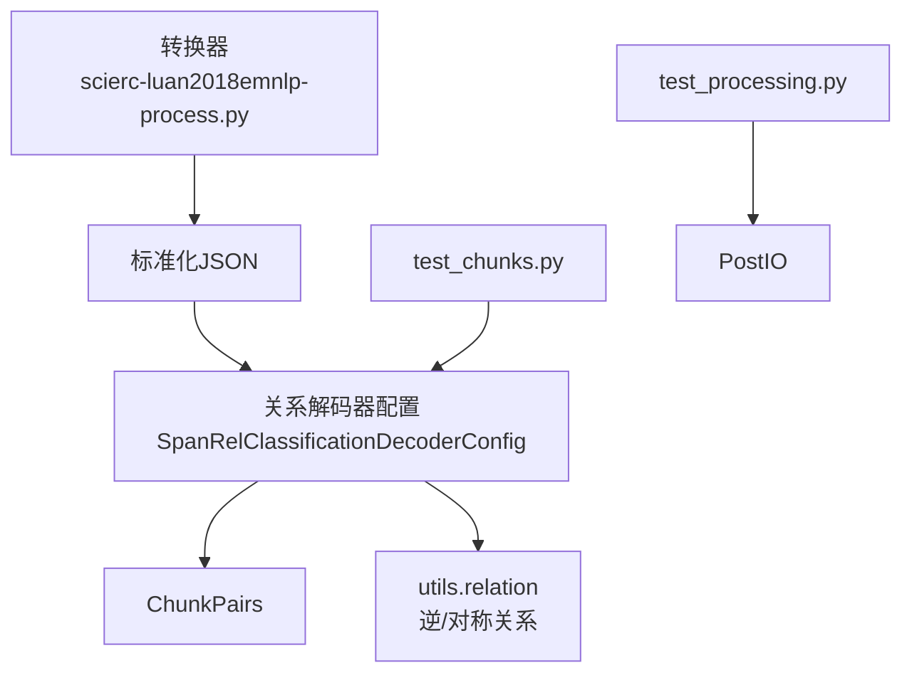

# 联合抽取标注格式转换

<cite>
**本文引用的文件列表**
- [scierc-luan2018emnlp-process.py](file://data/SciERC/scierc-luan2018emnlp-process.py)
- [relation.py](file://eznlp/utils/relation.py)
- [joint_extraction.py](file://eznlp/model/decoder/joint_extraction.py)
- [span_rel_classification.py](file://eznlp/model/decoder/span_rel_classification.py)
- [specific_span_rel_classification.py](file://eznlp/model/decoder/specific_span_rel_classification.py)
- [processing.py](file://eznlp/io/processing.py)
- [test_chunks.py](file://tests/model/test_chunks.py)
- [test_processing.py](file://tests/io/test_processing.py)
</cite>

## 目录
1. [简介](#简介)
2. [项目结构](#项目结构)
3. [核心组件](#核心组件)
4. [架构总览](#架构总览)
5. [详细组件分析](#详细组件分析)
6. [依赖分析](#依赖分析)
7. [性能考量](#性能考量)
8. [故障排查指南](#故障排查指南)
9. [结论](#结论)
10. [附录](#附录)

## 简介
本文件系统化梳理 SciERC 数据集的联合抽取标注格式转换流程，重点解释：
- 原始 JSON 按句子切分，生成句子级样本；
- 实体 span 的起止位置重映射机制；
- 关系三元组中 head 和 tail 通过 spans 索引进行绑定；
- 从原始文档到标准化 JSON 格式（包含 doc_key、tokens、entities、relations）的完整转换过程；
- 该格式如何支撑联合抽取模型训练；
- 在跨句子关系处理上的局限性。

## 项目结构
围绕 SciERC 的标注转换与联合抽取训练，涉及以下关键模块：
- 数据预处理：将原始 JSON 按句子切分为句子级样本，并重映射实体与关系的 span；
- 关系抽取解码器：提供基于 span 对的关系分类与过滤能力；
- 后处理工具：提供属性吸收、关系推断等辅助功能；
- 测试用例：验证转换与解码器行为的一致性。

图表来源
- [scierc-luan2018emnlp-process.py](file://data/SciERC/scierc-luan2018emnlp-process.py#L1-L41)
- [span_rel_classification.py](file://eznlp/model/decoder/span_rel_classification.py#L156-L317)
- [joint_extraction.py](file://eznlp/model/decoder/joint_extraction.py#L68-L153)

章节来源
- [scierc-luan2018emnlp-process.py](file://data/SciERC/scierc-luan2018emnlp-process.py#L1-L41)

## 核心组件
- SciERC 句子级转换器：负责读取原始 JSON、逐句切分、重映射实体与关系 span，并输出标准化 JSON。
- 关系抽取解码器：将标准化 JSON 中的实体与关系映射为内部的 ChunkPairs 结构，枚举合法的 head-tail 组合并进行分类。
- 后处理工具：提供属性吸收、关系推断等能力，便于下游任务扩展。
- 测试用例：覆盖转换一致性、关系枚举与过滤、逆关系补全等关键行为。

章节来源
- [scierc-luan2018emnlp-process.py](file://data/SciERC/scierc-luan2018emnlp-process.py#L1-L41)
- [span_rel_classification.py](file://eznlp/model/decoder/span_rel_classification.py#L156-L317)
- [processing.py](file://eznlp/io/processing.py#L42-L248)
- [test_chunks.py](file://tests/model/test_chunks.py#L13-L108)
- [test_processing.py](file://tests/io/test_processing.py#L1-L88)

## 架构总览
下图展示了从原始 SciERC 文档到联合抽取训练输入的整体流程，以及关系抽取解码器如何消费这些样本。

图表来源
- [scierc-luan2018emnlp-process.py](file://data/SciERC/scierc-luan2018emnlp-process.py#L12-L39)
- [span_rel_classification.py](file://eznlp/model/decoder/span_rel_classification.py#L127-L152)

## 详细组件分析

### 组件A：SciERC 句子级转换器
- 输入：原始 JSON（每行一条样本），包含 doc_key、sentences、ner、relations 等字段；
- 处理：
  - 逐句遍历，生成新样本；
  - 实体 span 重映射：以当前句子起始偏移为基准，计算相对位置；
  - 关系三元组重映射：将 head/tail 的绝对坐标转换为当前句子内的相对坐标，再通过已构建的 spans 列表获取索引；
  - 累加 curr_start，确保下一句的相对位置正确；
- 输出：标准化 JSON（每个样本包含 doc_key、tokens、entities、relations）。

图表来源
- [scierc-luan2018emnlp-process.py](file://data/SciERC/scierc-luan2018emnlp-process.py#L8-L41)

章节来源
- [scierc-luan2018emnlp-process.py](file://data/SciERC/scierc-luan2018emnlp-process.py#L8-L41)

### 组件B：实体span重映射机制
- 重映射目标：将实体绝对坐标转换为当前句子内的相对坐标；
- 关键点：
  - 使用 curr_start 表示前一句子的累计长度；
  - 实体起止位置分别减去 curr_start，保证在同一句子内；
  - end 值加 1 以满足半开区间表示法；
- 作用：确保 entities 字段中的 span 与 tokens 的索引一致。

章节来源
- [scierc-luan2018emnlp-process.py](file://data/SciERC/scierc-luan2018emnlp-process.py#L18-L26)

### 组件C：关系三元组索引绑定
- 生成 spans：基于当前句子的 entities 构建 (start, end) 元组列表；
- 绑定 head/tail：将关系的绝对坐标转换为相对坐标后，在 spans 中查找对应索引；
- 生成 relations：以 head/tail 索引替代绝对坐标，保留关系类型；
- 影响：关系抽取解码器可直接使用索引定位实体，避免跨句子关系。

章节来源
- [scierc-luan2018emnlp-process.py](file://data/SciERC/scierc-luan2018emnlp-process.py#L28-L36)

### 组件D：关系抽取解码器（SpanRelClassification）
- 输入：标准化 JSON（tokens、entities、relations）；
- 关键流程：
  - 构建 ChunkPairs：将 entities 映射为内部 chunk 表示；
  - 枚举合法 head-tail 对：考虑同句约束、距离阈值、自环过滤、标签检查等；
  - 构造 cp2label_id：将 gold 关系映射到矩阵中；
  - 过滤策略：支持逆关系补全、对称关系补齐、标签合法性检查；
- 输出：关系预测与评估指标。

图表来源
- [span_rel_classification.py](file://eznlp/model/decoder/span_rel_classification.py#L156-L317)
- [span_rel_classification.py](file://eznlp/model/decoder/span_rel_classification.py#L33-L152)

章节来源
- [span_rel_classification.py](file://eznlp/model/decoder/span_rel_classification.py#L156-L317)
- [span_rel_classification.py](file://eznlp/model/decoder/span_rel_classification.py#L33-L152)
- [test_chunks.py](file://tests/model/test_chunks.py#L13-L108)

### 组件E：联合抽取解码器配置
- 支持组合实体识别、属性抽取与关系抽取；
- 提供统一的批处理与检索接口；
- 与关系解码器协同工作，实现端到端联合训练。

章节来源
- [joint_extraction.py](file://eznlp/model/decoder/joint_extraction.py#L68-L153)

### 组件F：后处理工具（属性吸收与关系推断）
- 属性吸收：将属性合并到实体上，减少冗余；
- 关系推断：根据组关系类型，自动扩展跨实体的关系组合；
- 保持 tokens、chunks、relations 的一致性。

章节来源
- [processing.py](file://eznlp/io/processing.py#L42-L248)
- [test_processing.py](file://tests/io/test_processing.py#L1-L88)

## 依赖分析
- 转换器依赖关系：
  - scierc-luan2018emnlp-process.py 依赖标准库 json；
  - 输出的标准化 JSON 由关系解码器消费；
- 解码器依赖关系：
  - SpanRelClassificationDecoderConfig 依赖 utils.relation 中的逆关系前缀与对称关系检测；
  - 解码器内部使用 ChunkPairs 枚举合法 head-tail 对；
- 测试依赖：
  - test_chunks.py 验证关系枚举、过滤与索引一致性；
  - test_processing.py 验证属性吸收与关系推断的正确性。

图表来源
- [scierc-luan2018emnlp-process.py](file://data/SciERC/scierc-luan2018emnlp-process.py#L1-L41)
- [span_rel_classification.py](file://eznlp/model/decoder/span_rel_classification.py#L156-L317)
- [relation.py](file://eznlp/utils/relation.py#L1-L31)
- [test_chunks.py](file://tests/model/test_chunks.py#L13-L108)
- [test_processing.py](file://tests/io/test_processing.py#L1-L88)

章节来源
- [relation.py](file://eznlp/utils/relation.py#L1-L31)
- [span_rel_classification.py](file://eznlp/model/decoder/span_rel_classification.py#L156-L317)
- [test_chunks.py](file://tests/model/test_chunks.py#L13-L108)
- [test_processing.py](file://tests/io/test_processing.py#L1-L88)

## 性能考量
- 句子级切分降低长文档上下文负担，提升训练稳定性；
- 关系枚举受最大距离与标签检查限制，可通过配置调优；
- 对称关系补齐与逆关系补全会增加枚举数量，需权衡召回与效率；
- OOV 长 span 的过滤有助于控制模型复杂度。

## 故障排查指南
- 实体/关系索引不匹配
  - 现象：head/tail 索引越界或找不到对应实体；
  - 排查：确认实体重映射时的 curr_start 是否累加正确；spans 构建顺序与索引一致；
  - 参考路径：[scierc-luan2018emnlp-process.py](file://data/SciERC/scierc-luan2018emnlp-process.py#L18-L36)
- 跨句子关系缺失
  - 现象：关系跨越句子边界时无法被建模；
  - 原因：转换器按句子切分，关系仅在当前句子内绑定；
  - 参考路径：[scierc-luan2018emnlp-process.py](file://data/SciERC/scierc-luan2018emnlp-process.py#L12-L39)
- 逆/对称关系未补齐
  - 现象：评估指标缺少逆向或对称关系；
  - 处理：启用 use_inv_rel 或 comp_sym_rel 并设置 sym_rel_labels；
  - 参考路径：[span_rel_classification.py](file://eznlp/model/decoder/span_rel_classification.py#L156-L317)
- 属性吸收/关系推断导致数据膨胀
  - 现象：relations 数量显著增加；
  - 处理：合理设置 group_rel_types 与 max_span_size；
  - 参考路径：[processing.py](file://eznlp/io/processing.py#L42-L248)

章节来源
- [scierc-luan2018emnlp-process.py](file://data/SciERC/scierc-luan2018emnlp-process.py#L12-L39)
- [span_rel_classification.py](file://eznlp/model/decoder/span_rel_classification.py#L156-L317)
- [processing.py](file://eznlp/io/processing.py#L42-L248)

## 结论
SciERC 的联合抽取标注格式转换通过“句子级切分 + 相对位置重映射 + spans 索引绑定”实现了清晰、稳定的样本结构。该结构与关系解码器的枚举与过滤机制高度契合，能够有效支撑联合抽取模型的训练与推理。然而，由于转换器按句子切分，跨句子关系无法直接建模，需要在数据层面或模型层面引入额外机制（如窗口化、跨句编码）以弥补这一局限。

## 附录
- 标准化 JSON 字段说明
  - doc_key：文档标识符；
  - tokens：当前句子的词序列；
  - entities：实体集合，包含 type、start、end；
  - relations：关系集合，包含 type、head、tail（head/tail 为 entities 的索引）。