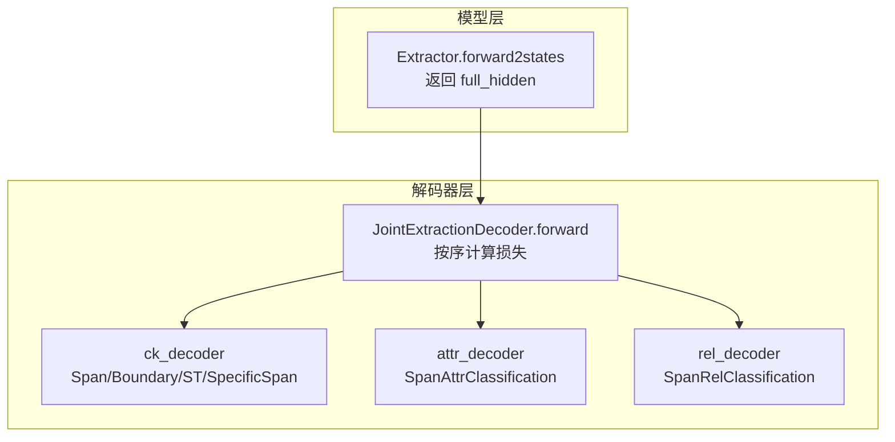
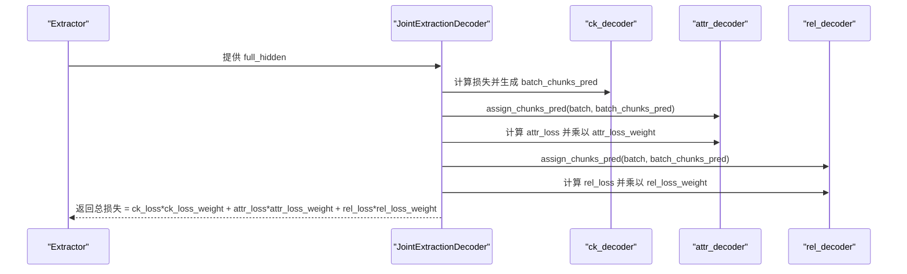
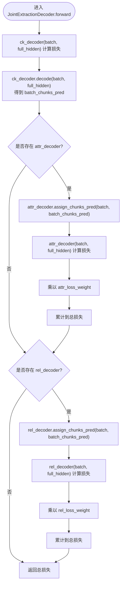
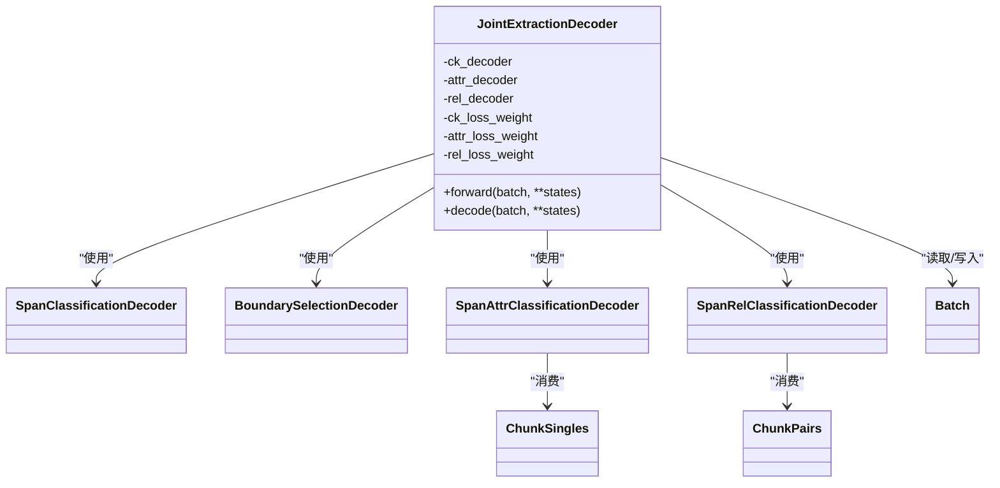

# 联合抽取前向传播流程

<cite>
**本文引用的文件列表**
- [joint_extraction.py](file://eznlp/model/decoder/joint_extraction.py)
- [base.py](file://eznlp/model/decoder/base.py)
- [span_classification.py](file://eznlp/model/decoder/span_classification.py)
- [span_attr_classification.py](file://eznlp/model/decoder/span_attr_classification.py)
- [span_rel_classification.py](file://eznlp/model/decoder/span_rel_classification.py)
- [boundary_selection.py](file://eznlp/model/decoder/boundary_selection.py)
- [chunks.py](file://eznlp/model/decoder/chunks.py)
- [wrapper.py](file://eznlp/wrapper.py)
- [extractor.py](file://eznlp/model/model/extractor.py)
- [test_joint_extraction.py](file://tests/model/test_joint_extraction.py)
</cite>

## 目录
1. [引言](#引言)
2. [项目结构与入口](#项目结构与入口)
3. [核心组件总览](#核心组件总览)
4. [架构概览](#架构概览)
5. [详细组件分析](#详细组件分析)
6. [依赖关系分析](#依赖关系分析)
7. [性能与权重影响](#性能与权重影响)
8. [故障排查指南](#故障排查指南)
9. [结论](#结论)

## 引言
本文件围绕 JointExtractionDecoder 的 forward 方法执行流程进行深入解析，重点说明：
- ck_decoder 作为核心解码器如何先计算损失并生成预测片段；
- attr_decoder 和 rel_decoder 如何通过 assign_chunks_pred 接收 ck_decoder 的预测结果作为输入条件，实现级联式预测传递；
- ck_loss_weight、attr_loss_weight、rel_loss_weight 在多任务损失加权求和中的具体应用；
- batch_chunks_pred 在不同解码器间的传递方式及其对模型性能的影响；
- 这种级联架构如何保证任务间的依赖关系（实体边界先于属性与关系）。

## 项目结构与入口
- JointExtractionDecoder 是联合抽取的解码器组合体，内部包含 ck_decoder（核心边界/实体解码器）、可选的 attr_decoder（属性分类）和 rel_decoder（关系分类）。
- Extractor 将嵌入与编码后的隐藏状态传给解码器，解码器在 forward 中按顺序执行多任务损失计算，并在 decode 中返回多任务预测元组。

图表来源
- [extractor.py](file://eznlp/model/model/extractor.py#L272-L274)
- [joint_extraction.py](file://eznlp/model/decoder/joint_extraction.py#L154-L193)

章节来源
- [extractor.py](file://eznlp/model/model/extractor.py#L272-L274)
- [joint_extraction.py](file://eznlp/model/decoder/joint_extraction.py#L154-L193)

## 核心组件总览
- JointExtractionDecoder：负责多解码器的串联执行，按顺序计算损失并返回；在 decode 阶段同样按顺序产出多任务预测。
- ck_decoder：核心边界/实体解码器，提供候选片段集合 batch_chunks_pred，供后续属性与关系解码器消费。
- attr_decoder：基于 chunk 单体（ChunkSingles）进行属性分类，通过 assign_chunks_pred 注入 ck_decoder 的预测片段。
- rel_decoder：基于 chunk 对（ChunkPairs）进行关系分类，通过 assign_chunks_pred 注入 ck_decoder 的预测片段。
- Wrapper.Batch：承载 batch 级别的张量与对象，如 boundaries_objs、cs_objs、cp_objs 等，是跨解码器传递信息的关键载体。

章节来源
- [joint_extraction.py](file://eznlp/model/decoder/joint_extraction.py#L154-L193)
- [base.py](file://eznlp/model/decoder/base.py#L90-L114)
- [wrapper.py](file://eznlp/wrapper.py#L97-L122)

## 架构概览
JointExtractionDecoder 的执行遵循“先边界/实体，后属性与关系”的依赖链路，确保：
- 属性与关系解码器仅在已知实体片段的前提下进行建模；
- 通过 assign_chunks_pred 将 ck_decoder 的预测片段注入到 attr_decoder 与 rel_decoder 的内部对象（cs_objs、cp_objs），从而共享同一份片段集合；
- 每个解码器独立计算自身损失，并由权重系数加权求和，形成最终的多任务损失。

图表来源
- [joint_extraction.py](file://eznlp/model/decoder/joint_extraction.py#L166-L178)
- [span_attr_classification.py](file://eznlp/model/decoder/span_attr_classification.py#L250-L310)
- [span_rel_classification.py](file://eznlp/model/decoder/span_rel_classification.py#L406-L450)

## 详细组件分析

### JointExtractionDecoder.forward 执行流程
- 步骤一：调用 ck_decoder 计算损失，并将 ck_decoder 的 decode 结果保存为 batch_chunks_pred。
- 步骤二：若存在 attr_decoder，则调用其 assign_chunks_pred 将 batch_chunks_pred 注入到 cs_objs；随后计算 attr_loss 并乘以 attr_loss_weight 加入总损失。
- 步骤三：若存在 rel_decoder，则调用其 assign_chunks_pred 将 batch_chunks_pred 注入到 cp_objs；随后计算 rel_loss 并乘以 rel_loss_weight 加入总损失。
- 步骤四：返回加权后的总损失。

图表来源
- [joint_extraction.py](file://eznlp/model/decoder/joint_extraction.py#L166-L178)

章节来源
- [joint_extraction.py](file://eznlp/model/decoder/joint_extraction.py#L166-L178)

### ck_decoder 作为核心解码器
- 支持多种边界/实体识别策略（如 SpanClassification、BoundarySelection、SequenceTagging、SpecificSpan 等），统一输出 batch_chunks_pred。
- 在训练阶段，ck_decoder 使用其内部的边界/标签对象（如 boundaries_objs、cs_objs、cp_objs）构造正负样本掩码与目标标签，计算交叉熵或平滑损失等。
- 在推理阶段，ck_decoder 输出实体片段列表，供后续 attr_decoder 与 rel_decoder 使用。

章节来源
- [span_classification.py](file://eznlp/model/decoder/span_classification.py#L264-L344)
- [boundary_selection.py](file://eznlp/model/decoder/boundary_selection.py#L307-L384)

### attr_decoder 的级联式输入传递
- attr_decoder 通过 assign_chunks_pred 将 ck_decoder 的预测片段写入 cs_objs，cs_objs 内部会合并“真实片段”与“预测片段”，并构建索引、尺寸/标签嵌入、采样掩码等。
- attr_decoder 的 get_logits 会从 full_hidden 中提取每个 chunk 的上下文表示，经聚合与降维后得到 logits，再计算属性分类损失。
- 若配置了 ck_loss_weight > 0，attr_decoder 还会额外计算一个“一致性监督”损失，鼓励其对 chunk 标签的预测与 ck_decoder 的预测保持一致。

章节来源
- [span_attr_classification.py](file://eznlp/model/decoder/span_attr_classification.py#L250-L386)
- [chunks.py](file://eznlp/model/decoder/chunks.py#L194-L342)

### rel_decoder 的级联式输入传递
- rel_decoder 通过 assign_chunks_pred 将 ck_decoder 的预测片段写入 cp_objs，cp_objs 内部枚举所有 chunk 对，构建距离/尺寸/标签嵌入、有效掩码、关系标签等。
- rel_decoder 的 get_logits 会基于头尾 chunk 的上下文表示，采用拼接或仿射融合策略生成关系得分矩阵，再计算关系分类损失。
- 若配置了 ck_loss_weight > 0，rel_decoder 同样会额外计算 chunk 标签一致性监督损失。

章节来源
- [span_rel_classification.py](file://eznlp/model/decoder/span_rel_classification.py#L406-L585)
- [chunks.py](file://eznlp/model/decoder/chunks.py#L16-L150)

### 多任务损失加权求和
- 总损失 = ck_loss * ck_loss_weight + attr_loss * attr_loss_weight + rel_loss * rel_loss_weight
- 权重参数在 JointExtractionDecoderConfig 中设置，默认均为 1.0，可通过实例化时传参调整。
- 这种加权机制允许在多任务学习中平衡不同子任务的贡献度，避免某一个任务主导梯度更新。

章节来源
- [joint_extraction.py](file://eznlp/model/decoder/joint_extraction.py#L101-L103)
- [joint_extraction.py](file://eznlp/model/decoder/joint_extraction.py#L166-L178)

### batch_chunks_pred 的传递与影响
- 传递路径：ck_decoder.decode -> assign_chunks_pred -> attr_decoder / rel_decoder 的 cs_objs / cp_objs。
- 影响：
  - 一致性：attr/rel 解码器共享同一份片段集合，避免“先验漂移”导致的不一致。
  - 效率：避免重复计算实体边界，减少冗余前向开销。
  - 性能：当 ck_decoder 的预测质量高时，attr/rel 解码器可更聚焦于细粒度任务；反之则可能引入噪声。

章节来源
- [joint_extraction.py](file://eznlp/model/decoder/joint_extraction.py#L166-L193)
- [chunks.py](file://eznlp/model/decoder/chunks.py#L31-L110)

## 依赖关系分析

图表来源
- [joint_extraction.py](file://eznlp/model/decoder/joint_extraction.py#L154-L193)
- [span_classification.py](file://eznlp/model/decoder/span_classification.py#L163-L344)
- [boundary_selection.py](file://eznlp/model/decoder/boundary_selection.py#L201-L384)
- [span_attr_classification.py](file://eznlp/model/decoder/span_attr_classification.py#L195-L386)
- [span_rel_classification.py](file://eznlp/model/decoder/span_rel_classification.py#L319-L585)
- [chunks.py](file://eznlp/model/decoder/chunks.py#L16-L150)

章节来源
- [joint_extraction.py](file://eznlp/model/decoder/joint_extraction.py#L154-L193)
- [chunks.py](file://eznlp/model/decoder/chunks.py#L16-L150)

## 性能与权重影响
- ck_loss_weight 的作用：
  - 当 attr/rel 解码器开启 ck_loss_weight > 0 时，会在各自损失上叠加一次“chunk 标签一致性监督”，促使 attr/rel 学习到与 ck_decoder 一致的片段标签分布，提升整体一致性。
- attr_loss_weight 与 rel_loss_weight：
  - 控制属性与关系任务对总损失的贡献比例。增大任一权重可引导模型在该任务上投入更多注意力，但需注意与其他任务的平衡。
- batch_chunks_pred 的质量直接影响 attr/rel 的建模空间与计算效率。建议在 ck_decoder 上采用合适的阈值、过滤与优先级策略，以获得稳定而高质量的片段集。

章节来源
- [span_attr_classification.py](file://eznlp/model/decoder/span_attr_classification.py#L241-L308)
- [span_rel_classification.py](file://eznlp/model/decoder/span_rel_classification.py#L397-L403)
- [joint_extraction.py](file://eznlp/model/decoder/joint_extraction.py#L101-L103)

## 故障排查指南
- 症状：训练不稳定或某一任务显著压倒其他任务
  - 排查：检查 ck_loss_weight、attr_loss_weight、rel_loss_weight 是否合理设置；必要时降低过强任务的权重。
- 症状：属性/关系解码器报错或无法收敛
  - 排查：确认 ck_decoder 的预测片段是否成功注入到 cs_objs/cp_objs；检查 assign_chunks_pred 的调用顺序与时机。
- 症状：内存占用过高
  - 排查：rel 解码器在枚举 chunk 对时会生成二次方规模的张量，建议适当限制最大片段长度或裁剪片段数量。
- 症状：预测结果为空或异常稀疏
  - 排查：检查 ck_decoder 的置信度阈值与过滤策略；确认 decode 阶段未被过度裁剪。

章节来源
- [test_joint_extraction.py](file://tests/model/test_joint_extraction.py#L67-L121)
- [span_rel_classification.py](file://eznlp/model/decoder/span_rel_classification.py#L529-L560)

## 结论
JointExtractionDecoder 通过“先实体边界、后属性与关系”的级联式设计，实现了多任务联合学习的高效与稳定。ck_decoder 作为核心边界解码器，不仅产出实体片段，还通过 assign_chunks_pred 将其作为条件输入传递给 attr_decoder 与 rel_decoder，使三者在统一片段空间内协同优化。多任务损失的加权机制进一步提升了模型在复杂抽取任务上的整体表现。实践中应根据任务特性合理设置权重，并关注 ck_decoder 的预测质量对下游任务的影响。