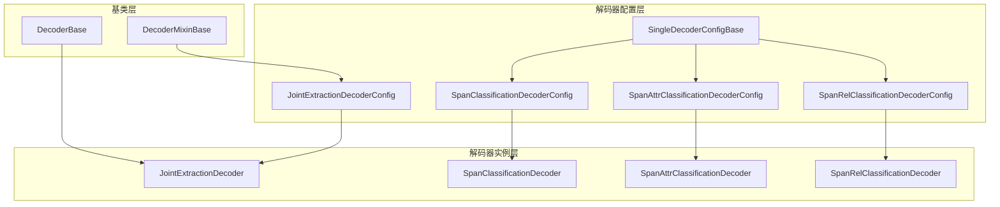
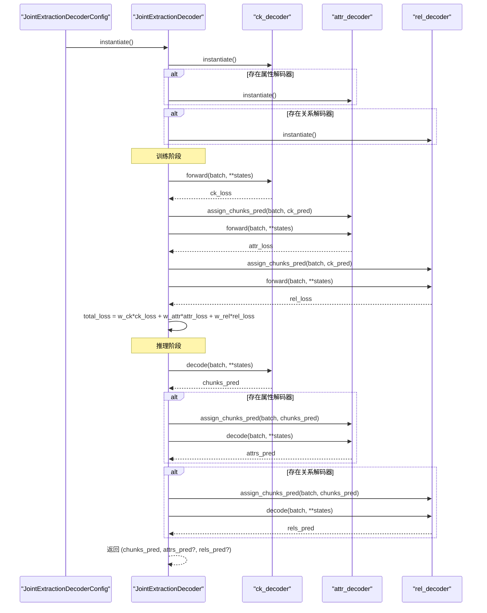
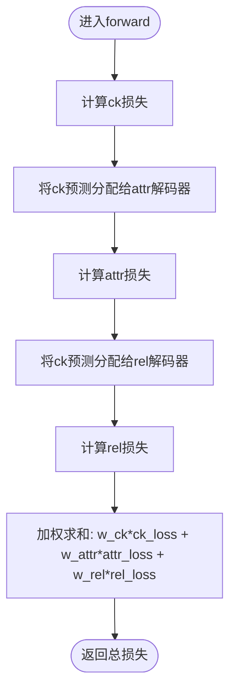
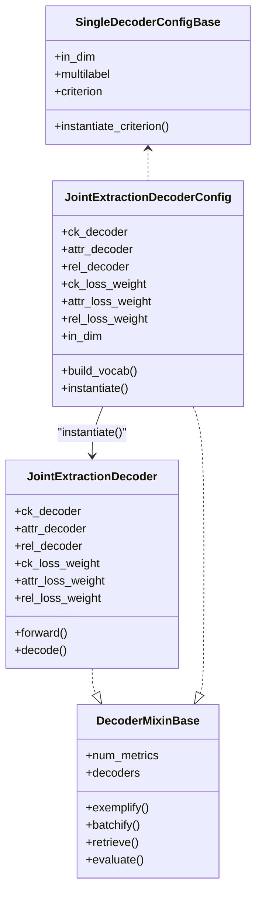

# 联合抽取架构设计

<cite>
**本文引用的文件**
- [joint_extraction.py](file://eznlp/model/decoder/joint_extraction.py)
- [base.py](file://eznlp/model/decoder/base.py)
- [span_classification.py](file://eznlp/model/decoder/span_classification.py)
- [span_attr_classification.py](file://eznlp/model/decoder/span_attr_classification.py)
- [span_rel_classification.py](file://eznlp/model/decoder/span_rel_classification.py)
- [extractor.py](file://eznlp/model/model/extractor.py)
- [test_joint_extraction.py](file://tests/model/test_joint_extraction.py)
</cite>

## 目录
1. [引言](#引言)
2. [项目结构](#项目结构)
3. [核心组件](#核心组件)
4. [架构总览](#架构总览)
5. [关键组件详解](#关键组件详解)
6. [依赖关系分析](#依赖关系分析)
7. [性能与可扩展性](#性能与可扩展性)
8. [故障排查指南](#故障排查指南)
9. [结论](#结论)

## 引言
本文件深入解析JointExtractionDecoderConfig的架构设计，重点说明其如何通过继承DecoderMixinBase实现多解码器协同工作；详细阐述JointExtractionDecoder类中ck_decoder（实体边界/片段识别）、attr_decoder（实体属性标注）和rel_decoder（实体间关系分类）三个核心组件的协同机制；以及forward方法中通过ck_loss_weight、attr_loss_weight和rel_loss_weight实现多任务损失加权的计算流程。同时结合代码路径说明in_dim属性的统一设置机制，以及build_vocab方法如何确保各解码器共享词汇表；解释share_embeddings配置项在参数共享中的作用及其对模型性能的影响。

## 项目结构
联合抽取模块位于模型解码器子系统中，采用“配置-实例化-运行时”的分层设计：
- 配置层：JointExtractionDecoderConfig负责组合多个单任务解码器配置，并提供统一的in_dim、词汇表构建与名称拼接等能力。
- 实例层：JointExtractionDecoder根据配置实例化各子解码器，并在前向与解码阶段协调它们之间的数据流与损失权重。
- 基类层：DecoderMixinBase为多解码器场景提供统一的指标聚合、批处理与评估接口；SingleDecoderConfigBase为单任务解码器提供通用超参与损失函数选择逻辑。

图表来源
- [joint_extraction.py](file://eznlp/model/decoder/joint_extraction.py#L1-L193)
- [base.py](file://eznlp/model/decoder/base.py#L1-L114)
- [span_classification.py](file://eznlp/model/decoder/span_classification.py#L1-L200)
- [span_attr_classification.py](file://eznlp/model/decoder/span_attr_classification.py#L1-L200)
- [span_rel_classification.py](file://eznlp/model/decoder/span_rel_classification.py#L1-L200)

章节来源
- [joint_extraction.py](file://eznlp/model/decoder/joint_extraction.py#L1-L193)
- [base.py](file://eznlp/model/decoder/base.py#L1-L114)

## 核心组件
- JointExtractionDecoderConfig：组合多个单任务解码器配置，提供统一的in_dim设置、词汇表构建与名称拼接；支持多任务损失权重配置。
- JointExtractionDecoder：实例化并协调ck_decoder、attr_decoder、rel_decoder三者，按顺序执行前向与解码，并进行多任务损失加权。
- DecoderMixinBase：为多解码器场景提供统一的指标数量、批处理、检索与评估接口。
- SingleDecoderConfigBase：为单任务解码器提供通用超参（如in_dim、multilabel、conf_thresh、loss策略等）与损失函数选择逻辑。

章节来源
- [joint_extraction.py](file://eznlp/model/decoder/joint_extraction.py#L1-L193)
- [base.py](file://eznlp/model/decoder/base.py#L1-L114)

## 架构总览
下图展示了JointExtractionDecoderConfig到JointExtractionDecoder的实例化与运行时调用关系，以及三个子解码器在训练与推理阶段的数据与损失传递。

图表来源
- [joint_extraction.py](file://eznlp/model/decoder/joint_extraction.py#L154-L193)

## 关键组件详解

### 1) 继承DecoderMixinBase实现多解码器协同
JointExtractionDecoderMixin在JointExtractionDecoderConfig与JointExtractionDecoder中复用，提供以下关键能力：
- has_attr_decoder / has_rel_decoder：判断是否存在属性或关系解码器。
- num_metrics：根据是否启用属性/关系解码器动态返回指标数量（至少1）。
- decoders：迭代器形式遍历所有已启用的解码器，便于统一处理。
- exemplify/batchify/retrieve/evaluate：将单个解码器的批处理与评估行为扩展到多解码器集合，保证训练/评估的一致性。

这些能力使得JointExtractionDecoderConfig与JointExtractionDecoder无需关心具体子解码器类型，即可统一管理多任务流程。

章节来源
- [joint_extraction.py](file://eznlp/model/decoder/joint_extraction.py#L19-L67)
- [base.py](file://eznlp/model/decoder/base.py#L11-L50)

### 2) JointExtractionDecoderConfig的配置与实例化
- 解码器选择：支持字符串或配置对象两种方式，字符串映射到对应单任务解码器配置类（如span_classification、span_attr、span_rel等）。
- 多任务损失权重：通过ck_loss_weight、attr_loss_weight、rel_loss_weight分别控制三类任务的损失贡献度，默认均为1.0。
- 参数共享开关：share_embeddings默认关闭，注释提示PyTorch不建议在模块外部直接共享权重，后续可能参考transformers的权重共享策略。
- in_dim统一设置：通过in_dim属性的setter将维度同步应用到所有子解码器，确保输入特征维度一致。
- 词汇表构建：build_vocab依次调用每个子解码器的build_vocab，以保证各任务共享词汇表与尺寸统计。
- 名称拼接：name由各子解码器名称拼接而成，便于日志与实验区分。

章节来源
- [joint_extraction.py](file://eznlp/model/decoder/joint_extraction.py#L68-L153)

### 3) JointExtractionDecoder的前向与解码流程
- 前向（训练）：先计算主任务（ck）损失，再将预测的片段（chunks）作为上下文分配给属性与关系解码器，分别计算各自损失并按权重加权求和。
- 解码（推理）：先得到chunks预测，再依序对属性与关系解码器进行assign_chunks_pred与decode，最终返回三元组（chunks, attrs?, rels?）。

该流程体现了“先粗后细”的层次化抽取思想：先识别实体边界/片段，再基于片段标注属性，最后在片段对上进行关系分类。

章节来源
- [joint_extraction.py](file://eznlp/model/decoder/joint_extraction.py#L154-L193)

### 4) 三个核心组件的协同机制
- ck_decoder（实体边界/片段识别）：负责从序列隐藏状态中识别候选片段（chunks），并输出片段标签与置信度。其输出作为后续attr与rel的输入上下文。
- attr_decoder（实体属性标注）：以chunk为单位进行属性分类，通常为多标签任务。其assign_chunks_pred会将ck的预测结果注入到批次中，供属性分类使用。
- rel_decoder（实体间关系分类）：以chunk对为单位进行关系分类，同样通过assign_chunks_pred注入上下文。其内部包含ChunkPairsDecoderMixin，负责枚举chunk对、过滤与评估。

章节来源
- [span_classification.py](file://eznlp/model/decoder/span_classification.py#L1-L200)
- [span_attr_classification.py](file://eznlp/model/decoder/span_attr_classification.py#L1-L200)
- [span_rel_classification.py](file://eznlp/model/decoder/span_rel_classification.py#L1-L200)

### 5) 多任务损失加权计算流程
- 计算顺序：ck -> attr -> rel，分别乘以对应的权重后累加。
- 分配上下文：在attr与rel阶段，均通过assign_chunks_pred将ck的预测结果写入batch，使attr/rel能基于已识别的chunks进行任务特定的建模。
- 返回值：forward返回的是总损失标量，用于反向传播。

图表来源
- [joint_extraction.py](file://eznlp/model/decoder/joint_extraction.py#L166-L178)

### 6) in_dim属性的统一设置机制
- 配置层：JointExtractionDecoderConfig的in_dim属性返回ck_decoder.in_dim，并提供setter，将传入维度同步设置到所有子解码器。
- 单任务解码器：SingleDecoderConfigBase定义了in_dim字段；部分解码器（如SpanAttrClassificationDecoderConfig）会在in_dim变化时联动调整其内部编码器/嵌入维度（例如reduction.in_dim）。
- 作用：确保不同子解码器共享同一输入维度，避免下游模块形状不匹配问题。

章节来源
- [joint_extraction.py](file://eznlp/model/decoder/joint_extraction.py#L125-L133)
- [base.py](file://eznlp/model/decoder/base.py#L52-L64)
- [span_attr_classification.py](file://eznlp/model/decoder/span_attr_classification.py#L146-L155)

### 7) build_vocab如何确保各解码器共享词汇表
- JointExtractionDecoderConfig.build_vocab遍历所有已启用的子解码器并调用其build_vocab。
- 各单任务解码器在build_vocab中：
  - 从数据分区中统计标签分布，生成idx2label、idx2ck_label等映射。
  - 计算最大span大小、重叠级别等统计信息，用于后续模型结构与裁剪。
- 结果：所有子解码器共享相同的标签体系与尺寸上限，避免跨任务标签不一致导致的训练/评估异常。

章节来源
- [joint_extraction.py](file://eznlp/model/decoder/joint_extraction.py#L146-L149)
- [span_classification.py](file://eznlp/model/decoder/span_classification.py#L99-L159)
- [span_attr_classification.py](file://eznlp/model/decoder/span_attr_classification.py#L156-L191)
- [span_rel_classification.py](file://eznlp/model/decoder/span_rel_classification.py#L156-L200)

### 8) share_embeddings配置项的作用与影响
- 配置位置：JointExtractionDecoderConfig中存在share_embeddings参数，默认关闭。
- 设计意图：注释指出PyTorch不建议在模块外部直接共享权重，后续可能参考transformers的权重共享策略。
- 影响范围：当前JointExtractionDecoderConfig未在解码器之间显式共享嵌入参数；若开启，需在实例化阶段对相关嵌入层进行绑定或共享初始化，以避免梯度冲突与参数冗余。
- 性能影响：适度的参数共享可降低模型参数规模、提升泛化能力，但过度共享可能导致任务间干扰；应结合任务特性与数据规模进行权衡。

章节来源
- [joint_extraction.py](file://eznlp/model/decoder/joint_extraction.py#L101-L109)

### 9) 与Extractor集成与端到端训练
- ExtractorConfig支持多种解码器字符串，其中joint_extraction会构造JointExtractionDecoderConfig并指定默认的ck与rel解码器类型。
- Extractor在构建批次时会调用decoder.batchify，从而将多任务解码器所需的上下文（如chunks预测）正确注入到attr/rel解码器中。

章节来源
- [extractor.py](file://eznlp/model/model/extractor.py#L77-L87)
- [joint_extraction.py](file://eznlp/model/decoder/joint_extraction.py#L48-L54)

## 依赖关系分析
- 组件耦合：
  - JointExtractionDecoderConfig与JointExtractionDecoder通过JointExtractionDecoderMixin保持低耦合的多解码器协作接口。
  - 各单任务解码器配置与实例分别承担“结构定义”和“运行时行为”，职责清晰。
- 外部依赖：
  - Batch包装器贯穿整个流程，用于承载多任务解码器所需的上下文与中间结果。
  - 损失函数选择由SingleDecoderConfigBase统一管理，支持交叉熵、焦点损失、平滑标签等策略。

图表来源
- [joint_extraction.py](file://eznlp/model/decoder/joint_extraction.py#L68-L193)
- [base.py](file://eznlp/model/decoder/base.py#L11-L114)

## 性能与可扩展性
- 训练稳定性：通过多任务损失权重w_ck、w_attr、w_rel平衡不同任务的贡献，避免某任务主导训练过程。
- 计算开销：rel任务通常枚举chunk对，复杂度较高；可通过限制最大span大小、距离阈值与过滤策略降低开销。
- 可扩展性：新增任务只需实现SingleDecoderConfigBase与DecoderBase，并在JointExtractionDecoderConfig中添加字符串映射与权重配置，即可无缝接入。

[本节为通用指导，不直接分析具体文件]

## 故障排查指南
- 词汇表不一致：若仅对部分子解码器调用build_vocab，可能导致标签映射不一致。请确认JointExtractionDecoderConfig.build_vocab被调用且覆盖全部数据分区。
- 维度不匹配：当in_dim设置不一致时，某些解码器内部的嵌入或编码器维度可能与上游不兼容。请通过JointExtractionDecoderConfig.in_dim统一设置。
- 上下文缺失：attr/rel解码器无法获得chunks预测时，通常是因为未调用assign_chunks_pred或批次结构不正确。请检查Extractor.batchify与JointExtractionDecoder.forward/decode的调用链。
- 训练不稳定：若某一任务损失过大，可适当降低对应权重；或检查该任务的损失函数与正负样本采样策略。

章节来源
- [joint_extraction.py](file://eznlp/model/decoder/joint_extraction.py#L146-L193)
- [test_joint_extraction.py](file://tests/model/test_joint_extraction.py#L1-L200)

## 结论
JointExtractionDecoderConfig通过继承DecoderMixinBase实现了多解码器的统一管理与协同；JointExtractionDecoder则以“先粗后细”的顺序完成实体边界识别、属性标注与关系分类的多任务抽取。in_dim统一设置与build_vocab共享词汇表确保了跨任务一致性；多任务损失权重提供了灵活的训练平衡机制。share_embeddings参数为未来参数共享预留了空间，需谨慎评估其对任务间干扰与泛化能力的影响。