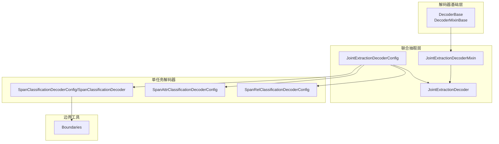
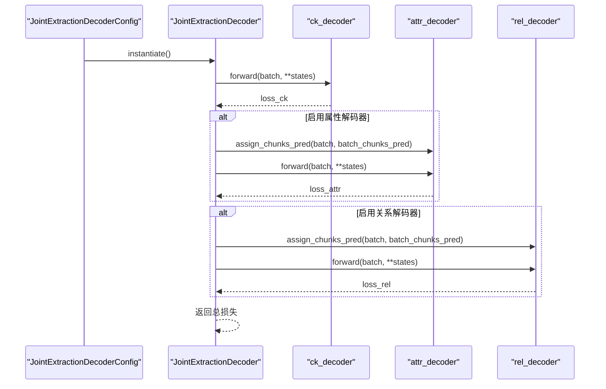
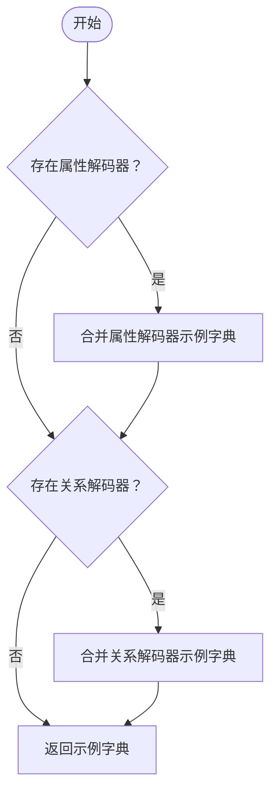
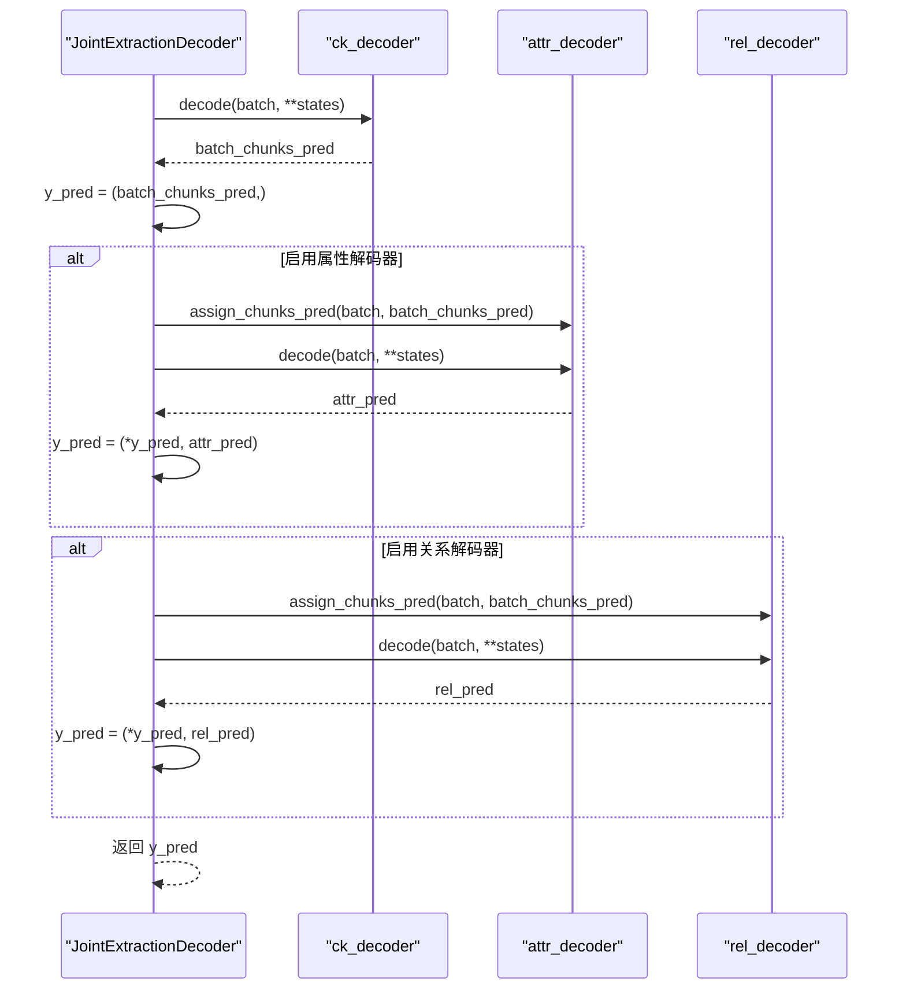
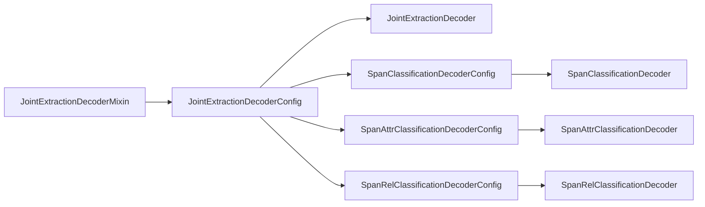

# 联合抽取解码器混入机制

<cite>
**本文引用的文件**
- [joint_extraction.py](file://eznlp/model/decoder/joint_extraction.py)
- [base.py](file://eznlp/model/decoder/base.py)
- [span_classification.py](file://eznlp/model/decoder/span_classification.py)
- [span_attr_classification.py](file://eznlp/model/decoder/span_attr_classification.py)
- [span_rel_classification.py](file://eznlp/model/decoder/span_rel_classification.py)
- [boundaries.py](file://eznlp/model/decoder/boundaries.py)
- [test_joint_extraction.py](file://tests/model/test_joint_extraction.py)
</cite>

## 目录
1. [引言](#引言)
2. [项目结构](#项目结构)
3. [核心组件](#核心组件)
4. [架构总览](#架构总览)
5. [详细组件分析](#详细组件分析)
6. [依赖分析](#依赖分析)
7. [性能考量](#性能考量)
8. [故障排查指南](#故障排查指南)
9. [结论](#结论)
10. [附录](#附录)

## 引言
本文件系统性解析 JointExtractionDecoderMixin 的设计原理与实现细节，重点阐述其作为“解码器协同工作基础”的核心作用：如何通过 has_attr_decoder 和 has_rel_decoder 动态判断属性与关系解码器的存在状态；如何利用 decoders 生成器对多解码器进行统一迭代管理；如何在数据预处理阶段通过 exemplify 与 batchify 的级联调用实现多解码器的数据整合；如何在 retrieve 中协调多个解码器的结果提取；以及在 evaluate 中对多任务评估指标进行统一计算。同时，结合混入（mixin）模式的组合设计，说明其如何提升代码复用性与可维护性。

## 项目结构
本主题涉及的代码主要位于模型解码器模块，核心文件包括：
- 解码器基类与混入：base.py
- 联合抽取混入与实现：joint_extraction.py
- 具体解码器配置与实现：span_classification.py、span_attr_classification.py、span_rel_classification.py
- 边界相关工具：boundaries.py
- 测试用例：test_joint_extraction.py

图表来源
- [joint_extraction.py](file://eznlp/model/decoder/joint_extraction.py#L1-L193)
- [base.py](file://eznlp/model/decoder/base.py#L1-L114)
- [span_classification.py](file://eznlp/model/decoder/span_classification.py#L1-L200)
- [span_attr_classification.py](file://eznlp/model/decoder/span_attr_classification.py#L1-L200)
- [span_rel_classification.py](file://eznlp/model/decoder/span_rel_classification.py#L1-L200)
- [boundaries.py](file://eznlp/model/decoder/boundaries.py#L1-L200)

章节来源
- [joint_extraction.py](file://eznlp/model/decoder/joint_extraction.py#L1-L193)
- [base.py](file://eznlp/model/decoder/base.py#L1-L114)

## 核心组件
- JointExtractionDecoderMixin：提供动态解码器存在性检测、统一迭代、数据预处理级联、结果提取与多任务评估等通用能力。
- JointExtractionDecoderConfig：负责根据字符串或具体配置实例化各子解码器，并提供名称拼接、维度一致性、词表构建等配置能力。
- JointExtractionDecoder：在运行时按顺序执行主边界解码器，再按需驱动属性与关系解码器，实现联合抽取的前向与解码流程。

章节来源
- [joint_extraction.py](file://eznlp/model/decoder/joint_extraction.py#L1-L193)

## 架构总览
联合抽取的整体流程如下：
- 配置阶段：JointExtractionDecoderConfig 将 ck_decoder、attr_decoder、rel_decoder 组合为一个联合配置对象。
- 实例化阶段：JointExtractionDecoderConfig.instantiate 返回 JointExtractionDecoder 实例，内部实例化各子解码器并设置权重。
- 训练阶段：JointExtractionDecoder.forward 依次调用 ck_decoder 的前向损失，再根据是否启用属性/关系解码器，分别对 batch 注入预测边界并累加对应损失。
- 推理阶段：JointExtractionDecoder.decode 先得到边界预测，再按需追加属性与关系预测，形成多任务输出元组。

图表来源
- [joint_extraction.py](file://eznlp/model/decoder/joint_extraction.py#L154-L193)

## 详细组件分析

### JointExtractionDecoderMixin 设计要点
- 动态存在性检测
  - has_attr_decoder：通过检查实例是否存在 attr_decoder 且非空，决定是否启用属性解码链路。
  - has_rel_decoder：同理，决定是否启用关系解码链路。
- 统一迭代管理
  - decoders 生成器：先产出 ck_decoder，再按需产出 attr_decoder 与 rel_decoder，形成统一的迭代序列，便于在 evaluate/retrieve 等场景下进行多任务并行处理。
- 数据预处理级联
  - exemplify：先由 ck_decoder 生成示例字典，再按需合并 attr_decoder 与 rel_decoder 的示例字典，最终返回完整的示例。
  - batchify：先由 ck_decoder 构建批处理字典，再按需合并 attr_decoder 与 rel_decoder 的批处理字典，确保多解码器共享同一输入结构。
- 结果提取与评估
  - retrieve：对每个解码器调用 retrieve，返回一个包含各任务结果的元组，便于上层统一处理。
  - evaluate：对每个解码器的 gold/pred 进行 zip 对齐，逐个调用 evaluate 并汇总为元组，支持多任务指标并行计算。

图表来源
- [joint_extraction.py](file://eznlp/model/decoder/joint_extraction.py#L40-L54)

章节来源
- [joint_extraction.py](file://eznlp/model/decoder/joint_extraction.py#L19-L66)

### JointExtractionDecoderConfig 组合与配置
- 子解码器选择
  - 支持传入具体配置对象或字符串标识，字符串将映射到对应的解码器配置类（如 sequence_tagging、span_classification、boundary、specific_span_cls、span_attr、span_rel、specific_span_rel、unfiltered_specific_span_rel 等）。
- 多任务权重
  - 提供 ck_loss_weight、attr_loss_weight、rel_loss_weight，用于训练时对不同任务损失进行加权融合。
- 维度与词表
  - in_dim、min_span_size、max_span_size、max_size_id 等属性代理给 ck_decoder，保证多任务输入维度一致。
  - build_vocab 对所有子解码器执行词表构建，确保标签体系一致。
- 名称拼接
  - name 将各子解码器名称拼接，便于日志与实验记录。

章节来源
- [joint_extraction.py](file://eznlp/model/decoder/joint_extraction.py#L68-L153)

### JointExtractionDecoder 运行时行为
- 前向传播
  - 先计算 ck_decoder 的损失并获取边界预测；若启用属性解码器，则将边界预测注入 attr_decoder 并计算损失；若启用关系解码器，则将边界预测注入 rel_decoder 并计算损失；最后按权重累加返回总损失。
- 解码输出
  - 先得到边界预测，形成初始元组；随后按需追加属性与关系预测，最终返回多任务预测元组，便于上层统一处理。

图表来源
- [joint_extraction.py](file://eznlp/model/decoder/joint_extraction.py#L166-L193)

章节来源
- [joint_extraction.py](file://eznlp/model/decoder/joint_extraction.py#L154-L193)

### 单任务解码器与边界工具
- SpanClassificationDecoderConfig/Decoder
  - 主边界解码器，负责从隐藏状态中识别实体边界，支持最大池化/注意力聚合、大小嵌入、边界平滑/标签平滑等策略。
- SpanAttrClassificationDecoderConfig/Decoder
  - 属性解码器，基于 ChunkSingles 概念，对每个边界块进行属性分类，支持多标签与过滤策略。
- SpanRelClassificationDecoderConfig/Decoder
  - 关系解码器，基于 ChunkPairs 概念，对边界块对进行关系分类，支持上下文融合、对称关系补全、逆关系处理等。
- Boundaries 工具
  - 为边界采样与标签平滑提供底层支持，包括对角线枚举、嵌套/周围采样掩码、软标签构造等。

章节来源
- [span_classification.py](file://eznlp/model/decoder/span_classification.py#L1-L200)
- [span_attr_classification.py](file://eznlp/model/decoder/span_attr_classification.py#L1-L200)
- [span_rel_classification.py](file://eznlp/model/decoder/span_rel_classification.py#L1-L200)
- [boundaries.py](file://eznlp/model/decoder/boundaries.py#L1-L200)

### 测试用例中的使用场景
- 基础联合抽取：仅启用边界与关系解码器，验证批一致性与可训练性。
- 含属性联合抽取：同时启用边界、属性与关系解码器，覆盖多任务训练与推理。
- BERT 类模型集成：在特定抽取器配置下接入 BERT-like 编码器，验证端到端训练。
- 无标注预测：当仅有 tokens 时仍能进行预测，验证解码器的独立性与健壮性。
- 特定跨度关系抽取：支持特定跨度长度限制的关系抽取配置，覆盖过滤与非过滤两种变体。

章节来源
- [test_joint_extraction.py](file://tests/model/test_joint_extraction.py#L1-L211)

## 依赖分析
- 组件耦合与内聚
  - JointExtractionDecoderMixin 将多解码器的共性行为抽象为混入，降低 JointExtractionDecoderConfig/JointExtractionDecoder 的重复代码，提高内聚性。
  - 通过 decoders 生成器，将 ck_decoder、attr_decoder、rel_decoder 的生命周期与调用顺序标准化，避免分散的条件分支。
- 外部依赖
  - 依赖基础解码器接口（DecoderBase、DecoderMixinBase），确保 evaluate/retrieve/retrieve 等方法的一致性。
  - 依赖具体解码器配置类，通过字符串映射实现灵活组合。
- 循环依赖
  - 未发现循环导入；配置类与解码器类之间通过字符串映射与 instantiate 解耦。

图表来源
- [joint_extraction.py](file://eznlp/model/decoder/joint_extraction.py#L68-L153)
- [span_classification.py](file://eznlp/model/decoder/span_classification.py#L1-L200)
- [span_attr_classification.py](file://eznlp/model/decoder/span_attr_classification.py#L1-L200)
- [span_rel_classification.py](file://eznlp/model/decoder/span_rel_classification.py#L1-L200)

章节来源
- [joint_extraction.py](file://eznlp/model/decoder/joint_extraction.py#L68-L153)

## 性能考量
- 计算开销
  - 前向与解码过程中，按需注入边界预测，避免不必要的重复计算；通过权重累加控制多任务损失的贡献度。
- 内存占用
  - exemplify/batchify 的级联合并会增加中间字典的内存占用，建议在大规模数据上谨慎使用多解码器组合。
- 可扩展性
  - 通过 decoders 生成器与 evaluate/retrieve 的统一处理，新增解码器只需遵循接口约定即可无缝接入。

## 故障排查指南
- 评估指标不匹配
  - 若 num_metrics 与 y_gold/y_pred 的任务数量不一致，可能由于 has_attr_decoder 或 has_rel_decoder 的状态与实际启用情况不一致导致。可通过检查配置中的子解码器是否为 None 或字符串映射是否正确。
- 数据预处理异常
  - exemplify/batchify 的级联合并失败通常源于某个子解码器未正确实现 exemplify/batchify 或返回值类型不符合预期。请核对对应解码器的实现。
- 推理结果为空
  - 当仅启用属性解码器而未提供边界信息时，可能需要确认 ck_decoder 是否已正确生成边界预测并被注入到属性解码器中。

章节来源
- [base.py](file://eznlp/model/decoder/base.py#L1-L114)
- [joint_extraction.py](file://eznlp/model/decoder/joint_extraction.py#L19-L66)

## 结论
JointExtractionDecoderMixin 通过混入模式将多解码器的通用行为抽象出来，实现了：
- 动态解码器存在性检测与统一迭代管理；
- 数据预处理阶段的级联调用机制；
- 结果提取与多任务评估指标的统一处理；
- 与具体解码器配置的松耦合组合，显著提升了代码复用性与可维护性。

该设计使得联合抽取任务在保持灵活性的同时，具备良好的扩展性与稳定性，适合在多种下游任务中复用。

## 附录
- 关键路径参考
  - 动态存在性检测：[has_attr_decoder/has_rel_decoder](file://eznlp/model/decoder/joint_extraction.py#L21-L26)
  - 统一迭代 decoders：[decoders 生成器](file://eznlp/model/decoder/joint_extraction.py#L33-L38)
  - 数据预处理级联 exemplify/batchify：[exemplify/batchify](file://eznlp/model/decoder/joint_extraction.py#L40-L54)
  - 结果提取与评估：[retrieve/evaluate](file://eznlp/model/decoder/joint_extraction.py#L56-L66)
  - 配置组合与权重：[JointExtractionDecoderConfig](file://eznlp/model/decoder/joint_extraction.py#L68-L153)
  - 运行时前向与解码：[JointExtractionDecoder.forward/decode](file://eznlp/model/decoder/joint_extraction.py#L154-L193)