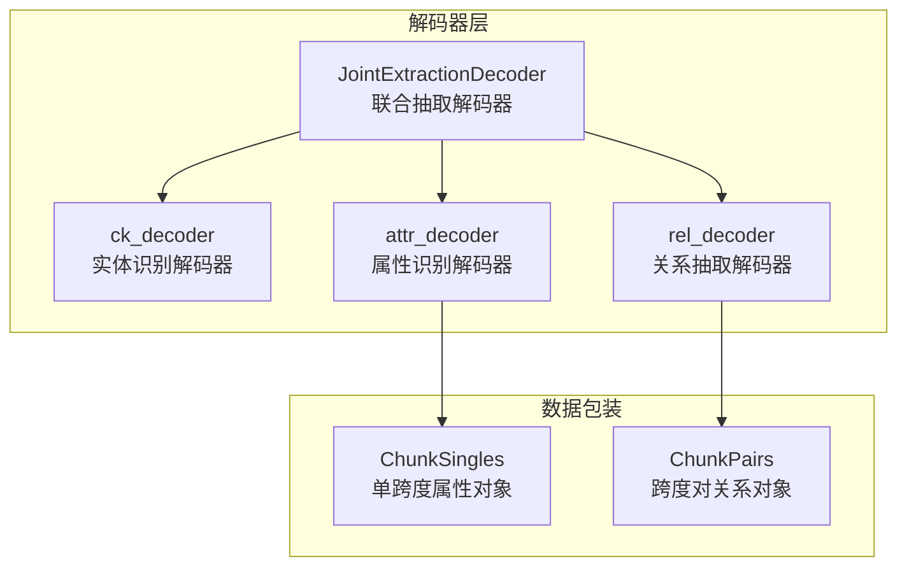
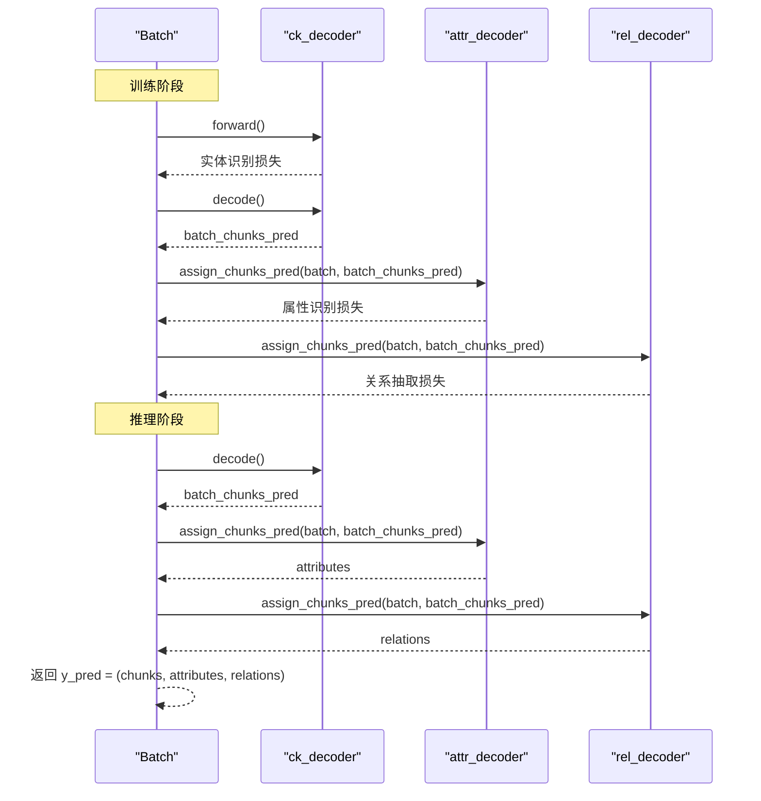
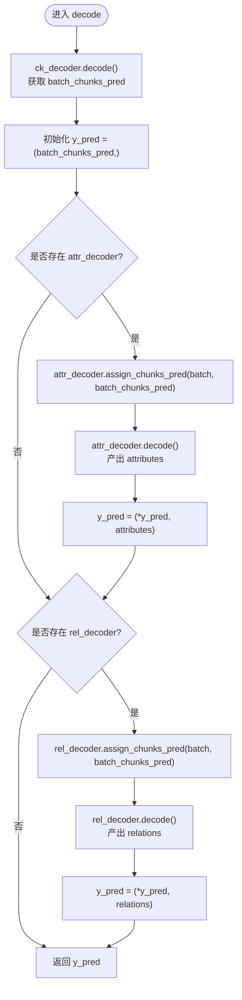
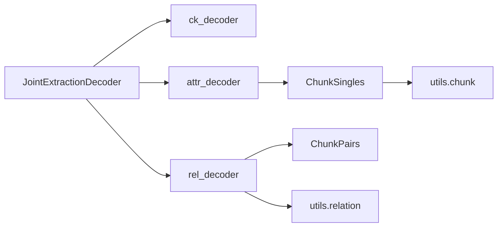

# 联合抽取解码过程

<cite>
**本文引用的文件列表**
- [joint_extraction.py](file://eznlp/model/decoder/joint_extraction.py)
- [base.py](file://eznlp/model/decoder/base.py)
- [span_attr_classification.py](file://eznlp/model/decoder/span_attr_classification.py)
- [span_rel_classification.py](file://eznlp/model/decoder/span_rel_classification.py)
- [chunks.py](file://eznlp/model/decoder/chunks.py)
- [test_joint_extraction.py](file://tests/model/test_joint_extraction.py)
- [chunk.py](file://eznlp/utils/chunk.py)
- [relation.py](file://eznlp/utils/relation.py)
</cite>

## 目录
1. [引言](#引言)
2. [项目结构](#项目结构)
3. [核心组件](#核心组件)
4. [架构总览](#架构总览)
5. [详细组件分析](#详细组件分析)
6. [依赖关系分析](#依赖关系分析)
7. [性能考量](#性能考量)
8. [故障排查指南](#故障排查指南)
9. [结论](#结论)
10. [附录](#附录)

## 引言
本文件围绕 JointExtractionDecoder 的 decode 方法展开，系统解析其如何以 batch_chunks_pred 为基础预测结果驱动后续属性识别与关系抽取解码器，并说明 y_pred 元组的构建过程、与 forward 方法在预测传递机制上的一致性，以及如何确保属性识别与关系抽取任务能基于准确的实体识别结果进行。文档同时结合实际应用场景（如 HwaMei 数据集）说明多任务预测结果的组织形式。

## 项目结构
本仓库采用“按功能域划分”的模块化组织方式，解码器相关代码集中在 eznlp/model/decoder 目录下，包含联合抽取解码器、序列标注解码器、边界选择解码器、span 分类解码器、属性分类解码器、关系分类解码器等。联合抽取解码器通过组合多个单任务解码器，形成端到端的多任务学习与推理框架。

图表来源
- [joint_extraction.py](file://eznlp/model/decoder/joint_extraction.py#L154-L193)
- [span_attr_classification.py](file://eznlp/model/decoder/span_attr_classification.py#L195-L386)
- [span_rel_classification.py](file://eznlp/model/decoder/span_rel_classification.py#L319-L585)
- [chunks.py](file://eznlp/model/decoder/chunks.py#L16-L193)

章节来源
- [joint_extraction.py](file://eznlp/model/decoder/joint_extraction.py#L154-L193)

## 核心组件
- JointExtractionDecoder：负责统一调度 ck_decoder、attr_decoder、rel_decoder，提供 forward 与 decode 两个关键接口。其中 decode 方法以 ck_decoder 的实体识别预测为“基础”，再依次驱动属性与关系解码器。
- ChunkSingles 与 ChunkPairs：分别为属性识别与关系抽取提供“单跨度”和“跨度对”的数据包装，承载 chunks、attributes、relations 等结构化信息，并在 assign_chunks_pred 后构建索引与掩码。
- DecoderBase 与 SingleDecoderConfigBase：定义解码器的通用接口与配置项，包括 criterion、loss 权重、阈值、多标签等。

章节来源
- [joint_extraction.py](file://eznlp/model/decoder/joint_extraction.py#L154-L193)
- [base.py](file://eznlp/model/decoder/base.py#L90-L114)
- [chunks.py](file://eznlp/model/decoder/chunks.py#L16-L193)

## 架构总览
联合抽取解码器的控制流分为训练与推理两条路径：
- 训练路径（forward）：先运行 ck_decoder 得到实体识别损失，随后将 batch_chunks_pred 传入 attr_decoder 与 rel_decoder，分别计算各自损失并加权求和。
- 推理路径（decode）：同样先由 ck_decoder 解码得到 batch_chunks_pred，然后将其传入 attr_decoder 与 rel_decoder，最终返回三元组 y_pred = (chunks, attributes, relations)。

图表来源
- [joint_extraction.py](file://eznlp/model/decoder/joint_extraction.py#L166-L193)
- [span_attr_classification.py](file://eznlp/model/decoder/span_attr_classification.py#L250-L386)
- [span_rel_classification.py](file://eznlp/model/decoder/span_rel_classification.py#L406-L585)

## 详细组件分析

### JointExtractionDecoder.decode 方法详解
- 输入：Batch 对象，包含文本、分词、标注等信息；states 用于传递中间隐藏状态（如 full_hidden）。
- 输出：y_pred 元组，包含三部分预测结果：(chunks, attributes, relations)，其中 attributes 与 relations 仅在对应解码器存在时才出现。
- 关键步骤：
  1) 由 ck_decoder.decode 获取 batch_chunks_pred（实体片段预测），作为后续所有任务的“基础”。
  2) 若存在 attr_decoder，则调用 attr_decoder.assign_chunks_pred 将 batch_chunks_pred 注入到属性解码器内部的 ChunkSingles 对象中，随后 attr_decoder.decode 产出 attributes。
  3) 若存在 rel_decoder，则调用 rel_decoder.assign_chunks_pred 将 batch_chunks_pred 注入到关系解码器内部的 ChunkPairs 对象中，随后 rel_decoder.decode 产出 relations。
  4) 最终将三部分结果打包为 y_pred 元组返回。

图表来源
- [joint_extraction.py](file://eznlp/model/decoder/joint_extraction.py#L180-L193)
- [span_attr_classification.py](file://eznlp/model/decoder/span_attr_classification.py#L250-L386)
- [span_rel_classification.py](file://eznlp/model/decoder/span_rel_classification.py#L406-L585)

章节来源
- [joint_extraction.py](file://eznlp/model/decoder/joint_extraction.py#L180-L193)

### batch_chunks_pred 作为基础预测结果的传递机制
- 作用：batch_chunks_pred 是实体片段（chunk）的预测集合，通常由 ck_decoder（如 span_classification 或 boundary_selection）输出。它决定了后续属性与关系解码器的候选实体范围。
- 传递方式：
  - 在 decode 阶段：通过 assign_chunks_pred 将 batch_chunks_pred 写入 attr_decoder 与 rel_decoder 的内部对象（ChunkSingles/ChunkPairs），从而让属性与关系解码器仅在这些实体上进行预测。
  - 在 forward 阶段：同样通过 assign_chunks_pred 将 batch_chunks_pred 注入，使属性与关系解码器在训练时也能基于一致的实体集合进行损失计算。
- 一致性保证：
  - ChunkSingles/ChunkPairs 的 chunks_pred 字段一旦设置即不可更改，且在非训练模式下会优先使用预测实体而非黄金实体，确保推理阶段的确定性与一致性。
  - 两者在构建过程中会合并预测实体与负采样实体，限制最大跨度长度，避免过长实体影响关系枚举与计算。

章节来源
- [joint_extraction.py](file://eznlp/model/decoder/joint_extraction.py#L166-L193)
- [chunks.py](file://eznlp/model/decoder/chunks.py#L31-L113)
- [chunks.py](file://eznlp/model/decoder/chunks.py#L194-L342)

### y_pred 元组的构建过程
- 结构：y_pred 是一个元组，元素顺序与参与的解码器一致，通常为 (chunks, attributes, relations)。若仅启用实体识别与关系抽取，则 y_pred 为 (chunks, relations)。
- 组装规则：
  - decode 首先将 batch_chunks_pred 作为第一个元素放入 y_pred。
  - 若存在 attr_decoder，则将其 decode 结果追加到 y_pred。
  - 若存在 rel_decoder，则将其 decode 结果追加到 y_pred。
- 应用场景：
  - 在 HwaMei 数据集中，实体识别输出 chunks，属性识别输出 attributes（如“Denined”、“Analyzed”等），关系抽取输出 relations（如“Symptom-Disease_Syndrome”等）。y_pred 的组织形式便于下游模块（如评估器或导出器）按任务维度读取与处理。

章节来源
- [joint_extraction.py](file://eznlp/model/decoder/joint_extraction.py#L180-L193)
- [test_joint_extraction.py](file://tests/model/test_joint_extraction.py#L120-L134)

### 与 forward 方法在预测传递机制上的一致性
- 共同点：
  - 两者均以 ck_decoder 的实体识别预测为“基础”，通过 assign_chunks_pred 将 batch_chunks_pred 注入到属性与关系解码器。
  - 两者都遵循“先实体识别，后属性与关系”的顺序，确保属性与关系解码器仅在已确认的实体上进行预测。
- 差异点：
  - forward 返回的是损失张量，用于反向传播；decode 返回的是预测结果，用于推理与评估。
  - forward 中会根据配置对各任务损失加权求和；decode 中不涉及损失计算，直接返回预测。

章节来源
- [joint_extraction.py](file://eznlp/model/decoder/joint_extraction.py#L166-L193)

### 如何确保属性识别与关系抽取基于准确的实体识别结果
- 通过 assign_chunks_pred 将 ck_decoder 的预测实体写入 ChunkSingles/ChunkPairs，使得：
  - 属性识别：仅对这些实体进行属性标注，避免无关实体干扰。
  - 关系抽取：仅在这些实体之间枚举关系候选，减少无效计算与噪声。
- 数据包装层的约束：
  - chunks_pred 不可重复设置，保证推理阶段的确定性。
  - 在非训练模式下，gold chunks 不可访问，强制使用预测实体，避免信息泄漏。
  - 支持最大跨度过滤、负采样掩码、软标签平滑等策略，提升训练稳定性与泛化能力。

章节来源
- [chunks.py](file://eznlp/model/decoder/chunks.py#L31-L113)
- [chunks.py](file://eznlp/model/decoder/chunks.py#L194-L342)
- [span_attr_classification.py](file://eznlp/model/decoder/span_attr_classification.py#L250-L386)
- [span_rel_classification.py](file://eznlp/model/decoder/span_rel_classification.py#L406-L585)

### 实际应用场景说明
- HwaMei 数据集示例：
  - 文本中包含症状、检查、疾病等实体，以及“否认”“分析”等属性，以及实体之间的关系（如症状-疾病）。
  - 联合抽取解码器输出的 y_pred 包含：
    - chunks：实体片段集合；
    - attributes：实体属性集合；
    - relations：实体间关系集合。
- 测试用例验证：
  - 测试覆盖了多种 ck_decoder 与解码器组合，验证了 batch 一致性与可训练性，表明 decode 的预测传递机制在不同配置下均能稳定工作。

章节来源
- [test_joint_extraction.py](file://tests/model/test_joint_extraction.py#L66-L107)
- [test_joint_extraction.py](file://tests/model/test_joint_extraction.py#L120-L134)

## 依赖关系分析
- 组件耦合：
  - JointExtractionDecoder 与 ck_decoder、attr_decoder、rel_decoder 之间为组合关系，彼此独立但共享 batch_chunks_pred。
  - 属性与关系解码器依赖 ChunkSingles/ChunkPairs 提供的实体集合与掩码，二者通过 assign_chunks_pred 建立弱耦合的数据通道。
- 外部依赖：
  - utils.chunk 与 utils.relation 提供实体重叠判断、对称关系补全、逆关系检测等辅助能力，影响关系抽取的过滤与后处理。
- 循环依赖：
  - 未发现循环导入；解码器之间通过 Batch 与 assign_chunks_pred 间接通信，避免直接循环引用。

图表来源
- [joint_extraction.py](file://eznlp/model/decoder/joint_extraction.py#L154-L193)
- [span_attr_classification.py](file://eznlp/model/decoder/span_attr_classification.py#L195-L386)
- [span_rel_classification.py](file://eznlp/model/decoder/span_rel_classification.py#L319-L585)
- [chunks.py](file://eznlp/model/decoder/chunks.py#L16-L193)
- [chunk.py](file://eznlp/utils/chunk.py#L82-L95)
- [relation.py](file://eznlp/utils/relation.py#L1-L31)

章节来源
- [joint_extraction.py](file://eznlp/model/decoder/joint_extraction.py#L154-L193)
- [chunk.py](file://eznlp/utils/chunk.py#L82-L95)
- [relation.py](file://eznlp/utils/relation.py#L1-L31)

## 性能考量
- 计算复杂度：
  - 关系抽取通常以 O(N^2) 的跨度对枚举为主，其中 N 为实体数量。通过 assign_chunks_pred 限定候选实体集合，可显著降低无效关系的计算开销。
  - 属性识别为 O(N) 的线性扫描，受实体数量影响较小。
- 内存与设备：
  - ChunkSingles/ChunkPairs 在构建时会将张量移动到与权重相同的设备上，避免跨设备传输带来的性能损耗。
- 训练稳定性：
  - 通过负采样率、软标签平滑、L2 正则等策略，缓解类别不平衡与过拟合问题，提升整体性能。

章节来源
- [span_rel_classification.py](file://eznlp/model/decoder/span_rel_classification.py#L406-L585)
- [span_attr_classification.py](file://eznlp/model/decoder/span_attr_classification.py#L250-L386)

## 故障排查指南
- 症状：推理阶段输出为空或异常稀疏
  - 可能原因：ck_decoder 输出的 batch_chunks_pred 过少或质量差。
  - 排查建议：检查 ck_decoder 的阈值、聚合模式与损失权重；确认 assign_chunks_pred 是否正确注入。
- 症状：关系抽取报错或维度不匹配
  - 可能原因：ChunkPairs 的 chunks_pred 未正确构建或超过最大跨度限制。
  - 排查建议：检查 max_span_size、neg_sampling_rate、enumerate_chunk_pairs 的过滤条件；确认 cp2label_id 的构建是否成功。
- 症状：属性识别多标签阈值设置不当导致误判
  - 可能原因：conf_thresh 设置过高或过低。
  - 排查建议：调整 conf_thresh；对于多标签任务，确认 none 标签的屏蔽逻辑是否生效。

章节来源
- [chunks.py](file://eznlp/model/decoder/chunks.py#L31-L113)
- [chunks.py](file://eznlp/model/decoder/chunks.py#L194-L342)
- [span_attr_classification.py](file://eznlp/model/decoder/span_attr_classification.py#L250-L386)
- [span_rel_classification.py](file://eznlp/model/decoder/span_rel_classification.py#L406-L585)

## 结论
JointExtractionDecoder 的 decode 方法通过 batch_chunks_pred 将实体识别结果作为“基础”，依次驱动属性与关系解码器完成多任务预测。该设计在训练与推理阶段保持一致的预测传递机制，确保属性识别与关系抽取均基于准确的实体集合进行，从而提升整体抽取质量与鲁棒性。借助 ChunkSingles/ChunkPairs 的数据包装与过滤策略，系统在性能与稳定性方面也具备良好表现。

## 附录
- 相关工具函数：
  - 实体重叠与距离：用于关系枚举与过滤。
  - 对称关系补全与逆关系检测：用于完善关系抽取结果。
- 测试用例参考：
  - 覆盖多种解码器组合与数据集，验证 batch 一致性与可训练性。

章节来源
- [chunk.py](file://eznlp/utils/chunk.py#L82-L95)
- [relation.py](file://eznlp/utils/relation.py#L1-L31)
- [test_joint_extraction.py](file://tests/model/test_joint_extraction.py#L66-L107)