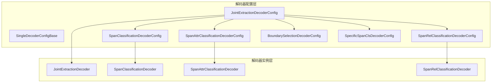
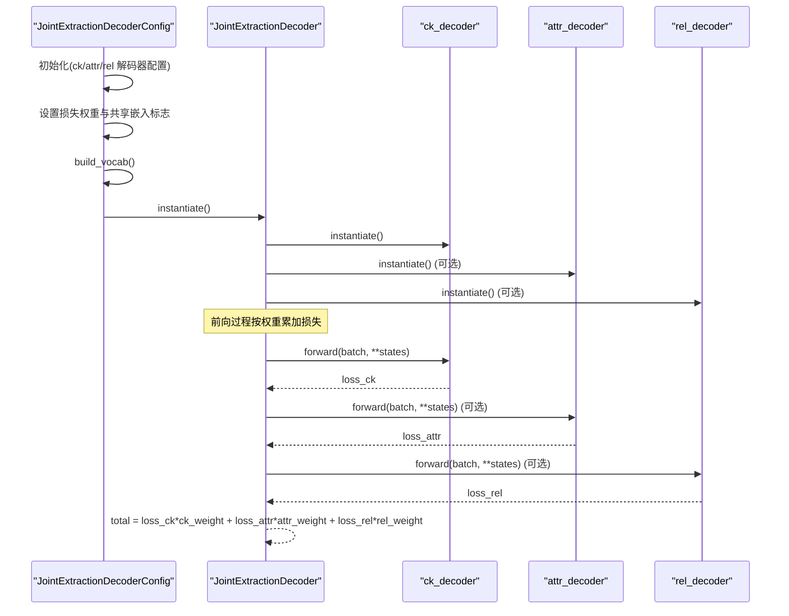
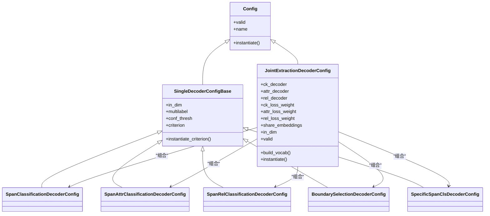

# 联合抽取配置机制

<cite>
**本文引用的文件列表**
- [joint_extraction.py](file://eznlp/model/decoder/joint_extraction.py)
- [base.py](file://eznlp/model/decoder/base.py)
- [config.py](file://eznlp/config.py)
- [span_classification.py](file://eznlp/model/decoder/span_classification.py)
- [span_attr_classification.py](file://eznlp/model/decoder/span_attr_classification.py)
- [span_rel_classification.py](file://eznlp/model/decoder/span_rel_classification.py)
- [boundary_selection.py](file://eznlp/model/decoder/boundary_selection.py)
- [specific_span_classification.py](file://eznlp/model/decoder/specific_span_classification.py)
- [test_joint_extraction.py](file://tests/model/test_joint_extraction.py)
</cite>

## 目录
1. [引言](#引言)
2. [项目结构](#项目结构)
3. [核心组件](#核心组件)
4. [架构总览](#架构总览)
5. [详细组件分析](#详细组件分析)
6. [依赖关系分析](#依赖关系分析)
7. [性能考量](#性能考量)
8. [故障排查指南](#故障排查指南)
9. [结论](#结论)

## 引言
本文件系统性解析 JointExtractionDecoderConfig 的配置体系，重点覆盖以下方面：
- ck_decoder、attr_decoder 和 rel_decoder 三个解码器配置项的初始化逻辑与类型推断机制
- ck_loss_weight、attr_loss_weight、rel_loss_weight 三个损失权重参数的默认值与自定义配置方法
- share_embeddings 配置项在参数共享中的实现原理及其对模型训练的影响
- in_dim 属性的统一设置机制如何确保各解码器输入维度一致性
- build_vocab 方法如何实现词汇表的协同构建
- valid 属性方法中对解码器有效性的验证逻辑

## 项目结构
联合抽取解码器位于模型解码器子模块中，采用“组合式配置 + 统一实例化”的设计模式：上层通过 JointExtractionDecoderConfig 组合多个单任务解码器配置，下层由各自的 SingleDecoderConfigBase 派生类提供具体实现（如 SpanClassification、SpanAttrClassification、SpanRelClassification 等），并通过 instantiate 流程生成对应的解码器模块。

图表来源
- [joint_extraction.py](file://eznlp/model/decoder/joint_extraction.py#L68-L152)
- [base.py](file://eznlp/model/decoder/base.py#L52-L114)
- [span_classification.py](file://eznlp/model/decoder/span_classification.py#L27-L161)
- [span_attr_classification.py](file://eznlp/model/decoder/span_attr_classification.py#L91-L193)
- [span_rel_classification.py](file://eznlp/model/decoder/span_rel_classification.py#L156-L200)
- [boundary_selection.py](file://eznlp/model/decoder/boundary_selection.py#L92-L199)
- [specific_span_classification.py](file://eznlp/model/decoder/specific_span_classification.py#L25-L152)

章节来源
- [joint_extraction.py](file://eznlp/model/decoder/joint_extraction.py#L68-L152)
- [base.py](file://eznlp/model/decoder/base.py#L52-L114)

## 核心组件
- JointExtractionDecoderConfig：负责组合多个单任务解码器配置，并提供统一的 in_dim 设置、词汇表构建、有效性校验与实例化入口。
- SingleDecoderConfigBase：所有单任务解码器配置的基类，提供通用字段（如 in_dim、multilabel、conf_thresh、loss 函数策略等）。
- 具体解码器配置类：
  - SpanClassificationDecoderConfig：基于跨度的分类解码器
  - SpanAttrClassificationDecoderConfig：实体属性解码器
  - SpanRelClassificationDecoderConfig：实体关系解码器
  - BoundarySelectionDecoderConfig：边界选择解码器
  - SpecificSpanClsDecoderConfig：特定跨度分类解码器

章节来源
- [joint_extraction.py](file://eznlp/model/decoder/joint_extraction.py#L68-L152)
- [base.py](file://eznlp/model/decoder/base.py#L52-L114)
- [span_classification.py](file://eznlp/model/decoder/span_classification.py#L27-L161)
- [span_attr_classification.py](file://eznlp/model/decoder/span_attr_classification.py#L91-L193)
- [span_rel_classification.py](file://eznlp/model/decoder/span_rel_classification.py#L156-L200)
- [boundary_selection.py](file://eznlp/model/decoder/boundary_selection.py#L92-L199)
- [specific_span_classification.py](file://eznlp/model/decoder/specific_span_classification.py#L25-L152)

## 架构总览
联合抽取的配置与运行时架构如下：
- 配置阶段：JointExtractionDecoderConfig 接收字符串或具体配置对象，进行类型推断并装配相应解码器；随后设置损失权重与共享嵌入标志；最后统一构建词汇表。
- 实例化阶段：JointExtractionDecoderConfig.instantiate 返回 JointExtractionDecoder，内部逐个实例化各子解码器，并在前向过程中按权重累加损失，同时在 decode 阶段依次输出块、属性、关系预测结果。

图表来源
- [joint_extraction.py](file://eznlp/model/decoder/joint_extraction.py#L68-L152)
- [joint_extraction.py](file://eznlp/model/decoder/joint_extraction.py#L154-L193)

## 详细组件分析

### JointExtractionDecoderConfig 初始化与类型推断
- 参数与默认值
  - ck_decoder 默认为 "span_classification"
  - attr_decoder 默认为 None
  - rel_decoder 默认为 "span_rel_classification"
- 类型推断规则
  - 若传入的是具体配置对象，则直接使用该对象
  - 若传入字符串，根据前缀匹配创建对应配置：
    - "sequence_tagging" → SequenceTaggingDecoderConfig
    - "span_classification" → SpanClassificationDecoderConfig
    - "boundary" → BoundarySelectionDecoderConfig
    - "specific_span_cls" → SpecificSpanClsDecoderConfig
    - "span_attr" → SpanAttrClassificationDecoderConfig
    - "span_rel" → SpanRelClassificationDecoderConfig
    - "specific_span_rel" → SpecificSpanRelClsDecoderConfig
    - "unfiltered_specific_span_rel" → UnfilteredSpecificSpanRelClsDecoderConfig
- 损失权重
  - ck_loss_weight、attr_loss_weight、rel_loss_weight 默认均为 1.0，可通过关键字参数覆盖
- 参数共享
  - share_embeddings 默认 False，注释提示 PyTorch 不建议在两个模块之间直接共享权重，后续可能参考 transformers 的权重绑定策略
- 有效性校验
  - valid 要求所有参与的解码器均有效，且至少包含两个解码器（即 ck 与至少一个其他解码器）

章节来源
- [joint_extraction.py](file://eznlp/model/decoder/joint_extraction.py#L68-L117)

### 损失权重参数的默认值与自定义配置
- 默认值
  - 三类损失权重均默认为 1.0
- 自定义配置
  - 可通过关键字参数传入 ck_loss_weight、attr_loss_weight、rel_loss_weight，覆盖默认值
  - 在 JointExtractionDecoder 中，前向损失按各自权重累加，decode 阶段不参与权重累加

章节来源
- [joint_extraction.py](file://eznlp/model/decoder/joint_extraction.py#L101-L103)
- [joint_extraction.py](file://eznlp/model/decoder/joint_extraction.py#L154-L179)

### share_embeddings 配置项与参数共享
- 设计意图
  - share_embeddings 用于指示是否在不同模块间共享嵌入参数
  - 当为 True 时，理论上可减少参数量并提升泛化能力，但注释指出 PyTorch 不推荐在两个模块之间直接共享权重
- 实际影响
  - 该标志在 JointExtractionDecoderConfig 中被读取并传递到下游配置，但当前实现未显式执行权重共享操作
  - 训练影响取决于下游具体模块是否实现共享逻辑（例如某些编码器/解码器内部会根据该标志调整参数初始化或绑定策略）

章节来源
- [joint_extraction.py](file://eznlp/model/decoder/joint_extraction.py#L105-L109)

### in_dim 属性的统一设置机制
- 统一入口
  - JointExtractionDecoderConfig.in_dim 返回 ck_decoder 的 in_dim
  - 通过 in_dim.setter 将同一维度值同步设置到所有参与的解码器（ck、attr、rel）
- 作用
  - 确保联合解码器内部各子解码器输入维度一致，避免因维度不匹配导致的张量形状错误
- 典型用法
  - 在数据集构建维度后，统一设置 in_dim，随后实例化联合解码器

章节来源
- [joint_extraction.py](file://eznlp/model/decoder/joint_extraction.py#L125-L133)

### build_vocab 方法的协同构建
- 行为
  - 对所有参与的解码器逐一调用 build_vocab，从而在数据层面统一构建词汇表与统计信息（如标签集合、最大跨度等）
- 影响
  - 保证各解码器在相同语料上学习到一致的标签空间，避免跨任务标签不一致问题
- 使用场景
  - 在训练前对数据集进行词汇表构建，随后再实例化模型

章节来源
- [joint_extraction.py](file://eznlp/model/decoder/joint_extraction.py#L146-L149)

### 解码器有效性验证逻辑
- valid 条件
  - 所有参与的解码器均有效
  - 至少包含两个解码器（ck 与至少一个其他解码器）
- 作用
  - 防止无效配置进入训练流程，降低运行时异常风险

章节来源
- [joint_extraction.py](file://eznlp/model/decoder/joint_extraction.py#L111-L117)

### 单任务解码器配置要点（辅助理解）
- SpanClassificationDecoderConfig
  - 提供最大跨度、大小嵌入、聚合模式、边界平滑等参数
  - 通过 build_vocab 计算 max_span_size、max_size_id、overlapping_level 等
- SpanAttrClassificationDecoderConfig
  - 多标签属性分类，默认 multilabel=True
  - 支持标签嵌入与大小嵌入，in_dim 由 reduction.in_dim 决定
- SpanRelClassificationDecoderConfig
  - 关系抽取，支持上下文融合、标签嵌入、大小嵌入、对称关系补全等
- BoundarySelectionDecoderConfig
  - 边界选择式实体识别，支持边界平滑与多采样策略
- SpecificSpanClsDecoderConfig
  - 特定跨度约束的分类，支持最小/最大跨度与 OOV 处理

章节来源
- [span_classification.py](file://eznlp/model/decoder/span_classification.py#L27-L161)
- [span_attr_classification.py](file://eznlp/model/decoder/span_attr_classification.py#L91-L193)
- [span_rel_classification.py](file://eznlp/model/decoder/span_rel_classification.py#L156-L200)
- [boundary_selection.py](file://eznlp/model/decoder/boundary_selection.py#L92-L199)
- [specific_span_classification.py](file://eznlp/model/decoder/specific_span_classification.py#L25-L152)

## 依赖关系分析
联合抽取配置与单任务解码器配置之间的依赖关系如下：

图表来源
- [config.py](file://eznlp/config.py#L20-L73)
- [base.py](file://eznlp/model/decoder/base.py#L52-L114)
- [joint_extraction.py](file://eznlp/model/decoder/joint_extraction.py#L68-L152)
- [span_classification.py](file://eznlp/model/decoder/span_classification.py#L27-L161)
- [span_attr_classification.py](file://eznlp/model/decoder/span_attr_classification.py#L91-L193)
- [span_rel_classification.py](file://eznlp/model/decoder/span_rel_classification.py#L156-L200)
- [boundary_selection.py](file://eznlp/model/decoder/boundary_selection.py#L92-L199)
- [specific_span_classification.py](file://eznlp/model/decoder/specific_span_classification.py#L25-L152)

## 性能考量
- 统一 in_dim 有助于减少不必要的维度适配开销，避免多次 reshape 或额外投影层
- 合理设置损失权重可平衡不同任务的贡献度，避免某任务主导训练过程
- share_embeddings 若启用需谨慎评估参数共享带来的梯度耦合与收敛稳定性
- build_vocab 在数据预处理阶段完成，可显著降低运行时开销

## 故障排查指南
- 配置无效
  - 症状：实例化时报错或训练阶段报错
  - 排查：检查 JointExtractionDecoderConfig.valid 是否满足条件（至少两个解码器且均有效）
- 维度不匹配
  - 症状：张量形状不一致或报错
  - 排查：确认已先设置 in_dim，再实例化联合解码器；确保所有参与解码器的 in_dim 已同步
- 词汇表不一致
  - 症状：标签空间不一致导致预测异常
  - 排查：确认在实例化前调用了 build_vocab，并使用了相同的语料分区
- 损失权重不当
  - 症状：某一任务主导训练或效果不佳
  - 排查：根据任务重要性调整 ck_loss_weight、attr_loss_weight、rel_loss_weight

章节来源
- [joint_extraction.py](file://eznlp/model/decoder/joint_extraction.py#L111-L117)
- [joint_extraction.py](file://eznlp/model/decoder/joint_extraction.py#L125-L133)
- [joint_extraction.py](file://eznlp/model/decoder/joint_extraction.py#L146-L149)

## 结论
JointExtractionDecoderConfig 通过清晰的类型推断与统一的维度/词汇表管理，实现了多任务联合抽取的灵活配置与稳定运行。其关键特性包括：
- 明确的默认值与可覆盖的损失权重
- 以 ck_decoder 为中心的 in_dim 同步机制
- 面向多任务的词汇表协同构建
- 严格的解码器有效性校验
- share_embeddings 标志为未来参数共享预留接口

这些设计共同保障了联合抽取在不同任务组合下的可扩展性与可维护性。