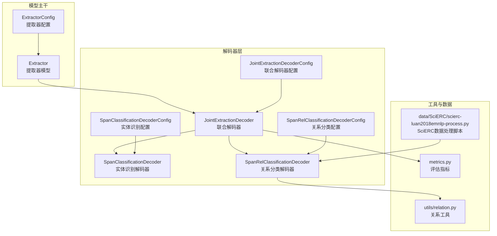
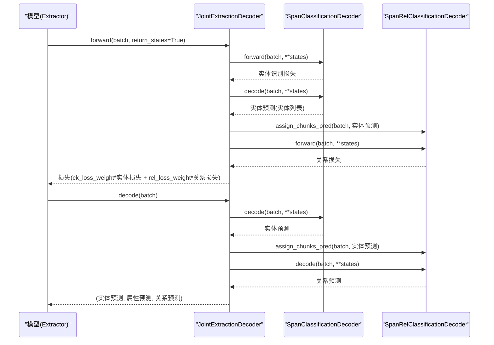
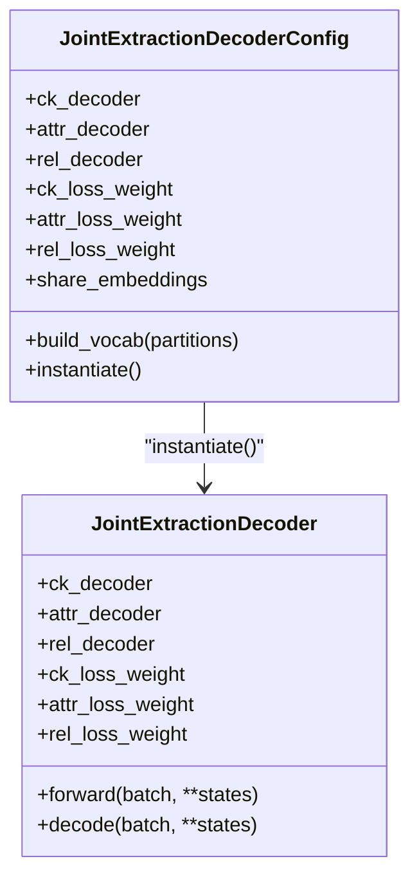
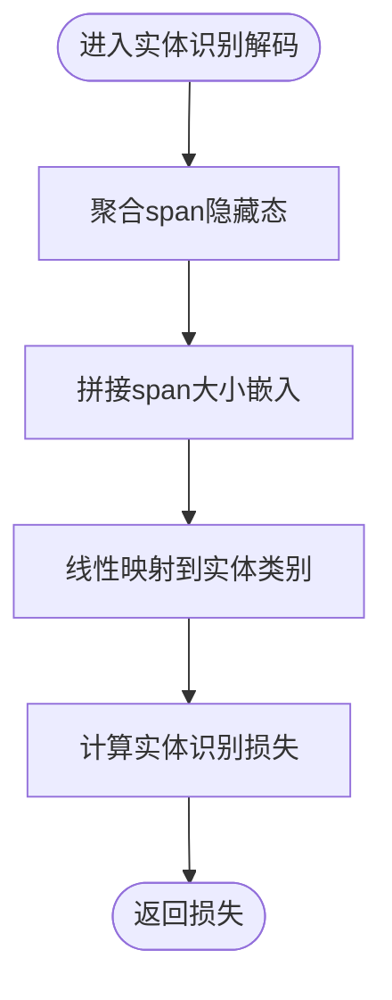
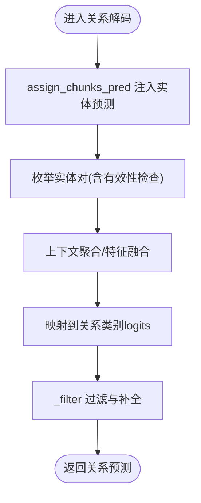
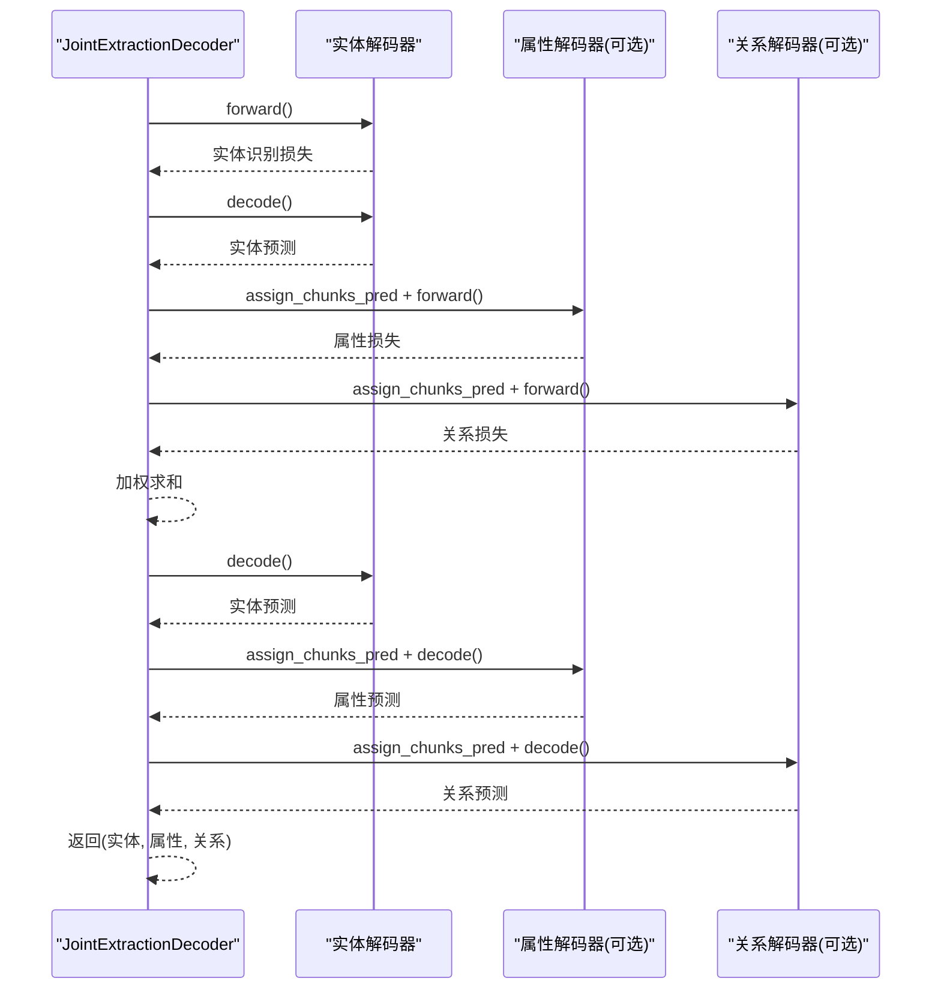
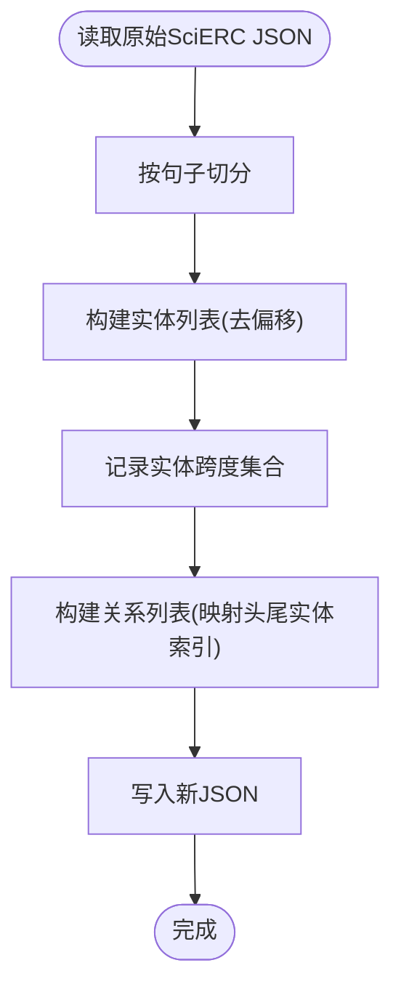
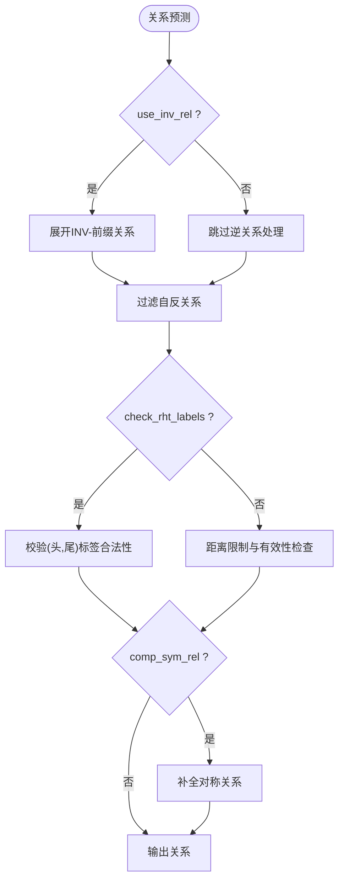
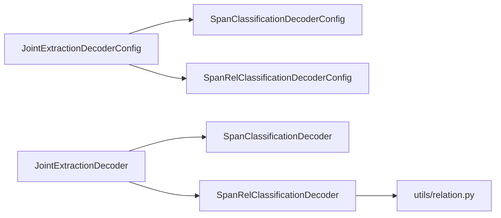

# 联合抽取模式

<cite>
**本文引用的文件**
- [joint_extraction.py](file://eznlp/model/decoder/joint_extraction.py)
- [span_rel_classification.py](file://eznlp/model/decoder/span_rel_classification.py)
- [span_classification.py](file://eznlp/model/decoder/span_classification.py)
- [relation.py](file://eznlp/utils/relation.py)
- [scierc-luan2018emnlp-process.py](file://data/SciERC/scierc-luan2018emnlp-process.py)
- [test_joint_extraction.py](file://tests/model/test_joint_extraction.py)
- [extractor.py](file://eznlp/model/model/extractor.py)
- [specific_span_extractor.py](file://eznlp/model/model/specific_span_extractor.py)
- [metrics.py](file://eznlp/metrics.py)
- [exp_launcher.py](file://scripts/exp_launcher.py)
- [options.py](file://eznlp/training/options.py)
</cite>

## 目录
1. [简介](#简介)
2. [项目结构](#项目结构)
3. [核心组件](#核心组件)
4. [架构总览](#架构总览)
5. [详细组件分析](#详细组件分析)
6. [依赖关系分析](#依赖关系分析)
7. [性能考量](#性能考量)
8. [故障排查指南](#故障排查指南)
9. [结论](#结论)
10. [附录：在Conll-2004上的完整配置示例](#附录在conll-2004上的完整配置示例)

## 简介
本文件系统性解析eznlp中基于JointExtractionDecoderConfig的联合抽取架构，重点说明：
- 如何通过共享编码器实现实体识别与关系分类的协同训练；
- JointExtractionDecoder的forward方法中多任务损失加权机制（ck_loss_weight、rel_loss_weight）；
- decode方法中实体预测结果向关系解码器的传递流程；
- 结合SciERC数据集处理脚本（scierc-luan2018emnlp-process.py）说明实体-关系联合标注格式的构建方式；
- 展示如何通过SpanRelClassificationDecoderConfig配置对称关系（sym_rel_labels）和逆关系（use_inv_rel）处理；
- 提供在Conll-2004数据集上的完整配置示例，涵盖预训练模型集成、优化器选择及评估指标计算。

## 项目结构
eznlp采用模块化设计，联合抽取由“解码器配置”和“具体解码器实现”两部分组成，并与模型主干（如Extractor）配合完成端到端训练与推理。

图表来源
- [joint_extraction.py](file://eznlp/model/decoder/joint_extraction.py#L68-L193)
- [span_rel_classification.py](file://eznlp/model/decoder/span_rel_classification.py#L156-L585)
- [span_classification.py](file://eznlp/model/decoder/span_classification.py#L27-L344)
- [relation.py](file://eznlp/utils/relation.py#L1-L31)
- [scierc-luan2018emnlp-process.py](file://data/SciERC/scierc-luan2018emnlp-process.py#L1-L42)
- [metrics.py](file://eznlp/metrics.py#L1-L153)

章节来源
- [joint_extraction.py](file://eznlp/model/decoder/joint_extraction.py#L68-L193)
- [span_rel_classification.py](file://eznlp/model/decoder/span_rel_classification.py#L156-L585)
- [span_classification.py](file://eznlp/model/decoder/span_classification.py#L27-L344)
- [relation.py](file://eznlp/utils/relation.py#L1-L31)
- [scierc-luan2018emnlp-process.py](file://data/SciERC/scierc-luan2018emnlp-process.py#L1-L42)
- [metrics.py](file://eznlp/metrics.py#L1-L153)

## 核心组件
- JointExtractionDecoderConfig：组合多个单任务解码器（实体识别、属性、关系），并支持多任务损失加权与共享嵌入开关。
- JointExtractionDecoder：在forward中按顺序执行实体识别、属性（可选）、关系（可选），并通过assign_chunks_pred将实体预测结果传递给后续任务；decode同理返回三元组预测。
- SpanClassificationDecoderConfig/Decoder：实体识别（边界平滑、负采样等策略）。
- SpanRelClassificationDecoderConfig/Decoder：关系分类（上下文融合、对称关系补全、逆关系处理、过滤等）。
- 关系工具：对称关系补全、逆关系前缀处理等。

章节来源
- [joint_extraction.py](file://eznlp/model/decoder/joint_extraction.py#L68-L193)
- [span_classification.py](file://eznlp/model/decoder/span_classification.py#L27-L344)
- [span_rel_classification.py](file://eznlp/model/decoder/span_rel_classification.py#L156-L585)
- [relation.py](file://eznlp/utils/relation.py#L1-L31)

## 架构总览
联合抽取的训练与推理流程如下：

图表来源
- [joint_extraction.py](file://eznlp/model/decoder/joint_extraction.py#L154-L193)
- [span_classification.py](file://eznlp/model/decoder/span_classification.py#L264-L344)
- [span_rel_classification.py](file://eznlp/model/decoder/span_rel_classification.py#L537-L585)

## 详细组件分析

### 组件A：JointExtractionDecoderConfig 与 JointExtractionDecoder
- 支持三种子解码器类型：序列标注、span分类、边界选择、特定span分类等；关系解码器支持span关系分类、特定span关系分类、未过滤特定span关系分类。
- 多任务损失加权：通过ck_loss_weight、attr_loss_weight、rel_loss_weight控制各任务损失权重。
- 共享嵌入：share_embeddings为False（默认），避免跨模块权重共享带来的复杂度。
- 组合验证：至少包含两个解码器且每个子解码器有效才视为有效。

图表来源
- [joint_extraction.py](file://eznlp/model/decoder/joint_extraction.py#L68-L193)

章节来源
- [joint_extraction.py](file://eznlp/model/decoder/joint_extraction.py#L68-L193)

### 组件B：实体识别解码器（SpanClassification）
- 通过聚合隐藏态生成span级别的表示，结合大小嵌入与dropout，输出实体标签logits。
- 支持边界平滑、负采样、嵌套样本的mKMMD辅助损失等策略。
- decode阶段根据置信度阈值或多标签阈值筛选实体。

图表来源
- [span_classification.py](file://eznlp/model/decoder/span_classification.py#L163-L344)

章节来源
- [span_classification.py](file://eznlp/model/decoder/span_classification.py#L27-L344)

### 组件C：关系分类解码器（SpanRelClassification）
- 以实体对（head, tail）为单位进行建模，支持上下文聚合、拼接/仿射融合、对称关系补全、逆关系处理等。
- assign_chunks_pred用于将实体识别阶段的预测结果注入关系解码器，确保关系解码仅考虑实体对。
- _filter阶段处理逆关系展开、自反关系过滤、关系头尾标签检查、对称关系补全等。

图表来源
- [span_rel_classification.py](file://eznlp/model/decoder/span_rel_classification.py#L319-L585)
- [relation.py](file://eznlp/utils/relation.py#L1-L31)

章节来源
- [span_rel_classification.py](file://eznlp/model/decoder/span_rel_classification.py#L156-L585)
- [relation.py](file://eznlp/utils/relation.py#L1-L31)

### 组件D：联合抽取的损失与预测传递
- forward：先计算实体识别损失并乘以ck_loss_weight；再调用实体识别的decode得到实体预测；将实体预测传给属性（可选）与关系（可选）解码器，并分别乘以对应权重累加。
- decode：先做实体识别decode，再依次将实体预测传给属性与关系解码器，最终返回三元组预测。

图表来源
- [joint_extraction.py](file://eznlp/model/decoder/joint_extraction.py#L154-L193)
- [span_rel_classification.py](file://eznlp/model/decoder/span_rel_classification.py#L406-L417)

章节来源
- [joint_extraction.py](file://eznlp/model/decoder/joint_extraction.py#L154-L193)
- [span_rel_classification.py](file://eznlp/model/decoder/span_rel_classification.py#L406-L417)

### 组件E：SciERC数据集标注格式构建
- 将原始SciERC按句子切分，逐句构造实体列表与关系列表；
- 实体字段包含起止位置与类型；
- 关系字段包含类型与头尾实体在当前句子中的索引（基于实体跨度映射）。

图表来源
- [scierc-luan2018emnlp-process.py](file://data/SciERC/scierc-luan2018emnlp-process.py#L1-L42)

章节来源
- [scierc-luan2018emnlp-process.py](file://data/SciERC/scierc-luan2018emnlp-process.py#L1-L42)

### 组件F：对称关系与逆关系配置
- 对称关系（sym_rel_labels）：指定哪些关系类型应自动补全其逆向对称边；
- 逆关系（use_inv_rel）：是否允许使用逆关系标签（如INV-前缀），并在过滤阶段将逆关系展开为正向关系；
- 过滤逻辑：先处理逆关系，再过滤自反关系、头尾标签合法性、距离限制等。

图表来源
- [span_rel_classification.py](file://eznlp/model/decoder/span_rel_classification.py#L90-L126)
- [relation.py](file://eznlp/utils/relation.py#L1-L31)

章节来源
- [span_rel_classification.py](file://eznlp/model/decoder/span_rel_classification.py#L90-L126)
- [relation.py](file://eznlp/utils/relation.py#L1-L31)

## 依赖关系分析
- JointExtractionDecoderConfig依赖于多个单任务解码器配置类（实体识别、属性、关系）；
- JointExtractionDecoder在forward/decode中对各子解码器进行顺序调用，并通过assign_chunks_pred实现实体预测的跨任务传递；
- SpanRelClassificationDecoder在build_vocab阶段统计实体标签、关系标签、最大跨度与距离分布，并在decode阶段应用过滤策略；
- 关系工具提供对称关系补全与逆关系检测。

图表来源
- [joint_extraction.py](file://eznlp/model/decoder/joint_extraction.py#L68-L193)
- [span_rel_classification.py](file://eznlp/model/decoder/span_rel_classification.py#L156-L585)
- [relation.py](file://eznlp/utils/relation.py#L1-L31)

章节来源
- [joint_extraction.py](file://eznlp/model/decoder/joint_extraction.py#L68-L193)
- [span_rel_classification.py](file://eznlp/model/decoder/span_rel_classification.py#L156-L585)
- [relation.py](file://eznlp/utils/relation.py#L1-L31)

## 性能考量
- 训练稳定性：通过ck_loss_weight、rel_loss_weight平衡实体与关系任务的贡献，避免某一任务主导梯度更新。
- 计算效率：JointExtractionDecoder在forward/decode中复用states，减少重复计算；assign_chunks_pred仅在需要时构建实体对上下文。
- 过滤策略：合理设置max_cp_dist、existing_self_rel、check_rht_labels等参数，可显著降低无效实体对数量，提升推理速度。
- 数据规模：对称关系补全与逆关系展开会增加关系候选数，建议在大规模数据上谨慎启用。

## 故障排查指南
- 训练不收敛或关系指标异常低：检查ck_loss_weight与rel_loss_weight比例是否合适；确认实体识别decode是否正确传递给关系解码器。
- 逆关系与对称关系未生效：确认use_inv_rel与comp_sym_rel配置；检查sym_rel_labels是否覆盖目标关系类型。
- 过拟合：适当提高in_drop_rates、hid_drop_rates；或启用负采样与嵌套样本的mKMMD辅助损失（实体解码器）。
- 评估指标：使用precision_recall_f1_report进行宏平均与微平均评估，关注micro-f1作为主要指标。

章节来源
- [metrics.py](file://eznlp/metrics.py#L1-L153)
- [span_rel_classification.py](file://eznlp/model/decoder/span_rel_classification.py#L90-L126)
- [span_classification.py](file://eznlp/model/decoder/span_classification.py#L27-L344)

## 结论
eznlp的联合抽取模式通过JointExtractionDecoderConfig与JointExtractionDecoder实现了实体识别与关系分类的协同训练与推理。其核心优势在于：
- 共享编码器与统一状态传递，避免重复计算；
- 多任务损失加权灵活可控；
- 关系解码器内置逆关系与对称关系处理，便于构建更完整的知识图谱；
- 配套的数据处理脚本与测试用例为不同数据集提供了可复用的标注格式与配置参考。

## 附录：在Conll-2004上的完整配置示例
以下示例展示如何在Conll-2004上使用JointExtractionDecoder进行训练与评估，涵盖预训练模型集成、优化器选择与评估指标计算。

- 预训练模型集成
  - 使用BERT/RoBERTa等预训练语言模型，开启output_hidden_states以便抽取span表示；
  - 可选中间层（intermediate2）与SpanBERT-like模块增强span表征。

- 解码器配置
  - 实体识别：SpanClassificationDecoderConfig（支持边界平滑、负采样、嵌套样本mKMMD等）；
  - 关系分类：SpanRelClassificationDecoderConfig（支持上下文聚合、拼接/仿射融合、对称关系补全、逆关系处理）；
  - 联合抽取：JointExtractionDecoderConfig（设置ck_loss_weight、rel_loss_weight等）。

- 优化器与学习率
  - 建议使用AdamW优化器，学习率lr在1e-3~2e-3范围内，微调学习率finetune_lr在1e-5~2e-5范围内；
  - 批大小batch_size可根据显存调整，通常在48左右。

- 评估指标
  - 使用precision_recall_f1_report计算宏平均与微平均F1分数；
  - 在实体识别与关系分类任务上分别评估，联合抽取返回三元组预测后可分别计算各自指标。

- 示例流程（概念性）
  - 数据预处理：将Conll-2004标注转换为内部格式（实体列表、关系列表）；
  - 模型构建：ExtractorConfig + JointExtractionDecoderConfig；
  - 训练：设置优化器与学习率，循环迭代；
  - 推理：trainer.predict返回(实体预测, 属性预测, 关系预测)，使用metrics计算指标。

章节来源
- [test_joint_extraction.py](file://tests/model/test_joint_extraction.py#L92-L121)
- [exp_launcher.py](file://scripts/exp_launcher.py#L161-L184)
- [options.py](file://eznlp/training/options.py#L1-L99)
- [metrics.py](file://eznlp/metrics.py#L1-L153)
- [extractor.py](file://eznlp/model/model/extractor.py#L77-L91)
- [specific_span_extractor.py](file://eznlp/model/model/specific_span_extractor.py#L20-L55)