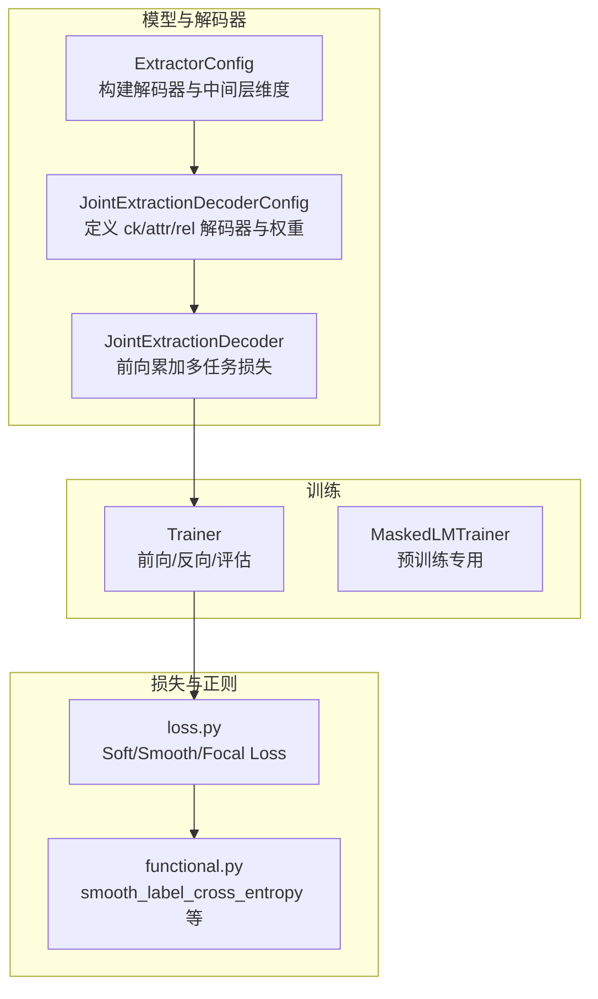
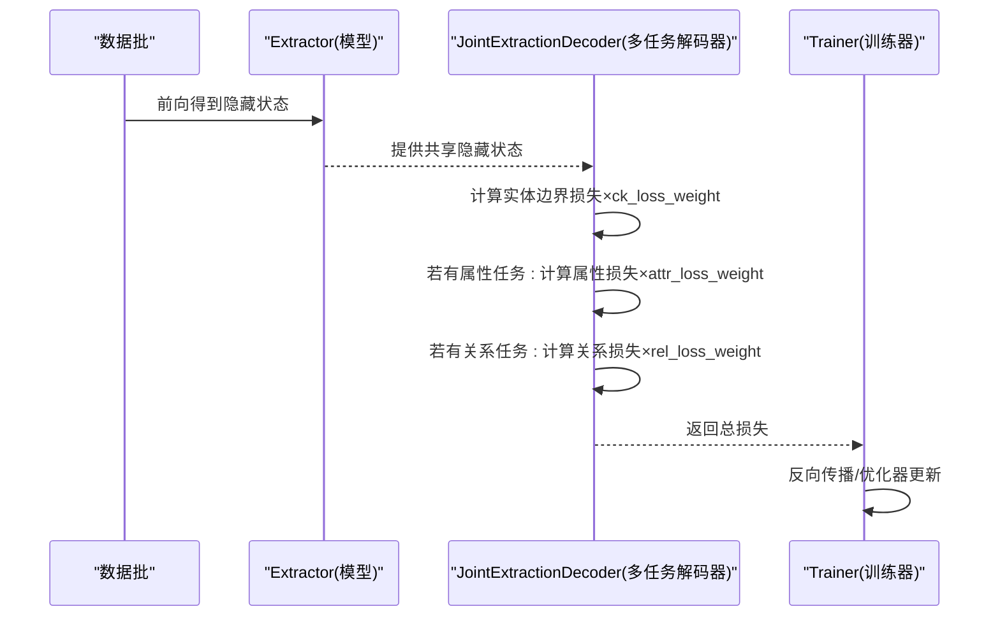
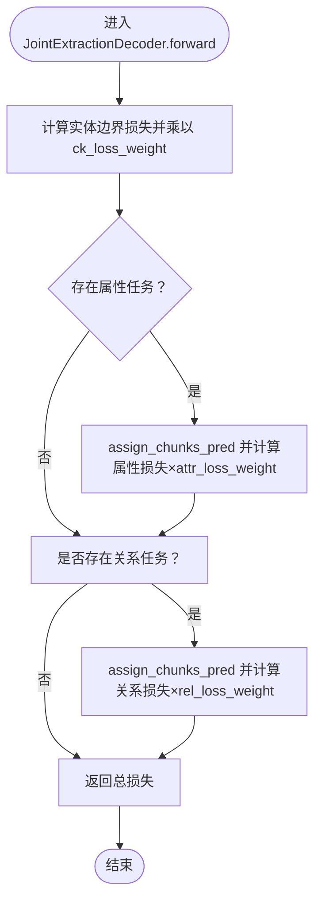
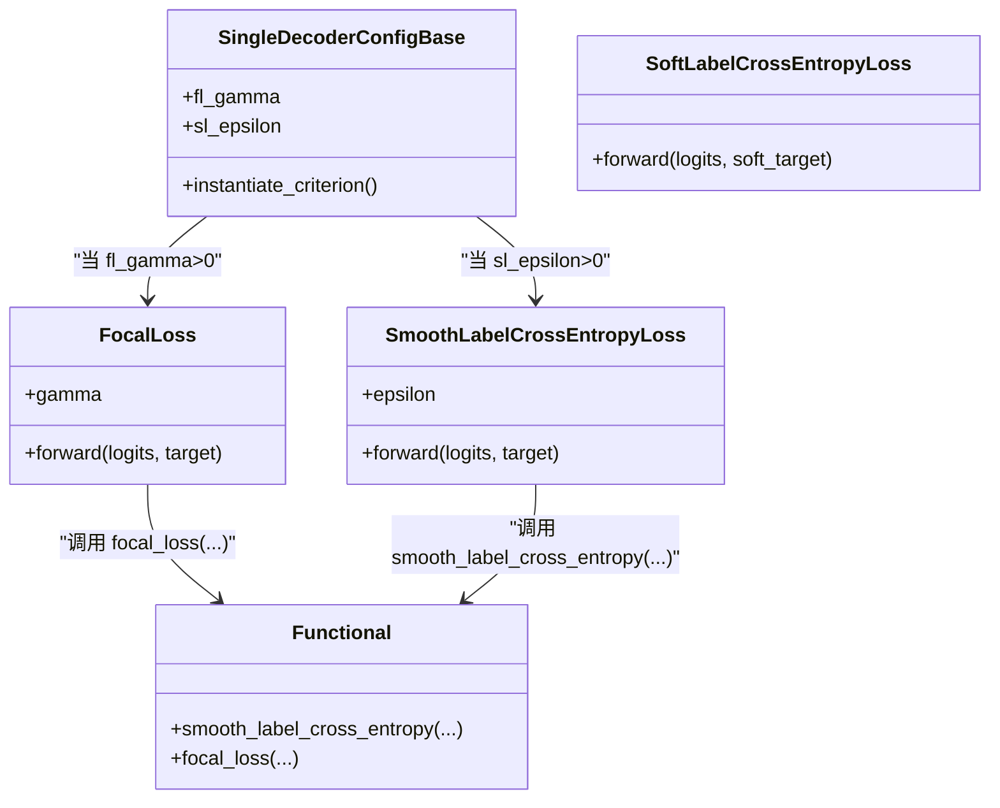
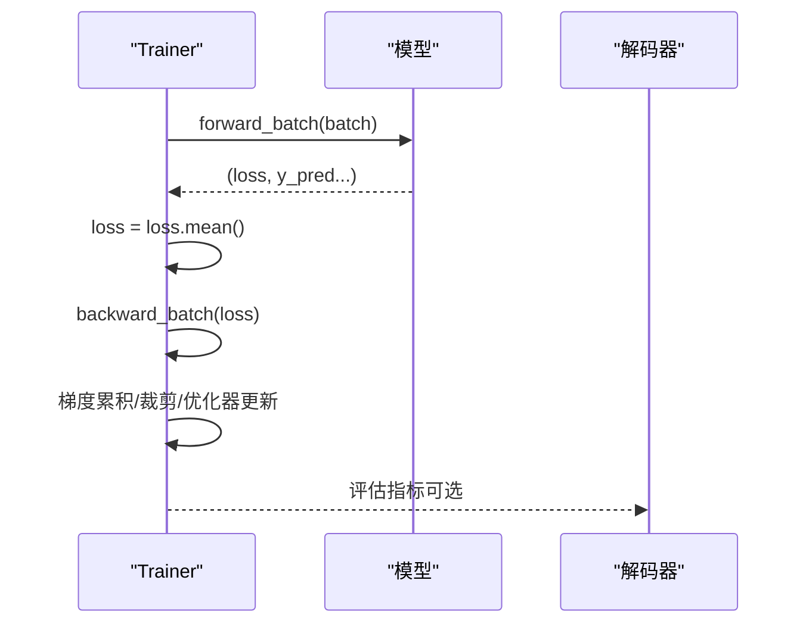
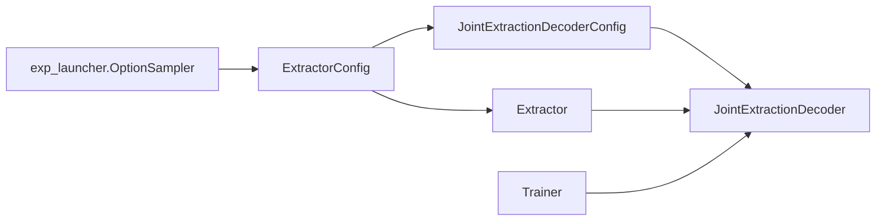

# 多任务损失权重配置

<cite>
**本文引用的文件列表**
- [joint_extraction.py](file://eznlp/model/decoder/joint_extraction.py)
- [base.py](file://eznlp/model/decoder/base.py)
- [loss.py](file://eznlp/nn/modules/loss.py)
- [functional.py](file://eznlp/nn/functional.py)
- [trainer.py](file://eznlp/training/trainer.py)
- [plm_trainer.py](file://eznlp/training/plm_trainer.py)
- [extractor.py](file://eznlp/model/model/extractor.py)
- [exp_launcher.py](file://scripts/exp_launcher.py)
- [test_joint_extraction.py](file://tests/model/test_joint_extraction.py)
- [test_specific_span_rel_classification.py](file://tests/model/test_specific_span_rel_classification.py)
</cite>

## 目录
1. [引言](#引言)
2. [项目结构与定位](#项目结构与定位)
3. [核心组件：联合抽取解码器与损失权重](#核心组件联合抽取解码器与损失权重)
4. [体系结构概览](#体系结构概览)
5. [详细组件分析](#详细组件分析)
6. [依赖关系分析](#依赖关系分析)
7. [性能与收敛特性](#性能与收敛特性)
8. [在标注稀疏场景下的权重调优策略](#在标注稀疏场景下的权重调优策略)
9. [共享嵌入层（share_embeddings）的特征迁移与风险](#共享嵌入层share_embeddings的特征迁移与风险)
10. [故障排查与常见问题](#故障排查与常见问题)
11. [结论](#结论)

## 引言
本文件围绕联合抽取中的多任务损失权重配置机制展开，重点解释 ck_loss_weight、attr_loss_weight 和 rel_loss_weight 三类权重如何在训练过程中动态平衡不同任务的贡献，并影响各子任务的收敛速度。同时结合标注稀疏场景，给出基于验证集性能曲线的权重调优方法，并讨论共享嵌入层（share_embeddings）对多任务特征迁移的促进作用与潜在风险。

## 项目结构与定位
- 联合抽取解码器位于模型解码器模块中，负责将共享编码器的隐藏状态映射到实体边界识别、属性分类与关系分类等多任务输出，并在前向时按权重累加各任务损失。
- 训练器统一处理前向、反向传播、梯度累积与优化器更新，确保多任务损失能正确反传至共享参数。
- 损失函数模块提供交叉熵、标签平滑、Focal Loss 等通用损失实现，支持权重与忽略索引等参数化配置。
- 配置系统贯穿于模型、解码器与训练选项，便于实验化地探索不同权重组合与正则化策略。

图表来源
- [extractor.py](file://eznlp/model/model/extractor.py#L23-L121)
- [joint_extraction.py](file://eznlp/model/decoder/joint_extraction.py#L68-L193)
- [trainer.py](file://eznlp/training/trainer.py#L64-L124)
- [plm_trainer.py](file://eznlp/training/plm_trainer.py#L11-L34)
- [loss.py](file://eznlp/nn/modules/loss.py#L11-L89)
- [functional.py](file://eznlp/nn/functional.py#L198-L314)

章节来源
- [extractor.py](file://eznlp/model/model/extractor.py#L23-L121)
- [joint_extraction.py](file://eznlp/model/decoder/joint_extraction.py#L68-L193)
- [trainer.py](file://eznlp/training/trainer.py#L64-L124)
- [loss.py](file://eznlp/nn/modules/loss.py#L11-L89)
- [functional.py](file://eznlp/nn/functional.py#L198-L314)

## 核心组件：联合抽取解码器与损失权重
- JointExtractionDecoderConfig 在初始化时从 kwargs 中弹出 ck_loss_weight、attr_loss_weight、rel_loss_weight 作为各任务的损失权重，并设置 share_embeddings 标志位。
- JointExtractionDecoder 在 forward 中依次计算各任务损失，乘以其对应权重后累加，形成总损失；随后根据是否启用属性或关系解码器，分别进行 assign_chunks_pred 与累加损失。
- 单任务解码器配置（SingleDecoderConfigBase）支持 fl_gamma（Focal Loss gamma）与 sl_epsilon（标签平滑 epsilon），这些参数会影响单任务损失的形态与数值尺度，间接影响多任务权重的相对重要性。

章节来源
- [joint_extraction.py](file://eznlp/model/decoder/joint_extraction.py#L91-L109)
- [joint_extraction.py](file://eznlp/model/decoder/joint_extraction.py#L154-L193)
- [base.py](file://eznlp/model/decoder/base.py#L52-L88)

## 体系结构概览
联合抽取训练流程的关键节点如下：
- 数据批经模型前向得到共享隐藏表示；
- 解码器将隐藏映射为多任务输出；
- 各任务损失按权重累加为总损失；
- 训练器执行反向传播与优化器更新；
- 可选地，使用标签平滑或 Focal Loss 改善类别不平衡与难易样本的训练稳定性。

图表来源
- [joint_extraction.py](file://eznlp/model/decoder/joint_extraction.py#L154-L193)
- [trainer.py](file://eznlp/training/trainer.py#L64-L124)

## 详细组件分析

### 组件A：联合抽取解码器（权重累加与任务分配）
- 关键点
  - ck_loss_weight、attr_loss_weight、rel_loss_weight 分别控制实体边界、属性与关系任务在总损失中的占比。
  - assign_chunks_pred 将实体边界预测结果传递给属性与关系子解码器，保证三者共享同一实体边界表示。
  - 解码器数量决定指标个数（num_metrics），用于训练/验证阶段的多指标评估。

图表来源
- [joint_extraction.py](file://eznlp/model/decoder/joint_extraction.py#L154-L193)

章节来源
- [joint_extraction.py](file://eznlp/model/decoder/joint_extraction.py#L154-L193)

### 组件B：损失函数与正则化（标签平滑与 Focal Loss）
- SoftLabelCrossEntropyLoss、SmoothLabelCrossEntropyLoss、FocalLoss 提供软标签、标签平滑与焦点损失的实现，支持权重与忽略索引。
- functional.py 中的 smooth_label_cross_entropy 与 focal_loss 定义了具体的损失计算逻辑，包括样本权重与归约方式。
- SingleDecoderConfigBase 的 instantiate_criterion 会根据 fl_gamma 与 sl_epsilon 自动选择合适的损失类型，从而影响单任务损失的尺度与分布。

图表来源
- [base.py](file://eznlp/model/decoder/base.py#L52-L88)
- [loss.py](file://eznlp/nn/modules/loss.py#L11-L89)
- [functional.py](file://eznlp/nn/functional.py#L198-L314)

章节来源
- [loss.py](file://eznlp/nn/modules/loss.py#L11-L89)
- [functional.py](file://eznlp/nn/functional.py#L198-L314)
- [base.py](file://eznlp/model/decoder/base.py#L52-L88)

### 组件C：训练器与梯度更新（多任务损失的反传）
- Trainer.forward_batch 接收模型返回的损失张量，若 num_metrics>0 则同时返回预测以进行指标评估。
- Trainer.backward_batch 对损失进行平均（考虑梯度累积步数），并在满足条件时执行梯度裁剪与优化器更新。
- MaskedLMTrainer 展示了预训练场景下的前向封装，强调损失张量的均值化处理。

图表来源
- [trainer.py](file://eznlp/training/trainer.py#L64-L124)
- [plm_trainer.py](file://eznlp/training/plm_trainer.py#L11-L34)

章节来源
- [trainer.py](file://eznlp/training/trainer.py#L64-L124)
- [plm_trainer.py](file://eznlp/training/plm_trainer.py#L11-L34)

## 依赖关系分析
- 解码器配置与实例化
  - ExtractorConfig.build_vocabs_and_dims 会设置 decoder 的 in_dim，并在 instantiate 时创建 Extractor 实例。
  - JointExtractionDecoderConfig 在 instantiate 时创建 JointExtractionDecoder，并将 ck/attr/rel 解码器实例化。
- 训练与评估
  - Trainer.eval_epoch/train_epoch 会调用解码器的 retrieve/decode 与 evaluate，以多指标评估各任务表现。
- 实验与选项采样
  - scripts/exp_launcher.py 使用 OptionSampler 生成超参组合，便于批量实验不同权重与正则化策略。

图表来源
- [extractor.py](file://eznlp/model/model/extractor.py#L122-L148)
- [joint_extraction.py](file://eznlp/model/decoder/joint_extraction.py#L146-L151)
- [trainer.py](file://eznlp/training/trainer.py#L191-L219)
- [exp_launcher.py](file://scripts/exp_launcher.py#L186-L215)

章节来源
- [extractor.py](file://eznlp/model/model/extractor.py#L122-L148)
- [joint_extraction.py](file://eznlp/model/decoder/joint_extraction.py#L146-L151)
- [trainer.py](file://eznlp/training/trainer.py#L191-L219)
- [exp_launcher.py](file://scripts/exp_launcher.py#L186-L215)

## 性能与收敛特性
- 权重对收敛速度的影响
  - 当某任务损失权重过大时，其梯度主导总梯度方向，导致该任务快速收敛而其他任务收敛较慢，可能造成“任务竞争”或“次优平衡”。
  - 当某任务权重过小，其损失信号被抑制，可能导致该任务难以学习，甚至停滞。
- 单任务正则化对收敛的影响
  - 标签平滑（sl_epsilon）与 Focal Loss（fl_gamma）会改变损失曲面的陡峭程度与梯度分布，从而影响收敛速度与泛化能力。
- 训练稳定性
  - Trainer 支持梯度裁剪与混合精度，有助于在多任务场景下稳定训练。

章节来源
- [trainer.py](file://eznlp/training/trainer.py#L82-L124)
- [base.py](file://eznlp/model/decoder/base.py#L52-L88)

## 在标注稀疏场景下的权重调优策略
- 场景背景
  - 属性/关系标注通常比实体边界标注更稀疏，直接使用默认权重可能导致属性/关系任务难以收敛。
- 调优步骤
  1) 固定实体边界权重（如 ck_loss_weight=1.0），对 attr_loss_weight 与 rel_loss_weight 进行网格/均匀采样。
  2) 使用验证集监控各任务指标（如实体边界 F1、属性 F1、关系 F1）与总损失。
  3) 观察验证集性能曲线，寻找使各任务指标相对均衡且总损失稳定的权重组合。
- 实验支持
  - 测试用例展示了在特定场景下对 ck_loss_weight 的敏感性测试，可借鉴此思路扩展到 attr_loss_weight 与 rel_loss_weight 的系统性搜索。

章节来源
- [test_specific_span_rel_classification.py](file://tests/model/test_specific_span_rel_classification.py#L69-L102)
- [exp_launcher.py](file://scripts/exp_launcher.py#L186-L215)

## 共享嵌入层（share_embeddings）的特征迁移与风险
- 作用
  - share_embeddings 标志位允许在多任务场景下共享嵌入层，促进跨任务的表征迁移，提升属性/关系任务在标注稀疏时的泛化能力。
- 风险
  - 过度共享可能导致任务间相互干扰，降低任务特化能力；在任务差异较大时，可能引入负迁移。
- 建议
  - 在属性/关系标注稀疏时适度启用共享嵌入，但需结合验证集性能曲线进行权衡；若发现某任务显著退化，可尝试关闭共享或降低共享程度。

章节来源
- [joint_extraction.py](file://eznlp/model/decoder/joint_extraction.py#L91-L109)

## 故障排查与常见问题
- 症状：某任务指标长期不提升
  - 可能原因：该任务权重过低或正则化过强（高 sl_epsilon 或高 fl_gamma）。
  - 处理建议：提高该任务权重，或降低正则化强度；检查数据批中该任务样本比例。
- 症状：总损失震荡或发散
  - 可能原因：梯度未裁剪、学习率过高、权重过大导致梯度爆炸。
  - 处理建议：开启梯度裁剪、降低学习率或权重；检查各任务损失尺度是否严重不一致。
- 症状：属性/关系任务明显落后
  - 可能原因：标注稀疏、权重不足、共享嵌入层导致任务特化不足。
  - 处理建议：增加属性/关系权重；适度启用共享嵌入；采用标签平滑或 Focal Loss 改善类别不平衡。

章节来源
- [trainer.py](file://eznlp/training/trainer.py#L82-L124)
- [base.py](file://eznlp/model/decoder/base.py#L52-L88)

## 结论
- ck_loss_weight、attr_loss_weight、rel_loss_weight 是多任务联合抽取训练中的关键动态平衡参数。它们直接影响各任务损失在总损失中的占比，进而影响梯度方向与收敛速度。
- 在标注稀疏场景下，应优先保障属性/关系任务的最小权重，结合验证集性能曲线进行系统性搜索，找到使各任务指标相对均衡的权重组合。
- 共享嵌入层（share_embeddings）可促进特征迁移，缓解稀疏标注带来的过拟合风险，但需警惕任务间的负迁移，应以验证集表现为准绳进行取舍。