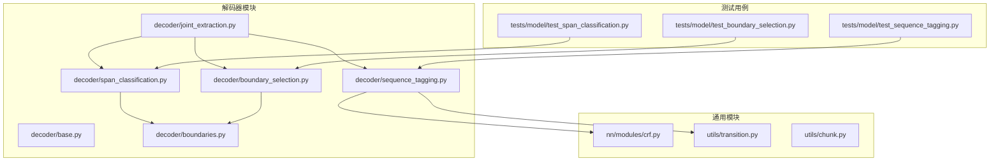
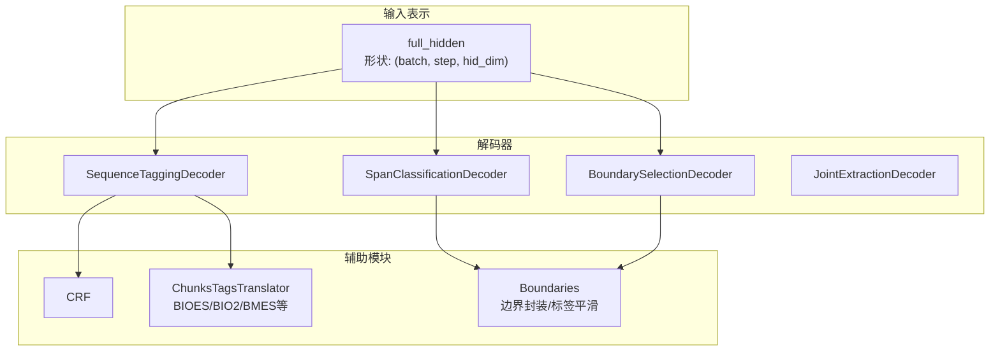
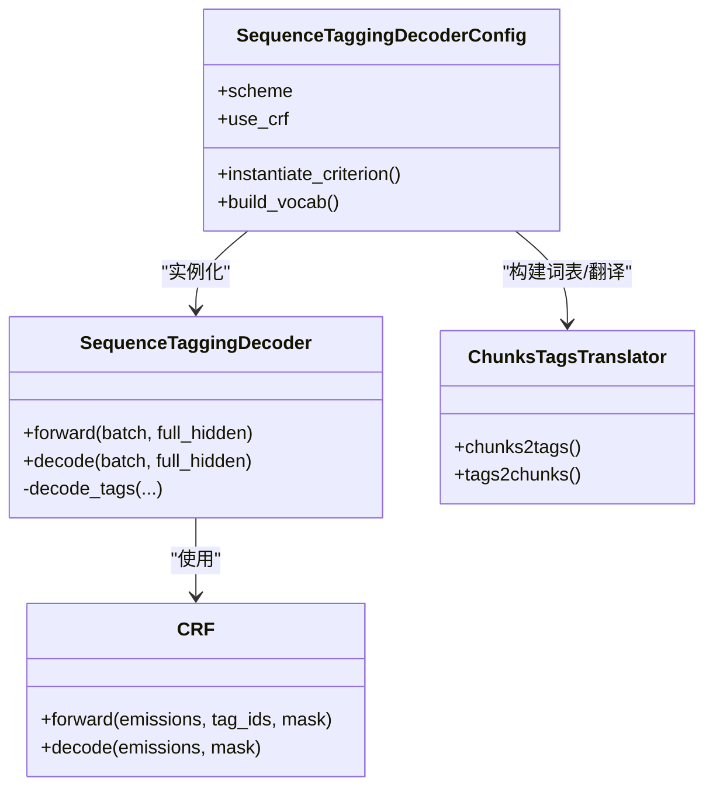
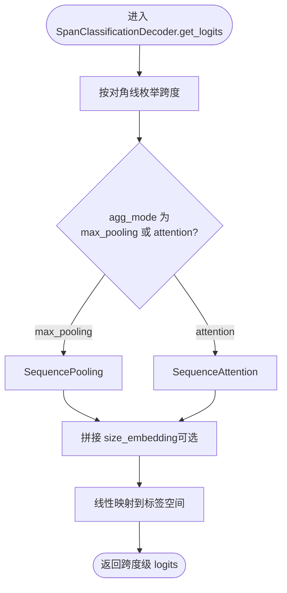
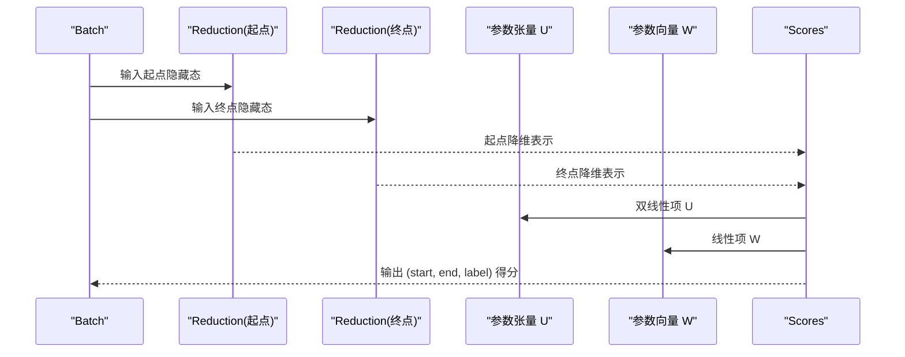
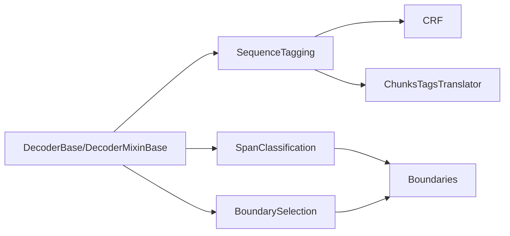

# 实体识别解码器配置

<cite>
**本文引用的文件**
- [decoder/__init__.py](file://eznlp/model/decoder/__init__.py)
- [decoder/base.py](file://eznlp/model/decoder/base.py)
- [decoder/sequence_tagging.py](file://eznlp/model/decoder/sequence_tagging.py)
- [decoder/span_classification.py](file://eznlp/model/decoder/span_classification.py)
- [decoder/boundary_selection.py](file://eznlp/model/decoder/boundary_selection.py)
- [decoder/boundaries.py](file://eznlp/model/decoder/boundaries.py)
- [nn/modules/crf.py](file://eznlp/nn/modules/crf.py)
- [utils/transition.py](file://eznlp/utils/transition.py)
- [utils/chunk.py](file://eznlp/utils/chunk.py)
- [model/decoder/joint_extraction.py](file://eznlp/model/decoder/joint_extraction.py)
- [tests/model/test_span_classification.py](file://tests/model/test_span_classification.py)
- [tests/model/test_boundary_selection.py](file://tests/model/test_boundary_selection.py)
- [tests/model/test_sequence_tagging.py](file://tests/model/test_sequence_tagging.py)
</cite>

## 目录
1. [引言](#引言)
2. [项目结构](#项目结构)
3. [核心组件](#核心组件)
4. [架构总览](#架构总览)
5. [详细组件分析](#详细组件分析)
6. [依赖分析](#依赖分析)
7. [性能考量](#性能考量)
8. [故障排查指南](#故障排查指南)
9. [结论](#结论)
10. [附录](#附录)

## 引言
本文件围绕实体识别解码器的配置进行深入解析，重点覆盖以下主题：
- sequence_tagging、span_classification、boundary_selection 三类解码器的实现差异与适用场景
- BIOES 与 BIO2 标注体系对序列标注性能的影响
- CRF 层在序列标注中的作用机制
- Span 分类方法中“最大池化”与“注意力聚合”的特征提取差异
- 边界选择架构中维度约减网络（red_arch）对长距离依赖建模的优化原理
- 不同场景下的配置参数调优建议，特别是中文 NER 任务中最大跨度尺寸（max_span_size）的合理设置范围

## 项目结构
该仓库采用按功能域分层的组织方式：模型解码器位于 eznlp/model/decoder 下，核心模块包括基础抽象、序列标注、Span 分类、边界选择等；CRF 模块位于 eznlp/nn/modules；标签体系转换工具位于 eznlp/utils；边界采样与标签平滑逻辑位于 eznlp/model/decoder/boundaries.py；联合抽取配置位于 eznlp/model/decoder/joint_extraction.py。

图表来源
- [decoder/base.py](file://eznlp/model/decoder/base.py#L1-L114)
- [decoder/sequence_tagging.py](file://eznlp/model/decoder/sequence_tagging.py#L1-L198)
- [decoder/span_classification.py](file://eznlp/model/decoder/span_classification.py#L1-L344)
- [decoder/boundary_selection.py](file://eznlp/model/decoder/boundary_selection.py#L1-L384)
- [decoder/boundaries.py](file://eznlp/model/decoder/boundaries.py#L1-L353)
- [nn/modules/crf.py](file://eznlp/nn/modules/crf.py#L1-L204)
- [utils/transition.py](file://eznlp/utils/transition.py#L1-L267)
- [utils/chunk.py](file://eznlp/utils/chunk.py#L1-L250)
- [model/decoder/joint_extraction.py](file://eznlp/model/decoder/joint_extraction.py#L1-L193)
- [tests/model/test_span_classification.py](file://tests/model/test_span_classification.py#L1-L114)
- [tests/model/test_boundary_selection.py](file://tests/model/test_boundary_selection.py#L1-L126)
- [tests/model/test_sequence_tagging.py](file://tests/model/test_sequence_tagging.py#L1-L213)

章节来源
- [decoder/__init__.py](file://eznlp/model/decoder/__init__.py#L1-L37)

## 核心组件
- 解码器基类与混合基类：定义统一的前向、解码接口、指标评估与损失构造策略。
- 序列标注解码器：支持 BIOES/BIO2 等标注体系，可选 CRF 或交叉熵损失。
- Span 分类解码器：以跨度为中心的分类，支持最大池化或注意力聚合两种特征提取模式，并可引入大小嵌入与边界平滑。
- 边界选择解码器：通过维度约减网络（red_arch）分别对起点与终点隐藏态进行建模，再拼接得分，适合长距离依赖。
- 联合抽取配置：统一管理实体识别与其他任务的权重与共享策略。

章节来源
- [decoder/base.py](file://eznlp/model/decoder/base.py#L1-L114)
- [decoder/sequence_tagging.py](file://eznlp/model/decoder/sequence_tagging.py#L1-L198)
- [decoder/span_classification.py](file://eznlp/model/decoder/span_classification.py#L1-L344)
- [decoder/boundary_selection.py](file://eznlp/model/decoder/boundary_selection.py#L1-L384)
- [decoder/joint_extraction.py](file://eznlp/model/decoder/joint_extraction.py#L1-L193)

## 架构总览
下图展示了三类解码器在整体模型中的位置与交互关系，以及与边界封装、标签平滑、CRF 等模块的关系。

图表来源
- [decoder/sequence_tagging.py](file://eznlp/model/decoder/sequence_tagging.py#L1-L198)
- [decoder/span_classification.py](file://eznlp/model/decoder/span_classification.py#L1-L344)
- [decoder/boundary_selection.py](file://eznlp/model/decoder/boundary_selection.py#L1-L384)
- [decoder/boundaries.py](file://eznlp/model/decoder/boundaries.py#L1-L353)
- [nn/modules/crf.py](file://eznlp/nn/modules/crf.py#L1-L204)
- [utils/transition.py](file://eznlp/utils/transition.py#L1-L267)

## 详细组件分析

### 序列标注解码器（SequenceTagging）
- 标注体系与翻译器
  - 支持 BIOES、BIO2、BMES、BILOU、OntoNotes 等多种标注体系，内部通过 ChunksTagsTranslator 进行双向转换。
  - 在序列标注中，BIOES 将单字实体标记为 S，多字实体以 B-I*-E 结尾，有利于明确边界；BIO2 则以 B-I 组织，更强调连续性。
- CRF 的作用
  - 当 use_crf=True 时，使用 CRF 计算负对数似然损失，并在解码阶段通过维特比算法得到全局最优标签路径；否则使用交叉熵或焦点损失/标签平滑。
- 性能影响
  - 对于长序列与复杂边界，CRF 可提升整体一致性，减少非法转移带来的噪声；但在数据稀疏或标注不一致时，可能过拟合到局部转移偏好。
- 关键配置
  - scheme：标注体系选择（如 BIOES、BIO2）
  - use_crf：是否启用 CRF
  - fl_gamma、sl_epsilon：损失函数变体（焦点损失/标签平滑）
  - in_drop_rates：输入层 dropout 率

图表来源
- [decoder/sequence_tagging.py](file://eznlp/model/decoder/sequence_tagging.py#L1-L198)
- [nn/modules/crf.py](file://eznlp/nn/modules/crf.py#L1-L204)
- [utils/transition.py](file://eznlp/utils/transition.py#L1-L267)

章节来源
- [decoder/sequence_tagging.py](file://eznlp/model/decoder/sequence_tagging.py#L1-L198)
- [nn/modules/crf.py](file://eznlp/nn/modules/crf.py#L1-L204)
- [utils/transition.py](file://eznlp/utils/transition.py#L1-L267)

### Span 分类解码器（SpanClassification）
- 特征提取模式
  - 最大池化：对跨度内的子序列隐藏态取池化，简单高效，适合短跨度与局部上下文。
  - 注意力聚合：对跨度内隐藏态进行注意力加权，能捕获更丰富的上下文交互，适合长跨度与复杂语义。
- 跨度大小建模
  - 通过 size_embedding 与 max_span_size 控制跨度长度分布，避免超长跨度导致的计算爆炸。
- 边界平滑与标签平滑
  - 支持边界平滑（SB）与标签平滑（SL），在训练时对邻近跨度分配概率，缓解标注噪声。
- 关键配置
  - agg_mode：max_pooling 或 multiplicative_attention
  - size_emb_dim：跨度大小嵌入维度
  - max_span_size/max_span_size_ceiling/max_span_size_cov_rate：跨度上限与覆盖率控制
  - neg_sampling_*、nested_sampling_rate：负采样与嵌套采样策略
  - sb_epsilon/sb_size：边界平滑强度与范围
  - multilabel：多标签预测

图表来源
- [decoder/span_classification.py](file://eznlp/model/decoder/span_classification.py#L1-L344)
- [decoder/boundaries.py](file://eznlp/model/decoder/boundaries.py#L1-L353)

章节来源
- [decoder/span_classification.py](file://eznlp/model/decoder/span_classification.py#L1-L344)
- [decoder/boundaries.py](file://eznlp/model/decoder/boundaries.py#L1-L353)

### 边界选择解码器（BoundarySelection）
- 维度约减网络（red_arch）
  - 通过独立的编码器对起点与终点隐藏态进行降维，再通过张量积与拼接计算跨度得分矩阵，从而建模长距离依赖。
  - 支持 FFN/LSTM 等架构作为 reduction，red_arch 决定起点/终点建模能力与计算成本。
- 跨度得分计算
  - 使用双线性变换（U、W 参数）融合起点/终点降维表示与跨度大小嵌入，输出 (start, end, label) 得分。
- 过滤与优先级
  - 提供基于长度或置信度的优先级过滤，以及重叠冲突处理（flat/nested/arbitrary）。
- 关键配置
  - reduction.arch：red_arch（FFN/LSTM 等）
  - size_emb_dim：跨度大小嵌入
  - neg_sampling_*、nested_sampling_rate：采样策略
  - sb_epsilon/sb_size：边界平滑
  - chunk_priority：优先级策略（长度/置信度）

图表来源
- [decoder/boundary_selection.py](file://eznlp/model/decoder/boundary_selection.py#L1-L384)

章节来源
- [decoder/boundary_selection.py](file://eznlp/model/decoder/boundary_selection.py#L1-L384)

### 联合抽取配置（JointExtraction）
- 统一管理多个解码器（实体识别、属性、关系），支持权重叠加与共享嵌入。
- 适用于 pipeline 与 joint 场景，便于在实体识别基础上扩展属性与关系抽取。

章节来源
- [model/decoder/joint_extraction.py](file://eznlp/model/decoder/joint_extraction.py#L1-L193)

## 依赖分析
- 解耦与内聚
  - 解码器基类与 mixin 抽象保证了不同解码器的统一接口与可复用逻辑。
  - Span 与 Boundary 解码器各自封装边界对象（Boundaries），降低上层调用复杂度。
- 外部依赖
  - CRF 模块提供线性链条件随机场的前向与解码实现。
  - 标签转换工具提供多种标注体系之间的互转与合法性检查。
  - 测试用例覆盖三类解码器的关键配置组合，验证可训练性与批一致性。

图表来源
- [decoder/base.py](file://eznlp/model/decoder/base.py#L1-L114)
- [decoder/sequence_tagging.py](file://eznlp/model/decoder/sequence_tagging.py#L1-L198)
- [decoder/span_classification.py](file://eznlp/model/decoder/span_classification.py#L1-L344)
- [decoder/boundary_selection.py](file://eznlp/model/decoder/boundary_selection.py#L1-L384)
- [decoder/boundaries.py](file://eznlp/model/decoder/boundaries.py#L1-L353)
- [nn/modules/crf.py](file://eznlp/nn/modules/crf.py#L1-L204)
- [utils/transition.py](file://eznlp/utils/transition.py#L1-L267)

## 性能考量
- 标注体系选择
  - BIOES 更利于边界清晰的场景，尤其在中文 NER 中能减少跨词边界歧义；BIO2 更强调连续性，适合实体边界模糊的数据。
- CRF 的收益与代价
  - 在标注质量高、边界复杂的数据集上，CRF 显著提升整体一致性；但在小样本或标注噪声较多时需谨慎使用，可结合标签平滑。
- Span 分类的聚合模式
  - 最大池化计算开销低、鲁棒性强；注意力聚合能捕捉长程依赖但计算更昂贵，适合长文本与复杂句法。
- 边界选择的 red_arch
  - FFN 简单快速，LSTM 能捕获序列依赖但更耗时；根据资源与精度需求选择。
- 跨度上限与覆盖率
  - 合理设置 max_span_size 与覆盖率阈值，避免 OOV 正样本与过度裁剪；中文 NER 建议从 16–32 开始尝试，依据数据分布调整。

## 故障排查指南
- CRF 解码异常
  - 若出现非法转移或解码失败，检查 pad_idx 设置与标签映射一致性；确认 CRF 初始化时对 pad 的惩罚项已正确设置。
- 标注体系不匹配
  - 确认训练与推理使用的 scheme 一致；若存在混合标注，先用 ChunksTagsTranslator 转换为统一格式。
- Span 分类召回不足
  - 检查 max_span_size 是否过小导致 OOV；适当提高覆盖率阈值或增大 size_emb_dim。
- 边界选择长距离依赖差
  - 尝试将 red_arch 由 FFN 切换至 LSTM；同时评估 size_emb_dim 与嵌套采样率对性能的影响。
- 多标签预测溢出
  - 若使用标签平滑或多标签，注意 none 标签的概率归一化，避免溢出。

章节来源
- [nn/modules/crf.py](file://eznlp/nn/modules/crf.py#L1-L204)
- [utils/transition.py](file://eznlp/utils/transition.py#L1-L267)
- [decoder/boundaries.py](file://eznlp/model/decoder/boundaries.py#L1-L353)

## 结论
- sequence_tagging 适合边界清晰、标注质量高的任务，CRF 能显著提升一致性；BIOES 在中文 NER 中通常更稳健。
- span_classification 以跨度为中心，最大池化与注意力聚合分别面向效率与精度；通过 size_embedding 与边界平滑提升鲁棒性。
- boundary_selection 通过维度约减网络与双线性融合建模长距离依赖，red_arch 的选择直接影响性能与速度。
- 配置调优应结合数据分布与资源约束，中文 NER 建议从 16–32 的 max_span_size 起步，逐步调整覆盖率与采样策略。

## 附录

### 不同场景下的配置参数调优建议
- 中文 NER（BIOES + CRF）
  - scheme: BIOES
  - use_crf: True
  - fl_gamma: 0 或适度（如 0.5–1.0）用于类别不平衡
  - sl_epsilon: 0.05–0.1 以缓解标注噪声
  - in_drop_rates: (0.3–0.5, 0.0, 0.0) 保持主干稳定
- 英文/多语言（BIO2 + CRF）
  - scheme: BIO2
  - use_crf: True
  - fl_gamma: 0.5–1.0
  - sl_epsilon: 0.05–0.1
- Span 分类（中文长文本）
  - agg_mode: multiplicative_attention
  - size_emb_dim: 25–50
  - max_span_size: 16–32（依据覆盖率与 OOV 情况）
  - neg_sampling_rate: 0.3–0.5
  - nested_sampling_rate: 0.2–0.4
- 边界选择（长距离依赖）
  - red_arch: LSTM
  - size_emb_dim: 25–50
  - sb_epsilon: 0.05–0.1
  - sb_size: 1–2

章节来源
- [tests/model/test_span_classification.py](file://tests/model/test_span_classification.py#L1-L114)
- [tests/model/test_boundary_selection.py](file://tests/model/test_boundary_selection.py#L1-L126)
- [tests/model/test_sequence_tagging.py](file://tests/model/test_sequence_tagging.py#L1-L213)